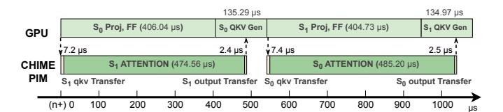

# C. Ablation Study

Ablation study for CHIME-PIM. We analyze our hardware optimizations for: (1) bubble-free pipelining (§V-A); (2) hybrid re-layout (§V-B). We implement a baseline banklevel CHIME-PIM that maps head computation across chips. Following prior work [68], we conservatively estimate the CPU-side re-layout cost as the memory access time required to read data stored with one layout and write it into another layout. Performance results with various token lengths are shown in Fig. 14. First, the bubble-free pipelining achieves about 27.9% and 74.4% latency reduction on MHA and GQA computation, respectively, which is attributed to the overlapping and specific head mapping methods. Second, the hardware hybrid re-layout enables up to 17% latency reduction. The reason why the proportion of gain decreases as token length increases is that the attention computation

Fig. 15. Improved resource efficiency with CHIME-sys. "1× Cap" denotes the basic memory capacity (2TB for GPT-175B and 1TB for QWEN-72B) according to Table II. The results are evaluated using the OpenR1 trace.

Fig. 16. PCIe overhead and energy consumption. "P" and " $\vec{D}$ " in (a) denotes the batch sizes and token lengths of prefilling and decoding requests in a batch. The energy consumption of "GPU" in (b) is normalized to 1.

gradually dominates the overall execution time. Nonetheless, we identify that it is still needed since the re-layout overheads accumulate in each layer of each token generation. With all hardware optimizations, CHIME shows  $1.42-4.18\times$  speedup. In addition, all bank-level implementations achieve over  $1.5\times$  speedup than the rank-level DIMM-PIM (R-DP).

Ablation study for scheduler. We evaluate how CHIME's scheduler effectively improves the resource utilization. Fig. 15 shows the average throughput and Time-between-Tokens (TBTs) of different scheduling methods on the left and right y-axes, respectively. The baseline represents the scheduling policy that prioritizes filling the capacity of CHIME-PIM, while CHIME denotes the alignment-predicting scheduling. The results show that CHIME's scheduler can significantly reduce latency by up to 70.93% without sacrificing the throughput, showing its ability of eliminating idle bubbles on the GPU side. CHIME even slightly improves the throughput by aligning the batches with prefilling requests and achieving better load balancing. Moreover, for the MHA model, if we increase the capacity of CHIME-PIM, the baseline selects larger batch sizes and causes higher TBTs without improving the throughput (since attention becomes the bottleneck), while CHIME can avoid generating bubbles and prevent the growth of TBT. CHIME performs better with MHA models, because with the GQA model, achieving the attention bottleneck requires selecting requests that occupy larger memory capacity, or it may not even achieve the attention bottleneck.

**PCIe overhead analysis.** We evaluate how the cross-device PCIe communication degrades the throughput with or without rankset-granular communication computation overlapping. As shown in Fig. 16, applying the optimization could reduce the overhead by up to 75.08% with different batch configurations. This indicates that with the 4 ranksets of DGX-

Fig. 17. **Decode execution timeline of CHIME pipeline for single LLM layer.** *The batch is executed with GPT-175B and the OpenR1 trace.*

A100, most PCIe overheads are hidden with independent communication and computation at the rankset granularity.

# C. Ablation Study

Ablation study for CHIME-PIM. We analyze our hardware optimizations for: (1) bubble-free pipelining (§V-A); (2) hybrid re-layout (§V-B). We implement a baseline banklevel CHIME-PIM that maps head computation across chips. Following prior work [68], we conservatively estimate the CPU-side re-layout cost as the memory access time required to read data stored with one layout and write it into another layout. Performance results with various token lengths are shown in Fig. 14. First, the bubble-free pipelining achieves about 27.9% and 74.4% latency reduction on MHA and GQA computation, respectively, which is attributed to the overlapping and specific head mapping methods. Second, the hardware hybrid re-layout enables up to 17% latency reduction. The reason why the proportion of gain decreases as token length increases is that the attention computation

Fig. 15. Improved resource efficiency with CHIME-sys. "1× Cap" denotes the basic memory capacity (2TB for GPT-175B and 1TB for QWEN-72B) according to Table II. The results are evaluated using the OpenR1 trace.

Fig. 16. PCIe overhead and energy consumption. "P" and " $\vec{D}$ " in (a) denotes the batch sizes and token lengths of prefilling and decoding requests in a batch. The energy consumption of "GPU" in (b) is normalized to 1.

gradually dominates the overall execution time. Nonetheless, we identify that it is still needed since the re-layout overheads accumulate in each layer of each token generation. With all hardware optimizations, CHIME shows  $1.42-4.18\times$  speedup. In addition, all bank-level implementations achieve over  $1.5\times$  speedup than the rank-level DIMM-PIM (R-DP).

Ablation study for scheduler. We evaluate how CHIME's scheduler effectively improves the resource utilization. Fig. 15 shows the average throughput and Time-between-Tokens (TBTs) of different scheduling methods on the left and right y-axes, respectively. The baseline represents the scheduling policy that prioritizes filling the capacity of CHIME-PIM, while CHIME denotes the alignment-predicting scheduling. The results show that CHIME's scheduler can significantly reduce latency by up to 70.93% without sacrificing the throughput, showing its ability of eliminating idle bubbles on the GPU side. CHIME even slightly improves the throughput by aligning the batches with prefilling requests and achieving better load balancing. Moreover, for the MHA model, if we increase the capacity of CHIME-PIM, the baseline selects larger batch sizes and causes higher TBTs without improving the throughput (since attention becomes the bottleneck), while CHIME can avoid generating bubbles and prevent the growth of TBT. CHIME performs better with MHA models, because with the GQA model, achieving the attention bottleneck requires selecting requests that occupy larger memory capacity, or it may not even achieve the attention bottleneck.

**PCIe overhead analysis.** We evaluate how the cross-device PCIe communication degrades the throughput with or without rankset-granular communication computation overlapping. As shown in Fig. 16, applying the optimization could reduce the overhead by up to 75.08% with different batch configurations. This indicates that with the 4 ranksets of DGX-

Fig. 17. **Decode execution timeline of CHIME pipeline for single LLM layer.** *The batch is executed with GPT-175B and the OpenR1 trace.*

A100, most PCIe overheads are hidden with independent communication and computation at the rankset granularity.

