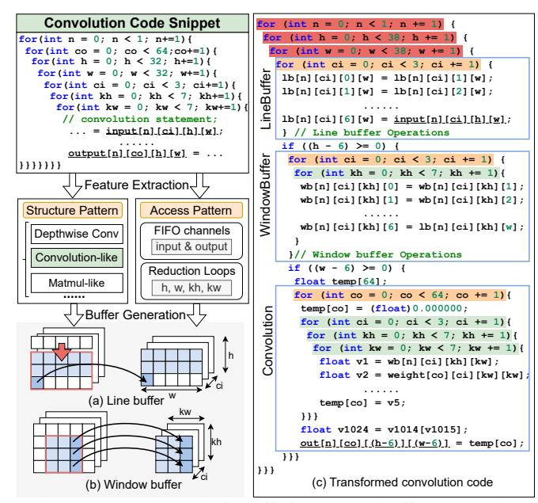
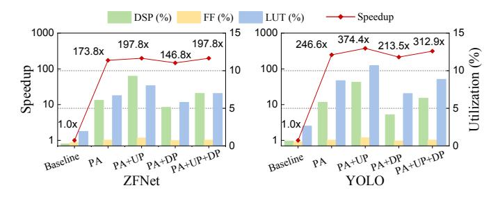
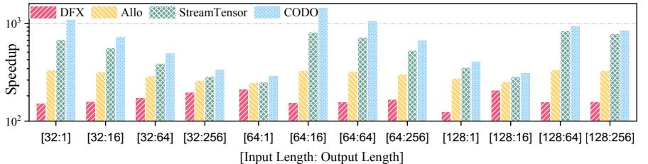
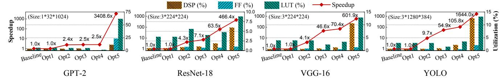
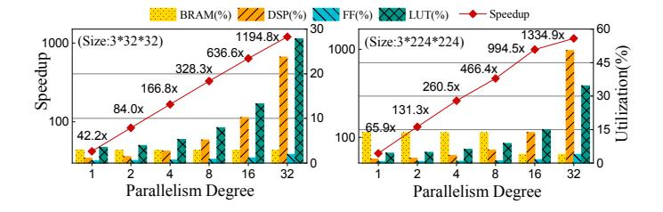

# B. Reuse Buffer Generation

Leveraging reuse buffers is effective to enhance data reuse and memory bandwidth, but integrating them into the design requires careful loop refactoring. Existing HLS frameworks often rely on user-defined DSLs, requiring developers to manually specify buffer sizes, communication buffer types, and address mappings for reused data [10], [24], [40]. This approach demands developer expertise and often leads to suboptimal or infeasible designs, as discussed in Section II-C. To this end, we propose a *violation-free reuse buffer generation* method that automatically exploits data reuse opportunities.

Violation-free Reuse Buffer Generation. To automatically generate efficient reuse buffers, CODO first analyzes the nested loop structure and the operations within each loop to identify computation-intensive kernels such as convolution and matrix multiplication. This is achieved by detecting common computation patterns, such as multiply-accumulate operations. It then extracts the input/output access patterns of the target array and analyzes the mapping between loop variables and array indices. Loop dimensions that appear in the array indices are identified as FIFO dimensions, while the remaining loop dimensions are treated as reduction dimensions. This information is guidance for subsequent reuse buffer generation. Taking the convolution example in Fig. 7, each output pixel depends on a small local region of the input feature map, and neighboring outputs reuse many input elements. These reuse opportunities align with the reduction dimensions. CODO automatically analyzes FIFO indices, identifies reduction dimensions that are independent of the FIFO, and constructs reuse buffers accordingly. Specifically, CODO constructs line

Fig. 7: Example code for efficient reuse buffer generation.

and window buffers based on the iteration domain of reduction loops (Fig. 7(a),(b)). The line buffer, denoted as lb[n][ci][kh][w], stores multiple rows of the input feature map. Its depth is equal to the kernel height (kh), retaining kh-1 rows to preserve history for subsequent computations. Each new input element (input[n][ci][h][w]) is written into the most recent position. The window buffer, denoted as wb[n][ci][kh][kw], maintains the full kh×kw window of the convolution kernel. For each new column w of the input, it updates by shifting existing contents horizontally and loading the new column from the line buffer. To prevent dataflow violations, CODO refactors loops while analyzing access patterns of FIFOs, ensuring that all loop dimensions are properly utilized. Specifically, loops involving FIFO accesses must neither include irrelevant dimensions nor omit necessary ones. For example, in Fig. 7 (c), the *input* and *output* arrays are optimized as FIFOs, and the nested loops enclosing them precisely align with the array indices, ensuring consistent data accesses. Note that this method is also applicable when the target array is implemented using ping-pong buffers.

Guidance for Parallelism Exploration. After reuse buffer generation, the rewritten code is ready for further optimizations through loop tiling, pipelining, unrolling, and array partitioning. However, as shown in Fig. 7, the generated loop is highly complex, making optimization challenging. By analyzing the internal computation behavior, we identify distinct parallelism opportunities. First, parallelizing the outermost red loop is unsafe, as it would unroll all three internal regions, introducing complex data dependencies and control issues. Second, the middle orange loops are associated with FIFO indices, and optimizing them could alter FIFO access patterns, potentially causing new violations. Finally, the innermost green loops are independent of FIFO behavior, making them safe for parallelization without introducing new violations.

Fig. 8: Speed and resource util. of parallelism exploration.

Based on the above analysis, a loop is legal to parallelize if it has no loop-carried dependencies. If the target loop variable appears in FIFO indices, parallelization remains feasible, but additional measures are needed to preserve the consistency of the data access pattern between producer and consumer. This analysis is crucial for the subsequent parallelism exploration, as it enables the effective pruning of the vast design space associated with large-scale models.

#### C. Off-chip Data Transfer Management

To improve off-chip bandwidth utilization, CODO automatically constructs efficient burst transfers between HBM and on-chip memory. It distributes parameters such as model weights across different HBM channels, enabling parallel access to independent memory regions. CODO provides a codo-transmit command, which automatically generates the host code and burst-access operations for kernels and users can specify the number of HBM channels allocated.

#### VI. AUTOMATED DATAFLOW SCHEDULING

After applying previous passes, dataflow violations are eliminated and buffers are inserted at suitable positions. Then CODO performs auto-scheduling to exploit parallelism without exceeding resource budgets and coordinate adjacent tasks without introducing new dataflow violations.

Challenges. Parallelism exploration in dataflow accelerators presents significant challenges: 1) improper parallelism strategies can disrupt latency balance between tasks, leading to degraded dataflow performance; 2) existing methods prioritize performance gains while neglecting the resource-performance tradeoff, which can result in excessive resource consumption; 3) certain parallelization strategies may alter FIFO access patterns, introducing new dataflow violations.

**Parallelism Exploration.** To address these challenges, we propose resource-aware bottleneck-centric design space exploration (DSE) to find optimal parallelism strategies, including loop tiling, pipelining, unrolling, and array partitioning configurations. Fig. 8 illustrates the speedup and resource utilization at each stage of the parallelism exploration process.

1) Stage One: Initial Parallelism Allocation (PA). The DSE begins by constructing a high-quality initial design with initial parallelism degrees. CODO employs a profiling-based performance model [48] [43]. Latencies and resource consumption of basic operations, such as adders, are profiled, serving as the performance model parameters. Then the latency of each

loop can be estimated based on their loop trip counts and parallelism strategies. After estimating the latency of each loop, CODO allocates parallelism degrees in proportion to their latencies, setting the smallest degree to 1. It then gradually scales up the parallelism of all loops while preserving their proportional ratios until reaching the user-specified upper bound or hardware resource limits. This process helps form a roughly balanced dataflow structure.

Unlike methods that parallelize loop dimensions randomly, CODO leverages insights from the earlier communication optimization pass. It prioritizes tiling loop dimensions that are independent of FIFO accesses, ensuring correct and efficient communication, and automatically applies HLS pragmas such as pipelining, unrolling, and array partitioning to generate the initial design. As shown in Fig. 8, this stage brings significant benefits, delivering latency speedups of  $173.8\times$  on ZFNet [45] and  $246.6\times$  on YOLO [36].

- 2) Stage Two: Upscaling (UP). We then traverse all bottleneck loops and re-estimate their latencies. If one loop's latency remains at least n times larger than the lowest loop latency, we increase its parallelism degree to  $\max\{\lceil n \rceil \times \text{initial degree, max degree}\}$  and search corresponding parallelism strategies. This process is iterative and terminates when the parallelism degree of all loops stabilizes or the iteration limit is reached. Note that this step aims to maximize the parallelism degree for each bottleneck loop, which may increase resource usage. As shown in Fig. 8, after PA+UP, the performance of both models is improved at the cost of extra resource consumption.
- 3) Stage Three: Downscaling (DP). Since the overall performance of a FIFO-based dataflow depends on the loop with the longest latency, we introduce a downscaling step to adjust over-optimized loops. If a loop is n times faster than the longest loop, it indicates that this loop has been over-optimized. In this case, we decrease the parallelism degree of the loop by a factor of n, reducing resource usage while maintaining a balanced dataflow. This step may slightly reduce overall performance, but users can configure CODO to enable or disable it based on their design goals. As shown in Fig. 8, after applying PA+UP+DP, ZFNet achieves the same speedup as the PA+UP design but with significantly lower resource consumption. Users can also bypass the UP stage and directly perform DP to pursue the most resource-efficient design, particularly in resource-constrained scenarios.

The parameter n acts as a balancing threshold in the parallelism exploration process. In practice, increasing loop parallelism through transformations such as loop unrolling typically has a minimum granularity of 2. Therefore, we empirically set n=2.0 to avoid skipping potentially optimal design points that might be missed if larger values (e.g., 3, 4, or 8) were used. We also observe that small variations around this value do not lead to noticeable performance differences. Developers can specify a customized value for n in codo-opt to adjust the exploration granularity based on their own design constraints.

Inter-task Optimization. After parallelism exploration, the

bottleneck loops are effectively optimized. However, if loop tiling is applied to dimensions used by FIFO, the loops connected to the other end of FIFO need to adopt the same parallelism strategy to maintain consistent data access behavior. CODO implements this by propagating the chosen loop tiling, unrolling, and array partitioning strategies of the bottleneck loop to its connected producer/consumer loops. These changes often reshape the loop structure, so we reinvoke our correctness passes to detect and resolve any newly introduced dataflow violations.

However, conflicts can arise during this stage. For example, consider a dataflow consisting of loops A, B, C, and D connected by FIFOs. If loops B and D adopt conflicting parallelism strategies, loop C may encounter an unresolvable violation. In such cases, CODO downgrades the buffer between loops C and D to a ping-pong buffer implementation, preserving the FIFO-based execution from loop A to loop C.

#### VII. IMPLEMENTATION

#### A. Frontend

CODO is seamlessly integrated into the MLIR infrastructure and supports two primary input pathways: (1) Polygeist [28] for translating C/C++ kernels directly into the affine dialect, and (2) Torch-MLIR [3] for importing PyTorch models. In the Torch-MLIR flow, models are first lowered to the linalg dialect, where built-in MLIR passes such as element-wise operator fusion and tensor bufferization are applied. The IR is then further lowered to the affine dialect, which serves as the primary representation for subsequent CODO optimizations. CODO targets affine programs with constant loop bounds, which covers a wide variety of kernels and layers in DNNs, linear algebra, and image processing, such as convolution, attention, activation layers (ReLU, GeLU), matrix multiplication, dot product, etc.

#### B. Optimization Passes

All optimizations are implemented as modular MLIR passes, enabling high extensibility, as illustrated in Fig. 3. After each transformation, MLIR's built-in verification checks IR validity, including dominance relations, SSA consistency, and type correctness. In addition, the canonicalize and cse (common sub-expression elimination) passes remove dead code and redundant computations [27]. Therefore, the MLIR infrastructure inherently guarantees IR validity throughout the compilation process. Loop transformation passes, including violation elimination and reuse buffer generation, operate primarily on the affine dialect. To optimize data communication, CODO introduces dedicated data types and operations to explicitly model FIFO and ping-pong buffers. Hardware-specific semantics, such as dataflow pragmas and array partitioning directives, are represented through an extended HLS dialect based on the version originally developed by HIDA [44].

#### C. Translation

After optimizations, the transformed IR is lowered to the host code and the HLS C++ kernel code. To ensure functional correctness, we adopt the verification pipeline from

TABLE II: Evaluation on typical kernel-level applications.

| Benchmark            | DSP | OSP Latency Speedup     |                |                |                |  |  |
|----------------------|-----|-------------------------|----------------|----------------|----------------|--|--|
| Demonium.            | 201 | CODO                    | StreamHLS      | Allo           | HIDA           |  |  |
| Atax                 | 602 | 853.3×                  | 640.1×         | 293.2×         | 11.1×          |  |  |
| Gesummv              | 562 | 369.1×                  | $382.4 \times$ | $329.1 \times$ | 79.8×          |  |  |
| Gemm                 | 826 | 500.8×                  | $600.4 \times$ | 177.4×         | 239.2×         |  |  |
| Mvt                  | 600 | $488.1 \times$          | 368.7×         | 249.5×         | 79.7×          |  |  |
| 3mm                  | 830 | 379.0×                  | $442.3 \times$ | 321.0×         | 180.5×         |  |  |
| Residual MLP         | 648 | 449.2×                  | 449.2×         | _              | -              |  |  |
| Autoencoder          | 696 | $329.4 \times$          | 329.3×         | 7.7×           | 141.4×         |  |  |
| Residual Block       | 488 | $225.8 \times$          | 99.1×          | _              | 127.7×         |  |  |
| DWSConv. Block       | 495 | $14.4 \times$           | $7.7 \times$   | _              | -              |  |  |
| 3-Layer Conv. Block  | 613 | $209.0 \times$          | 37.2×          | 122.1×         | _              |  |  |
| Feed Forward         | 604 | 513.2×                  | 256.6×         | $3.8 \times$   | -              |  |  |
| Multi-Head Attention | 848 | $\textbf{256.5} \times$ | 168.5×         | $4.0 \times$   | -              |  |  |
| DSE time             |     | (0.1s-0.5s)             | (35s-20min)    | -              | (0.4s-5min32s) |  |  |
| Geo. Mean            |     | 292.1×                  | 200.9×         | 64.7×          | 91.8×          |  |  |

StreamHLS [8], which automatically generates a testbench to validate functional equivalence by comparing the accelerator outputs with the golden results of the original program.

#### VIII. EXPERIMENTS

**Setup.** We evaluate performance with Xilinx Vitis HLS and Vivado 2023.2 for synthesis and hardware implementation. Latency and resource statistics are collected from HLS synthesis reports, and runtime and power statistics are measured through on-board evaluation. The platform is an AMD Alveo U280 FPGA board, containing 9024 DSP slices, 2.6M flipflops, 1.3M LUTs, and 4032 BRAM18K blocks. The target frequency is set to 300 MHz for all experiments.

Baseline and Workload. We compare CODO with six compilers, including ScaleHLS [43], POM [46], Allo [10], HIDA [44], StreamHLS [8], and StreamTensor [42], and an accelerator, DFX [17]. We begin by evaluating performance on typical kernel-level applications from PolyBench and widely used models [16], [18], [38], [39]. We further compare these frameworks on more complex DNN workloads, including ResNet-18 [16], VGG-16 [37], MobileNet [18], ZFNet [45], and YOLO [36]. To demonstrate CODO's applicability to large language models (LLMs), we also compare CODO against other frameworks on a transformer-based model, GPT-2 [35].

#### A. Evaluation on Typical Kernel-level Applications

The comparison is shown in Table II, presenting the *latency speedup* along with the resource usage of CODO. The *latency speedup* is computed through dividing the latency (#clock cycles) of the Vitis HLS-optimized code by that of the framework-optimized code. We set the same resource budget (DSP = 900, about 1/3 of the DSPs of a single super logic region) for all the frameworks. Allo, HIDA, and StreamHLS are compared because they focus on dataflow optimization, demonstrating higher performance on applications with multiple kernels compared to ScaleHLS and POM.

For simple kernels with few dataflow optimization opportunities in Polybench, CODO achieves competitive or higher latency speedups. For more complex deep learning workloads, HIDA delivers unsatisfying performance due to lacking support of FIFO-based dataflow, while Allo suffers from performance degradation due to the lack of automated scheduling.

TABLE III: Evaluation on different DNN models with input size 3\*32\*32.

| Application | Framework | Latency (cycles) | Speedup        | Compilation Time(s) | BRAM (Util.%) | DSP (Util.%) | FF (Util.%) | LUT (Util.%) |
|-------------|-----------|---------------------|----------------|------------------------|------------------|-----------------|----------------|-----------------|
|             | ScaleHLS  | 104.88M             | 5.3×           | 60.8                   | 8416 (208.7%)    | 1330 (14.7%)    | 144K (5.5%)    | 992K (76.1%)    |
| ResNet-18   | POM       | 20.33M              | $27.4 \times$  | 77.3                   | 0 (0.0%)         | 577 (6.4%)      | 22K (0.9%)     | 90K (6.9%)      |
| Keshet-10   | Allo      | 8.29M               | 66.9×          | -                      | 0 (0.0%)         | 652 (7.4%)      | 51K (3.5%)     | 124K (9.8%)     |
|             | CODO      | 1.69M               | $326.6 \times$ | 1.2                    | 116 (2.9%)       | 468 (5.2%)      | 22K (0.9%)     | 103K (7.9%)     |
|             | ScaleHLS  | 28.31M              | 6.8×           | 37.3                   | 3936 (97.6%)     | 882 (9.8%)      | 100K (3.8%)    | 714K (54.8%)    |
| VGG-16      | POM       | 10.16M              | $18.9 \times$  | 57.8                   | 0 (0.0%)         | 416 (4.6%)      | 19K (0.7%)     | 75K (5.7%)      |
| VGG-10      | Allo      | 3.85M               | 50.1×          | -                      | 0 (0.0%)         | 440 (4.9%)      | 36K (1.4%)     | 98K (7.5%)      |
|             | CODO      | 1.22M               | $158.0 \times$ | 1.0                    | 60 (1.7%)        | 376 (4.2%)      | 16K (0.6%)     | 79K (6.1%)      |
|             | ScaleHLS  | 2.17M               | 5.6×           | 38.1                   | 6796 (168.6%)    | 1778 (19.7%)    | 93K (3.6%)     | 518K (39.7%)    |
| MobileNet   | POM       | 2.02M               | $6.0 \times$   | 139.0                  | 0 (0.0%)         | 928 (11.7%)     | 33K (1.7%)     | 143K (13.1%)    |
| Monieriei   | Allo      | 0.26M               | 46.6×          | -                      | 0 (0.0%)         | 1942(21.5%)     | 57K (2.2%)     | 128K (9.8%)     |
|             | CODO      | 0.08M               | 151.5×         | 1.1                    | 70 (1.7%)        | 220 (2.4%)      | 14K (0.6%)     | 62K (4.8%)      |

TABLE IV: Evaluation on different DNN models with input size 3\*224\*224 (except YOLO: 3\*1280\*384).

| Application | Framework | Latency (cycles) | Speedup        | Compilation Time(s) | BRAM (Util.%) | DSP (Util.%) | FF (Util.%) | LUT (Util.%) |
|-------------|-----------|---------------------|----------------|------------------------|------------------|-----------------|----------------|-----------------|
| ResNet-18   | HIDA      | 74.85M              | 29.7×          | 83.1                   | 1857 (46.1%)     | 574 (6.4%)      | 48K (1.8%)     | 132K (10.2%)    |
|             | CODO      | <b>4.76M</b>        | <b>466.5</b> × | <b>1.4</b>             | 548 (13.6%)      | 535 (5.9%)      | 26K (1.0%)     | 115K (8.8%)     |
| VGG-16      | HIDA      | 56.93M              | 83.0×          | 199.9                  | 2344 (58.1%)     | 1163 (12.9%)    | 67K (2.6%)     | 209K (16.0%)    |
|             | CODO      | <b>7.85M</b>        | <b>601.8</b> × | <b>4.3</b>             | 141 (3.5%)       | 952 (10.5%)     | 32K (1.2%)     | 167K (12.8%)    |
| MobileNet   | HIDA      | 23.14M              | 23.4×          | 110.8                  | 2060 (51.1%)     | 782 (8.7%)      | 49K (1.9%)     | 141K (10.8%)    |
|             | CODO      | <b>2.02M</b>        | <b>268.5</b> × | <b>1.8</b>             | 256 (6.3%)       | 677 (7.5%)      | 23K (0.9%)     | 123K (9.4%)     |
| ZFNet       | HIDA      | 15.49M              | 69.9×          | 116.2                  | 1223 (30.3%)     | 644 (7.1%)      | 31K (1.2%)     | 83K (6.4%)      |
|             | CODO      | <b>5.48M</b>        | <b>197.7</b> × | <b>6.1</b>             | 68 (1.7%)        | 630 (7.0%)      | 20K (0.8%)     | 91K (7.0%)      |
| YOLO        | HIDA      | 59.64M              | 83.9×          | 188.2                  | 1989 (49.3%)     | 919 (10.2%)     | 50K (1.9%)     | 152K (11.7%)    |
|             | CODO      | <b>11.90M</b>       | <b>420.5</b> × | <b>4.4</b>             | 147 (3.6%)       | 1132 (12.5%)    | 53K (2.0%)     | 171K (13.1%)    |

StreamHLS fails to eliminate all violations and generates accelerators with discontinuous dataflow regions, leading to sequential or ping-pong-based execution in applications such as the 3-Layer Block and DWSConv. In contrast, CODO extensively eliminates fine-grained violations and performs communication buffer optimization, achieving  $1.45\times$ ,  $4.52\times$ , and  $3.18\times$  latency speedups on average compared to StreamHLS, Allo, and HIDA, respectively. For DSE time, StreamHLS's MINLP solver takes exponentially increased search time as the application complexity grows, whereas CODO only takes seconds to find a high-performance design for all applications.

### B. Evaluation on DNN Models

We compare CODO with SOTA frameworks on various DNN models. For fair comparison, we use the same input sizes as in ScaleHLS, POM, and Allo (3\*32\*32) and extend the comparison with HIDA to ZFNet and YOLO (3\*224\*224). StreamHLS fails to generate valid designs for large models, and StreamTensor is excluded as it only targets LLM acceleration. The results are shown in Table III and IV.

**Performance Comparison.** CODO significantly outperforms existing frameworks, achieving average speedups of  $33.8 \times$ ,  $13.6 \times$ ,  $3.7 \times$ , and  $7.1 \times$  over ScaleHLS, POM, Allo, and HIDA, respectively, while also reducing compilation time, defined as the time required for all optimizations, DSE, and code generation. The improvement stems from differences in optimization strategy. ScaleHLS and HIDA adopt ping-pongbased dataflow and overlook potential opportunities in more efficient FIFO-based dataflow. POM enhances loop parallelism

and resource reuse, but its strategy quickly reaches a performance ceiling as model size grows. Allo depends on user-specified schedules, often leading to suboptimal pipelines and partitions. In contrast, CODO eliminates both coarse- and fine-grained dataflow violations and prioritizes FIFO implementation, generating high-performance HLS designs.

Resource Usage Comparison. As shown in Tables III and IV, CODO significantly reduces BRAM usage compared to ScaleHLS and HIDA, benefiting from the better resource efficiency of FIFOs over ping-pong buffers. Allo shows 0% BRAM usage because its aggressive parallelism strategy partitions buffers into very small arrays that Vitis HLS maps to LUTRAM, leading to increased LUT consumption. CODO delivers the highest performance with similar or lower resource usage. This efficiency stems from two factors. First, compared to ping-pong-based designs such as ScaleHLS, CODO's FIFObased dataflow minimizes on-chip communication latency and stores only in-flight data, thereby achieving higher performance with reduced resource consumption, as discussed in Section II-A. Second, compared to other FIFO-based approaches such as Allo, CODO eliminates more dataflow violations through the co-optimization of correctness, communication, and parallelism, resulting in improved performance. In addition, the parallelism downscaling step removes redundant optimizations on non-critical loops, balancing the dataflow while conserving computation and memory resources.

**On-board Verification.** We validate CODO's ability to generate deployable dataflow accelerators on an AMD Alveo U280 FPGA. Among the compared frameworks, ScaleHLS

| Framework    | Platform | нвм  | Freq.  | Quant. |
|--------------|----------|------|--------|--------|
| DFX          | U280     | 8GB  | 200MHz | FP16   |
| Allo         | U280     | 8GB  | 250MHz | W4A8   |
| StreamTensor | U55C     | 16GB | 250MHz | W4A8   |
| CODO         | U280     | 8GB  | 300MHz | W4A8   |

Fig. 9: Left: Latency speedup over baseline on the GPT-2 model. Right: Experiment setup of evaluated platforms.

Fig. 10: Ablation study of different optimization methods.

| TABLE V: On-board Verification of DNN models. |                |                    |                  |      |                  |       |  |  |  |
|-----------------------------------------------|----------------|--------------------|------------------|------|------------------|-------|--|--|--|
| Application (input size)                      | Frame- work | Overall Speedup | Comp. Speedup | P(W) | Exec. Time(s) | E(J)  |  |  |  |
| ResNet-18                                     | Baseline       | 1×                 | $1 \times$       | 34.7 | 1.839            | 63.8  |  |  |  |
| (3*32*32)                                     | CODO           | $69.2 \times$      | $70.9 \times$    | 30.7 | 0.026            | 0.8   |  |  |  |
| VGG-16                                        | Baseline       | 1×                 | 1×               | 33.9 | 0.646            | 21.9  |  |  |  |
| (3*32*32)                                     | CODO           | 51.0×              | 55.9×            | 31.1 | 0.013            | 0.4   |  |  |  |
| MobileNet                                     | Baseline       | 1×                 | 1×               | 34.5 | 0.041            | 1.4   |  |  |  |
| (3*32*32)                                     | CODO           | 9.6×               | <b>9.8</b> ×     | 31.0 | 0.004            | 0.1   |  |  |  |
| ResNet-18                                     | Baseline       | 1×                 | 1×               | 31.8 | 7.364            | 234.0 |  |  |  |
| (3*224*224)                                   | HIDA           | 23.9×              | $29.1 \times$    | 32.8 | 0.308            | 10.1  |  |  |  |
| (3*224*224)                                   | CODO           | $100.6 \times$     | $101.6 \times$   | 31.1 | 0.073            | 2.5   |  |  |  |
| VGG-16                                        | Baseline       | 1×                 | 1×               | 34.2 | 15.825           | 541.2 |  |  |  |
| (3*224*224)                                   | HIDA           | 14.3×              | 82.7×            | 34.2 | 1.108            | 37.9  |  |  |  |
| (3*224*224)                                   | CODO           | $127.5 \times$     | $138.5 \times$   | 31.2 | 0.124            | 3.9   |  |  |  |
| MobileNet                                     | Baseline       | 1×                 | 1×               | 34.7 | 1.689            | 58.6  |  |  |  |
|                                               | HIDA           | $10.0 \times$      | 21.8×            | 31.4 | 0.169            | 5.3   |  |  |  |
| (3*224*224)                                   | CODO           | 43.8×              | 44.2×            | 33.3 | 0.039            | 1.3   |  |  |  |
| ZFNet                                         | Baseline       | 1×                 | 1×               | 30.8 | 3.692            | 113.7 |  |  |  |
|                                               | HIDA           | 6.2×               | 61.5×            | 32.2 | 0.593            | 19.1  |  |  |  |
| (3*224*224)                                   | CODO           | 110.7 $\times$     | 130.9×           | 29.9 | 0.034            | 1.0   |  |  |  |

fails due to excessive memory usage, Allo encounters dead-locks from fine-grained dataflow violations, and StreamHLS cannot generate valid designs for any workload. CODO and HIDA successfully generate executable accelerators for all models except YOLO, where inaccurate resource estimation in Vitis HLS prevents implementation. Table V shows the on-board evaluation results of DNN models, including runtime speedup, power and energy consumption, and execution time. The overall speedup denotes end-to-end performance, including off-chip data communication, whereas comp. speedup focuses exclusively on computation kernels. CODO's higher performance also enables it to achieve the lowest energy consumption, with  $77.1\times$  and  $9.2\times$  energy efficiency on average compared to the baseline and HIDA, respectively.

#### C. Evaluation on the GPT-2 Model

To demonstrate CODO's applicability to LLM workloads, we evaluate performance on GPT-2 Medium [31]. Allo and DFX provide manually optimized implementations of GPT-2, and StreamTensor automatically generates optimized GPT-2 accelerators. The remaining compilers do not support transformer models and are therefore excluded from comparison.

Fig. 11: Latency speedup and resource usage of ResNet-18 under different degrees of parallelism.

The evaluation setup and latency speedups over Vitis HLS-optimized baselines across different input/output sequence lengths are summarized in Fig. 9. Table VI provides a detailed comparison, showing TTFT for prefill performance and Speed for decoding performance.

Compared to manually optimized designs, CODO provides substantial gains. DFX and Allo require hand-crafted implementations and manual coordination of kernels and data transfers, which is time-consuming, error-prone, and often leads to suboptimal dataflow. In contrast, CODO's automatic DSE quickly generates FIFO-based accelerators, resulting in  $3.54\times$  and  $2.03\times$  speedups over DFX and Allo, respectively.

CODO also outperforms StreamTensor, achieving a 1.23× speedup, even though StreamTensor runs on a more advanced U55C FPGA. Although StreamTensor supports automated DSE, it reverts to a ping-pong execution strategy whenever fine-grained violations are detected, which ultimately limits overall performance. In contrast, CODO eliminates these violations as much as possible and applies communication optimizations to ensure high data transfer efficiency. As a result, CODO surpasses StreamTensor even though StreamTensor executes on an FPGA with larger HBM capacity.

# B. Reuse Buffer Generation

Leveraging reuse buffers is effective to enhance data reuse and memory bandwidth, but integrating them into the design requires careful loop refactoring. Existing HLS frameworks often rely on user-defined DSLs, requiring developers to manually specify buffer sizes, communication buffer types, and address mappings for reused data [10], [24], [40]. This approach demands developer expertise and often leads to suboptimal or infeasible designs, as discussed in Section II-C. To this end, we propose a *violation-free reuse buffer generation* method that automatically exploits data reuse opportunities.

Violation-free Reuse Buffer Generation. To automatically generate efficient reuse buffers, CODO first analyzes the nested loop structure and the operations within each loop to identify computation-intensive kernels such as convolution and matrix multiplication. This is achieved by detecting common computation patterns, such as multiply-accumulate operations. It then extracts the input/output access patterns of the target array and analyzes the mapping between loop variables and array indices. Loop dimensions that appear in the array indices are identified as FIFO dimensions, while the remaining loop dimensions are treated as reduction dimensions. This information is guidance for subsequent reuse buffer generation. Taking the convolution example in Fig. 7, each output pixel depends on a small local region of the input feature map, and neighboring outputs reuse many input elements. These reuse opportunities align with the reduction dimensions. CODO automatically analyzes FIFO indices, identifies reduction dimensions that are independent of the FIFO, and constructs reuse buffers accordingly. Specifically, CODO constructs line

Fig. 7: Example code for efficient reuse buffer generation.

and window buffers based on the iteration domain of reduction loops (Fig. 7(a),(b)). The line buffer, denoted as lb[n][ci][kh][w], stores multiple rows of the input feature map. Its depth is equal to the kernel height (kh), retaining kh-1 rows to preserve history for subsequent computations. Each new input element (input[n][ci][h][w]) is written into the most recent position. The window buffer, denoted as wb[n][ci][kh][kw], maintains the full kh×kw window of the convolution kernel. For each new column w of the input, it updates by shifting existing contents horizontally and loading the new column from the line buffer. To prevent dataflow violations, CODO refactors loops while analyzing access patterns of FIFOs, ensuring that all loop dimensions are properly utilized. Specifically, loops involving FIFO accesses must neither include irrelevant dimensions nor omit necessary ones. For example, in Fig. 7 (c), the *input* and *output* arrays are optimized as FIFOs, and the nested loops enclosing them precisely align with the array indices, ensuring consistent data accesses. Note that this method is also applicable when the target array is implemented using ping-pong buffers.

Guidance for Parallelism Exploration. After reuse buffer generation, the rewritten code is ready for further optimizations through loop tiling, pipelining, unrolling, and array partitioning. However, as shown in Fig. 7, the generated loop is highly complex, making optimization challenging. By analyzing the internal computation behavior, we identify distinct parallelism opportunities. First, parallelizing the outermost red loop is unsafe, as it would unroll all three internal regions, introducing complex data dependencies and control issues. Second, the middle orange loops are associated with FIFO indices, and optimizing them could alter FIFO access patterns, potentially causing new violations. Finally, the innermost green loops are independent of FIFO behavior, making them safe for parallelization without introducing new violations.

Fig. 8: Speed and resource util. of parallelism exploration.

Based on the above analysis, a loop is legal to parallelize if it has no loop-carried dependencies. If the target loop variable appears in FIFO indices, parallelization remains feasible, but additional measures are needed to preserve the consistency of the data access pattern between producer and consumer. This analysis is crucial for the subsequent parallelism exploration, as it enables the effective pruning of the vast design space associated with large-scale models.

#### C. Off-chip Data Transfer Management

To improve off-chip bandwidth utilization, CODO automatically constructs efficient burst transfers between HBM and on-chip memory. It distributes parameters such as model weights across different HBM channels, enabling parallel access to independent memory regions. CODO provides a codo-transmit command, which automatically generates the host code and burst-access operations for kernels and users can specify the number of HBM channels allocated.

#### VI. AUTOMATED DATAFLOW SCHEDULING

After applying previous passes, dataflow violations are eliminated and buffers are inserted at suitable positions. Then CODO performs auto-scheduling to exploit parallelism without exceeding resource budgets and coordinate adjacent tasks without introducing new dataflow violations.

Challenges. Parallelism exploration in dataflow accelerators presents significant challenges: 1) improper parallelism strategies can disrupt latency balance between tasks, leading to degraded dataflow performance; 2) existing methods prioritize performance gains while neglecting the resource-performance tradeoff, which can result in excessive resource consumption; 3) certain parallelization strategies may alter FIFO access patterns, introducing new dataflow violations.

**Parallelism Exploration.** To address these challenges, we propose resource-aware bottleneck-centric design space exploration (DSE) to find optimal parallelism strategies, including loop tiling, pipelining, unrolling, and array partitioning configurations. Fig. 8 illustrates the speedup and resource utilization at each stage of the parallelism exploration process.

1) Stage One: Initial Parallelism Allocation (PA). The DSE begins by constructing a high-quality initial design with initial parallelism degrees. CODO employs a profiling-based performance model [48] [43]. Latencies and resource consumption of basic operations, such as adders, are profiled, serving as the performance model parameters. Then the latency of each

loop can be estimated based on their loop trip counts and parallelism strategies. After estimating the latency of each loop, CODO allocates parallelism degrees in proportion to their latencies, setting the smallest degree to 1. It then gradually scales up the parallelism of all loops while preserving their proportional ratios until reaching the user-specified upper bound or hardware resource limits. This process helps form a roughly balanced dataflow structure.

Unlike methods that parallelize loop dimensions randomly, CODO leverages insights from the earlier communication optimization pass. It prioritizes tiling loop dimensions that are independent of FIFO accesses, ensuring correct and efficient communication, and automatically applies HLS pragmas such as pipelining, unrolling, and array partitioning to generate the initial design. As shown in Fig. 8, this stage brings significant benefits, delivering latency speedups of  $173.8\times$  on ZFNet [45] and  $246.6\times$  on YOLO [36].

- 2) Stage Two: Upscaling (UP). We then traverse all bottleneck loops and re-estimate their latencies. If one loop's latency remains at least n times larger than the lowest loop latency, we increase its parallelism degree to  $\max\{\lceil n \rceil \times \text{initial degree, max degree}\}$  and search corresponding parallelism strategies. This process is iterative and terminates when the parallelism degree of all loops stabilizes or the iteration limit is reached. Note that this step aims to maximize the parallelism degree for each bottleneck loop, which may increase resource usage. As shown in Fig. 8, after PA+UP, the performance of both models is improved at the cost of extra resource consumption.
- 3) Stage Three: Downscaling (DP). Since the overall performance of a FIFO-based dataflow depends on the loop with the longest latency, we introduce a downscaling step to adjust over-optimized loops. If a loop is n times faster than the longest loop, it indicates that this loop has been over-optimized. In this case, we decrease the parallelism degree of the loop by a factor of n, reducing resource usage while maintaining a balanced dataflow. This step may slightly reduce overall performance, but users can configure CODO to enable or disable it based on their design goals. As shown in Fig. 8, after applying PA+UP+DP, ZFNet achieves the same speedup as the PA+UP design but with significantly lower resource consumption. Users can also bypass the UP stage and directly perform DP to pursue the most resource-efficient design, particularly in resource-constrained scenarios.

The parameter n acts as a balancing threshold in the parallelism exploration process. In practice, increasing loop parallelism through transformations such as loop unrolling typically has a minimum granularity of 2. Therefore, we empirically set n=2.0 to avoid skipping potentially optimal design points that might be missed if larger values (e.g., 3, 4, or 8) were used. We also observe that small variations around this value do not lead to noticeable performance differences. Developers can specify a customized value for n in codo-opt to adjust the exploration granularity based on their own design constraints.

Inter-task Optimization. After parallelism exploration, the

bottleneck loops are effectively optimized. However, if loop tiling is applied to dimensions used by FIFO, the loops connected to the other end of FIFO need to adopt the same parallelism strategy to maintain consistent data access behavior. CODO implements this by propagating the chosen loop tiling, unrolling, and array partitioning strategies of the bottleneck loop to its connected producer/consumer loops. These changes often reshape the loop structure, so we reinvoke our correctness passes to detect and resolve any newly introduced dataflow violations.

However, conflicts can arise during this stage. For example, consider a dataflow consisting of loops A, B, C, and D connected by FIFOs. If loops B and D adopt conflicting parallelism strategies, loop C may encounter an unresolvable violation. In such cases, CODO downgrades the buffer between loops C and D to a ping-pong buffer implementation, preserving the FIFO-based execution from loop A to loop C.

#### VII. IMPLEMENTATION

#### A. Frontend

CODO is seamlessly integrated into the MLIR infrastructure and supports two primary input pathways: (1) Polygeist [28] for translating C/C++ kernels directly into the affine dialect, and (2) Torch-MLIR [3] for importing PyTorch models. In the Torch-MLIR flow, models are first lowered to the linalg dialect, where built-in MLIR passes such as element-wise operator fusion and tensor bufferization are applied. The IR is then further lowered to the affine dialect, which serves as the primary representation for subsequent CODO optimizations. CODO targets affine programs with constant loop bounds, which covers a wide variety of kernels and layers in DNNs, linear algebra, and image processing, such as convolution, attention, activation layers (ReLU, GeLU), matrix multiplication, dot product, etc.

#### B. Optimization Passes

All optimizations are implemented as modular MLIR passes, enabling high extensibility, as illustrated in Fig. 3. After each transformation, MLIR's built-in verification checks IR validity, including dominance relations, SSA consistency, and type correctness. In addition, the canonicalize and cse (common sub-expression elimination) passes remove dead code and redundant computations [27]. Therefore, the MLIR infrastructure inherently guarantees IR validity throughout the compilation process. Loop transformation passes, including violation elimination and reuse buffer generation, operate primarily on the affine dialect. To optimize data communication, CODO introduces dedicated data types and operations to explicitly model FIFO and ping-pong buffers. Hardware-specific semantics, such as dataflow pragmas and array partitioning directives, are represented through an extended HLS dialect based on the version originally developed by HIDA [44].

#### C. Translation

After optimizations, the transformed IR is lowered to the host code and the HLS C++ kernel code. To ensure functional correctness, we adopt the verification pipeline from

TABLE II: Evaluation on typical kernel-level applications.

| Benchmark            | DSP | OSP Latency Speedup     |                |                |                |  |  |
|----------------------|-----|-------------------------|----------------|----------------|----------------|--|--|
| Demonium.            | 201 | CODO                    | StreamHLS      | Allo           | HIDA           |  |  |
| Atax                 | 602 | 853.3×                  | 640.1×         | 293.2×         | 11.1×          |  |  |
| Gesummv              | 562 | 369.1×                  | $382.4 \times$ | $329.1 \times$ | 79.8×          |  |  |
| Gemm                 | 826 | 500.8×                  | $600.4 \times$ | 177.4×         | 239.2×         |  |  |
| Mvt                  | 600 | $488.1 \times$          | 368.7×         | 249.5×         | 79.7×          |  |  |
| 3mm                  | 830 | 379.0×                  | $442.3 \times$ | 321.0×         | 180.5×         |  |  |
| Residual MLP         | 648 | 449.2×                  | 449.2×         | _              | -              |  |  |
| Autoencoder          | 696 | $329.4 \times$          | 329.3×         | 7.7×           | 141.4×         |  |  |
| Residual Block       | 488 | $225.8 \times$          | 99.1×          | _              | 127.7×         |  |  |
| DWSConv. Block       | 495 | $14.4 \times$           | $7.7 \times$   | _              | -              |  |  |
| 3-Layer Conv. Block  | 613 | $209.0 \times$          | 37.2×          | 122.1×         | _              |  |  |
| Feed Forward         | 604 | 513.2×                  | 256.6×         | $3.8 \times$   | -              |  |  |
| Multi-Head Attention | 848 | $\textbf{256.5} \times$ | 168.5×         | $4.0 \times$   | -              |  |  |
| DSE time             |     | (0.1s-0.5s)             | (35s-20min)    | -              | (0.4s-5min32s) |  |  |
| Geo. Mean            |     | 292.1×                  | 200.9×         | 64.7×          | 91.8×          |  |  |

StreamHLS [8], which automatically generates a testbench to validate functional equivalence by comparing the accelerator outputs with the golden results of the original program.

#### VIII. EXPERIMENTS

**Setup.** We evaluate performance with Xilinx Vitis HLS and Vivado 2023.2 for synthesis and hardware implementation. Latency and resource statistics are collected from HLS synthesis reports, and runtime and power statistics are measured through on-board evaluation. The platform is an AMD Alveo U280 FPGA board, containing 9024 DSP slices, 2.6M flipflops, 1.3M LUTs, and 4032 BRAM18K blocks. The target frequency is set to 300 MHz for all experiments.

Baseline and Workload. We compare CODO with six compilers, including ScaleHLS [43], POM [46], Allo [10], HIDA [44], StreamHLS [8], and StreamTensor [42], and an accelerator, DFX [17]. We begin by evaluating performance on typical kernel-level applications from PolyBench and widely used models [16], [18], [38], [39]. We further compare these frameworks on more complex DNN workloads, including ResNet-18 [16], VGG-16 [37], MobileNet [18], ZFNet [45], and YOLO [36]. To demonstrate CODO's applicability to large language models (LLMs), we also compare CODO against other frameworks on a transformer-based model, GPT-2 [35].

#### A. Evaluation on Typical Kernel-level Applications

The comparison is shown in Table II, presenting the *latency speedup* along with the resource usage of CODO. The *latency speedup* is computed through dividing the latency (#clock cycles) of the Vitis HLS-optimized code by that of the framework-optimized code. We set the same resource budget (DSP = 900, about 1/3 of the DSPs of a single super logic region) for all the frameworks. Allo, HIDA, and StreamHLS are compared because they focus on dataflow optimization, demonstrating higher performance on applications with multiple kernels compared to ScaleHLS and POM.

For simple kernels with few dataflow optimization opportunities in Polybench, CODO achieves competitive or higher latency speedups. For more complex deep learning workloads, HIDA delivers unsatisfying performance due to lacking support of FIFO-based dataflow, while Allo suffers from performance degradation due to the lack of automated scheduling.

TABLE III: Evaluation on different DNN models with input size 3\*32\*32.

| Application | Framework | Latency (cycles) | Speedup        | Compilation Time(s) | BRAM (Util.%) | DSP (Util.%) | FF (Util.%) | LUT (Util.%) |
|-------------|-----------|---------------------|----------------|------------------------|------------------|-----------------|----------------|-----------------|
|             | ScaleHLS  | 104.88M             | 5.3×           | 60.8                   | 8416 (208.7%)    | 1330 (14.7%)    | 144K (5.5%)    | 992K (76.1%)    |
| ResNet-18   | POM       | 20.33M              | $27.4 \times$  | 77.3                   | 0 (0.0%)         | 577 (6.4%)      | 22K (0.9%)     | 90K (6.9%)      |
| Keshet-10   | Allo      | 8.29M               | 66.9×          | -                      | 0 (0.0%)         | 652 (7.4%)      | 51K (3.5%)     | 124K (9.8%)     |
|             | CODO      | 1.69M               | $326.6 \times$ | 1.2                    | 116 (2.9%)       | 468 (5.2%)      | 22K (0.9%)     | 103K (7.9%)     |
|             | ScaleHLS  | 28.31M              | 6.8×           | 37.3                   | 3936 (97.6%)     | 882 (9.8%)      | 100K (3.8%)    | 714K (54.8%)    |
| VGG-16      | POM       | 10.16M              | $18.9 \times$  | 57.8                   | 0 (0.0%)         | 416 (4.6%)      | 19K (0.7%)     | 75K (5.7%)      |
| VGG-10      | Allo      | 3.85M               | 50.1×          | -                      | 0 (0.0%)         | 440 (4.9%)      | 36K (1.4%)     | 98K (7.5%)      |
|             | CODO      | 1.22M               | $158.0 \times$ | 1.0                    | 60 (1.7%)        | 376 (4.2%)      | 16K (0.6%)     | 79K (6.1%)      |
|             | ScaleHLS  | 2.17M               | 5.6×           | 38.1                   | 6796 (168.6%)    | 1778 (19.7%)    | 93K (3.6%)     | 518K (39.7%)    |
| MobileNet   | POM       | 2.02M               | $6.0 \times$   | 139.0                  | 0 (0.0%)         | 928 (11.7%)     | 33K (1.7%)     | 143K (13.1%)    |
| Monieriei   | Allo      | 0.26M               | 46.6×          | -                      | 0 (0.0%)         | 1942(21.5%)     | 57K (2.2%)     | 128K (9.8%)     |
|             | CODO      | 0.08M               | 151.5×         | 1.1                    | 70 (1.7%)        | 220 (2.4%)      | 14K (0.6%)     | 62K (4.8%)      |

TABLE IV: Evaluation on different DNN models with input size 3\*224\*224 (except YOLO: 3\*1280\*384).

| Application | Framework | Latency (cycles) | Speedup        | Compilation Time(s) | BRAM (Util.%) | DSP (Util.%) | FF (Util.%) | LUT (Util.%) |
|-------------|-----------|---------------------|----------------|------------------------|------------------|-----------------|----------------|-----------------|
| ResNet-18   | HIDA      | 74.85M              | 29.7×          | 83.1                   | 1857 (46.1%)     | 574 (6.4%)      | 48K (1.8%)     | 132K (10.2%)    |
|             | CODO      | <b>4.76M</b>        | <b>466.5</b> × | <b>1.4</b>             | 548 (13.6%)      | 535 (5.9%)      | 26K (1.0%)     | 115K (8.8%)     |
| VGG-16      | HIDA      | 56.93M              | 83.0×          | 199.9                  | 2344 (58.1%)     | 1163 (12.9%)    | 67K (2.6%)     | 209K (16.0%)    |
|             | CODO      | <b>7.85M</b>        | <b>601.8</b> × | <b>4.3</b>             | 141 (3.5%)       | 952 (10.5%)     | 32K (1.2%)     | 167K (12.8%)    |
| MobileNet   | HIDA      | 23.14M              | 23.4×          | 110.8                  | 2060 (51.1%)     | 782 (8.7%)      | 49K (1.9%)     | 141K (10.8%)    |
|             | CODO      | <b>2.02M</b>        | <b>268.5</b> × | <b>1.8</b>             | 256 (6.3%)       | 677 (7.5%)      | 23K (0.9%)     | 123K (9.4%)     |
| ZFNet       | HIDA      | 15.49M              | 69.9×          | 116.2                  | 1223 (30.3%)     | 644 (7.1%)      | 31K (1.2%)     | 83K (6.4%)      |
|             | CODO      | <b>5.48M</b>        | <b>197.7</b> × | <b>6.1</b>             | 68 (1.7%)        | 630 (7.0%)      | 20K (0.8%)     | 91K (7.0%)      |
| YOLO        | HIDA      | 59.64M              | 83.9×          | 188.2                  | 1989 (49.3%)     | 919 (10.2%)     | 50K (1.9%)     | 152K (11.7%)    |
|             | CODO      | <b>11.90M</b>       | <b>420.5</b> × | <b>4.4</b>             | 147 (3.6%)       | 1132 (12.5%)    | 53K (2.0%)     | 171K (13.1%)    |

StreamHLS fails to eliminate all violations and generates accelerators with discontinuous dataflow regions, leading to sequential or ping-pong-based execution in applications such as the 3-Layer Block and DWSConv. In contrast, CODO extensively eliminates fine-grained violations and performs communication buffer optimization, achieving  $1.45\times$ ,  $4.52\times$ , and  $3.18\times$  latency speedups on average compared to StreamHLS, Allo, and HIDA, respectively. For DSE time, StreamHLS's MINLP solver takes exponentially increased search time as the application complexity grows, whereas CODO only takes seconds to find a high-performance design for all applications.

### B. Evaluation on DNN Models

We compare CODO with SOTA frameworks on various DNN models. For fair comparison, we use the same input sizes as in ScaleHLS, POM, and Allo (3\*32\*32) and extend the comparison with HIDA to ZFNet and YOLO (3\*224\*224). StreamHLS fails to generate valid designs for large models, and StreamTensor is excluded as it only targets LLM acceleration. The results are shown in Table III and IV.

**Performance Comparison.** CODO significantly outperforms existing frameworks, achieving average speedups of  $33.8 \times$ ,  $13.6 \times$ ,  $3.7 \times$ , and  $7.1 \times$  over ScaleHLS, POM, Allo, and HIDA, respectively, while also reducing compilation time, defined as the time required for all optimizations, DSE, and code generation. The improvement stems from differences in optimization strategy. ScaleHLS and HIDA adopt ping-pongbased dataflow and overlook potential opportunities in more efficient FIFO-based dataflow. POM enhances loop parallelism

and resource reuse, but its strategy quickly reaches a performance ceiling as model size grows. Allo depends on user-specified schedules, often leading to suboptimal pipelines and partitions. In contrast, CODO eliminates both coarse- and fine-grained dataflow violations and prioritizes FIFO implementation, generating high-performance HLS designs.

Resource Usage Comparison. As shown in Tables III and IV, CODO significantly reduces BRAM usage compared to ScaleHLS and HIDA, benefiting from the better resource efficiency of FIFOs over ping-pong buffers. Allo shows 0% BRAM usage because its aggressive parallelism strategy partitions buffers into very small arrays that Vitis HLS maps to LUTRAM, leading to increased LUT consumption. CODO delivers the highest performance with similar or lower resource usage. This efficiency stems from two factors. First, compared to ping-pong-based designs such as ScaleHLS, CODO's FIFObased dataflow minimizes on-chip communication latency and stores only in-flight data, thereby achieving higher performance with reduced resource consumption, as discussed in Section II-A. Second, compared to other FIFO-based approaches such as Allo, CODO eliminates more dataflow violations through the co-optimization of correctness, communication, and parallelism, resulting in improved performance. In addition, the parallelism downscaling step removes redundant optimizations on non-critical loops, balancing the dataflow while conserving computation and memory resources.

**On-board Verification.** We validate CODO's ability to generate deployable dataflow accelerators on an AMD Alveo U280 FPGA. Among the compared frameworks, ScaleHLS

| Framework    | Platform | нвм  | Freq.  | Quant. |
|--------------|----------|------|--------|--------|
| DFX          | U280     | 8GB  | 200MHz | FP16   |
| Allo         | U280     | 8GB  | 250MHz | W4A8   |
| StreamTensor | U55C     | 16GB | 250MHz | W4A8   |
| CODO         | U280     | 8GB  | 300MHz | W4A8   |

Fig. 9: Left: Latency speedup over baseline on the GPT-2 model. Right: Experiment setup of evaluated platforms.

Fig. 10: Ablation study of different optimization methods.

| TABLE V: On-board Verification of DNN models. |                |                    |                  |      |                  |       |  |  |  |
|-----------------------------------------------|----------------|--------------------|------------------|------|------------------|-------|--|--|--|
| Application (input size)                      | Frame- work | Overall Speedup | Comp. Speedup | P(W) | Exec. Time(s) | E(J)  |  |  |  |
| ResNet-18                                     | Baseline       | 1×                 | $1 \times$       | 34.7 | 1.839            | 63.8  |  |  |  |
| (3*32*32)                                     | CODO           | $69.2 \times$      | $70.9 \times$    | 30.7 | 0.026            | 0.8   |  |  |  |
| VGG-16                                        | Baseline       | 1×                 | 1×               | 33.9 | 0.646            | 21.9  |  |  |  |
| (3*32*32)                                     | CODO           | 51.0×              | 55.9×            | 31.1 | 0.013            | 0.4   |  |  |  |
| MobileNet                                     | Baseline       | 1×                 | 1×               | 34.5 | 0.041            | 1.4   |  |  |  |
| (3*32*32)                                     | CODO           | 9.6×               | <b>9.8</b> ×     | 31.0 | 0.004            | 0.1   |  |  |  |
| ResNet-18                                     | Baseline       | 1×                 | 1×               | 31.8 | 7.364            | 234.0 |  |  |  |
| (3*224*224)                                   | HIDA           | 23.9×              | $29.1 \times$    | 32.8 | 0.308            | 10.1  |  |  |  |
| (3*224*224)                                   | CODO           | $100.6 \times$     | $101.6 \times$   | 31.1 | 0.073            | 2.5   |  |  |  |
| VGG-16                                        | Baseline       | 1×                 | 1×               | 34.2 | 15.825           | 541.2 |  |  |  |
| (3*224*224)                                   | HIDA           | 14.3×              | 82.7×            | 34.2 | 1.108            | 37.9  |  |  |  |
| (3*224*224)                                   | CODO           | $127.5 \times$     | $138.5 \times$   | 31.2 | 0.124            | 3.9   |  |  |  |
| MobileNet                                     | Baseline       | 1×                 | 1×               | 34.7 | 1.689            | 58.6  |  |  |  |
|                                               | HIDA           | $10.0 \times$      | 21.8×            | 31.4 | 0.169            | 5.3   |  |  |  |
| (3*224*224)                                   | CODO           | 43.8×              | 44.2×            | 33.3 | 0.039            | 1.3   |  |  |  |
| ZFNet                                         | Baseline       | 1×                 | 1×               | 30.8 | 3.692            | 113.7 |  |  |  |
|                                               | HIDA           | 6.2×               | 61.5×            | 32.2 | 0.593            | 19.1  |  |  |  |
| (3*224*224)                                   | CODO           | 110.7 $\times$     | 130.9×           | 29.9 | 0.034            | 1.0   |  |  |  |

fails due to excessive memory usage, Allo encounters dead-locks from fine-grained dataflow violations, and StreamHLS cannot generate valid designs for any workload. CODO and HIDA successfully generate executable accelerators for all models except YOLO, where inaccurate resource estimation in Vitis HLS prevents implementation. Table V shows the on-board evaluation results of DNN models, including runtime speedup, power and energy consumption, and execution time. The overall speedup denotes end-to-end performance, including off-chip data communication, whereas comp. speedup focuses exclusively on computation kernels. CODO's higher performance also enables it to achieve the lowest energy consumption, with  $77.1\times$  and  $9.2\times$  energy efficiency on average compared to the baseline and HIDA, respectively.

#### C. Evaluation on the GPT-2 Model

To demonstrate CODO's applicability to LLM workloads, we evaluate performance on GPT-2 Medium [31]. Allo and DFX provide manually optimized implementations of GPT-2, and StreamTensor automatically generates optimized GPT-2 accelerators. The remaining compilers do not support transformer models and are therefore excluded from comparison.

Fig. 11: Latency speedup and resource usage of ResNet-18 under different degrees of parallelism.

The evaluation setup and latency speedups over Vitis HLS-optimized baselines across different input/output sequence lengths are summarized in Fig. 9. Table VI provides a detailed comparison, showing TTFT for prefill performance and Speed for decoding performance.

Compared to manually optimized designs, CODO provides substantial gains. DFX and Allo require hand-crafted implementations and manual coordination of kernels and data transfers, which is time-consuming, error-prone, and often leads to suboptimal dataflow. In contrast, CODO's automatic DSE quickly generates FIFO-based accelerators, resulting in  $3.54\times$  and  $2.03\times$  speedups over DFX and Allo, respectively.

CODO also outperforms StreamTensor, achieving a 1.23× speedup, even though StreamTensor runs on a more advanced U55C FPGA. Although StreamTensor supports automated DSE, it reverts to a ping-pong execution strategy whenever fine-grained violations are detected, which ultimately limits overall performance. In contrast, CODO eliminates these violations as much as possible and applies communication optimizations to ensure high data transfer efficiency. As a result, CODO surpasses StreamTensor even though StreamTensor executes on an FPGA with larger HBM capacity.

