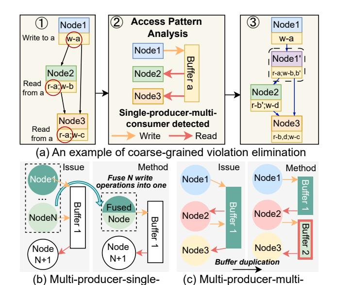
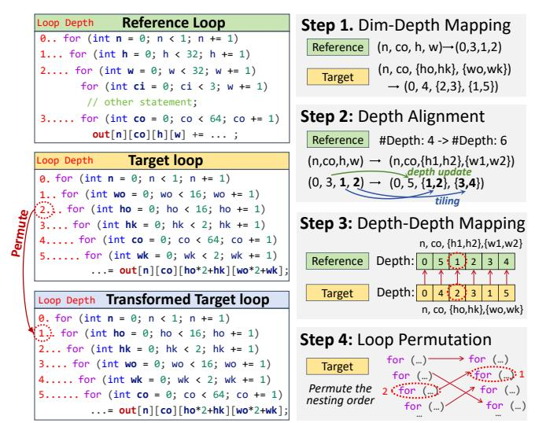

# III. FRAMEWORK OVERVIEW

CODO is built on the MLIR [\[25\]](#page-15-25) compilation framework. Figure [3](#page-4-0) shows the compilation flow. The framework takes compute kernels implemented in C++ or PyTorch models as input, which are translated into MLIR dialects via Polygeist [\[28\]](#page-15-26) and Torch-MLIR [\[3\]](#page-15-27), respectively. CODO offers codo-opt, which applies the full optimization flow in a single command, allowing users to optionally adjust input parameters like maximum parallelism and tiling factors.

CODO contains a holistic compilation flow that follows a main optimization order while being deeply integrated through co-optimization. The flow begins with two dataflow correction passes. The coarse-grained violation elimination resolves single-producer-consumer violations between tasks, where each task is represented as a *node* in the dataflow graph. Subsequently, the fine-grained violation elimination fixes inconsistencies in data access order and count, enabling efficient FIFO-based communication. This pass exemplifies our co-optimization principle: beyond ensuring correctness, it proactively restructures code for communication efficiency and provides guidance for later communication passes. Based on this, CODO performs communication buffer determination, selecting either FIFO or ping-pong implementations and prioritizing FIFO whenever feasible for higher performance. To further improve communication efficiency, CODO generates efficient reuse buffers and reinvokes the correctness passes to avoid new violations. This process also exposes loop-level parallelism, providing key information for subsequent parallelism exploration. Afterward, CODO manages off-chip transfers to improve HBM bandwidth utilization. Finally, CODO's autoscheduling engine determines tiling factors, unroll factors, pipelining, and array partitioning. These parallelism decisions are not made in isolation, as they can affect both correctness and communication efficiency. Therefore, a final intertask optimization pass co-optimizes these choices across the

Fig. 4: Coarse-grained dataflow violation elimination: (a) an example, where r-x/w-x represent read from/write to buffer x, and Node1' represents the node inserted to eliminate the violation; (b)(c) illustrate our elimination techniques for the rest of the dataflow violation categories.

consumer elimination

entire graph, eliminating any newly introduced violations and ensuring a high-performance design.

#### IV. DATAFLOW VIOLATION ELIMINATION

Commercial HLS tools [2], [41] exhibit limitations in effectively addressing dataflow violations. These tools only report coarse-grained dataflow violations through synthesis analysis and cannot automatically transform the code to resolve violations. To address these issues, we systematically eliminate both coarse-grained and fine-grained dataflow violations.

#### A. Coarse-grained Violation Elimination

consumer elimination

**Violation Issues.** The input C/C++ code or PyTorch models are first translated into a dataflow graph, where nodes represent computational tasks such as loops or functions, as shown in Fig. 4. Existing commercial HLS tools enforce a singleproducer-single-consumer pattern for dataflow execution, as discussed in Section II-A. Therefore, effective techniques are necessary to eliminate violations that deviate from this constraint. Figure 4 illustrates different types of coarse-grained dataflow violations. For example, in Fig. 4(a), Node1 writes results to buffer a, while both Node2 and Node3 read from the same buffer, forming a single-producer-multi-consumer pattern. Similarly, Fig. 4(b) and Fig. 4(c) depict multi-producersingle-consumer and multi-producer-multi-consumer patterns, respectively. Although previous works [8], [43], [44] partially address violations (a) or (c), they often fail to eliminate all violations, leading to sequential execution between nodes.

**Pattern-aware Code Transformation.** To fully address these issues, we propose pattern-aware code transformation, as described in Algorithm 1. The algorithm traverses the input code and detects data access patterns that may lead

### **Algorithm 1** Pattern-aware Violation Elimination

**Input:** Initial input code M with nodes and buffers. **Output:** Transformed code M' without violations.

- 1: for all  $buf \in \mathbf{M}$ :
- 2: Collect all nodes N that access buf.
- 3:  $\mathbf{V} \leftarrow \text{analyze\_access\_pattern}(\mathbf{N})$
- 4: **if V** contains violations:
- 5: Detect the data access pattern **P**.
- 6:  $\mathbf{N}' \leftarrow \text{apply\_transformation}(\mathbf{N}, \mathbf{P})$ 
  - $\mathbf{M}' \leftarrow \text{update\_affected\_nodes}(\mathbf{M}, \mathbf{N}')$
- 8: return M'.

7:

to violations (L3-4), which arise when multiple nodes access the same buffer. In general, all the access patterns that cause coarse-grained dataflow violations can be classified into three categories, as shown in Fig. 4. Once a violation is identified, CODO detects its access pattern and applies corresponding transformations to refactor the code (L5-6). For instance, Fig. 4(a) illustrates a typical bypass pattern, commonly seen in models with residual structures such as ResNet-18 [16] and GPT-2 [35]. CODO begins by traversing all buffers and collecting all nodes that access them. Taking buffer a as an example, its relevant nodes are *Node1-3*. CODO analyzes and records the access behavior of each node for buffer a (Fig. 4(a)2), which is then identified as the single-producermultiple-consumer pattern. To resolve this violation, an intermediate node (Node1') is inserted, reading from buffer a and writing to duplicated buffers b and b' (Fig. 4(a)3).

CODO applies different code transformations to address all three coarse-grained violation patterns in Fig. 4. The *multi-producer-single-consumer* pattern in Fig. 4(b), often found in initialization and padding operation pairs, is resolved through *node fusion*. CODO fuses loops that write to the same buffer when they share the same outer iteration domain and have no loop-carried dependencies. If inner loop structures differ, additional control logic is inserted to handle the mismatch. To maintain correctness, intermediate results from earlier writes are temporarily stored and finally merged into the last write operation. For the multi-producer-multi-consumer issue in Fig. 4(c), we create a new *buffer2* by duplicating *buffer1*, ensuring that each buffer is read from and written to once.

## B. Fine-grained Violation Elimination

After the coarse-grained violation elimination, HLS tools can by default allocate ping-pong buffers between nodes to enable coarse-grained dataflow execution with data blocks. However, the performance may not be maximized at nodes whose input and output data can be transferred through FIFOs in sequential order and processed at a finer granularity. This is because FIFO-based dataflow often offers superior performance due to its streaming computation pattern and less resource overhead. However, it imposes strict requirements on code patterns, requiring fine-grained violation elimination.

**Violation Issues.** In the example of Fig. 4(a)③, FIFOs can be inserted at all the connections between nodes or loops

Fig. 5: An example of a reduction operation rewriting.

within nodes, only if the sequential data access constraint is satisfied and the data access orders/counts are consistent between adjacent nodes or loops. Unfortunately, real-world applications exhibit numerous fine-grained read-write inconsistencies. As discussed in Section II-C, violations such as access count mismatch and access order inconsistency can result in deadlock or computational errors in the final design. More critically, existing HLS tools cannot detect these violations during synthesis. While a subset of issues may be identified through cosimulation, the process is time-consuming, often taking days or even weeks, thereby significantly increasing the debugging burden for developers.

Systematic Read-Write Coordination. To address finegrained violations and further refine the design for higher efficiency, we introduce a systematic read-write coordination method, including 1) reduction operation rewriting, which resolves the data access count mismatch issue while guaranteeing early FIFO writes, and 2) permutation map generation, which adjusts the access pattern of adjacent loops and ensures their consistent data access order, resolving the data access order inconsistency issue.

1) Reduction Operation Rewriting. Most data access count mismatches stem from reduction operations, such as fully connected layers, max pooling, and normalization. These nonbottleneck operations introduce loop dimensions that do not directly correspond to array indices, resulting in redundant FIFO accesses during reduction iterations. To address this issue, we propose a reduction rewriting strategy that identifies reduction regions and utilizes temporary arrays to aggregate intermediate results, thereby minimizing unnecessary FIFO transactions and ensuring correct and efficient dataflow execution.

Figure 5 illustrates a FIFO access mismatch and our approach. In this example, the producer is a max pooling operation that writes to buffer out, while the consumer is an initialization operation that reads from the same buffer. A discrepancy between the number of writes and reads results in a data access count mismatch, which leads to a FIFO deadlock. To detect such cases, CODO analyzes the loop structures of both the producer and the consumer that access the same array. It determines the total number of writes and reads by identifying the loop level at which the target array is accessed and computing the product of the iteration counts of

Fig. 6: Illustration of permutation map generation.

the surrounding loops. When a mismatch is detected, CODO classifies loop dimensions that correspond to FIFO array indices as index dimensions, while the remaining ones are identified as reduction dimensions and moved to the innermost loops, as shown in the shaded region of Fig. 5. The write to out is then moved out of the reduction region, and a temporary buffer is introduced to accumulate intermediate results. This transformation ensures that the producer's access count matches that of the consumer. Moreover, the rewriting ensures that intermediate results are being calculated and transferred just-in-time, greatly improving data transfer efficiency.

2) Permutation Map Generation. Inconsistent data access orders, which are common in real-world applications, lead to dataflow violations for streaming processing with FIFOs, as illustrated in Issue 1 of Fig. 2. To address this issue, we propose permutation map generation. Specifically, CODO identifies the bottleneck loop (e.g., convolution or Q\*K in attention) as the reference loop by analyzing the trip counts and computational intensity of each nested loop. It then analyzes data access patterns of the reference loop, including the data access order of input and output arrays. This information serves as the basis for adjusting the data access patterns of its producer and consumer loops, termed target loops. CODO then employs a mapping-based strategy to efficiently align data access patterns between reference and target loops.

Figure 6 illustrates this process. In Step 1, CODO establishes a mapping from connection array dimensions to their corresponding loop depths for both reference and target loops. For example, in the reference loop, the dimension set  $\{n, n\}$ co, h, w} of out corresponds to the loop depth set {0, 3, 1, 2. In Step 2, we apply loop tiling with a tiling size of 1 to the reference loop to align the depths of the reference loop and the target loop, splitting h and w into two loops, respectively. In Step 3, we construct a mapping between the loop depth sets of the reference and target loops. For instance, a mapping from 2 to 1 indicates that the loop at depth 2 in the target loop should be swapped to depth 1. Finally, in Step 4,

we transform the target loop by permuting the nesting order based on the depth-depth map from Step 3.

#### V. EFFICIENT DATA COMMUNICATION

After eliminating dataflow violations, the input algorithm is transformed into a dataflow-feasible form. Based on it, optimizing both on-chip and off-chip data communication is critical for overall efficiency. Therefore, we propose two on-chip optimizations: 1) communication buffer determination, which prioritizes FIFOs for tasks without dataflow violations; 2) violation-free reuse buffer generation, which enhances data transfer efficiency while ensuring violation-free designs; and an off-chip optimization: 3) off-chip data transfer management, which improves HBM bandwidth utilization.

#### A. On-chip Communication Buffer Determination

We adopt a FIFO-first strategy to optimize on-chip communication buffers. For tasks free of violations, we prioritize FIFO implementations to maximize performance. If fine-grained violations between loops cannot be eliminated, we turn to ping-pong buffer implementations. Note that ping-pong buffers are more resource-intensive, as they require at least twice the buffer size of the transmitted data block, posing a risk of resource overflow in large-scale applications.

# III. FRAMEWORK OVERVIEW

CODO is built on the MLIR [\[25\]](#page-15-25) compilation framework. Figure [3](#page-4-0) shows the compilation flow. The framework takes compute kernels implemented in C++ or PyTorch models as input, which are translated into MLIR dialects via Polygeist [\[28\]](#page-15-26) and Torch-MLIR [\[3\]](#page-15-27), respectively. CODO offers codo-opt, which applies the full optimization flow in a single command, allowing users to optionally adjust input parameters like maximum parallelism and tiling factors.

CODO contains a holistic compilation flow that follows a main optimization order while being deeply integrated through co-optimization. The flow begins with two dataflow correction passes. The coarse-grained violation elimination resolves single-producer-consumer violations between tasks, where each task is represented as a *node* in the dataflow graph. Subsequently, the fine-grained violation elimination fixes inconsistencies in data access order and count, enabling efficient FIFO-based communication. This pass exemplifies our co-optimization principle: beyond ensuring correctness, it proactively restructures code for communication efficiency and provides guidance for later communication passes. Based on this, CODO performs communication buffer determination, selecting either FIFO or ping-pong implementations and prioritizing FIFO whenever feasible for higher performance. To further improve communication efficiency, CODO generates efficient reuse buffers and reinvokes the correctness passes to avoid new violations. This process also exposes loop-level parallelism, providing key information for subsequent parallelism exploration. Afterward, CODO manages off-chip transfers to improve HBM bandwidth utilization. Finally, CODO's autoscheduling engine determines tiling factors, unroll factors, pipelining, and array partitioning. These parallelism decisions are not made in isolation, as they can affect both correctness and communication efficiency. Therefore, a final intertask optimization pass co-optimizes these choices across the

Fig. 4: Coarse-grained dataflow violation elimination: (a) an example, where r-x/w-x represent read from/write to buffer x, and Node1' represents the node inserted to eliminate the violation; (b)(c) illustrate our elimination techniques for the rest of the dataflow violation categories.

consumer elimination

entire graph, eliminating any newly introduced violations and ensuring a high-performance design.

#### IV. DATAFLOW VIOLATION ELIMINATION

Commercial HLS tools [2], [41] exhibit limitations in effectively addressing dataflow violations. These tools only report coarse-grained dataflow violations through synthesis analysis and cannot automatically transform the code to resolve violations. To address these issues, we systematically eliminate both coarse-grained and fine-grained dataflow violations.

#### A. Coarse-grained Violation Elimination

consumer elimination

**Violation Issues.** The input C/C++ code or PyTorch models are first translated into a dataflow graph, where nodes represent computational tasks such as loops or functions, as shown in Fig. 4. Existing commercial HLS tools enforce a singleproducer-single-consumer pattern for dataflow execution, as discussed in Section II-A. Therefore, effective techniques are necessary to eliminate violations that deviate from this constraint. Figure 4 illustrates different types of coarse-grained dataflow violations. For example, in Fig. 4(a), Node1 writes results to buffer a, while both Node2 and Node3 read from the same buffer, forming a single-producer-multi-consumer pattern. Similarly, Fig. 4(b) and Fig. 4(c) depict multi-producersingle-consumer and multi-producer-multi-consumer patterns, respectively. Although previous works [8], [43], [44] partially address violations (a) or (c), they often fail to eliminate all violations, leading to sequential execution between nodes.

**Pattern-aware Code Transformation.** To fully address these issues, we propose pattern-aware code transformation, as described in Algorithm 1. The algorithm traverses the input code and detects data access patterns that may lead

### **Algorithm 1** Pattern-aware Violation Elimination

**Input:** Initial input code M with nodes and buffers. **Output:** Transformed code M' without violations.

- 1: for all  $buf \in \mathbf{M}$ :
- 2: Collect all nodes N that access buf.
- 3:  $\mathbf{V} \leftarrow \text{analyze\_access\_pattern}(\mathbf{N})$
- 4: **if V** contains violations:
- 5: Detect the data access pattern **P**.
- 6:  $\mathbf{N}' \leftarrow \text{apply\_transformation}(\mathbf{N}, \mathbf{P})$ 
  - $\mathbf{M}' \leftarrow \text{update\_affected\_nodes}(\mathbf{M}, \mathbf{N}')$
- 8: return M'.

7:

to violations (L3-4), which arise when multiple nodes access the same buffer. In general, all the access patterns that cause coarse-grained dataflow violations can be classified into three categories, as shown in Fig. 4. Once a violation is identified, CODO detects its access pattern and applies corresponding transformations to refactor the code (L5-6). For instance, Fig. 4(a) illustrates a typical bypass pattern, commonly seen in models with residual structures such as ResNet-18 [16] and GPT-2 [35]. CODO begins by traversing all buffers and collecting all nodes that access them. Taking buffer a as an example, its relevant nodes are *Node1-3*. CODO analyzes and records the access behavior of each node for buffer a (Fig. 4(a)2), which is then identified as the single-producermultiple-consumer pattern. To resolve this violation, an intermediate node (Node1') is inserted, reading from buffer a and writing to duplicated buffers b and b' (Fig. 4(a)3).

CODO applies different code transformations to address all three coarse-grained violation patterns in Fig. 4. The *multi-producer-single-consumer* pattern in Fig. 4(b), often found in initialization and padding operation pairs, is resolved through *node fusion*. CODO fuses loops that write to the same buffer when they share the same outer iteration domain and have no loop-carried dependencies. If inner loop structures differ, additional control logic is inserted to handle the mismatch. To maintain correctness, intermediate results from earlier writes are temporarily stored and finally merged into the last write operation. For the multi-producer-multi-consumer issue in Fig. 4(c), we create a new *buffer2* by duplicating *buffer1*, ensuring that each buffer is read from and written to once.

## B. Fine-grained Violation Elimination

After the coarse-grained violation elimination, HLS tools can by default allocate ping-pong buffers between nodes to enable coarse-grained dataflow execution with data blocks. However, the performance may not be maximized at nodes whose input and output data can be transferred through FIFOs in sequential order and processed at a finer granularity. This is because FIFO-based dataflow often offers superior performance due to its streaming computation pattern and less resource overhead. However, it imposes strict requirements on code patterns, requiring fine-grained violation elimination.

**Violation Issues.** In the example of Fig. 4(a)③, FIFOs can be inserted at all the connections between nodes or loops

Fig. 5: An example of a reduction operation rewriting.

within nodes, only if the sequential data access constraint is satisfied and the data access orders/counts are consistent between adjacent nodes or loops. Unfortunately, real-world applications exhibit numerous fine-grained read-write inconsistencies. As discussed in Section II-C, violations such as access count mismatch and access order inconsistency can result in deadlock or computational errors in the final design. More critically, existing HLS tools cannot detect these violations during synthesis. While a subset of issues may be identified through cosimulation, the process is time-consuming, often taking days or even weeks, thereby significantly increasing the debugging burden for developers.

Systematic Read-Write Coordination. To address finegrained violations and further refine the design for higher efficiency, we introduce a systematic read-write coordination method, including 1) reduction operation rewriting, which resolves the data access count mismatch issue while guaranteeing early FIFO writes, and 2) permutation map generation, which adjusts the access pattern of adjacent loops and ensures their consistent data access order, resolving the data access order inconsistency issue.

1) Reduction Operation Rewriting. Most data access count mismatches stem from reduction operations, such as fully connected layers, max pooling, and normalization. These nonbottleneck operations introduce loop dimensions that do not directly correspond to array indices, resulting in redundant FIFO accesses during reduction iterations. To address this issue, we propose a reduction rewriting strategy that identifies reduction regions and utilizes temporary arrays to aggregate intermediate results, thereby minimizing unnecessary FIFO transactions and ensuring correct and efficient dataflow execution.

Figure 5 illustrates a FIFO access mismatch and our approach. In this example, the producer is a max pooling operation that writes to buffer out, while the consumer is an initialization operation that reads from the same buffer. A discrepancy between the number of writes and reads results in a data access count mismatch, which leads to a FIFO deadlock. To detect such cases, CODO analyzes the loop structures of both the producer and the consumer that access the same array. It determines the total number of writes and reads by identifying the loop level at which the target array is accessed and computing the product of the iteration counts of

Fig. 6: Illustration of permutation map generation.

the surrounding loops. When a mismatch is detected, CODO classifies loop dimensions that correspond to FIFO array indices as index dimensions, while the remaining ones are identified as reduction dimensions and moved to the innermost loops, as shown in the shaded region of Fig. 5. The write to out is then moved out of the reduction region, and a temporary buffer is introduced to accumulate intermediate results. This transformation ensures that the producer's access count matches that of the consumer. Moreover, the rewriting ensures that intermediate results are being calculated and transferred just-in-time, greatly improving data transfer efficiency.

2) Permutation Map Generation. Inconsistent data access orders, which are common in real-world applications, lead to dataflow violations for streaming processing with FIFOs, as illustrated in Issue 1 of Fig. 2. To address this issue, we propose permutation map generation. Specifically, CODO identifies the bottleneck loop (e.g., convolution or Q\*K in attention) as the reference loop by analyzing the trip counts and computational intensity of each nested loop. It then analyzes data access patterns of the reference loop, including the data access order of input and output arrays. This information serves as the basis for adjusting the data access patterns of its producer and consumer loops, termed target loops. CODO then employs a mapping-based strategy to efficiently align data access patterns between reference and target loops.

Figure 6 illustrates this process. In Step 1, CODO establishes a mapping from connection array dimensions to their corresponding loop depths for both reference and target loops. For example, in the reference loop, the dimension set  $\{n, n\}$ co, h, w} of out corresponds to the loop depth set {0, 3, 1, 2. In Step 2, we apply loop tiling with a tiling size of 1 to the reference loop to align the depths of the reference loop and the target loop, splitting h and w into two loops, respectively. In Step 3, we construct a mapping between the loop depth sets of the reference and target loops. For instance, a mapping from 2 to 1 indicates that the loop at depth 2 in the target loop should be swapped to depth 1. Finally, in Step 4,

we transform the target loop by permuting the nesting order based on the depth-depth map from Step 3.

#### V. EFFICIENT DATA COMMUNICATION

After eliminating dataflow violations, the input algorithm is transformed into a dataflow-feasible form. Based on it, optimizing both on-chip and off-chip data communication is critical for overall efficiency. Therefore, we propose two on-chip optimizations: 1) communication buffer determination, which prioritizes FIFOs for tasks without dataflow violations; 2) violation-free reuse buffer generation, which enhances data transfer efficiency while ensuring violation-free designs; and an off-chip optimization: 3) off-chip data transfer management, which improves HBM bandwidth utilization.

#### A. On-chip Communication Buffer Determination

We adopt a FIFO-first strategy to optimize on-chip communication buffers. For tasks free of violations, we prioritize FIFO implementations to maximize performance. If fine-grained violations between loops cannot be eliminated, we turn to ping-pong buffer implementations. Note that ping-pong buffers are more resource-intensive, as they require at least twice the buffer size of the transmitted data block, posing a risk of resource overflow in large-scale applications.

