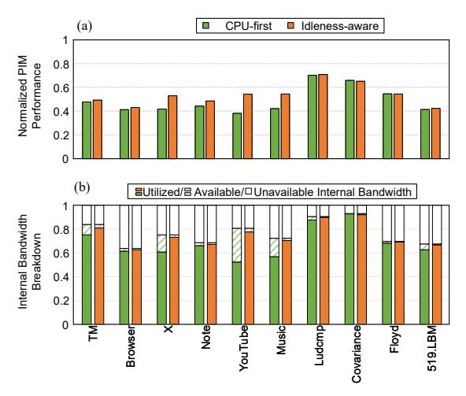
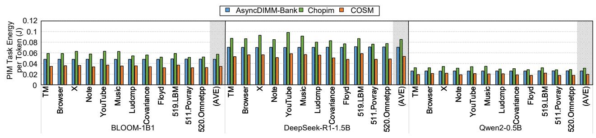
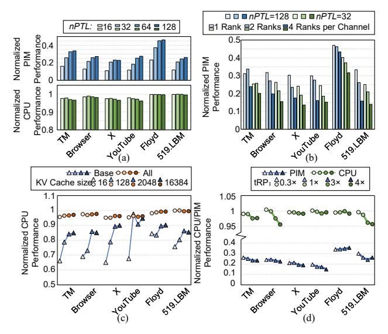

# 8.4. Sensitivity Analysis on CPU Performance during CPU-mediated Data Transfer

To assess how our techniques affect CPU-mediated transfers, we evaluate CPU performance normalized to the standalone execution, under four different configurations using attention layers from the three models that are characterized by substantial CPU-mediated transfer, as depicted in Fig. 10. To assess how our techniques affect CPU-mediated transfers, we evaluate the normalized CPU performance under four configurations using attention layers from three models characterized by substantial CPU-mediated transfers, as depicted in Fig. 10. In the Base configuration, CPU-mediated transfers occur through standard read/write requests, following the traditional three-stage PIM execution. Overlapped execution facilitates the simultaneous scheduling of CPU-mediated transfers and PIM execution commands by utilizing our scheduler design described in Section 6.2. This approach increases CPU performance by an average of 3.7% across mobile workloads compared to base. However, for workloads with high row-hit rates (such as algebraic kernels in PolyBench-ACC), this aggressive overlap can inadvertently cause additional row switches, leading to greater CPU interference. The Overlapped+Decoupled configuration further employs bandwidth-decoupled CPU-mediated PIM data transfer commands (Section 5.2), which reduces contention with CPU accesses and increase CPU performance by 11.5% compared to *Base*. Finally, the *All* configuration utilizes IWE to proactively detect memory bus idle time windows that are sufficiently large to accommodate entire burst transfers,

thereby maintaining CPU slowdown consistently below 5% across all evaluated workloads.

#### <span id="page-10-0"></span>8.5. Effect of Idleness-aware Scheduling on PIM Execution

In Fig. 11(a), we illustrate the performance of PIM workloads when managed by CPU-first scheduling compared to idlenessaware scheduling (Section 6) when running alongside with CPU workloads, with all results normalized to their standalone execution. The PIM workload is derived solely from the execution segment of an attention layer, excluding CPU-mediated data transfer, from the DeepSeek model. Under CPU-first scheduling, the issuance of PIM execution commands halts if a bank queue is not empty. In the idleness-aware configuration, idle time windows are predicted using IWE to enhance performance. This configuration provides an average performance boost of 1.21× for PIM workloads across mobile applications. Fig. 11(b) displays the bandwidth usage under both scheduling strategies. The term "available bandwidth" refers to idle time windows that are long enough for a PIM execution command but are not used due to scheduling limitations, whereas "unavailable bandwidth" pertains to short, fragmented idle periods unsuitable for PIM execution. Compared to CPU-first scheduling, Idleness-Aware scheduling exploits an additional 37.0% of the available bandwidth, leaving less than 1% unused.

#### 8.6. Energy Consumption

Fig. 12 depicts energy consumption per token of COSM and baselines. We only calculate the energy of PIM computation,

<span id="page-11-0"></span>

Fig. 11: (a) PIM performance and (b) Internal bandwidth usage during concurrent execution with CPU workload under CPU-first scheduling and idleness-aware scheduling.

and exclude the energy of CPU access during concurrent execution. Although COSM's fine-grained CPU-PIM task interleaving increases row switching overheads, it achieves a reduction in total energy by eliminating long active-idle periods. COSM reduces energy by  $1.34 \times / 1.61 \times$  compared to the AsyncDIMM-Bank/Chopim baseline.

#### 8.7. Sensitivity Analysis

**PIM Execution Command Length (**nPTL**).** Fig. 13(a) analyzes the sensitivity of COSM to the nPTL timing constrain. Generally, smaller command length (nPTL < 32) saturates the command bus, exacerbating contention between CPU and PIM tasks. However, moderately reducing nPTL can yield benefits by decreasing PIM\_Pause injections that potentially stall CPU accesses. For instance, in workload X, reducing nPTL from 128 to 64 improves both CPU and PIM performance.

**Rank Count per Channel.** Fig. 13(b) analyzes the PIM performance of COSM to the rank count in each channel. Higher rank counts require the memory controller to issue more commands to trigger the execution of all PIM units, making the command bus easily saturated. Therefore, scaling nPTL from 32 to 128 yields a higher speedup for 4 ranks (1.27×) than for 1 rank (1.22×).

**KV Cache Size.** Fig. 13(c) depicts the CPU performance degradation of COSM to the KV cache size of the DeepSeek attention layer, adopting the same series labels as Fig. 10. As

the KV cache grows, CPU-mediated data transfer increasingly dominates the total computation time. This mitigates the performance drop in the *Base* case, which is highly sensitive to data transfer overhead. In contrast, COSM effectively manages both data transfer and PIM execution, maintaining CPU performance degradation below 5%.

tRP. Fig. 13(d) shows performance under varying tRP (row precharge time) using a DeepSeek attention layer, excluding CPU-mediated data transfer. Under the current timing configuration (listed in Table 2), the CPU-PIM interference remains minimal. Since CPU and PIM requests typically map to different rows, a larger tRP heightens the row-switch penalty between CPU access and PIM execution command. This amplifies interference and degrade both CPU and PIM performance.

#### 8.8. Area Overhead.

Implemented in a Snapdragon 8-class LPDDR5 memory controller (estimated at 0.93 mm², measured from publicly available die photographs), the COSM hardware modules occupy 0.069 mm², resulting in a modest 7.4% area overhead. This includes 0.014  $mm^2$  for the PIM scheduler, 0.0085  $mm^2$  for the IWE, and 0.0054  $mm^2$  for the Command Arbiter.

#### 9. Discussion

Applicability to Broader Architectures. Although evaluated on mobile platforms, COSM's idleness-aware scheduling is applicable to any shared-memory CPU-PIM system. As PIM extends to desktops, servers, data centers, and supercomputers for diverse workloads [17,23,31,32,74], they inherently encounter the same bank and bus contention challenges appear when CPU and PIM units contend with each other. COSM addresses this through a universal memory abstraction: PIM workloads are characterized as bandwidth-sensitive, whereas CPU workloads are latency-sensitive

Extension to Heterogeneous Accelerators. Although COSM targets CPU-PIM coordination, supporting heterogeneous agents (e.g., GPU/NPU) is vital. With memory-bound tasks offloaded to PIM, these accelerators handle compute-intensive tasks and remain latency-sensitive. COSM's principle applies directly: located in the memory controller, it treats accelerator accesses as standard host requests, effectively isolating them from PIM-induced delays. Given the unique access patterns and scheduling policies of accelerators, extending COSM to explicitly capture these characteristics is a key research direction for future work.

<span id="page-11-1"></span>

Fig. 12: PIM workload energy consumption per token (including PIM unit computation, PIM bank access, and CPU-mediated data transfer) of COSM and baselines during concurrent CPU and PIM execution.

<span id="page-12-0"></span>

Fig. 13: Sensitivity analysis on (a) nPTL (b) rank count per channel (c) KV cache size (d) scaled tRP ( $n \times$ , relative to Table 2 configuration).

Compatibility with SIMD PIM Architectures While COSM currently targets single-bank PIM, its core principles readily extend SIMD PIMs (e.g., bank-group- or subarray-level) [75–79]. However, the inherent parallelism of SIMD execution poses challenges to idle time window prediction, as it requires the simultaneous availability of multiple banks. Consequently, future adaptations must balance PIM parallelism with CPU latency guarantees. Our scheduler enables this extensibility, but a dedicated exploration is left for future work.

Thermal Considerations. While COSM maximizes PIM throughput by exploiting CPU idle time windows, it can support thermal management. First, Command Arbiter can throttle PIM if the temperature exceeds thresholds. Second, IWE can reduce idle time window utilization, explicitly trading PIM throughput for thermal safety. Future work could explore adaptive strategies driven by real-time thermal feedback.

#### 10. Related Work

**PIM Architecture.** PIM [31] integrates computational units inside memory devices to improve the performance of memory-intensive workloads. This design philosophy applies universally across the entire storage hierarchy, including SRAM cache [80–86], DDR [15,27,29,87,88], GDDR [16], HBM [42], 3D stacked memory [89–91], and SSD [92–98]. Driven by this media-wide adaptability, researchers have proposed numerous application-specific PIM microarchitectures tailored for diverse workloads [28,42,77,88,95,99–103].

In DRAM-based PIM systems, the absence of direct inter-PIM-unit interconnects forces data transfers to be mediated by CPU, incurring prohibitive communication overheads. To bridge this gap, some works propose to introduce additional connections or custom access modes [104–108]. However, these methods introduce additional hardware complexity and require non-trivial adaptations at the DRAM interface. Enabling PIM compatibility with commodity CPU ecosystems has also emerged as a major research focus. To achieve this, subsequent works optimize system-level compatibility through

software or protocol layers, such as deploying dynamic address mapping for shared memory spaces [18,37], partitioning dedicated memory regions [15,42], or implementing specialized cache coherence frameworks [87,109,110]. These system-level protocols inevitably strain the memory control interface due to frequent host-PIM interactions. To address this, frameworks like AsyncDIMM [38] and ComPASS [41] further alleviate host command issuance pressure and scheduling overheads. Importantly, COSM operates orthogonally to these system and control interface optimizations, focusing on low-interference scheduling to further maximize overall system efficiency.

Memory Scheduling. Conventional memory scheduling primarily focuses on mitigating row switching latencies [44,111,112] and read-write delays [113,114]. To scale within multi-core systems, recent works exploit individual thread variations to achieve fair and high-performance scheduling [56-59,115-123], while also enforcing deadline-aware constraints [124-126]. As architectures shift toward heterogenous systems (e.g., CPU-GPU), scheduling evolves to manage highly asymmetric core behaviors and requirements [127–131]. To address unpredictable dynamic patterns, another research path deploys learning-based methods to adaptively optimize scheduling [132–134]. For PIM systems, the core difference is that CPU and PIM units do not share a unified interface, operating via separate command sets that cause severe crossdomain interference and necessitate dedicated co-scheduling. We have analyzed the two extreme policies in Section 3.4, CPU-first [39] and row-hit-aware [38,40], which biasedly favor CPU and PIM performance, respectively. ComPASS [41] introduces batch scheduling to balance performance, yet it enforces coarse-grained time-slicing between CPU and PIM, failing to achieve concurrent execution. COSM simultaneously satisfies the low-latency requirements of CPU accesses while maximizing PIM throughput, minimizing interference during concurrent execution.

## 11. Conclusion

This paper introduces COSM, a cooperative memory access scheduling framework that accelerates LLM inference on mobile devices with marginal degradation to CPU performance. To achieve this, COSM tackles CPU-PIM resource contention from both the control interface and memory scheduling perspectives, dynamically leveraging host memory idle windows for PIM execution. Consequently, COSM achieves a  $2.8\times$  increase in LLM inference throughput with less than 2.0% CPU performance degradation during concurrent execution.

## Acknowledgments

We sincerely thank the anonymous reviewers for their comments and suggestions to improve the paper. This work was partially supported by the National Key Research and Development Program of China (2024YFE0204300), National Natural Science Foundation of China (Grant No.62402311), Natural Science Foundation of Shanghai (Grant No.24ZR1433700), and Key Research and Development Program of Shanghai (25LN3201200).

## A. Artifact Appendix

## A.1. Abstract

This artifact provides the complete experimental framework for COSM, a cooperative scheduling framework designed for concurrent PIM/CPU execution on mobile devices. The artifact is built on the Ramulator2 simulator, which has been extended with the proposed low-interference PIM control interface and idleness-aware scheduling methodology.

The software components include the modified C++ source code of the Ramulator2-based memory controller, specialized PIM instruction support, and the scheduling logic for PIM Execution Queues (PEQ) and PIM Read/Write Queues (PRWQ). To represent realistic mobile scenarios, we provide two types of memory traces: 1) LLM workload traces (e.g., DeepSeek-R1- 1.5B ) generated via Python scripts to simulate PIM tasks, and 2) Mobile application traces (e.g., Browser, YouTube ) collected from physical mobile devices to represent CPU tasks.

This artifact is designed to reproduce the key results presented in the paper, specifically the performance improvements and CPU interference analysis shown in Figures 8 and 10. Users can expect to observe that COSM significantly enhances PIM throughput (up to 2.8×) while maintaining minimal CPU performance loss (less than 5.0% ). The artifact requires a GCC 12+ compiler for building the simulator environment.

## A.2. Artifact check-list (meta-information)

- Algorithm: Idleness-aware PIM scheduling, low-interference PIM control interface, and PIM/CPU concurrent memory access management.
- Program: Modified Ramulator2 simulator (C++), trace generation scripts (Python).
- Compilation: GCC 12 or higher (supporting C++20), CMake (3.30+).
- Data set: LLM execution traces (DeepSeek-R1 series) and realworld mobile application traces (e.g., Browser, YouTube, Camera) collected from mobile devices.
- Run-time environment: Linux (Ubuntu 20.04/22.04 recommended), Python 3.12+.
- Hardware: Any x86\_64 CPU for simulation; approximately 64GB RAM recommended for large trace handling.
- Execution: Automated simulation via Python task scripts; manual data integration into Excel templates.
- Metrics: PIM throughput (Tokens/sec), CPU performance slowdown.
- Output: Simulation log files, CSV tables, and generated plots (matching Figures 8, 10).
- Experiments: Baseline vs. COSM comparison under different mobile scenarios; sensitivity analysis of PEQ/PRWQ sizes and scheduling thresholds.
- How much disk space required (approximately)?: 5-10 GB (mostly for memory traces).
- How much time is needed to prepare workflow (approximately)?: 30-60 minutes (for environment setup and simulator compilation).
- How much time is needed to complete experiments (approximately)?: 1-2 hours.
- Publicly available?: Yes (via Zenodo).
- Workflow automation framework used?: Bash scripts.
- Archived (provide DOI)?: [https://doi.org/10.5281/zenodo.](https://doi.org/10.5281/zenodo.19660293) [19660293](https://doi.org/10.5281/zenodo.19660293)

## A.3. Description

- A.3.1. How to access. The artifact is available via Zenodo. The repository includes the modified Ramulator2 source code, Python execution scripts, sample traces, and the Excel visualization template.
- A.3.2. Hardware dependencies. The artifacts are based on software simulation. To reproduce the results within a reasonable timeframe (as specified in the check-list), a multi-core x86\_64 CPU (8+ cores) and at least 64GB of RAM are recommended.
- A.3.3. Software dependencies. The simulator requires GCC 12 or higher to support C++20 standards. The experiment orchestration and data collection rely on Python 3.12+. For data visualization, we provide an Excel template that processes the generated CSV files.
- A.3.4. Data sets. We include a comprehensive suite of memory traces:
- CPU Workloads: Real-world mobile application traces (e.g., YouTube, Browser) captured from a Xiaomi 11 Pro [\[66\]](#page-15-30).
- PIM Workloads: LLM inference traces (e.g., DeepSeek-R1- 1.5B) generated to simulate PIM-side memory access patterns.
- A.3.5. Models. Our model extends Ramulator2 with the following COSM-specific features:
- Memory Controller: Implements the Idleness-aware scheduling logic, specialized queues (PEQ/PRWQ), and PIM/CPU command arbitration. (src/dram\_controller/impl/ plugin/pim/pim\_arbiter\_cpu\_first\_o3\_pred.cpp)
- PIM Control Interface: Adds support for low-interference PIM control commands. (src/dram/impl/LPDDR5-PIM. cpp)

## A.4. Installation

The installation of COSM follows the standard build procedure of Ramulator2.

1. Environment Setup: The simulator requires a C++20 compliant compiler (GCC 12+) and CMake 3.30+. Detailed dependency requirements can be found in the official Ramulator2 documentation: [https://github.com/cmu-safari/](https://github.com/cmu-safari/ramulator2) [ramulator2](https://github.com/cmu-safari/ramulator2). Alternatively, you can use the automated script provided in the repository:

./build.sh

You can specify the parallelism level (default: 8) by running:

./build.sh [parallelism] # e.g. ./build.sh 16

2. Verification: To ensure the build is successful, verify that the ramulator2 executable is generated in the project root or the build/ directory. You can run ./build/ramulator2 --help to check the basic functionality.

## A.5. Experiment workflow

The evaluation is conducted in three main stages: simulation execution, data aggregation, and visualization.

1. Simulation Execution: We use a bash script run\_script. sh to automate the simulation execution. The script automatically manages the Ramulator2 execution and reads the PIM/CPU traces.

```
cd simulations/
./run_script.sh figure8
./run_script.sh figure10
```

Alternatively, you can specify the parallelism level (default: 8) by running:

```
./run_script.sh figure8 [parallelism]
# e.g. ./run_script.sh figure8 16
./run_script.sh figure10 [parallelism]
```

This will generate a CSV file under the simulations/ scripts\_result\_processor directory.

- 2. Visualization: Due to the complexity of the microarchitectural data analysis, we provide three Excel templates (plot\_figure8|10\_ae.xlsx) under simulations/scripts\_ result\_processor directory for final plotting.
- Open the CSV file generated by the simulation (summary\\_ figure8|10.csv) and the corresponding Excel template.
- Copy the content of the generated CSV file and paste it into the table Summary.
- The corresponding charts in table Chart will automatically update to reflect the results, reproducing the trends shown in the paper.

## A.6. Evaluation and expected results

The evaluation focuses on comparing the performance of COSM against baseline scheduling policies under concurrent PIM/CPU execution scenarios. The reproduced results are expected to closely match the trends presented in the paper. COSM should consistently demonstrate higher PIM throughput (up to 2.8×) and lower CPU interference (within 5.0% CPU performance loss).

## References

- <span id="page-14-0"></span>[1] A. Défossez, L. Mazaré, M. Orsini, A. Royer, P. Pérez, H. Jégou, E. Grave, and N. Zeghidour, "Moshi: a speech-text foundation model for real-time dialogue," arXiv e-prints, p. arXiv:2410.00037, Sep. 2024.
- [2] Q. Chen, Y. Chen, Y. Chen, M. Chen, Y. Chen, C. Deng, Z. Du, R. Gao, C. Gao, Z. Gao, Y. Li, X. Lv, J. Liu, H. Luo, B. Ma, C. Ni, X. Shi, J. Tang, H. Wang, H. Wang, W. Wang, Y. Wang, Y. Xu, F. Yu, Z. Yan, Y. Yang, B. Yang, X. Yang, G. Yang, T. Zhao, Q. Zhang, S. Zhang, N. Zhao, P. Zhang, C. Zhang, and J. Zhou, "MinMo: A Multimodal Large Language Model for Seamless Voice Interaction," arXiv e-prints, p. arXiv:2501.06282, Jan. 2025.
- <span id="page-14-1"></span>[3] Y. Shi, Y. Shu, S. Dong, G. Liu, J. Sesay, J. Li, and Z. Hu, "Voila: Voice-Language Foundation Models for Real-Time Autonomous Interaction and Voice Role-Play," arXiv e-prints, p. arXiv:2505.02707, May 2025.
- <span id="page-14-2"></span>[4] M. Wang, J. Zhao, T.-T. Vu, F. Shiri, E. Shareghi, and G. Haffari, "Simultaneous Machine Translation with Large Language Models," arXiv e-prints, p. arXiv:2309.06706, Sep. 2025.
- <span id="page-14-3"></span>[5] B. Fu, M. Liao, K. Fan, C. Li, L. Zhang, Y. Chen, and X. Shi, "LLMs Can Achieve High-quality Simultaneous Machine Translation as Efficiently as Offline," arXiv e-prints, p. arXiv:2504.09570, Apr. 2025.
- <span id="page-14-4"></span>[6] C. Lugaresi, J. Tang, H. Nash, C. McClanahan, E. Uboweja, M. Hays, F. Zhang, C.-L. Chang, M. G. Yong, J. Lee, W.-T. Chang, W. Hua, M. Georg, and M. Grundmann, "MediaPipe: A Framework for Building Perception Pipelines," arXiv e-prints, p. arXiv:1906.08172, Jun. 2019.
- <span id="page-14-5"></span>[7] M. Tanveer, Y. Zhou, S. Niklaus, A. Mahdavi Amiri, H. Zhang, K. K. Singh, and N. Zhao, "MotionBridge: Dynamic Video Inbetweening with Flexible Controls," arXiv e-prints, p. arXiv:2412.13190, Dec. 2024.
- <span id="page-14-6"></span>[8] Apple Inc., "Apple Intelligence," [https://www.apple.com/apple-intelligence/,](https://www.apple.com/apple-intelligence/) 2024, accessed: 2025-11-05.

- <span id="page-14-7"></span>[9] H. Chen, Y. Wang, K. Han, D. Li, L. Li, Z. Bi, J. Li, H. Wang, F. Mi, M. Zhu, B. Wang, K. Song, Y. Fu, X. He, Y. Luo, C. Zhu, Q. He, X. Wu, W. He, H. Hu, Y. Tang, D. Tao, X. Chen, and Y. Wang, "Pangu Embedded: An Efficient Dual-system LLM Reasoner with Metacognition," arXiv e-prints, p. arXiv:2505.22375, May 2025.
- <span id="page-14-8"></span>[10] Y. Yao, T. Yu, A. Zhang, C. Wang, J. Cui, H. Zhu, T. Cai, H. Li, W. Zhao, Z. He et al., "MiniCPM-V: A GPT-4V Level MLLM on Your Phone," Nat Commun 16, 5509 (2025), 2025.
- <span id="page-14-9"></span>[11] Samsung Electronics, Galaxy.ai - The #1 All-in-One AI Platform, [https://galaxy.ai/,](https://galaxy.ai/) 2024, accessed: 2025-11-05.
- <span id="page-14-10"></span>[12] X. Lu, Y. Chen, C. Chen, H. Tan, B. Chen, Y. Xie, R. Hu, G. Tan, R. Wu, Y. Hu, Y. Zeng, L. Wu, L. Bian, Z. Wang, L. Liu, Y. Yang, H. Xiao, A. Zhou, Y. Wen, X. Chen, S. Ren, and H. Li, "BlueLM-V-3B: Algorithm and System Co-Design for Multimodal Large Language Models on Mobile Devices," in Proceedings of the IEEE/CVF Conference on Computer Vision and Pattern Recognition (CVPR), June 2025, pp. 4145–4155.
- <span id="page-14-11"></span>[13] Qualcomm Technologies, Inc., "Unlocking On-Device Generative AI with an NPU and Heterogeneous Computing," Qualcomm, Tech. Rep., 2024, accessed: 2025-11-15.
- <span id="page-14-12"></span>[14] vivo, "vivo Unveils New AI Strategy: BlueHeart Large Model Matrix and Major Upgrade to OriginOS 5," [https://www.vivo.com.cn/brand/news/detail?id=1271,](https://www.vivo.com.cn/brand/news/detail?id=1271) 2024, accessed: 2025-11-15.
- <span id="page-14-13"></span>[15] F. Devaux, "The true Processing In Memory accelerator," in 2019 IEEE Hot Chips 31 Symposium (HCS), Aug 2019, pp. 1–24.
- <span id="page-14-15"></span>[16] S. Lee, K. Kim, S. Oh, J. Park, G. Hong, D. Ka, K. Hwang, J. Park, K. Kang, J. Kim, J. Jeon, N. Kim, Y. Kwon, K. Vladimir, W. Shin, J. Won, M. Lee, H. Joo, H. Choi, J. Lee, D. Ko, Y. Jun, K. Cho, I. Kim, C. Song, C. Jeong, D. Kwon, J. Jang, I. Park, J. Chun, and J. Cho, "A 1ynm 1.25V 8Gb, 16Gb/s/pin GDDR6-based Accelerator-in-Memory supporting 1TFLOPS MAC Operation and Various Activation Functions for Deep-Learning Applications," in 2022 IEEE International Solid-State Circuits Conference (ISSCC), vol. 65, Feb 2022, pp. 1–3.
- <span id="page-14-19"></span>[17] Y. Zhao, M. Gao, H. Zhang, F. Liu, G. Chen, H. Xian, H. Guan, and L. Jiang, "PUSHtap: PIM-based In-Memory HTAP with Unified Data Storage Format," in Proceedings of the 30th ACM International Conference on Architectural Support for Programming Languages and Operating Systems, Volume 3, ser. ASPLOS '25, 2025, pp. 179–194.
- <span id="page-14-14"></span>[18] Y. Zhao, M. Gao, F. Liu, Y. Hu, Z. Wang, H. Lin, J. Li, H. Xian, H. Dong, T. Yang, N. Jing, X. Liang, and L. Jiang, "UM-PIM: DRAM-based PIM with Uniform & Shared Memory Space," in 2024 ACM/IEEE 51st Annual International Symposium on Computer Architecture (ISCA), June 2024, pp. 644–659.
- <span id="page-14-17"></span>[19] Y. He, H. Mao, C. Giannoula, M. Sadrosadati, J. Gómez-Luna, H. Li, X. Li, Y. Wang, and O. Mutlu, "PAPI: Exploiting Dynamic Parallelism in Large Language Model Decoding with a Processing-In-Memory-Enabled Computing System," in Proceedings of the 30th ACM International Conference on Architectural Support for Programming Languages and Operating Systems, Volume 2, 2025, pp. 766–782.
- [20] G. Heo, S. Lee, J. Cho, H. Choi, S. Lee, H. Ham, G. Kim, D. Mahajan, and J. Park, "NeuPIMs: NPU-PIM Heterogeneous Acceleration for Batched LLM Inferencing," in Proceedings of the 29th ACM International Conference on Architectural Support for Programming Languages and Operating Systems, Volume 3, ser. ASPLOS '24, 2024, pp. 722–737.
- [21] J. Chen, Y. Qi, K. Sun, Z. Lin, T. Wang, C. Ma, and Y. Wang, "Unifying Two Operators with One PIM: Leveraging Hybrid Bonding for Efficient LLM Inference," in Advanced Parallel Processing Technologies, C. Li, X. Qian, D. Gizopoulos, and B. Grot, Eds., 2026, pp. 215–230.
- [22] W. Kim, Y. Lee, Y. Kim, J. Hwang, S. Oh, J. Jung, A. Huseynov, W. G. Park, C. H. Park, D. Mahajan, and J. Park, "Pimba: A Processing-in-Memory Acceleration for Post-Transformer Large Language Model Serving," in Proceedings of the 58th IEEE/ACM International Symposium on Microarchitecture, ser. MICRO '25, 2025, pp. 292–307.
- <span id="page-14-18"></span>[23] J. Park, J. Choi, K. Kyung, M. J. Kim, Y. Kwon, N. S. Kim, and J. H. Ahn, "AttAcc! Unleashing the Power of PIM for Batched Transformer-based Generative Model Inference," in Proceedings of the 29th ACM International Conference on Architectural Support for Programming Languages and Operating Systems, Volume 2, ser. ASPLOS '24, 2024, p. 103119.
- [24] L. Yan, X. Lu, X. Chen, Y. Han, and X.-H. Sun, "Pyramid: Accelerating LLM Inference With Cross-Level Processing-in-Memory," IEEE Computer Architecture Letters, vol. 24, no. 1, pp. 121–124, Jan 2025.
- [25] J. Ahn, S. Hong, S. Yoo, O. Mutlu, and K. Choi, "A scalable processing-in-memory accelerator for parallel graph processing," in 2015 ACM/IEEE 42nd Annual International Symposium on Computer Architecture (ISCA), June 2015, pp. 105–117.
- [26] J. Ahn, S. Yoo, O. Mutlu, and K. Choi, "PIM-enabled instructions: A low-overhead, locality-aware processing-in-memory architecture," in 2015 ACM/IEEE 42nd Annual International Symposium on Computer Architecture (ISCA), June 2015, pp. 336–348.
- <span id="page-14-20"></span>[27] A. Boroumand, S. Ghose, B. Akin, R. Narayanaswami, G. F. Oliveira, X. Ma, E. Shiu, and O. Mutlu, "Google Neural Network Models for Edge Devices: Analyzing and Mitigating Machine Learning Inference Bottlenecks," in 2021 30th International Conference on Parallel Architectures and Compilation Techniques (PACT), Sep. 2021, pp. 159–172.
- <span id="page-14-22"></span>[28] M. Besta, R. Kanakagiri, G. Kwasniewski, R. Ausavarungnirun, J. Beránek, K. Kanellopoulos, K. Janda, Z. Vonarburg-Shmaria, L. Gianinazzi, I. Stefan, J. G. Luna, J. Golinowski, M. Copik, L. Kapp-Schwoerer, S. Di Girolamo, N. Blach, M. Konieczny, O. Mutlu, and T. Hoefler, "SISA: Set-Centric Instruction Set Architecture for Graph Mining on Processing-in-Memory Systems," in MICRO-54: 54th Annual IEEE/ACM International Symposium on Microarchitecture, ser. MICRO '21, 2021, pp. 282–297.
- <span id="page-14-21"></span>[29] A. Boroumand, S. Ghose, Y. Kim, R. Ausavarungnirun, E. Shiu, R. Thakur, D. Kim, A. Kuusela, A. Knies, P. Ranganathan, and O. Mutlu, "Google Workloads for Consumer Devices: Mitigating Data Movement Bottlenecks," in Proceedings of the Twenty-Third International Conference on Architectural Support for Programming Languages and Operating Systems, ser. ASPLOS '18, 2018, pp. 316–331.
- <span id="page-14-16"></span>[30] Y. Gu, A. Khadem, S. Umesh, N. Liang, X. Servot, O. Mutlu, R. Iyer, and R. Das,

- "PIM Is All You Need: A CXL-Enabled GPU-Free System for Large Language Model Inference," in Proceedings of the 30th ACM International Conference on Architectural Support for Programming Languages and Operating Systems, Volume 2, ser. ASPLOS '25, 2025, pp. 862–881.
- <span id="page-15-38"></span>[31] O. Mutlu, S. Ghose, J. Gómez-Luna, and R. Ausavarungnirun, A Modern Primer on Processing in Memory, 2023, pp. 171–243.
- <span id="page-15-39"></span>[32] O. Mutlu, "Processing data where it makes sense in modern computing systems: Enabling in-memory computation," in 2018 7th Mediterranean Conference on Embedded Computing (MECO), June 2018, pp. 8–9.
- <span id="page-15-11"></span>[33] J. Gómez-Luna, I. E. Hajj, I. Fernandez, C. Giannoula, G. F. Oliveira, and O. Mutlu, "Benchmarking a New Paradigm: Experimental Analysis and Characterization of a Real Processing-in-Memory System," IEEE Access, vol. 10, pp. 52 565–52 608, 2022.
- <span id="page-15-12"></span>[34] J. Gómez-Luna, Y. Guo, S. Brocard, J. Legriel, R. Cimadomo, G. F. Oliveira, G. Singh, and O. Mutlu, "Evaluating Machine LearningWorkloads on Memory-Centric Computing Systems," in 2023 IEEE International Symposium on Performance Analysis of Systems and Software (ISPASS), April 2023, pp. 35–49.
- <span id="page-15-0"></span>[35] J. Gómez-Luna, I. El Hajj, I. Fernandez, C. Giannoula, G. F. Oliveira, and O. Mutlu, "Benchmarking Memory-Centric Computing Systems: Analysis of Real Processing-In-Memory Hardware," in 2021 12th International Green and Sustainable Computing Conference (IGSC), Oct 2021, pp. 1–7.
- <span id="page-15-1"></span>[36] J. H. Kim, Y. Ro, J. So, S. Lee, S.-h. Kang, Y. Cho, H. Kim, B. Kim, K. Kim, S. Park, J.-S. Kim, S. Cha, W.-J. Lee, J. Jung, J.-G. Lee, J. Lee, J. Song, S. Lee, J. Cho, J. Yu, and K. Sohn, "Samsung PIM/PNM for Transfmer Based AI : Energy Efficiency on PIM/PNM Cluster," in 2023 IEEE Hot Chips 35 Symposium (HCS), Aug 2023, pp. 1–31.
- <span id="page-15-2"></span>[37] D. Lee, B. Hyun, T. Kim, and M. Rhu, "PIM-MMU: A Memory Management Unit for Accelerating Data Transfers in Commercial PIM Systems," in 2024 57th IEEE/ACM International Symposium on Microarchitecture (MICRO), Nov 2024, pp. 627–642.
- <span id="page-15-3"></span>[38] L. Chen, D. Lyu, J. Jiang, Q. Wang, Z. Mao, and N. Jing, "AsyncDIMM: Achieving Asynchronous Execution in DIMM-Based Near-Memory Processing," in 2025 IEEE International Symposium on High Performance Computer Architecture (HPCA), March 2025, pp. 518–532.
- <span id="page-15-5"></span>[39] B. Y. Cho, Y. Kwon, S. Lym, and M. Erez, "Near Data Acceleration with Concurrent Host Access," in 2020 ACM/IEEE 47th Annual International Symposium on Computer Architecture (ISCA), May 2020, pp. 818–831.
- <span id="page-15-6"></span>[40] S. Gupta, N. Madan, S. Puthoor, N. Jayasena, and S. Dwarkadas, "Concurrent PIM and Load/Store Servicing in PIM-Enabled Memory," in 2025 IEEE International Symposium on Performance Analysis of Systems and Software (ISPASS), May 2025, pp. 320–334.
- <span id="page-15-4"></span>[41] S. Yu, H. Kim, K. Jeun, S. Hwang, S. Cho, and E. Lee, "ComPASS: A Compatible PIM Protocol Architecture and Scheduling Solution for Processor-PIM Collaboration," in Proceedings of the 58th IEEE/ACM International Symposium on Microarchitecture, ser. MICRO '25, 2025, pp. 49–62.
- <span id="page-15-7"></span>[42] Y.-C. Kwon, S. H. Lee, J. Lee, S.-H. Kwon, J. M. Ryu, J.-P. Son, O. Seongil, H.-S. Yu, H. Lee, S. Y. Kim, Y. Cho, J. G. Kim, J. Choi, H.-S. Shin, J. Kim, B. Phuah, H. Kim, M. J. Song, A. Choi, D. Kim, S. Kim, E.-B. Kim, D. Wang, S. Kang, Y. Ro, S. Seo, J. Song, J. Youn, K. Sohn, and N. S. Kim, "25.4 A 20nm 6GB Function-In-Memory DRAM, Based on HBM2 with a 1.2TFLOPS Programmable Computing Unit Using Bank-Level Parallelism, for Machine Learning Applications," in 2021 IEEE International Solid-State Circuits Conference (ISSCC), vol. 64, Feb 2021, pp. 350–352.
- <span id="page-15-8"></span>[43] JEDEC, "JEDEC JESD209-5C: Low Power Double Data Rate 5 (LPDDR5)," JEDEC Solid State Technology Association, Tech. Rep., 6 2023, revision of JESD209-5B (June 2021).
- <span id="page-15-9"></span>[44] Y. Kim, V. Seshadri, D. Lee, J. Liu, and O. Mutlu, "A case for exploiting subarray-level parallelism (SALP) in DRAM," in 2012 39th Annual International Symposium on Computer Architecture (ISCA), June 2012, pp. 368–379.
- <span id="page-15-10"></span>[45] D. Lee, Y. Kim, V. Seshadri, J. Liu, L. Subramanian, and O. Mutlu, "Tiered-latency DRAM: A low latency and low cost DRAM architecture," in 2013 IEEE 19th International Symposium on High Performance Computer Architecture (HPCA), Feb 2013, pp. 615–626.
- <span id="page-15-13"></span>[46] C. Ortega, Y. Falevoz, and R. Ayrignac, "PIM-AI: A Novel Architecture for High-Efficiency LLM Inference," arXiv e-prints, p. arXiv:2411.17309, Nov. 2024.
- [47] M. Barkhordar, A. Tabatabaeian, M. Sadrosadati, C. Giannoula, J. G. Luna, I. El Hajj, O. Mutlu, and A. R. Alameldeen, "ALPHA-PIM: Analysis of Linear Algebraic Processing for High-Performance Graph Applications on a Real Processing-In-Memory System," in 2025 IEEE International Symposium on Workload Characterization (IISWC), Oct 2025, pp. 257–271.
- [48] C. Giannoula, P. Yang, I. Fernandez, J. Yang, S. Durvasula, Y. X. Li, M. Sadrosadati, J. G. Luna, O. Mutlu, and G. Pekhimenko, "PyGim: An Efficient Graph Neural Network Library for Real Processing-In-Memory Architectures," Proc. ACM Meas. Anal. Comput. Syst., vol. 8, no. 3, Dec. 2024.
- <span id="page-15-14"></span>[49] C. Giannoula, I. Fernandez, J. Gómez-Luna, N. Koziris, G. Goumas, and O. Mutlu, "SparseP: Efficient Sparse Matrix Vector Multiplication on Real Processing-In-Memory Architectures," in 2022 IEEE Computer Society Annual Symposium on VLSI (ISVLSI), July 2022, pp. 288–291.
- <span id="page-15-15"></span>[50] Y. Kwon, K. Vladimir, N. Kim, W. Shin, J. Won, M. Lee, H. Joo, H. Choi, G. Kim, B. An, J. Kim, J. Lee, I. Kim, J. Park, C. Park, Y. Song, B. Yang, H. Lee, S. Kim, D. Kwon, S. Lee, K. Kim, S. Oh, J. Park, G. Hong, D. Ka, K. Hwang, J. Park, K. Kang, J. Kim, J. Jeon, M. Lee, M. Shin, M. Shin, J. Cha, C. Jung, K. Chang, C. Jeong, E. Lim, I. Park, J. Chun, and S. Hynix, "System Architecture and Software Stack for GDDR6-AiM," in 2022 IEEE Hot Chips 34 Symposium (HCS), Aug 2022, pp. 1–25.
- <span id="page-15-16"></span>[51] S. Lee, S.-h. Kang, J. Lee, H. Kim, E. Lee, S. Seo, H. Yoon, S. Lee, K. Lim, H. Shin, J. Kim, O. Seongil, A. Iyer, D. Wang, K. Sohn, and N. S. Kim, "Hardware Architecture and Software Stack for PIM Based on Commercial DRAM Technology : Industrial Product," in 2021 ACM/IEEE 48th Annual International Symposium on Computer Architecture (ISCA), June 2021, pp. 43–56.
- <span id="page-15-17"></span>[52] D. Guo, D. Yang, H. Zhang, J. Song, P. Wang, Q. Zhu, R. Xu, R. Zhang, S. Ma, X. Bi,

- X. Zhang, X. Yu, Y. Wu, Z. F. Wu, Z. Gou, Z. Shao, Z. Li, Z. Gao, A. Liu, B. Xue, B. Wang, B. Wu, B. Feng, C. Lu, C. Zhao, C. Deng, C. Ruan, D. Dai, D. Chen, D. Ji, E. Li, F. Lin, F. Dai, F. Luo, G. Hao, G. Chen, G. Li, H. Zhang, H. Xu, H. Ding, H. Gao, H. Qu, H. Li, J. Guo, J. Li, J. Chen, J. Yuan, J. Tu, J. Qiu, J. Li, J. L. Cai, J. Ni, J. Liang, J. Chen, K. Dong, K. Hu, K. You, K. Gao, K. Guan, K. Huang, K. Yu, L. Wang, L. Zhang, L. Zhao, L. Wang, L. Zhang, L. Xu, L. Xia, M. Zhang, M. Zhang, M. Tang, M. Zhou, M. Li, M. Wang, M. Li, N. Tian, P. Huang, P. Zhang, Q. Wang, Q. Chen, Q. Du, R. Ge, R. Zhang, R. Pan, R. Wang, R. J. Chen, R. L. Jin, R. Chen, S. Lu, S. Zhou, S. Chen, S. Ye, S. Wang, S. Yu, S. Zhou, S. Pan, S. S. Li, S. Zhou, S. Wu, T. Yun, T. Pei, T. Sun, T. Wang, W. Zeng, W. Liu, W. Liang, W. Gao, W. Yu, W. Zhang, W. L. Xiao, W. An, X. Liu, X. Wang, X. Chen, X. Nie, X. Cheng, X. Liu, X. Xie, X. Liu, X. Yang, X. Li, X. Su, X. Lin, X. Q. Li, X. Jin, X. Shen, X. Chen, X. Sun, X. Wang, X. Song, X. Zhou, X. Wang, X. Shan, Y. K. Li, Y. Q. Wang, Y. X. Wei, Y. Zhang, Y. Xu, Y. Li, Y. Zhao, Y. Sun, Y. Wang, Y. Yu, Y. Zhang, Y. Shi, Y. Xiong, Y. He, Y. Piao, Y. Wang, Y. Tan, Y. Ma, Y. Liu, Y. Guo, Y. Ou, Y. Wang, Y. Gong, Y. Zou, Y. He, Y. Xiong, Y. Luo, Y. You, Y. Liu, Y. Zhou, Y. X. Zhu, Y. Huang, Y. Li, Y. Zheng, Y. Zhu, Y. Ma, Y. Tang, Y. Zha, Y. Yan, Z. Z. Ren, Z. Ren, Z. Sha, Z. Fu, Z. Xu, Z. Xie, Z. Zhang, Z. Hao, Z. Ma, Z. Yan, Z. Wu, Z. Gu, Z. Zhu, Z. Liu, Z. Li, Z. Xie, Z. Song, Z. Pan, Z. Huang, Z. Xu, Z. Zhang, and Z. Zhang, "DeepSeek-R1 incentivizes reasoning in LLMs through reinforcement learning," Nature, vol. 645, pp. 633–638, 2025.
- <span id="page-15-18"></span>[53] S. Rixner, W. J. Dally, U. J. Kapasi, P. Mattson, and J. D. Owens, "Memory access scheduling," in Proceedings of the 27th Annual International Symposium on Computer Architecture, ser. ISCA '00, 2000, pp. 128–138.
- <span id="page-15-19"></span>[54] D. M. Zuravleff and J. I. Robinson, "Controller for a synchronous DRAM that maximizes throughput by allowing memory requests and commands to be issued out of order," May 1997, US Patent 5,630,096.
- <span id="page-15-20"></span>[55] T. Moscibroda and O. Mutlu, "Memory Performance Attacks: Denial of Memory Service in Multi-Core Systems," in 16th USENIX Security Symposium (USENIX Security 07), Aug 2007.
- <span id="page-15-40"></span>[56] O. Mutlu and T. Moscibroda, "Stall-Time Fair Memory Access Scheduling for Chip Multiprocessors," in 40th Annual IEEE/ACM International Symposium on Microarchitecture (MICRO 2007), Dec 2007, pp. 146–160.
- <span id="page-15-21"></span>[57] O. Mutlu and T. Moscibroda, "Parallelism-Aware Batch Scheduling: Enhancing both Performance and Fairness of Shared DRAM Systems," in 2008 International Symposium on Computer Architecture, June 2008, pp. 63–74.
- <span id="page-15-22"></span>[58] L. Subramanian, D. Lee, V. Seshadri, H. Rastogi, and O. Mutlu, "The Blacklisting Memory Scheduler: Achieving high performance and fairness at low cost," in 2014 IEEE 32nd International Conference on Computer Design (ICCD), Oct 2014, pp. 8–15.
- <span id="page-15-23"></span>[59] Y. Kim, D. Han, O. Mutlu, and M. Harchol-Balter, "ATLAS: A scalable and highperformance scheduling algorithm for multiple memory controllers," in HPCA - 16 2010 The Sixteenth International Symposium on High-Performance Computer Architecture, Jan 2010, pp. 1–12.
- <span id="page-15-24"></span>[60] H. Luo, Y. C. Tuğrul, F. N. Bostancı, A. Olgun, A. G. Yağlıkçı, and O. Mutlu, "Ramulator 2.0: A Modern, Modular, and Extensible DRAM Simulator," IEEE Computer Architecture Letters, vol. 23, no. 1, pp. 112–116, Jan 2024.
- <span id="page-15-25"></span>[61] CMU-SAFARI, "Ramulator V2.0a," [https://github.com/CMU-SAFARI/ramulator2,](https://github.com/CMU-SAFARI/ramulator2) 2023, accessed: 2025-11-05.
- <span id="page-15-26"></span>[62] Y. Kim, W. Yang, and O. Mutlu, "Ramulator: A Fast and Extensible DRAM Simulator," IEEE Computer Architecture Letters, vol. 15, no. 1, pp. 45–49, 2016.
- <span id="page-15-27"></span>[63] L. Steiner, T. Psota, M. Mörz, D. Christ, M. Jung, and N. Wehn, "DRAMPower 5: An Open-Source Power Simulator for Current Generation DRAM Standards," in Proceedings of the Rapid Simulation and Performance Evaluation for Design Workshop, ser. RAPIDO '25, 2025, pp. 8–16.
- <span id="page-15-28"></span>[64] Qualcomm Technologies, Inc., "Snapdragon 888 5G Mobile Platform," [https://www.qualcomm.com/smartphones/products/8-series/](https://www.qualcomm.com/smartphones/products/8-series/snapdragon-888-5g-mobile-platform) [snapdragon-888-5g-mobile-platform,](https://www.qualcomm.com/smartphones/products/8-series/snapdragon-888-5g-mobile-platform) 2020, accessed: 2026-02-19.
- <span id="page-15-29"></span>[65] D. Sanchez and C. Kozyrakis, "ZSim: fast and accurate microarchitectural simulation of thousand-core systems," in Proceedings of the 40th Annual International Symposium on Computer Architecture, ser. ISCA '13, 2013, pp. 475–486.
- <span id="page-15-30"></span>[66] Xiaomi Corporation, "Xiaomi Mi 11 Pro - Technical Specifications," [https://www.](https://www.mi.com/mi11Pro/specs) [mi.com/mi11Pro/specs,](https://www.mi.com/mi11Pro/specs) 2021, accessed: 2026-02-19.
- <span id="page-15-31"></span>[67] F. Developers, "Stalker — Frida Documentation," [https://frida.re/docs/stalker/,](https://frida.re/docs/stalker/) 2025, accessed: 2025-11-15.
- <span id="page-15-32"></span>[68] Google LLC, "Android 15," [https://developer.android.google.cn/about/versions/15,](https://developer.android.google.cn/about/versions/15) 2024, accessed: 2025-11-05.
- <span id="page-15-33"></span>[69] G. Yeap, S. S. Lin, Y. M. Chen, H. L. Shang, P. W. Wang, H. C. Lin, Y. C. Peng, J. Y. Sheu, M. Wang, X. Chen, B. R. Yang, C. P. Lin, F. C. Yang, Y. K. Leung, D. W. Lin, C. P. Chen, K. F. Yu, D. H. Chen, C. Y. Chang, H. K. Chen, P. Hung, C. S. Hou, Y. K. Cheng, J. Chang, L. Yuan, C. K. Lin, C. C. Chen, Y. C. Yeo, M. H. Tsai, H. T. Lin, C. O. Chui, K. B. Huang, W. Chang, H. J. Lin, K. W. Chen, R. Chen, S. H. Sun, Q. Fu, H. T. Yang, H. T. Chiang, C. C. Yeh, T. L. Lee, C. H. Wang, S. L. Shue, C. W. Wu, R. Lu, W. R. Lin, J. Wu, F. Lai, Y. H. Wu, B. Z. Tien, Y. C. Huang, L. C. Lu, J. He, Y. Ku, J. Lin, M. Cao, T. S. Chang, and S. M. Jang, "5nm CMOS Production Technology Platform featuring full-fledged EUV, and High Mobility Channel FinFETs with densest 0.021µm2 SRAM cells for Mobile SoC and High Performance Computing Applications," in 2019 IEEE International Electron Devices Meeting (IEDM), Dec 2019, pp. 36.7.1–36.7.4.
- <span id="page-15-34"></span>[70] S. Grauer-Gray, L. Xu, R. Searles, S. Ayalasomayajula, and J. Cavazos, "Auto-tuning a high-level language targeted to GPU codes," in 2012 Innovative Parallel Computing (InPar), May 2012, pp. 1–10.
- <span id="page-15-35"></span>[71] Standard Performance Evaluation Corporation (SPEC), "SPEC CPU2017," [https:](https://www.spec.org/cpu2017/) [//www.spec.org/cpu2017/,](https://www.spec.org/cpu2017/) 2017, accessed: 2025-11-15.
- <span id="page-15-36"></span>[72] BigScience, "BigScience Language Open-science Open-access Multilingual (BLOOM) Language Model," [https://huggingface.co/bigscience/bloom-1b1,](https://huggingface.co/bigscience/bloom-1b1) 2022, accessed: 2025-11-05.
- <span id="page-15-37"></span>[73] A. Yang, B. Yang, B. Hui, B. Zheng, B. Yu, C. Zhou, C. Li, C. Li, D. Liu, F. Huang,

- G. Dong, H. Wei, H. Lin, J. Tang, J. Wang, J. Yang, J. Tu, J. Zhang, J. Ma, J. Yang, J. Xu, J. Zhou, J. Bai, J. He, J. Lin, K. Dang, K. Lu, K. Chen, K. Yang, M. Li, M. Xue, N. Ni, P. Zhang, P. Wang, R. Peng, R. Men, R. Gao, R. Lin, S. Wang, S. Bai, S. Tan, T. Zhu, T. Li, T. Liu, W. Ge, X. Deng, X. Zhou, X. Ren, X. Zhang, X. Wei, X. Ren, X. Liu, Y. Fan, Y. Yao, Y. Zhang, Y. Wan, Y. Chu, Y. Liu, Z. Cui, Z. Zhang, Z. Guo, and Z. Fan, "Qwen2 Technical Report," arXiv e-prints, p. arXiv:2407.10671, Jul. 2024.
- <span id="page-16-0"></span>[74] C. Shin, J. Song, S. Na, J. Sung, H. Jang, and J. Lee, "FALA: Locality-Aware PIM-Host Cooperation for Graph Processing with Fine-Grained Column Access," in Proceedings of the 58th IEEE/ACM International Symposium on Microarchitecture, ser. MICRO '25, 2025, p. 15201534.
- <span id="page-16-1"></span>[75] V. Seshadri, D. Lee, T. Mullins, H. Hassan, A. Boroumand, J. Kim, M. A. Kozuch, O. Mutlu, P. B. Gibbons, and T. C. Mowry, "Ambit: In-Memory Accelerator for Bulk Bitwise Operations Using Commodity DRAM Technology," in 2017 50th Annual IEEE/ACM International Symposium on Microarchitecture (MICRO), Oct 2017, pp. 273–287.
- [76] N. Hajinazar, G. F. Oliveira, S. Gregorio, J. a. D. Ferreira, N. M. Ghiasi, M. Patel, M. Alser, S. Ghose, J. Gómez-Luna, and O. Mutlu, "SIMDRAM: a framework for bitserial SIMD processing using DRAM," in Proceedings of the 26th ACM International Conference on Architectural Support for Programming Languages and Operating Systems, ser. ASPLOS '21, 2021, pp. 329–345.
- <span id="page-16-11"></span>[77] G. F. Oliveira, A. Olgun, A. G. Yağlıkçı, F. N. Bostancı, J. Gómez-Luna, S. Ghose, and O. Mutlu, "MIMDRAM: An End-to-End Processing-Using-DRAM System for High-Throughput, Energy-Efficient and Programmer-Transparent Multiple-Instruction Multiple-Data Computing," in 2024 IEEE International Symposium on High-Performance Computer Architecture (HPCA), March 2024, pp. 186–203.
- [78] G. F. de Oliveira Junior, M. Kabra, Y. Guo, K. Chen, A. G. Yaglikci, M. Soysal, M. Sadrosadati, J. Olivares Bueno, S. Ghose, J. Gómez-Luna, and O. Mutlu, "Proteus: Achieving High-Performance Processing-Using-DRAM with Dynamic Bit-Precision, Adaptive Data Representation, and Flexible Arithmetic," in Proceedings of the 39th ACM International Conference on Supercomputing, ser. ICS '25, 2025, pp. 473–494.
- <span id="page-16-2"></span>[79] S. Li, D. Niu, K. T. Malladi, H. Zheng, B. Brennan, and Y. Xie, "DRISA: A DRAM-based Reconfigurable In-Situ Accelerator," in 2017 50th Annual IEEE/ACM International Symposium on Microarchitecture (MICRO), Oct 2017, pp. 288–301.
- <span id="page-16-3"></span>[80] S. Aga, S. Jeloka, A. Subramaniyan, S. Narayanasamy, D. Blaauw, and R. Das, "Compute Caches," in 2017 IEEE International Symposium on High Performance Computer Architecture (HPCA), Feb 2017, pp. 481–492.
- [81] Z. Wang, C. Liu, N. Beckmann, and T. Nowatzki, "Affinity Alloc: Taming Not So Near-Data Computing," in 2023 56th IEEE/ACM International Symposium on Microarchitecture (MICRO), Oct 2023, pp. 784–799.
- [82] Z. Wang, C. Liu, A. Arora, L. John, and T. Nowatzki, "Infinity Stream: Portable and Programmer-Friendly In-/Near-Memory Fusion," in Proceedings of the 28th ACM International Conference on Architectural Support for Programming Languages and Operating Systems, Volume 3, ser. ASPLOS 2023, 2023, pp. 359–375.
- [83] Z. Wang, J. Weng, S. Liu, and T. Nowatzki, "Near-Stream Computing: General and Transparent Near-Cache Acceleration," in 2022 IEEE International Symposium on High-Performance Computer Architecture (HPCA), April 2022, pp. 331–345.
- [84] M. Orenes-Vera, E. Tureci, D. Wentzlaff, and M. Martonosi, "Dalorex: A Data-Local Program Execution and Architecture for Memory-bound Applications," in 2023 IEEE International Symposium on High-Performance Computer Architecture (HPCA), Feb 2023, pp. 718–730.
- [85] C. Eckert, X. Wang, J. Wang, A. Subramaniyan, R. Iyer, D. Sylvester, D. Blaaauw, and R. Das, "Neural Cache: Bit-Serial In-Cache Acceleration of Deep Neural Networks," in 2018 ACM/IEEE 45th Annual International Symposium on Computer Architecture (ISCA), 2018, pp. 383–396.
- <span id="page-16-4"></span>[86] A. K. Ramanathan, G. S. Kalsi, S. Srinivasa, T. M. Chandran, K. R. Pillai, O. J. Omer, V. Narayanan, and S. Subramoney, "Look-Up Table based Energy Efficient Processing in Cache Support for Neural Network Acceleration," in 2020 53rd Annual IEEE/ACM International Symposium on Microarchitecture (MICRO), Oct 2020, pp. 88–101.
- <span id="page-16-5"></span>[87] A. Boroumand, S. Ghose, M. Patel, H. Hassan, B. Lucia, R. Ausavarungnirun, K. Hsieh, N. Hajinazar, K. T. Malladi, H. Zheng, and O. Mutlu, "CoNDA: Efficient Cache Coherence Support for Near-Data Accelerators," in 2019 ACM/IEEE 46th Annual International Symposium on Computer Architecture (ISCA), June 2019, pp. 629–642.
- <span id="page-16-6"></span>[88] D. Lee, J. So, M. AHN, J.-G. Lee, J. Kim, J. Cho, R. Oliver, V. C. Thummala, R. s. JV, S. S. Upadhya, M. I. Khan, and J. H. Kim, "Improving In-Memory Database Operations with Acceleration DIMM (AxDIMM)," in Proceedings of the 18th International Workshop on Data Management on New Hardware, ser. DaMoN '22, 2022.
- <span id="page-16-7"></span>[89] C. Li, Y. Yin, X. Wu, J. Zhu, Z. Gao, D. Niu, Q. Wu, X. Si, Y. Xie, C. Zhang, and G. Sun, "H2-LLM: Hardware-Dataflow Co-Exploration for Heterogeneous Hybrid-Bondingbased Low-Batch LLM Inference," in Proceedings of the 52nd Annual International Symposium on Computer Architecture, ser. ISCA '25, 2025, pp. 194–210.
- [90] Z. Yue, Y. Wang, C. Li, S. Wei, Y. Hu, and S. Yin, "3D-PATH: A Hierarchy LUT Processing-in-memory Accelerator with Thermal-aware Hybrid Bonding Integration," in Proceedings of the 58th IEEE/ACM International Symposium on Microarchitecture, ser. MICRO '25, 2025, pp. 78–93.
- <span id="page-16-8"></span>[91] J. Ahn, S. Hong, S. Yoo, O. Mutlu, and K. Choi, "A scalable processing-in-memory accelerator for parallel graph processing," SIGARCH Comput. Archit. News, vol. 43, no. 3S, pp. 105–117, Jun. 2015.
- <span id="page-16-9"></span>[92] J. H. Lee, H. Zhang, V. Lagrange, P. Krishnamoorthy, X. Zhao, and Y. S. Ki, "SmartSSD: FPGA Accelerated Near-Storage Data Analytics on SSD," IEEE Computer Architecture Letters, vol. 19, no. 2, pp. 110–113, July 2020.
- [93] K. Chen, R. Nadig, M. Frouzakis, N. M. Ghiasi, Y. Liang, H. Mao, J. Park, M. Sadrosadati, and O. Mutlu, "REIS: A High-Performance and Energy-Efficient Retrieval System with In-Storage Processing," in Proceedings of the 52nd Annual International

- Symposium on Computer Architecture, ser. ISCA '25, 2025, pp. 1171–1192.
- [94] M. Kabra, R. Nadig, H. Gupta, R. Bera, M. Frouzakis, V. Arulchelvan, Y. Liang, H. Mao, M. Sadrosadati, and O. Mutlu, "CIPHERMATCH: Accelerating Homomorphic Encryption-Based String Matching via Memory-Efficient Data Packing and In-Flash Processing," in Proceedings of the 30th ACM International Conference on Architectural Support for Programming Languages and Operating Systems, Volume 2, ser. ASPLOS '25, 2025, pp. 111–130.
- <span id="page-16-12"></span>[95] N. M. Ghiasi, M. Sadrosadati, H. Mustafa, A. Gollwitzer, C. Firtina, J. Eudine, H. Mao, J. Lindegger, M. B. Cavlak, M. Alser, J. Park, and O. Mutlu, "MegIS: High-Performance, Energy-Efficient, and Low-Cost Metagenomic Analysis with In-Storage Processing," in 2024 ACM/IEEE 51st Annual International Symposium on Computer Architecture (ISCA), June 2024, pp. 660–677.
- [96] N. Mansouri Ghiasi, J. Park, H. Mustafa, J. Kim, A. Olgun, A. Gollwitzer, D. Senol Cali, C. Firtina, H. Mao, N. Almadhoun Alserr, R. Ausavarungnirun, N. Vijaykumar, M. Alser, and O. Mutlu, "GenStore: a high-performance in-storage processing system for genome sequence analysis," in Proceedings of the 27th ACM International Conference on Architectural Support for Programming Languages and Operating Systems, ser. ASPLOS '22, 2022, pp. 635–654.
- [97] S.-W. Jun, M. Liu, S. Lee, J. Hicks, J. Ankcorn, M. King, S. Xu, and Arvind, "BlueDBM: an appliance for big data analytics," SIGARCH Comput. Archit. News, vol. 43, no. 3S, pp. 1–13, Jun. 2015.
- <span id="page-16-10"></span>[98] M. Soysal, K. Koliogeorgi, C. Firtina, N. M. Ghiasi, R. Nadig, H. Mao, G. F. de Oliveira Junior, Y. Liang, K. Zambaku, M. Sadrosadati, and O. Mutlu, "MARS: Processing-In-Memory Acceleration of Raw Signal Genome Analysis Inside the Storage Subsystem," in Proceedings of the 39th ACM International Conference on Supercomputing, ser. ICS '25, 2025, pp. 513–534.
- <span id="page-16-13"></span>[99] A. Mamdouh, H. Geng, M. Niemier, X. Sharon Hu, and D. Reis, "Shared-PIM: Enabling Concurrent Computation and Data Flow for Faster Processing-in-DRAM," IEEE Transactions on Computer-Aided Design of Integrated Circuits and Systems, vol. 44, no. 11, pp. 4395–4404, Nov 2025.
- [100] V. Seshadri, Y. Kim, C. Fallin, D. Lee, R. Ausavarungnirun, G. Pekhimenko, Y. Luo, O. Mutlu, P. B. Gibbons, M. A. Kozuch, and T. C. Mowry, "RowClone: fast and energy-efficient in-DRAM bulk data copy and initialization," in Proceedings of the 46th Annual IEEE/ACM International Symposium on Microarchitecture, ser. MICRO-46, 2013, pp. 185–197.
- [101] A. Boroumand, S. Ghose, G. F. Oliveira, and O. Mutlu, "Polynesia: Enabling High-Performance and Energy-Efficient Hybrid Transactional/Analytical Databases with Hardware/Software Co-Design," in 2022 IEEE 38th International Conference on Data Engineering (ICDE), May 2022, pp. 2997–3011.
- [102] I. E. Y uksel, Y. C. Tuğrul, A. Olgun, F. N. Bostancı, A. G. Yağlıkçı, G. F. Oliveira, H. Luo, J. Gómez-Luna, M. Sadrosadati, and O. Mutlu, "Functionally-Complete Boolean Logic in Real DRAM Chips: Experimental Characterization and Analysis," in 2024 IEEE International Symposium on High-Performance Computer Architecture (HPCA), March 2024, pp. 280–296.
- <span id="page-16-14"></span>[103] L. Nai, R. Hadidi, J. Sim, H. Kim, P. Kumar, and H. Kim, "GraphPIM: Enabling Instruction-Level PIM Offloading in Graph Computing Frameworks," in 2017 IEEE International Symposium on High Performance Computer Architecture (HPCA), Feb 2017, pp. 457–468.
- <span id="page-16-15"></span>[104] B. Tian, Q. Chen, and M. Gao, "ABNDP: Co-optimizing Data Access and Load Balance in Near-Data Processing," in Proceedings of the 28th ACM International Conference on Architectural Support for Programming Languages and Operating Systems, Volume 3, ser. ASPLOS 2023, 2023, pp. 3–17.
- [105] Z. Zhou, C. Li, F. Yang, and G. Sun, "DIMM-Link: Enabling Efficient Inter-DIMM Communication for Near-Memory Processing," in 2023 IEEE International Symposium on High-Performance Computer Architecture (HPCA), Feb 2023, pp. 302–316.
- [106] B. Tian, Y. Li, J. Li, S. Cai, and M. Gao, "NDPBridge: Enabling Cross-Bank Coordination in Near-DRAM-Bank Processing Architectures," in Proceedings of the 51st Annual International Symposium on Computer Architecture, ser. ISCA '24, 2024, pp. 628–643.
- [107] W. Sun, Z. Li, S. Yin, S. Wei, and L. Liu, "ABC-DIMM: Alleviating the Bottleneck of Communication in DIMM-based Near-Memory Processing with Inter-DIMM Broadcast," in 2021 ACM/IEEE 48th Annual International Symposium on Computer Architecture (ISCA), June 2021, pp. 237–250.
- <span id="page-16-16"></span>[108] H. Son, G. Jonatan, X. Wu, H. Cho, K. Shivdikar, J. L. Abellán, A. Joshi, D. Kaeli, and J. Kim, "PIMnet: A Domain-Specific Network for Efficient Collective Communication in Scalable PIM," in 2025 IEEE International Symposium on High Performance Computer Architecture (HPCA), March 2025, pp. 1557–1572.
- <span id="page-16-17"></span>[109] D. Fujiki, "MVC: Enabling Fully Coherent Multi-Data-Views through the Memory Hierarchy with Processing in Memory," in Proceedings of the 56th Annual IEEE/ACM International Symposium on Microarchitecture, ser. MICRO '23, 2023, pp. 800–814.
- <span id="page-16-18"></span>[110] A. Boroumand, S. Ghose, M. Patel, H. Hassan, B. Lucia, K. Hsieh, K. T. Malladi, H. Zheng, and O. Mutlu, "LazyPIM: An Efficient Cache Coherence Mechanism for Processing-in-Memory," IEEE Computer Architecture Letters, vol. 16, no. 1, pp. 46–50, Jan 2017.
- <span id="page-16-19"></span>[111] Y.-S. Moon, Y. Kwon, H.-S. Kim, D.-g. Kim, H. H. Lee, and K. Park, "The Compact Memory Scheduling Maximizing Row Buffer Locality," in Proceedings of the 3rd JILP Workshop on Computer Architecture Competitions: Memory Scheduling Championship (MSC), June 2012.
- <span id="page-16-20"></span>[112] J. Reineke, I. Liu, H. D. Patel, S. Kim, and E. A. Lee, "PRET DRAM controller: Bank privatization for predictability and temporal isolation," in 2011 Proceedings of the Ninth IEEE/ACM/IFIP International Conference on Hardware/Software Codesign and System Synthesis (CODES+ISSS), Oct 2011, pp. 99–108.
- <span id="page-16-21"></span>[113] L. Chen, Y. Cao, S. Kabala, and P. Shukla, "Pre-Read and Write-Leak Memory Scheduling Algorithm," in Proceedings of the 1st Memory Scheduling Championship (MSC). JILP Workshop on Computer Architecture Competitions, June 2012, held in conjunction with ISCA-39.

- <span id="page-17-0"></span>[114] C. J. Lee, E. Ebrahimi, V. Narasiman, O. Mutlu, and Y. N. Patt, "DRAM-Aware Last-Level Cache Replacement," High Performance Systems Group, Department of Electrical and Computer Engineering, The University of Texas at Austin, Austin, TX, Tech. Rep. TR-HPS-2010-007, December 2010.
- <span id="page-17-1"></span>[115] Y. Kim, M. Papamichael, O. Mutlu, and M. Harchol-Balter, "Thread Cluster Memory Scheduling: Exploiting Differences in Memory Access Behavior," in 2010 43rd Annual IEEE/ACM International Symposium on Microarchitecture, 2010, pp. 65–76.
- [116] W. El-Reedy, A. A. El-Moursy, and H. A. Fahmy, "High Performance Memory Requests Scheduling Technique for Multicore Processors," in 2012 IEEE 14th International Conference on High Performance Computing and Communication & 2012 IEEE 9th International Conference on Embedded Software and Systems, June 2012, pp. 127–134.
- [117] A. S. Elhelw, A. El-Moursy, and H. A. H. Fahmy, "Adaptive Time-Based Least Memory Intensive Scheduling," in 2015 IEEE 9th International Symposium on Embedded Multicore/Many-core Systems-on-Chip, Sep. 2015, pp. 167–174.
- [118] K. J. Nesbit, N. Aggarwal, J. Laudon, and J. E. Smith, "Fair Queuing Memory Systems," in 2006 39th Annual IEEE/ACM International Symposium on Microarchitecture (MICRO'06), Dec 2006, pp. 208–222.
- [119] B. Akesson and K. Goossens, "Architectures and modeling of predictable memory controllers for improved system integration," in 2011 Design, Automation & Test in Europe, March 2011, pp. 1–6.
- [120] W. Liu, P. Huang, T. Kun, T. Lu, K. Zhou, C. Li, and X. He, "LAMS: A latencyaware memory scheduling policy for modern DRAM systems," in 2016 IEEE 35th International Performance Computing and Communications Conference (IPCCC), Dec 2016, pp. 1–8.
- [121] L. Subramanian, D. Lee, V. Seshadri, H. Rastogi, and O. Mutlu, "BLISS: Balancing Performance, Fairness and Complexity in Memory Access Scheduling," IEEE Transactions on Parallel and Distributed Systems, vol. 27, no. 10, pp. 3071–3087, Oct 2016.
- [122] J. Zhao, O. Mutlu, and Y. Xie, "FIRM: Fair and High-Performance Memory Control for Persistent Memory Systems," in 2014 47th Annual IEEE/ACM International Symposium on Microarchitecture, 2014, pp. 153–165.
- <span id="page-17-2"></span>[123] R. Ausavarungnirun, S. Ghose, O. Kayiran, G. H. Loh, C. R. Das, M. T. Kandemir, and O. Mutlu, "Exploiting Inter-Warp Heterogeneity to Improve GPGPU Performance," in 2015 International Conference on Parallel Architecture and Compilation (PACT), Oct 2015, pp. 25–38.
- <span id="page-17-3"></span>[124] H. Shah, A. Raabe, and A. Knoll, "Bounding WCET of applications using SDRAM with Priority Based Budget Scheduling in MPSoCs," in 2012 Design, Automation & Test in Europe Conference & Exhibition (DATE), March 2012, pp. 665–670.
- [125] M. Paolieri, E. Quiñones, and F. J. Cazorla, "Timing effects of DDR memory systems in hard real-time multicore architectures: Issues and solutions," ACM Trans. Embed. Comput. Syst., vol. 12, no. 1s, Mar. 2013.
- <span id="page-17-4"></span>[126] H. Usui, L. Subramanian, K. K.-W. Chang, and O. Mutlu, "Dash: Deadline-aware high-performance memory scheduler for heterogeneous systems with hardware accelerators," ACM Trans. Archit. Code Optim., vol. 12, no. 4, Jan. 2016.
- <span id="page-17-5"></span>[127] J. Fang, M. Wang, and Z. Wei, "A memory scheduling strategy for eliminating memory access interference in heterogeneous system," J. Supercomput., vol. 76, no. 4, pp. 3129–3154, Apr. 2020.
- [128] D. Li and T. M. Aamodt, "Inter-Core Locality Aware Memory Scheduling," IEEE Computer Architecture Letters, vol. 15, no. 1, pp. 25–28, Jan 2016.
- [129] A. Jog, O. Kayiran, A. Pattnaik, M. T. Kandemir, O. Mutlu, R. Iyer, and C. R. Das, "Exploiting Core Criticality for Enhanced GPU Performance," in Proceedings of the 2016 ACM SIGMETRICS International Conference on Measurement and Modeling of Computer Science, ser. SIGMETRICS '16, 2016, pp. 351–363.
- [130] R. Ausavarungnirun, K. K.-W. Chang, L. Subramanian, G. H. Loh, and O. Mutlu, "Staged memory scheduling: achieving high performance and scalability in heterogeneous systems," in Proceedings of the 39th Annual International Symposium on Computer Architecture, ser. ISCA '12, 2012, pp. 416–427.
- <span id="page-17-6"></span>[131] O. Kayiran, N. C. Nachiappan, A. Jog, R. Ausavarungnirun, M. T. Kandemir, G. H. Loh, O. Mutlu, and C. R. Das, "Managing GPU Concurrency in Heterogeneous Architectures," in Proceedings of the 47th Annual IEEE/ACM International Symposium on Microarchitecture, ser. MICRO-47, 2014, pp. 114–126.
- <span id="page-17-7"></span>[132] E. Ipek, O. Mutlu, J. F. Martínez, and R. Caruana, "Self-Optimizing Memory Controllers: A Reinforcement Learning Approach," in 2008 International Symposium on Computer Architecture, June 2008, pp. 39–50.
- [133] O. H. Elgawi, C. S. Leung, M. Lee, and J. H. Chan, "RL-Based Memory Controller for Scalable Autonomous Systems," in Neural Information Processing Systems, C. S. Leung, M. Lee, and J. H. Chan, Eds., 2009, pp. 83–92.
- <span id="page-17-8"></span>[134] A. Ray and H. Ray, "Proposing *ϵ*-greedy Reinforcement Learning Technique to Self-Optimize Memory Controllers," in 2021 2nd International Conference on Secure Cyber Computing and Communications (ICSCCC), May 2021, pp. 318–323.# 8.4. Sensitivity Analysis on CPU Performance during CPU-mediated Data Transfer

To assess how our techniques affect CPU-mediated transfers, we evaluate CPU performance normalized to the standalone execution, under four different configurations using attention layers from the three models that are characterized by substantial CPU-mediated transfer, as depicted in Fig. 10. To assess how our techniques affect CPU-mediated transfers, we evaluate the normalized CPU performance under four configurations using attention layers from three models characterized by substantial CPU-mediated transfers, as depicted in Fig. 10. In the Base configuration, CPU-mediated transfers occur through standard read/write requests, following the traditional three-stage PIM execution. Overlapped execution facilitates the simultaneous scheduling of CPU-mediated transfers and PIM execution commands by utilizing our scheduler design described in Section 6.2. This approach increases CPU performance by an average of 3.7% across mobile workloads compared to base. However, for workloads with high row-hit rates (such as algebraic kernels in PolyBench-ACC), this aggressive overlap can inadvertently cause additional row switches, leading to greater CPU interference. The Overlapped+Decoupled configuration further employs bandwidth-decoupled CPU-mediated PIM data transfer commands (Section 5.2), which reduces contention with CPU accesses and increase CPU performance by 11.5% compared to *Base*. Finally, the *All* configuration utilizes IWE to proactively detect memory bus idle time windows that are sufficiently large to accommodate entire burst transfers,

thereby maintaining CPU slowdown consistently below 5% across all evaluated workloads.

#### <span id="page-10-0"></span>8.5. Effect of Idleness-aware Scheduling on PIM Execution

In Fig. 11(a), we illustrate the performance of PIM workloads when managed by CPU-first scheduling compared to idlenessaware scheduling (Section 6) when running alongside with CPU workloads, with all results normalized to their standalone execution. The PIM workload is derived solely from the execution segment of an attention layer, excluding CPU-mediated data transfer, from the DeepSeek model. Under CPU-first scheduling, the issuance of PIM execution commands halts if a bank queue is not empty. In the idleness-aware configuration, idle time windows are predicted using IWE to enhance performance. This configuration provides an average performance boost of 1.21× for PIM workloads across mobile applications. Fig. 11(b) displays the bandwidth usage under both scheduling strategies. The term "available bandwidth" refers to idle time windows that are long enough for a PIM execution command but are not used due to scheduling limitations, whereas "unavailable bandwidth" pertains to short, fragmented idle periods unsuitable for PIM execution. Compared to CPU-first scheduling, Idleness-Aware scheduling exploits an additional 37.0% of the available bandwidth, leaving less than 1% unused.

#### 8.6. Energy Consumption

Fig. 12 depicts energy consumption per token of COSM and baselines. We only calculate the energy of PIM computation,

<span id="page-11-0"></span>

Fig. 11: (a) PIM performance and (b) Internal bandwidth usage during concurrent execution with CPU workload under CPU-first scheduling and idleness-aware scheduling.

and exclude the energy of CPU access during concurrent execution. Although COSM's fine-grained CPU-PIM task interleaving increases row switching overheads, it achieves a reduction in total energy by eliminating long active-idle periods. COSM reduces energy by  $1.34 \times / 1.61 \times$  compared to the AsyncDIMM-Bank/Chopim baseline.

#### 8.7. Sensitivity Analysis

**PIM Execution Command Length (**nPTL**).** Fig. 13(a) analyzes the sensitivity of COSM to the nPTL timing constrain. Generally, smaller command length (nPTL < 32) saturates the command bus, exacerbating contention between CPU and PIM tasks. However, moderately reducing nPTL can yield benefits by decreasing PIM\_Pause injections that potentially stall CPU accesses. For instance, in workload X, reducing nPTL from 128 to 64 improves both CPU and PIM performance.

**Rank Count per Channel.** Fig. 13(b) analyzes the PIM performance of COSM to the rank count in each channel. Higher rank counts require the memory controller to issue more commands to trigger the execution of all PIM units, making the command bus easily saturated. Therefore, scaling nPTL from 32 to 128 yields a higher speedup for 4 ranks (1.27×) than for 1 rank (1.22×).

**KV Cache Size.** Fig. 13(c) depicts the CPU performance degradation of COSM to the KV cache size of the DeepSeek attention layer, adopting the same series labels as Fig. 10. As

the KV cache grows, CPU-mediated data transfer increasingly dominates the total computation time. This mitigates the performance drop in the *Base* case, which is highly sensitive to data transfer overhead. In contrast, COSM effectively manages both data transfer and PIM execution, maintaining CPU performance degradation below 5%.

tRP. Fig. 13(d) shows performance under varying tRP (row precharge time) using a DeepSeek attention layer, excluding CPU-mediated data transfer. Under the current timing configuration (listed in Table 2), the CPU-PIM interference remains minimal. Since CPU and PIM requests typically map to different rows, a larger tRP heightens the row-switch penalty between CPU access and PIM execution command. This amplifies interference and degrade both CPU and PIM performance.

#### 8.8. Area Overhead.

Implemented in a Snapdragon 8-class LPDDR5 memory controller (estimated at 0.93 mm², measured from publicly available die photographs), the COSM hardware modules occupy 0.069 mm², resulting in a modest 7.4% area overhead. This includes 0.014  $mm^2$  for the PIM scheduler, 0.0085  $mm^2$  for the IWE, and 0.0054  $mm^2$  for the Command Arbiter.

#### 9. Discussion

Applicability to Broader Architectures. Although evaluated on mobile platforms, COSM's idleness-aware scheduling is applicable to any shared-memory CPU-PIM system. As PIM extends to desktops, servers, data centers, and supercomputers for diverse workloads [17,23,31,32,74], they inherently encounter the same bank and bus contention challenges appear when CPU and PIM units contend with each other. COSM addresses this through a universal memory abstraction: PIM workloads are characterized as bandwidth-sensitive, whereas CPU workloads are latency-sensitive

Extension to Heterogeneous Accelerators. Although COSM targets CPU-PIM coordination, supporting heterogeneous agents (e.g., GPU/NPU) is vital. With memory-bound tasks offloaded to PIM, these accelerators handle compute-intensive tasks and remain latency-sensitive. COSM's principle applies directly: located in the memory controller, it treats accelerator accesses as standard host requests, effectively isolating them from PIM-induced delays. Given the unique access patterns and scheduling policies of accelerators, extending COSM to explicitly capture these characteristics is a key research direction for future work.

<span id="page-11-1"></span>

Fig. 12: PIM workload energy consumption per token (including PIM unit computation, PIM bank access, and CPU-mediated data transfer) of COSM and baselines during concurrent CPU and PIM execution.

<span id="page-12-0"></span>

Fig. 13: Sensitivity analysis on (a) nPTL (b) rank count per channel (c) KV cache size (d) scaled tRP ( $n \times$ , relative to Table 2 configuration).

Compatibility with SIMD PIM Architectures While COSM currently targets single-bank PIM, its core principles readily extend SIMD PIMs (e.g., bank-group- or subarray-level) [75–79]. However, the inherent parallelism of SIMD execution poses challenges to idle time window prediction, as it requires the simultaneous availability of multiple banks. Consequently, future adaptations must balance PIM parallelism with CPU latency guarantees. Our scheduler enables this extensibility, but a dedicated exploration is left for future work.

Thermal Considerations. While COSM maximizes PIM throughput by exploiting CPU idle time windows, it can support thermal management. First, Command Arbiter can throttle PIM if the temperature exceeds thresholds. Second, IWE can reduce idle time window utilization, explicitly trading PIM throughput for thermal safety. Future work could explore adaptive strategies driven by real-time thermal feedback.

#### 10. Related Work

**PIM Architecture.** PIM [31] integrates computational units inside memory devices to improve the performance of memory-intensive workloads. This design philosophy applies universally across the entire storage hierarchy, including SRAM cache [80–86], DDR [15,27,29,87,88], GDDR [16], HBM [42], 3D stacked memory [89–91], and SSD [92–98]. Driven by this media-wide adaptability, researchers have proposed numerous application-specific PIM microarchitectures tailored for diverse workloads [28,42,77,88,95,99–103].

In DRAM-based PIM systems, the absence of direct inter-PIM-unit interconnects forces data transfers to be mediated by CPU, incurring prohibitive communication overheads. To bridge this gap, some works propose to introduce additional connections or custom access modes [104–108]. However, these methods introduce additional hardware complexity and require non-trivial adaptations at the DRAM interface. Enabling PIM compatibility with commodity CPU ecosystems has also emerged as a major research focus. To achieve this, subsequent works optimize system-level compatibility through

software or protocol layers, such as deploying dynamic address mapping for shared memory spaces [18,37], partitioning dedicated memory regions [15,42], or implementing specialized cache coherence frameworks [87,109,110]. These system-level protocols inevitably strain the memory control interface due to frequent host-PIM interactions. To address this, frameworks like AsyncDIMM [38] and ComPASS [41] further alleviate host command issuance pressure and scheduling overheads. Importantly, COSM operates orthogonally to these system and control interface optimizations, focusing on low-interference scheduling to further maximize overall system efficiency.

Memory Scheduling. Conventional memory scheduling primarily focuses on mitigating row switching latencies [44,111,112] and read-write delays [113,114]. To scale within multi-core systems, recent works exploit individual thread variations to achieve fair and high-performance scheduling [56-59,115-123], while also enforcing deadline-aware constraints [124-126]. As architectures shift toward heterogenous systems (e.g., CPU-GPU), scheduling evolves to manage highly asymmetric core behaviors and requirements [127–131]. To address unpredictable dynamic patterns, another research path deploys learning-based methods to adaptively optimize scheduling [132–134]. For PIM systems, the core difference is that CPU and PIM units do not share a unified interface, operating via separate command sets that cause severe crossdomain interference and necessitate dedicated co-scheduling. We have analyzed the two extreme policies in Section 3.4, CPU-first [39] and row-hit-aware [38,40], which biasedly favor CPU and PIM performance, respectively. ComPASS [41] introduces batch scheduling to balance performance, yet it enforces coarse-grained time-slicing between CPU and PIM, failing to achieve concurrent execution. COSM simultaneously satisfies the low-latency requirements of CPU accesses while maximizing PIM throughput, minimizing interference during concurrent execution.

## 11. Conclusion

This paper introduces COSM, a cooperative memory access scheduling framework that accelerates LLM inference on mobile devices with marginal degradation to CPU performance. To achieve this, COSM tackles CPU-PIM resource contention from both the control interface and memory scheduling perspectives, dynamically leveraging host memory idle windows for PIM execution. Consequently, COSM achieves a  $2.8\times$  increase in LLM inference throughput with less than 2.0% CPU performance degradation during concurrent execution.

## Acknowledgments

We sincerely thank the anonymous reviewers for their comments and suggestions to improve the paper. This work was partially supported by the National Key Research and Development Program of China (2024YFE0204300), National Natural Science Foundation of China (Grant No.62402311), Natural Science Foundation of Shanghai (Grant No.24ZR1433700), and Key Research and Development Program of Shanghai (25LN3201200).

## A. Artifact Appendix

## A.1. Abstract

This artifact provides the complete experimental framework for COSM, a cooperative scheduling framework designed for concurrent PIM/CPU execution on mobile devices. The artifact is built on the Ramulator2 simulator, which has been extended with the proposed low-interference PIM control interface and idleness-aware scheduling methodology.

The software components include the modified C++ source code of the Ramulator2-based memory controller, specialized PIM instruction support, and the scheduling logic for PIM Execution Queues (PEQ) and PIM Read/Write Queues (PRWQ). To represent realistic mobile scenarios, we provide two types of memory traces: 1) LLM workload traces (e.g., DeepSeek-R1- 1.5B ) generated via Python scripts to simulate PIM tasks, and 2) Mobile application traces (e.g., Browser, YouTube ) collected from physical mobile devices to represent CPU tasks.

This artifact is designed to reproduce the key results presented in the paper, specifically the performance improvements and CPU interference analysis shown in Figures 8 and 10. Users can expect to observe that COSM significantly enhances PIM throughput (up to 2.8×) while maintaining minimal CPU performance loss (less than 5.0% ). The artifact requires a GCC 12+ compiler for building the simulator environment.

## A.2. Artifact check-list (meta-information)

- Algorithm: Idleness-aware PIM scheduling, low-interference PIM control interface, and PIM/CPU concurrent memory access management.
- Program: Modified Ramulator2 simulator (C++), trace generation scripts (Python).
- Compilation: GCC 12 or higher (supporting C++20), CMake (3.30+).
- Data set: LLM execution traces (DeepSeek-R1 series) and realworld mobile application traces (e.g., Browser, YouTube, Camera) collected from mobile devices.
- Run-time environment: Linux (Ubuntu 20.04/22.04 recommended), Python 3.12+.
- Hardware: Any x86\_64 CPU for simulation; approximately 64GB RAM recommended for large trace handling.
- Execution: Automated simulation via Python task scripts; manual data integration into Excel templates.
- Metrics: PIM throughput (Tokens/sec), CPU performance slowdown.
- Output: Simulation log files, CSV tables, and generated plots (matching Figures 8, 10).
- Experiments: Baseline vs. COSM comparison under different mobile scenarios; sensitivity analysis of PEQ/PRWQ sizes and scheduling thresholds.
- How much disk space required (approximately)?: 5-10 GB (mostly for memory traces).
- How much time is needed to prepare workflow (approximately)?: 30-60 minutes (for environment setup and simulator compilation).
- How much time is needed to complete experiments (approximately)?: 1-2 hours.
- Publicly available?: Yes (via Zenodo).
- Workflow automation framework used?: Bash scripts.
- Archived (provide DOI)?: [https://doi.org/10.5281/zenodo.](https://doi.org/10.5281/zenodo.19660293) [19660293](https://doi.org/10.5281/zenodo.19660293)

## A.3. Description

- A.3.1. How to access. The artifact is available via Zenodo. The repository includes the modified Ramulator2 source code, Python execution scripts, sample traces, and the Excel visualization template.
- A.3.2. Hardware dependencies. The artifacts are based on software simulation. To reproduce the results within a reasonable timeframe (as specified in the check-list), a multi-core x86\_64 CPU (8+ cores) and at least 64GB of RAM are recommended.
- A.3.3. Software dependencies. The simulator requires GCC 12 or higher to support C++20 standards. The experiment orchestration and data collection rely on Python 3.12+. For data visualization, we provide an Excel template that processes the generated CSV files.
- A.3.4. Data sets. We include a comprehensive suite of memory traces:
- CPU Workloads: Real-world mobile application traces (e.g., YouTube, Browser) captured from a Xiaomi 11 Pro [\[66\]](#page-15-30).
- PIM Workloads: LLM inference traces (e.g., DeepSeek-R1- 1.5B) generated to simulate PIM-side memory access patterns.
- A.3.5. Models. Our model extends Ramulator2 with the following COSM-specific features:
- Memory Controller: Implements the Idleness-aware scheduling logic, specialized queues (PEQ/PRWQ), and PIM/CPU command arbitration. (src/dram\_controller/impl/ plugin/pim/pim\_arbiter\_cpu\_first\_o3\_pred.cpp)
- PIM Control Interface: Adds support for low-interference PIM control commands. (src/dram/impl/LPDDR5-PIM. cpp)

## A.4. Installation

The installation of COSM follows the standard build procedure of Ramulator2.

1. Environment Setup: The simulator requires a C++20 compliant compiler (GCC 12+) and CMake 3.30+. Detailed dependency requirements can be found in the official Ramulator2 documentation: [https://github.com/cmu-safari/](https://github.com/cmu-safari/ramulator2) [ramulator2](https://github.com/cmu-safari/ramulator2). Alternatively, you can use the automated script provided in the repository:

./build.sh

You can specify the parallelism level (default: 8) by running:

./build.sh [parallelism] # e.g. ./build.sh 16

2. Verification: To ensure the build is successful, verify that the ramulator2 executable is generated in the project root or the build/ directory. You can run ./build/ramulator2 --help to check the basic functionality.

## A.5. Experiment workflow

The evaluation is conducted in three main stages: simulation execution, data aggregation, and visualization.

1. Simulation Execution: We use a bash script run\_script. sh to automate the simulation execution. The script automatically manages the Ramulator2 execution and reads the PIM/CPU traces.

```
cd simulations/
./run_script.sh figure8
./run_script.sh figure10
```

Alternatively, you can specify the parallelism level (default: 8) by running:

```
./run_script.sh figure8 [parallelism]
# e.g. ./run_script.sh figure8 16
./run_script.sh figure10 [parallelism]
```

This will generate a CSV file under the simulations/ scripts\_result\_processor directory.

- 2. Visualization: Due to the complexity of the microarchitectural data analysis, we provide three Excel templates (plot\_figure8|10\_ae.xlsx) under simulations/scripts\_ result\_processor directory for final plotting.
- Open the CSV file generated by the simulation (summary\\_ figure8|10.csv) and the corresponding Excel template.
- Copy the content of the generated CSV file and paste it into the table Summary.
- The corresponding charts in table Chart will automatically update to reflect the results, reproducing the trends shown in the paper.

## A.6. Evaluation and expected results

The evaluation focuses on comparing the performance of COSM against baseline scheduling policies under concurrent PIM/CPU execution scenarios. The reproduced results are expected to closely match the trends presented in the paper. COSM should consistently demonstrate higher PIM throughput (up to 2.8×) and lower CPU interference (within 5.0% CPU performance loss).

## References

- <span id="page-14-0"></span>[1] A. Défossez, L. Mazaré, M. Orsini, A. Royer, P. Pérez, H. Jégou, E. Grave, and N. Zeghidour, "Moshi: a speech-text foundation model for real-time dialogue," arXiv e-prints, p. arXiv:2410.00037, Sep. 2024.
- [2] Q. Chen, Y. Chen, Y. Chen, M. Chen, Y. Chen, C. Deng, Z. Du, R. Gao, C. Gao, Z. Gao, Y. Li, X. Lv, J. Liu, H. Luo, B. Ma, C. Ni, X. Shi, J. Tang, H. Wang, H. Wang, W. Wang, Y. Wang, Y. Xu, F. Yu, Z. Yan, Y. Yang, B. Yang, X. Yang, G. Yang, T. Zhao, Q. Zhang, S. Zhang, N. Zhao, P. Zhang, C. Zhang, and J. Zhou, "MinMo: A Multimodal Large Language Model for Seamless Voice Interaction," arXiv e-prints, p. arXiv:2501.06282, Jan. 2025.
- <span id="page-14-1"></span>[3] Y. Shi, Y. Shu, S. Dong, G. Liu, J. Sesay, J. Li, and Z. Hu, "Voila: Voice-Language Foundation Models for Real-Time Autonomous Interaction and Voice Role-Play," arXiv e-prints, p. arXiv:2505.02707, May 2025.
- <span id="page-14-2"></span>[4] M. Wang, J. Zhao, T.-T. Vu, F. Shiri, E. Shareghi, and G. Haffari, "Simultaneous Machine Translation with Large Language Models," arXiv e-prints, p. arXiv:2309.06706, Sep. 2025.
- <span id="page-14-3"></span>[5] B. Fu, M. Liao, K. Fan, C. Li, L. Zhang, Y. Chen, and X. Shi, "LLMs Can Achieve High-quality Simultaneous Machine Translation as Efficiently as Offline," arXiv e-prints, p. arXiv:2504.09570, Apr. 2025.
- <span id="page-14-4"></span>[6] C. Lugaresi, J. Tang, H. Nash, C. McClanahan, E. Uboweja, M. Hays, F. Zhang, C.-L. Chang, M. G. Yong, J. Lee, W.-T. Chang, W. Hua, M. Georg, and M. Grundmann, "MediaPipe: A Framework for Building Perception Pipelines," arXiv e-prints, p. arXiv:1906.08172, Jun. 2019.
- <span id="page-14-5"></span>[7] M. Tanveer, Y. Zhou, S. Niklaus, A. Mahdavi Amiri, H. Zhang, K. K. Singh, and N. Zhao, "MotionBridge: Dynamic Video Inbetweening with Flexible Controls," arXiv e-prints, p. arXiv:2412.13190, Dec. 2024.
- <span id="page-14-6"></span>[8] Apple Inc., "Apple Intelligence," [https://www.apple.com/apple-intelligence/,](https://www.apple.com/apple-intelligence/) 2024, accessed: 2025-11-05.

- <span id="page-14-7"></span>[9] H. Chen, Y. Wang, K. Han, D. Li, L. Li, Z. Bi, J. Li, H. Wang, F. Mi, M. Zhu, B. Wang, K. Song, Y. Fu, X. He, Y. Luo, C. Zhu, Q. He, X. Wu, W. He, H. Hu, Y. Tang, D. Tao, X. Chen, and Y. Wang, "Pangu Embedded: An Efficient Dual-system LLM Reasoner with Metacognition," arXiv e-prints, p. arXiv:2505.22375, May 2025.
- <span id="page-14-8"></span>[10] Y. Yao, T. Yu, A. Zhang, C. Wang, J. Cui, H. Zhu, T. Cai, H. Li, W. Zhao, Z. He et al., "MiniCPM-V: A GPT-4V Level MLLM on Your Phone," Nat Commun 16, 5509 (2025), 2025.
- <span id="page-14-9"></span>[11] Samsung Electronics, Galaxy.ai - The #1 All-in-One AI Platform, [https://galaxy.ai/,](https://galaxy.ai/) 2024, accessed: 2025-11-05.
- <span id="page-14-10"></span>[12] X. Lu, Y. Chen, C. Chen, H. Tan, B. Chen, Y. Xie, R. Hu, G. Tan, R. Wu, Y. Hu, Y. Zeng, L. Wu, L. Bian, Z. Wang, L. Liu, Y. Yang, H. Xiao, A. Zhou, Y. Wen, X. Chen, S. Ren, and H. Li, "BlueLM-V-3B: Algorithm and System Co-Design for Multimodal Large Language Models on Mobile Devices," in Proceedings of the IEEE/CVF Conference on Computer Vision and Pattern Recognition (CVPR), June 2025, pp. 4145–4155.
- <span id="page-14-11"></span>[13] Qualcomm Technologies, Inc., "Unlocking On-Device Generative AI with an NPU and Heterogeneous Computing," Qualcomm, Tech. Rep., 2024, accessed: 2025-11-15.
- <span id="page-14-12"></span>[14] vivo, "vivo Unveils New AI Strategy: BlueHeart Large Model Matrix and Major Upgrade to OriginOS 5," [https://www.vivo.com.cn/brand/news/detail?id=1271,](https://www.vivo.com.cn/brand/news/detail?id=1271) 2024, accessed: 2025-11-15.
- <span id="page-14-13"></span>[15] F. Devaux, "The true Processing In Memory accelerator," in 2019 IEEE Hot Chips 31 Symposium (HCS), Aug 2019, pp. 1–24.
- <span id="page-14-15"></span>[16] S. Lee, K. Kim, S. Oh, J. Park, G. Hong, D. Ka, K. Hwang, J. Park, K. Kang, J. Kim, J. Jeon, N. Kim, Y. Kwon, K. Vladimir, W. Shin, J. Won, M. Lee, H. Joo, H. Choi, J. Lee, D. Ko, Y. Jun, K. Cho, I. Kim, C. Song, C. Jeong, D. Kwon, J. Jang, I. Park, J. Chun, and J. Cho, "A 1ynm 1.25V 8Gb, 16Gb/s/pin GDDR6-based Accelerator-in-Memory supporting 1TFLOPS MAC Operation and Various Activation Functions for Deep-Learning Applications," in 2022 IEEE International Solid-State Circuits Conference (ISSCC), vol. 65, Feb 2022, pp. 1–3.
- <span id="page-14-19"></span>[17] Y. Zhao, M. Gao, H. Zhang, F. Liu, G. Chen, H. Xian, H. Guan, and L. Jiang, "PUSHtap: PIM-based In-Memory HTAP with Unified Data Storage Format," in Proceedings of the 30th ACM International Conference on Architectural Support for Programming Languages and Operating Systems, Volume 3, ser. ASPLOS '25, 2025, pp. 179–194.
- <span id="page-14-14"></span>[18] Y. Zhao, M. Gao, F. Liu, Y. Hu, Z. Wang, H. Lin, J. Li, H. Xian, H. Dong, T. Yang, N. Jing, X. Liang, and L. Jiang, "UM-PIM: DRAM-based PIM with Uniform & Shared Memory Space," in 2024 ACM/IEEE 51st Annual International Symposium on Computer Architecture (ISCA), June 2024, pp. 644–659.
- <span id="page-14-17"></span>[19] Y. He, H. Mao, C. Giannoula, M. Sadrosadati, J. Gómez-Luna, H. Li, X. Li, Y. Wang, and O. Mutlu, "PAPI: Exploiting Dynamic Parallelism in Large Language Model Decoding with a Processing-In-Memory-Enabled Computing System," in Proceedings of the 30th ACM International Conference on Architectural Support for Programming Languages and Operating Systems, Volume 2, 2025, pp. 766–782.
- [20] G. Heo, S. Lee, J. Cho, H. Choi, S. Lee, H. Ham, G. Kim, D. Mahajan, and J. Park, "NeuPIMs: NPU-PIM Heterogeneous Acceleration for Batched LLM Inferencing," in Proceedings of the 29th ACM International Conference on Architectural Support for Programming Languages and Operating Systems, Volume 3, ser. ASPLOS '24, 2024, pp. 722–737.
- [21] J. Chen, Y. Qi, K. Sun, Z. Lin, T. Wang, C. Ma, and Y. Wang, "Unifying Two Operators with One PIM: Leveraging Hybrid Bonding for Efficient LLM Inference," in Advanced Parallel Processing Technologies, C. Li, X. Qian, D. Gizopoulos, and B. Grot, Eds., 2026, pp. 215–230.
- [22] W. Kim, Y. Lee, Y. Kim, J. Hwang, S. Oh, J. Jung, A. Huseynov, W. G. Park, C. H. Park, D. Mahajan, and J. Park, "Pimba: A Processing-in-Memory Acceleration for Post-Transformer Large Language Model Serving," in Proceedings of the 58th IEEE/ACM International Symposium on Microarchitecture, ser. MICRO '25, 2025, pp. 292–307.
- <span id="page-14-18"></span>[23] J. Park, J. Choi, K. Kyung, M. J. Kim, Y. Kwon, N. S. Kim, and J. H. Ahn, "AttAcc! Unleashing the Power of PIM for Batched Transformer-based Generative Model Inference," in Proceedings of the 29th ACM International Conference on Architectural Support for Programming Languages and Operating Systems, Volume 2, ser. ASPLOS '24, 2024, p. 103119.
- [24] L. Yan, X. Lu, X. Chen, Y. Han, and X.-H. Sun, "Pyramid: Accelerating LLM Inference With Cross-Level Processing-in-Memory," IEEE Computer Architecture Letters, vol. 24, no. 1, pp. 121–124, Jan 2025.
- [25] J. Ahn, S. Hong, S. Yoo, O. Mutlu, and K. Choi, "A scalable processing-in-memory accelerator for parallel graph processing," in 2015 ACM/IEEE 42nd Annual International Symposium on Computer Architecture (ISCA), June 2015, pp. 105–117.
- [26] J. Ahn, S. Yoo, O. Mutlu, and K. Choi, "PIM-enabled instructions: A low-overhead, locality-aware processing-in-memory architecture," in 2015 ACM/IEEE 42nd Annual International Symposium on Computer Architecture (ISCA), June 2015, pp. 336–348.
- <span id="page-14-20"></span>[27] A. Boroumand, S. Ghose, B. Akin, R. Narayanaswami, G. F. Oliveira, X. Ma, E. Shiu, and O. Mutlu, "Google Neural Network Models for Edge Devices: Analyzing and Mitigating Machine Learning Inference Bottlenecks," in 2021 30th International Conference on Parallel Architectures and Compilation Techniques (PACT), Sep. 2021, pp. 159–172.
- <span id="page-14-22"></span>[28] M. Besta, R. Kanakagiri, G. Kwasniewski, R. Ausavarungnirun, J. Beránek, K. Kanellopoulos, K. Janda, Z. Vonarburg-Shmaria, L. Gianinazzi, I. Stefan, J. G. Luna, J. Golinowski, M. Copik, L. Kapp-Schwoerer, S. Di Girolamo, N. Blach, M. Konieczny, O. Mutlu, and T. Hoefler, "SISA: Set-Centric Instruction Set Architecture for Graph Mining on Processing-in-Memory Systems," in MICRO-54: 54th Annual IEEE/ACM International Symposium on Microarchitecture, ser. MICRO '21, 2021, pp. 282–297.
- <span id="page-14-21"></span>[29] A. Boroumand, S. Ghose, Y. Kim, R. Ausavarungnirun, E. Shiu, R. Thakur, D. Kim, A. Kuusela, A. Knies, P. Ranganathan, and O. Mutlu, "Google Workloads for Consumer Devices: Mitigating Data Movement Bottlenecks," in Proceedings of the Twenty-Third International Conference on Architectural Support for Programming Languages and Operating Systems, ser. ASPLOS '18, 2018, pp. 316–331.
- <span id="page-14-16"></span>[30] Y. Gu, A. Khadem, S. Umesh, N. Liang, X. Servot, O. Mutlu, R. Iyer, and R. Das,

- "PIM Is All You Need: A CXL-Enabled GPU-Free System for Large Language Model Inference," in Proceedings of the 30th ACM International Conference on Architectural Support for Programming Languages and Operating Systems, Volume 2, ser. ASPLOS '25, 2025, pp. 862–881.
- <span id="page-15-38"></span>[31] O. Mutlu, S. Ghose, J. Gómez-Luna, and R. Ausavarungnirun, A Modern Primer on Processing in Memory, 2023, pp. 171–243.
- <span id="page-15-39"></span>[32] O. Mutlu, "Processing data where it makes sense in modern computing systems: Enabling in-memory computation," in 2018 7th Mediterranean Conference on Embedded Computing (MECO), June 2018, pp. 8–9.
- <span id="page-15-11"></span>[33] J. Gómez-Luna, I. E. Hajj, I. Fernandez, C. Giannoula, G. F. Oliveira, and O. Mutlu, "Benchmarking a New Paradigm: Experimental Analysis and Characterization of a Real Processing-in-Memory System," IEEE Access, vol. 10, pp. 52 565–52 608, 2022.
- <span id="page-15-12"></span>[34] J. Gómez-Luna, Y. Guo, S. Brocard, J. Legriel, R. Cimadomo, G. F. Oliveira, G. Singh, and O. Mutlu, "Evaluating Machine LearningWorkloads on Memory-Centric Computing Systems," in 2023 IEEE International Symposium on Performance Analysis of Systems and Software (ISPASS), April 2023, pp. 35–49.
- <span id="page-15-0"></span>[35] J. Gómez-Luna, I. El Hajj, I. Fernandez, C. Giannoula, G. F. Oliveira, and O. Mutlu, "Benchmarking Memory-Centric Computing Systems: Analysis of Real Processing-In-Memory Hardware," in 2021 12th International Green and Sustainable Computing Conference (IGSC), Oct 2021, pp. 1–7.
- <span id="page-15-1"></span>[36] J. H. Kim, Y. Ro, J. So, S. Lee, S.-h. Kang, Y. Cho, H. Kim, B. Kim, K. Kim, S. Park, J.-S. Kim, S. Cha, W.-J. Lee, J. Jung, J.-G. Lee, J. Lee, J. Song, S. Lee, J. Cho, J. Yu, and K. Sohn, "Samsung PIM/PNM for Transfmer Based AI : Energy Efficiency on PIM/PNM Cluster," in 2023 IEEE Hot Chips 35 Symposium (HCS), Aug 2023, pp. 1–31.
- <span id="page-15-2"></span>[37] D. Lee, B. Hyun, T. Kim, and M. Rhu, "PIM-MMU: A Memory Management Unit for Accelerating Data Transfers in Commercial PIM Systems," in 2024 57th IEEE/ACM International Symposium on Microarchitecture (MICRO), Nov 2024, pp. 627–642.
- <span id="page-15-3"></span>[38] L. Chen, D. Lyu, J. Jiang, Q. Wang, Z. Mao, and N. Jing, "AsyncDIMM: Achieving Asynchronous Execution in DIMM-Based Near-Memory Processing," in 2025 IEEE International Symposium on High Performance Computer Architecture (HPCA), March 2025, pp. 518–532.
- <span id="page-15-5"></span>[39] B. Y. Cho, Y. Kwon, S. Lym, and M. Erez, "Near Data Acceleration with Concurrent Host Access," in 2020 ACM/IEEE 47th Annual International Symposium on Computer Architecture (ISCA), May 2020, pp. 818–831.
- <span id="page-15-6"></span>[40] S. Gupta, N. Madan, S. Puthoor, N. Jayasena, and S. Dwarkadas, "Concurrent PIM and Load/Store Servicing in PIM-Enabled Memory," in 2025 IEEE International Symposium on Performance Analysis of Systems and Software (ISPASS), May 2025, pp. 320–334.
- <span id="page-15-4"></span>[41] S. Yu, H. Kim, K. Jeun, S. Hwang, S. Cho, and E. Lee, "ComPASS: A Compatible PIM Protocol Architecture and Scheduling Solution for Processor-PIM Collaboration," in Proceedings of the 58th IEEE/ACM International Symposium on Microarchitecture, ser. MICRO '25, 2025, pp. 49–62.
- <span id="page-15-7"></span>[42] Y.-C. Kwon, S. H. Lee, J. Lee, S.-H. Kwon, J. M. Ryu, J.-P. Son, O. Seongil, H.-S. Yu, H. Lee, S. Y. Kim, Y. Cho, J. G. Kim, J. Choi, H.-S. Shin, J. Kim, B. Phuah, H. Kim, M. J. Song, A. Choi, D. Kim, S. Kim, E.-B. Kim, D. Wang, S. Kang, Y. Ro, S. Seo, J. Song, J. Youn, K. Sohn, and N. S. Kim, "25.4 A 20nm 6GB Function-In-Memory DRAM, Based on HBM2 with a 1.2TFLOPS Programmable Computing Unit Using Bank-Level Parallelism, for Machine Learning Applications," in 2021 IEEE International Solid-State Circuits Conference (ISSCC), vol. 64, Feb 2021, pp. 350–352.
- <span id="page-15-8"></span>[43] JEDEC, "JEDEC JESD209-5C: Low Power Double Data Rate 5 (LPDDR5)," JEDEC Solid State Technology Association, Tech. Rep., 6 2023, revision of JESD209-5B (June 2021).
- <span id="page-15-9"></span>[44] Y. Kim, V. Seshadri, D. Lee, J. Liu, and O. Mutlu, "A case for exploiting subarray-level parallelism (SALP) in DRAM," in 2012 39th Annual International Symposium on Computer Architecture (ISCA), June 2012, pp. 368–379.
- <span id="page-15-10"></span>[45] D. Lee, Y. Kim, V. Seshadri, J. Liu, L. Subramanian, and O. Mutlu, "Tiered-latency DRAM: A low latency and low cost DRAM architecture," in 2013 IEEE 19th International Symposium on High Performance Computer Architecture (HPCA), Feb 2013, pp. 615–626.
- <span id="page-15-13"></span>[46] C. Ortega, Y. Falevoz, and R. Ayrignac, "PIM-AI: A Novel Architecture for High-Efficiency LLM Inference," arXiv e-prints, p. arXiv:2411.17309, Nov. 2024.
- [47] M. Barkhordar, A. Tabatabaeian, M. Sadrosadati, C. Giannoula, J. G. Luna, I. El Hajj, O. Mutlu, and A. R. Alameldeen, "ALPHA-PIM: Analysis of Linear Algebraic Processing for High-Performance Graph Applications on a Real Processing-In-Memory System," in 2025 IEEE International Symposium on Workload Characterization (IISWC), Oct 2025, pp. 257–271.
- [48] C. Giannoula, P. Yang, I. Fernandez, J. Yang, S. Durvasula, Y. X. Li, M. Sadrosadati, J. G. Luna, O. Mutlu, and G. Pekhimenko, "PyGim: An Efficient Graph Neural Network Library for Real Processing-In-Memory Architectures," Proc. ACM Meas. Anal. Comput. Syst., vol. 8, no. 3, Dec. 2024.
- <span id="page-15-14"></span>[49] C. Giannoula, I. Fernandez, J. Gómez-Luna, N. Koziris, G. Goumas, and O. Mutlu, "SparseP: Efficient Sparse Matrix Vector Multiplication on Real Processing-In-Memory Architectures," in 2022 IEEE Computer Society Annual Symposium on VLSI (ISVLSI), July 2022, pp. 288–291.
- <span id="page-15-15"></span>[50] Y. Kwon, K. Vladimir, N. Kim, W. Shin, J. Won, M. Lee, H. Joo, H. Choi, G. Kim, B. An, J. Kim, J. Lee, I. Kim, J. Park, C. Park, Y. Song, B. Yang, H. Lee, S. Kim, D. Kwon, S. Lee, K. Kim, S. Oh, J. Park, G. Hong, D. Ka, K. Hwang, J. Park, K. Kang, J. Kim, J. Jeon, M. Lee, M. Shin, M. Shin, J. Cha, C. Jung, K. Chang, C. Jeong, E. Lim, I. Park, J. Chun, and S. Hynix, "System Architecture and Software Stack for GDDR6-AiM," in 2022 IEEE Hot Chips 34 Symposium (HCS), Aug 2022, pp. 1–25.
- <span id="page-15-16"></span>[51] S. Lee, S.-h. Kang, J. Lee, H. Kim, E. Lee, S. Seo, H. Yoon, S. Lee, K. Lim, H. Shin, J. Kim, O. Seongil, A. Iyer, D. Wang, K. Sohn, and N. S. Kim, "Hardware Architecture and Software Stack for PIM Based on Commercial DRAM Technology : Industrial Product," in 2021 ACM/IEEE 48th Annual International Symposium on Computer Architecture (ISCA), June 2021, pp. 43–56.
- <span id="page-15-17"></span>[52] D. Guo, D. Yang, H. Zhang, J. Song, P. Wang, Q. Zhu, R. Xu, R. Zhang, S. Ma, X. Bi,

- X. Zhang, X. Yu, Y. Wu, Z. F. Wu, Z. Gou, Z. Shao, Z. Li, Z. Gao, A. Liu, B. Xue, B. Wang, B. Wu, B. Feng, C. Lu, C. Zhao, C. Deng, C. Ruan, D. Dai, D. Chen, D. Ji, E. Li, F. Lin, F. Dai, F. Luo, G. Hao, G. Chen, G. Li, H. Zhang, H. Xu, H. Ding, H. Gao, H. Qu, H. Li, J. Guo, J. Li, J. Chen, J. Yuan, J. Tu, J. Qiu, J. Li, J. L. Cai, J. Ni, J. Liang, J. Chen, K. Dong, K. Hu, K. You, K. Gao, K. Guan, K. Huang, K. Yu, L. Wang, L. Zhang, L. Zhao, L. Wang, L. Zhang, L. Xu, L. Xia, M. Zhang, M. Zhang, M. Tang, M. Zhou, M. Li, M. Wang, M. Li, N. Tian, P. Huang, P. Zhang, Q. Wang, Q. Chen, Q. Du, R. Ge, R. Zhang, R. Pan, R. Wang, R. J. Chen, R. L. Jin, R. Chen, S. Lu, S. Zhou, S. Chen, S. Ye, S. Wang, S. Yu, S. Zhou, S. Pan, S. S. Li, S. Zhou, S. Wu, T. Yun, T. Pei, T. Sun, T. Wang, W. Zeng, W. Liu, W. Liang, W. Gao, W. Yu, W. Zhang, W. L. Xiao, W. An, X. Liu, X. Wang, X. Chen, X. Nie, X. Cheng, X. Liu, X. Xie, X. Liu, X. Yang, X. Li, X. Su, X. Lin, X. Q. Li, X. Jin, X. Shen, X. Chen, X. Sun, X. Wang, X. Song, X. Zhou, X. Wang, X. Shan, Y. K. Li, Y. Q. Wang, Y. X. Wei, Y. Zhang, Y. Xu, Y. Li, Y. Zhao, Y. Sun, Y. Wang, Y. Yu, Y. Zhang, Y. Shi, Y. Xiong, Y. He, Y. Piao, Y. Wang, Y. Tan, Y. Ma, Y. Liu, Y. Guo, Y. Ou, Y. Wang, Y. Gong, Y. Zou, Y. He, Y. Xiong, Y. Luo, Y. You, Y. Liu, Y. Zhou, Y. X. Zhu, Y. Huang, Y. Li, Y. Zheng, Y. Zhu, Y. Ma, Y. Tang, Y. Zha, Y. Yan, Z. Z. Ren, Z. Ren, Z. Sha, Z. Fu, Z. Xu, Z. Xie, Z. Zhang, Z. Hao, Z. Ma, Z. Yan, Z. Wu, Z. Gu, Z. Zhu, Z. Liu, Z. Li, Z. Xie, Z. Song, Z. Pan, Z. Huang, Z. Xu, Z. Zhang, and Z. Zhang, "DeepSeek-R1 incentivizes reasoning in LLMs through reinforcement learning," Nature, vol. 645, pp. 633–638, 2025.
- <span id="page-15-18"></span>[53] S. Rixner, W. J. Dally, U. J. Kapasi, P. Mattson, and J. D. Owens, "Memory access scheduling," in Proceedings of the 27th Annual International Symposium on Computer Architecture, ser. ISCA '00, 2000, pp. 128–138.
- <span id="page-15-19"></span>[54] D. M. Zuravleff and J. I. Robinson, "Controller for a synchronous DRAM that maximizes throughput by allowing memory requests and commands to be issued out of order," May 1997, US Patent 5,630,096.
- <span id="page-15-20"></span>[55] T. Moscibroda and O. Mutlu, "Memory Performance Attacks: Denial of Memory Service in Multi-Core Systems," in 16th USENIX Security Symposium (USENIX Security 07), Aug 2007.
- <span id="page-15-40"></span>[56] O. Mutlu and T. Moscibroda, "Stall-Time Fair Memory Access Scheduling for Chip Multiprocessors," in 40th Annual IEEE/ACM International Symposium on Microarchitecture (MICRO 2007), Dec 2007, pp. 146–160.
- <span id="page-15-21"></span>[57] O. Mutlu and T. Moscibroda, "Parallelism-Aware Batch Scheduling: Enhancing both Performance and Fairness of Shared DRAM Systems," in 2008 International Symposium on Computer Architecture, June 2008, pp. 63–74.
- <span id="page-15-22"></span>[58] L. Subramanian, D. Lee, V. Seshadri, H. Rastogi, and O. Mutlu, "The Blacklisting Memory Scheduler: Achieving high performance and fairness at low cost," in 2014 IEEE 32nd International Conference on Computer Design (ICCD), Oct 2014, pp. 8–15.
- <span id="page-15-23"></span>[59] Y. Kim, D. Han, O. Mutlu, and M. Harchol-Balter, "ATLAS: A scalable and highperformance scheduling algorithm for multiple memory controllers," in HPCA - 16 2010 The Sixteenth International Symposium on High-Performance Computer Architecture, Jan 2010, pp. 1–12.
- <span id="page-15-24"></span>[60] H. Luo, Y. C. Tuğrul, F. N. Bostancı, A. Olgun, A. G. Yağlıkçı, and O. Mutlu, "Ramulator 2.0: A Modern, Modular, and Extensible DRAM Simulator," IEEE Computer Architecture Letters, vol. 23, no. 1, pp. 112–116, Jan 2024.
- <span id="page-15-25"></span>[61] CMU-SAFARI, "Ramulator V2.0a," [https://github.com/CMU-SAFARI/ramulator2,](https://github.com/CMU-SAFARI/ramulator2) 2023, accessed: 2025-11-05.
- <span id="page-15-26"></span>[62] Y. Kim, W. Yang, and O. Mutlu, "Ramulator: A Fast and Extensible DRAM Simulator," IEEE Computer Architecture Letters, vol. 15, no. 1, pp. 45–49, 2016.
- <span id="page-15-27"></span>[63] L. Steiner, T. Psota, M. Mörz, D. Christ, M. Jung, and N. Wehn, "DRAMPower 5: An Open-Source Power Simulator for Current Generation DRAM Standards," in Proceedings of the Rapid Simulation and Performance Evaluation for Design Workshop, ser. RAPIDO '25, 2025, pp. 8–16.
- <span id="page-15-28"></span>[64] Qualcomm Technologies, Inc., "Snapdragon 888 5G Mobile Platform," [https://www.qualcomm.com/smartphones/products/8-series/](https://www.qualcomm.com/smartphones/products/8-series/snapdragon-888-5g-mobile-platform) [snapdragon-888-5g-mobile-platform,](https://www.qualcomm.com/smartphones/products/8-series/snapdragon-888-5g-mobile-platform) 2020, accessed: 2026-02-19.
- <span id="page-15-29"></span>[65] D. Sanchez and C. Kozyrakis, "ZSim: fast and accurate microarchitectural simulation of thousand-core systems," in Proceedings of the 40th Annual International Symposium on Computer Architecture, ser. ISCA '13, 2013, pp. 475–486.
- <span id="page-15-30"></span>[66] Xiaomi Corporation, "Xiaomi Mi 11 Pro - Technical Specifications," [https://www.](https://www.mi.com/mi11Pro/specs) [mi.com/mi11Pro/specs,](https://www.mi.com/mi11Pro/specs) 2021, accessed: 2026-02-19.
- <span id="page-15-31"></span>[67] F. Developers, "Stalker — Frida Documentation," [https://frida.re/docs/stalker/,](https://frida.re/docs/stalker/) 2025, accessed: 2025-11-15.
- <span id="page-15-32"></span>[68] Google LLC, "Android 15," [https://developer.android.google.cn/about/versions/15,](https://developer.android.google.cn/about/versions/15) 2024, accessed: 2025-11-05.
- <span id="page-15-33"></span>[69] G. Yeap, S. S. Lin, Y. M. Chen, H. L. Shang, P. W. Wang, H. C. Lin, Y. C. Peng, J. Y. Sheu, M. Wang, X. Chen, B. R. Yang, C. P. Lin, F. C. Yang, Y. K. Leung, D. W. Lin, C. P. Chen, K. F. Yu, D. H. Chen, C. Y. Chang, H. K. Chen, P. Hung, C. S. Hou, Y. K. Cheng, J. Chang, L. Yuan, C. K. Lin, C. C. Chen, Y. C. Yeo, M. H. Tsai, H. T. Lin, C. O. Chui, K. B. Huang, W. Chang, H. J. Lin, K. W. Chen, R. Chen, S. H. Sun, Q. Fu, H. T. Yang, H. T. Chiang, C. C. Yeh, T. L. Lee, C. H. Wang, S. L. Shue, C. W. Wu, R. Lu, W. R. Lin, J. Wu, F. Lai, Y. H. Wu, B. Z. Tien, Y. C. Huang, L. C. Lu, J. He, Y. Ku, J. Lin, M. Cao, T. S. Chang, and S. M. Jang, "5nm CMOS Production Technology Platform featuring full-fledged EUV, and High Mobility Channel FinFETs with densest 0.021µm2 SRAM cells for Mobile SoC and High Performance Computing Applications," in 2019 IEEE International Electron Devices Meeting (IEDM), Dec 2019, pp. 36.7.1–36.7.4.
- <span id="page-15-34"></span>[70] S. Grauer-Gray, L. Xu, R. Searles, S. Ayalasomayajula, and J. Cavazos, "Auto-tuning a high-level language targeted to GPU codes," in 2012 Innovative Parallel Computing (InPar), May 2012, pp. 1–10.
- <span id="page-15-35"></span>[71] Standard Performance Evaluation Corporation (SPEC), "SPEC CPU2017," [https:](https://www.spec.org/cpu2017/) [//www.spec.org/cpu2017/,](https://www.spec.org/cpu2017/) 2017, accessed: 2025-11-15.
- <span id="page-15-36"></span>[72] BigScience, "BigScience Language Open-science Open-access Multilingual (BLOOM) Language Model," [https://huggingface.co/bigscience/bloom-1b1,](https://huggingface.co/bigscience/bloom-1b1) 2022, accessed: 2025-11-05.
- <span id="page-15-37"></span>[73] A. Yang, B. Yang, B. Hui, B. Zheng, B. Yu, C. Zhou, C. Li, C. Li, D. Liu, F. Huang,

- G. Dong, H. Wei, H. Lin, J. Tang, J. Wang, J. Yang, J. Tu, J. Zhang, J. Ma, J. Yang, J. Xu, J. Zhou, J. Bai, J. He, J. Lin, K. Dang, K. Lu, K. Chen, K. Yang, M. Li, M. Xue, N. Ni, P. Zhang, P. Wang, R. Peng, R. Men, R. Gao, R. Lin, S. Wang, S. Bai, S. Tan, T. Zhu, T. Li, T. Liu, W. Ge, X. Deng, X. Zhou, X. Ren, X. Zhang, X. Wei, X. Ren, X. Liu, Y. Fan, Y. Yao, Y. Zhang, Y. Wan, Y. Chu, Y. Liu, Z. Cui, Z. Zhang, Z. Guo, and Z. Fan, "Qwen2 Technical Report," arXiv e-prints, p. arXiv:2407.10671, Jul. 2024.
- <span id="page-16-0"></span>[74] C. Shin, J. Song, S. Na, J. Sung, H. Jang, and J. Lee, "FALA: Locality-Aware PIM-Host Cooperation for Graph Processing with Fine-Grained Column Access," in Proceedings of the 58th IEEE/ACM International Symposium on Microarchitecture, ser. MICRO '25, 2025, p. 15201534.
- <span id="page-16-1"></span>[75] V. Seshadri, D. Lee, T. Mullins, H. Hassan, A. Boroumand, J. Kim, M. A. Kozuch, O. Mutlu, P. B. Gibbons, and T. C. Mowry, "Ambit: In-Memory Accelerator for Bulk Bitwise Operations Using Commodity DRAM Technology," in 2017 50th Annual IEEE/ACM International Symposium on Microarchitecture (MICRO), Oct 2017, pp. 273–287.
- [76] N. Hajinazar, G. F. Oliveira, S. Gregorio, J. a. D. Ferreira, N. M. Ghiasi, M. Patel, M. Alser, S. Ghose, J. Gómez-Luna, and O. Mutlu, "SIMDRAM: a framework for bitserial SIMD processing using DRAM," in Proceedings of the 26th ACM International Conference on Architectural Support for Programming Languages and Operating Systems, ser. ASPLOS '21, 2021, pp. 329–345.
- <span id="page-16-11"></span>[77] G. F. Oliveira, A. Olgun, A. G. Yağlıkçı, F. N. Bostancı, J. Gómez-Luna, S. Ghose, and O. Mutlu, "MIMDRAM: An End-to-End Processing-Using-DRAM System for High-Throughput, Energy-Efficient and Programmer-Transparent Multiple-Instruction Multiple-Data Computing," in 2024 IEEE International Symposium on High-Performance Computer Architecture (HPCA), March 2024, pp. 186–203.
- [78] G. F. de Oliveira Junior, M. Kabra, Y. Guo, K. Chen, A. G. Yaglikci, M. Soysal, M. Sadrosadati, J. Olivares Bueno, S. Ghose, J. Gómez-Luna, and O. Mutlu, "Proteus: Achieving High-Performance Processing-Using-DRAM with Dynamic Bit-Precision, Adaptive Data Representation, and Flexible Arithmetic," in Proceedings of the 39th ACM International Conference on Supercomputing, ser. ICS '25, 2025, pp. 473–494.
- <span id="page-16-2"></span>[79] S. Li, D. Niu, K. T. Malladi, H. Zheng, B. Brennan, and Y. Xie, "DRISA: A DRAM-based Reconfigurable In-Situ Accelerator," in 2017 50th Annual IEEE/ACM International Symposium on Microarchitecture (MICRO), Oct 2017, pp. 288–301.
- <span id="page-16-3"></span>[80] S. Aga, S. Jeloka, A. Subramaniyan, S. Narayanasamy, D. Blaauw, and R. Das, "Compute Caches," in 2017 IEEE International Symposium on High Performance Computer Architecture (HPCA), Feb 2017, pp. 481–492.
- [81] Z. Wang, C. Liu, N. Beckmann, and T. Nowatzki, "Affinity Alloc: Taming Not So Near-Data Computing," in 2023 56th IEEE/ACM International Symposium on Microarchitecture (MICRO), Oct 2023, pp. 784–799.
- [82] Z. Wang, C. Liu, A. Arora, L. John, and T. Nowatzki, "Infinity Stream: Portable and Programmer-Friendly In-/Near-Memory Fusion," in Proceedings of the 28th ACM International Conference on Architectural Support for Programming Languages and Operating Systems, Volume 3, ser. ASPLOS 2023, 2023, pp. 359–375.
- [83] Z. Wang, J. Weng, S. Liu, and T. Nowatzki, "Near-Stream Computing: General and Transparent Near-Cache Acceleration," in 2022 IEEE International Symposium on High-Performance Computer Architecture (HPCA), April 2022, pp. 331–345.
- [84] M. Orenes-Vera, E. Tureci, D. Wentzlaff, and M. Martonosi, "Dalorex: A Data-Local Program Execution and Architecture for Memory-bound Applications," in 2023 IEEE International Symposium on High-Performance Computer Architecture (HPCA), Feb 2023, pp. 718–730.
- [85] C. Eckert, X. Wang, J. Wang, A. Subramaniyan, R. Iyer, D. Sylvester, D. Blaaauw, and R. Das, "Neural Cache: Bit-Serial In-Cache Acceleration of Deep Neural Networks," in 2018 ACM/IEEE 45th Annual International Symposium on Computer Architecture (ISCA), 2018, pp. 383–396.
- <span id="page-16-4"></span>[86] A. K. Ramanathan, G. S. Kalsi, S. Srinivasa, T. M. Chandran, K. R. Pillai, O. J. Omer, V. Narayanan, and S. Subramoney, "Look-Up Table based Energy Efficient Processing in Cache Support for Neural Network Acceleration," in 2020 53rd Annual IEEE/ACM International Symposium on Microarchitecture (MICRO), Oct 2020, pp. 88–101.
- <span id="page-16-5"></span>[87] A. Boroumand, S. Ghose, M. Patel, H. Hassan, B. Lucia, R. Ausavarungnirun, K. Hsieh, N. Hajinazar, K. T. Malladi, H. Zheng, and O. Mutlu, "CoNDA: Efficient Cache Coherence Support for Near-Data Accelerators," in 2019 ACM/IEEE 46th Annual International Symposium on Computer Architecture (ISCA), June 2019, pp. 629–642.
- <span id="page-16-6"></span>[88] D. Lee, J. So, M. AHN, J.-G. Lee, J. Kim, J. Cho, R. Oliver, V. C. Thummala, R. s. JV, S. S. Upadhya, M. I. Khan, and J. H. Kim, "Improving In-Memory Database Operations with Acceleration DIMM (AxDIMM)," in Proceedings of the 18th International Workshop on Data Management on New Hardware, ser. DaMoN '22, 2022.
- <span id="page-16-7"></span>[89] C. Li, Y. Yin, X. Wu, J. Zhu, Z. Gao, D. Niu, Q. Wu, X. Si, Y. Xie, C. Zhang, and G. Sun, "H2-LLM: Hardware-Dataflow Co-Exploration for Heterogeneous Hybrid-Bondingbased Low-Batch LLM Inference," in Proceedings of the 52nd Annual International Symposium on Computer Architecture, ser. ISCA '25, 2025, pp. 194–210.
- [90] Z. Yue, Y. Wang, C. Li, S. Wei, Y. Hu, and S. Yin, "3D-PATH: A Hierarchy LUT Processing-in-memory Accelerator with Thermal-aware Hybrid Bonding Integration," in Proceedings of the 58th IEEE/ACM International Symposium on Microarchitecture, ser. MICRO '25, 2025, pp. 78–93.
- <span id="page-16-8"></span>[91] J. Ahn, S. Hong, S. Yoo, O. Mutlu, and K. Choi, "A scalable processing-in-memory accelerator for parallel graph processing," SIGARCH Comput. Archit. News, vol. 43, no. 3S, pp. 105–117, Jun. 2015.
- <span id="page-16-9"></span>[92] J. H. Lee, H. Zhang, V. Lagrange, P. Krishnamoorthy, X. Zhao, and Y. S. Ki, "SmartSSD: FPGA Accelerated Near-Storage Data Analytics on SSD," IEEE Computer Architecture Letters, vol. 19, no. 2, pp. 110–113, July 2020.
- [93] K. Chen, R. Nadig, M. Frouzakis, N. M. Ghiasi, Y. Liang, H. Mao, J. Park, M. Sadrosadati, and O. Mutlu, "REIS: A High-Performance and Energy-Efficient Retrieval System with In-Storage Processing," in Proceedings of the 52nd Annual International

- Symposium on Computer Architecture, ser. ISCA '25, 2025, pp. 1171–1192.
- [94] M. Kabra, R. Nadig, H. Gupta, R. Bera, M. Frouzakis, V. Arulchelvan, Y. Liang, H. Mao, M. Sadrosadati, and O. Mutlu, "CIPHERMATCH: Accelerating Homomorphic Encryption-Based String Matching via Memory-Efficient Data Packing and In-Flash Processing," in Proceedings of the 30th ACM International Conference on Architectural Support for Programming Languages and Operating Systems, Volume 2, ser. ASPLOS '25, 2025, pp. 111–130.
- <span id="page-16-12"></span>[95] N. M. Ghiasi, M. Sadrosadati, H. Mustafa, A. Gollwitzer, C. Firtina, J. Eudine, H. Mao, J. Lindegger, M. B. Cavlak, M. Alser, J. Park, and O. Mutlu, "MegIS: High-Performance, Energy-Efficient, and Low-Cost Metagenomic Analysis with In-Storage Processing," in 2024 ACM/IEEE 51st Annual International Symposium on Computer Architecture (ISCA), June 2024, pp. 660–677.
- [96] N. Mansouri Ghiasi, J. Park, H. Mustafa, J. Kim, A. Olgun, A. Gollwitzer, D. Senol Cali, C. Firtina, H. Mao, N. Almadhoun Alserr, R. Ausavarungnirun, N. Vijaykumar, M. Alser, and O. Mutlu, "GenStore: a high-performance in-storage processing system for genome sequence analysis," in Proceedings of the 27th ACM International Conference on Architectural Support for Programming Languages and Operating Systems, ser. ASPLOS '22, 2022, pp. 635–654.
- [97] S.-W. Jun, M. Liu, S. Lee, J. Hicks, J. Ankcorn, M. King, S. Xu, and Arvind, "BlueDBM: an appliance for big data analytics," SIGARCH Comput. Archit. News, vol. 43, no. 3S, pp. 1–13, Jun. 2015.
- <span id="page-16-10"></span>[98] M. Soysal, K. Koliogeorgi, C. Firtina, N. M. Ghiasi, R. Nadig, H. Mao, G. F. de Oliveira Junior, Y. Liang, K. Zambaku, M. Sadrosadati, and O. Mutlu, "MARS: Processing-In-Memory Acceleration of Raw Signal Genome Analysis Inside the Storage Subsystem," in Proceedings of the 39th ACM International Conference on Supercomputing, ser. ICS '25, 2025, pp. 513–534.
- <span id="page-16-13"></span>[99] A. Mamdouh, H. Geng, M. Niemier, X. Sharon Hu, and D. Reis, "Shared-PIM: Enabling Concurrent Computation and Data Flow for Faster Processing-in-DRAM," IEEE Transactions on Computer-Aided Design of Integrated Circuits and Systems, vol. 44, no. 11, pp. 4395–4404, Nov 2025.
- [100] V. Seshadri, Y. Kim, C. Fallin, D. Lee, R. Ausavarungnirun, G. Pekhimenko, Y. Luo, O. Mutlu, P. B. Gibbons, M. A. Kozuch, and T. C. Mowry, "RowClone: fast and energy-efficient in-DRAM bulk data copy and initialization," in Proceedings of the 46th Annual IEEE/ACM International Symposium on Microarchitecture, ser. MICRO-46, 2013, pp. 185–197.
- [101] A. Boroumand, S. Ghose, G. F. Oliveira, and O. Mutlu, "Polynesia: Enabling High-Performance and Energy-Efficient Hybrid Transactional/Analytical Databases with Hardware/Software Co-Design," in 2022 IEEE 38th International Conference on Data Engineering (ICDE), May 2022, pp. 2997–3011.
- [102] I. E. Y uksel, Y. C. Tuğrul, A. Olgun, F. N. Bostancı, A. G. Yağlıkçı, G. F. Oliveira, H. Luo, J. Gómez-Luna, M. Sadrosadati, and O. Mutlu, "Functionally-Complete Boolean Logic in Real DRAM Chips: Experimental Characterization and Analysis," in 2024 IEEE International Symposium on High-Performance Computer Architecture (HPCA), March 2024, pp. 280–296.
- <span id="page-16-14"></span>[103] L. Nai, R. Hadidi, J. Sim, H. Kim, P. Kumar, and H. Kim, "GraphPIM: Enabling Instruction-Level PIM Offloading in Graph Computing Frameworks," in 2017 IEEE International Symposium on High Performance Computer Architecture (HPCA), Feb 2017, pp. 457–468.
- <span id="page-16-15"></span>[104] B. Tian, Q. Chen, and M. Gao, "ABNDP: Co-optimizing Data Access and Load Balance in Near-Data Processing," in Proceedings of the 28th ACM International Conference on Architectural Support for Programming Languages and Operating Systems, Volume 3, ser. ASPLOS 2023, 2023, pp. 3–17.
- [105] Z. Zhou, C. Li, F. Yang, and G. Sun, "DIMM-Link: Enabling Efficient Inter-DIMM Communication for Near-Memory Processing," in 2023 IEEE International Symposium on High-Performance Computer Architecture (HPCA), Feb 2023, pp. 302–316.
- [106] B. Tian, Y. Li, J. Li, S. Cai, and M. Gao, "NDPBridge: Enabling Cross-Bank Coordination in Near-DRAM-Bank Processing Architectures," in Proceedings of the 51st Annual International Symposium on Computer Architecture, ser. ISCA '24, 2024, pp. 628–643.
- [107] W. Sun, Z. Li, S. Yin, S. Wei, and L. Liu, "ABC-DIMM: Alleviating the Bottleneck of Communication in DIMM-based Near-Memory Processing with Inter-DIMM Broadcast," in 2021 ACM/IEEE 48th Annual International Symposium on Computer Architecture (ISCA), June 2021, pp. 237–250.
- <span id="page-16-16"></span>[108] H. Son, G. Jonatan, X. Wu, H. Cho, K. Shivdikar, J. L. Abellán, A. Joshi, D. Kaeli, and J. Kim, "PIMnet: A Domain-Specific Network for Efficient Collective Communication in Scalable PIM," in 2025 IEEE International Symposium on High Performance Computer Architecture (HPCA), March 2025, pp. 1557–1572.
- <span id="page-16-17"></span>[109] D. Fujiki, "MVC: Enabling Fully Coherent Multi-Data-Views through the Memory Hierarchy with Processing in Memory," in Proceedings of the 56th Annual IEEE/ACM International Symposium on Microarchitecture, ser. MICRO '23, 2023, pp. 800–814.
- <span id="page-16-18"></span>[110] A. Boroumand, S. Ghose, M. Patel, H. Hassan, B. Lucia, K. Hsieh, K. T. Malladi, H. Zheng, and O. Mutlu, "LazyPIM: An Efficient Cache Coherence Mechanism for Processing-in-Memory," IEEE Computer Architecture Letters, vol. 16, no. 1, pp. 46–50, Jan 2017.
- <span id="page-16-19"></span>[111] Y.-S. Moon, Y. Kwon, H.-S. Kim, D.-g. Kim, H. H. Lee, and K. Park, "The Compact Memory Scheduling Maximizing Row Buffer Locality," in Proceedings of the 3rd JILP Workshop on Computer Architecture Competitions: Memory Scheduling Championship (MSC), June 2012.
- <span id="page-16-20"></span>[112] J. Reineke, I. Liu, H. D. Patel, S. Kim, and E. A. Lee, "PRET DRAM controller: Bank privatization for predictability and temporal isolation," in 2011 Proceedings of the Ninth IEEE/ACM/IFIP International Conference on Hardware/Software Codesign and System Synthesis (CODES+ISSS), Oct 2011, pp. 99–108.
- <span id="page-16-21"></span>[113] L. Chen, Y. Cao, S. Kabala, and P. Shukla, "Pre-Read and Write-Leak Memory Scheduling Algorithm," in Proceedings of the 1st Memory Scheduling Championship (MSC). JILP Workshop on Computer Architecture Competitions, June 2012, held in conjunction with ISCA-39.

- <span id="page-17-0"></span>[114] C. J. Lee, E. Ebrahimi, V. Narasiman, O. Mutlu, and Y. N. Patt, "DRAM-Aware Last-Level Cache Replacement," High Performance Systems Group, Department of Electrical and Computer Engineering, The University of Texas at Austin, Austin, TX, Tech. Rep. TR-HPS-2010-007, December 2010.
- <span id="page-17-1"></span>[115] Y. Kim, M. Papamichael, O. Mutlu, and M. Harchol-Balter, "Thread Cluster Memory Scheduling: Exploiting Differences in Memory Access Behavior," in 2010 43rd Annual IEEE/ACM International Symposium on Microarchitecture, 2010, pp. 65–76.
- [116] W. El-Reedy, A. A. El-Moursy, and H. A. Fahmy, "High Performance Memory Requests Scheduling Technique for Multicore Processors," in 2012 IEEE 14th International Conference on High Performance Computing and Communication & 2012 IEEE 9th International Conference on Embedded Software and Systems, June 2012, pp. 127–134.
- [117] A. S. Elhelw, A. El-Moursy, and H. A. H. Fahmy, "Adaptive Time-Based Least Memory Intensive Scheduling," in 2015 IEEE 9th International Symposium on Embedded Multicore/Many-core Systems-on-Chip, Sep. 2015, pp. 167–174.
- [118] K. J. Nesbit, N. Aggarwal, J. Laudon, and J. E. Smith, "Fair Queuing Memory Systems," in 2006 39th Annual IEEE/ACM International Symposium on Microarchitecture (MICRO'06), Dec 2006, pp. 208–222.
- [119] B. Akesson and K. Goossens, "Architectures and modeling of predictable memory controllers for improved system integration," in 2011 Design, Automation & Test in Europe, March 2011, pp. 1–6.
- [120] W. Liu, P. Huang, T. Kun, T. Lu, K. Zhou, C. Li, and X. He, "LAMS: A latencyaware memory scheduling policy for modern DRAM systems," in 2016 IEEE 35th International Performance Computing and Communications Conference (IPCCC), Dec 2016, pp. 1–8.
- [121] L. Subramanian, D. Lee, V. Seshadri, H. Rastogi, and O. Mutlu, "BLISS: Balancing Performance, Fairness and Complexity in Memory Access Scheduling," IEEE Transactions on Parallel and Distributed Systems, vol. 27, no. 10, pp. 3071–3087, Oct 2016.
- [122] J. Zhao, O. Mutlu, and Y. Xie, "FIRM: Fair and High-Performance Memory Control for Persistent Memory Systems," in 2014 47th Annual IEEE/ACM International Symposium on Microarchitecture, 2014, pp. 153–165.
- <span id="page-17-2"></span>[123] R. Ausavarungnirun, S. Ghose, O. Kayiran, G. H. Loh, C. R. Das, M. T. Kandemir, and O. Mutlu, "Exploiting Inter-Warp Heterogeneity to Improve GPGPU Performance," in 2015 International Conference on Parallel Architecture and Compilation (PACT), Oct 2015, pp. 25–38.
- <span id="page-17-3"></span>[124] H. Shah, A. Raabe, and A. Knoll, "Bounding WCET of applications using SDRAM with Priority Based Budget Scheduling in MPSoCs," in 2012 Design, Automation & Test in Europe Conference & Exhibition (DATE), March 2012, pp. 665–670.
- [125] M. Paolieri, E. Quiñones, and F. J. Cazorla, "Timing effects of DDR memory systems in hard real-time multicore architectures: Issues and solutions," ACM Trans. Embed. Comput. Syst., vol. 12, no. 1s, Mar. 2013.
- <span id="page-17-4"></span>[126] H. Usui, L. Subramanian, K. K.-W. Chang, and O. Mutlu, "Dash: Deadline-aware high-performance memory scheduler for heterogeneous systems with hardware accelerators," ACM Trans. Archit. Code Optim., vol. 12, no. 4, Jan. 2016.
- <span id="page-17-5"></span>[127] J. Fang, M. Wang, and Z. Wei, "A memory scheduling strategy for eliminating memory access interference in heterogeneous system," J. Supercomput., vol. 76, no. 4, pp. 3129–3154, Apr. 2020.
- [128] D. Li and T. M. Aamodt, "Inter-Core Locality Aware Memory Scheduling," IEEE Computer Architecture Letters, vol. 15, no. 1, pp. 25–28, Jan 2016.
- [129] A. Jog, O. Kayiran, A. Pattnaik, M. T. Kandemir, O. Mutlu, R. Iyer, and C. R. Das, "Exploiting Core Criticality for Enhanced GPU Performance," in Proceedings of the 2016 ACM SIGMETRICS International Conference on Measurement and Modeling of Computer Science, ser. SIGMETRICS '16, 2016, pp. 351–363.
- [130] R. Ausavarungnirun, K. K.-W. Chang, L. Subramanian, G. H. Loh, and O. Mutlu, "Staged memory scheduling: achieving high performance and scalability in heterogeneous systems," in Proceedings of the 39th Annual International Symposium on Computer Architecture, ser. ISCA '12, 2012, pp. 416–427.
- <span id="page-17-6"></span>[131] O. Kayiran, N. C. Nachiappan, A. Jog, R. Ausavarungnirun, M. T. Kandemir, G. H. Loh, O. Mutlu, and C. R. Das, "Managing GPU Concurrency in Heterogeneous Architectures," in Proceedings of the 47th Annual IEEE/ACM International Symposium on Microarchitecture, ser. MICRO-47, 2014, pp. 114–126.
- <span id="page-17-7"></span>[132] E. Ipek, O. Mutlu, J. F. Martínez, and R. Caruana, "Self-Optimizing Memory Controllers: A Reinforcement Learning Approach," in 2008 International Symposium on Computer Architecture, June 2008, pp. 39–50.
- [133] O. H. Elgawi, C. S. Leung, M. Lee, and J. H. Chan, "RL-Based Memory Controller for Scalable Autonomous Systems," in Neural Information Processing Systems, C. S. Leung, M. Lee, and J. H. Chan, Eds., 2009, pp. 83–92.
- <span id="page-17-8"></span>[134] A. Ray and H. Ray, "Proposing *ϵ*-greedy Reinforcement Learning Technique to Self-Optimize Memory Controllers," in 2021 2nd International Conference on Secure Cyber Computing and Communications (ICSCCC), May 2021, pp. 318–323.