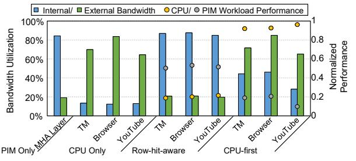
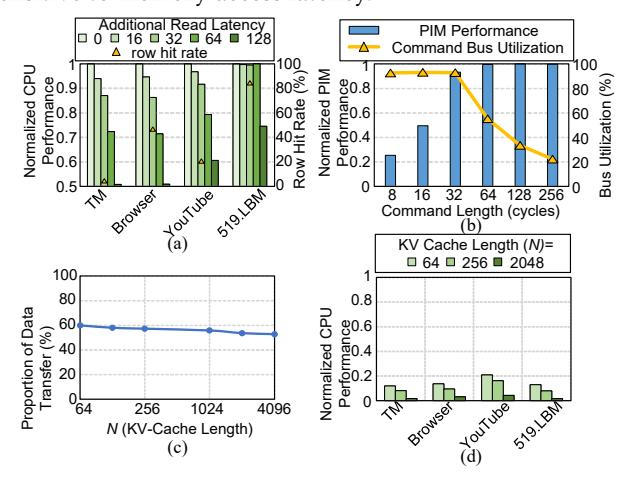

## COSM: A Cooperative Scheduling Framework for Concurrent PIM and CPU Execution on Mobile Devices

Yilong Zhao∗1*,*2 Fangxin Liu∗1*,*2 Onur Mutlu3 Mingyu Gao4*,*2 Jian Liu5 Haibing Guan1 Li Jiang†1*,*2*,*6

1Shanghai Jiao Tong University 2Shanghai Qi Zhi Institute 3ETH Zurich 4 Tsinghua University 5Beihang University 6Huawei Technologies Co., Ltd.

The development of on-device large language models (LLMs) is driven by the need for privacy and fast response times. Energyintensive data transfer on mobile devices makes Processing-in-Memory (PIM) an effective solution. Due to stringent DRAM cost constraints, limited physical footprint on circuit boards, and the interaction between applications and LLMs, it is imperative for the CPU and PIM to operate concurrently within a shared memory space. However, challenges such as bank conflicts and bus congestion can arise, potentially diminishing the performance and energy benefits of PIM.

To address this challenge, we introduce COSM, a cooperative scheduling framework designed to facilitate the concurrent operation of PIM and CPU tasks on mobile platforms. Our key innovations include: 1) a low-interference PIM control interface that generates the maximum number of PIM commands without disrupting CPU memory accesses; 2) an idleness-aware scheduling method that integrates PIM commands into available idle time windows within the CPU's access sequence. COSM not only hides PIM execution latency from the CPU, but also overlaps PIM execution with data transfer. Experiments on concurrent execution of LLMs and mobile workloads, including mobile applications and compute-intensive kernels, demonstrate that COSM improves PIM throughput by up to 2.8× compared to the baseline scheduling method with less than 2.0% CPU performance loss.

Index Terms– processing-in-memory (PIM), memory scheduling, mobile devices, LLM inference, memory interference

## 1. Introduction

AI advancements are moving large language models (LLMs) from the cloud to edge devices (e.g., mobile phones and PCs), enhancing privacy by keeping data local and enabling millisecond latency for interactive apps like voice assistants [\[1–](#page-14-0)[3\]](#page-14-1), real-time translation [\[4](#page-14-2)[,5\]](#page-14-3), real-time video understanding [\[6\]](#page-14-4), and video editing [\[7\]](#page-14-5). Industry trends show that companies such as Apple [\[8\]](#page-14-6), Huawei [\[9\]](#page-14-7), Qualcomm [\[10\]](#page-14-8), Samsung [\[11\]](#page-14-9), and Vivo [\[12\]](#page-14-10) have integrated AI on the device with models of 1B–3B parameters, highlighting "localized intelligence" as a key feature of future smart devices. Thus, efficiently running LLMs on resource-limited mobile devices has become a major challenge for both academia and industry.

Current on-device deployment strategies using Neural Processing Units (NPUs) have notable limitations. Despite high compute throughput, current devices' and NPUs' processorcentric architecture spends over 60% of its total energy consumption on data movement during LLM inference, causing thermal challenges and shortening battery life [\[13\]](#page-14-11). For instance, a 7B model on a mobile NPU can draw over 450 mA current [\[14\]](#page-14-12). Moreover, the limited LPDDR5X memory bandwidth (typically *<*80 GB/s) also leads to latency fluctuations during long-context generation [\[13\]](#page-14-11).

Processing-in-Memory (PIM) directly integrates computation units (PIM units) near memory banks in a DRAM chip to overcome limited memory bandwidth [\[15–](#page-14-13)[35\]](#page-15-0). This innovation enhances internal bandwidth (i.e., the bandwidth from the memory banks and row buffers to either I/O circuitry or PIM units) by processing data locally, thereby bypassing the bottleneck of external bandwidth (i.e., the bandwidth across the memory bus). Samsung's LPDDR5-PIM prototype showed a 70% reduction in power consumption and 102.4 GB/s memory bandwidth in mobile settings [\[36\]](#page-15-1). Thus, PIM is emerging as a promising and effective architectural paradigm to overcome the energy and memory bottlenecks of mobile AI hardware [\[36\]](#page-15-1).

Some DRAM-PIM designs, like UPMEM's DDR4-PIM [\[15\]](#page-14-13), enforce static partitioning between CPU and PIM memory spaces, which incurs substantial memory reservation overhead for LLMs and significant data movement between CPU and PIM units. Shared-memory PIM architectures, where the CPU and PIM units physically share the same memory space rather than operating in isolated memory spaces, address this problem by using OS-managed logical isolation instead but they introduce new challenges in memory management [\[18,](#page-14-14)[37\]](#page-15-2) and bandwidth scheduling [\[38–](#page-15-3)[41\]](#page-15-4). While recent works aim to tackle these issues, the industry has not yet deeply explored this direction. We observe complementary bandwidth usage: CPUs use high external DRAM bandwidth but low internal DRAM bandwidth, opposite to PIM units. This allows us to leverage idle internal bandwidth of CPU workloads for PIM tasks, enhancing memory efficiency and offering dual benefits for mobile devices: reduced overhead due to dynamic sharings of banks between CPU and PIM units and lower power consumption due to less data movement.

The shared memory design aims to harvest idle DRAM bandwidth for PIM workloads without significantly impacting CPU performance. Current PIM scheduling frameworks are hindered by memory scheduling and PIM control interface constraints. Memory scheduling strategies have trade-offs: CPUfirst scheduling [\[39\]](#page-15-5) maintains CPU latency but underutilizes internal bandwidth, while row-hit-aware scheduling [\[38](#page-15-3)[,40\]](#page-15-6) optimizes bandwidth utilization and PIM performance but de-

∗ Yilong Zhao and Fangxin Liu contribute equally to this work. † Li Jiang is the corresponding author.

grades CPU performance. Both strategies struggle to balance PIM and CPU performance. Additionally, PIM control limitations further exacerbate the scheduling difficulty. PIM architectures with fine-grained commands minimize CPU blocking, but can saturate the command bus, reducing PIM throughput [\[16](#page-14-15)[,42\]](#page-15-7). In addition, CPU-initiated data transfers in PIM workloads for staging inputs and collecting results, referred to as CPU-mediated transfer, share data paths with CPU access, causing contention and degrading CPU performance.

In this work, we present COSM, a novel cooperative scheduling framework for concurrent PIM/CPU execution designed to balance CPU and PIM performance trade-offs. We first propose a low-interference PIM control interface that includes two key mechanisms: (1) a preemptable PIM execution command to mitigate command bus contention while ensuring responsive CPU access, and (2) a bandwidth-decoupled data transfer command to prevent PIM data transfer from stalling CPU accesses. Built on this interface, we propose an idlenessaware scheduling strategy in the memory controller. Specifically, by monitoring the CPU access queue, the controller identifies idle time windows on both the memory bus and banks. It then schedules PIM commands, including PIM execution and data transfer, within these idle time windows, to fully exploit idle bandwidth while minimizing interference with CPU memory accesses. This strategy enhances resource utilization while incurring minimal impact on CPU performance.

We make the following contributions:

- We provide key observations that identify critical factors affecting the performance of both CPU and PIM workloads, offering design insights for PIM systems. While CPU workloads are sensitive to memory access latency, existing PIM designs cause significant interference during both PIM execution and CPU-mediated data transfers. This is a conflict rooted in both the PIM control interface and memory scheduling strategy. Particularly, CPU-mediated data transfers within PIM workloads incur substantial performance degradation for CPU tasks.
- We propose COSM, a new cooperative scheduling framework for concurrent PIM/CPU execution on mobile devices. At the interface level, COSM introduces a low-interference PIM control interface tailored to our observations of CPU and PIM workload conflicts. Building on this, our scheduling policy precisely coordinates PIM command dispatch to exploit CPU idle time windows of CPU access, keeping CPU access latency low while maximizing PIM performance.
- Our comprehensive experiments show that COSM improves LLM throughput on PIM by 2.6× with less than 2.2% performance degradation on concurrent CPU workloads.

## 2. Background

## 2.1. Hierarchical Architecture of DRAM

In modern DRAM, the latency of control commands (e.g., opening a row in LPDDR5 [\[43\]](#page-15-8) requires *tRP* +*tRCD* ≈ 30 DRAM clock cycles) is much longer than the duration of the burst length (*tBL* = 8 DRAM clock cycles), where *tRP*, *tRCD*, and *tBL* refer to row precharge time, the row address strobe to column address strobe delay, and the burst length [\[44](#page-15-9)[,45\]](#page-15-10). To mitigate this overhead, DRAM adopts a hierarchical architecture. Multiple banks in a rank can operate independently, and row operations can overlap with each other across banks that share a common memory bus.

As DRAM density increases with increasing bank counts, the overhead of row opening emerges as a fundamental scaling bottleneck. Although more banks offer higher theoretical parallelism, fixed command bandwidth severely restricts maximum internal bandwidth utilization. For example, in a typical 2-rank LPDDR5 per-channel mobile phone setup, each rank has 32 banks [\[36\]](#page-15-1) (#*bank* = 32). For a workload with a row hit rate *Rh*, the upper bound under saturated external bandwidth (i.e., assuming 100% external bandwidth utilization) is:

$$Util_i = \frac{tBL + (tRP + tRCD) \cdot (1 - R_h)}{\#bank \cdot tBL}$$
 (1)

The #*bank* term in the denominator illustrates that the shared command bus serializes bank accesses, causing the denominator to far outweigh the numerator. This reveals a fundamental problem: even with completely random access that leads to zero hit rate (*Rh* = 0), the utilization of internal bandwidth cannot exceed 15%. Real-world workloads typically achieve far lower utilization, as demonstrated in Fig. [1.](#page-1-0)

Fig. 1: Internal/external DRAM bandwidth utilization of CPU and PIM workloads, and CPU/PIM workload performance under different scheduling strategies when concurrently executing on physically shared memory space. (Note: TM stands for TencentMeeting.)

## 2.2. DRAM-based PIM

Unlike traditional heterogeneous systems (e.g., CPU-GPU systems) where all compute units share a unified DRAM controller interface, PIM units are spatially distributed across DRAM banks and access memory through dedicated intra-bank pathways. This fundamental architectural distinction requires specialized interfaces for PIM systems. Current implementations predominantly adopt two types of PIM interfaces:

2.2.1. Two-Host Design. A PIM unit functions independently from the CPU, with its own instruction sequencer and local DRAM access [\[15,](#page-14-13)[33,](#page-15-11)[34,](#page-15-12)[46](#page-15-13)[–49\]](#page-15-14). During PIM operations, CPU access to these banks is blocked to prevent DRAM state corruption. Completion of PIM tasks is detected through polling, which checks status registers. After execution, the memory controller must resynchronize DRAM for CPU access, causing significant switching overhead between CPU and PIM access.

2.2.2. Single-Host Design. PIM units use extended DRAM commands for precise control, optimized for specific PIM workloads due to limited command encoding space [\[16,](#page-14-15)[30](#page-14-16)[,38,](#page-15-3)[39](#page-15-5)[,42,](#page-15-7)[50](#page-15-15)[,51\]](#page-15-16). Recent advances include translation tables that map high-level operations to these commands, enhancing flexibility. This design, unlike the two-host model, keeps the memory controller fully aware of changes in DRAM state during PIM operations. Its centralized scheduling allows fine-grained interleaving of CPU and PIM commands without extra synchronization, supporting efficient concurrency by removing conservative timing or polling requirements.

## 3. Key Observations and Design Implications

We analyze CPU and PIM workload interactions in a shared-memory CPU/PIM hybrid system with concurrent execution. We present three key observations affecting performance and analyze concurrent execution techniques. These insights drive our interface and scheduling co-design in Section 5 and 6.

## 3.1. Effect of Latency Interference on Memory Access

To characterize the impact of memory-side contention, we conduct a sensitivity study on CPU performance in response to increased memory latency. We simulate PIM-induced access delays by injecting additional CPU read latency on a CPU-only system across three real-world applications and a SPEC 2017 benchmark. As shown in Figure 2(a), a 16-cycle latency increase reduces CPU performance by more than 5%. As latency increases, performance significantly degrades: e.g., a 128-cycle latency reduces CPU performance by more than 40% for some workloads. This confirms that CPU workload performance is sensitive to memory access latency.

Fig. 2: (a) CPU workload performance under injected read latency. (b) PIM workload performance and command bus occupation across command lengths. Performance is normalized to the peak performance under an unsaturated command bus (command length >= 64). (c) Proportion of CPU-mediated transfer in an attention layer inference of DeepSeek-R1-1.5B. (d) CPU workload performance when concurrently executing with CPU-mediated PIM data transfer.

The results of this study offer two key guidelines for the formulation of memory scheduling strategies in the concurrent execution of CPU-PIM hybrid systems. First, the system must enable fast preemption of PIM operations to reduce CPU request latency. This requires interrupting PIM operations and minimizing the switching overhead between CPU and PIM commands. A single-host design with fine-grained PIM command control is preferred, as a two-host design introduces significant switching latency, and coarse-grained PIM commands hinder timely CPU access. Second, memory scheduling

should give precedence to CPU memory accesses and restrict PIM operations to periods when the memory is idle, thereby guaranteeing minimal disruption. Collectively, these guidelines require a closely integrated design of the PIM execution interface alongside the memory scheduler.

## 3.2. Effect of PIM Command Granularity on Performance

We study how the granularity of PIM execution commands affects PIM performance, defining the "command length" as the number of cycles PIM units can execute autonomously per command. Figure 2(b) shows that longer command lengths improve PIM performance in a single-host system with 2 LPDDR5 ranks per channel and 32 banks in total. A command with a length of  $\geq$  128 keeps the command bandwidth below 40%, while a length of  $\geq$  64 is needed for full bank-level parallelism across 32 banks (taking into account the opening overheads of rows). Shorter command lengths cause command bus congestion and external DRAM bandwidth underutilization.

This finding is in tension with the observation in Section 3.1: longer command lengths boost PIM performance, but shorter ones are crucial to minimize CPU memory latency. To eliminate this tension in existing fixed-length command architectures, we propose preemptable PIM execution commands in the COSM framework to balance extended command benefits with CPU access needs.

## COSM: A Cooperative Scheduling Framework for Concurrent PIM and CPU Execution on Mobile Devices

Yilong Zhao∗1*,*2 Fangxin Liu∗1*,*2 Onur Mutlu3 Mingyu Gao4*,*2 Jian Liu5 Haibing Guan1 Li Jiang†1*,*2*,*6

1Shanghai Jiao Tong University 2Shanghai Qi Zhi Institute 3ETH Zurich 4 Tsinghua University 5Beihang University 6Huawei Technologies Co., Ltd.

The development of on-device large language models (LLMs) is driven by the need for privacy and fast response times. Energyintensive data transfer on mobile devices makes Processing-in-Memory (PIM) an effective solution. Due to stringent DRAM cost constraints, limited physical footprint on circuit boards, and the interaction between applications and LLMs, it is imperative for the CPU and PIM to operate concurrently within a shared memory space. However, challenges such as bank conflicts and bus congestion can arise, potentially diminishing the performance and energy benefits of PIM.

To address this challenge, we introduce COSM, a cooperative scheduling framework designed to facilitate the concurrent operation of PIM and CPU tasks on mobile platforms. Our key innovations include: 1) a low-interference PIM control interface that generates the maximum number of PIM commands without disrupting CPU memory accesses; 2) an idleness-aware scheduling method that integrates PIM commands into available idle time windows within the CPU's access sequence. COSM not only hides PIM execution latency from the CPU, but also overlaps PIM execution with data transfer. Experiments on concurrent execution of LLMs and mobile workloads, including mobile applications and compute-intensive kernels, demonstrate that COSM improves PIM throughput by up to 2.8× compared to the baseline scheduling method with less than 2.0% CPU performance loss.

Index Terms– processing-in-memory (PIM), memory scheduling, mobile devices, LLM inference, memory interference

## 1. Introduction

AI advancements are moving large language models (LLMs) from the cloud to edge devices (e.g., mobile phones and PCs), enhancing privacy by keeping data local and enabling millisecond latency for interactive apps like voice assistants [\[1–](#page-14-0)[3\]](#page-14-1), real-time translation [\[4](#page-14-2)[,5\]](#page-14-3), real-time video understanding [\[6\]](#page-14-4), and video editing [\[7\]](#page-14-5). Industry trends show that companies such as Apple [\[8\]](#page-14-6), Huawei [\[9\]](#page-14-7), Qualcomm [\[10\]](#page-14-8), Samsung [\[11\]](#page-14-9), and Vivo [\[12\]](#page-14-10) have integrated AI on the device with models of 1B–3B parameters, highlighting "localized intelligence" as a key feature of future smart devices. Thus, efficiently running LLMs on resource-limited mobile devices has become a major challenge for both academia and industry.

Current on-device deployment strategies using Neural Processing Units (NPUs) have notable limitations. Despite high compute throughput, current devices' and NPUs' processorcentric architecture spends over 60% of its total energy consumption on data movement during LLM inference, causing thermal challenges and shortening battery life [\[13\]](#page-14-11). For instance, a 7B model on a mobile NPU can draw over 450 mA current [\[14\]](#page-14-12). Moreover, the limited LPDDR5X memory bandwidth (typically *<*80 GB/s) also leads to latency fluctuations during long-context generation [\[13\]](#page-14-11).

Processing-in-Memory (PIM) directly integrates computation units (PIM units) near memory banks in a DRAM chip to overcome limited memory bandwidth [\[15–](#page-14-13)[35\]](#page-15-0). This innovation enhances internal bandwidth (i.e., the bandwidth from the memory banks and row buffers to either I/O circuitry or PIM units) by processing data locally, thereby bypassing the bottleneck of external bandwidth (i.e., the bandwidth across the memory bus). Samsung's LPDDR5-PIM prototype showed a 70% reduction in power consumption and 102.4 GB/s memory bandwidth in mobile settings [\[36\]](#page-15-1). Thus, PIM is emerging as a promising and effective architectural paradigm to overcome the energy and memory bottlenecks of mobile AI hardware [\[36\]](#page-15-1).

Some DRAM-PIM designs, like UPMEM's DDR4-PIM [\[15\]](#page-14-13), enforce static partitioning between CPU and PIM memory spaces, which incurs substantial memory reservation overhead for LLMs and significant data movement between CPU and PIM units. Shared-memory PIM architectures, where the CPU and PIM units physically share the same memory space rather than operating in isolated memory spaces, address this problem by using OS-managed logical isolation instead but they introduce new challenges in memory management [\[18,](#page-14-14)[37\]](#page-15-2) and bandwidth scheduling [\[38–](#page-15-3)[41\]](#page-15-4). While recent works aim to tackle these issues, the industry has not yet deeply explored this direction. We observe complementary bandwidth usage: CPUs use high external DRAM bandwidth but low internal DRAM bandwidth, opposite to PIM units. This allows us to leverage idle internal bandwidth of CPU workloads for PIM tasks, enhancing memory efficiency and offering dual benefits for mobile devices: reduced overhead due to dynamic sharings of banks between CPU and PIM units and lower power consumption due to less data movement.

The shared memory design aims to harvest idle DRAM bandwidth for PIM workloads without significantly impacting CPU performance. Current PIM scheduling frameworks are hindered by memory scheduling and PIM control interface constraints. Memory scheduling strategies have trade-offs: CPUfirst scheduling [\[39\]](#page-15-5) maintains CPU latency but underutilizes internal bandwidth, while row-hit-aware scheduling [\[38](#page-15-3)[,40\]](#page-15-6) optimizes bandwidth utilization and PIM performance but de-

∗ Yilong Zhao and Fangxin Liu contribute equally to this work. † Li Jiang is the corresponding author.

grades CPU performance. Both strategies struggle to balance PIM and CPU performance. Additionally, PIM control limitations further exacerbate the scheduling difficulty. PIM architectures with fine-grained commands minimize CPU blocking, but can saturate the command bus, reducing PIM throughput [\[16](#page-14-15)[,42\]](#page-15-7). In addition, CPU-initiated data transfers in PIM workloads for staging inputs and collecting results, referred to as CPU-mediated transfer, share data paths with CPU access, causing contention and degrading CPU performance.

In this work, we present COSM, a novel cooperative scheduling framework for concurrent PIM/CPU execution designed to balance CPU and PIM performance trade-offs. We first propose a low-interference PIM control interface that includes two key mechanisms: (1) a preemptable PIM execution command to mitigate command bus contention while ensuring responsive CPU access, and (2) a bandwidth-decoupled data transfer command to prevent PIM data transfer from stalling CPU accesses. Built on this interface, we propose an idlenessaware scheduling strategy in the memory controller. Specifically, by monitoring the CPU access queue, the controller identifies idle time windows on both the memory bus and banks. It then schedules PIM commands, including PIM execution and data transfer, within these idle time windows, to fully exploit idle bandwidth while minimizing interference with CPU memory accesses. This strategy enhances resource utilization while incurring minimal impact on CPU performance.

We make the following contributions:

- We provide key observations that identify critical factors affecting the performance of both CPU and PIM workloads, offering design insights for PIM systems. While CPU workloads are sensitive to memory access latency, existing PIM designs cause significant interference during both PIM execution and CPU-mediated data transfers. This is a conflict rooted in both the PIM control interface and memory scheduling strategy. Particularly, CPU-mediated data transfers within PIM workloads incur substantial performance degradation for CPU tasks.
- We propose COSM, a new cooperative scheduling framework for concurrent PIM/CPU execution on mobile devices. At the interface level, COSM introduces a low-interference PIM control interface tailored to our observations of CPU and PIM workload conflicts. Building on this, our scheduling policy precisely coordinates PIM command dispatch to exploit CPU idle time windows of CPU access, keeping CPU access latency low while maximizing PIM performance.
- Our comprehensive experiments show that COSM improves LLM throughput on PIM by 2.6× with less than 2.2% performance degradation on concurrent CPU workloads.

## 2. Background

## 2.1. Hierarchical Architecture of DRAM

In modern DRAM, the latency of control commands (e.g., opening a row in LPDDR5 [\[43\]](#page-15-8) requires *tRP* +*tRCD* ≈ 30 DRAM clock cycles) is much longer than the duration of the burst length (*tBL* = 8 DRAM clock cycles), where *tRP*, *tRCD*, and *tBL* refer to row precharge time, the row address strobe to column address strobe delay, and the burst length [\[44](#page-15-9)[,45\]](#page-15-10). To mitigate this overhead, DRAM adopts a hierarchical architecture. Multiple banks in a rank can operate independently, and row operations can overlap with each other across banks that share a common memory bus.

As DRAM density increases with increasing bank counts, the overhead of row opening emerges as a fundamental scaling bottleneck. Although more banks offer higher theoretical parallelism, fixed command bandwidth severely restricts maximum internal bandwidth utilization. For example, in a typical 2-rank LPDDR5 per-channel mobile phone setup, each rank has 32 banks [\[36\]](#page-15-1) (#*bank* = 32). For a workload with a row hit rate *Rh*, the upper bound under saturated external bandwidth (i.e., assuming 100% external bandwidth utilization) is:

$$Util_i = \frac{tBL + (tRP + tRCD) \cdot (1 - R_h)}{\#bank \cdot tBL}$$
 (1)

The #*bank* term in the denominator illustrates that the shared command bus serializes bank accesses, causing the denominator to far outweigh the numerator. This reveals a fundamental problem: even with completely random access that leads to zero hit rate (*Rh* = 0), the utilization of internal bandwidth cannot exceed 15%. Real-world workloads typically achieve far lower utilization, as demonstrated in Fig. [1.](#page-1-0)

Fig. 1: Internal/external DRAM bandwidth utilization of CPU and PIM workloads, and CPU/PIM workload performance under different scheduling strategies when concurrently executing on physically shared memory space. (Note: TM stands for TencentMeeting.)

## 2.2. DRAM-based PIM

Unlike traditional heterogeneous systems (e.g., CPU-GPU systems) where all compute units share a unified DRAM controller interface, PIM units are spatially distributed across DRAM banks and access memory through dedicated intra-bank pathways. This fundamental architectural distinction requires specialized interfaces for PIM systems. Current implementations predominantly adopt two types of PIM interfaces:

2.2.1. Two-Host Design. A PIM unit functions independently from the CPU, with its own instruction sequencer and local DRAM access [\[15,](#page-14-13)[33,](#page-15-11)[34,](#page-15-12)[46](#page-15-13)[–49\]](#page-15-14). During PIM operations, CPU access to these banks is blocked to prevent DRAM state corruption. Completion of PIM tasks is detected through polling, which checks status registers. After execution, the memory controller must resynchronize DRAM for CPU access, causing significant switching overhead between CPU and PIM access.

2.2.2. Single-Host Design. PIM units use extended DRAM commands for precise control, optimized for specific PIM workloads due to limited command encoding space [\[16,](#page-14-15)[30](#page-14-16)[,38,](#page-15-3)[39](#page-15-5)[,42,](#page-15-7)[50](#page-15-15)[,51\]](#page-15-16). Recent advances include translation tables that map high-level operations to these commands, enhancing flexibility. This design, unlike the two-host model, keeps the memory controller fully aware of changes in DRAM state during PIM operations. Its centralized scheduling allows fine-grained interleaving of CPU and PIM commands without extra synchronization, supporting efficient concurrency by removing conservative timing or polling requirements.

## 3. Key Observations and Design Implications

We analyze CPU and PIM workload interactions in a shared-memory CPU/PIM hybrid system with concurrent execution. We present three key observations affecting performance and analyze concurrent execution techniques. These insights drive our interface and scheduling co-design in Section 5 and 6.

## 3.1. Effect of Latency Interference on Memory Access

To characterize the impact of memory-side contention, we conduct a sensitivity study on CPU performance in response to increased memory latency. We simulate PIM-induced access delays by injecting additional CPU read latency on a CPU-only system across three real-world applications and a SPEC 2017 benchmark. As shown in Figure 2(a), a 16-cycle latency increase reduces CPU performance by more than 5%. As latency increases, performance significantly degrades: e.g., a 128-cycle latency reduces CPU performance by more than 40% for some workloads. This confirms that CPU workload performance is sensitive to memory access latency.

Fig. 2: (a) CPU workload performance under injected read latency. (b) PIM workload performance and command bus occupation across command lengths. Performance is normalized to the peak performance under an unsaturated command bus (command length >= 64). (c) Proportion of CPU-mediated transfer in an attention layer inference of DeepSeek-R1-1.5B. (d) CPU workload performance when concurrently executing with CPU-mediated PIM data transfer.

The results of this study offer two key guidelines for the formulation of memory scheduling strategies in the concurrent execution of CPU-PIM hybrid systems. First, the system must enable fast preemption of PIM operations to reduce CPU request latency. This requires interrupting PIM operations and minimizing the switching overhead between CPU and PIM commands. A single-host design with fine-grained PIM command control is preferred, as a two-host design introduces significant switching latency, and coarse-grained PIM commands hinder timely CPU access. Second, memory scheduling

should give precedence to CPU memory accesses and restrict PIM operations to periods when the memory is idle, thereby guaranteeing minimal disruption. Collectively, these guidelines require a closely integrated design of the PIM execution interface alongside the memory scheduler.

## 3.2. Effect of PIM Command Granularity on Performance

We study how the granularity of PIM execution commands affects PIM performance, defining the "command length" as the number of cycles PIM units can execute autonomously per command. Figure 2(b) shows that longer command lengths improve PIM performance in a single-host system with 2 LPDDR5 ranks per channel and 32 banks in total. A command with a length of  $\geq$  128 keeps the command bandwidth below 40%, while a length of  $\geq$  64 is needed for full bank-level parallelism across 32 banks (taking into account the opening overheads of rows). Shorter command lengths cause command bus congestion and external DRAM bandwidth underutilization.

This finding is in tension with the observation in Section 3.1: longer command lengths boost PIM performance, but shorter ones are crucial to minimize CPU memory latency. To eliminate this tension in existing fixed-length command architectures, we propose preemptable PIM execution commands in the COSM framework to balance extended command benefits with CPU access needs.

