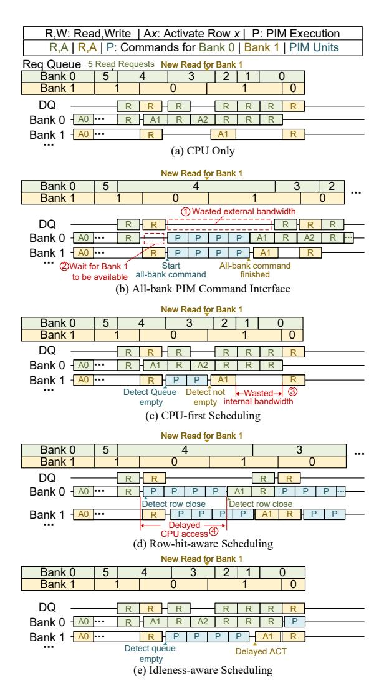
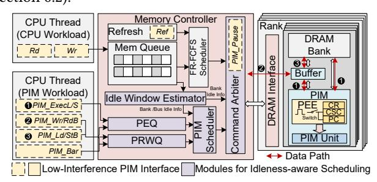
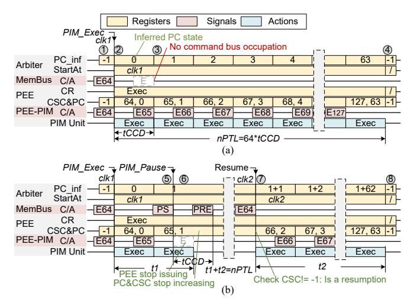

# 3.3. Interference from CPU-mediated PIM Data Transfer

Although PIM workloads primarily leverage internal DRAM bandwidth between PIM units and their local banks, the host CPU still needs to transfer input data to PIM units and collect results from PIM units. These necessary CPU-mediated transfers create memory contention for co-executing CPU workloads that share the same DRAM devices.

To quantify the impact of this bandwidth contention, we first measure the proportion of CPU-mediated transfers during an attention layer inference of a DeepSeek-R1-1.5B model [52] in the decoding phase on the same system as Section 3.2, as shown in Fig. 2(c). The command length of each PIM execution is set to 128 cycles. When the sequence length dimension N of Key-Value (KV) cache is 64, CPU-mediated transfers account for over 60% of the overall inference time. As N increases during inference, this proportion gradually decreases to around 50% when N=4k, demonstrating that CPU-mediated transfers still constitute a substantial fraction of the overall execution time.

Fig. 2(d) further demonstrates the interference caused by CPU-mediated transfers on concurrent CPU workloads. Both CPU-mediated transfers of PIM workload and conventional CPU memory requests in CPU workload share the same memory request queue, which is scheduled using the classic First-Ready, First-Come First-Serve (FR-FCFS) policy [53,54]. We observe that CPU workload performance degrades by more than 80% when concurrent with CPU-mediated transfers. This severe slowdown arises because CPU-mediated transfers exhibit bursty access patterns with high row-buffer locality. Under the FR-FCFS scheduler, such bursts monopolize the memory controller (as described in [55–57]) by repeatedly hitting open

rows, thereby starving CPU workloads, whose requests often require costly row conflicts.

These results reveal a critical insight: the effect of the observed 80% CPU performance degradation during the 50% data transfer can translate into a 40% reduction in overall CPU performance. This disproportionate impact shows that CPU-mediated transfers must be treated as first-class citizens in memory scheduling in concurrent CPU and PIM access scenarios. Consequently, CPU-mediated transfers must be governed by the same scheduling discipline as PIM units' execution, i.e., scheduled during idle time windows. However, implementing the CPU-mediated transfers requires simultaneous availability of both external and internal idle time windows, making it difficult to fully utilize memory idle time windows, limiting PIM throughput. To overcome this, COSM introduces bandwidth-decoupled CPUmediated transfer commands that decouple the usage of external and internal bandwidth, eliminating the need for simultaneous external and internal idle time window availability.

#### 3.4. Concurrent CPU-PIM Execution Methods

Based on the observations above, we analyze several techniques for concurrent execution of PIM and CPU on shared memory banks. Fig. 3(a) depicts CPU memory request processing under FR-FCFS, showing memory bus and bank occupancy along with per-bank queue lengths. Fig. 3(b)-(d) compare three concurrency techniques under the same CPU workload. Each PIM workload consists of one burst write of CPU-mediated transfer (co-scheduled with normal CPU access under FR-FCFS) followed by multiple execution commands.

**3.4.1.** All-bank PIM Command Interface. The *all-bank* command mitigates command bandwidth bottlenecks by invoking all PIM units with one PIM command [42]. As shown in Fig. 3 (b), this method integrates a PIM command amidst CPU memory requests. However, it causes bandwidth underutilization: all-bank command execution leaves no bank available for CPU accesses, making external bandwidth idle (①), and PIM commands must wait for all banks to become available, causing latency (②).

**3.4.2. CPU-first Scheduling.** Chopim [39] introduces a memory scheduling algorithm based on the idea that CPU workloads are sensitive to memory latency. It blocks PIM commands once the memory queue is detected as not empty, as shown in Fig. 3(c). While PIM commands minimally impact CPU latency, bandwidth utilization remains suboptimal. When a request targets Row 1 of Bank 1, the scheduler immediately stops issuing PIM commands. However, due to bus contention, there is a latency gap between row activation command (ACT) and data access, leading to wasted internal bandwidth (③).

**3.4.3. Row-hit-aware Scheduling.** AsyncDIMM [38] and F3FS [40] suggest that the memory controller switches between the PIM command queue and the CPU request queue when a row-close command (PRE) is executed, benefiting memory-intensive tasks with high row hit rates by balancing the CPU and PIM scheduling. However, with this policy, CPU performance suffers in compute-intensive tasks with random access. As shown in Fig. 3(d), closing row 1 in bank 0 forces the memory controller to switch to the PIM command queue, causing

Fig. 3: (a) An example of FR-FCFS scheduling for a CPU-only workload and (b-e) methods for concurrent PIM/CPU execution. To simplify the diagram, precharge is combined with activation, and row activations prior to PIM executions are not shown.

CPU access delays and higher memory latency (4).

As such, prior scheduling methods cannot both provide low CPU memory latency and allow PIM workloads to fully utilize the temporary idle periods across banks on mobile devices. Furthermore, prior scheduling methods lack a dedicated scheduling policy for CPU-mediated data transfers, which interferes with CPU workloads as observed in Section 3.3.

## 4. Architecture Overview

We introduce a new scheduling framework in the memory controller to enhance the use of PIM workload bandwidth without affecting CPU memory latency. Our approach opportunistically schedules PIM operations during CPU request idle times, ensuring minimal CPU interference. COSM employs a dualpath SW/HW co-design. First, we extend the DRAM command set to enable a low-interference PIM control interface (see Section 5), forcing PIM tasks to pause for high-priority CPU requests, and create dedicated commands for CPU-mediated data transfers that decouple internal and external bandwidth

usage. Second, we develop an idleness-aware scheduling policy (see Section 6) that inserts PIM commands during idle time windows of CPU access while maintaining CPU latency guarantees, by enhancing the memory controller hardware.

Figure 4 shows the architecture of the COSM memory controller. We extend the software layer on the CPU side to accommodate a low-interference memory interface. A PIM Execution Engine (PEE) in PIM units manages preemptable command execution and prevents command bus saturation. We use an SRAM buffer next to each DRAM bank to buffer both the operands for PIM execution and the data staged by the decoupledbandwidth CPU-mediated transfer commands. facilitate both CPU-mediated transfers and PIM execution. Within the memory controller, we introduce two dedicated PIM queues: the PIM Execution Queue (PEQ), which buffers commands for PIM computations (e.g., PIM\_Exec(L), PIM\_Exec(S)), and the PIM Read/Write Queue (PRWQ), which manages CPU-mediated transfer commands (e.g., PIM\_Ld/StB, PIM\_Rd/WrB). The PIM scheduler is responsible for selecting candidate commands from these queues, while the idle time window estimator (IWE) analyzes patterns in the CPU access queue to predict forthcoming bank- and bus-level idle time windows in between CPU accesses. The Command Arbiter consolidates and chooses from three command sources: 1) the CPU memory access candidate from the traditional FR-FCFS scheduler, 2) the PIM candidate from the PIM scheduler, and 3) pause commands to pause PIM execution (PIM\_Pause) generated by the Command Arbiter itself. The Command Arbiter employs a strict priority policy to decide the final sequence for issuing DRAM commands (Section 6.2).

Fig. 4: COSM's memory controller architecture and memory interface

The controller operates in a four-stage pipeline. First, requests are queued by command type. Second, the IWE examines access queues to predict idle time windows, sending its predictions to the Command Arbiter and PIM scheduler. Third, the FR-FCFS and PIM schedulers each select commands based on their prioritization policies. Finally, the Command Arbiter makes decision: If a PIM-induced stall is predicted for a CPU memory request, the Command Arbiter issues a PIM\_Pause to prevent delaying the CPU accesses. Otherwise, priority is granted to the FR-FCFS scheduler (i.e., serving CPU access and refresh requests). If no such requests are avaliable, a PIM command is scheduled.

#### 5. Low-Interference PIM Control Interface

COSM introduces a refined PIM control interface that explicitly provide two seperate new features: (1) preemptable PIM execution for compute phases, and (2) bandwidth-decoupled

commands for CPU-mediated data movement. This enables fine-grained scheduling control, allowing PIM operations to yield instantly to CPU requests and exploit fragmented idle time windows for PIM commands without compromising data staging efficiency.

#### 5.1. Preemptable PIM Execution commands

The proposed preemptable PIM control interface extends standard DRAM commands with two critical additions: PIM execution command family (PIM\_Exec) that allow PIM units to automatically execute computations continuously for an extended period without requiring additional trigger commands, and a PIM pause command (PIM\_Pause) that enables preemption by halting PIM execution. Compared to the fixed-length command design discussed in Sections 3.1 and 3.2, the preemptable commands enable immediate reaction to incoming CPU access while avoiding command bus saturation that would otherwise degrade PIM performance. The scope of all the PIM command are at the bank level. We employ a hardwarecommand co-design approach to achieve preemptable computation. Managed by the memory controller, this interface allows fine-grained execution of PIM workloads while enabling low CPU memory access latency.

**PIM Execution Commands.** In our setup, the execution commands PIM\_Exec for PIM are tailored for LLM operations such as MAC and softmax. Fig. 5 (a) illustrates the execution of a PIM command and the register states of the PEE. If a command with start column 64 is issued at clk1, the PEE module of the PIM unit switches from state 1 to 2 by setting the Column State Counter (CSC) with the start address, recording the command type in the Command Register (CR), and setting the PIM Counter (PC) as 0. For every tCCD (columnto-column delay), the PEE autonomously increments the Column State Counter and PIM Counter and issues commands in Command Register using the Column State Counter as the column address (3). The Command Arbiter can always synchronize the PIM Counter state by inferring the PIM Counter:  $PC_inf=(clk-clk1)/tCCD$ , where clk is the current clock cycle. This procedure halts after nPTL cycles (i.e., PIM execution command length predefined by the DRAM configuration register) by comparing PIM Counter value with the nPTL/tCCDvalue if there is no CPU memory access, and PEE returns to its default state (4). This reduces the usage of the command bus by nPTL/tCCD times compared to fine-grained commands (see Section 3.2). In the setup shown in Fig. 2 (b) (2 ranks ×16 banks), nPTL needs to be at least 64 cycles for more flexibility, with lower values leading to command bus contention.

**PIM Pause Command.** The PIM\_Pause command ensures timely CPU request handling by pausing PIM execution. Fig. 5 (b) shows a CPU memory request interrupting PIM execution when the CPU reads from a bank still processing column 65 at time clk2 = clk1 + tCCD + 1. The memory controller's Command Arbiter sends PIM\_Pause to the bank. Upon receiving it, the PEE completes the current column operation in up to tCCD cycles, freezes the Column State Counter (by opening the Switch of PEE in Fig. 4), and releases the bus control (from § to §). The Command Arbiter can directly infer the PIM Counter state by calculating the interval between

Fig. 5: Timing diagram of PIM unit, memory bus, Command Arbiter, and PEE register states of preemptable PIM execution command when (a) no CPU memory access is present and (b) PIM\_Pause is sent by Command Arbiter when processing the second column. En: PIM execution on column n, PS: PIM pause command.

clk1 and the end of the current execution (t1=2tCCD). After CPU access, the Command Arbiter reissues the origin PIM execution command, resuming from the Column State Counterstored column address (③). Knowing that columns 64-65 are completed, the Command Arbiter determines the remaining execution time as t2=nPTL-2tCCD=62tCCD (§), synchronizing with the PIM Counter without extra signaling and minimizing timing constraints.

Timing Constraints. Table 1 provides the timing constraints for preemptable PIM commands. Similar to DRAM read/write commands, a PIM execution command can only be issued after tRCD after row activation. The PIM\_Pause follows at least tCCD cycles after PIM execution command to ensure PIM unit column access completion. Post PIM\_Pause, if the execution command is load-only (PIM\_Exec(Ld)), a PRE can be issued after tRTP cycles. For execution commands with data stores (PIM\_Exec(St)), PRE must wait for data stabilization, requiring tWR. This longer latency necessitates careful design to maximize intermediate result reuse and minimize store operations.

Table 1: Timing Constraint of PIM Commands

| Scope   | Previous                        | Next                        | Min. delay       | Conflict      |
|---------|---------------------------------|-----------------------------|------------------|---------------|
| Bank    | ACT                             | PIM_Exec PIM_LdBuf/StBuf | tRCD             |               |
|         | PIM_Exec PIM_Ld/StBuf        | PIM_Pause                   | tCCD             | DRAM Array |
|         | PIM_Pause (for PIM_Exec(Ld)) | PRE                         | tRTP             |               |
|         | PIM_Pause (for PIM_Exec(St)) | PRE                         | tCCD+tWR         |               |
|         | PIM_RdBuf/WrBuf                 | PIM_RdBuf/WrBuf             | tBL              | PIM           |
|         | PIM_LdBuf/StBuf                 | PIM_LdBuf/StBuf   LBL       |                  | Buffer        |
| Channel | PIM_RdBuf/WrBuf                 | PIM_RdBuf/WrBuf             | tBL              | Memory        |
|         | Read/Write                      | Read/Write                  | $  \iota_{DL}  $ | Bus           |

**Semantic Guarantees of PIM\_Pause.** The correctness of the PIM pause mechanism relies on strict adherence to DRAM timing constraints and three fundamental properties. First, it guarantees *column atomicity* by pausing only at column boundaries (after integer multiples of tCCD), ensuring deterministic

progress tracking for both the PIM unit and the memory controller. Second, it preserves all intermediate data in PIM buffers and architectural states during suspension, preventing context corruption. Third, it correctly restores PIM state by reactivating the original row and reissuing the paused command; the PIM unit then leverages frozen PIM Counter to resume execution precisely at the pause point. Collectively, these guarantees ensure that preempted CPU accesses and DRAM refreshes do not compromise the correctness of PIM execution.

# 3.3. Interference from CPU-mediated PIM Data Transfer

Although PIM workloads primarily leverage internal DRAM bandwidth between PIM units and their local banks, the host CPU still needs to transfer input data to PIM units and collect results from PIM units. These necessary CPU-mediated transfers create memory contention for co-executing CPU workloads that share the same DRAM devices.

To quantify the impact of this bandwidth contention, we first measure the proportion of CPU-mediated transfers during an attention layer inference of a DeepSeek-R1-1.5B model [52] in the decoding phase on the same system as Section 3.2, as shown in Fig. 2(c). The command length of each PIM execution is set to 128 cycles. When the sequence length dimension N of Key-Value (KV) cache is 64, CPU-mediated transfers account for over 60% of the overall inference time. As N increases during inference, this proportion gradually decreases to around 50% when N=4k, demonstrating that CPU-mediated transfers still constitute a substantial fraction of the overall execution time.

Fig. 2(d) further demonstrates the interference caused by CPU-mediated transfers on concurrent CPU workloads. Both CPU-mediated transfers of PIM workload and conventional CPU memory requests in CPU workload share the same memory request queue, which is scheduled using the classic First-Ready, First-Come First-Serve (FR-FCFS) policy [53,54]. We observe that CPU workload performance degrades by more than 80% when concurrent with CPU-mediated transfers. This severe slowdown arises because CPU-mediated transfers exhibit bursty access patterns with high row-buffer locality. Under the FR-FCFS scheduler, such bursts monopolize the memory controller (as described in [55–57]) by repeatedly hitting open

rows, thereby starving CPU workloads, whose requests often require costly row conflicts.

These results reveal a critical insight: the effect of the observed 80% CPU performance degradation during the 50% data transfer can translate into a 40% reduction in overall CPU performance. This disproportionate impact shows that CPU-mediated transfers must be treated as first-class citizens in memory scheduling in concurrent CPU and PIM access scenarios. Consequently, CPU-mediated transfers must be governed by the same scheduling discipline as PIM units' execution, i.e., scheduled during idle time windows. However, implementing the CPU-mediated transfers requires simultaneous availability of both external and internal idle time windows, making it difficult to fully utilize memory idle time windows, limiting PIM throughput. To overcome this, COSM introduces bandwidth-decoupled CPUmediated transfer commands that decouple the usage of external and internal bandwidth, eliminating the need for simultaneous external and internal idle time window availability.

#### 3.4. Concurrent CPU-PIM Execution Methods

Based on the observations above, we analyze several techniques for concurrent execution of PIM and CPU on shared memory banks. Fig. 3(a) depicts CPU memory request processing under FR-FCFS, showing memory bus and bank occupancy along with per-bank queue lengths. Fig. 3(b)-(d) compare three concurrency techniques under the same CPU workload. Each PIM workload consists of one burst write of CPU-mediated transfer (co-scheduled with normal CPU access under FR-FCFS) followed by multiple execution commands.

**3.4.1.** All-bank PIM Command Interface. The *all-bank* command mitigates command bandwidth bottlenecks by invoking all PIM units with one PIM command [42]. As shown in Fig. 3 (b), this method integrates a PIM command amidst CPU memory requests. However, it causes bandwidth underutilization: all-bank command execution leaves no bank available for CPU accesses, making external bandwidth idle (①), and PIM commands must wait for all banks to become available, causing latency (②).

**3.4.2. CPU-first Scheduling.** Chopim [39] introduces a memory scheduling algorithm based on the idea that CPU workloads are sensitive to memory latency. It blocks PIM commands once the memory queue is detected as not empty, as shown in Fig. 3(c). While PIM commands minimally impact CPU latency, bandwidth utilization remains suboptimal. When a request targets Row 1 of Bank 1, the scheduler immediately stops issuing PIM commands. However, due to bus contention, there is a latency gap between row activation command (ACT) and data access, leading to wasted internal bandwidth (③).

**3.4.3. Row-hit-aware Scheduling.** AsyncDIMM [38] and F3FS [40] suggest that the memory controller switches between the PIM command queue and the CPU request queue when a row-close command (PRE) is executed, benefiting memory-intensive tasks with high row hit rates by balancing the CPU and PIM scheduling. However, with this policy, CPU performance suffers in compute-intensive tasks with random access. As shown in Fig. 3(d), closing row 1 in bank 0 forces the memory controller to switch to the PIM command queue, causing

Fig. 3: (a) An example of FR-FCFS scheduling for a CPU-only workload and (b-e) methods for concurrent PIM/CPU execution. To simplify the diagram, precharge is combined with activation, and row activations prior to PIM executions are not shown.

CPU access delays and higher memory latency (4).

As such, prior scheduling methods cannot both provide low CPU memory latency and allow PIM workloads to fully utilize the temporary idle periods across banks on mobile devices. Furthermore, prior scheduling methods lack a dedicated scheduling policy for CPU-mediated data transfers, which interferes with CPU workloads as observed in Section 3.3.

## 4. Architecture Overview

We introduce a new scheduling framework in the memory controller to enhance the use of PIM workload bandwidth without affecting CPU memory latency. Our approach opportunistically schedules PIM operations during CPU request idle times, ensuring minimal CPU interference. COSM employs a dualpath SW/HW co-design. First, we extend the DRAM command set to enable a low-interference PIM control interface (see Section 5), forcing PIM tasks to pause for high-priority CPU requests, and create dedicated commands for CPU-mediated data transfers that decouple internal and external bandwidth

usage. Second, we develop an idleness-aware scheduling policy (see Section 6) that inserts PIM commands during idle time windows of CPU access while maintaining CPU latency guarantees, by enhancing the memory controller hardware.

Figure 4 shows the architecture of the COSM memory controller. We extend the software layer on the CPU side to accommodate a low-interference memory interface. A PIM Execution Engine (PEE) in PIM units manages preemptable command execution and prevents command bus saturation. We use an SRAM buffer next to each DRAM bank to buffer both the operands for PIM execution and the data staged by the decoupledbandwidth CPU-mediated transfer commands. facilitate both CPU-mediated transfers and PIM execution. Within the memory controller, we introduce two dedicated PIM queues: the PIM Execution Queue (PEQ), which buffers commands for PIM computations (e.g., PIM\_Exec(L), PIM\_Exec(S)), and the PIM Read/Write Queue (PRWQ), which manages CPU-mediated transfer commands (e.g., PIM\_Ld/StB, PIM\_Rd/WrB). The PIM scheduler is responsible for selecting candidate commands from these queues, while the idle time window estimator (IWE) analyzes patterns in the CPU access queue to predict forthcoming bank- and bus-level idle time windows in between CPU accesses. The Command Arbiter consolidates and chooses from three command sources: 1) the CPU memory access candidate from the traditional FR-FCFS scheduler, 2) the PIM candidate from the PIM scheduler, and 3) pause commands to pause PIM execution (PIM\_Pause) generated by the Command Arbiter itself. The Command Arbiter employs a strict priority policy to decide the final sequence for issuing DRAM commands (Section 6.2).

Fig. 4: COSM's memory controller architecture and memory interface

The controller operates in a four-stage pipeline. First, requests are queued by command type. Second, the IWE examines access queues to predict idle time windows, sending its predictions to the Command Arbiter and PIM scheduler. Third, the FR-FCFS and PIM schedulers each select commands based on their prioritization policies. Finally, the Command Arbiter makes decision: If a PIM-induced stall is predicted for a CPU memory request, the Command Arbiter issues a PIM\_Pause to prevent delaying the CPU accesses. Otherwise, priority is granted to the FR-FCFS scheduler (i.e., serving CPU access and refresh requests). If no such requests are avaliable, a PIM command is scheduled.

#### 5. Low-Interference PIM Control Interface

COSM introduces a refined PIM control interface that explicitly provide two seperate new features: (1) preemptable PIM execution for compute phases, and (2) bandwidth-decoupled

commands for CPU-mediated data movement. This enables fine-grained scheduling control, allowing PIM operations to yield instantly to CPU requests and exploit fragmented idle time windows for PIM commands without compromising data staging efficiency.

#### 5.1. Preemptable PIM Execution commands

The proposed preemptable PIM control interface extends standard DRAM commands with two critical additions: PIM execution command family (PIM\_Exec) that allow PIM units to automatically execute computations continuously for an extended period without requiring additional trigger commands, and a PIM pause command (PIM\_Pause) that enables preemption by halting PIM execution. Compared to the fixed-length command design discussed in Sections 3.1 and 3.2, the preemptable commands enable immediate reaction to incoming CPU access while avoiding command bus saturation that would otherwise degrade PIM performance. The scope of all the PIM command are at the bank level. We employ a hardwarecommand co-design approach to achieve preemptable computation. Managed by the memory controller, this interface allows fine-grained execution of PIM workloads while enabling low CPU memory access latency.

**PIM Execution Commands.** In our setup, the execution commands PIM\_Exec for PIM are tailored for LLM operations such as MAC and softmax. Fig. 5 (a) illustrates the execution of a PIM command and the register states of the PEE. If a command with start column 64 is issued at clk1, the PEE module of the PIM unit switches from state 1 to 2 by setting the Column State Counter (CSC) with the start address, recording the command type in the Command Register (CR), and setting the PIM Counter (PC) as 0. For every tCCD (columnto-column delay), the PEE autonomously increments the Column State Counter and PIM Counter and issues commands in Command Register using the Column State Counter as the column address (3). The Command Arbiter can always synchronize the PIM Counter state by inferring the PIM Counter:  $PC_inf=(clk-clk1)/tCCD$ , where clk is the current clock cycle. This procedure halts after nPTL cycles (i.e., PIM execution command length predefined by the DRAM configuration register) by comparing PIM Counter value with the nPTL/tCCDvalue if there is no CPU memory access, and PEE returns to its default state (4). This reduces the usage of the command bus by nPTL/tCCD times compared to fine-grained commands (see Section 3.2). In the setup shown in Fig. 2 (b) (2 ranks ×16 banks), nPTL needs to be at least 64 cycles for more flexibility, with lower values leading to command bus contention.

**PIM Pause Command.** The PIM\_Pause command ensures timely CPU request handling by pausing PIM execution. Fig. 5 (b) shows a CPU memory request interrupting PIM execution when the CPU reads from a bank still processing column 65 at time clk2 = clk1 + tCCD + 1. The memory controller's Command Arbiter sends PIM\_Pause to the bank. Upon receiving it, the PEE completes the current column operation in up to tCCD cycles, freezes the Column State Counter (by opening the Switch of PEE in Fig. 4), and releases the bus control (from § to §). The Command Arbiter can directly infer the PIM Counter state by calculating the interval between

Fig. 5: Timing diagram of PIM unit, memory bus, Command Arbiter, and PEE register states of preemptable PIM execution command when (a) no CPU memory access is present and (b) PIM\_Pause is sent by Command Arbiter when processing the second column. En: PIM execution on column n, PS: PIM pause command.

clk1 and the end of the current execution (t1=2tCCD). After CPU access, the Command Arbiter reissues the origin PIM execution command, resuming from the Column State Counterstored column address (③). Knowing that columns 64-65 are completed, the Command Arbiter determines the remaining execution time as t2=nPTL-2tCCD=62tCCD (§), synchronizing with the PIM Counter without extra signaling and minimizing timing constraints.

Timing Constraints. Table 1 provides the timing constraints for preemptable PIM commands. Similar to DRAM read/write commands, a PIM execution command can only be issued after tRCD after row activation. The PIM\_Pause follows at least tCCD cycles after PIM execution command to ensure PIM unit column access completion. Post PIM\_Pause, if the execution command is load-only (PIM\_Exec(Ld)), a PRE can be issued after tRTP cycles. For execution commands with data stores (PIM\_Exec(St)), PRE must wait for data stabilization, requiring tWR. This longer latency necessitates careful design to maximize intermediate result reuse and minimize store operations.

Table 1: Timing Constraint of PIM Commands

| Scope   | Previous                        | Next                        | Min. delay       | Conflict      |
|---------|---------------------------------|-----------------------------|------------------|---------------|
| Bank    | ACT                             | PIM_Exec PIM_LdBuf/StBuf | tRCD             |               |
|         | PIM_Exec PIM_Ld/StBuf        | PIM_Pause                   | tCCD             | DRAM Array |
|         | PIM_Pause (for PIM_Exec(Ld)) | PRE                         | tRTP             |               |
|         | PIM_Pause (for PIM_Exec(St)) | PRE                         | tCCD+tWR         |               |
|         | PIM_RdBuf/WrBuf                 | PIM_RdBuf/WrBuf             | tBL              | PIM           |
|         | PIM_LdBuf/StBuf                 | PIM_LdBuf/StBuf   LBL       |                  | Buffer        |
| Channel | PIM_RdBuf/WrBuf                 | PIM_RdBuf/WrBuf             | tBL              | Memory        |
|         | Read/Write                      | Read/Write                  | $  \iota_{DL}  $ | Bus           |

**Semantic Guarantees of PIM\_Pause.** The correctness of the PIM pause mechanism relies on strict adherence to DRAM timing constraints and three fundamental properties. First, it guarantees *column atomicity* by pausing only at column boundaries (after integer multiples of tCCD), ensuring deterministic

progress tracking for both the PIM unit and the memory controller. Second, it preserves all intermediate data in PIM buffers and architectural states during suspension, preventing context corruption. Third, it correctly restores PIM state by reactivating the original row and reissuing the paused command; the PIM unit then leverages frozen PIM Counter to resume execution precisely at the pause point. Collectively, these guarantees ensure that preempted CPU accesses and DRAM refreshes do not compromise the correctness of PIM execution.

