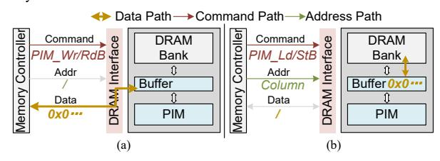
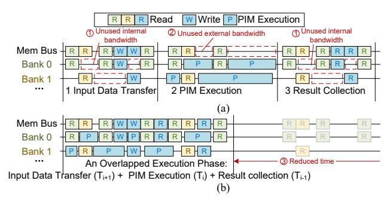
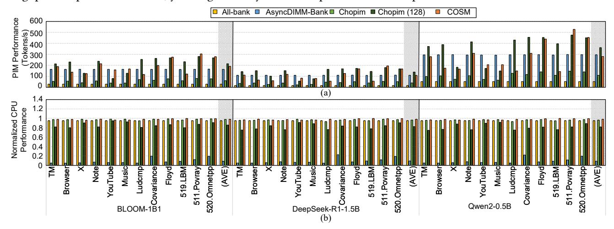
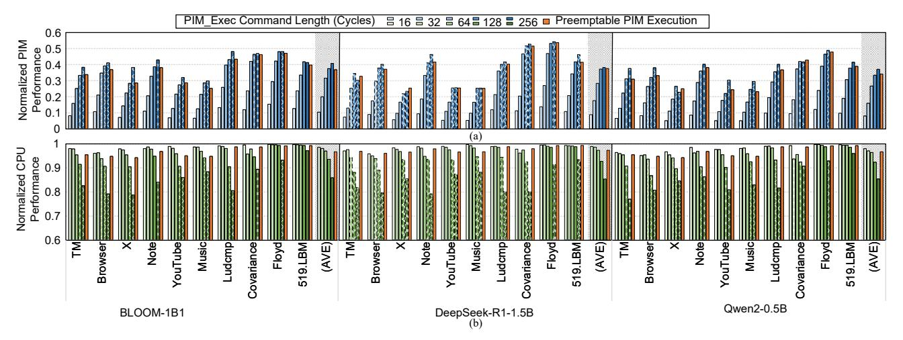
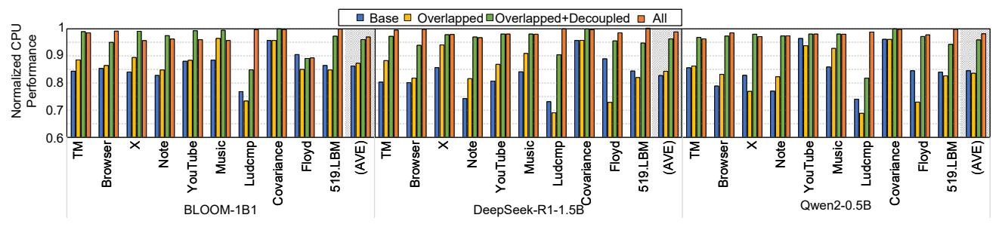

# <span id="page-5-3"></span>5.2. Bandwidth-Decoupled CPU-mediated PIM Data Transfer

Conventional PIM data transfers are based on standard DRAM read/write commands, which could require a long sequence of row activation, column access, and external data transfer. Moreover, the CPU-mediated transfer must occur continuously, locking the channel for the entire duration of the transfer.

We introduce a mechanism that decouples the usage of external bandwidth from that of internal bandwidth during CPU-mediated data transfer. As depicted in Fig. 6, the memory interface employs two-phase reads and writes via four commands: PIM\_RdBuf and PIM\_WrBuf for external transfers between the memory controller and the PIM buffer through the memory bus, and PIM\_LdBuf and PIM\_StBuf for internal transfers between the buffer and DRAM banks. This division allows independent scheduling of requests, minimizing CPU memory access interference by using bus idle time windows for external transfers and exploiting bank idle time window for internal transfers. It enables the idleness-aware scheduling policy detailed in Section 6.2.

<span id="page-5-2"></span>

Fig. 6: The data, command, and address path of (a)  ${\tt PIM\_WrBuf/RdBuf}$  and (b)  ${\tt PIM\_LdBuf/StBuf}$ 

The PIM\_LdBuf and PIM\_StBuf commands are designed to mirror the memory access behavior of PIM\_Exec(Ld) and PIM\_Exec(St): they exclusively access the DRAM bank using internal bandwidth, transferring data from/to the bank to/from the buffer. and do not consume external bandwidth. Consequently, they inherit the same execution model: preemptable operation with a command length of nPTL. This design choice enables unified scheduling logic in all PIM-initiated bank activities.

Additional PIM Buffer Requirement. To support our mechanism, we add an extra segment to the PIM buffer whose capacity is commensurate with the maximum amount of data transferred by a single PIM\_LdBuf or PIM\_StBuf command of length nPTL. Since internal bandwidth is frequently available during ample idle time windows, the scheduler can always complete these short internal transfers before the next external transfer command arrives. Thus, a small per-bank buffer suffices to avoid stalling, as validated in our experiment (Section 8.5).

Timing Constraints. Table [1](#page-5-1) provides the timing constraints for the new commands. PIM\_RdBuf and PIM\_WrBuf commands only use the external memory channel bandwidth, requiring a *tBL* delay after standard Read/Write commands on the same channel. These two commands, along with PIM\_LdBuf/PIM\_StBuf, need the PIM buffer to be ready before execution, adding a *tBL* delay when issued to the same bank. Additionally, PIM\_LdBuf and PIM\_StBuf access the DRAM bank like PIM\_Exec(Ld) and PIM\_Exec(St), following the same timing as DRAM commands like ACT, PRE, Read, and Write.

Memory Ordering and Buffer Consistency. The bandwidth-decoupled transfer mechanism guarantees memory ordering and buffer consistency via strict execution sequencing. Decoupled command pairs (PIM\_RdBuf/PIM\_WrBuf and PIM\_LdBuf/PIM\_StBuf), derived from single CPU-mediated data transfers, must execute in program order, enforced by the memory scheduling strategy in Section [6.](#page-6-0) While other concurrent commands (PIM execution and CPU access) can be interleaved with the decoupled command pairs without ordering constraints since they never access the dedicated PIM buffer regions. These commands can arbitrarily interleave with the data transfer stream, even between decoupled pairs, without violating correctness.

## <span id="page-6-0"></span>6. Idleness-aware Memory Scheduling

This section describes our idleness-aware memory scheduling strategy designed to enhance PIM performance under the CPU-first scheduling principle. The strategy is implemented through two key mechanisms. First, IWE dynamically computes idle time windows for each DRAM bank and the memory bus by analyzing the CPU request queue. This enables more accurate scheduling decisions by the PIM scheduler and Command Arbiter. Second, utilizing the metadata provided by IWE, the PIM scheduler selects commands that optimize the utilization of these idle time windows in both the memory bus and the banks, while simultaneously maintaining low latency for CPU requests.

## 6.1. Idle Window Estimater (IWE)

6.1.1. Bank Idle Time Window Estimation. The occurrence of idle time windows in DRAM banks can be attributed to two primary factors. First, the CPU is generally unable to maintain consecutive memory requests in rapid succession due to the sporadic nature of memory access at the application level, resulting in idle time windows between accesses to the same bank. These inter-request idle time windows have already been leveraged by previous CPU-first scheduling algorithms [\[39\]](#page-15-5). Such schedulers initiate PIM commands when the CPU request queue for a bank is empty and promptly suspend PIM operations upon the emergence of any new CPU request.

The second type of idle time window occurs when, despite the availability of multiple banks with open rows prepared for access, serialization of their access commands over a shared memory bus leads to periods of inactivity. Specifically, this inactivity occurs between the activation of a row (ACT) and its designated data access, during which the bank remains idle with the row open, resulting in the internal bandwidth waste

highlighted in Fig. [3\(](#page-3-0)c). This interval can be strategically optimized by delaying the ACT command until immediately before the data access. In the COSM architecture, the IWE module forecasts the earliest feasible service time for subsequent CPU access of each bank, based on the pending CPU requests. Using this information, the IWE module instructs the Command Arbiter to postpone premature row activations. IWE module uses the resulting idle time window in the bank for PIM operations. As illustrated in Fig. [3\(](#page-3-0)e), the delayed row activation creates a window that can accommodate an additional PIM execution, improving the utilization of internal bandwidth.

IWE estimates the earliest time the next CPU request will be issued for each bank by simulating the FR-FCFS scheduling order of pending requests, thereby estimating each bank's future idle time window. Although the current prototype is designed for FR-FCFS scheduling, IWE module is intrinsically adaptable to different scheduling policies, via modifications to its estimation logic that align with alternative baseline scheduling policies (e.g., [\[58](#page-15-22)[,59\]](#page-15-23)). Because the request queue can dynamically change as new requests arrive or CPU memory accesses are completed, IWE must provide rapid predictions. Therefore, IWE leverages two key characteristics of FR-FCFS. First, rowhit requests are processed consecutively, since they bypass row activation and only require the memory bus (i.e., the external bandwidth), preempting requests from other banks. Secondly, requests within the same rank are grouped to prevent rank switch penalties (*tRT RS*), deferring inter-rank switching until there are no more ready requests in the current rank. These insights allow IWE to closely approximate the actual scheduling order with small overhead, forming the foundation of our algorithm that estimate the earliest access cycle of each bank (Algorithm [1\)](#page-6-1).

#### <span id="page-6-1"></span>Algorithm 1 Earliest Access Cycle Estimation in IWE

```
Require: REQ[] (Earliest-arriving request of each bank)
 1: ready_cycles ← [get_ready_cycle(r) for r in REQ]
 2: t ← cur_tick(), cr ← cur_rank(), service_time ← {}
 3: while REQ.size() do
 4: AnyReady ← Any([r.rank == cr && r.ready ≤ t
   for r in REQ])
 5: if AnyReady then
 6: r ← earliest_ready([r for r in REQ if
   r.rank == cr]), t ← t + tBL
 7: else
 8: r ← earliest_ready(REQ)
 9: t ← max(r.ready, t), cr ← r.rank
10: service_time[r] ← t, REQ.remove(r)
11: for b in range(bank_num) do
12: window_bank[b] ← service_time[r] | r.bank == b
13: window_bus ← min (service_time.values)
14: return window_bank, window_bus
```

In this algorithm, IWE estimate the earliest service time of each bank's earliest-arriving request to obtain the idle windows. In line 1, IWE calculate the ready cycles of each bank's earliest-arriving request (*REQ*[]) according to the bank state. Each bank can be in one of the three states: (1) Row-Closed,

which requires an ACT command, delaying the access by at least tRCD from the current cycle; (2) Opened-to-the-target-row, which permits the access tRCD after the row's opening cycle; (3) Opened-to-a-different-row, which requires both PRE and ACT commands, deferring the access past tRP + tRCD from the current cycle. In line 2, the algorithm initializes t to current tick and cr to the rank of the previously issued command. Then, in the loop, it select the earliest ready request in rank cr at tick t for issuing, and advances t by tBL (line 6). If none is found, a rank switch occurs: the earliest request from the whole list is chosen, updating cr to its rank (lines 8-9). After processing all requests, IWE determines each bank's idle time window according to the earliest service cycle of each bank (line 12).

Idleness-Aware Command Arbitration. The Command Arbiter utilizes idle time window estimates from IWE to guide two primary choices for command scheduling decisions. First, when the CPU memory scheduler issues a ACT command, the Command Arbiter evaluates if the estimated idle time window for a bank is long enough for a PIM operation to take place. This window needs to encompass the time required for row switching (tRP+tRCD) and must also permit the PIM unit to process at least one column. If these conditions are met, the ACT command is deferred to allow for PIM execution. Second, if the CPU request queue for a bank becomes non-empty while a PIM unit is executing, the Command Arbiter refrains from issuing a PIM\_Pause immediately. Rather, it delays the pause until the last possible cycle that would ensure the next CPU memory access is not delayed, maintaining the CPU-first principle.

**6.1.2. Memory Bus Idle Window Estimation.** Alongside estimating idle time windows for each bank, IWE estimates idle time windows on the memory bus. This allows the PIM scheduler to issue external transfer PIM commands (PIM\_RdBuf and PIM\_WrBuf), without hindering CPU accesses. The estimation utilizes the earliest service times of all outstanding CPU requests (Line 13 of Algorithm 1). The memory bus will remain idle from the present cycle until cycle  $window\_bus$ . As a result, any external transfer PIM command that can be completed before this cycle can be issued without delaying CPU access.

## <span id="page-7-0"></span>6.2. PIM Scheduler

The PIM scheduler dynamically chooses the best PIM command from PRWQ and PEQ to utilize idle time windows. In conventional PIM execution, depicted in Fig. 7(a), the process includes three sequential stages: input data transfer, PIM execution, and result collection, all managed by the CPU software sequentially. This sequential processing prevents simultaneous usage of both internal bandwidth (①) and external bandwidth (②).

To avoid this sequential execution and improve both internal and external bandwidth usage, we propose an *overlapped scheduling strategy* within the PIM scheduler. Unlike the traditional method where each stage must finish entirely before the next can begin, our strategy divides the PIM workload into loosely-coupled tiles (e.g., submatrices in matrix multiplication). This allows CPU-mediated transfers of one tile to coincide with the PIM execution of another, since there are no data dependencies between the tiles (the CPU handles the

<span id="page-7-1"></span>

Fig. 7: (a) Conventional software-controlled three-stage sequential scheduling. (b) Overlapped scheduling. The row open operations are omitted for visual simplicity.

reduction). As shown in Fig. 7(b), the PIM scheduler issues compatible commands from different tiles simultaneously (e.g., collecting results for tile  $T_i$  while executing tile  $T_{i+1}$ ), creating an overlapped execution phase. This approach maximizes the use of both internal and external bandwidth, thereby enhancing the end-to-end performance of PIM workloads (③). To guarantee that data dependencies are satisfied, a PIM\_Barrier command is introduced between the overlapped execution phases, ensuring that all operations of one phase are completed before the next phase starts.

During each overlapped execution phase, the PIM scheduler chooses a PIM command from the PRWQ or the PEQ, based on a priority policy. The top priority is to issue a PIM\_RdBuf or PIM\_WrBuf command from PRWQ, as these commands solely occupy the external memory bus, which is often the bottleneck. Hence, it is crucial to efficiently utilize such external bus idle times. If no bus command is ready, the scheduler gives precedence to PIM\_LdBuf and PIM\_StBuf to ensure that the data is promptly loaded from or stored into the PIM buffer, preventing the blockage of subsequent bus commands. Note that our scheduler preserves arrival order for PRWQ commands targeting the same bank, correctly handling any ordering requirements between different requests. Specifically, when the reserved buffer segment is full during writing, the next issued command is necessarily PIM\_StBuf that clears the buffer. Only when no PRWQ commands can be sent will the scheduler opt for a PIM execution command from the PEQ that matches the current idle period of the bank.

#### 7. Effectiveness on the Software Stack

The COSM framework maintains programmer transparency through compiler-assisted command translation while maintaining backward compatibility with existing PIM programs that target command-driven PIM architecture [50,51]. Conventional PIM kernels (e.g., MAC and softmax) are directly translated into preemptable execution commands (PIM\_Exec(L/S)) without modifying user-level code or computational semantics. CPU-mediated data transfers are automatically decomposed into adjacent command pairs: write sequences use PIM\_WrBuf & PIM\_StBuf while read sequences employ PIM\_LdBuf & PIM\_RdBuf (Section 5.2). To enable overlapped scheduling, the compiler automatically inserts PIM\_Barrier commands at tile boundaries, ensuring the correctness of concurrent execution of data transfers and computations across independent

tiles.

As our solution requires no changes to program code or OS, no additional data-transfer overhead is incurred. This preserves the inherent advantage of LLM inference workloads, where weight matrices are pre-organized in banks during model loading and remain static throughout inference, following established practices in PIM-accelerated systems [\[19](#page-14-17)[,23\]](#page-14-18). The primary change COSM introduces occurs at the memory controller driver level, which requires support for the new command semantics and scheduling interfaces described in Section [5.](#page-4-0)

## 8. Evaluation

## 8.1. Experimental Setup

Simulation. The performance of COSM and baselines is evaluated with the Ramulator2 simulator [\[60](#page-15-24)[,61\]](#page-15-25) (based on Ramulator [\[62\]](#page-15-26)). The PIM commands and related timing constraints to the modeled LPDDR5 module. We extend the memory controller model with the additional modules described in Section [4.](#page-3-1) We use DRAMPower [\[63\]](#page-15-27) to evaluate the power consumption of DRAM. Table [2](#page-8-0) summarizes the modeled system configuration. The host CPU configuration is based on a mobile phone with a Qualcomm Snapdragon 888 [\[64\]](#page-15-28) and 32GB of DRAM memory. The PIM unit to DRAM bank bandwidth and energy consumption are modeled on a taped-out PIM chip [\[36\]](#page-15-1). We use the O3CPU front-end model of Ramulator2 [\[60](#page-15-24)[,61\]](#page-15-25) for CPU simulation, with the CPU workload input to the front-end as a memory trace. For CPU workloads from SPEC CPU2017 and PolyBench-ACC, we use the zsim simulator [\[65\]](#page-15-29) to generate the memory traces. A memory trace contains the memory accesses and the corresponding latency between the accesses. For mobile phone applications, we use the Xiaomi Mi 11 Pro [\[66\]](#page-15-30) smartphone to run the workload and collect memory traces with instrumentation tools, Frida [\[67\]](#page-15-31). The Xiaomi Mi 11 Pro is equipped with a Qualcomm Snapdragon 888 SoC [\[64\]](#page-15-28) (1 x 2.84 GHz Cortex-X1 + 3 x 2.42 GHz Cortex-A78 + 4 x 1.8 GHz Cortex-A55), 12GB LPDDR5 RAM [\[43\]](#page-15-8), and 256GB storage, running Android 15 [\[68\]](#page-15-32). The DRAM configuration follows LPDDR5-6400 standards [\[43\]](#page-15-8). The CPU memory traces are repeatedly replayed to generate background DRAM traffic. To evaluate COSM's area overhead, we synthesize the hardware modules in the memory controller using the Synopsys Design Compiler with TSMC 90nm technology library at the frequency of 2.4GHz. Since modern smartphone SoCs are typically fabricated in processes below 5nm, we provide a conservative area estimate for a 5nm implementation by scaling logic and memory components separately, based on publicly available technology scaling data [\[69\]](#page-15-33).

CPU Benchmarks. We evaluate COSM using six mobile applications, three PolyBench benchmarks [\[70\]](#page-15-34), and three SPEC CPU2017 [\[71\]](#page-15-35) specifically selected for their diverse memory access patterns. We use the following application workloads:

- Tencent Meeting (TM): Video conference app; trace collected during whiteboard sharing.
- Browser: Default mobile web browser; trace collected during page loading.
- X: Social network; trace collected when clicking an article.

Table 2: System Configuration

<span id="page-8-0"></span>

| Host CPU                                         |                                                                        |  |  |  |  |  |
|--------------------------------------------------|------------------------------------------------------------------------|--|--|--|--|--|
| Processor                                        | 8 × CPU cores @2.1GHz on average<br>Out of Order, 160 entry RoB, 4 IPC |  |  |  |  |  |
| L3                                               | 4MB, Assoc: 8, 64B Cache Line Size                                     |  |  |  |  |  |
| CPU Scheduler                                    | FR-FCFS [53,54]                                                        |  |  |  |  |  |
| PIM Queue                                        | PEQ size: 2, PRWQ size: 2 (per bank)                                   |  |  |  |  |  |
| DRAM                                             |                                                                        |  |  |  |  |  |
| DRAM                                             | LPDDR5-6400, 8GB/Rank                                                  |  |  |  |  |  |
| Organization                                     | Bank / Bank Group / Row / Column                                       |  |  |  |  |  |
|                                                  | 4 / 4 / 16384 / 2048B                                                  |  |  |  |  |  |
| Timing Param.                                    | tBL=2.5 (16), tRCD=tRP=4.7, tCL=6.3,                                   |  |  |  |  |  |
| (ns)                                             | tRAS=10.7, tRRD=1.3, tRFC=87.5, tWR=8.8,                               |  |  |  |  |  |
|                                                  | tWTR=3.1, tRTP=1.3, tCS=0.6, tREFI=967.5                               |  |  |  |  |  |
| PIM Units                                        |                                                                        |  |  |  |  |  |
| PIM Core                                         | 1GHz, 6.4 GB/s bandwidth 6.4TFLOPS [36]                                |  |  |  |  |  |
|                                                  | 1kB Buffer for CPU-mediated transfer                                   |  |  |  |  |  |
|                                                  | 16-bit PIM-bank wire width                                             |  |  |  |  |  |
| Num                                              | 16 per Rank, at Bank level                                             |  |  |  |  |  |
| System Configuration                             |                                                                        |  |  |  |  |  |
| CPU System<br>2 Channels ×2 Ranks with PIM units |                                                                        |  |  |  |  |  |

- Note: Note-taking app; trace collected during typing.
- YouTube: Video streaming platform; trace collected during video watching.
- Music: System music streaming platform; trace collected during song playback.

PolyBench benchmarks show dense, contiguous memory access, leading to high memory bandwidth utilization and high row hit rates, while SPEC CPU2017 targets broader testing. Table [3](#page-8-1) present the row hit rate of the evaluated benchmarks.

Table 3: Row Hit Rate of Benchmarks.

<span id="page-8-1"></span>

| Bench.  | Rate  | Bench.     | Rate  | Bench.      | Rate  |
|---------|-------|------------|-------|-------------|-------|
| TM      | 0.039 | YouTube    | 0.187 | Floyd       | 0.908 |
| Browser | 0.434 | Music      | 0.010 | 519.LBM     | 0.843 |
| X       | 0.056 | Ludcmp     | 0.870 | 511.Povray  | 0.596 |
| Note    | 0.011 | Covariance | 0.001 | 520.Omnetpp | 0.958 |

PIM Benchmarks. We tested inference on mobile devices using three open-source LLMs, each with around one billion parameters: BLOOM-1B1 [\[72\]](#page-15-36), DeepSeek-R1-1.5B [\[52\]](#page-15-17), and Qwen2-0.5B [\[73\]](#page-15-37). BLOOM-1B1 is a multilingual model, DeepSeek-R1-1.5B specializes in programming, and Qwen2- 0.5B is a compact bilingual model. Despite differences, all are suitable for mobile deployment. Benchmarks use 16-bit quantized inputs and 8-bit quantized weights.

Baselines. We compare COSM that use three baselines with different PIM control interfaces and scheduling strategies: All-Bank Command [\[42\]](#page-15-7), Chopim [\[39\]](#page-15-5), and AsyncDIMM-Bank, which is the bank-level PIM version of the original AsyncDIMM [\[38\]](#page-15-3). In All-Bank Command, PIM operations are issued using all-bank commands that simultaneously invoke all PIM units. Since CPU memory access is blocked after issuing the all-bank PIM commands, we introduce a time-sliced round-robin strategy: assume that 95% of the time is spent on CPU memory access, while the remaining 5% is allocated to PIM computation: we consider CPU performance degradation

to be small enough as long as it is smaller than a 5% threshold. Crucially, to ensure a fair and conservative comparison, we assume idealized zero-overhead switching between PIM and CPU phases in this baseline. This isolates the impact of the memory interface architecture on scheduling potential. In contrast, Chopim and AsyncDIMM-Bank adopt single-bank commands with the PIM execution command length equal to tBL. Chopim adopts a CPU-first scheduling strategy, which prioritizes CPU memory accesses over PIM computation by blocking the PIM command queue whenever the CPU memory queue of a bank is not empty. AsyncDIMM-Bank adopts a relatively fair strategy to maximize the row hit rate by switching between the PIM command queue and CPU memory queue upon detecting a PRE command for either CPU or PIM unit. Moreover, it uses a relay memory controller within the rank to reduce command bus pressure. None of the baselines mentions their scheduling strategy of CPU-mediated data transfer. We assume that these memory accesses are scheduled together using the FR-FCFS policy. COSM adopts both the low-interference PIM control interface and the idleness-aware scheduling strategy. We set the PIM execution command length to 128 cycles, a value that balances the command bus contention (if too short) against excessive PIM\_Pause commands and their bus bandwidth consumption (if too long), as observed in our experiments.

#### 8.2. Overall Performance

Fig. 8 shows the performance of COSM's CPU and PIM benchmarks during simultaneous execution compared to the baselines. CPU performance is normalized to the performance obtained under standalone execution, which indicates the ideal case. The key-value cache is configured to a length of 2k. We also include a baseline called *Chopim*(128) by increasing the PIM execution command length of *Chopim* to 128 cycles. For the *All-bank* baseline, the PIM units are restricted to using only 5% of the time windows, missing the opportunity to take advantage of the idle periods between CPU memory accesses. The CPU-first approach of *Chopim* results in a small 3.0% slowdown for the CPU but only provides a relatively small 1.9× increase in PIM throughput over *All-Bank*, due to command-bandwidth contention. *AsyncDIMM-Bank* provides a 4.2× PIM throughput compared to *All-bank*, yet it significantly affects

CPU performance, reducing it by an average of 89.9%. Although increasing the PIM execution command length to 128 cycles can increase the PIM throughput of *Chopim* by 3.44×, the CPU performance reduction increased to 13.5%, indicating the trade-off between PIM performance and CPU performance for fixed-length commands. In contrast, the scheduling strategy of COSM maintains CPU performance with only a 2.0% degradation. Additionally, the low-interference PIM control interface and idleness-aware scheduling enable COSM to more effectively use the remaining internal bandwidth for PIM tasks, leading to a 6.0× improvement over the *All-Bank* baseline and 2.8× over *Chopim*.

## 8.3. Effect of Preemptable PIM Execution

Fig. 9 illustrates the performance of CPU and PIM benchmarks during concurrent execution, comparing traditional fixed-length commands across different lengths (from 16 to 256), against our proposed preemptable PIM execution command. Both PIM and CPU performance is also normalized to performance of standalone execution. The maximum command length of 256 remains below the latency threshold for processing a complete row in our setup. The PIM workload corresponds to a KQV generation layer from the three models that is dominated by PIM execution. For fixed-length commands, there is a clear trade-off between CPU and PIM performance: longer commands enhance PIM workload throughput but negatively impact CPU performance. Notably, when the PIM execution command length surpasses 64 cycles, PIM performance reaches saturation in most cases due to decreased command bus pressure. This phenomenon is aligned to Fig. 2(b). However, CPU performance significantly declines by over 5%, particularly in mobile applications with random access patterns. In contrast, our preemptable interface can achieve maximum PIM performance without with only 3.2% degradation in CPU performance. Compared to a fixed command length of 32 cycles, which maintains CPU interference below 5% for all workloads, our preemptable PIM execution design results in a 2.02× improvement in PIM performance.

<span id="page-9-0"></span>

Fig. 8: Overall PIM & CPU performance of COSM and baselines for concurrent CPU and PIM execution.

<span id="page-10-1"></span>

Fig. 9: Normalized CPU and PIM workload performance under fixed-length and preemptable PIM execution command. Cases where CPU performance degrades by more than 5% are marked with dashed lines.

<span id="page-10-2"></span>

Fig. 10: Impact of CPU-mediated data transfers on CPU performance under different scheduling strategies. We test on the attention layers of the benchmarks.

# <span id="page-5-3"></span>5.2. Bandwidth-Decoupled CPU-mediated PIM Data Transfer

Conventional PIM data transfers are based on standard DRAM read/write commands, which could require a long sequence of row activation, column access, and external data transfer. Moreover, the CPU-mediated transfer must occur continuously, locking the channel for the entire duration of the transfer.

We introduce a mechanism that decouples the usage of external bandwidth from that of internal bandwidth during CPU-mediated data transfer. As depicted in Fig. 6, the memory interface employs two-phase reads and writes via four commands: PIM\_RdBuf and PIM\_WrBuf for external transfers between the memory controller and the PIM buffer through the memory bus, and PIM\_LdBuf and PIM\_StBuf for internal transfers between the buffer and DRAM banks. This division allows independent scheduling of requests, minimizing CPU memory access interference by using bus idle time windows for external transfers and exploiting bank idle time window for internal transfers. It enables the idleness-aware scheduling policy detailed in Section 6.2.

<span id="page-5-2"></span>

Fig. 6: The data, command, and address path of (a)  ${\tt PIM\_WrBuf/RdBuf}$  and (b)  ${\tt PIM\_LdBuf/StBuf}$ 

The PIM\_LdBuf and PIM\_StBuf commands are designed to mirror the memory access behavior of PIM\_Exec(Ld) and PIM\_Exec(St): they exclusively access the DRAM bank using internal bandwidth, transferring data from/to the bank to/from the buffer. and do not consume external bandwidth. Consequently, they inherit the same execution model: preemptable operation with a command length of nPTL. This design choice enables unified scheduling logic in all PIM-initiated bank activities.

Additional PIM Buffer Requirement. To support our mechanism, we add an extra segment to the PIM buffer whose capacity is commensurate with the maximum amount of data transferred by a single PIM\_LdBuf or PIM\_StBuf command of length nPTL. Since internal bandwidth is frequently available during ample idle time windows, the scheduler can always complete these short internal transfers before the next external transfer command arrives. Thus, a small per-bank buffer suffices to avoid stalling, as validated in our experiment (Section 8.5).

Timing Constraints. Table [1](#page-5-1) provides the timing constraints for the new commands. PIM\_RdBuf and PIM\_WrBuf commands only use the external memory channel bandwidth, requiring a *tBL* delay after standard Read/Write commands on the same channel. These two commands, along with PIM\_LdBuf/PIM\_StBuf, need the PIM buffer to be ready before execution, adding a *tBL* delay when issued to the same bank. Additionally, PIM\_LdBuf and PIM\_StBuf access the DRAM bank like PIM\_Exec(Ld) and PIM\_Exec(St), following the same timing as DRAM commands like ACT, PRE, Read, and Write.

Memory Ordering and Buffer Consistency. The bandwidth-decoupled transfer mechanism guarantees memory ordering and buffer consistency via strict execution sequencing. Decoupled command pairs (PIM\_RdBuf/PIM\_WrBuf and PIM\_LdBuf/PIM\_StBuf), derived from single CPU-mediated data transfers, must execute in program order, enforced by the memory scheduling strategy in Section [6.](#page-6-0) While other concurrent commands (PIM execution and CPU access) can be interleaved with the decoupled command pairs without ordering constraints since they never access the dedicated PIM buffer regions. These commands can arbitrarily interleave with the data transfer stream, even between decoupled pairs, without violating correctness.

## <span id="page-6-0"></span>6. Idleness-aware Memory Scheduling

This section describes our idleness-aware memory scheduling strategy designed to enhance PIM performance under the CPU-first scheduling principle. The strategy is implemented through two key mechanisms. First, IWE dynamically computes idle time windows for each DRAM bank and the memory bus by analyzing the CPU request queue. This enables more accurate scheduling decisions by the PIM scheduler and Command Arbiter. Second, utilizing the metadata provided by IWE, the PIM scheduler selects commands that optimize the utilization of these idle time windows in both the memory bus and the banks, while simultaneously maintaining low latency for CPU requests.

## 6.1. Idle Window Estimater (IWE)

6.1.1. Bank Idle Time Window Estimation. The occurrence of idle time windows in DRAM banks can be attributed to two primary factors. First, the CPU is generally unable to maintain consecutive memory requests in rapid succession due to the sporadic nature of memory access at the application level, resulting in idle time windows between accesses to the same bank. These inter-request idle time windows have already been leveraged by previous CPU-first scheduling algorithms [\[39\]](#page-15-5). Such schedulers initiate PIM commands when the CPU request queue for a bank is empty and promptly suspend PIM operations upon the emergence of any new CPU request.

The second type of idle time window occurs when, despite the availability of multiple banks with open rows prepared for access, serialization of their access commands over a shared memory bus leads to periods of inactivity. Specifically, this inactivity occurs between the activation of a row (ACT) and its designated data access, during which the bank remains idle with the row open, resulting in the internal bandwidth waste

highlighted in Fig. [3\(](#page-3-0)c). This interval can be strategically optimized by delaying the ACT command until immediately before the data access. In the COSM architecture, the IWE module forecasts the earliest feasible service time for subsequent CPU access of each bank, based on the pending CPU requests. Using this information, the IWE module instructs the Command Arbiter to postpone premature row activations. IWE module uses the resulting idle time window in the bank for PIM operations. As illustrated in Fig. [3\(](#page-3-0)e), the delayed row activation creates a window that can accommodate an additional PIM execution, improving the utilization of internal bandwidth.

IWE estimates the earliest time the next CPU request will be issued for each bank by simulating the FR-FCFS scheduling order of pending requests, thereby estimating each bank's future idle time window. Although the current prototype is designed for FR-FCFS scheduling, IWE module is intrinsically adaptable to different scheduling policies, via modifications to its estimation logic that align with alternative baseline scheduling policies (e.g., [\[58](#page-15-22)[,59\]](#page-15-23)). Because the request queue can dynamically change as new requests arrive or CPU memory accesses are completed, IWE must provide rapid predictions. Therefore, IWE leverages two key characteristics of FR-FCFS. First, rowhit requests are processed consecutively, since they bypass row activation and only require the memory bus (i.e., the external bandwidth), preempting requests from other banks. Secondly, requests within the same rank are grouped to prevent rank switch penalties (*tRT RS*), deferring inter-rank switching until there are no more ready requests in the current rank. These insights allow IWE to closely approximate the actual scheduling order with small overhead, forming the foundation of our algorithm that estimate the earliest access cycle of each bank (Algorithm [1\)](#page-6-1).

#### <span id="page-6-1"></span>Algorithm 1 Earliest Access Cycle Estimation in IWE

```
Require: REQ[] (Earliest-arriving request of each bank)
 1: ready_cycles ← [get_ready_cycle(r) for r in REQ]
 2: t ← cur_tick(), cr ← cur_rank(), service_time ← {}
 3: while REQ.size() do
 4: AnyReady ← Any([r.rank == cr && r.ready ≤ t
   for r in REQ])
 5: if AnyReady then
 6: r ← earliest_ready([r for r in REQ if
   r.rank == cr]), t ← t + tBL
 7: else
 8: r ← earliest_ready(REQ)
 9: t ← max(r.ready, t), cr ← r.rank
10: service_time[r] ← t, REQ.remove(r)
11: for b in range(bank_num) do
12: window_bank[b] ← service_time[r] | r.bank == b
13: window_bus ← min (service_time.values)
14: return window_bank, window_bus
```

In this algorithm, IWE estimate the earliest service time of each bank's earliest-arriving request to obtain the idle windows. In line 1, IWE calculate the ready cycles of each bank's earliest-arriving request (*REQ*[]) according to the bank state. Each bank can be in one of the three states: (1) Row-Closed,

which requires an ACT command, delaying the access by at least tRCD from the current cycle; (2) Opened-to-the-target-row, which permits the access tRCD after the row's opening cycle; (3) Opened-to-a-different-row, which requires both PRE and ACT commands, deferring the access past tRP + tRCD from the current cycle. In line 2, the algorithm initializes t to current tick and cr to the rank of the previously issued command. Then, in the loop, it select the earliest ready request in rank cr at tick t for issuing, and advances t by tBL (line 6). If none is found, a rank switch occurs: the earliest request from the whole list is chosen, updating cr to its rank (lines 8-9). After processing all requests, IWE determines each bank's idle time window according to the earliest service cycle of each bank (line 12).

Idleness-Aware Command Arbitration. The Command Arbiter utilizes idle time window estimates from IWE to guide two primary choices for command scheduling decisions. First, when the CPU memory scheduler issues a ACT command, the Command Arbiter evaluates if the estimated idle time window for a bank is long enough for a PIM operation to take place. This window needs to encompass the time required for row switching (tRP+tRCD) and must also permit the PIM unit to process at least one column. If these conditions are met, the ACT command is deferred to allow for PIM execution. Second, if the CPU request queue for a bank becomes non-empty while a PIM unit is executing, the Command Arbiter refrains from issuing a PIM\_Pause immediately. Rather, it delays the pause until the last possible cycle that would ensure the next CPU memory access is not delayed, maintaining the CPU-first principle.

**6.1.2. Memory Bus Idle Window Estimation.** Alongside estimating idle time windows for each bank, IWE estimates idle time windows on the memory bus. This allows the PIM scheduler to issue external transfer PIM commands (PIM\_RdBuf and PIM\_WrBuf), without hindering CPU accesses. The estimation utilizes the earliest service times of all outstanding CPU requests (Line 13 of Algorithm 1). The memory bus will remain idle from the present cycle until cycle  $window\_bus$ . As a result, any external transfer PIM command that can be completed before this cycle can be issued without delaying CPU access.

## <span id="page-7-0"></span>6.2. PIM Scheduler

The PIM scheduler dynamically chooses the best PIM command from PRWQ and PEQ to utilize idle time windows. In conventional PIM execution, depicted in Fig. 7(a), the process includes three sequential stages: input data transfer, PIM execution, and result collection, all managed by the CPU software sequentially. This sequential processing prevents simultaneous usage of both internal bandwidth (①) and external bandwidth (②).

To avoid this sequential execution and improve both internal and external bandwidth usage, we propose an *overlapped scheduling strategy* within the PIM scheduler. Unlike the traditional method where each stage must finish entirely before the next can begin, our strategy divides the PIM workload into loosely-coupled tiles (e.g., submatrices in matrix multiplication). This allows CPU-mediated transfers of one tile to coincide with the PIM execution of another, since there are no data dependencies between the tiles (the CPU handles the

<span id="page-7-1"></span>

Fig. 7: (a) Conventional software-controlled three-stage sequential scheduling. (b) Overlapped scheduling. The row open operations are omitted for visual simplicity.

reduction). As shown in Fig. 7(b), the PIM scheduler issues compatible commands from different tiles simultaneously (e.g., collecting results for tile  $T_i$  while executing tile  $T_{i+1}$ ), creating an overlapped execution phase. This approach maximizes the use of both internal and external bandwidth, thereby enhancing the end-to-end performance of PIM workloads (③). To guarantee that data dependencies are satisfied, a PIM\_Barrier command is introduced between the overlapped execution phases, ensuring that all operations of one phase are completed before the next phase starts.

During each overlapped execution phase, the PIM scheduler chooses a PIM command from the PRWQ or the PEQ, based on a priority policy. The top priority is to issue a PIM\_RdBuf or PIM\_WrBuf command from PRWQ, as these commands solely occupy the external memory bus, which is often the bottleneck. Hence, it is crucial to efficiently utilize such external bus idle times. If no bus command is ready, the scheduler gives precedence to PIM\_LdBuf and PIM\_StBuf to ensure that the data is promptly loaded from or stored into the PIM buffer, preventing the blockage of subsequent bus commands. Note that our scheduler preserves arrival order for PRWQ commands targeting the same bank, correctly handling any ordering requirements between different requests. Specifically, when the reserved buffer segment is full during writing, the next issued command is necessarily PIM\_StBuf that clears the buffer. Only when no PRWQ commands can be sent will the scheduler opt for a PIM execution command from the PEQ that matches the current idle period of the bank.

#### 7. Effectiveness on the Software Stack

The COSM framework maintains programmer transparency through compiler-assisted command translation while maintaining backward compatibility with existing PIM programs that target command-driven PIM architecture [50,51]. Conventional PIM kernels (e.g., MAC and softmax) are directly translated into preemptable execution commands (PIM\_Exec(L/S)) without modifying user-level code or computational semantics. CPU-mediated data transfers are automatically decomposed into adjacent command pairs: write sequences use PIM\_WrBuf & PIM\_StBuf while read sequences employ PIM\_LdBuf & PIM\_RdBuf (Section 5.2). To enable overlapped scheduling, the compiler automatically inserts PIM\_Barrier commands at tile boundaries, ensuring the correctness of concurrent execution of data transfers and computations across independent

tiles.

As our solution requires no changes to program code or OS, no additional data-transfer overhead is incurred. This preserves the inherent advantage of LLM inference workloads, where weight matrices are pre-organized in banks during model loading and remain static throughout inference, following established practices in PIM-accelerated systems [\[19](#page-14-17)[,23\]](#page-14-18). The primary change COSM introduces occurs at the memory controller driver level, which requires support for the new command semantics and scheduling interfaces described in Section [5.](#page-4-0)

## 8. Evaluation

## 8.1. Experimental Setup

Simulation. The performance of COSM and baselines is evaluated with the Ramulator2 simulator [\[60](#page-15-24)[,61\]](#page-15-25) (based on Ramulator [\[62\]](#page-15-26)). The PIM commands and related timing constraints to the modeled LPDDR5 module. We extend the memory controller model with the additional modules described in Section [4.](#page-3-1) We use DRAMPower [\[63\]](#page-15-27) to evaluate the power consumption of DRAM. Table [2](#page-8-0) summarizes the modeled system configuration. The host CPU configuration is based on a mobile phone with a Qualcomm Snapdragon 888 [\[64\]](#page-15-28) and 32GB of DRAM memory. The PIM unit to DRAM bank bandwidth and energy consumption are modeled on a taped-out PIM chip [\[36\]](#page-15-1). We use the O3CPU front-end model of Ramulator2 [\[60](#page-15-24)[,61\]](#page-15-25) for CPU simulation, with the CPU workload input to the front-end as a memory trace. For CPU workloads from SPEC CPU2017 and PolyBench-ACC, we use the zsim simulator [\[65\]](#page-15-29) to generate the memory traces. A memory trace contains the memory accesses and the corresponding latency between the accesses. For mobile phone applications, we use the Xiaomi Mi 11 Pro [\[66\]](#page-15-30) smartphone to run the workload and collect memory traces with instrumentation tools, Frida [\[67\]](#page-15-31). The Xiaomi Mi 11 Pro is equipped with a Qualcomm Snapdragon 888 SoC [\[64\]](#page-15-28) (1 x 2.84 GHz Cortex-X1 + 3 x 2.42 GHz Cortex-A78 + 4 x 1.8 GHz Cortex-A55), 12GB LPDDR5 RAM [\[43\]](#page-15-8), and 256GB storage, running Android 15 [\[68\]](#page-15-32). The DRAM configuration follows LPDDR5-6400 standards [\[43\]](#page-15-8). The CPU memory traces are repeatedly replayed to generate background DRAM traffic. To evaluate COSM's area overhead, we synthesize the hardware modules in the memory controller using the Synopsys Design Compiler with TSMC 90nm technology library at the frequency of 2.4GHz. Since modern smartphone SoCs are typically fabricated in processes below 5nm, we provide a conservative area estimate for a 5nm implementation by scaling logic and memory components separately, based on publicly available technology scaling data [\[69\]](#page-15-33).

CPU Benchmarks. We evaluate COSM using six mobile applications, three PolyBench benchmarks [\[70\]](#page-15-34), and three SPEC CPU2017 [\[71\]](#page-15-35) specifically selected for their diverse memory access patterns. We use the following application workloads:

- Tencent Meeting (TM): Video conference app; trace collected during whiteboard sharing.
- Browser: Default mobile web browser; trace collected during page loading.
- X: Social network; trace collected when clicking an article.

Table 2: System Configuration

<span id="page-8-0"></span>

| Host CPU                                         |                                                                        |  |  |  |  |  |
|--------------------------------------------------|------------------------------------------------------------------------|--|--|--|--|--|
| Processor                                        | 8 × CPU cores @2.1GHz on average<br>Out of Order, 160 entry RoB, 4 IPC |  |  |  |  |  |
| L3                                               | 4MB, Assoc: 8, 64B Cache Line Size                                     |  |  |  |  |  |
| CPU Scheduler                                    | FR-FCFS [53,54]                                                        |  |  |  |  |  |
| PIM Queue                                        | PEQ size: 2, PRWQ size: 2 (per bank)                                   |  |  |  |  |  |
| DRAM                                             |                                                                        |  |  |  |  |  |
| DRAM                                             | LPDDR5-6400, 8GB/Rank                                                  |  |  |  |  |  |
| Organization                                     | Bank / Bank Group / Row / Column                                       |  |  |  |  |  |
|                                                  | 4 / 4 / 16384 / 2048B                                                  |  |  |  |  |  |
| Timing Param.                                    | tBL=2.5 (16), tRCD=tRP=4.7, tCL=6.3,                                   |  |  |  |  |  |
| (ns)                                             | tRAS=10.7, tRRD=1.3, tRFC=87.5, tWR=8.8,                               |  |  |  |  |  |
|                                                  | tWTR=3.1, tRTP=1.3, tCS=0.6, tREFI=967.5                               |  |  |  |  |  |
| PIM Units                                        |                                                                        |  |  |  |  |  |
| PIM Core                                         | 1GHz, 6.4 GB/s bandwidth 6.4TFLOPS [36]                                |  |  |  |  |  |
|                                                  | 1kB Buffer for CPU-mediated transfer                                   |  |  |  |  |  |
|                                                  | 16-bit PIM-bank wire width                                             |  |  |  |  |  |
| Num                                              | 16 per Rank, at Bank level                                             |  |  |  |  |  |
| System Configuration                             |                                                                        |  |  |  |  |  |
| CPU System<br>2 Channels ×2 Ranks with PIM units |                                                                        |  |  |  |  |  |

- Note: Note-taking app; trace collected during typing.
- YouTube: Video streaming platform; trace collected during video watching.
- Music: System music streaming platform; trace collected during song playback.

PolyBench benchmarks show dense, contiguous memory access, leading to high memory bandwidth utilization and high row hit rates, while SPEC CPU2017 targets broader testing. Table [3](#page-8-1) present the row hit rate of the evaluated benchmarks.

Table 3: Row Hit Rate of Benchmarks.

<span id="page-8-1"></span>

| Bench.  | Rate  | Bench.     | Rate  | Bench.      | Rate  |
|---------|-------|------------|-------|-------------|-------|
| TM      | 0.039 | YouTube    | 0.187 | Floyd       | 0.908 |
| Browser | 0.434 | Music      | 0.010 | 519.LBM     | 0.843 |
| X       | 0.056 | Ludcmp     | 0.870 | 511.Povray  | 0.596 |
| Note    | 0.011 | Covariance | 0.001 | 520.Omnetpp | 0.958 |

PIM Benchmarks. We tested inference on mobile devices using three open-source LLMs, each with around one billion parameters: BLOOM-1B1 [\[72\]](#page-15-36), DeepSeek-R1-1.5B [\[52\]](#page-15-17), and Qwen2-0.5B [\[73\]](#page-15-37). BLOOM-1B1 is a multilingual model, DeepSeek-R1-1.5B specializes in programming, and Qwen2- 0.5B is a compact bilingual model. Despite differences, all are suitable for mobile deployment. Benchmarks use 16-bit quantized inputs and 8-bit quantized weights.

Baselines. We compare COSM that use three baselines with different PIM control interfaces and scheduling strategies: All-Bank Command [\[42\]](#page-15-7), Chopim [\[39\]](#page-15-5), and AsyncDIMM-Bank, which is the bank-level PIM version of the original AsyncDIMM [\[38\]](#page-15-3). In All-Bank Command, PIM operations are issued using all-bank commands that simultaneously invoke all PIM units. Since CPU memory access is blocked after issuing the all-bank PIM commands, we introduce a time-sliced round-robin strategy: assume that 95% of the time is spent on CPU memory access, while the remaining 5% is allocated to PIM computation: we consider CPU performance degradation

to be small enough as long as it is smaller than a 5% threshold. Crucially, to ensure a fair and conservative comparison, we assume idealized zero-overhead switching between PIM and CPU phases in this baseline. This isolates the impact of the memory interface architecture on scheduling potential. In contrast, Chopim and AsyncDIMM-Bank adopt single-bank commands with the PIM execution command length equal to tBL. Chopim adopts a CPU-first scheduling strategy, which prioritizes CPU memory accesses over PIM computation by blocking the PIM command queue whenever the CPU memory queue of a bank is not empty. AsyncDIMM-Bank adopts a relatively fair strategy to maximize the row hit rate by switching between the PIM command queue and CPU memory queue upon detecting a PRE command for either CPU or PIM unit. Moreover, it uses a relay memory controller within the rank to reduce command bus pressure. None of the baselines mentions their scheduling strategy of CPU-mediated data transfer. We assume that these memory accesses are scheduled together using the FR-FCFS policy. COSM adopts both the low-interference PIM control interface and the idleness-aware scheduling strategy. We set the PIM execution command length to 128 cycles, a value that balances the command bus contention (if too short) against excessive PIM\_Pause commands and their bus bandwidth consumption (if too long), as observed in our experiments.

#### 8.2. Overall Performance

Fig. 8 shows the performance of COSM's CPU and PIM benchmarks during simultaneous execution compared to the baselines. CPU performance is normalized to the performance obtained under standalone execution, which indicates the ideal case. The key-value cache is configured to a length of 2k. We also include a baseline called *Chopim*(128) by increasing the PIM execution command length of *Chopim* to 128 cycles. For the *All-bank* baseline, the PIM units are restricted to using only 5% of the time windows, missing the opportunity to take advantage of the idle periods between CPU memory accesses. The CPU-first approach of *Chopim* results in a small 3.0% slowdown for the CPU but only provides a relatively small 1.9× increase in PIM throughput over *All-Bank*, due to command-bandwidth contention. *AsyncDIMM-Bank* provides a 4.2× PIM throughput compared to *All-bank*, yet it significantly affects

CPU performance, reducing it by an average of 89.9%. Although increasing the PIM execution command length to 128 cycles can increase the PIM throughput of *Chopim* by 3.44×, the CPU performance reduction increased to 13.5%, indicating the trade-off between PIM performance and CPU performance for fixed-length commands. In contrast, the scheduling strategy of COSM maintains CPU performance with only a 2.0% degradation. Additionally, the low-interference PIM control interface and idleness-aware scheduling enable COSM to more effectively use the remaining internal bandwidth for PIM tasks, leading to a 6.0× improvement over the *All-Bank* baseline and 2.8× over *Chopim*.

## 8.3. Effect of Preemptable PIM Execution

Fig. 9 illustrates the performance of CPU and PIM benchmarks during concurrent execution, comparing traditional fixed-length commands across different lengths (from 16 to 256), against our proposed preemptable PIM execution command. Both PIM and CPU performance is also normalized to performance of standalone execution. The maximum command length of 256 remains below the latency threshold for processing a complete row in our setup. The PIM workload corresponds to a KQV generation layer from the three models that is dominated by PIM execution. For fixed-length commands, there is a clear trade-off between CPU and PIM performance: longer commands enhance PIM workload throughput but negatively impact CPU performance. Notably, when the PIM execution command length surpasses 64 cycles, PIM performance reaches saturation in most cases due to decreased command bus pressure. This phenomenon is aligned to Fig. 2(b). However, CPU performance significantly declines by over 5%, particularly in mobile applications with random access patterns. In contrast, our preemptable interface can achieve maximum PIM performance without with only 3.2% degradation in CPU performance. Compared to a fixed command length of 32 cycles, which maintains CPU interference below 5% for all workloads, our preemptable PIM execution design results in a 2.02× improvement in PIM performance.

<span id="page-9-0"></span>

Fig. 8: Overall PIM & CPU performance of COSM and baselines for concurrent CPU and PIM execution.

<span id="page-10-1"></span>

Fig. 9: Normalized CPU and PIM workload performance under fixed-length and preemptable PIM execution command. Cases where CPU performance degrades by more than 5% are marked with dashed lines.

<span id="page-10-2"></span>

Fig. 10: Impact of CPU-mediated data transfers on CPU performance under different scheduling strategies. We test on the attention layers of the benchmarks.

