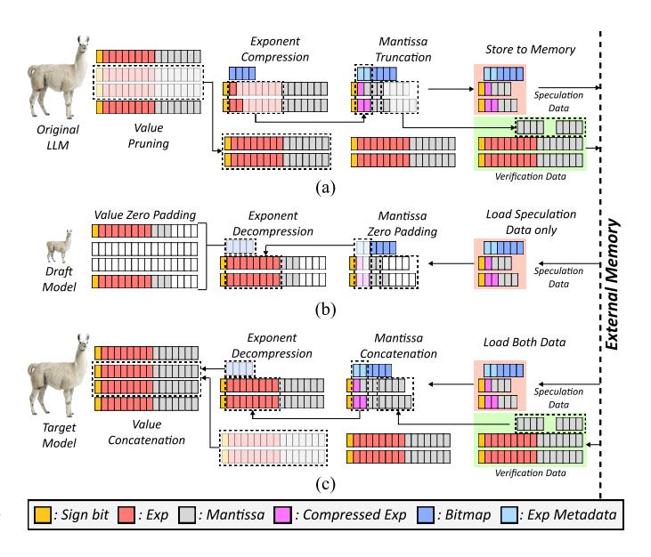
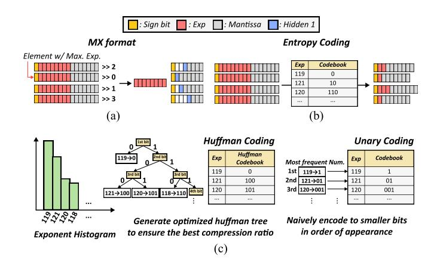
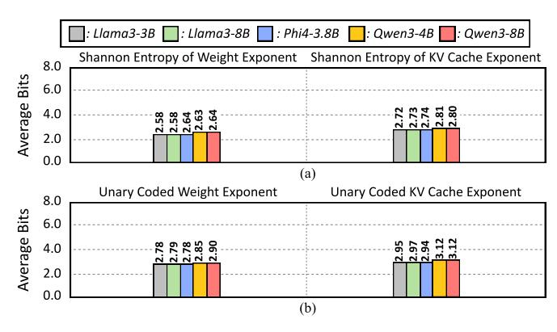

# A. Overview of Cassandra Algorithm

To address the limitations of conventional speculative decoding in edge environments, Cassandra is designed around two key objectives: resource efficiency and low-batch performance.

First, Cassandra targets reliable operation under constrained compute and memory budgets. Approaches that require additional training are impractical for widespread deployment on edge devices, and maintaining a separate draft model introduces non-negligible memory capacity overhead. To overcome these issues, Cassandra adopts a training-free self-speculative decoding framework, eliminating the need for additional training while avoiding duplication of model parameters.

Second, Cassandra is optimized for performance in lowbatch inference scenarios. Prior self-speculative decoding methods primarily focus on optimizing the attention layer and KV cache. Also, for computational efficiency on GPU, they usually adopt coarse-grained methods such as structured pruning or layer skipping to generate the draft model. However, such approaches are not sufficient in low-batch regimes. When the batch size is small and sequence lengths are moderate, the dominant bottleneck in the decode stage shifts from attention to the weight loading of the feed-forward network (FFN) layers. Therefore, improving performance in this setting requires not only optimizing attention-related operations but also effectively reducing the memory footprint of FFN weights. Furthermore, since the decode stage is typically memory-bound, minimizing data movement is more critical than improving raw computational efficiency.

Figure 4 illustrates the core design of Cassandra. The weights and KV cache of the original model are first transformed into a specialized format and partitioned into two components: **speculation data** and **verification data**.

During draft inference, only the speculation data is loaded and reconstructed into the original format using zero-padding. Although the resulting draft model is executed using standard floating-point units and does not reduce arithmetic complexity, it significantly lowers memory bandwidth requirements, enabling faster execution.

During target model inference, both the speculation and verification data are loaded and fully reconstructed to recover the original model representation. Unlike conventional speculative decoding methods [2], [28], Cassandra does not require an independent draft model. Instead, the draft model operates on a strict subset of the original model parameters, allowing speculative decoding to be performed without additional memory capacity overhead.

#### B. Step-by-Step Format Transformation Flow in Cassandra

In this section, we elaborate on how the original model undergoes a format transformation process to be partitioned into speculation data and verification data. In the subsequent paragraphs, the data selected through the pruning or truncation process constitute the speculation data. Unlike lossy compression, the data that are not selected during this process are not discarded; instead, they become the verification data and are utilized for target model inference.

Unstructured Value Pruning. First, Cassandra performs unstructured pruning on the weights and KV caches of the original model. Regarding weights, we employ the activation-aware weight pruning technique proposed in Wanda [55]. Leveraging the observation that activations exhibit large magnitudes in specific channels regardless of the input, Wanda computes the L2 norm of activations using calibration data and

Fig. 4. Visualization of Cassandra Algorithm. (a) Cassandra's initial format transformation flow (b) Draft model inference (c) Target model inference

multiplies the resulting values element-wise by the weights to determine importance scores for pruning.

In contrast to weights, Cassandra applies per-token magnitude-based pruning for the KV cache. According to Mustafar [17], this approach is highly effective for Key caches due to the presence of prominent channel-wise outliers. Although Value caches do not exhibit a similarly distinct outlier distribution, per-token pruning remains effective, as it is functionally equivalent to output-aware pruning within the attention mechanism.

Since these methods are designed primarily to preserve the output of each layer, they are more advantageous in terms of acceptance rate relative to compression ratio compared to structured pruning, which utilizes pre-determined masks for computational efficiency. Also, both methods involve minimal to negligible calibration costs, aligning well with Cassandra's design philosophy of being training-free.

Mantissa Truncation. In addition to pruning, we further reduce the representation cost of each value by truncating mantissa bits. While quantization is the conventional approach for reducing bit-width, we instead adopt a naive mantissa truncation scheme. This choice significantly lowers the overhead of format reconstruction compared to quantization. Furthermore, unlike quantization, which alters the numerical representation, mantissa truncation preserves a subset of the original bits. As a result, the draft model can be interpreted as a strict subset of the target model, which is a key property that enables Cassandra to avoid additional memory capacity overhead.

**Exponent Compression.** The application of the two aforementioned algorithms still results in limited compression ratios. This limitation stems from the uncompressed exponent, which accounts for 50% of the bit-width in the standard BFloat16 datatype. Therefore, to achieve significant performance improvements, additional compression must be applied.

Fig. 5. (a) MX format, (b) Entropy Coding, (c) Huffman and Unary Coding

One possible approach is to adopt the MX format [51], in which multiple floating-point values share a common exponent. This format has been widely utilized in deep learning training and inference due to its efficiency. However, converting a model trained in a standard floating-point format into MX format inevitably introduces some degree of accuracy degradation. Although this degradation is often small, we argue that a complementary approach with no risk of accuracy loss is also desirable. From this perspective, we identify entropy coding as a suitable method for lossless exponent compression.

Entropy coding is a lossless compression technique that assigns variable-length codes based on the frequency distribution of values. Shannon entropy [54] provides a theoretical lower bound on the average number of bits required to represent such data. Previous work [68] has shown that the exponent values of BFloat16-trained weights exhibit a Shannon entropy of approximately 2.6 bits. As illustrated in Figure 6(a), we further observe that the exponent distribution of the KV cache also has low entropy, averaging around 2.7 bits. These results suggest that, by applying appropriate entropy coding to both weights and KV cache, it is theoretically possible to achieve a lossless reduction of more than 5 bits.

Among entropy coding techniques, Huffman coding [15] is one of the most widely used methods, and several prior studies [65], [68] have explored its application to LLM compression. However, implementing Huffman decoding efficiently on xPUs presents significant challenges. A conventional LUT-based decoding approach [63] requires a lookup table with  $2^N$  entries, where N denotes the number of unique symbols. In LLMs, where N can be as large as 32, such an approach becomes impractical. While hierarchical codebooks [68] can mitigate this issue, they introduce additional decoding complexity and latency. As a result, the overhead of decoding may outweigh the benefits of compression, leading to worse overall system performance compared to the BFloat16 baseline.

To overcome this issue, we propose a much simpler method: Unary coding can be a solution for low-overhead lossless exponent compression. Unary coding is a method of assigning

Fig. 6. (a) Average Shannon entropy of exponent in weight and KV cache. (b) Average exponent bits of unary-coded weights and KV cache

codes simply by increasing the length by one, corresponding to the frequency of a particular element. In Cassandra, unary coding is implemented by encoding numbers in a format where N consecutive zeros are followed by a final one, such as 1,01,001, and so on. Exponents that appear more frequently are assigned fewer bits. The key advantage of this method lies in its explicit boundary representation: every codeword is terminated by a 1, allowing unambiguous identification of code boundaries directly from the compressed bitstream. As a result, unlike conventional entropy coding schemes, which often require sequential parsing or LUT-based decoding, unary coding can be implemented using simple, fully parallel digital logic.

As shown in Figure 6(b), we confirmed that unary coding can achieve an average exponent compression of 2.85 bits. Although its compression efficiency is slightly lower than that of Huffman coding, it still provides a substantial improvement over the original floating-point representation. Also, from the perspective of overall system performance, the reduction in decoding overhead achieved by using unary coding provides a more positive impact than the slight loss in compression ratio.

Unary coding preserves full numerical accuracy, whereas the MX format offers higher compression efficiency at the cost of slight accuracy degradation. Consequently, neither approach can be considered universally superior. To accommodate this trade-off, Cassandra supports both methods. We refer to the unary coding-based, lossless configuration as Cassandra-1, and the MX-based, higher-performance configuration with minor accuracy loss as Cassandra-2. This design enables users to select the most appropriate configuration based on their accuracy and performance requirements. Although mantissa truncation was introduced earlier for clarity, exponent compression is applied prior to mantissa truncation in the actual algorithm, as illustrated in Figure 4.

# A. Overview of Cassandra Algorithm

To address the limitations of conventional speculative decoding in edge environments, Cassandra is designed around two key objectives: resource efficiency and low-batch performance.

First, Cassandra targets reliable operation under constrained compute and memory budgets. Approaches that require additional training are impractical for widespread deployment on edge devices, and maintaining a separate draft model introduces non-negligible memory capacity overhead. To overcome these issues, Cassandra adopts a training-free self-speculative decoding framework, eliminating the need for additional training while avoiding duplication of model parameters.

Second, Cassandra is optimized for performance in lowbatch inference scenarios. Prior self-speculative decoding methods primarily focus on optimizing the attention layer and KV cache. Also, for computational efficiency on GPU, they usually adopt coarse-grained methods such as structured pruning or layer skipping to generate the draft model. However, such approaches are not sufficient in low-batch regimes. When the batch size is small and sequence lengths are moderate, the dominant bottleneck in the decode stage shifts from attention to the weight loading of the feed-forward network (FFN) layers. Therefore, improving performance in this setting requires not only optimizing attention-related operations but also effectively reducing the memory footprint of FFN weights. Furthermore, since the decode stage is typically memory-bound, minimizing data movement is more critical than improving raw computational efficiency.

Figure 4 illustrates the core design of Cassandra. The weights and KV cache of the original model are first transformed into a specialized format and partitioned into two components: **speculation data** and **verification data**.

During draft inference, only the speculation data is loaded and reconstructed into the original format using zero-padding. Although the resulting draft model is executed using standard floating-point units and does not reduce arithmetic complexity, it significantly lowers memory bandwidth requirements, enabling faster execution.

During target model inference, both the speculation and verification data are loaded and fully reconstructed to recover the original model representation. Unlike conventional speculative decoding methods [2], [28], Cassandra does not require an independent draft model. Instead, the draft model operates on a strict subset of the original model parameters, allowing speculative decoding to be performed without additional memory capacity overhead.

#### B. Step-by-Step Format Transformation Flow in Cassandra

In this section, we elaborate on how the original model undergoes a format transformation process to be partitioned into speculation data and verification data. In the subsequent paragraphs, the data selected through the pruning or truncation process constitute the speculation data. Unlike lossy compression, the data that are not selected during this process are not discarded; instead, they become the verification data and are utilized for target model inference.

Unstructured Value Pruning. First, Cassandra performs unstructured pruning on the weights and KV caches of the original model. Regarding weights, we employ the activation-aware weight pruning technique proposed in Wanda [55]. Leveraging the observation that activations exhibit large magnitudes in specific channels regardless of the input, Wanda computes the L2 norm of activations using calibration data and

Fig. 4. Visualization of Cassandra Algorithm. (a) Cassandra's initial format transformation flow (b) Draft model inference (c) Target model inference

multiplies the resulting values element-wise by the weights to determine importance scores for pruning.

In contrast to weights, Cassandra applies per-token magnitude-based pruning for the KV cache. According to Mustafar [17], this approach is highly effective for Key caches due to the presence of prominent channel-wise outliers. Although Value caches do not exhibit a similarly distinct outlier distribution, per-token pruning remains effective, as it is functionally equivalent to output-aware pruning within the attention mechanism.

Since these methods are designed primarily to preserve the output of each layer, they are more advantageous in terms of acceptance rate relative to compression ratio compared to structured pruning, which utilizes pre-determined masks for computational efficiency. Also, both methods involve minimal to negligible calibration costs, aligning well with Cassandra's design philosophy of being training-free.

Mantissa Truncation. In addition to pruning, we further reduce the representation cost of each value by truncating mantissa bits. While quantization is the conventional approach for reducing bit-width, we instead adopt a naive mantissa truncation scheme. This choice significantly lowers the overhead of format reconstruction compared to quantization. Furthermore, unlike quantization, which alters the numerical representation, mantissa truncation preserves a subset of the original bits. As a result, the draft model can be interpreted as a strict subset of the target model, which is a key property that enables Cassandra to avoid additional memory capacity overhead.

**Exponent Compression.** The application of the two aforementioned algorithms still results in limited compression ratios. This limitation stems from the uncompressed exponent, which accounts for 50% of the bit-width in the standard BFloat16 datatype. Therefore, to achieve significant performance improvements, additional compression must be applied.

Fig. 5. (a) MX format, (b) Entropy Coding, (c) Huffman and Unary Coding

One possible approach is to adopt the MX format [51], in which multiple floating-point values share a common exponent. This format has been widely utilized in deep learning training and inference due to its efficiency. However, converting a model trained in a standard floating-point format into MX format inevitably introduces some degree of accuracy degradation. Although this degradation is often small, we argue that a complementary approach with no risk of accuracy loss is also desirable. From this perspective, we identify entropy coding as a suitable method for lossless exponent compression.

Entropy coding is a lossless compression technique that assigns variable-length codes based on the frequency distribution of values. Shannon entropy [54] provides a theoretical lower bound on the average number of bits required to represent such data. Previous work [68] has shown that the exponent values of BFloat16-trained weights exhibit a Shannon entropy of approximately 2.6 bits. As illustrated in Figure 6(a), we further observe that the exponent distribution of the KV cache also has low entropy, averaging around 2.7 bits. These results suggest that, by applying appropriate entropy coding to both weights and KV cache, it is theoretically possible to achieve a lossless reduction of more than 5 bits.

Among entropy coding techniques, Huffman coding [15] is one of the most widely used methods, and several prior studies [65], [68] have explored its application to LLM compression. However, implementing Huffman decoding efficiently on xPUs presents significant challenges. A conventional LUT-based decoding approach [63] requires a lookup table with  $2^N$  entries, where N denotes the number of unique symbols. In LLMs, where N can be as large as 32, such an approach becomes impractical. While hierarchical codebooks [68] can mitigate this issue, they introduce additional decoding complexity and latency. As a result, the overhead of decoding may outweigh the benefits of compression, leading to worse overall system performance compared to the BFloat16 baseline.

To overcome this issue, we propose a much simpler method: Unary coding can be a solution for low-overhead lossless exponent compression. Unary coding is a method of assigning

Fig. 6. (a) Average Shannon entropy of exponent in weight and KV cache. (b) Average exponent bits of unary-coded weights and KV cache

codes simply by increasing the length by one, corresponding to the frequency of a particular element. In Cassandra, unary coding is implemented by encoding numbers in a format where N consecutive zeros are followed by a final one, such as 1,01,001, and so on. Exponents that appear more frequently are assigned fewer bits. The key advantage of this method lies in its explicit boundary representation: every codeword is terminated by a 1, allowing unambiguous identification of code boundaries directly from the compressed bitstream. As a result, unlike conventional entropy coding schemes, which often require sequential parsing or LUT-based decoding, unary coding can be implemented using simple, fully parallel digital logic.

As shown in Figure 6(b), we confirmed that unary coding can achieve an average exponent compression of 2.85 bits. Although its compression efficiency is slightly lower than that of Huffman coding, it still provides a substantial improvement over the original floating-point representation. Also, from the perspective of overall system performance, the reduction in decoding overhead achieved by using unary coding provides a more positive impact than the slight loss in compression ratio.

Unary coding preserves full numerical accuracy, whereas the MX format offers higher compression efficiency at the cost of slight accuracy degradation. Consequently, neither approach can be considered universally superior. To accommodate this trade-off, Cassandra supports both methods. We refer to the unary coding-based, lossless configuration as Cassandra-1, and the MX-based, higher-performance configuration with minor accuracy loss as Cassandra-2. This design enables users to select the most appropriate configuration based on their accuracy and performance requirements. Although mantissa truncation was introduced earlier for clarity, exponent compression is applied prior to mantissa truncation in the actual algorithm, as illustrated in Figure 4.

