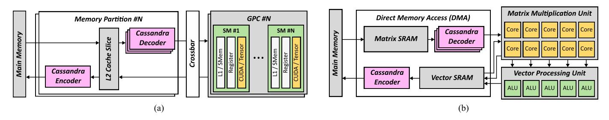
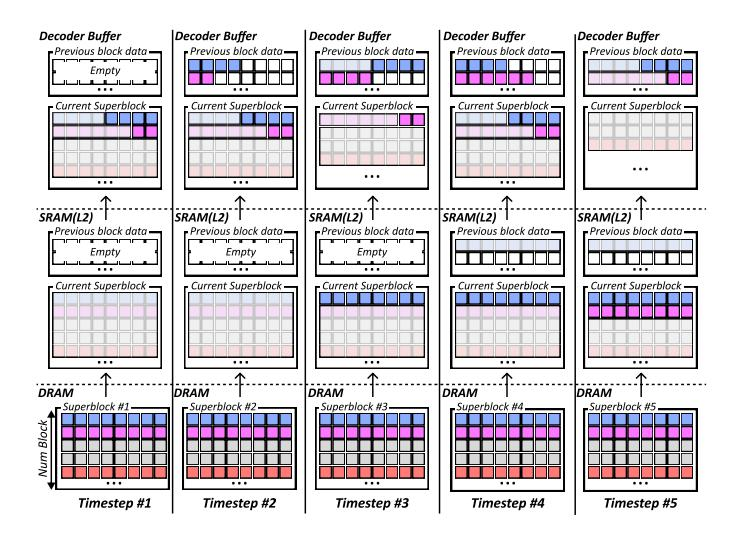

# *B. Integrating Cassandra with xPU*

Cassandra is designed to operate alongside the memory system of a GPU and NPU. A GPU utilizes a partitioned memory system architecture, where each memory channel has its own dedicated L2 cache slice and memory controller. Furthermore, all data originating from the main memory must pass through the L2 cache before being delivered to the L1 cache or shared memory. Figure 10(a) illustrates how Cassandra can be integrated into such a system. Because sharing data between memory partitions is challenging in a GPU, Cassandra encoder and decoder should be installed independently for each memory partition. In this configuration, the decoder is placed between the L2 cache and the interconnect, and the encoder is situated between the main memory and the L2 cache. This placement allows for the efficient utilization of both memory bandwidth and L2 cache capacity and bandwidth. In this case, Cassandra's encoder and decoder are managed by the memory controller, similar to the L2 cache.

To distinguish standard data types (e.g., activations) from specially formatted weights and KV cache, the user must explicitly specify the data type being stored (i.e., floating-point or Cassandra format) during the memory allocation process. Data of the standard datatype and the Cassandra datatype are then stored in separate virtual pages. To distinguish the data type held by each page, the page table and TLBs must be provisioned with spare bits. Since commercial GPUs from vendors like Nvidia and AMD already include spare bits in their page table entries, this modification introduces no additional overhead. [4].

For an NPU with a DMA-based memory system, as shown in Figure 10(b), it is reasonable to place both the encoder and decoder within the DMA. This structure is similar to the one in GPUs, but in this case, the encoder and decoder should be managed by the DMA controller. Also, unlike GPUs, many NPUs do not use a virtual memory system. Therefore, in this scenario, the physical memory addresses for storing the standard datatypes and Cassandra datatypes must be separated, and this information must be pre-stored in the DMA controller to ensure appropriate encoding and decoding.

Decoding overhead in Cassandra can slow down the read speed of weights and the KV cache, degrading overall system performance, while the encoder's performance is irrelevant to this. Hence, the decoder should be sufficiently added to match the maximum throughput of the L2 cache, while a comparatively smaller number of encoders may be sufficient.

Fig. 10. Overall architecture of (a) Cassandra-integrated GPU and (b) Cassandra-integrated systolic array based NPU

Fig. 11. Visualization of superblock-based data management.

# *B. Integrating Cassandra with xPU*

Cassandra is designed to operate alongside the memory system of a GPU and NPU. A GPU utilizes a partitioned memory system architecture, where each memory channel has its own dedicated L2 cache slice and memory controller. Furthermore, all data originating from the main memory must pass through the L2 cache before being delivered to the L1 cache or shared memory. Figure 10(a) illustrates how Cassandra can be integrated into such a system. Because sharing data between memory partitions is challenging in a GPU, Cassandra encoder and decoder should be installed independently for each memory partition. In this configuration, the decoder is placed between the L2 cache and the interconnect, and the encoder is situated between the main memory and the L2 cache. This placement allows for the efficient utilization of both memory bandwidth and L2 cache capacity and bandwidth. In this case, Cassandra's encoder and decoder are managed by the memory controller, similar to the L2 cache.

To distinguish standard data types (e.g., activations) from specially formatted weights and KV cache, the user must explicitly specify the data type being stored (i.e., floating-point or Cassandra format) during the memory allocation process. Data of the standard datatype and the Cassandra datatype are then stored in separate virtual pages. To distinguish the data type held by each page, the page table and TLBs must be provisioned with spare bits. Since commercial GPUs from vendors like Nvidia and AMD already include spare bits in their page table entries, this modification introduces no additional overhead. [4].

For an NPU with a DMA-based memory system, as shown in Figure 10(b), it is reasonable to place both the encoder and decoder within the DMA. This structure is similar to the one in GPUs, but in this case, the encoder and decoder should be managed by the DMA controller. Also, unlike GPUs, many NPUs do not use a virtual memory system. Therefore, in this scenario, the physical memory addresses for storing the standard datatypes and Cassandra datatypes must be separated, and this information must be pre-stored in the DMA controller to ensure appropriate encoding and decoding.

Decoding overhead in Cassandra can slow down the read speed of weights and the KV cache, degrading overall system performance, while the encoder's performance is irrelevant to this. Hence, the decoder should be sufficiently added to match the maximum throughput of the L2 cache, while a comparatively smaller number of encoders may be sufficient.

Fig. 10. Overall architecture of (a) Cassandra-integrated GPU and (b) Cassandra-integrated systolic array based NPU

Fig. 11. Visualization of superblock-based data management.

