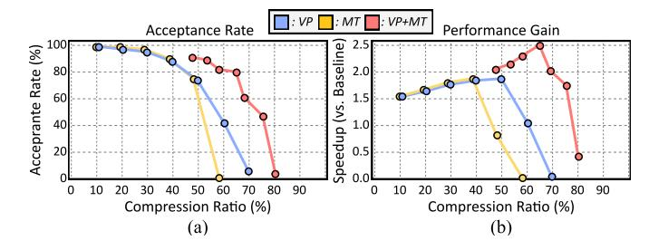
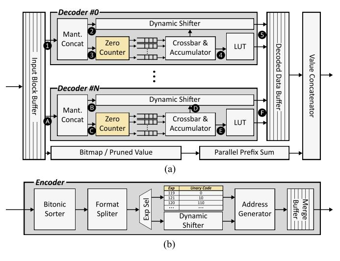
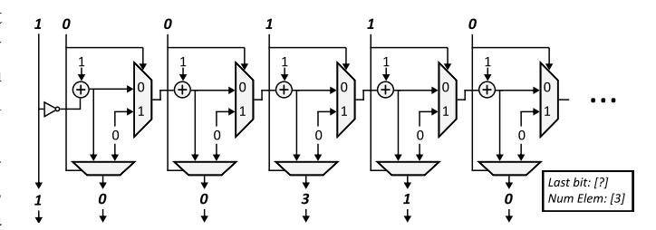

# C. Design Space Exploration of Cassandra Algorithm: Trade off between Acceptance Rate and Compression Ratio

In LLM inference with lossy compression, a higher compression ratio typically results in a larger accuracy drop. Thus, the acceptable accuracy drop determines the final compression



Fig. 7. (a) Acceptance rate according to compression  ${\rm ratio}(\gamma=5)$ . (b) Ideal performance improvement compared to baseline. VP means value pruning, MT means mantissa truncation, VP+MT means applying both schemes.

ratio. For this reason, combining multiple lossy compression algorithms is often avoided in standard LLM inference scenarios.

However, speculative decoding uses the target model for verification, essentially eliminating the accuracy drop, regardless of the draft model's compression ratio. Instead, in this case, the compression ratio and the acceptance rate are in a trade-off relationship. At this point, the draft model does not need to generate the correct complete sentence by itself; it only needs to retain the ability to predict a few tokens correctly. In this case, the conditions for generating the optimal draft model differ from the methods used in lossy compression.

Figure 7 shows the acceptance rate versus compression ratio when using the Deepseek-R1-Distillated-Llama-8B model, with the draft model created using value pruning and mantissa truncation separately, and when using both schemes together. At this point, using value pruning and mantissa truncation together demonstrates a robust acceptance rate compared to using either method alone. This result demonstrates that Cassandra's format transformation method, which integrates multiple schemes, is suitable for self-speculative decoding.

#### V. CASSANDRA HARDWARE ARCHITECTURE

#### A. Cassandra Encoder & Decoder Architecture

To actually enhance the performance of xPU with Cassandra, low-overhead decompression is necessary. In contrast, operations such as MX format to floating point transformation, unary coding, and bitmap-based de-sparsification all require bit-level decoding computations. Performing these operations sequentially on a typical SIMD core cannot fully leverage hardware parallelism. Also, utilizing Cassandra necessitates online KV cache format conversion, and the operations used in this process, such as top-k computations, can also be a potential burden. Therefore, we propose a Cassandra decoder and encoder to achieve high performance and low overhead format transformation, enabling the efficient use of Cassandra across various computing units.

Figure 8 illustrates the architecture of our decoder and encoder, and how these hardware components operate across different dataflows. Decoder #0 in Figure 8(a) demonstrates the decoding dataflow when using the unary coding for exponent compression. Initially, the low bits and high bits of the truncated mantissa are concatenated in the **1 mantissa** concatenator. Subsequently, the sign and mantissa are fed to



Fig. 8. (a) Microarchitecture and dataflow of Cassandra decoder. (b) Microarchitecture of Cassandra encoder.



Fig. 9. Microarchitecture of parallel zero counter.

the **2** dynamic shifter and await exponent decoding. The exponent is uniformly sliced into 8-bit chunks and sent to the **3** parallel zero counter.

Figure 9 presents the microarchitecture of a parallel zero counter. For each bit position, the module outputs the cumulative number of preceding zeros up to that position. In parallel, it also produces the total count of input ones and the value of the final bit. The output from the parallel zero counter passes through a zero eliminator and enters a queue, where it is used as an index for the **4 LUT** for unary decoding.

Although we arbitrarily segmented the sequentially encoded exponents into 8-bit chunks and input them into a parallel zero counter, obtaining the correct decoding value necessitates information from the preceding bits. This challenge can be addressed by recalculating in each chunk, which involves concurrently receiving the last bit of the preceding chunk and the count of consecutive zeros last obtained from that preceding chunk. Algorithm 1 describes the entire process of exponent decoding within a parallel zero counter. After these processes, a **5** bitmap-based de-sparsification operation is performed to derive the final output.

Decoder #N in Figure 8(a) demonstrates the decoding dataflow when using the MX format. The low-bits and high-bits of the mantissa are combined by the **A mantissa concatenator** first. However, in this case, after the mantissa is combined, the mantissa is fed into the input of both **B dynamic shifter** and **O parallel zero counter**. In this

Algorithm 1: Pseudo Code of Parallel Unary Decoding

```
Input: N-bit unary coded exponent U, the number of
        element numel
  Output: Set of decoded 8bit exponents Exp
  /* Parallel Zero Counting */
1 [Chunk0, Chunk1, ..., Chunk[
                          N
                          8
                            ] ←
   DEVIDEINTO8BITCHUNK(U)
2 i, k, l, sum, idx ← 0
3 while i < [N//8] do
4 cnt ← 0, reorganizedi ← Chunki
                                [7]
5 num onesi ← NUMBEROFONES(Chunki)
6 for j in range(8) do
7 if Chunki
                [j] == 0 then
8 cnt ← cnt + 1
9 else
10 outputi
                .append(cnt), cnt ← 0
11 i ← i + 1
  /* Parallel Reorganization */
12 while k < [N//8] do
13 if reorganizedk == 0 then
14 sum ← sum + cntk
15 else
16 outputk[0] ← outputk[0] + sum
17 sum ← 0
18 k ← k + 1
19 while l < [N//8] do
20 for m in range(num onesl) do
21 Expidx ← UNARYCODEBOOK(outputl
                                      [m])
        idx ← idx + 1
22 if idx > numel then
23 return Exp
24 return Exp
```

case, the exponent is first passed through a crossbar and broadcast to the accumulator corresponding to each element. Subsequently, the parallel zero counter counts the number of zeros in the mantissa, determining how many bits each mantissa should be shifted and how much should be subtracted from the exponent. Since it is guaranteed that one counter processes one mantissa, adjustment with adjacent chunks is not necessary. Once the shifted value for each mantissa is determined, this value is sent to the D dynamic shifter to perform mantissa shifting and simultaneously subtracted from the exponent in the E accumulator. Afterwards, the decoding process concludes by performing F bitmap-based de-sparification, similar to Cassandra-1.

The operation of the Cassandra encoder is comparatively simpler. When data is first input, the encoder finds the topk values in this data and divides them into a speculation group and a verification group. The verification group is stored in a buffer immediately, along with a bitmap, without any further transformation. The data belonging to the speculation group undergoes different exponent compression processes depending on whether they use MX format or unary coding, followed by mantissa truncation, and then they are stored in the buffer. Subsequently, the values stored in the buffer are saved to main memory. Since weights can be formatted offline before storage, this encoder is primarily used for online formatting of the KV cache.

# C. Design Space Exploration of Cassandra Algorithm: Trade off between Acceptance Rate and Compression Ratio

In LLM inference with lossy compression, a higher compression ratio typically results in a larger accuracy drop. Thus, the acceptable accuracy drop determines the final compression


Fig. 7. (a) Acceptance rate according to compression  ${\rm ratio}(\gamma=5)$ . (b) Ideal performance improvement compared to baseline. VP means value pruning, MT means mantissa truncation, VP+MT means applying both schemes.

ratio. For this reason, combining multiple lossy compression algorithms is often avoided in standard LLM inference scenarios.

However, speculative decoding uses the target model for verification, essentially eliminating the accuracy drop, regardless of the draft model's compression ratio. Instead, in this case, the compression ratio and the acceptance rate are in a trade-off relationship. At this point, the draft model does not need to generate the correct complete sentence by itself; it only needs to retain the ability to predict a few tokens correctly. In this case, the conditions for generating the optimal draft model differ from the methods used in lossy compression.

Figure 7 shows the acceptance rate versus compression ratio when using the Deepseek-R1-Distillated-Llama-8B model, with the draft model created using value pruning and mantissa truncation separately, and when using both schemes together. At this point, using value pruning and mantissa truncation together demonstrates a robust acceptance rate compared to using either method alone. This result demonstrates that Cassandra's format transformation method, which integrates multiple schemes, is suitable for self-speculative decoding.

#### V. CASSANDRA HARDWARE ARCHITECTURE

#### A. Cassandra Encoder & Decoder Architecture

To actually enhance the performance of xPU with Cassandra, low-overhead decompression is necessary. In contrast, operations such as MX format to floating point transformation, unary coding, and bitmap-based de-sparsification all require bit-level decoding computations. Performing these operations sequentially on a typical SIMD core cannot fully leverage hardware parallelism. Also, utilizing Cassandra necessitates online KV cache format conversion, and the operations used in this process, such as top-k computations, can also be a potential burden. Therefore, we propose a Cassandra decoder and encoder to achieve high performance and low overhead format transformation, enabling the efficient use of Cassandra across various computing units.

Figure 8 illustrates the architecture of our decoder and encoder, and how these hardware components operate across different dataflows. Decoder #0 in Figure 8(a) demonstrates the decoding dataflow when using the unary coding for exponent compression. Initially, the low bits and high bits of the truncated mantissa are concatenated in the **1 mantissa** concatenator. Subsequently, the sign and mantissa are fed to


Fig. 8. (a) Microarchitecture and dataflow of Cassandra decoder. (b) Microarchitecture of Cassandra encoder.


Fig. 9. Microarchitecture of parallel zero counter.

the **2** dynamic shifter and await exponent decoding. The exponent is uniformly sliced into 8-bit chunks and sent to the **3** parallel zero counter.

Figure 9 presents the microarchitecture of a parallel zero counter. For each bit position, the module outputs the cumulative number of preceding zeros up to that position. In parallel, it also produces the total count of input ones and the value of the final bit. The output from the parallel zero counter passes through a zero eliminator and enters a queue, where it is used as an index for the **4 LUT** for unary decoding.

Although we arbitrarily segmented the sequentially encoded exponents into 8-bit chunks and input them into a parallel zero counter, obtaining the correct decoding value necessitates information from the preceding bits. This challenge can be addressed by recalculating in each chunk, which involves concurrently receiving the last bit of the preceding chunk and the count of consecutive zeros last obtained from that preceding chunk. Algorithm 1 describes the entire process of exponent decoding within a parallel zero counter. After these processes, a **5** bitmap-based de-sparsification operation is performed to derive the final output.

Decoder #N in Figure 8(a) demonstrates the decoding dataflow when using the MX format. The low-bits and high-bits of the mantissa are combined by the **A mantissa concatenator** first. However, in this case, after the mantissa is combined, the mantissa is fed into the input of both **B dynamic shifter** and **O parallel zero counter**. In this

Algorithm 1: Pseudo Code of Parallel Unary Decoding

```
Input: N-bit unary coded exponent U, the number of
        element numel
  Output: Set of decoded 8bit exponents Exp
  /* Parallel Zero Counting */
1 [Chunk0, Chunk1, ..., Chunk[
                          N
                          8
                            ] ←
   DEVIDEINTO8BITCHUNK(U)
2 i, k, l, sum, idx ← 0
3 while i < [N//8] do
4 cnt ← 0, reorganizedi ← Chunki
                                [7]
5 num onesi ← NUMBEROFONES(Chunki)
6 for j in range(8) do
7 if Chunki
                [j] == 0 then
8 cnt ← cnt + 1
9 else
10 outputi
                .append(cnt), cnt ← 0
11 i ← i + 1
  /* Parallel Reorganization */
12 while k < [N//8] do
13 if reorganizedk == 0 then
14 sum ← sum + cntk
15 else
16 outputk[0] ← outputk[0] + sum
17 sum ← 0
18 k ← k + 1
19 while l < [N//8] do
20 for m in range(num onesl) do
21 Expidx ← UNARYCODEBOOK(outputl
                                      [m])
        idx ← idx + 1
22 if idx > numel then
23 return Exp
24 return Exp
```

case, the exponent is first passed through a crossbar and broadcast to the accumulator corresponding to each element. Subsequently, the parallel zero counter counts the number of zeros in the mantissa, determining how many bits each mantissa should be shifted and how much should be subtracted from the exponent. Since it is guaranteed that one counter processes one mantissa, adjustment with adjacent chunks is not necessary. Once the shifted value for each mantissa is determined, this value is sent to the D dynamic shifter to perform mantissa shifting and simultaneously subtracted from the exponent in the E accumulator. Afterwards, the decoding process concludes by performing F bitmap-based de-sparification, similar to Cassandra-1.

The operation of the Cassandra encoder is comparatively simpler. When data is first input, the encoder finds the topk values in this data and divides them into a speculation group and a verification group. The verification group is stored in a buffer immediately, along with a bitmap, without any further transformation. The data belonging to the speculation group undergoes different exponent compression processes depending on whether they use MX format or unary coding, followed by mantissa truncation, and then they are stored in the buffer. Subsequently, the values stored in the buffer are saved to main memory. Since weights can be formatted offline before storage, this encoder is primarily used for online formatting of the KV cache.

