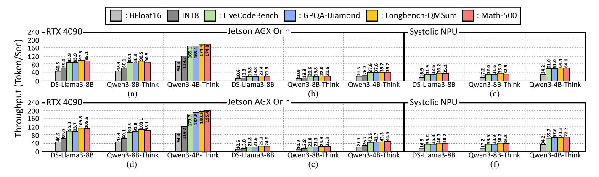
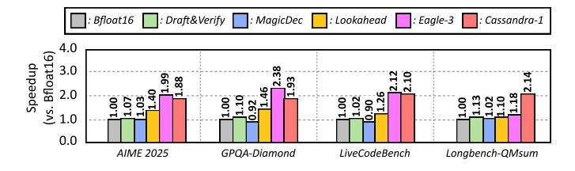
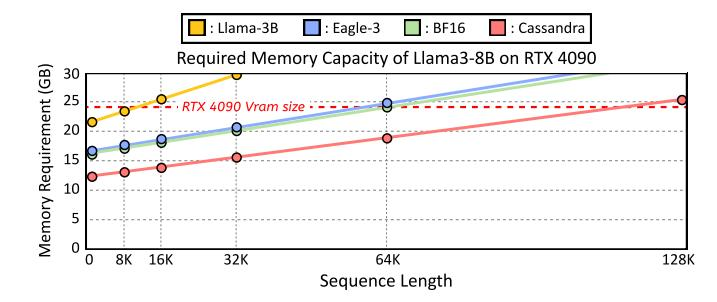

# C. Superblock based Data Management

Variable sequence length in unary encoding, as well as the potential difference in the ratio between speculation data and verification data that may arise when sparsity changes, makes memory mapping more challenging. Specifically, in a cachebased memory system like a GPU, this difficulty in mapping data to perfectly fit a cache block can lead to performance degradation due to redundant data loads. To eliminate this potential performance bottleneck, we propose a superblockbased memory mapping scheme. For a cache-based system, Cassandra sets a group of multiple cache blocks, which we refer to as a superblock, as the fundamental unit for load and eviction. This superblock is fully packed with cache blocks containing various data types, such as bitmaps, variable exponents, and mantissas. Initially, when data is loaded, the entire superblock is loaded at once and stored in the L2 cache. These data are subsequently fed into the decoder.

During the decoding process, depending on the sparse ratio or the length of the exponent, some data types might not fully utilize all the data contained within a single cache block, resulting in leftover data. The decoder stores this leftover data in its internal buffer and concatenates it with the data from the next cache block of that type when it is read.

If the size of the data in the decoder buffer exceeds 128 bytes, the memory controller skips sending the corresponding type of cache block to the decoder. It also keeps track of how

many times the block of that type has been skipped for the next read. In this manner, the memory controller manages the address values of each type of cache block that should be fed into the decoder next, sending them to the decoder as needed.

This approach guarantees contiguous data reads from global memory and dense memory mapping, preventing potential degradation in memory performance. This method also works efficiently in scratchpad-based devices, such as NPUs, where issues like row buffer misses and page misses can still occur. For an NPU, the same mechanism can be applied by directly setting an arbitrary block size, rather than a cache block size.

#### VI. EVALUATION

#### A. Implementation of Cassandra

Cassandra Software Implementation. To measure the accuracy of Cassandra, we developed a software emulator utilizing PyTorch and custom CUDA kernels. Although this software emulator cannot achieve performance gain on a GPU, it accurately models the pruning, truncation, unary coding, and MX format conversion that occur during the format transformation process in Cassandra.

Cassandra Hardware Implementation. The performance of Cassandra cannot be characterized solely by hardware cycles; it also depends on the acceptance rate. Therefore, to measure the performance gain obtained by Cassandra, we first determine four different scenarios from benchmarks [1], [16], [29], [50] and apply them to Cassandra with 40% pruned and 4-bit truncated weights and 4-bit truncated KV cache. In addition, we measure the average input and output context lengths, as well as the acceptance rate for those scenarios. Finally, we use this information with the cycle information from our hardware simulator to quantify overall system performance.

To measure the performance of Cassandra when integrated with a GPU, we implement the Cassandra encoder and decoder on Accel-Sim [18]. We use Nvidia RTX 4090 [38] and Nvidia Jetson AGX Orin [39] as GPU baselines. Since Accel-Sim currently does not support the Ada-Lovelace architecture used in the RTX 4090, we use traces from an Ampere architecture GPU and set the configuration similar to RTX 4090.

Additionally, to evaluate the performance of Cassandraintegrated NPU, we implemented a cycle-level simulator by extending Scale-Sim [53] and the LPU simulator [21], [36]. Referring to the specifications of commercial consumer-grade GPUs, we designed this NPU to feature a 64 TFLOPS MAC

Fig. 12. Normalized performance gain through Cassandra on various hardware & benchmark. (a) RTX 4090 + Cassandra-1, (b) Jetson AGX Orin + Cassandra-1, (c) Systolic Array NPU + Cassandra-1, (d) RTX 4090 + Cassandra-2, (e) Jetson AGX Orin + Cassandra-2, (f) Systolic Array NPU + Cassandra-2

TABLE III
ZERO-SHOT ACCURACY RESULTS ON REASONING BENCHMARKS

| Model        |             | GPQA-Diamond | Math-500 | AIME 2025 |
|--------------|-------------|--------------|----------|-----------|
|              | Bfloat16    | 49.0         | 87.0     | 26.7      |
|              | SmoothQuant | 46.0         | 86.0     | 23.3      |
|              | QoQ         | 45.0         | 77.0     | 10.0      |
| Deepseek-R1- | Squeezellm  | 29.0         | 45.0     | 10.0      |
| Distillated- | DuQuant     | 25.0         | 70.0     | 23.3      |
| Llama3-8B    | Wanda       | 16.0         | 33.0     | 0.0       |
|              | Cassandra-1 | 49.0         | 87.0     | 26.7      |
|              | Cassandra-2 | 47.0         | 85.0     | 23.3      |
|              | Bfloat16    | 32.0         | 93.0     | 30.0      |
|              | SmoothQuant | 29.0         | 93.0     | 26.7      |
|              | QoQ         | 28.0         | 89.0     | 20.0      |
| Qwen3-8B-    | Squeezellm  | 15.0         | 84.0     | 20.0      |
| Thinking     | DuQuant     | 24.0         | 85.0     | 26.7      |
|              | Wanda       | 8.0          | 52.0     | 0.0       |
|              | Cassandra-1 | 32.0         | 93.0     | 30.0      |
|              | Cassandra-2 | 30.0         | 92.0     | 30.0      |
| Qwen3-4B-    | Bfloat16    | 66.0         | 97.0     | 56.7      |
|              | SmoothQuant | 64.0         | 97.0     | 53.3      |
|              | Squeezellm  | 22.0         | 95.0     | 23.3      |
| Thinking-    | Wanda       | 16.0         | 52.0     | 3.3       |
| 2507         | Cassandra-1 | 66.0         | 97.0     | 56.7      |
|              | Cassandra-2 | 63.0         | 97.0     | 50.0      |

unit and a memory bandwidth of 273 GB/s, utilizing 128GB of LPDDR5X memory.

To analyze the power and area overhead of Cassandra, we first implement an end-to-end Cassandra decoder and encoder with SystemVerilog. We also implement a simple consumergrade NPU, consisting of a systolic array, VPU, DMA, and scratchpad, and integrate it with Cassandra. Both Cassandra and NPU are synthesized using the Synopsys Design Compiler with a 28nm technology node, and the area of the SRAM used was obtained by utilizing the Samsung 28nm SRAM Compiler.

#### B. Zero-Shot Accuracy Evaluation

In this part, we compare state-of-the-art lossy compression methods [22], [30], [31], [55], [61] with Cassandra across various benchmarks. The pruning ratio and precision used for lossy compression are identical to those in the original papers. We use Deepseek-R1-Distillated-Llama3-8B [6], Qwen3-8B-Thinking [47], and Qwen3-4B-Thinking-2507 [46] as LLM models and use AIME2025 [40], Math-500 [29], GPQA-

Diamond [50] as benchmarks. Due to the limited GPU resources, we randomly sampled 100 questions from the GPQA-Diamond and Math-500, while the AIME2025 benchmark was tested using all its questions. Table III compares Cassandra with other lossy compression techniques with these models and benchmarks.

As illustrated in the table, all lossy compression methods experience a certain degree of accuracy degradation. Smoothquant, which utilizes relatively higher bitwidth, exhibits only a marginal drop in accuracy compared to the BFloat16 baseline; however, its compression ratio remains modest at approximately 50%. In contrast, all other lossy compression techniques suffered significant accuracy losses across reasoning benchmarks. Notably, when applied to DeepSeek-R1-Distillated-Llama3-8B, Wanda failed to produce a single correct answer on the AIME 2025 benchmark. Conversely, Cassandra-1 maintained accuracy levels identical to BFloat16. Also, Cassandra-2, which prioritizes inference speed at the expense of some precision, demonstrated a robust accuracy profile comparable to that of Smoothquant.

As illustrated in the table, DuQuant [30] and QoQ [31] were not evaluated on the Qwen3-4B-Thinking-2507 model. These algorithms maintain model accuracy by employing Hadamard rotations to smooth out the distribution of values, thereby reducing the impact of outliers. However, since Hadamard matrices are restricted to specific discrete dimensions, their open-source implementations are not directly compatible with the unique hidden dimension of Qwen3-4B-Thinking-2507. Applying these methods would require additional pre-processing, such as zero padding.

#### C. Performance

Figure 12 presents Cassandra's overall performance gain obtained from our simulator. Since Cassandra's performance varies depending on the model and the benchmark, we express its performance using the throughput gain achievable across four different scenarios, three models, and various exponent compression techniques. Furthermore, the length of the draft tokens  $\gamma$  is set to the value that yielded optimal performance within the range of 3 to 5. Furthermore, we included

TABLE IV
AVERAGE ACCEPTANCE RATE ON VARIOUS MODELS AND BENCHMARKS.

| Environment                |               | DS-Llama-8B | Qwen3-8B | Qwen3-4B |
|----------------------------|---------------|-------------|----------|----------|
| Cassandra-1 $(\gamma = 5)$ | LiveCodeBench | 0.78        | 0.77     | 0.74     |
|                            | GPQA-Diamond  | 0.78        | 0.76     | 0.74     |
|                            | Longbench     | 0.88        | 0.84     | 0.78     |
|                            | Math-500      | 0.86        | 0.79     | 0.78     |
| Cassandra-2 $(\gamma = 3)$ | LiveCodeBench | 0.80        | 0.75     | 0.74     |
|                            | GPQA-Diamond  | 0.79        | 0.76     | 0.76     |
|                            | Longbench     | 0.91        | 0.85     | 0.79     |
|                            | Math-500      | 0.90        | 0.81     | 0.81     |

SmoothQuant-based W8A8 integer quantization [61] as a GPU baseline, utilizing the official INT8 quantization implementation provided by vLLM [57]. While we also measured the throughput of FP8 dynamic quantization [58] on an RTX 4090, it consistently showed a slight performance deficit in the decode stage compared to INT8. However, this performance gap was marginal, staying under 3% for all tested models.

As shown in the figure, Cassandra achieved a performance improvement of 1.78× to 2.41× compared to BFloat16 baseline. Two primary factors influence the performance of Cassandra. One factor is the disparity between models. As shown in Table IV, under identical configurations and benchmarks, DeepSeek-R1-Distillated-Llama3-8B typically exhibited the highest acceptance rate, followed by Qwen3-8B and Qwen3-4B-Thinking-2507, respectively. The second factor is the difference of benchmark. Across all models, Cassandra performed slightly better on Longbench-QMSum and Math500 than on LiveCodebench and GPQA-Diamond. Nevertheless, Cassandra shows less performance variance between benchmarks compared to other methodologies such as Eagle-3 [28] and Lookahead Decoding [10]; this is discussed in further detail in section VII-B.

#### D. Area and Power Analysis

Table V shows the power and area overhead of Cassandra on an NPU with 64TFLOPS and 9MB scratchpad. The total bandwidth of the scratchpad is 1024 bytes, and 40 decoders were added to ensure that the scratchpad bandwidth does not become a bottleneck during the read process. As shown in the table, the Cassandra system only incurs an area overhead of around 2% relative to the NPU.

Note that directly comparing the power and area of Cassandra with the RTX 4090 and Jetson AGX Orin, which are fabricated using a 5nm and 8nm node, respectively, is not appropriate. However, despite using highly advanced nodes, these devices consume very large areas  $(609mm^2)$  and  $455mm^2$ , respectively) and power (450W) and 200W, respectively). Considering the small overhead in an area-efficient NPU, we believe that Cassandra will show even smaller area and power ratios on commercial GPUs.

 $\label{table v} \text{Area and power overhead of Cassandra on 64TFLOPS NPU}.$ 

| Modules           | Area(mm²) | Area Ratio (%) | Power(W) |
|-------------------|-----------|----------------|----------|
| BF16 MAC          | 64.8      | 70.3           | 12.45    |
| VPU               | 2.4       | 2.6            | 0.80     |
| SRAM              | 24.1      | 24.8           | 1.98     |
| DMA               | 0.24      | 0.3            | 0.016    |
| Cassandra Encoder | 0.08      | 0.1            | 0.017    |
| Cassandra Decoder | 1.76      | 1.9            | 0.264    |

#### VII. ANALYSIS AND DISCUSSION

A. Cassandra and Quantization: From Performance Rivalry to Algorithmic Synergy

Quantization has emerged as a critical methodology for optimizing LLM inference performance. In particular, high-bit quantization formats, such as INT8, FP8 and MXFP8, are widely recognized for their robustness; this may raise questions regarding the necessity of lossless acceleration techniques like Cassandra. Nevertheless, Cassandra offers distinct advantages over the mere employment of high-bit quantization.

1) Unpredictable Accuracy Degradation in Quantization: According to previous studies [23], [32], [45], even quantization techniques generally known to maintain accuracy can suffer from significant performance degradation under specific conditions. For instance, applying W8A8 SmoothQuant [61] to Llama3.1-405B results in an average accuracy decline of 10.86% across the OpenLLM Leaderboard-v2 datasets [23]. Such unpredictable degradations manifest across a wide range of model scales, from Qwen2.5-1.7B to Llama3.1-405B. Furthermore, quantization alters the model's probability distribution, potentially leading to unpredictable behaviors. For instance, a study [7] reported that applying W8A16 GPTQ [9] to Qwen2-1.5B [48] resulted in only a 0.3% accuracy drop on the GSM8K benchmark [5]; however, 6.37% of the actual predicted answers changed compared to the original model.

For these reasons, despite the high efficiency of quantization, there remains a strong demand for lossless LLM inference acceleration, where speculative decoding is often employed independently without quantization. Furthermore, recent studies [8], [19], [68] have begun exploring the use of lossless compression techniques to accelerate LLM inference, without relying on speculative decoding.

2) Performance Superiority of Cassandra in Low-Batch Inference: Figure 12 shows that Cassandra achieves up to a 2.41x speedup compared to the BFloat16 baseline. In contrast, 8-bit quantization yields only a 1.3× performance improvement over BFloat16. The observed performance degradation stems from the overhead associated with online activation quantization and scaling factor multiplication. In the prefill stage, where GEMM execution time is the main bottleneck, this overhead is largely masked by the gains from reduced GEMM computation. However, in low-batch LLM inference, the decode stage accounts for the majority of the end-to-end latency. Since GEMM is not the bottleneck in the decode stage, the overhead from activation quantization and scaling become non-negligible. Previous studies [20], [61] have also

Fig. 13. Performance Comparison of Different Speculative Decodings.

reported that the decode stage performance of INT8 and FP8 quantization ranges from  $1.25\times$  to  $1.42\times$  compared to FP16 and BF16 baseline, which aligns with our measurements.

3) Compatibility with Quantization: While we utilize BFloat16 as our baseline, Cassandra is fully compatible with quantization. The most straightforward format to integrate into Cassandra is MXINT8. Currently, Cassandra-2 employs the MXINT format during the draft model generation process. Extending this approach to ensure the entire target model utilizes the MXINT8 format can be achieved seamlessly. According to prior research [3], MXINT8 exhibits overhead similar to other 8-bit quantization methods and generally offers superior accuracy compared to MXFP8.

Furthermore, with minor modifications, Cassandra can be extended to INT precision. Any-precision LLM [42] serves as an excellent example of INT quantization that can be integrated with Cassandra. These methods propose multi-precision quantization techniques that allow for the deployment of optimized lower-bit models via simple truncation, which aligns perfectly with Cassandra's core algorithm of generating draft models through pruning and truncation.

#### B. Comparison with Other Speculative Decoding Methods

1) Performance: Figure 13 illustrates the performance improvements of various speculative decoding schemes relative to the BFloat16 baseline. For our evaluation, we employed Draft&Verify [67], MagicDec [52], and Lookahead Decoding [10] as representative training-free speculative decoding methods, while EAGLE-3 [28] was utilized as the training-based speculative decoding baseline. All experiments were conducted using official open-source implementations. Also, we utilized DeepSeek-distill-Llama-8B [6] to leverage the official EAGLE-3 draft weights. Furthermore, since all speculative decoding frameworks utilize a BFloat16 target model, we selected Cassandra-1 as our baseline to ensure a fair comparison.

As shown in Figure 13, Cassandra consistently outperforms Draft&Verify, MagicDec, and Lookahead Decoding across all four benchmarks. In the case of MagicDec, its reliance on KV cache pruning leads to significantly degraded performance in low-batch inference scenarios, occasionally even performing slower than the baseline.

Draft&Verify also fails to generate a efficient draft model through its Bayesian-based layer skipping; although it skips 18 attention layers from the original 32-block model, it only skips 9 FFN layers. Consequently, the draft model must still load 70.7% of the original model's parameters, a structure that

is fundamentally limited in achieving high-speed execution for low-batch LLM inference.

Regarding Lookahead Decoding, which predicts subsequent tokens by referencing N-gram sets generated from previous data, it exhibited lower performance gains compared to Cassandra, particularly on LongBench and LiveCodeBench. Nevertheless, it achieved notable speedups of 1.40× and 1.46× on AIME2025 and GPQA-Diamond, respectively.

While EAGLE-3 demonstrated superior performance over Cassandra on AIME2025 and GPQA-Diamond, its effectiveness is heavily biased toward the characteristics of its training data. As illustrated, EAGLE-3 shows a significantly diminished margin of improvement in specific tasks such as long-sequence understanding. These results confirm that Cassandra not only outperforms most existing speculative decoding schemes across diverse scenarios but also provides robust performance gains with minimal sensitivity to sequence length or task type.

2) Pre-Computation Cost: To utilize Cassandra, two distinct pre-computation steps are required. The first step involves calibration for Wanda-based weight pruning. A small calibration set of approximately 128 samples is sufficient for this pruning method to deliver robust performance [55]. Other techniques employed in Cassandra, such as exponent compression, KV cache pruning, and mantissa truncation, do not require any calibration. The second step is the optimization of ratio for pruning and truncation. The optimal combination of pruning ratio and truncation bits for configuring the draft model can be determined based on the acceptance rate relative to the compression ratio, which can be expressed by the following objective function.

$$\mathcal{J} = \frac{\alpha}{S_w(1 - w_p)(B - w_t) + S_{kv}(1 - kv_p)(B - kv_t)}$$
(2)

Here,  $S_w$  denotes the weight size,  $S_{kv}$  is the KV cache size,  $w_t$  and  $kv_t$  represent the truncation bits for weights and the KV cache respectively,  $w_p$  and  $kv_p$  are the pruning ratios for weights and the KV cache, B is the number of bits used by the target model, and  $\alpha$  is the acceptance rate.

As a practical approach to identifying a local optimum, we recommend prioritizing the optimization of hyperparameters associated with the dominant term by comparing the magnitudes of  $S_w$  and  $S_{kv}$ . We conducted a grid search by incrementing the pruning ratio for weights and KV cache from 30% to 60% in 10% intervals and the truncation range from 0 to 5 bits in 1 bit intervals. Following the experimental setup of Draft&Verify, we used a development set of 8 samples. When using an 8B model, this process requires approximately 5 minutes of GPU time on an NVIDIA A100. In comparison with competing approaches, this overhead is acceptable; for instance, Eagle-3 requires 96 to 192 GPU hours on an A100, and Draft&Verify requires approximately 1.5 hours of Bayesian optimization on A100 for an 8B model.

Additionally, unlike other hyperparameters that vary drastically across models, our default configuration, a 40% pruning

Fig. 14. Comparison of memory requirements between autoregressive decoding and various speculative decoding methods.

ratio and 4 bit truncation, demonstrates robust transferability to other models. Users can either adopt this configuration directly or use it as a starting point to narrow the search space, further reducing the cost of finding a local optimal solution.

*3) Memory Capacity Requirement:* Figure 14 shows the ideal memory capacity requirement in various decoding schemes. As shown in the figure, Cassandra exhibits the most superior memory capacity efficiency compared to other speculative decoding methods and can generate 11.59× and 1.81× more tokens than Llama3-based speculative decoding and Eagle-3, respectively. Due to its exponent compression and memory-efficient draft model design, Cassandra actually requires less memory capacity than the original BFloat16 format. This is yet another reason why Cassandra is suitable for resource-constrained devices.

# C. Superblock based Data Management

Variable sequence length in unary encoding, as well as the potential difference in the ratio between speculation data and verification data that may arise when sparsity changes, makes memory mapping more challenging. Specifically, in a cachebased memory system like a GPU, this difficulty in mapping data to perfectly fit a cache block can lead to performance degradation due to redundant data loads. To eliminate this potential performance bottleneck, we propose a superblockbased memory mapping scheme. For a cache-based system, Cassandra sets a group of multiple cache blocks, which we refer to as a superblock, as the fundamental unit for load and eviction. This superblock is fully packed with cache blocks containing various data types, such as bitmaps, variable exponents, and mantissas. Initially, when data is loaded, the entire superblock is loaded at once and stored in the L2 cache. These data are subsequently fed into the decoder.

During the decoding process, depending on the sparse ratio or the length of the exponent, some data types might not fully utilize all the data contained within a single cache block, resulting in leftover data. The decoder stores this leftover data in its internal buffer and concatenates it with the data from the next cache block of that type when it is read.

If the size of the data in the decoder buffer exceeds 128 bytes, the memory controller skips sending the corresponding type of cache block to the decoder. It also keeps track of how

many times the block of that type has been skipped for the next read. In this manner, the memory controller manages the address values of each type of cache block that should be fed into the decoder next, sending them to the decoder as needed.

This approach guarantees contiguous data reads from global memory and dense memory mapping, preventing potential degradation in memory performance. This method also works efficiently in scratchpad-based devices, such as NPUs, where issues like row buffer misses and page misses can still occur. For an NPU, the same mechanism can be applied by directly setting an arbitrary block size, rather than a cache block size.

#### VI. EVALUATION

#### A. Implementation of Cassandra

Cassandra Software Implementation. To measure the accuracy of Cassandra, we developed a software emulator utilizing PyTorch and custom CUDA kernels. Although this software emulator cannot achieve performance gain on a GPU, it accurately models the pruning, truncation, unary coding, and MX format conversion that occur during the format transformation process in Cassandra.

Cassandra Hardware Implementation. The performance of Cassandra cannot be characterized solely by hardware cycles; it also depends on the acceptance rate. Therefore, to measure the performance gain obtained by Cassandra, we first determine four different scenarios from benchmarks [1], [16], [29], [50] and apply them to Cassandra with 40% pruned and 4-bit truncated weights and 4-bit truncated KV cache. In addition, we measure the average input and output context lengths, as well as the acceptance rate for those scenarios. Finally, we use this information with the cycle information from our hardware simulator to quantify overall system performance.

To measure the performance of Cassandra when integrated with a GPU, we implement the Cassandra encoder and decoder on Accel-Sim [18]. We use Nvidia RTX 4090 [38] and Nvidia Jetson AGX Orin [39] as GPU baselines. Since Accel-Sim currently does not support the Ada-Lovelace architecture used in the RTX 4090, we use traces from an Ampere architecture GPU and set the configuration similar to RTX 4090.

Additionally, to evaluate the performance of Cassandraintegrated NPU, we implemented a cycle-level simulator by extending Scale-Sim [53] and the LPU simulator [21], [36]. Referring to the specifications of commercial consumer-grade GPUs, we designed this NPU to feature a 64 TFLOPS MAC

Fig. 12. Normalized performance gain through Cassandra on various hardware & benchmark. (a) RTX 4090 + Cassandra-1, (b) Jetson AGX Orin + Cassandra-1, (c) Systolic Array NPU + Cassandra-1, (d) RTX 4090 + Cassandra-2, (e) Jetson AGX Orin + Cassandra-2, (f) Systolic Array NPU + Cassandra-2

TABLE III
ZERO-SHOT ACCURACY RESULTS ON REASONING BENCHMARKS

| Model        |             | GPQA-Diamond | Math-500 | AIME 2025 |
|--------------|-------------|--------------|----------|-----------|
|              | Bfloat16    | 49.0         | 87.0     | 26.7      |
|              | SmoothQuant | 46.0         | 86.0     | 23.3      |
|              | QoQ         | 45.0         | 77.0     | 10.0      |
| Deepseek-R1- | Squeezellm  | 29.0         | 45.0     | 10.0      |
| Distillated- | DuQuant     | 25.0         | 70.0     | 23.3      |
| Llama3-8B    | Wanda       | 16.0         | 33.0     | 0.0       |
|              | Cassandra-1 | 49.0         | 87.0     | 26.7      |
|              | Cassandra-2 | 47.0         | 85.0     | 23.3      |
|              | Bfloat16    | 32.0         | 93.0     | 30.0      |
|              | SmoothQuant | 29.0         | 93.0     | 26.7      |
|              | QoQ         | 28.0         | 89.0     | 20.0      |
| Qwen3-8B-    | Squeezellm  | 15.0         | 84.0     | 20.0      |
| Thinking     | DuQuant     | 24.0         | 85.0     | 26.7      |
|              | Wanda       | 8.0          | 52.0     | 0.0       |
|              | Cassandra-1 | 32.0         | 93.0     | 30.0      |
|              | Cassandra-2 | 30.0         | 92.0     | 30.0      |
| Qwen3-4B-    | Bfloat16    | 66.0         | 97.0     | 56.7      |
|              | SmoothQuant | 64.0         | 97.0     | 53.3      |
|              | Squeezellm  | 22.0         | 95.0     | 23.3      |
| Thinking-    | Wanda       | 16.0         | 52.0     | 3.3       |
| 2507         | Cassandra-1 | 66.0         | 97.0     | 56.7      |
|              | Cassandra-2 | 63.0         | 97.0     | 50.0      |

unit and a memory bandwidth of 273 GB/s, utilizing 128GB of LPDDR5X memory.

To analyze the power and area overhead of Cassandra, we first implement an end-to-end Cassandra decoder and encoder with SystemVerilog. We also implement a simple consumergrade NPU, consisting of a systolic array, VPU, DMA, and scratchpad, and integrate it with Cassandra. Both Cassandra and NPU are synthesized using the Synopsys Design Compiler with a 28nm technology node, and the area of the SRAM used was obtained by utilizing the Samsung 28nm SRAM Compiler.

#### B. Zero-Shot Accuracy Evaluation

In this part, we compare state-of-the-art lossy compression methods [22], [30], [31], [55], [61] with Cassandra across various benchmarks. The pruning ratio and precision used for lossy compression are identical to those in the original papers. We use Deepseek-R1-Distillated-Llama3-8B [6], Qwen3-8B-Thinking [47], and Qwen3-4B-Thinking-2507 [46] as LLM models and use AIME2025 [40], Math-500 [29], GPQA-

Diamond [50] as benchmarks. Due to the limited GPU resources, we randomly sampled 100 questions from the GPQA-Diamond and Math-500, while the AIME2025 benchmark was tested using all its questions. Table III compares Cassandra with other lossy compression techniques with these models and benchmarks.

As illustrated in the table, all lossy compression methods experience a certain degree of accuracy degradation. Smoothquant, which utilizes relatively higher bitwidth, exhibits only a marginal drop in accuracy compared to the BFloat16 baseline; however, its compression ratio remains modest at approximately 50%. In contrast, all other lossy compression techniques suffered significant accuracy losses across reasoning benchmarks. Notably, when applied to DeepSeek-R1-Distillated-Llama3-8B, Wanda failed to produce a single correct answer on the AIME 2025 benchmark. Conversely, Cassandra-1 maintained accuracy levels identical to BFloat16. Also, Cassandra-2, which prioritizes inference speed at the expense of some precision, demonstrated a robust accuracy profile comparable to that of Smoothquant.

As illustrated in the table, DuQuant [30] and QoQ [31] were not evaluated on the Qwen3-4B-Thinking-2507 model. These algorithms maintain model accuracy by employing Hadamard rotations to smooth out the distribution of values, thereby reducing the impact of outliers. However, since Hadamard matrices are restricted to specific discrete dimensions, their open-source implementations are not directly compatible with the unique hidden dimension of Qwen3-4B-Thinking-2507. Applying these methods would require additional pre-processing, such as zero padding.

#### C. Performance

Figure 12 presents Cassandra's overall performance gain obtained from our simulator. Since Cassandra's performance varies depending on the model and the benchmark, we express its performance using the throughput gain achievable across four different scenarios, three models, and various exponent compression techniques. Furthermore, the length of the draft tokens  $\gamma$  is set to the value that yielded optimal performance within the range of 3 to 5. Furthermore, we included

TABLE IV
AVERAGE ACCEPTANCE RATE ON VARIOUS MODELS AND BENCHMARKS.

| Environment                |               | DS-Llama-8B | Qwen3-8B | Qwen3-4B |
|----------------------------|---------------|-------------|----------|----------|
| Cassandra-1 $(\gamma = 5)$ | LiveCodeBench | 0.78        | 0.77     | 0.74     |
|                            | GPQA-Diamond  | 0.78        | 0.76     | 0.74     |
|                            | Longbench     | 0.88        | 0.84     | 0.78     |
|                            | Math-500      | 0.86        | 0.79     | 0.78     |
| Cassandra-2 $(\gamma = 3)$ | LiveCodeBench | 0.80        | 0.75     | 0.74     |
|                            | GPQA-Diamond  | 0.79        | 0.76     | 0.76     |
|                            | Longbench     | 0.91        | 0.85     | 0.79     |
|                            | Math-500      | 0.90        | 0.81     | 0.81     |

SmoothQuant-based W8A8 integer quantization [61] as a GPU baseline, utilizing the official INT8 quantization implementation provided by vLLM [57]. While we also measured the throughput of FP8 dynamic quantization [58] on an RTX 4090, it consistently showed a slight performance deficit in the decode stage compared to INT8. However, this performance gap was marginal, staying under 3% for all tested models.

As shown in the figure, Cassandra achieved a performance improvement of 1.78× to 2.41× compared to BFloat16 baseline. Two primary factors influence the performance of Cassandra. One factor is the disparity between models. As shown in Table IV, under identical configurations and benchmarks, DeepSeek-R1-Distillated-Llama3-8B typically exhibited the highest acceptance rate, followed by Qwen3-8B and Qwen3-4B-Thinking-2507, respectively. The second factor is the difference of benchmark. Across all models, Cassandra performed slightly better on Longbench-QMSum and Math500 than on LiveCodebench and GPQA-Diamond. Nevertheless, Cassandra shows less performance variance between benchmarks compared to other methodologies such as Eagle-3 [28] and Lookahead Decoding [10]; this is discussed in further detail in section VII-B.

#### D. Area and Power Analysis

Table V shows the power and area overhead of Cassandra on an NPU with 64TFLOPS and 9MB scratchpad. The total bandwidth of the scratchpad is 1024 bytes, and 40 decoders were added to ensure that the scratchpad bandwidth does not become a bottleneck during the read process. As shown in the table, the Cassandra system only incurs an area overhead of around 2% relative to the NPU.

Note that directly comparing the power and area of Cassandra with the RTX 4090 and Jetson AGX Orin, which are fabricated using a 5nm and 8nm node, respectively, is not appropriate. However, despite using highly advanced nodes, these devices consume very large areas  $(609mm^2)$  and  $455mm^2$ , respectively) and power (450W) and 200W, respectively). Considering the small overhead in an area-efficient NPU, we believe that Cassandra will show even smaller area and power ratios on commercial GPUs.

 $\label{table v} \text{Area and power overhead of Cassandra on 64TFLOPS NPU}.$ 

| Modules           | Area(mm²) | Area Ratio (%) | Power(W) |
|-------------------|-----------|----------------|----------|
| BF16 MAC          | 64.8      | 70.3           | 12.45    |
| VPU               | 2.4       | 2.6            | 0.80     |
| SRAM              | 24.1      | 24.8           | 1.98     |
| DMA               | 0.24      | 0.3            | 0.016    |
| Cassandra Encoder | 0.08      | 0.1            | 0.017    |
| Cassandra Decoder | 1.76      | 1.9            | 0.264    |

#### VII. ANALYSIS AND DISCUSSION

A. Cassandra and Quantization: From Performance Rivalry to Algorithmic Synergy

Quantization has emerged as a critical methodology for optimizing LLM inference performance. In particular, high-bit quantization formats, such as INT8, FP8 and MXFP8, are widely recognized for their robustness; this may raise questions regarding the necessity of lossless acceleration techniques like Cassandra. Nevertheless, Cassandra offers distinct advantages over the mere employment of high-bit quantization.

1) Unpredictable Accuracy Degradation in Quantization: According to previous studies [23], [32], [45], even quantization techniques generally known to maintain accuracy can suffer from significant performance degradation under specific conditions. For instance, applying W8A8 SmoothQuant [61] to Llama3.1-405B results in an average accuracy decline of 10.86% across the OpenLLM Leaderboard-v2 datasets [23]. Such unpredictable degradations manifest across a wide range of model scales, from Qwen2.5-1.7B to Llama3.1-405B. Furthermore, quantization alters the model's probability distribution, potentially leading to unpredictable behaviors. For instance, a study [7] reported that applying W8A16 GPTQ [9] to Qwen2-1.5B [48] resulted in only a 0.3% accuracy drop on the GSM8K benchmark [5]; however, 6.37% of the actual predicted answers changed compared to the original model.

For these reasons, despite the high efficiency of quantization, there remains a strong demand for lossless LLM inference acceleration, where speculative decoding is often employed independently without quantization. Furthermore, recent studies [8], [19], [68] have begun exploring the use of lossless compression techniques to accelerate LLM inference, without relying on speculative decoding.

2) Performance Superiority of Cassandra in Low-Batch Inference: Figure 12 shows that Cassandra achieves up to a 2.41x speedup compared to the BFloat16 baseline. In contrast, 8-bit quantization yields only a 1.3× performance improvement over BFloat16. The observed performance degradation stems from the overhead associated with online activation quantization and scaling factor multiplication. In the prefill stage, where GEMM execution time is the main bottleneck, this overhead is largely masked by the gains from reduced GEMM computation. However, in low-batch LLM inference, the decode stage accounts for the majority of the end-to-end latency. Since GEMM is not the bottleneck in the decode stage, the overhead from activation quantization and scaling become non-negligible. Previous studies [20], [61] have also

Fig. 13. Performance Comparison of Different Speculative Decodings.

reported that the decode stage performance of INT8 and FP8 quantization ranges from  $1.25\times$  to  $1.42\times$  compared to FP16 and BF16 baseline, which aligns with our measurements.

3) Compatibility with Quantization: While we utilize BFloat16 as our baseline, Cassandra is fully compatible with quantization. The most straightforward format to integrate into Cassandra is MXINT8. Currently, Cassandra-2 employs the MXINT format during the draft model generation process. Extending this approach to ensure the entire target model utilizes the MXINT8 format can be achieved seamlessly. According to prior research [3], MXINT8 exhibits overhead similar to other 8-bit quantization methods and generally offers superior accuracy compared to MXFP8.

Furthermore, with minor modifications, Cassandra can be extended to INT precision. Any-precision LLM [42] serves as an excellent example of INT quantization that can be integrated with Cassandra. These methods propose multi-precision quantization techniques that allow for the deployment of optimized lower-bit models via simple truncation, which aligns perfectly with Cassandra's core algorithm of generating draft models through pruning and truncation.

#### B. Comparison with Other Speculative Decoding Methods

1) Performance: Figure 13 illustrates the performance improvements of various speculative decoding schemes relative to the BFloat16 baseline. For our evaluation, we employed Draft&Verify [67], MagicDec [52], and Lookahead Decoding [10] as representative training-free speculative decoding methods, while EAGLE-3 [28] was utilized as the training-based speculative decoding baseline. All experiments were conducted using official open-source implementations. Also, we utilized DeepSeek-distill-Llama-8B [6] to leverage the official EAGLE-3 draft weights. Furthermore, since all speculative decoding frameworks utilize a BFloat16 target model, we selected Cassandra-1 as our baseline to ensure a fair comparison.

As shown in Figure 13, Cassandra consistently outperforms Draft&Verify, MagicDec, and Lookahead Decoding across all four benchmarks. In the case of MagicDec, its reliance on KV cache pruning leads to significantly degraded performance in low-batch inference scenarios, occasionally even performing slower than the baseline.

Draft&Verify also fails to generate a efficient draft model through its Bayesian-based layer skipping; although it skips 18 attention layers from the original 32-block model, it only skips 9 FFN layers. Consequently, the draft model must still load 70.7% of the original model's parameters, a structure that

is fundamentally limited in achieving high-speed execution for low-batch LLM inference.

Regarding Lookahead Decoding, which predicts subsequent tokens by referencing N-gram sets generated from previous data, it exhibited lower performance gains compared to Cassandra, particularly on LongBench and LiveCodeBench. Nevertheless, it achieved notable speedups of 1.40× and 1.46× on AIME2025 and GPQA-Diamond, respectively.

While EAGLE-3 demonstrated superior performance over Cassandra on AIME2025 and GPQA-Diamond, its effectiveness is heavily biased toward the characteristics of its training data. As illustrated, EAGLE-3 shows a significantly diminished margin of improvement in specific tasks such as long-sequence understanding. These results confirm that Cassandra not only outperforms most existing speculative decoding schemes across diverse scenarios but also provides robust performance gains with minimal sensitivity to sequence length or task type.

2) Pre-Computation Cost: To utilize Cassandra, two distinct pre-computation steps are required. The first step involves calibration for Wanda-based weight pruning. A small calibration set of approximately 128 samples is sufficient for this pruning method to deliver robust performance [55]. Other techniques employed in Cassandra, such as exponent compression, KV cache pruning, and mantissa truncation, do not require any calibration. The second step is the optimization of ratio for pruning and truncation. The optimal combination of pruning ratio and truncation bits for configuring the draft model can be determined based on the acceptance rate relative to the compression ratio, which can be expressed by the following objective function.

$$\mathcal{J} = \frac{\alpha}{S_w(1 - w_p)(B - w_t) + S_{kv}(1 - kv_p)(B - kv_t)}$$
(2)

Here,  $S_w$  denotes the weight size,  $S_{kv}$  is the KV cache size,  $w_t$  and  $kv_t$  represent the truncation bits for weights and the KV cache respectively,  $w_p$  and  $kv_p$  are the pruning ratios for weights and the KV cache, B is the number of bits used by the target model, and  $\alpha$  is the acceptance rate.

As a practical approach to identifying a local optimum, we recommend prioritizing the optimization of hyperparameters associated with the dominant term by comparing the magnitudes of  $S_w$  and  $S_{kv}$ . We conducted a grid search by incrementing the pruning ratio for weights and KV cache from 30% to 60% in 10% intervals and the truncation range from 0 to 5 bits in 1 bit intervals. Following the experimental setup of Draft&Verify, we used a development set of 8 samples. When using an 8B model, this process requires approximately 5 minutes of GPU time on an NVIDIA A100. In comparison with competing approaches, this overhead is acceptable; for instance, Eagle-3 requires 96 to 192 GPU hours on an A100, and Draft&Verify requires approximately 1.5 hours of Bayesian optimization on A100 for an 8B model.

Additionally, unlike other hyperparameters that vary drastically across models, our default configuration, a 40% pruning

Fig. 14. Comparison of memory requirements between autoregressive decoding and various speculative decoding methods.

ratio and 4 bit truncation, demonstrates robust transferability to other models. Users can either adopt this configuration directly or use it as a starting point to narrow the search space, further reducing the cost of finding a local optimal solution.

*3) Memory Capacity Requirement:* Figure 14 shows the ideal memory capacity requirement in various decoding schemes. As shown in the figure, Cassandra exhibits the most superior memory capacity efficiency compared to other speculative decoding methods and can generate 11.59× and 1.81× more tokens than Llama3-based speculative decoding and Eagle-3, respectively. Due to its exponent compression and memory-efficient draft model design, Cassandra actually requires less memory capacity than the original BFloat16 format. This is yet another reason why Cassandra is suitable for resource-constrained devices.

