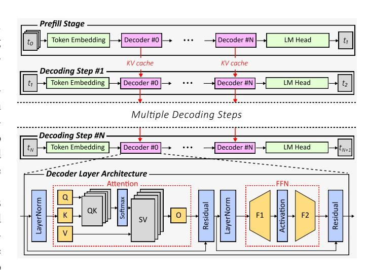
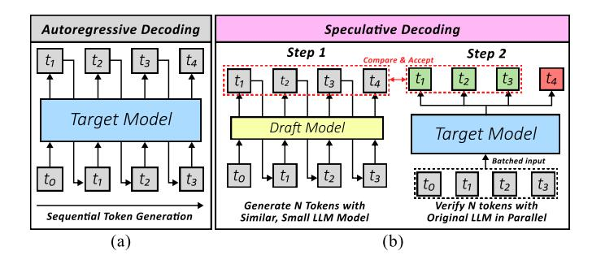
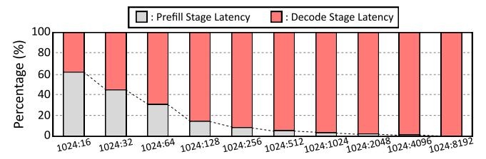

# I. INTRODUCTION

The emergence of ChatGPT ushered us into the irreversible era of AI. Today, major Large Language Model (LLM) services serve hundreds of millions of monthly active users, driving an unprecedented demand for efficient inference systems. As a result, designing high-performance LLM inference infrastructure has become one of the central challenges in the computer architecture community.

LLM inference can be broadly divided into two distinct phases: prefill and decode. The prefill stage processes the input prompt and requires the simultaneous computation of a large number of tokens, thereby demanding high computational performance. In contrast, the decode stage operates in an autoregressive manner, generating one token at a time. By reusing intermediate Key–Value (KV) tensors from previous steps, this phase typically exhibits low arithmetic intensity and limited parallelism.

On modern xPU platforms (e.g., GPUs and NPUs), the decode stage often becomes the primary performance bottleneck due to its memory-bound nature. To address this challenge, prior work has largely focused on two complementary strategies. The first is input batching, which aggregates multiple user requests to increase effective arithmetic intensity during decoding [21], [41], [43], [64], [66]. By improving hardware utilization, batching enables higher throughput through concurrent token generation. The second approach involves algorithmic optimizations such as quantization and data pruning—collectively referred to as lossy compression [24], [25], [30], [31], [49], [62]. While such techniques inherently introduce some degree of accuracy degradation, carefully designed methods can substantially improve performance by reducing both compute requirements and memory bandwidth, while keeping accuracy loss minimal.

However, two emerging trends in the LLM ecosystem introduce new challenges. The first is the increasing demand for small LLM inference on consumer-grade devices. Traditionally, both academia and industry have focused on datacenterscale inference systems. Recently, however, open source small LLM models [12], [34], [35], [46] have demonstrated competitive performance, bringing LLM inference on consumer-grade devices into the spotlight.

The second trend is the rise of reasoning LLMs [6], [47]. These models, typically enhanced via reinforcement learning on high-quality datasets, exhibit strong capabilities in complex tasks such as mathematical reasoning and code generation. Notably, reasoning capabilities are no longer limited to large models; even relatively small models have recently begun to incorporate such functionality [35], [46].

These trends jointly expose a critical challenge in edge deployment. Reasoning workloads often produce significantly longer output sequences, causing the decode stage to dominate end-to-end latency. At the same time, batching—one of the most effective optimizations in datacenter environments—is largely infeasible on edge devices, where workloads typically involve a single or a small number of concurrent users. As a result, optimization opportunities are effectively limited to algorithmic approaches such as lossy compression.

The problem is that lossy compression suffers from severe

performance degradation when applied to reasoning LLMs. Considering that even very small LLMs now support reasoning capabilities, this issue acts as a critical bottleneck that undermines the potential of LLMs on consumer-grade hardware.

To address this challenge, we argue that speculative decoding offers a promising direction for high-accuracy acceleration in edge environments. Speculative decoding improves decodestage efficiency by leveraging a lightweight draft model to predict multiple candidate tokens, which are then verified in parallel. This approach enables significant speedup while preserving output quality.

Despite its potential, existing speculative decoding methods face several limitations, including high training cost, limited effectiveness in low-batch settings, additional memory overhead, and diminishing returns for long output sequences. These drawbacks hinder their applicability to edge scenarios. To overcome these challenges, we propose Cassandra, a hardware–software co-designed speculative decoding framework tailored for low-batch inference on consumer-grade devices. Our main contributions are as follows:

- (1) We introduce Cassandra, an algorithm-hardware codesigned speculative decoding method. Our key insight is that a compact yet high-quality draft model can be derived directly from the target LLM through fine-grained data selection, without additional training. Based on this observation, Cassandra applies unstructured value pruning and mantissa truncation to the original model, extracting the most salient information at the bit level to construct the draft model. Furthermore, we identified that the large size of the exponent becomes a bottleneck, preventing the performance improvement in this scenario. As two distinct solutions, we propose lossy exponent compression based on the MX format and lossless exponent compression based on unary coding. By incorporating the fine-grained draft model and exponent compression, Cassandra achieves a performance improvement of up to 2.41× compared to BFloat16 baseline, which is also significantly higher compared to existing methods.
- (2) In Cassandra, weights and KV cache are stored in a specialized format obtained through unstructured pruning, mantissa truncation, and exponent compression. To execute computation on commercial xPU architectures, these representations must be converted back to standard floating-point format. To prevent this conversion from becoming a performance bottleneck, we propose a lightweight Cassandra encoder—decoder. The proposed design supports both MX-based and unary-based exponent compression within a unified architecture, enabling efficient format conversion with minimal power and area overhead. Furthermore, we provide integration guidelines for incorporating the encoder—decoder into conventional GPU and NPU architectures, along with a memory management scheme that mitigates irregular memory access patterns
- (3) To the best of our knowledge, Cassandra is the first self-speculative decoding framework that leverages al-

Fig. 1. Architecture of autoregressive transformer based LLMs

gorithm-hardware co-design specifically for low-batch LLM inference on consumer-grade edge devices.

#### II. BACKGROUND

#### A. Large Language Model Architecture

Despite the exploration of alternative language model architectures [13], [37], [44], the autoregressive transformer remains the dominant architecture for LLMs. Transformer fundamentally consists of two main layers: the multi-head attention and the feed-forward network. Figure 1 illustrates the structure of a transformer layer, where the yellow modules denote weight–activation multiplications, the gray modules represent activation–activation multiplications, and the blue modules correspond to non-linear operations.

A defining characteristic of transformers in LLMs is their autoregressive nature. These models are trained to predict the next token conditioned on the preceding sequence. Consequently, text generation is performed through an autoregressive process, in which the entire accumulated sequence is repeatedly processed to produce each subsequent token. A naive implementation of this process incurs substantial redundant computation, as portions of the sequence remain unchanged across generation steps.

To mitigate this inefficiency, modern LLMs employ the Key-Value (KV) caching technique, which stores the key and value tensors generated by the attention layers and reuses them in subsequent iterations. The initial phase, where the model processes the input sequence and generates the first token, is referred to as the prefill stage. The subsequent token generation steps that leverage the KV cache constitute the decode stage. The prefill stage is dominated by large-scale matrix multiplications, resulting in high arithmetic intensity and substantial computational demand. In contrast, the decode stage exhibits significantly lower arithmetic intensity and is typically memory-bound on conventional parallel architectures.

Fig. 2. (a) Autoregressive decoding. (b) speculative decoding.

#### B. Speculative Decoding

The core idea of speculative decoding is to transform the sequential token generation in the decode stage into parallel ones. Based on this idea, a wide variety of parallel decoding techniques have recently emerged. Still, the method that uses two LLMs, a target model and a draft model, remains the most widely adopted [26].

Figure 2 illustrates the difference between autoregressive decoding and speculative decoding. Here, the target model is the original LLM, and the draft model is a comparatively smaller LLM trained to generate tokens with a probability distribution similar to the target model. In this method, the draft model first generates a few tokens, and the target model subsequently verifies those tokens in parallel. To understand the performance gain afforded by speculative decoding through a simplified example, let us define the time required for the draft model to generate a single token as  $t_{draft}$ , and the time required for the target model to generate a single token as  $t_{target}$ . In a scenario involving  $\gamma$  token generations via autoregressive decoding, the total time consumption would be  $\gamma t_{target}$ . However, consider the application of speculative decoding, where  $\gamma$  tokens are first generated by the draft model and subsequently verified by the target model, assuming all  $\gamma$  tokens are generated correctly. In this case, the target model performs batched inference by receiving  $\gamma$  tokens from the draft model. Since  $\gamma$  is generally not large, this batched inference operates as a memory-bound on commercial xPUs, and the time required for this is nearly equivalent to the time needed to generate a single token. Consequently, the total time taken in this scenario is approximated by  $\gamma t_{draft} + t_{target}$ . If  $t_{draft}$  is sufficiently smaller than  $t_{target}$ , a substantial performance improvement is achieved.

One problem arises in this process: the draft model does not always generate the correct tokens. If the draft model generates an incorrect token, the target model detects it during the verification process and only accepts tokens up to the one preceding the error as correctly generated. The criteria for accepting tokens generated by the draft model can vary depending on the scenario.

When utilizing greedy decoding, we can only accept the output if the draft model produces the identical token. Under this condition, the target model's output remains perfectly preserved by speculative decoding. In contrast, recent LLMs often employ sampling techniques that introduce a degree of

Fig. 3. A latency ratio of prefill stage and decode stage in single batch Llama3-8B inference on RTX 4090. Total is 100% and the X-axis means the number of input tokens: output tokens

randomness during the new token generation process. In such a scenario, to maintain appropriate randomness, a probability-based sampling method [2], often expressed by the equation below, is frequently employed.

$$n \leftarrow \min\left(\left\{i - 1 \middle| 1 \le i \le \gamma, r_i > \frac{p_i(x)}{q_i(x)}\right\} \cup \{\gamma\}\right) \quad (1)$$

Here, n is the number of accepted tokens,  $\gamma$  is the draft length, i is the index,  $r_i$  is a random probability between 0 and 1,  $p_i(x)$  is the probability of the i-th token obtained from the target model's logits, and  $q_i(x)$  is the probability of the i-th token obtained from the draft model's logits. This approach is known as rejection sampling, and with this method, the entire speculative decoding system is mathematically guaranteed to generate tokens that are probabilistically identical to those of the target model.

The ratio in which the draft model correctly predicts how many tokens on average is called the acceptance rate. Since a low acceptance rate for the draft model can lead to a performance degradation in speculative decoding, it is crucial to develop a draft model that is both fast and has a sufficiently high acceptance rate.

# I. INTRODUCTION

The emergence of ChatGPT ushered us into the irreversible era of AI. Today, major Large Language Model (LLM) services serve hundreds of millions of monthly active users, driving an unprecedented demand for efficient inference systems. As a result, designing high-performance LLM inference infrastructure has become one of the central challenges in the computer architecture community.

LLM inference can be broadly divided into two distinct phases: prefill and decode. The prefill stage processes the input prompt and requires the simultaneous computation of a large number of tokens, thereby demanding high computational performance. In contrast, the decode stage operates in an autoregressive manner, generating one token at a time. By reusing intermediate Key–Value (KV) tensors from previous steps, this phase typically exhibits low arithmetic intensity and limited parallelism.

On modern xPU platforms (e.g., GPUs and NPUs), the decode stage often becomes the primary performance bottleneck due to its memory-bound nature. To address this challenge, prior work has largely focused on two complementary strategies. The first is input batching, which aggregates multiple user requests to increase effective arithmetic intensity during decoding [21], [41], [43], [64], [66]. By improving hardware utilization, batching enables higher throughput through concurrent token generation. The second approach involves algorithmic optimizations such as quantization and data pruning—collectively referred to as lossy compression [24], [25], [30], [31], [49], [62]. While such techniques inherently introduce some degree of accuracy degradation, carefully designed methods can substantially improve performance by reducing both compute requirements and memory bandwidth, while keeping accuracy loss minimal.

However, two emerging trends in the LLM ecosystem introduce new challenges. The first is the increasing demand for small LLM inference on consumer-grade devices. Traditionally, both academia and industry have focused on datacenterscale inference systems. Recently, however, open source small LLM models [12], [34], [35], [46] have demonstrated competitive performance, bringing LLM inference on consumer-grade devices into the spotlight.

The second trend is the rise of reasoning LLMs [6], [47]. These models, typically enhanced via reinforcement learning on high-quality datasets, exhibit strong capabilities in complex tasks such as mathematical reasoning and code generation. Notably, reasoning capabilities are no longer limited to large models; even relatively small models have recently begun to incorporate such functionality [35], [46].

These trends jointly expose a critical challenge in edge deployment. Reasoning workloads often produce significantly longer output sequences, causing the decode stage to dominate end-to-end latency. At the same time, batching—one of the most effective optimizations in datacenter environments—is largely infeasible on edge devices, where workloads typically involve a single or a small number of concurrent users. As a result, optimization opportunities are effectively limited to algorithmic approaches such as lossy compression.

The problem is that lossy compression suffers from severe

performance degradation when applied to reasoning LLMs. Considering that even very small LLMs now support reasoning capabilities, this issue acts as a critical bottleneck that undermines the potential of LLMs on consumer-grade hardware.

To address this challenge, we argue that speculative decoding offers a promising direction for high-accuracy acceleration in edge environments. Speculative decoding improves decodestage efficiency by leveraging a lightweight draft model to predict multiple candidate tokens, which are then verified in parallel. This approach enables significant speedup while preserving output quality.

Despite its potential, existing speculative decoding methods face several limitations, including high training cost, limited effectiveness in low-batch settings, additional memory overhead, and diminishing returns for long output sequences. These drawbacks hinder their applicability to edge scenarios. To overcome these challenges, we propose Cassandra, a hardware–software co-designed speculative decoding framework tailored for low-batch inference on consumer-grade devices. Our main contributions are as follows:

- (1) We introduce Cassandra, an algorithm-hardware codesigned speculative decoding method. Our key insight is that a compact yet high-quality draft model can be derived directly from the target LLM through fine-grained data selection, without additional training. Based on this observation, Cassandra applies unstructured value pruning and mantissa truncation to the original model, extracting the most salient information at the bit level to construct the draft model. Furthermore, we identified that the large size of the exponent becomes a bottleneck, preventing the performance improvement in this scenario. As two distinct solutions, we propose lossy exponent compression based on the MX format and lossless exponent compression based on unary coding. By incorporating the fine-grained draft model and exponent compression, Cassandra achieves a performance improvement of up to 2.41× compared to BFloat16 baseline, which is also significantly higher compared to existing methods.
- (2) In Cassandra, weights and KV cache are stored in a specialized format obtained through unstructured pruning, mantissa truncation, and exponent compression. To execute computation on commercial xPU architectures, these representations must be converted back to standard floating-point format. To prevent this conversion from becoming a performance bottleneck, we propose a lightweight Cassandra encoder—decoder. The proposed design supports both MX-based and unary-based exponent compression within a unified architecture, enabling efficient format conversion with minimal power and area overhead. Furthermore, we provide integration guidelines for incorporating the encoder—decoder into conventional GPU and NPU architectures, along with a memory management scheme that mitigates irregular memory access patterns
- (3) To the best of our knowledge, Cassandra is the first self-speculative decoding framework that leverages al-

Fig. 1. Architecture of autoregressive transformer based LLMs

gorithm-hardware co-design specifically for low-batch LLM inference on consumer-grade edge devices.

#### II. BACKGROUND

#### A. Large Language Model Architecture

Despite the exploration of alternative language model architectures [13], [37], [44], the autoregressive transformer remains the dominant architecture for LLMs. Transformer fundamentally consists of two main layers: the multi-head attention and the feed-forward network. Figure 1 illustrates the structure of a transformer layer, where the yellow modules denote weight–activation multiplications, the gray modules represent activation–activation multiplications, and the blue modules correspond to non-linear operations.

A defining characteristic of transformers in LLMs is their autoregressive nature. These models are trained to predict the next token conditioned on the preceding sequence. Consequently, text generation is performed through an autoregressive process, in which the entire accumulated sequence is repeatedly processed to produce each subsequent token. A naive implementation of this process incurs substantial redundant computation, as portions of the sequence remain unchanged across generation steps.

To mitigate this inefficiency, modern LLMs employ the Key-Value (KV) caching technique, which stores the key and value tensors generated by the attention layers and reuses them in subsequent iterations. The initial phase, where the model processes the input sequence and generates the first token, is referred to as the prefill stage. The subsequent token generation steps that leverage the KV cache constitute the decode stage. The prefill stage is dominated by large-scale matrix multiplications, resulting in high arithmetic intensity and substantial computational demand. In contrast, the decode stage exhibits significantly lower arithmetic intensity and is typically memory-bound on conventional parallel architectures.

Fig. 2. (a) Autoregressive decoding. (b) speculative decoding.

#### B. Speculative Decoding

The core idea of speculative decoding is to transform the sequential token generation in the decode stage into parallel ones. Based on this idea, a wide variety of parallel decoding techniques have recently emerged. Still, the method that uses two LLMs, a target model and a draft model, remains the most widely adopted [26].

Figure 2 illustrates the difference between autoregressive decoding and speculative decoding. Here, the target model is the original LLM, and the draft model is a comparatively smaller LLM trained to generate tokens with a probability distribution similar to the target model. In this method, the draft model first generates a few tokens, and the target model subsequently verifies those tokens in parallel. To understand the performance gain afforded by speculative decoding through a simplified example, let us define the time required for the draft model to generate a single token as  $t_{draft}$ , and the time required for the target model to generate a single token as  $t_{target}$ . In a scenario involving  $\gamma$  token generations via autoregressive decoding, the total time consumption would be  $\gamma t_{target}$ . However, consider the application of speculative decoding, where  $\gamma$  tokens are first generated by the draft model and subsequently verified by the target model, assuming all  $\gamma$  tokens are generated correctly. In this case, the target model performs batched inference by receiving  $\gamma$  tokens from the draft model. Since  $\gamma$  is generally not large, this batched inference operates as a memory-bound on commercial xPUs, and the time required for this is nearly equivalent to the time needed to generate a single token. Consequently, the total time taken in this scenario is approximated by  $\gamma t_{draft} + t_{target}$ . If  $t_{draft}$  is sufficiently smaller than  $t_{target}$ , a substantial performance improvement is achieved.

One problem arises in this process: the draft model does not always generate the correct tokens. If the draft model generates an incorrect token, the target model detects it during the verification process and only accepts tokens up to the one preceding the error as correctly generated. The criteria for accepting tokens generated by the draft model can vary depending on the scenario.

When utilizing greedy decoding, we can only accept the output if the draft model produces the identical token. Under this condition, the target model's output remains perfectly preserved by speculative decoding. In contrast, recent LLMs often employ sampling techniques that introduce a degree of

Fig. 3. A latency ratio of prefill stage and decode stage in single batch Llama3-8B inference on RTX 4090. Total is 100% and the X-axis means the number of input tokens: output tokens

randomness during the new token generation process. In such a scenario, to maintain appropriate randomness, a probability-based sampling method [2], often expressed by the equation below, is frequently employed.

$$n \leftarrow \min\left(\left\{i - 1 \middle| 1 \le i \le \gamma, r_i > \frac{p_i(x)}{q_i(x)}\right\} \cup \{\gamma\}\right) \quad (1)$$

Here, n is the number of accepted tokens,  $\gamma$  is the draft length, i is the index,  $r_i$  is a random probability between 0 and 1,  $p_i(x)$  is the probability of the i-th token obtained from the target model's logits, and  $q_i(x)$  is the probability of the i-th token obtained from the draft model's logits. This approach is known as rejection sampling, and with this method, the entire speculative decoding system is mathematically guaranteed to generate tokens that are probabilistically identical to those of the target model.

The ratio in which the draft model correctly predicts how many tokens on average is called the acceptance rate. Since a low acceptance rate for the draft model can lead to a performance degradation in speculative decoding, it is crucial to develop a draft model that is both fast and has a sufficiently high acceptance rate.

