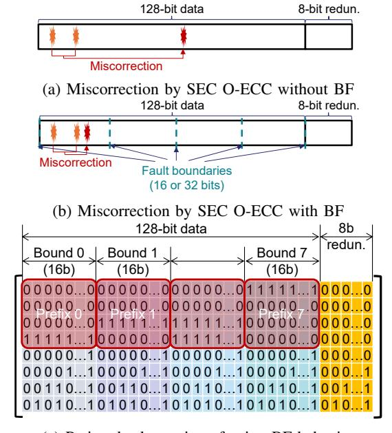

# *D. Link ECC*

As I/O speeds reach tens of gigabits per second per pin and signaling voltages continue to scale down, transient transmission errors have become a significant reliability concern [55]. While S-ECC provides end-to-end protection, it decodes data only on reads and therefore cannot detect *write-path* errors, which can leave corrupted data permanently stored in DRAM. Moreover, S-ECC is often omitted entirely in cost-sensitive or low-power systems to reduce pin count, area, and power consumption [56].

*Link ECC (L-ECC)* protects data during transmission between the memory controller and DRAM (green in Fig. 1). The sender (e.g., the controller on writes) encodes data before transmission, and the receiver verifies it immediately upon arrival, enabling rapid detection—and, in some designs, correction—of transient link errors. Upon error detection, the receiver can request retransmission, preventing corrupted data from being committed to DRAM. L-ECC thus serves as the first line of defense in the data path, prioritizing fast detection and low-latency recovery over complex correction.

Different memory types adopt L-ECC in various forms. DDR5 employs an 8-bit *Cyclic Redundancy Check (CRC)* [57] per four DQs, while HBM implements a data-parity bit across every 32 DQs. LPDDR6 adopts 16-bit parity, configurable for either single-error correction or detection-only operation.

## *E. DRAM Errors*

Designing efficient ECC mechanisms requires understanding how DRAM errors manifest in real systems. While individual DRAM chips are highly reliable, large-scale field studies reveal that aggregate errors exhibit non-negligible rates and distinct patterns [15], [16], [47], [58]–[61]. We summarize observations from recent studies as follows:

- *1) Scaling-Induced Cell and Circuit Faults:* As DRAM technology continues to scale down, transient soft errors are increasingly overshadowed by permanent or intermittent faults caused by process variation and device wear-out. Individual cells have become more susceptible to charge leakage, variable retention time (VRT), and disturbance effects such as row hammering, while peripheral circuits suffer from degraded timing margins and transistor aging [1], [2], [18], [62].
- *2) Multi-bit Errors:* Modern DRAMs increasingly exhibit *spatially correlated* multi-bit errors rather than isolated singlebit errors. Such correlations arise because many peripheral components—such as subwordline (SWL) and subwordline drivers (SWD)—serve multiple adjacent cells [16]. When one of these shared components fails, it can simultaneously corrupt all of the cells it serves. Column-related faults typically flip one bit per access, whereas row-related faults can disrupt multiple bits within the same access and thus pose a greater challenge to ECC [15].

The scope of these correlated errors depends heavily on the internal organization of peripheral circuits. Recent characterization of DDR5 devices reveals that most errors remain confined within a small physical region, typically spanning up to 16 bits per access [16]. In DDR5, each access transfers 8 bits of data from multiple *Memory Array Tiles (MATs)*. Although MATs are largely independent, adjacent tiles share critical peripheral components—most notably the subwordline driver. A defect in this shared driver can propagate across MAT boundaries, corrupting both tiles and resulting in up to 16 erroneous bits per access1 . This observation implies that modern ECC mechanisms must be capable of correcting up to 16 clustered errors to maintain high reliability in advanced DRAM technologies.

*3) Errors Beyond Bank-Groups:* While O-ECC effectively corrects faults within individual bank groups, recent studies reveal that a significant portion of DRAM errors originate beyond these boundaries, such as in device-level peripheral circuits or interconnect paths [58], [61], [63]. For example, a report on HBM3 devices equipped with integrated O-ECC revealed that, even with O-ECC enabled, a substantial number of error interrupt events were still reported [60]. This implies that these errors originated outside the coverage of O-ECC or emerged after the O-ECC stage. The persistence of such errors indicates that many arise in unprotected regions—e.g., global I/O interfaces, TSV or silicon interposer links—where O-ECC's correction scope does not apply [64]. These findings highlight the limitations of O-ECC and reinforce the importance of maintaining end-to-end protection through S-ECC.

## III. MOTIVATION

The previous section outlined three ECC layers, each optimized for a distinct reliability objective: S-ECC provides end-to-end protection and strong overall reliability, O-ECC conceals errors and improves manufacturability [20], [21], [50], [65], and L-ECC enables early detection of link errors. This section examines how commercial DRAMs combine these layers in practice. Although each layer is effective in isolation, their ad-hoc integration frequently results in redundant coverage, inefficient use of redundancy, and—paradoxically—reduced overall reliability, motivating the need for a cross-layer ECC framework.

## *A. ECCs in DDR-based Systems*

Although Cerberus targets single-device memory architectures such as HBM and LPDDR, it is instructive to first examine DDR-based systems. High-reliability platforms, including supercomputers, have developed sophisticated reliability mechanisms for DDR memory, and the distribution of data across multiple DRAM devices within a DIMM inherently enables strong SDDC protection [46].

A typical DDR5 system employs three ECC layers configured as follows: (1) *S-ECC*, implemented with 25% additional devices to provide SDDC-level protection; (2) *O-ECC*, adding 6.25% cell-area overhead (8 parity bits per 128-bit data word) for SEC within each device; and (3) *L-ECC*, introducing a 12.5% transfer overhead (two additional beats per 16-beat burst) to provide CRC16-based link error detection. Together, these layers incur approximately 32.8% storage overhead (from S-ECC and O-ECC) and 40.6% transfer overhead (from S-ECC and L-ECC), highlighting the inefficiency of independently managed ECC layers [24].

Despite these costs, reliability can degrade due to *miscorrections* [50], [66]. When two bits fail, an O-ECC configured as SEC may wrongly flip a third bit (Fig. 2a). If this new error falls in a different S-ECC symbol, the number of erroneous symbols may exceed S-ECC's correction capability, producing an uncorrectable fault. Such miscorrections can occur at nontrivial rates. Under an SEC O-ECC + SEC-DED S-ECC stack, prior work reports that O-ECC miscorrects ≈ 45% of double-bit errors (DBEs) into triple-bit errors, and that S-ECC then miscorrects these triple-bit errors as single-bit errors in ≈ 55% of the cases, causing SDC [50]. It also estimates that SDC can occur once per 3 million accesses when the DRAM raw error rate is 10−4 .

To prevent such cross-layer interference, DDR5 enforces the *Bounded Fault (BF)* rule, which restricts each correction

1Depending on the DRAM architecture, the affected bit width can range from about 8 to 32 bits.

(c) Parity-check matrix enforcing BF behavior

Fig. 2: Bounded-fault design for SEC O-ECC in DDR5

to a small spatial region (Fig. 2b)—typically 16 bits from an I/O pin. O-ECC must ensure that miscorrections remain within the boundary region [28]. This behavior is guaranteed by designing the parity-check matrix H such that no sum of columns within a region equals any column outside that region. In one such parity-check matrix (Fig. 2c), columns within one region share a prefix: odd-bit errors preserve it (staying local), while even-bit sums cancel to zero, mapping to non-data space.

The BF rule effectively isolates O-ECC from S-ECC, allowing intra-device correction without propagating faults. However, each layer still maintains separate redundancy, inflating total storage overhead, and the BF layout constrains S-ECC's symbol organization to Bamboo-ECC-like groupings [32].

#### B. ECCs in HBM-based Systems

HBM transfers data through a single device, allowing the granularity of O-ECC to align directly with that of S-ECC. In HBM4, each pseudo-channel protects 32 bytes of data with 2 bytes of S-ECC, 4 bytes of O-ECC, and 1 byte of L-ECC redundancy [26]. This configuration emphasizes ondie correction by allocating more redundancy bits to O-ECC, allowing it to correct up to 16 faulty bits per block. Such strong on-die protection effectively suppresses scaling-induced faults, especially those originating from peripheral circuits such as subwordline drivers. Meanwhile, HBM4 maintains high bandwidth by transmitting L-ECC through a dedicated sideband pin, leaving the main data interface fully utilized. To balance total redundancy, HBM4 limits S-ECC to 2 bytes per 32-byte data block. This limited budget can be used for either an ECC (e.g., SEC-DED) or an Error Detecting Code (EDC) (e.g., CRC16). In practice, most systems adopt CRC since its misdetection probability ( $\approx 0.002\%$ ) is nearly two orders of magnitude lower than that of SEC-DED ( $\approx 0.4\%$ ), substantially reducing the risk of SDC [52].

Despite these refinements, HBM's reliability remains constrained by several structural limitations. First, because O-ECC performs symbol-based correction without a boundedfault constraint, a miscorrection can produce errors beyond the correction capability of S-ECC, leading to an unrecoverable condition at the system level. Second, O-ECC can detect most uncorrectable events with high probability (≈99.97%), but the results are conveyed to the system level only through a limited severity (SEV) pin [26], [67]. As a result, the system lacks sufficient cross-layer visibility, and S-ECC must rely solely on the limited error information interpreted by O-ECC (e.g., CE or UE signals), performing decoding under incomplete awareness. Consequently, the system becomes exposed to errors undetected by S-ECC, increasing the risk of missing multi-symbol errors. Third, O-ECC's protection scope is confined to the internal array and peripheral circuitry; link and I/O interface errors remain outside its coverage. This issue is particularly severe in HBM, where Through-Silicon Vias (TSVs) introduce new fault modes. Because a TSV fault lies outside O-ECC's protection scope, detection-based S-ECC alone cannot adequately handle this error. Recent field studies of HBM3 devices [60] corroborate these issues, showing that a substantial number of errors are still detected by S-ECC, indicating that many faults occur beyond the reach of O-ECC.

#### C. ECCs in LPDDR-based Systems

Similar to HBM, LPDDR employs a single-device memory channel architecture, allowing S-ECC and O-ECC to operate at the same granularity. In LPDDR6, each pseudo-channel protects a 32-byte data block using 2 bytes of S-ECC, 2 bytes of O-ECC, and 2 bytes of L-ECC redundancy. The O-ECC employs its 2-byte budget to implement SEC-DED for the 32-byte data block and its associated S-ECC redundancy. Externally, a subchannel transfers 36 bytes per burst across 12 I/O pins over 24 beats—32 bytes of user data, 2 bytes of S-ECC, and 2 bytes carrying either L-ECC redundancy or *Data Bus Inversion (DBI)* information. Overall, this configuration introduces about 12.5% storage and transfer overhead, a cost considered acceptable in mobile devices [25].

Despite these protections, LPDDR6 still provides only moderate reliability due to two key limitations: *miscorrection propagation* and *limited correction capability*. Because LPDDR6 lacks Bounded Fault (BF) protection, an O-ECC miscorrection can turn a triple-bit error into a quadruple-bit corruption, increasing the burden on S-ECC. In addition, SEC-DED-based O-ECC can correct only single-bit errors, so it faces a fundamental limitation when handling multi-bit errors that often arise in peripheral circuitry. The same constraint applies to S-ECC when it uses the same redundancy budget as O-ECC. If S-ECC is configured as SEC-DED, it also corrects only single-bit errors and cannot handle multi-bit errors. Alternatively, configuring S-ECC as an 8-bit Single Symbol Correction (SSC) allows correction of up to 8-bit clustered errors, but its detection capability is limited (≈86.7%).

TABLE I: Comparison of ECC schemes

|                   |                     | Single-layer |            | Multi-layer          |                |                  |               | Cross-layer |
|-------------------|---------------------|--------------|------------|----------------------|----------------|------------------|---------------|-------------|
|                   |                     | DUO          | Unity ECC  | LPDDR6/ SEC-DED   | LPDDR6/ CRC | HBM4/ SEC-DED | HBM4/ CRC  | Cerberus    |
|                   | Data bits           | 512          |            | 256                  |                |                  |               |             |
| Total             | Storage overhead    | 19.5% (100b) | 25% (128b) | 12.5% (32b)          |                | 18.8% (48b)      |               | 12.5% (32b) |
|                   | Transfer overhead   | 19.5% (100b) | 25% (128b) | 12.5% (32b)          |                | 15.6% (40b)      |               | 12.5% (32b) |
| Bit config.       |                     | 512 + 100    | 512 + 128  | 256 + 16             |                |                  | 256 + 16 + 16 |             |
| S-ECC             | ECC                 | RS(76,64)    | SSC+DEC    | SEC-DED              | CRC            | SEC-DED          | CRC           | SSC+DEC     |
| Bit config.       |                     |              |            | 272 + 16 272 + 32 |                |                  | 272 + 16      |             |
|                   | O-ECC N/A ECC |              |            | SEC-DED              |                | 16b SSC          |               | SEC-DED     |
|                   | Bit config.         |              |            | 272 + 16             |                | 272 + 8          |               | 272 + 16    |
| L-ECC ECC      |                     | N/A          |            | SEC or EDC           |                | Parity           |               | EDC         |
| Early Detection   |                     | No           |            | Yes                  |                |                  |               |             |
| Error Concealment |                     | No           |            | Yes                  |                |                  |               |             |
| Bounded Fault     |                     |              |            | No                   |                |                  |               | Yes         |
| Correction        |                     | High         |            | Low                  |                | Medium           | Low           | High        |
| Detection         |                     | Very High    | High       | Low                  | High           | Medium           | High          | High        |

Fig. 3: The single-layer ECC configurations of DDR5

# *D. Link ECC*

As I/O speeds reach tens of gigabits per second per pin and signaling voltages continue to scale down, transient transmission errors have become a significant reliability concern [55]. While S-ECC provides end-to-end protection, it decodes data only on reads and therefore cannot detect *write-path* errors, which can leave corrupted data permanently stored in DRAM. Moreover, S-ECC is often omitted entirely in cost-sensitive or low-power systems to reduce pin count, area, and power consumption [56].

*Link ECC (L-ECC)* protects data during transmission between the memory controller and DRAM (green in Fig. 1). The sender (e.g., the controller on writes) encodes data before transmission, and the receiver verifies it immediately upon arrival, enabling rapid detection—and, in some designs, correction—of transient link errors. Upon error detection, the receiver can request retransmission, preventing corrupted data from being committed to DRAM. L-ECC thus serves as the first line of defense in the data path, prioritizing fast detection and low-latency recovery over complex correction.

Different memory types adopt L-ECC in various forms. DDR5 employs an 8-bit *Cyclic Redundancy Check (CRC)* [57] per four DQs, while HBM implements a data-parity bit across every 32 DQs. LPDDR6 adopts 16-bit parity, configurable for either single-error correction or detection-only operation.

## *E. DRAM Errors*

Designing efficient ECC mechanisms requires understanding how DRAM errors manifest in real systems. While individual DRAM chips are highly reliable, large-scale field studies reveal that aggregate errors exhibit non-negligible rates and distinct patterns [15], [16], [47], [58]–[61]. We summarize observations from recent studies as follows:

- *1) Scaling-Induced Cell and Circuit Faults:* As DRAM technology continues to scale down, transient soft errors are increasingly overshadowed by permanent or intermittent faults caused by process variation and device wear-out. Individual cells have become more susceptible to charge leakage, variable retention time (VRT), and disturbance effects such as row hammering, while peripheral circuits suffer from degraded timing margins and transistor aging [1], [2], [18], [62].
- *2) Multi-bit Errors:* Modern DRAMs increasingly exhibit *spatially correlated* multi-bit errors rather than isolated singlebit errors. Such correlations arise because many peripheral components—such as subwordline (SWL) and subwordline drivers (SWD)—serve multiple adjacent cells [16]. When one of these shared components fails, it can simultaneously corrupt all of the cells it serves. Column-related faults typically flip one bit per access, whereas row-related faults can disrupt multiple bits within the same access and thus pose a greater challenge to ECC [15].

The scope of these correlated errors depends heavily on the internal organization of peripheral circuits. Recent characterization of DDR5 devices reveals that most errors remain confined within a small physical region, typically spanning up to 16 bits per access [16]. In DDR5, each access transfers 8 bits of data from multiple *Memory Array Tiles (MATs)*. Although MATs are largely independent, adjacent tiles share critical peripheral components—most notably the subwordline driver. A defect in this shared driver can propagate across MAT boundaries, corrupting both tiles and resulting in up to 16 erroneous bits per access1 . This observation implies that modern ECC mechanisms must be capable of correcting up to 16 clustered errors to maintain high reliability in advanced DRAM technologies.

*3) Errors Beyond Bank-Groups:* While O-ECC effectively corrects faults within individual bank groups, recent studies reveal that a significant portion of DRAM errors originate beyond these boundaries, such as in device-level peripheral circuits or interconnect paths [58], [61], [63]. For example, a report on HBM3 devices equipped with integrated O-ECC revealed that, even with O-ECC enabled, a substantial number of error interrupt events were still reported [60]. This implies that these errors originated outside the coverage of O-ECC or emerged after the O-ECC stage. The persistence of such errors indicates that many arise in unprotected regions—e.g., global I/O interfaces, TSV or silicon interposer links—where O-ECC's correction scope does not apply [64]. These findings highlight the limitations of O-ECC and reinforce the importance of maintaining end-to-end protection through S-ECC.

## III. MOTIVATION

The previous section outlined three ECC layers, each optimized for a distinct reliability objective: S-ECC provides end-to-end protection and strong overall reliability, O-ECC conceals errors and improves manufacturability [20], [21], [50], [65], and L-ECC enables early detection of link errors. This section examines how commercial DRAMs combine these layers in practice. Although each layer is effective in isolation, their ad-hoc integration frequently results in redundant coverage, inefficient use of redundancy, and—paradoxically—reduced overall reliability, motivating the need for a cross-layer ECC framework.

## *A. ECCs in DDR-based Systems*

Although Cerberus targets single-device memory architectures such as HBM and LPDDR, it is instructive to first examine DDR-based systems. High-reliability platforms, including supercomputers, have developed sophisticated reliability mechanisms for DDR memory, and the distribution of data across multiple DRAM devices within a DIMM inherently enables strong SDDC protection [46].

A typical DDR5 system employs three ECC layers configured as follows: (1) *S-ECC*, implemented with 25% additional devices to provide SDDC-level protection; (2) *O-ECC*, adding 6.25% cell-area overhead (8 parity bits per 128-bit data word) for SEC within each device; and (3) *L-ECC*, introducing a 12.5% transfer overhead (two additional beats per 16-beat burst) to provide CRC16-based link error detection. Together, these layers incur approximately 32.8% storage overhead (from S-ECC and O-ECC) and 40.6% transfer overhead (from S-ECC and L-ECC), highlighting the inefficiency of independently managed ECC layers [24].

Despite these costs, reliability can degrade due to *miscorrections* [50], [66]. When two bits fail, an O-ECC configured as SEC may wrongly flip a third bit (Fig. 2a). If this new error falls in a different S-ECC symbol, the number of erroneous symbols may exceed S-ECC's correction capability, producing an uncorrectable fault. Such miscorrections can occur at nontrivial rates. Under an SEC O-ECC + SEC-DED S-ECC stack, prior work reports that O-ECC miscorrects ≈ 45% of double-bit errors (DBEs) into triple-bit errors, and that S-ECC then miscorrects these triple-bit errors as single-bit errors in ≈ 55% of the cases, causing SDC [50]. It also estimates that SDC can occur once per 3 million accesses when the DRAM raw error rate is 10−4 .

To prevent such cross-layer interference, DDR5 enforces the *Bounded Fault (BF)* rule, which restricts each correction

1Depending on the DRAM architecture, the affected bit width can range from about 8 to 32 bits.

(c) Parity-check matrix enforcing BF behavior

Fig. 2: Bounded-fault design for SEC O-ECC in DDR5

to a small spatial region (Fig. 2b)—typically 16 bits from an I/O pin. O-ECC must ensure that miscorrections remain within the boundary region [28]. This behavior is guaranteed by designing the parity-check matrix H such that no sum of columns within a region equals any column outside that region. In one such parity-check matrix (Fig. 2c), columns within one region share a prefix: odd-bit errors preserve it (staying local), while even-bit sums cancel to zero, mapping to non-data space.

The BF rule effectively isolates O-ECC from S-ECC, allowing intra-device correction without propagating faults. However, each layer still maintains separate redundancy, inflating total storage overhead, and the BF layout constrains S-ECC's symbol organization to Bamboo-ECC-like groupings [32].

#### B. ECCs in HBM-based Systems

HBM transfers data through a single device, allowing the granularity of O-ECC to align directly with that of S-ECC. In HBM4, each pseudo-channel protects 32 bytes of data with 2 bytes of S-ECC, 4 bytes of O-ECC, and 1 byte of L-ECC redundancy [26]. This configuration emphasizes ondie correction by allocating more redundancy bits to O-ECC, allowing it to correct up to 16 faulty bits per block. Such strong on-die protection effectively suppresses scaling-induced faults, especially those originating from peripheral circuits such as subwordline drivers. Meanwhile, HBM4 maintains high bandwidth by transmitting L-ECC through a dedicated sideband pin, leaving the main data interface fully utilized. To balance total redundancy, HBM4 limits S-ECC to 2 bytes per 32-byte data block. This limited budget can be used for either an ECC (e.g., SEC-DED) or an Error Detecting Code (EDC) (e.g., CRC16). In practice, most systems adopt CRC since its misdetection probability ( $\approx 0.002\%$ ) is nearly two orders of magnitude lower than that of SEC-DED ( $\approx 0.4\%$ ), substantially reducing the risk of SDC [52].

Despite these refinements, HBM's reliability remains constrained by several structural limitations. First, because O-ECC performs symbol-based correction without a boundedfault constraint, a miscorrection can produce errors beyond the correction capability of S-ECC, leading to an unrecoverable condition at the system level. Second, O-ECC can detect most uncorrectable events with high probability (≈99.97%), but the results are conveyed to the system level only through a limited severity (SEV) pin [26], [67]. As a result, the system lacks sufficient cross-layer visibility, and S-ECC must rely solely on the limited error information interpreted by O-ECC (e.g., CE or UE signals), performing decoding under incomplete awareness. Consequently, the system becomes exposed to errors undetected by S-ECC, increasing the risk of missing multi-symbol errors. Third, O-ECC's protection scope is confined to the internal array and peripheral circuitry; link and I/O interface errors remain outside its coverage. This issue is particularly severe in HBM, where Through-Silicon Vias (TSVs) introduce new fault modes. Because a TSV fault lies outside O-ECC's protection scope, detection-based S-ECC alone cannot adequately handle this error. Recent field studies of HBM3 devices [60] corroborate these issues, showing that a substantial number of errors are still detected by S-ECC, indicating that many faults occur beyond the reach of O-ECC.

#### C. ECCs in LPDDR-based Systems

Similar to HBM, LPDDR employs a single-device memory channel architecture, allowing S-ECC and O-ECC to operate at the same granularity. In LPDDR6, each pseudo-channel protects a 32-byte data block using 2 bytes of S-ECC, 2 bytes of O-ECC, and 2 bytes of L-ECC redundancy. The O-ECC employs its 2-byte budget to implement SEC-DED for the 32-byte data block and its associated S-ECC redundancy. Externally, a subchannel transfers 36 bytes per burst across 12 I/O pins over 24 beats—32 bytes of user data, 2 bytes of S-ECC, and 2 bytes carrying either L-ECC redundancy or *Data Bus Inversion (DBI)* information. Overall, this configuration introduces about 12.5% storage and transfer overhead, a cost considered acceptable in mobile devices [25].

Despite these protections, LPDDR6 still provides only moderate reliability due to two key limitations: *miscorrection propagation* and *limited correction capability*. Because LPDDR6 lacks Bounded Fault (BF) protection, an O-ECC miscorrection can turn a triple-bit error into a quadruple-bit corruption, increasing the burden on S-ECC. In addition, SEC-DED-based O-ECC can correct only single-bit errors, so it faces a fundamental limitation when handling multi-bit errors that often arise in peripheral circuitry. The same constraint applies to S-ECC when it uses the same redundancy budget as O-ECC. If S-ECC is configured as SEC-DED, it also corrects only single-bit errors and cannot handle multi-bit errors. Alternatively, configuring S-ECC as an 8-bit Single Symbol Correction (SSC) allows correction of up to 8-bit clustered errors, but its detection capability is limited (≈86.7%).

TABLE I: Comparison of ECC schemes

|                   |                     | Single-layer |            | Multi-layer          |                |                  |               | Cross-layer |
|-------------------|---------------------|--------------|------------|----------------------|----------------|------------------|---------------|-------------|
|                   |                     | DUO          | Unity ECC  | LPDDR6/ SEC-DED   | LPDDR6/ CRC | HBM4/ SEC-DED | HBM4/ CRC  | Cerberus    |
|                   | Data bits           | 512          |            | 256                  |                |                  |               |             |
| Total             | Storage overhead    | 19.5% (100b) | 25% (128b) | 12.5% (32b)          |                | 18.8% (48b)      |               | 12.5% (32b) |
|                   | Transfer overhead   | 19.5% (100b) | 25% (128b) | 12.5% (32b)          |                | 15.6% (40b)      |               | 12.5% (32b) |
| Bit config.       |                     | 512 + 100    | 512 + 128  | 256 + 16             |                |                  | 256 + 16 + 16 |             |
| S-ECC             | ECC                 | RS(76,64)    | SSC+DEC    | SEC-DED              | CRC            | SEC-DED          | CRC           | SSC+DEC     |
| Bit config.       |                     |              |            | 272 + 16 272 + 32 |                |                  | 272 + 16      |             |
|                   | O-ECC N/A ECC |              |            | SEC-DED              |                | 16b SSC          |               | SEC-DED     |
|                   | Bit config.         |              |            | 272 + 16             |                | 272 + 8          |               | 272 + 16    |
| L-ECC ECC      |                     | N/A          |            | SEC or EDC           |                | Parity           |               | EDC         |
| Early Detection   |                     | No           |            | Yes                  |                |                  |               |             |
| Error Concealment |                     | No           |            | Yes                  |                |                  |               |             |
| Bounded Fault     |                     |              |            | No                   |                |                  |               | Yes         |
| Correction        |                     | High         |            | Low                  |                | Medium           | Low           | High        |
| Detection         |                     | Very High    | High       | Low                  | High           | Medium           | High          | High        |

Fig. 3: The single-layer ECC configurations of DDR5

