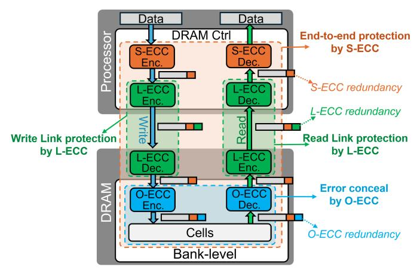

# I. INTRODUCTION

As memory technology scales toward ever higher density and bandwidth, ensuring data correctness has become increasingly challenging [1]–[4]. Modern DRAMs integrate billions of tiny capacitors that store femtocoulomb-level charge, operate at sub-nanosecond timing margins, and communicate over multi-gigabit-per-pin I/O links [5]–[8]. These advances enable unprecedented capacity and performance but also amplify vulnerability to faults. A single defective transistor, a marginal sense amplifier, or a transient signaling glitch can corrupt data and compromise large-scale computation [9], [10].

The risk is especially pronounced in recent DRAM families such as HBM and LPDDR. These memories map each channel to a single DRAM device (a *single-device-per-channel (SDPC)* organization) to achieve higher bandwidth and lower power. However, this decision places all data in a single device, effectively putting all eggs in a single basket. Consequently, any device-level defect can compromise the entire channel, whereas traditional multi-device DDR modules can tolerate a failed device through rank-level protection [11].

At the same time, modern data-intensive workloads have reduced the minimum fetch granularity of SDPC memories

¶Both authors contributed equally to this research.

to 32B (vs. 64B in DDR-based systems) to curb overfetch and improve effective bandwidth. While beneficial for performance, the smaller granularity leaves less room to amortize ECC overheads. As a result, SDPC memories typically allocate only 2 B of redundancy per 32 B block (6.25%), versus 8 B per 64 B (12.5%) in common DDR configurations. This narrow budget leaves little margin for robust protection [12], [13].

Historically, DRAM reliability relied on a *single layer* of *Error-Correcting Code (ECC)* at the memory controller—*System ECC (S-ECC)*—with simple *Single-Error Correction, Double-Error Detection (SEC-DED)* sufficient when isolated soft errors dominated [14]. However, as process, voltage, and I/O scaling approach physical limits, fault modes have shifted [15]–[17]. Variability, device aging, and high-speed signaling induce *clustered* and *peripheral* faults spanning 8–32 bits within a single access, alongside transient link corruptions.

These multi-bit errors exceed SEC-DED's correction capability and can occasionally evade detection, leading to *Silent Data Corruption (SDC)* that threatens end-to-end correctness. Beyond the technical implications, these trends also affect manufacturability and product quality. Achieving defect-free DRAM dies has become increasingly difficult as geometries shrink, leading to declining yield. Worse, marginal and intermittent defects often elude production testing, escaping into the field as latent faults [18].

To mitigate both reliability and manufacturability challenges, the DRAM industry has incrementally introduced protection mechanisms at *multiple layers* of the memory hierarchy [19]. Modern devices now integrate *On-die ECC (O-ECC)* to locally repair manufacturing defects and small-scale faults, thereby improving yield [20]–[23]. At the channel boundary, high-speed interfaces employ *Link ECC (L-ECC)* or *Cyclic Redundancy Check (CRC)* to detect transmission errors in real time [24]–[26]. Meanwhile, memory controllers continue to enhance *S-ECC* to recover from large-granularity failures, such as a dead chip within a module [27]. Collectively, these mechanisms form a *three-layer ECC hierarchy*—link, on-die, and system—that protects data across distinct physical and temporal domains.

However, these layers have evolved independently, without cross-layer coordination. As a result, they often duplicate redundancy, leave critical fault regions unprotected, and most critically suffer from destructive interference across layers. For example, when errors exceed the correction capability of O-ECC, the decoder may *miscorrect* benign bits, increase the number of corrupted bits and turn a pattern S-ECC could have fixed into one it cannot [28]. L-ECC prevents write-path corruption but operates orthogonally to both O-ECC and S-ECC, limiting end-to-end fault traceability. This fragmented protection model wastes redundancy and struggles to balance reliability, performance, and cost in modern memory systems.

This paper introduces *Cerberus*, a novel cross-layer ECC co-design that unifies protection across the link, device, and system layers. Cerberus addresses the challenges of current multi-layered memory systems, where O-ECC, L-ECC, and S-ECC are provisioned and managed in isolation. Instead of treating them as separate features, Cerberus co-optimizes their roles so that their checks become complementary rather than redundant or destructive, while preserving each layer's native responsibilities: O-ECC for local repair and yield improvement, L-ECC for real-time detection and retransmission, and S-ECC for robust end-to-end recovery.

At the heart of Cerberus is an *Encode-Once, Decode-Many* (EODM) architecture. On writes, the memory controller performs a single encoding step to generate a shared redundancy for all layers. Along the write path, the link layer utilizes the redundancy to detect transmission errors immediately and trigger retransmission when needed (write-side L-ECC). On reads, a bank-group decoder corrects storage-side faults within the device (O-ECC) using that same redundancy. Finally, the controller consumes the full redundancy to deliver strong end-to-end correction and detection against cell, peripheral, and I/O failures (S-ECC and read-side L-ECC). By reusing a single pool of redundancy across layers, EODM improves efficiency and provides seamless coverage without protection gaps observed in HBM configurations.

Realizing this architecture requires novel ECC codes that enable redundancy reuse across layers. The limited redundancy must be allocated across layers to balance their costs and benefits, and reuse must be orchestrated so that any miscorrection at an earlier layer never amplifies the error burden passed to later layers. The scheme must also be sufficiently scalable to support practical co-design and deployment across processor and DRAM vendors.

Cerberus achieves these goals by co-designing the generator and parity-check matrices used for ECC. This matrix-level codesign enables interoperability across layers while allowing each layer to fully meet its own protection goals. We also enforce a bounded-fault constraint on O-ECC to ensure that any miscorrection never amplifies the error burden to the system layer. Furthermore, by varying the redundancy within the range feasible for SDPC, Cerberus serves as a scalable framework that can be applied across diverse memory systems.

Our evaluation shows that Cerberus improves reliability and performance despite lowering HBM's storage overhead by 33.3%. With less redundancy than baseline HBM, Cerberus still achieves higher overall reliability, and under the same redundancy budget as LPDDR6, it delivers substantially stronger protection across diverse fault locations. In addition, Cerberus improves system performance by 0.7%, mainly by eliminating consecutive encoder stages. Taken together, these results demonstrate that Cerberus is a practical and scalable framework for enhancing reliability and performance in future SDPC-enabled systems.

The major contributions of this paper are as follows:

- We propose the co-design architecture of Cerberus based on the EODM structure. By co-designing unified protection across each memory layer, Cerberus ensures consistent high reliability across the system while minimizing redundancy.
- We propose an HBM architecture that applies Cerberus. Cerberus achieves both system reliability and efficiency by significantly reducing parity storage overhead while maintaining high system-wide reliability against clustered and peripheral faults.
- We evaluate Cerberus using various workloads, showing that Cerberus achieves high performance and lower energy consumption while maintaining superior overall reliability.

## II. BACKGROUND

This section reviews the fundamentals of ECC and how modern memory systems deploy them across *three layers*. It then summarizes recent observations on DRAM error characteristics that motivate cross-layer ECC designs.

## *A. Error Correcting Codes*

Error Correcting Codes (ECC) enable reliable storage and transmission in the presence of physical faults. Most memory systems employ *linear block codes* for their low latency and hardware simplicity [29]. An (n, k) linear block code maps a k-symbol message m into an n-symbol *codeword* c by appending r = n − k redundancy symbols [30]. A code can be described by a *generator matrix* G with c = mG and a *parity-check matrix* H with Hc ⊤ = 0.

Upon receiving y = c + e (where e is the error vector), the decoder computes the *syndrome* s = Hy ⊤ = He ⊤ [31]. Because s depends only on the error pattern, the decoder estimates eˆ and reconstructs cˆ = y − eˆ. Decoding outcomes are commonly categorized as: (1) *Detectable and Correctable Error (DCE)*; (2) *Detected but Uncorrectable Error (DUE)* when s lies beyond the correction radius; (3) *Detected but Miscorrected Error (DME)*, in which the decoder asserts success yet outputs an incorrect codeword; and (4) *Undetectable and Uncorrectable Error (UUE)* with s = 0 despite corruption [32]. Cases (3) and (4) lead to *Silent Data Corruption (SDC)*, which is the most severe class of memory reliability failure [33]–[35].

The most common main-memory code is *Single-Error Correction and Double-Error Detection (SEC-DED)* [36], [37]. An SEC-DED code guarantees correction of any single-bit error and detection (but not correction) of any double-bit error. More powerful BCH codes correct t bit errors in an n bit word with redundancy on the order of t⌈log2 (n + 1)⌉ bits [38].

Fig. 1: Contemporary DRAM protection based on three ECC layers (S-ECC, O-ECC, and L-ECC)

Because DRAM errors frequently occur in bursts or are confined to specific physical regions, systems often employ *non-binary, symbol-based* codes. *Reed–Solomon (RS)* codes defined over GF(2m) can correct up to t symbol errors using 2t redundant symbols [39]. By aligning code symbols with physical fault domains—such as a chip or *Data Pin (DQ)*—RS codes efficiently convert spatially correlated bit errors into a small number of symbol errors, providing strong protection with modest redundancy [40]–[42].

## *B. System ECC*

Processors have long employed ECC to ensure memory and overall system reliability [43], [44]. The memory controller encodes data on every write and decodes data on every read (orange in Fig. 1). This mechanism—known as *System ECC (S-ECC)* or *rank-level ECC*—detects and corrects errors in both storage and transmission, providing *end-to-end protection* between the processor and memory [45].

S-ECC implementations vary across DRAM types, generations, and processor vendors. A standard DDR4 ECC-DIMM provides a (64+8)-bit interface, where the additional eight bits store redundancy for each 64-bit data beat. Most processors implement SEC-DED, enabling correction of any single-bit error and detection of double-bit errors per beat. While this configuration is sufficient for random soft errors, large-scale systems require stronger resilience against complete device failures—known as *Single-Device Data Correction (SDDC)* or *chipkill-correct* [46].

SDDC implementations vary across vendors and are often proprietary or confidential [47], [48]. Nonetheless, several public designs employ RS-based protection while remaining compatible with standard ECC-DIMMs. For instance, AMD's *Chipkill-Correct* constructs 8-bit RS symbols by grouping two 4-bit data beats from each chip and employs two redundant devices for single-chip recovery [46]. *Bamboo ECC* forms 8 bit symbols across eight I/O beats, allowing correction of up to four faulty pins (≈ one chip failure) [32]. More recently, *Unity ECC* extends this concept to handle both single-symbol and double-bit errors through hybrid decoding [22].

DDR5 reshapes S-ECC design by doubling the burst length (from 8 to 16 beats) and dividing each DIMM into two 32 bit subchannels. High-reliability ECC-DIMMs allocate eight ECC pins per subchannel, forming (2 × (32 + 8)) interfaces that provide SDDC capability within each subchannel [24]. In contrast, memory types such as HBM and LPDDR deliver full-channel access through a single device to maximize bandwidth and energy efficiency. In these *single-device memory channels*, device-level SDDC is infeasible—any device failure compromises the entire channel's data. Consequently, S-ECC in such systems targets large-granularity burst or link-level faults rather than complete device failures.

## *C. On-Die ECC*

Shrinking process technology reduces the charge stored in each cell, increases process variation, and makes transistors more susceptible to wear-out [3]. To mitigate these errors, modern DRAMs integrate *On-Die ECC (O-ECC)* that repairs faults internally, complementing external S-ECC [20], [49], [50]. Each die contains hidden redundancy cells and a compact encoder/decoder that encodes every write and decodes every read within each bank group (blue in Fig. 1). By correcting faults locally, O-ECC effectively converts dies with marginal defects into externally fault-free components, improving manufacturing yield and ensuring component-level reliability beyond warranty thresholds [21].

O-ECC implementations also vary across DRAM types and generations [51]–[54]. In DDR5, where channel data are distributed across multiple chips, devices employ lightweight bit-level SEC schemes with 8 redundant bits per 128 data bits [24]. In contrast, single-device memory channels such as HBM and LPDDR apply O-ECC at their native 32-byte access granularity. For instance, HBM4 uses 32 bits of redundancy to correct 16-bit–aligned symbol errors, while LPDDR6 applies SEC-DED codes with 16 bits of redundancy [25], [26].

# I. INTRODUCTION

As memory technology scales toward ever higher density and bandwidth, ensuring data correctness has become increasingly challenging [1]–[4]. Modern DRAMs integrate billions of tiny capacitors that store femtocoulomb-level charge, operate at sub-nanosecond timing margins, and communicate over multi-gigabit-per-pin I/O links [5]–[8]. These advances enable unprecedented capacity and performance but also amplify vulnerability to faults. A single defective transistor, a marginal sense amplifier, or a transient signaling glitch can corrupt data and compromise large-scale computation [9], [10].

The risk is especially pronounced in recent DRAM families such as HBM and LPDDR. These memories map each channel to a single DRAM device (a *single-device-per-channel (SDPC)* organization) to achieve higher bandwidth and lower power. However, this decision places all data in a single device, effectively putting all eggs in a single basket. Consequently, any device-level defect can compromise the entire channel, whereas traditional multi-device DDR modules can tolerate a failed device through rank-level protection [11].

At the same time, modern data-intensive workloads have reduced the minimum fetch granularity of SDPC memories

¶Both authors contributed equally to this research.

to 32B (vs. 64B in DDR-based systems) to curb overfetch and improve effective bandwidth. While beneficial for performance, the smaller granularity leaves less room to amortize ECC overheads. As a result, SDPC memories typically allocate only 2 B of redundancy per 32 B block (6.25%), versus 8 B per 64 B (12.5%) in common DDR configurations. This narrow budget leaves little margin for robust protection [12], [13].

Historically, DRAM reliability relied on a *single layer* of *Error-Correcting Code (ECC)* at the memory controller—*System ECC (S-ECC)*—with simple *Single-Error Correction, Double-Error Detection (SEC-DED)* sufficient when isolated soft errors dominated [14]. However, as process, voltage, and I/O scaling approach physical limits, fault modes have shifted [15]–[17]. Variability, device aging, and high-speed signaling induce *clustered* and *peripheral* faults spanning 8–32 bits within a single access, alongside transient link corruptions.

These multi-bit errors exceed SEC-DED's correction capability and can occasionally evade detection, leading to *Silent Data Corruption (SDC)* that threatens end-to-end correctness. Beyond the technical implications, these trends also affect manufacturability and product quality. Achieving defect-free DRAM dies has become increasingly difficult as geometries shrink, leading to declining yield. Worse, marginal and intermittent defects often elude production testing, escaping into the field as latent faults [18].

To mitigate both reliability and manufacturability challenges, the DRAM industry has incrementally introduced protection mechanisms at *multiple layers* of the memory hierarchy [19]. Modern devices now integrate *On-die ECC (O-ECC)* to locally repair manufacturing defects and small-scale faults, thereby improving yield [20]–[23]. At the channel boundary, high-speed interfaces employ *Link ECC (L-ECC)* or *Cyclic Redundancy Check (CRC)* to detect transmission errors in real time [24]–[26]. Meanwhile, memory controllers continue to enhance *S-ECC* to recover from large-granularity failures, such as a dead chip within a module [27]. Collectively, these mechanisms form a *three-layer ECC hierarchy*—link, on-die, and system—that protects data across distinct physical and temporal domains.

However, these layers have evolved independently, without cross-layer coordination. As a result, they often duplicate redundancy, leave critical fault regions unprotected, and most critically suffer from destructive interference across layers. For example, when errors exceed the correction capability of O-ECC, the decoder may *miscorrect* benign bits, increase the number of corrupted bits and turn a pattern S-ECC could have fixed into one it cannot [28]. L-ECC prevents write-path corruption but operates orthogonally to both O-ECC and S-ECC, limiting end-to-end fault traceability. This fragmented protection model wastes redundancy and struggles to balance reliability, performance, and cost in modern memory systems.

This paper introduces *Cerberus*, a novel cross-layer ECC co-design that unifies protection across the link, device, and system layers. Cerberus addresses the challenges of current multi-layered memory systems, where O-ECC, L-ECC, and S-ECC are provisioned and managed in isolation. Instead of treating them as separate features, Cerberus co-optimizes their roles so that their checks become complementary rather than redundant or destructive, while preserving each layer's native responsibilities: O-ECC for local repair and yield improvement, L-ECC for real-time detection and retransmission, and S-ECC for robust end-to-end recovery.

At the heart of Cerberus is an *Encode-Once, Decode-Many* (EODM) architecture. On writes, the memory controller performs a single encoding step to generate a shared redundancy for all layers. Along the write path, the link layer utilizes the redundancy to detect transmission errors immediately and trigger retransmission when needed (write-side L-ECC). On reads, a bank-group decoder corrects storage-side faults within the device (O-ECC) using that same redundancy. Finally, the controller consumes the full redundancy to deliver strong end-to-end correction and detection against cell, peripheral, and I/O failures (S-ECC and read-side L-ECC). By reusing a single pool of redundancy across layers, EODM improves efficiency and provides seamless coverage without protection gaps observed in HBM configurations.

Realizing this architecture requires novel ECC codes that enable redundancy reuse across layers. The limited redundancy must be allocated across layers to balance their costs and benefits, and reuse must be orchestrated so that any miscorrection at an earlier layer never amplifies the error burden passed to later layers. The scheme must also be sufficiently scalable to support practical co-design and deployment across processor and DRAM vendors.

Cerberus achieves these goals by co-designing the generator and parity-check matrices used for ECC. This matrix-level codesign enables interoperability across layers while allowing each layer to fully meet its own protection goals. We also enforce a bounded-fault constraint on O-ECC to ensure that any miscorrection never amplifies the error burden to the system layer. Furthermore, by varying the redundancy within the range feasible for SDPC, Cerberus serves as a scalable framework that can be applied across diverse memory systems.

Our evaluation shows that Cerberus improves reliability and performance despite lowering HBM's storage overhead by 33.3%. With less redundancy than baseline HBM, Cerberus still achieves higher overall reliability, and under the same redundancy budget as LPDDR6, it delivers substantially stronger protection across diverse fault locations. In addition, Cerberus improves system performance by 0.7%, mainly by eliminating consecutive encoder stages. Taken together, these results demonstrate that Cerberus is a practical and scalable framework for enhancing reliability and performance in future SDPC-enabled systems.

The major contributions of this paper are as follows:

- We propose the co-design architecture of Cerberus based on the EODM structure. By co-designing unified protection across each memory layer, Cerberus ensures consistent high reliability across the system while minimizing redundancy.
- We propose an HBM architecture that applies Cerberus. Cerberus achieves both system reliability and efficiency by significantly reducing parity storage overhead while maintaining high system-wide reliability against clustered and peripheral faults.
- We evaluate Cerberus using various workloads, showing that Cerberus achieves high performance and lower energy consumption while maintaining superior overall reliability.

## II. BACKGROUND

This section reviews the fundamentals of ECC and how modern memory systems deploy them across *three layers*. It then summarizes recent observations on DRAM error characteristics that motivate cross-layer ECC designs.

## *A. Error Correcting Codes*

Error Correcting Codes (ECC) enable reliable storage and transmission in the presence of physical faults. Most memory systems employ *linear block codes* for their low latency and hardware simplicity [29]. An (n, k) linear block code maps a k-symbol message m into an n-symbol *codeword* c by appending r = n − k redundancy symbols [30]. A code can be described by a *generator matrix* G with c = mG and a *parity-check matrix* H with Hc ⊤ = 0.

Upon receiving y = c + e (where e is the error vector), the decoder computes the *syndrome* s = Hy ⊤ = He ⊤ [31]. Because s depends only on the error pattern, the decoder estimates eˆ and reconstructs cˆ = y − eˆ. Decoding outcomes are commonly categorized as: (1) *Detectable and Correctable Error (DCE)*; (2) *Detected but Uncorrectable Error (DUE)* when s lies beyond the correction radius; (3) *Detected but Miscorrected Error (DME)*, in which the decoder asserts success yet outputs an incorrect codeword; and (4) *Undetectable and Uncorrectable Error (UUE)* with s = 0 despite corruption [32]. Cases (3) and (4) lead to *Silent Data Corruption (SDC)*, which is the most severe class of memory reliability failure [33]–[35].

The most common main-memory code is *Single-Error Correction and Double-Error Detection (SEC-DED)* [36], [37]. An SEC-DED code guarantees correction of any single-bit error and detection (but not correction) of any double-bit error. More powerful BCH codes correct t bit errors in an n bit word with redundancy on the order of t⌈log2 (n + 1)⌉ bits [38].

Fig. 1: Contemporary DRAM protection based on three ECC layers (S-ECC, O-ECC, and L-ECC)

Because DRAM errors frequently occur in bursts or are confined to specific physical regions, systems often employ *non-binary, symbol-based* codes. *Reed–Solomon (RS)* codes defined over GF(2m) can correct up to t symbol errors using 2t redundant symbols [39]. By aligning code symbols with physical fault domains—such as a chip or *Data Pin (DQ)*—RS codes efficiently convert spatially correlated bit errors into a small number of symbol errors, providing strong protection with modest redundancy [40]–[42].

## *B. System ECC*

Processors have long employed ECC to ensure memory and overall system reliability [43], [44]. The memory controller encodes data on every write and decodes data on every read (orange in Fig. 1). This mechanism—known as *System ECC (S-ECC)* or *rank-level ECC*—detects and corrects errors in both storage and transmission, providing *end-to-end protection* between the processor and memory [45].

S-ECC implementations vary across DRAM types, generations, and processor vendors. A standard DDR4 ECC-DIMM provides a (64+8)-bit interface, where the additional eight bits store redundancy for each 64-bit data beat. Most processors implement SEC-DED, enabling correction of any single-bit error and detection of double-bit errors per beat. While this configuration is sufficient for random soft errors, large-scale systems require stronger resilience against complete device failures—known as *Single-Device Data Correction (SDDC)* or *chipkill-correct* [46].

SDDC implementations vary across vendors and are often proprietary or confidential [47], [48]. Nonetheless, several public designs employ RS-based protection while remaining compatible with standard ECC-DIMMs. For instance, AMD's *Chipkill-Correct* constructs 8-bit RS symbols by grouping two 4-bit data beats from each chip and employs two redundant devices for single-chip recovery [46]. *Bamboo ECC* forms 8 bit symbols across eight I/O beats, allowing correction of up to four faulty pins (≈ one chip failure) [32]. More recently, *Unity ECC* extends this concept to handle both single-symbol and double-bit errors through hybrid decoding [22].

DDR5 reshapes S-ECC design by doubling the burst length (from 8 to 16 beats) and dividing each DIMM into two 32 bit subchannels. High-reliability ECC-DIMMs allocate eight ECC pins per subchannel, forming (2 × (32 + 8)) interfaces that provide SDDC capability within each subchannel [24]. In contrast, memory types such as HBM and LPDDR deliver full-channel access through a single device to maximize bandwidth and energy efficiency. In these *single-device memory channels*, device-level SDDC is infeasible—any device failure compromises the entire channel's data. Consequently, S-ECC in such systems targets large-granularity burst or link-level faults rather than complete device failures.

## *C. On-Die ECC*

Shrinking process technology reduces the charge stored in each cell, increases process variation, and makes transistors more susceptible to wear-out [3]. To mitigate these errors, modern DRAMs integrate *On-Die ECC (O-ECC)* that repairs faults internally, complementing external S-ECC [20], [49], [50]. Each die contains hidden redundancy cells and a compact encoder/decoder that encodes every write and decodes every read within each bank group (blue in Fig. 1). By correcting faults locally, O-ECC effectively converts dies with marginal defects into externally fault-free components, improving manufacturing yield and ensuring component-level reliability beyond warranty thresholds [21].

O-ECC implementations also vary across DRAM types and generations [51]–[54]. In DDR5, where channel data are distributed across multiple chips, devices employ lightweight bit-level SEC schemes with 8 redundant bits per 128 data bits [24]. In contrast, single-device memory channels such as HBM and LPDDR apply O-ECC at their native 32-byte access granularity. For instance, HBM4 uses 32 bits of redundancy to correct 16-bit–aligned symbol errors, while LPDDR6 applies SEC-DED codes with 16 bits of redundancy [25], [26].

