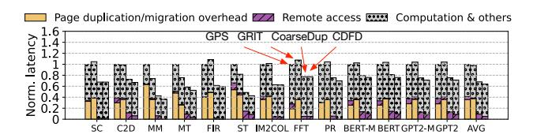
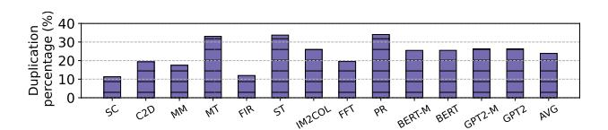
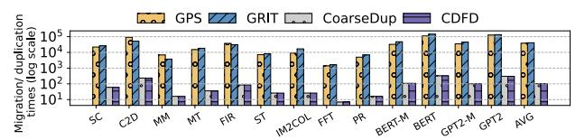

# *A. End-to-End Performance*

Figure 17 displays the normalized end-to-end performance across two related works and one ablation setting. Our approach yields performance improvements of 66%, 65% and 8% over GPS, GRIT and CoarseDup, respectively. These results underscore our method's effectiveness in optimizing page duplication strategies and improving overall performance.

Fig. 17. End-to-end performance results relative to GPS

These performance gains primarily stem from our design's ability to reduce duplication overhead by duplicating large chunks of data at once, rather than issuing frequent small migrations. For example, in the FIR benchmark, our method outperforms GRIT and GPS by 67% and 82%, respectively, while reducing duplication overhead by more than 99%. FIR shows a spatial locality access pattern, where coarse duplication amortizes the duplication cost and avoids repeated transfers

#### B. Detailed Analysis

Fig. 18. Performance breakdown normalized to GPS

1) Performance Breakdown: Figure 18 provides a detailed breakdown of each method, where remote access overhead represents the execution time incurred by remote memory accesses. GPS suffers from significant duplication overheads (37% on average) due to its fine-grained approach, while still leaving 3% of execution time to remote accesses. GRIT attempts to reduce remote accesses through additional duplications and migrations, but this increases the costs even further (38% of time). CoarseDup, which duplicates at a large granularity, reduces duplication overhead but introduces high remote access overhead (11%) because many unnecessary pages are duplicated and subsequently updated. In contrast, CDFD first leverages coarse-grained duplication to maximize bandwidth utilization and minimize transfer overhead, and then applies fine-grained deduplication to reduce unnecessary updates. As a result, CDFD reduces the combined overhead of migration, duplication and remote accesses by 92% compared to GPS, 92% compared to GRIT, and 58% compared to CoarseDup.

Fig. 19. The percentage of different duplicate page sizes in CDFD

- 2) Duplicate page percentage: Figure 19 presents the distribution of duplicate page sizes in CDFD. On average, 32 MB pages account for about 91% of duplicate pages and the presence of 2 MB (8%) and 64 KB (1%) pages demonstrates the role of the fine-grained deduplication later phase in selectively mitigating the side effects of coarse-grained duplication. For example, in ST, intensive write synchronization triggers more deduplication, increasing the share of 2 MB pages to around 20%. This adaptive distribution demonstrates that CDFD successfully balances coarse duplication with fine-grained adjustments.
- 3) Duplication ratio: The duplication ratio represents the percentage of duplicated pages in DRAM. Figure 20 illustrates the duplication ratio of CDFD. On average, CDFD maintains a duplication ratio of about 24%, effectively balancing the benefits of shared data locality with the cost of unnecessary remote updates. For benchmarks with a high degree of

Fig. 20. Average duplication percentage relative to memory footprint

data sharing, such as ST, PR, and MT, the ratio approaches 20–30%, reflecting the effectiveness of the coarse-grained duplication-first phase in capturing widely accessed pages. Conversely, applications like FIR exhibit much lower ratios, as most of their pages are private rather than shared; in this case, CDFD's fine-grained deduplication ensures that duplication overhead remains limited. These results confirm that the two-phase design adapts to diverse access patterns: coarse-grained duplication maximizes local accesses when sharing is high, while fine-grained deduplication prevents wasteful duplication when sharing is low.

Fig. 21. Migration / Duplication times in log scale

- 4) Migration / Duplication times: Figure 21 shows the total number of migrations and duplications across all methods. Performance is strongly correlated with the total number of migrations/duplications. By prioritizing coarse-grained duplication, CDFD drastically reduces transfer frequency and associated overheads, achieving an average reduction of over 99% compared to GPS and GRIT.
- 5) Coherence Traffic: To quantify the benefits and overhead of maintaining coherence for coarse-grained duplicated pages across GPUs, we measure both the total coherence traffic (i.e., the number of coherence broadcasts) and the useless coherence traffic for each duplicated 32 MB page, from its initial duplication until it is split into 1 MB pages or until program termination. A coherence broadcast is classified as useless if none of the duplicated pages on other GPUs that contain the broadcasted cache line access the updated cache line before the next broadcast to the same cache line or before eviction of the page containing that cache line.

Table IV reports the average total and useless broadcast counts per duplicated 32 MB page in CDFD. On average, each 32 MB page incurs 21,565 total coherence broadcasts, of which 6,844 are classified as useless. Thus, over 68% of the coherence traffic is useful. This efficiency arises because CDFD promptly deduplicates pages that experience more coherence updates than local accesses, limiting useless coherence traffic.

6) Power Overhead: We model the main additional power consumption of the CDFD design as follows. We use CACTI [40] at 32 nm to estimate the energy consumption

Fig. 22. End-to-end performance results relative to GPS under (a) 2.5× memory footprint (b) 3.0× memory footprint

TABLE IV
AVERAGE BROADCAST COUNTS FOR DUPLICATED 32 MB PAGES

|         | SC    | C2D   | MM     | MT    | FIR    | ST    | IM2COL |
|---------|-------|-------|--------|-------|--------|-------|--------|
| Total   | 10670 | 20987 | 10836  | 16365 | 13271  | 58770 | 45934  |
| Useless | 740   | 3576  | 2236   | 9027  | 894    | 9826  | 10829  |
|         | FFT   | PR    | BERT-M | BERT  | GPT2-M | GPT-2 | AVG    |
| Total   | 11007 | 9544  | 11281  | 45110 | 6651   | 19921 | 21565  |
| Useless | 11007 | 7825  | 5253   | 21001 | 1700   | 5061  | 6844   |

of the Access Count Monitor and Candidate Deduplication Buffer, which is 0.00998 nJ per access. The total energy consumption is calculated by multiplying the total number of accesses by the energy per access. For NVLink-related operations, we use the average energy consumption reported by NVIDIA [29], which is 1.3 pJ per bit. This value is used to model the energy consumption of coherence broadcasts caused by writes on duplicated pages as well as page duplication overhead, based on the total volume of transferred data. The additional average power is calculated by dividing the additional energy by the program execution time.

TABLE V ADDITIONAL POWER OVERHEAD

| Application Name                                                                                                                          | SC                            | C2D                           | MM                    | MT                  | FIR                   | ST                  | IM2COL                       |
|-------------------------------------------------------------------------------------------------------------------------------------------|-------------------------------|-------------------------------|-----------------------|---------------------|-----------------------|---------------------|------------------------------|
| Access Count Monitor and                                                                                                                  |                               |                               |                       |                     |                       |                     |                              |
| Candidate Deduplication Buffer (µJ)                                                                                                       | 22.0                          | 44.7                          | 29.7                  | 2.07                | 45.6                  | 14.7                | 13.4                         |
| Duplication (mJ)                                                                                                                          | 20.9                          | 81.7                          | 5.58                  | 12.6                | 29.7                  | 9.07                | 9.07                         |
| Coherence Broadcast (mJ)                                                                                                                  | 0.43                          | 3.27                          | 0.12                  | 0.39                | 0.75                  | 1.02                | 0.79                         |
| CDFD Average Power Increase (Watt)                                                                                                        | 10.91                         | 13.35                         | 0.94                  | 3.58                | 13.61                 | 0.72                | 3.73                         |
| CoarseDup Coherence Broadcast (mJ)                                                                                                        | 0.43                          | 5.83                          | 5.03                  | 1.20                | 4.69                  | 12.48               | 0.79                         |
| CoarseDup Average Power Increase (Watt)                                                                                                   | 10.90                         | 13.16                         | 1.48                  | 3.54                | 14.89                 | 1.27                | 3.73                         |
|                                                                                                                                           |                               |                               |                       |                     |                       |                     |                              |
| Application Name                                                                                                                          | FFT                           |                               | BERT-M                |                     |                       | GPT-2               | AVG                          |
| Application Name Access Count Monitor and                                                                                              |                               |                               | BERT-M                |                     |                       | GPT-2               |                              |
|                                                                                                                                           | FFT                           |                               | <b>BERT-M</b> 0.613   |                     |                       | GPT-2 1.49       |                              |
| Access Count Monitor and                                                                                                                  | FFT                           | PR                            |                       | BERT                | GPT2-M                |                     | AVG                          |
| Access Count Monitor and Candidate Deduplication Buffer (µJ) Duplication (mJ) Coherence Broadcast (mJ)                                    | <b>FFT</b> 0.92               | PR 0.613                   | 0.613                 | 12.6                | <b>GPT2-M</b> 12.6 | 1.49                | 15.5 36.0 1.69         |
| Access Count Monitor and Candidate Deduplication Buffer (μJ) Duplication (mJ) Coherence Broadcast (mJ) CDFD Average Power Increase (Watt) | 0.92 2.44 0.05 10.75 | 0.613 5.58 0.10 0.11 | 0.613 37.7         | 12.6 113         | 12.6 35.2          | 1.49                | 15.5 36.0 1.69 5.58 |
| Access Count Monitor and Candidate Deduplication Buffer (µJ) Duplication (mJ) Coherence Broadcast (mJ)                                    | 0.92 2.44 0.05 10.75 | PR 0.613 5.58 0.10   | 0.613 37.7 0.81 | 12.6 113 9.73 | 12.6 35.2 0.45  | 1.49 106 4.02 | 15.5 36.0 1.69         |

Table V reports the additional energy consumption and average power overhead introduced by the CoarseDup and CDFD design over the entire benchmark execution. On average, CDFD incurs an additional 5.58 W of power, while CoarseDup incurs an additional 5.74 W of power. Page duplication accounts for the majority of the additional energy consumption and contributes most significantly to the power overhead. Benchmarks such as BERT and C2D exhibit intensive page sharing across GPUs, which leads to higher page duplication and therefore greater power overhead. In contrast, benchmarks such as FFT and PR share only a small number of pages across GPUs, resulting in fewer duplications and correspondingly lower additional power consumption.

#### C. Sensitive Study

1) Evaluation Using Larger Memory Footprints: To evaluate the robustness of CDFD under larger memory footprints, including cases where application memory demand exceeds total physical GPU memory, we evaluate CDFD at  $2.5\times$  and  $3\times$  memory footprints. We induce memory oversubscription by scaling the input sizes of applications, following prior work [8], [43]. For these workloads, memory footprint increases approximately proportionally with input size. We measure the actual memory footprint of programs after scaling the input sizes. At  $2.5\times$  inputs, four additional benchmarks (SC, MT, FIR, PR) exceed the total physical GPU memory compared to the default  $(1\times)$  configuration. At  $3\times$  inputs, one more benchmark (C2D) exceeds GPU memory compared to the  $2.5\times$  configuration.

Figure 22 (a) presents the results for the  $2.5\times$  memory footprint. On average, CDFD outperforms GPS, GRIT, and CoarseDup by 63%, 58%, and 13%, respectively. These results indicate that CDFD remains effective under increased memory pressure and highlight the benefits of leveraging coarsegrained duplication. Figure 22 (b) shows the results for the  $3\times$  memory footprint. On average, CDFD surpasses GPS, GRIT, and CoarseDup by 55%, 53%, and 21%, respectively. The consistent performance gains demonstrate that CDFD maintains strong efficiency under extreme memory pressure and underscore the advantages of its extended design beyond CoarseDup.

Fig. 23. Average performance with 8, 16, and 32 GPUs relative to GPS

2) Performance with Different Numbers of GPUs: We evaluate CDFD using systems equipped with 8, 16 and 32 GPUs to demonstrate our design's generality. We proportionally increase the workload size to scale up to 2, 4 and 8 [43]. As shown in Figure 23, CDFD achieves significant performance improvements, 66%, 65% and 8% over GPS, GRIT and CoarseDup, respectively, in the 8-GPU configuration. In the 16-GPU setup, the gains remain substantial at 66%, 64% and 8%, respectively. In the 32-GPU setup, CDFD still outperforms other methods, 66%, 66% and 8% over GPS, GRIT and CoarseDup. These results demonstrate CDFD's effectiveness across environments with more GPUs.

# *A. End-to-End Performance*

Figure 17 displays the normalized end-to-end performance across two related works and one ablation setting. Our approach yields performance improvements of 66%, 65% and 8% over GPS, GRIT and CoarseDup, respectively. These results underscore our method's effectiveness in optimizing page duplication strategies and improving overall performance.

Fig. 17. End-to-end performance results relative to GPS

These performance gains primarily stem from our design's ability to reduce duplication overhead by duplicating large chunks of data at once, rather than issuing frequent small migrations. For example, in the FIR benchmark, our method outperforms GRIT and GPS by 67% and 82%, respectively, while reducing duplication overhead by more than 99%. FIR shows a spatial locality access pattern, where coarse duplication amortizes the duplication cost and avoids repeated transfers

#### B. Detailed Analysis

Fig. 18. Performance breakdown normalized to GPS

1) Performance Breakdown: Figure 18 provides a detailed breakdown of each method, where remote access overhead represents the execution time incurred by remote memory accesses. GPS suffers from significant duplication overheads (37% on average) due to its fine-grained approach, while still leaving 3% of execution time to remote accesses. GRIT attempts to reduce remote accesses through additional duplications and migrations, but this increases the costs even further (38% of time). CoarseDup, which duplicates at a large granularity, reduces duplication overhead but introduces high remote access overhead (11%) because many unnecessary pages are duplicated and subsequently updated. In contrast, CDFD first leverages coarse-grained duplication to maximize bandwidth utilization and minimize transfer overhead, and then applies fine-grained deduplication to reduce unnecessary updates. As a result, CDFD reduces the combined overhead of migration, duplication and remote accesses by 92% compared to GPS, 92% compared to GRIT, and 58% compared to CoarseDup.

Fig. 19. The percentage of different duplicate page sizes in CDFD

- 2) Duplicate page percentage: Figure 19 presents the distribution of duplicate page sizes in CDFD. On average, 32 MB pages account for about 91% of duplicate pages and the presence of 2 MB (8%) and 64 KB (1%) pages demonstrates the role of the fine-grained deduplication later phase in selectively mitigating the side effects of coarse-grained duplication. For example, in ST, intensive write synchronization triggers more deduplication, increasing the share of 2 MB pages to around 20%. This adaptive distribution demonstrates that CDFD successfully balances coarse duplication with fine-grained adjustments.
- 3) Duplication ratio: The duplication ratio represents the percentage of duplicated pages in DRAM. Figure 20 illustrates the duplication ratio of CDFD. On average, CDFD maintains a duplication ratio of about 24%, effectively balancing the benefits of shared data locality with the cost of unnecessary remote updates. For benchmarks with a high degree of

Fig. 20. Average duplication percentage relative to memory footprint

data sharing, such as ST, PR, and MT, the ratio approaches 20–30%, reflecting the effectiveness of the coarse-grained duplication-first phase in capturing widely accessed pages. Conversely, applications like FIR exhibit much lower ratios, as most of their pages are private rather than shared; in this case, CDFD's fine-grained deduplication ensures that duplication overhead remains limited. These results confirm that the two-phase design adapts to diverse access patterns: coarse-grained duplication maximizes local accesses when sharing is high, while fine-grained deduplication prevents wasteful duplication when sharing is low.

Fig. 21. Migration / Duplication times in log scale

- 4) Migration / Duplication times: Figure 21 shows the total number of migrations and duplications across all methods. Performance is strongly correlated with the total number of migrations/duplications. By prioritizing coarse-grained duplication, CDFD drastically reduces transfer frequency and associated overheads, achieving an average reduction of over 99% compared to GPS and GRIT.
- 5) Coherence Traffic: To quantify the benefits and overhead of maintaining coherence for coarse-grained duplicated pages across GPUs, we measure both the total coherence traffic (i.e., the number of coherence broadcasts) and the useless coherence traffic for each duplicated 32 MB page, from its initial duplication until it is split into 1 MB pages or until program termination. A coherence broadcast is classified as useless if none of the duplicated pages on other GPUs that contain the broadcasted cache line access the updated cache line before the next broadcast to the same cache line or before eviction of the page containing that cache line.

Table IV reports the average total and useless broadcast counts per duplicated 32 MB page in CDFD. On average, each 32 MB page incurs 21,565 total coherence broadcasts, of which 6,844 are classified as useless. Thus, over 68% of the coherence traffic is useful. This efficiency arises because CDFD promptly deduplicates pages that experience more coherence updates than local accesses, limiting useless coherence traffic.

6) Power Overhead: We model the main additional power consumption of the CDFD design as follows. We use CACTI [40] at 32 nm to estimate the energy consumption

Fig. 22. End-to-end performance results relative to GPS under (a) 2.5× memory footprint (b) 3.0× memory footprint

TABLE IV
AVERAGE BROADCAST COUNTS FOR DUPLICATED 32 MB PAGES

|         | SC    | C2D   | MM     | MT    | FIR    | ST    | IM2COL |
|---------|-------|-------|--------|-------|--------|-------|--------|
| Total   | 10670 | 20987 | 10836  | 16365 | 13271  | 58770 | 45934  |
| Useless | 740   | 3576  | 2236   | 9027  | 894    | 9826  | 10829  |
|         | FFT   | PR    | BERT-M | BERT  | GPT2-M | GPT-2 | AVG    |
| Total   | 11007 | 9544  | 11281  | 45110 | 6651   | 19921 | 21565  |
| Useless | 11007 | 7825  | 5253   | 21001 | 1700   | 5061  | 6844   |

of the Access Count Monitor and Candidate Deduplication Buffer, which is 0.00998 nJ per access. The total energy consumption is calculated by multiplying the total number of accesses by the energy per access. For NVLink-related operations, we use the average energy consumption reported by NVIDIA [29], which is 1.3 pJ per bit. This value is used to model the energy consumption of coherence broadcasts caused by writes on duplicated pages as well as page duplication overhead, based on the total volume of transferred data. The additional average power is calculated by dividing the additional energy by the program execution time.

TABLE V ADDITIONAL POWER OVERHEAD

| Application Name                                                                                                                          | SC                            | C2D                           | MM                    | MT                  | FIR                   | ST                  | IM2COL                       |
|-------------------------------------------------------------------------------------------------------------------------------------------|-------------------------------|-------------------------------|-----------------------|---------------------|-----------------------|---------------------|------------------------------|
| Access Count Monitor and                                                                                                                  |                               |                               |                       |                     |                       |                     |                              |
| Candidate Deduplication Buffer (µJ)                                                                                                       | 22.0                          | 44.7                          | 29.7                  | 2.07                | 45.6                  | 14.7                | 13.4                         |
| Duplication (mJ)                                                                                                                          | 20.9                          | 81.7                          | 5.58                  | 12.6                | 29.7                  | 9.07                | 9.07                         |
| Coherence Broadcast (mJ)                                                                                                                  | 0.43                          | 3.27                          | 0.12                  | 0.39                | 0.75                  | 1.02                | 0.79                         |
| CDFD Average Power Increase (Watt)                                                                                                        | 10.91                         | 13.35                         | 0.94                  | 3.58                | 13.61                 | 0.72                | 3.73                         |
| CoarseDup Coherence Broadcast (mJ)                                                                                                        | 0.43                          | 5.83                          | 5.03                  | 1.20                | 4.69                  | 12.48               | 0.79                         |
| CoarseDup Average Power Increase (Watt)                                                                                                   | 10.90                         | 13.16                         | 1.48                  | 3.54                | 14.89                 | 1.27                | 3.73                         |
|                                                                                                                                           |                               |                               |                       |                     |                       |                     |                              |
| Application Name                                                                                                                          | FFT                           |                               | BERT-M                |                     |                       | GPT-2               | AVG                          |
| Application Name Access Count Monitor and                                                                                              |                               |                               | BERT-M                |                     |                       | GPT-2               |                              |
|                                                                                                                                           | FFT                           |                               | <b>BERT-M</b> 0.613   |                     |                       | GPT-2 1.49       |                              |
| Access Count Monitor and                                                                                                                  | FFT                           | PR                            |                       | BERT                | GPT2-M                |                     | AVG                          |
| Access Count Monitor and Candidate Deduplication Buffer (µJ) Duplication (mJ) Coherence Broadcast (mJ)                                    | <b>FFT</b> 0.92               | PR 0.613                   | 0.613                 | 12.6                | <b>GPT2-M</b> 12.6 | 1.49                | 15.5 36.0 1.69         |
| Access Count Monitor and Candidate Deduplication Buffer (μJ) Duplication (mJ) Coherence Broadcast (mJ) CDFD Average Power Increase (Watt) | 0.92 2.44 0.05 10.75 | 0.613 5.58 0.10 0.11 | 0.613 37.7         | 12.6 113         | 12.6 35.2          | 1.49                | 15.5 36.0 1.69 5.58 |
| Access Count Monitor and Candidate Deduplication Buffer (µJ) Duplication (mJ) Coherence Broadcast (mJ)                                    | 0.92 2.44 0.05 10.75 | PR 0.613 5.58 0.10   | 0.613 37.7 0.81 | 12.6 113 9.73 | 12.6 35.2 0.45  | 1.49 106 4.02 | 15.5 36.0 1.69         |

Table V reports the additional energy consumption and average power overhead introduced by the CoarseDup and CDFD design over the entire benchmark execution. On average, CDFD incurs an additional 5.58 W of power, while CoarseDup incurs an additional 5.74 W of power. Page duplication accounts for the majority of the additional energy consumption and contributes most significantly to the power overhead. Benchmarks such as BERT and C2D exhibit intensive page sharing across GPUs, which leads to higher page duplication and therefore greater power overhead. In contrast, benchmarks such as FFT and PR share only a small number of pages across GPUs, resulting in fewer duplications and correspondingly lower additional power consumption.

#### C. Sensitive Study

1) Evaluation Using Larger Memory Footprints: To evaluate the robustness of CDFD under larger memory footprints, including cases where application memory demand exceeds total physical GPU memory, we evaluate CDFD at  $2.5\times$  and  $3\times$  memory footprints. We induce memory oversubscription by scaling the input sizes of applications, following prior work [8], [43]. For these workloads, memory footprint increases approximately proportionally with input size. We measure the actual memory footprint of programs after scaling the input sizes. At  $2.5\times$  inputs, four additional benchmarks (SC, MT, FIR, PR) exceed the total physical GPU memory compared to the default  $(1\times)$  configuration. At  $3\times$  inputs, one more benchmark (C2D) exceeds GPU memory compared to the  $2.5\times$  configuration.

Figure 22 (a) presents the results for the  $2.5\times$  memory footprint. On average, CDFD outperforms GPS, GRIT, and CoarseDup by 63%, 58%, and 13%, respectively. These results indicate that CDFD remains effective under increased memory pressure and highlight the benefits of leveraging coarsegrained duplication. Figure 22 (b) shows the results for the  $3\times$  memory footprint. On average, CDFD surpasses GPS, GRIT, and CoarseDup by 55%, 53%, and 21%, respectively. The consistent performance gains demonstrate that CDFD maintains strong efficiency under extreme memory pressure and underscore the advantages of its extended design beyond CoarseDup.

Fig. 23. Average performance with 8, 16, and 32 GPUs relative to GPS

2) Performance with Different Numbers of GPUs: We evaluate CDFD using systems equipped with 8, 16 and 32 GPUs to demonstrate our design's generality. We proportionally increase the workload size to scale up to 2, 4 and 8 [43]. As shown in Figure 23, CDFD achieves significant performance improvements, 66%, 65% and 8% over GPS, GRIT and CoarseDup, respectively, in the 8-GPU configuration. In the 16-GPU setup, the gains remain substantial at 66%, 64% and 8%, respectively. In the 32-GPU setup, CDFD still outperforms other methods, 66%, 66% and 8% over GPS, GRIT and CoarseDup. These results demonstrate CDFD's effectiveness across environments with more GPUs.

