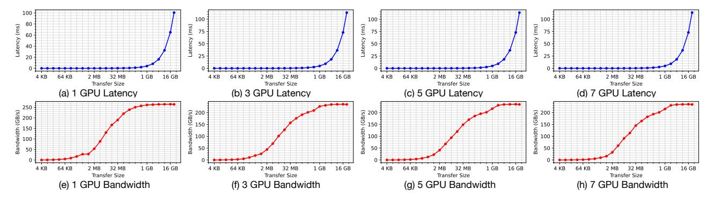
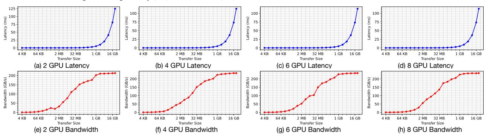

# *A. Performance Characterization of NVLink 3.0*

Experiment Setup. We conduct experiments on a two-socket server equipped with eight NVIDIA A100 GPUs (80 GB, SXM4), 1,800 GB of CPU memory, and a 20 TB SSD. The system is configured as an NVIDIA DGX A100 platform interconnected via NVLink 3.0 (Driver Version: 570.148.08, CUDA Version: 12.8). Each NVLink has 300GB/s theoretical peak bandwidth. To evaluate NVLink performance, we utilize the NVIDIA Collective Communications Library (NCCL) [32], which provides inter-GPU communication primitives. NCCL supports five primitives: AllReduce, Broadcast, Reduce, AllGather, and ReduceScatter. We evaluate each primitive across varying data transfer sizes and GPU counts multiple times, presenting a subset of average results due to space limitations.

*1) One-to-N communication:* The NCCL Broadcast operation concurrently copies a buffer from one GPU to N receiver GPUs (where N=1 to 7), forming a one-to-N communication pattern. Figure 2 presents the NCCL Broadcast results for varying transfer sizes and numbers of receiver GPUs. Figures 2 (a) and (e) illustrate the average latency per broadcast operation and bandwidth with one receiver GPU, respectively. Despite the theoretical peak bandwidth of approximately 300 GB/s per NVLink, only large transfers (equal to or larger than 1 GB) approach high bandwidth utilization (around 262 GB/s). Moreover, latency measurements reveal that transferring 4KB incurs latency comparable to transferring 32MB, demonstrating a nonlinear relationship between transfer size and latency.

Figures 2 (b–d) and (f–h) illustrate results obtained with varying numbers of receiver GPUs, which are consistent with those for a single receiver GPU. However, when multiple receiver GPUs are involved, NCCL Broadcast operations may introduce contention at the sender GPU. We observe that the latency for 7 concurrent receiver GPUs increases on average by only 13.27% compared to a single receiver GPU, indicating limited intra-link contention.

We also vary the source GPU (from GPU 0 to GPU 7) as well as combinations of different receiver GPUs, observing similar results across configurations. In addition to evaluating one-to-N communication using the NCCL Broadcast primitive, we evaluate N-to-one communication using the NCCL Reduce primitive, which exhibits results similar to those of NCCL Broadcast.

Takeaway #1: NVLink 3.0 exhibits nonlinear latency-size scaling; transferring 4KB of data incurs latency similar to transferring 32MB, indicating a negligible overhead reduction with smaller transfers.

Takeaway #2: NVLink 3.0 exhibits negligible intra-link contention; concurrently broadcasting data to seven GPUs incurs only a 13.27% latency increase compared to broadcasting to a single GPU.

*2) All-to-All communication:* The NCCL AllReduce operation involves N GPUs, each having a buffer that is concurrently transferred to all other GPUs, forming an N-to-N communication pattern. Figure 3 presents the average latency and per-GPU bandwidth of NCCL AllReduce across varying transfer sizes and GPU counts. The results similarly exhibit nonlinear latency-size scaling. Given that NVLink 3.0 employs

Fig. 2. Average latency (a-d) and bandwidth (e-h) for NCCL Broadcast with 1, 3, 5, and 7 receiver GPUs

Fig. 3. Average latency (a-d) and per GPU bandwidth (e-h) for NCCL AllReduce with 2, 4, 6, 8 receiver GPUs

a crossbar to handle simultaneous requests from multiple GPUs, potential contention could arise with increased concurrent requests. However, our observations show that using 8 GPUs reduces average latency by 9.47% and increases average per-GPU bandwidth by 12.41%, compared to using only 2 GPUs. We attribute this improved performance primarily to the NVLink 3.0 crossbar scheduling algorithm. Regardless, the observed inter-link contention remains negligible across configurations from 2 to 8 GPUs.

**Takeaway #3**: NVLink 3.0 exhibits negligible inter-link contention across configurations from 2 to 8 GPUs.

Fig. 4. The aggregated bandwidth of 2, 4, 6, 8 GPUs using NCCL AllReduce

We further report the aggregated bandwidth obtained using NCCL AllReduce, as shown in Figure 4. NVLink 3.0 en-

ables efficient communication among 8 GPUs, achieving an aggregate bandwidth of up to 1878 GB/s. However, this high bandwidth utilization depends significantly on the data transfer size. Existing page migration and duplication methods employ fine-grained transfers (4KB or 64KB), which, as indicated in Figure 4, achieve only 1.12 GB/s and 17.12 GB/s respectively when using all 8 GPUs.

**Takeaway #4**: NVLink 3.0 provides ample bandwidth headroom for coarse-grained page migration and duplication.

B. Nonlinear Latency-Size Scaling Analysis of NVLink 3.0 using Microbenchmarks

To evaluate whether the nonlinear latency-size scaling behavior persists under UVM that incorporates the full UVM driver overhead, we implement a two-GPU microbenchmark using cudaMemPrefetchAsync(). According to NVIDIA documentation [33], this API executes the full UVM migration path to transfer a memory region from one CPU/GPU to another CPU/GPU, including UVM driver handling and queuing, page table updates on both CPUs and GPUs, and TLB invalidations. Therefore, it captures the full software and MMU overhead associated with UVM memory migration.

This microbenchmark allocates a managed memory region on one GPU using <code>cudaMallocManaged()</code>, with allocation sizes ranging from 4 KB to 32 GB across different runs. After allocation, we invoke <code>cudaMemPrefetchAsync()</code> on the entire region, followed by <code>cudaDeviceSynchronize()</code>, to migrate

the memory region from the source GPU to a target GPU. Migration latency is measured from the prefetch call to synchronization, capturing the full UVM migration cost. Each configuration includes a brief warm-up phase, and results report the average latency and effective bandwidth across multiple runs.

Fig. 5. Average latency (a) and bandwidth (b) results under UVM using cudaMemPrefetchAsync() between two GPUs interconnected via NVLink 3.0

The microbenchmark results obtained using cudaMem-PrefetchAsync() are presented in Figure 5. The results demonstrate nonlinear latency–size scaling when UVM driver overhead, page table updates, and TLB invalidations are included. The measured bandwidth is lower than that of NCCL due to these additional overheads.

Takeaway #5: The nonlinear latency–size scaling behavior persists even when accounting for UVM overhead.

# *A. Performance Characterization of NVLink 3.0*

Experiment Setup. We conduct experiments on a two-socket server equipped with eight NVIDIA A100 GPUs (80 GB, SXM4), 1,800 GB of CPU memory, and a 20 TB SSD. The system is configured as an NVIDIA DGX A100 platform interconnected via NVLink 3.0 (Driver Version: 570.148.08, CUDA Version: 12.8). Each NVLink has 300GB/s theoretical peak bandwidth. To evaluate NVLink performance, we utilize the NVIDIA Collective Communications Library (NCCL) [32], which provides inter-GPU communication primitives. NCCL supports five primitives: AllReduce, Broadcast, Reduce, AllGather, and ReduceScatter. We evaluate each primitive across varying data transfer sizes and GPU counts multiple times, presenting a subset of average results due to space limitations.

*1) One-to-N communication:* The NCCL Broadcast operation concurrently copies a buffer from one GPU to N receiver GPUs (where N=1 to 7), forming a one-to-N communication pattern. Figure 2 presents the NCCL Broadcast results for varying transfer sizes and numbers of receiver GPUs. Figures 2 (a) and (e) illustrate the average latency per broadcast operation and bandwidth with one receiver GPU, respectively. Despite the theoretical peak bandwidth of approximately 300 GB/s per NVLink, only large transfers (equal to or larger than 1 GB) approach high bandwidth utilization (around 262 GB/s). Moreover, latency measurements reveal that transferring 4KB incurs latency comparable to transferring 32MB, demonstrating a nonlinear relationship between transfer size and latency.

Figures 2 (b–d) and (f–h) illustrate results obtained with varying numbers of receiver GPUs, which are consistent with those for a single receiver GPU. However, when multiple receiver GPUs are involved, NCCL Broadcast operations may introduce contention at the sender GPU. We observe that the latency for 7 concurrent receiver GPUs increases on average by only 13.27% compared to a single receiver GPU, indicating limited intra-link contention.

We also vary the source GPU (from GPU 0 to GPU 7) as well as combinations of different receiver GPUs, observing similar results across configurations. In addition to evaluating one-to-N communication using the NCCL Broadcast primitive, we evaluate N-to-one communication using the NCCL Reduce primitive, which exhibits results similar to those of NCCL Broadcast.

Takeaway #1: NVLink 3.0 exhibits nonlinear latency-size scaling; transferring 4KB of data incurs latency similar to transferring 32MB, indicating a negligible overhead reduction with smaller transfers.

Takeaway #2: NVLink 3.0 exhibits negligible intra-link contention; concurrently broadcasting data to seven GPUs incurs only a 13.27% latency increase compared to broadcasting to a single GPU.

*2) All-to-All communication:* The NCCL AllReduce operation involves N GPUs, each having a buffer that is concurrently transferred to all other GPUs, forming an N-to-N communication pattern. Figure 3 presents the average latency and per-GPU bandwidth of NCCL AllReduce across varying transfer sizes and GPU counts. The results similarly exhibit nonlinear latency-size scaling. Given that NVLink 3.0 employs

Fig. 2. Average latency (a-d) and bandwidth (e-h) for NCCL Broadcast with 1, 3, 5, and 7 receiver GPUs

Fig. 3. Average latency (a-d) and per GPU bandwidth (e-h) for NCCL AllReduce with 2, 4, 6, 8 receiver GPUs

a crossbar to handle simultaneous requests from multiple GPUs, potential contention could arise with increased concurrent requests. However, our observations show that using 8 GPUs reduces average latency by 9.47% and increases average per-GPU bandwidth by 12.41%, compared to using only 2 GPUs. We attribute this improved performance primarily to the NVLink 3.0 crossbar scheduling algorithm. Regardless, the observed inter-link contention remains negligible across configurations from 2 to 8 GPUs.

**Takeaway #3**: NVLink 3.0 exhibits negligible inter-link contention across configurations from 2 to 8 GPUs.

Fig. 4. The aggregated bandwidth of 2, 4, 6, 8 GPUs using NCCL AllReduce

We further report the aggregated bandwidth obtained using NCCL AllReduce, as shown in Figure 4. NVLink 3.0 en-

ables efficient communication among 8 GPUs, achieving an aggregate bandwidth of up to 1878 GB/s. However, this high bandwidth utilization depends significantly on the data transfer size. Existing page migration and duplication methods employ fine-grained transfers (4KB or 64KB), which, as indicated in Figure 4, achieve only 1.12 GB/s and 17.12 GB/s respectively when using all 8 GPUs.

**Takeaway #4**: NVLink 3.0 provides ample bandwidth headroom for coarse-grained page migration and duplication.

B. Nonlinear Latency-Size Scaling Analysis of NVLink 3.0 using Microbenchmarks

To evaluate whether the nonlinear latency-size scaling behavior persists under UVM that incorporates the full UVM driver overhead, we implement a two-GPU microbenchmark using cudaMemPrefetchAsync(). According to NVIDIA documentation [33], this API executes the full UVM migration path to transfer a memory region from one CPU/GPU to another CPU/GPU, including UVM driver handling and queuing, page table updates on both CPUs and GPUs, and TLB invalidations. Therefore, it captures the full software and MMU overhead associated with UVM memory migration.

This microbenchmark allocates a managed memory region on one GPU using <code>cudaMallocManaged()</code>, with allocation sizes ranging from 4 KB to 32 GB across different runs. After allocation, we invoke <code>cudaMemPrefetchAsync()</code> on the entire region, followed by <code>cudaDeviceSynchronize()</code>, to migrate

the memory region from the source GPU to a target GPU. Migration latency is measured from the prefetch call to synchronization, capturing the full UVM migration cost. Each configuration includes a brief warm-up phase, and results report the average latency and effective bandwidth across multiple runs.

Fig. 5. Average latency (a) and bandwidth (b) results under UVM using cudaMemPrefetchAsync() between two GPUs interconnected via NVLink 3.0

The microbenchmark results obtained using cudaMem-PrefetchAsync() are presented in Figure 5. The results demonstrate nonlinear latency–size scaling when UVM driver overhead, page table updates, and TLB invalidations are included. The measured bandwidth is lower than that of NCCL due to these additional overheads.

Takeaway #5: The nonlinear latency–size scaling behavior persists even when accounting for UVM overhead.

