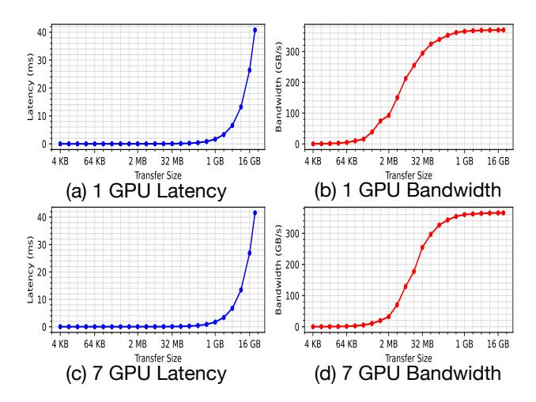
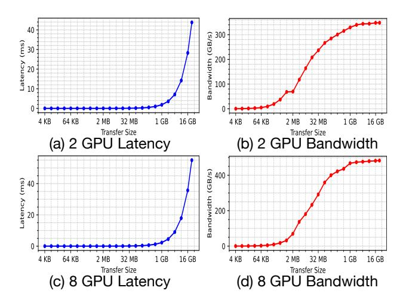

# *C. Performance Characterization of NVLink 4.0*

Experiment Setup: To further validate our findings on NVLink 4.0, we conduct experiments on a two-socket server equipped with eight NVIDIA H100 GPUs (80 GB, SXM5), 1,800 GB of CPU memory, and a 22 TB SSD. The system is configured as an NVIDIA DGX H100 via NVLink 4.0 (Driver Version: 570.195.03, CUDA Version: 12.8). The theoretical peak bandwidth of NVLink 4.0 is 450 GB/s.

Fig. 6. Average latency (a, c) and bandwidth (b, d) for NCCL Broadcast with 1 and 7 receiver GPUs in NVLink 4.0

Fig. 7. Average latency (a, c) and bandwidth (b, d) for NCCL Allreduce with 2 and 8 receiver GPUs in NVLink 4.0

Figure 6 and Figure 7 present a subset of the NVLink 4.0 bandwidth results for NCCL Broadcast and AllReduce across different transfer sizes. The results similarly exhibit nonlinear latency–size scaling. For the NCCL Broadcast workload, the latency with seven concurrent receiver GPUs increases by only 0.11% on average compared to a single receiver, indicating small intra-link contention.

Takeaway #6: NVLink 4.0 also exhibits nonlinear latency-size scaling and negligible intra-link contention.

The superiority of coarse-grained transfers on NVLink arises from two key observations. First, transfer latency is nonlinear with respect to transfer size, making larger transfers more efficient than fine-grained ones. Second, concurrent transfers introduce only limited contention on real devices, further enhancing the effectiveness of coarse-grained duplication. These observations are consistent with prior studies on earlier versions of NVLink [27]. We attribute this behavior to the pipelining and parallelism inherent in the NVLink design. Only when a sufficiently large volume of data is transferred can these mechanisms be effectively utilized, enabling the link to approach its peak bandwidth.

# *C. Performance Characterization of NVLink 4.0*

Experiment Setup: To further validate our findings on NVLink 4.0, we conduct experiments on a two-socket server equipped with eight NVIDIA H100 GPUs (80 GB, SXM5), 1,800 GB of CPU memory, and a 22 TB SSD. The system is configured as an NVIDIA DGX H100 via NVLink 4.0 (Driver Version: 570.195.03, CUDA Version: 12.8). The theoretical peak bandwidth of NVLink 4.0 is 450 GB/s.

Fig. 6. Average latency (a, c) and bandwidth (b, d) for NCCL Broadcast with 1 and 7 receiver GPUs in NVLink 4.0

Fig. 7. Average latency (a, c) and bandwidth (b, d) for NCCL Allreduce with 2 and 8 receiver GPUs in NVLink 4.0

Figure 6 and Figure 7 present a subset of the NVLink 4.0 bandwidth results for NCCL Broadcast and AllReduce across different transfer sizes. The results similarly exhibit nonlinear latency–size scaling. For the NCCL Broadcast workload, the latency with seven concurrent receiver GPUs increases by only 0.11% on average compared to a single receiver, indicating small intra-link contention.

Takeaway #6: NVLink 4.0 also exhibits nonlinear latency-size scaling and negligible intra-link contention.

The superiority of coarse-grained transfers on NVLink arises from two key observations. First, transfer latency is nonlinear with respect to transfer size, making larger transfers more efficient than fine-grained ones. Second, concurrent transfers introduce only limited contention on real devices, further enhancing the effectiveness of coarse-grained duplication. These observations are consistent with prior studies on earlier versions of NVLink [27]. We attribute this behavior to the pipelining and parallelism inherent in the NVLink design. Only when a sufficiently large volume of data is transferred can these mechanisms be effectively utilized, enabling the link to approach its peak bandwidth.

