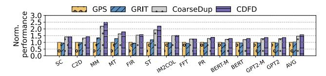

# *D. Evaluation with NVLink 4.0*

Fig. 24. End-to-end performance results under NVLink 4.0 Setting

To further demonstrate the generality of CDFD across different NVLink generations, we conduct experiments using NVLink 4.0 characterization results obtained from a real device in Section III-C, including measurements of data transfer latency from 4 KB to 32 MB payloads.

Figure 24 presents the results. CDFD achieves performance improvements of 56%, 52%, and 7% compared with GPS, GRIT, and CoarseDup, respectively. These results highlight the generality of CDFD in enhancing page duplication strategies and delivering measurable performance gains on NVLink 4.0, which provides lower latency and higher bandwidth than NVLink 3.0.

# *D. Evaluation with NVLink 4.0*

Fig. 24. End-to-end performance results under NVLink 4.0 Setting

To further demonstrate the generality of CDFD across different NVLink generations, we conduct experiments using NVLink 4.0 characterization results obtained from a real device in Section III-C, including measurements of data transfer latency from 4 KB to 32 MB payloads.

Figure 24 presents the results. CDFD achieves performance improvements of 56%, 52%, and 7% compared with GPS, GRIT, and CoarseDup, respectively. These results highlight the generality of CDFD in enhancing page duplication strategies and delivering measurable performance gains on NVLink 4.0, which provides lower latency and higher bandwidth than NVLink 3.0.

