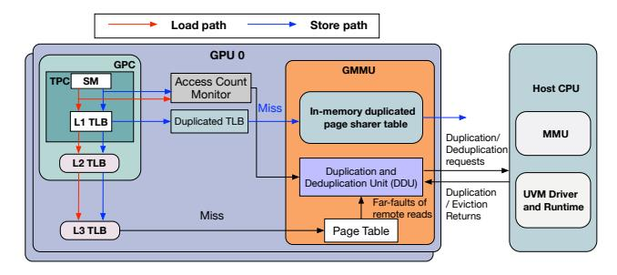
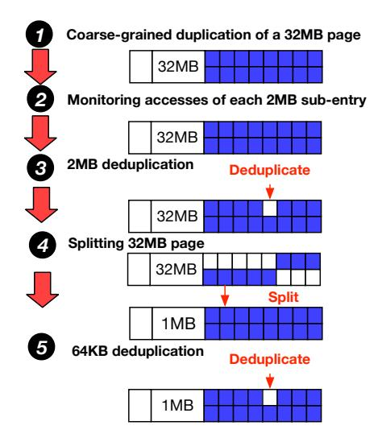
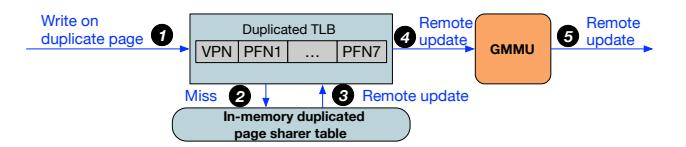
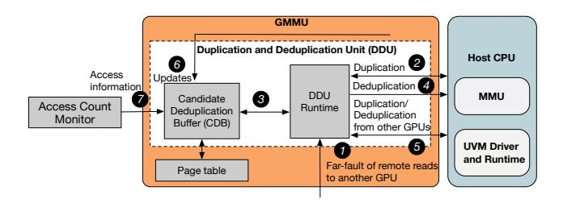
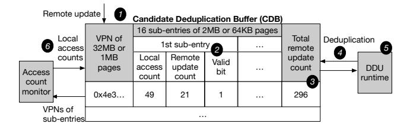
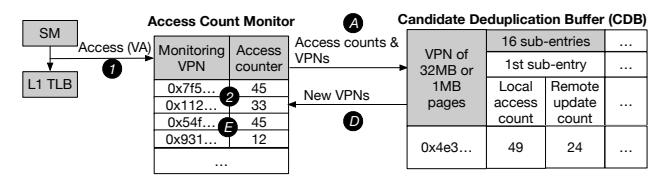

# *D. Limitations of Fine-Grained Migration and Duplication*

Our performance characterization of NVLink shows that fine-grained designs used in existing multi-GPU page migration and duplication are inefficient, due to NVLink's nonlinear latency–size scaling, negligible intra- and inter-link contention, and ample bandwidth headroom. These approaches underutilize available bandwidth and incur significant management overhead (e.g., frequent TLB invalidations) from excessive migrations and duplications.

We quantitatively evaluate these limitations using the MG-PUsim simulator [38] on a 4-GPU system with NVLink 3.0 performance characterization on two state-of-the-art methods: GRIT, a hybrid approach combining on-touch migration, access-count-based migration, and duplication; and GPS,

which exclusively employs page duplication with batched updates. Additional evaluation details are provided in Section V.

Fig. 8. Normalized breakdown

Figure 8 presents the performance breakdown for GPS and GRIT. The page duplication/migration overhead represents the critical-path latency introduced by these operations, including TLB invalidations, SM pipeline flushes, cache flushes, and data transfers. GPS incurs substantial duplication overhead, accounting for an average of 37% of total execution time. Similarly, GRIT relies on page duplication to reduce remote accesses, with duplication/migration overhead representing 38% of total execution time. Despite this, their average bandwidth utilization for page migration is only 0.1 GB/s due to the inefficiency of fine-grained transfers in fully utilizing NVLink bandwidth.

**Takeaway #7**: The fine-grained design used by existing multi-GPU page migration and duplication methods is inefficient due to underutilization of NVLink bandwidth and substantial management overhead.

## E. Accessed GPU Memory Fraction over Time

Fig. 9. The fraction of local accessed physical memory at different execution time portions

To validate that an application's working set is typically much smaller than its total physical memory in multi-GPU environments, we measure how much local memory is accessed during execution in GRIT. Figure 9 shows the fraction of local physical memory accessed over different time intervals (10 ms, 50 ms, and 100 ms). The y-axis indicates the percentage of local GPU memory accessed at least once, with each bar corresponding to a portion of the execution.

As shown, within a 100 ms interval, only a small fraction of GPU memory is accessed (about 11% on average), dropping to roughly 2% and 3% for 10 ms and 50 ms intervals, respectively. Meanwhile, 100 ms is sufficient to transfer several GB of data across GPUs. This reveals substantial underutilization of GPU memory due to the small working set. Therefore, exploiting idle memory capacity together with abundant NVLink bandwidth for coarse-grained duplication is

effective: duplication utilizes unused memory without interfering with the working set, while NVLink enables timely data exchange to keep the working set resident.

**Takeaway #8**: The working set occupies only a small fraction of GPU memory at any time, leaving substantial idle capacity. This, combined with NVLink's high bandwidth, makes coarsegrained page duplication both feasible and effective.

#### IV. DESIGN

#### A. Overview

Based on the aforementioned analysis, we propose a duplication-centric approach named CDFD (Coarse-grained Duplication First, Fine-grained Deduplication Later), consisting of two phases: (1) Coarse-grained Duplication First: Upon a GPU issuing a read request to another GPU's local memory, CDFD duplicates a coarse-grained page containing the requested data to the requesting GPU. This leverages our NVLink 3.0 performance characterization, allowing GPUs with duplicated pages to immediately benefit from efficient local memory access. (2) Fine-grained Deduplication Later: Subsequently, CDFD monitors local accesses and remote updates from other GPUs to these duplicated pages, selecting subpages whose costs exceed their benefits for fine-grained deduplication. This approach enables fine-grained adjustments to coarse-grained duplication without incurring fine-grained data transfer overhead.

Fig. 10. CDFD overview

Figure 10 presents the overview design of CDFD, including a duplicated TLB backed by a duplicated page sharer table to facilitate remote updates across GPUs, an access count monitor to track local accesses to duplicated pages, and a duplication and deduplication unit that manages page duplication and deduplication operations, performing cost-benefit analyses to identify candidate pages for fine-grained deduplication.

## B. High-level Design of CDFD

1) Balancing Duplicated Pages and Regular Pages: A side effect of the duplication-centric approach employed by CDFD is the increased memory consumption resulting from duplicated pages, as such pages occupy local memory that could otherwise be utilized by regular pages to improve overall performance.

The main idea of CDFD is to retain only those pages (regular or duplicated) whose performance benefits outweigh

their associated costs. To facilitate this approach, we introduce two runtime metrics per GPU: (1) the current duplication ratio, calculated as the total size of duplicated pages divided by the GPU local memory; and (2) the target duplication ratio, determined by CDFD to guide subsequent page management decisions.

The target duplication ratio is adaptively adjusted based on the relative benefit of duplicated versus regular pages, using the existing GPU local-page scanning mechanism for identifying Least Recently Used (LRU) pages [4]. The CDFD runtime periodically scans the first several thousand entries of the LRU list to estimate the fraction of duplicated pages, which serves as the sampled duplication ratio. If this ratio exceeds the target, indicating that duplicated pages are less beneficial, the target duplication ratio is decreased. Conversely, if the ratio is below the target, the target duplication ratio is increased. We maintain the current duplication ratio by tracking duplication and deduplication events. Specifically, the CDFD runtime updates the ratio whenever a duplication or deduplication operation is performed, reflecting the current fraction of duplicated pages in the system.

Fig. 11. Logic for handling a read to another GPU (a) or an access to a page in CPU (b) when local GPU memory is full

*2) Logic of Triggering Coarse-Grained Duplication and Fine-Grained Deduplication:* The logic for handling a remote read issued to another GPU when local GPU memory is full is illustrated in Figure 11 (a). Upon issuing a remote read request, the local GPU runtime first checks whether the current duplication ratio exceeds the target duplication ratio. If so, the GPU performs fine-grained deduplication to reduce the duplication ratio by converting duplicated pages back to regular pages, until sufficient space is available and the ratio falls below the target. It then performs coarse-grained duplication of a large page from the remote GPU, ensuring that the post-duplication current duplication ratio remains within the target bound.

If the ratio does not exceed the target, the GPU evicts LRU regular pages to create space and directly performs coarse-grained duplication, which increases the duplication ratio. Fine-grained deduplication and coarse-grained duplication form a feedback mechanism that dynamically decreases or increases the duplication ratio to maintain it within the target.

The logic for handling an access to a CPU-resident page when local GPU memory is full is illustrated in Figure 11(b). Upon receiving a far-fault for a page residing in the CPU, the local GPU runtime first checks whether the current duplication ratio exceeds the target duplication ratio. If this ratio is exceeded, the GPU initiates fine-grained deduplication within its local memory until adequate space becomes available, ensuring that after loading the regular page, the current duplication ratio remains at or below the target duplication ratio. Subsequently, regular page loading proceeds. If the ratio is not exceeded, the GPU evicts LRU regular pages until sufficient memory is freed to accommodate the new page.

Fig. 12. Workflow of fine-grained deduplication

*3) Fine-Grained Deduplication:* Leveraging the performance characterization of NVLinks, coarse-grained duplication is performed at a granularity of 32MB 1 , while finegrained deduplication is executed at granularities of either 2MB or 64KB. This design choice aligns with NVIDIA's TLB architecture, which supports multiple page sizes with subentries, including 32MB, 1MB, and 64KB [46]. Figure 12 illustrates the workflow of fine-grained deduplication. After a 32MB page finishes a coarse-grained duplication 1 , the system monitors access patterns of each 2MB sub-entry 2 . Upon triggering fine-grained deduplication, the 2MB sub-entry demonstrating the lowest performance benefit is selected for

1We choose 32 MB because one NVIDIA TLB entry supports up to a 32 MB range.

deduplication, removing this 2MB page from the GPU's local memory. Subsequent accesses to this page from this GPU require remote accesses to another GPU having this 2MB page. The performance benefit is computed by subtracting the remote update count from the local access count; pages with lower resulting values are prioritized for deduplication ③. Once more than half of the 32MB page has been deduplicated, the 32MB page is split into multiple 1MB pages ④. Thereafter, the system continues to monitor accesses to each 64KB entry within these 1MB pages, selecting the 64KB entry with the lowest performance benefit for deduplication when subsequent deduplication events occur ⑤.

#### C. Detailed Architecture Design of CDFD

We present the detailed architectural design as follows: Section IV-C1 describes handling of writes to duplicated pages; Section IV-C2 outlines the triggering of duplication and deduplication with cost-benefit analysis; and Section IV-C3 explains how the access count monitor assists in cost-benefit analysis for fine-grained deduplication.

1) Duplicated TLB and In-memory Duplicated Page Sharer Table: For a duplicated page, if a GPU issues writes to this page, this GPU needs to send remote updates to GPUs also have this page's duplication. To know which GPU has the duplication of each duplicated page, we adopt the duplication implementation in GPS [30].

Fig. 13. Workflow of remote update

The workflow is illustrated in Figure 13. The page table uses a 1-bit flag to indicate whether a page is duplicated. We introduce a duplicated TLB and a corresponding in-memory sharer table to track GPUs holding duplicated copies, identified by their Physical Frame Numbers (PFNs). Each entry, indexed by Virtual Page Number (VPN), stores up to seven PFNs.

When the L1 TLB identifies a write request to a duplicated page, it forwards this request to the duplicated TLB, which stores corresponding PFNs of all GPUs sharing that page ①. If a translation miss occurs in the duplicated TLB, a page walk is performed in the in-memory duplicated page sharer table ②. Upon locating the required entry, the duplicated TLB is updated accordingly ③. Subsequently, the duplicated TLB sends remote update requests containing physical addresses of the sharer GPUs to the GMMU ④. Finally, the GMMU issues remote write requests to the corresponding GPUs ⑤. These operations are off the critical path for regular memory accesses, as they only occur when performing remote updates triggered by writes to duplicated pages. The in-memory duplicated page sharer table and duplicated TLB entries are updated upon duplication or deduplication of pages.

2) Duplication and Deduplication Unit (DDU): We design the Duplication and Deduplication Unit (DDU) to implement the logic described in Section IV-B2, triggering duplication and deduplication based on cost-benefit analysis. The DDU includes a Candidate Deduplication Buffer (CDB) that tracks pages receiving frequent remote updates from other GPUs, combining this information with local access statistics provided by the access counter monitor. These tracked pages represent candidates for fine-grained deduplication. The DDU incorporates a runtime component to manage local GPU far-faults and initiate duplication and deduplication requests.

Fig. 14. Workflow of duplication and deduplication unit

Figure 14 illustrates the workflow of utilizing the Duplication and Deduplication Unit (DDU). Far-faults that lead to remote reads to another GPU are forwarded to the DDU runtime **1**. If, after duplicating the 32MB page containing the requested data, the GPU's local memory has a current duplication ratio equal to or below the target duplication ratio, the duplication request of duplicating the 32MB page containing the data of this remote read is sent to the UVM runtime, and LRU regular pages are evicted to CPU memory if necessary **2**. If the current duplication ratio exceeds the target duplication ratio after duplication, a deduplication request is sent to the CDB, which returns access information **3**. Subsequently, the DDU runtime issues deduplication requests based on a cost-benefit analysis. These requests are propagated to other GPUs to update their duplicated page sharer tables. Additionally, the local page table and duplicated page sharer table are updated by removing entries corresponding to deduplicated pages. After deduplication, the DDU runtime duplicates the 32MB page associated with the remote read **4**. Concurrently, the DDU runtime manages duplication and deduplication requests originating from other GPUs, forwarded via the UVM runtime, to ensure updates to local page tables and duplicated page sharer tables **3**. The CDB records the number of updates from remote GPUs to duplicated pages 6 and periodically synchronizes with the access count monitor to retrieve local access information for duplicated pages **1**.

a) Candidate Deduplication Buffer (CDB): The CDB records duplicated pages that receive frequent updates from remote GPUs along with their access information, facilitating cost-benefit analyses to identify suitable candidates for deduplication. The benefit is computed by subtracting the remote update count from the local access count; pages with lower resulting values are prioritized for deduplication. To achieve

a space-efficient structure for recording access details and supporting fine-grained deduplication, we design the CDB in a sub-entry format, inspired by the sub-entry architecture utilized in GPU TLB designs [46].

Fig. 15. Design and workflow of CDB

As illustrated in Figure 15, the CDB tracks both 32MB pages comprising 16 2MB sub-entries, and 1MB pages comprising 16 64KB sub-entries. The CDB is indexed by the 36-bit VPNs of these 32MB or 1MB pages, maintaining a 12-bit total remote update count per entry. Each sub-entry includes an 8-bit local access count, an 8-bit remote update count, and a valid bit indicating whether the sub-entry has been deduplicated. The CDB leverages information from the original page table to construct its entries.

The workflow of the CDB is as follows: Remote updates from other GPUs are forwarded to the CDB and matched against VPNs to locate the corresponding entries. If an entry is not found, it is constructed from the page table. If the CDB is full, the entry with the lowest total remote update count is evicted **①**. Subsequently, the remote update count for the corresponding sub-entry is incremented by one **2**, and the total remote update count is similarly incremented by one **3**. When the DDU runtime issues a request to retrieve deduplication information, the CDB provides the stored access data to the DDU runtime **4**. The DDU runtime then calculates the benefit metric by subtracting the remote update count from the local access count and deduplicates pages with the lowest resulting values until sufficient space is freed to accommodate a new duplicated or regular page **5**. The access count monitor periodically sends local access counts to the CDB to refresh its corresponding sub-entries, while the CDB communicates the VPNs of its sub-entries to the access count monitor for local-access tracking 6.

3) Access Count Monitor: To ensure accurate local access information and facilitate an effective cost-benefit analysis for deduplication, we introduce the Access Count Monitor, which tracks local accesses to duplicated pages exhibiting the highest total remote update counts. These access counts are periodically communicated to the CDB, while the set of monitored VPNs is periodically updated based on information from the CDB.

Figure 16 illustrates the design and workflow of the Access Count Monitor. Each entry contains a 36-bit monitored VPN and an 8-bit access counter tracking accesses to the corresponding page. The monitored VPNs within the Access Count Monitor identify which entries to update in the CDB, as entries in the CDB may be evicted.

Fig. 16. Design and workflow of access count monitor

All L1 TLB accesses originating from any SM on a GPU are forwarded to that GPU's Access Count Monitor. Each access provides a Virtual Address (VA), from which the VPN is extracted ①. The VPN is then compared with the monitored VPNs; upon a successful match, the corresponding access counter is incremented ②.

Periodically, the monitored VPNs and their associated access counters are sent to the CDB for synchronization . Each VPN from the Access Count Monitor is compared against each entry in the CDB . If a monitored VPN matches an entry in the CDB, the corresponding sub-entry's local access counter in the CDB is updated by shifting its previous value right by one bit and adding the new count from the Access Count Monitor, integrating both long-term and short-term access patterns. The remote update count is similarly right-shifted by one bit . Subsequently, the set of sub-entry VPNs currently stored in the CDB replaces the previous monitored VPNs, updating the Access Count Monitor for the next monitoring period .

#### D. Handling Sys-scoped Writes

To maintain coherence across all GPUs, system-scoped (sys-scoped) writes must be consistently ordered and visible. Following the approach used in prior work [30], our design handles sys-scoped stores in a manner similar to how UVM manages updates to pages marked with the cudaMemAdviseSetReadMostly hint. When a sys-scoped write targets a page that exists in multiple copies, the access triggers a fault. At this point, any ongoing accesses to that page are flushed, and the replicated copies are merged into a single authoritative version. From then on, all accesses to that page are redirected to the GPU owning this consolidated physical copy. This mechanism preserves both coherence and same-address ordering for the current operation as well as all subsequent accesses to that page.

#### E. Area Overhead analysis

TABLE I HARDWARE OVERHEAD COMPARISON

| Category                        | Baseline (Coarse- Grained Only) | Hybrid CDFD                  |
|---------------------------------|---------------------------------------|------------------------------|
| Duplicated TLB storage          | Not required                          | 1,152 B                      |
| CDB storage                     | Not required                          | 10,240 B                     |
| Access count monitor storage    | Not required                          | 1,408 B                      |
| Total on-chip storage per GPU   |                                       | 12,800 B                     |
| Tag compare / match logic       | Not required                          | 36.9K NAND2-eq. gates        |
| Eviction logic (min-reduction)  | Not required                          | 20K-38K NAND2-eq. gates      |
| Counter storage and logics      | Not required                          | 10K-40K NAND2-eq. gates      |
| Total additional logic overhead | 0                                     | 66.9K-114.9K NAND2-eq. gates |

*1) Area Overhead:* The following estimates the hardware overhead of the hybrid design relative to a baseline that uses only the coarse-grained scheme. Our design integrates the duplicated TLB, CDB and access count monitor as on-chip components, requiring a total of 12,800 bytes of storage per GPU. The duplicated TLB includes 32 entries, each with a 36-bit VPN and seven 36-bit PFNs, totaling 1,152 bytes. The CDB contains 256 entries, each consisting of a 36-bit VPN, a 12-bit total remote update count and sixteen 17-bit sub-entries, totaling 10,240 bytes. The access count monitor features 256 entries, each equipped with a 36-bit VPN and an 8-bit access counter, totaling 1,408 bytes.

We estimate the additional logic required to support CDFD following prior methodology [10]. Tag comparison involves 256 × 36-bit matches (9,216 bit comparisons), each requiring an XNOR (∼4 NAND2-equivalent gates), totaling ∼36.9K gates. Eviction is implemented as a minimum-reduction over 256 12-bit values, costing ∼20K–38K gates. Counter updates and bookkeeping (e.g., counter increments, valid bits, and request management) add another 10K–40K gates [10]. Overall, CDFD incurs ∼66.9K–114.9K NAND2-equivalent logic gates.

*2) Implementation of Access Count Monitor using existing per-page Access Counters:* The Access Count Monitor module only needs to track each page's local access count, a feature already supported in recent NVIDIA GPUs [17], [26]. Existing per-page access counters are implemented using 32-bit registers and are automatically updated by the GMMU on every local memory access during TLB lookup. These counters can be retrieved through existing UVM driver functions such as fetch\_access\_counter\_buffer\_entries(). Supporting the Access Count Monitor in CDFD requires only a minor extension to the existing per page tracking mechanism.

# *D. Limitations of Fine-Grained Migration and Duplication*

Our performance characterization of NVLink shows that fine-grained designs used in existing multi-GPU page migration and duplication are inefficient, due to NVLink's nonlinear latency–size scaling, negligible intra- and inter-link contention, and ample bandwidth headroom. These approaches underutilize available bandwidth and incur significant management overhead (e.g., frequent TLB invalidations) from excessive migrations and duplications.

We quantitatively evaluate these limitations using the MG-PUsim simulator [38] on a 4-GPU system with NVLink 3.0 performance characterization on two state-of-the-art methods: GRIT, a hybrid approach combining on-touch migration, access-count-based migration, and duplication; and GPS,

which exclusively employs page duplication with batched updates. Additional evaluation details are provided in Section V.

Fig. 8. Normalized breakdown

Figure 8 presents the performance breakdown for GPS and GRIT. The page duplication/migration overhead represents the critical-path latency introduced by these operations, including TLB invalidations, SM pipeline flushes, cache flushes, and data transfers. GPS incurs substantial duplication overhead, accounting for an average of 37% of total execution time. Similarly, GRIT relies on page duplication to reduce remote accesses, with duplication/migration overhead representing 38% of total execution time. Despite this, their average bandwidth utilization for page migration is only 0.1 GB/s due to the inefficiency of fine-grained transfers in fully utilizing NVLink bandwidth.

**Takeaway #7**: The fine-grained design used by existing multi-GPU page migration and duplication methods is inefficient due to underutilization of NVLink bandwidth and substantial management overhead.

## E. Accessed GPU Memory Fraction over Time

Fig. 9. The fraction of local accessed physical memory at different execution time portions

To validate that an application's working set is typically much smaller than its total physical memory in multi-GPU environments, we measure how much local memory is accessed during execution in GRIT. Figure 9 shows the fraction of local physical memory accessed over different time intervals (10 ms, 50 ms, and 100 ms). The y-axis indicates the percentage of local GPU memory accessed at least once, with each bar corresponding to a portion of the execution.

As shown, within a 100 ms interval, only a small fraction of GPU memory is accessed (about 11% on average), dropping to roughly 2% and 3% for 10 ms and 50 ms intervals, respectively. Meanwhile, 100 ms is sufficient to transfer several GB of data across GPUs. This reveals substantial underutilization of GPU memory due to the small working set. Therefore, exploiting idle memory capacity together with abundant NVLink bandwidth for coarse-grained duplication is

effective: duplication utilizes unused memory without interfering with the working set, while NVLink enables timely data exchange to keep the working set resident.

**Takeaway #8**: The working set occupies only a small fraction of GPU memory at any time, leaving substantial idle capacity. This, combined with NVLink's high bandwidth, makes coarsegrained page duplication both feasible and effective.

#### IV. DESIGN

#### A. Overview

Based on the aforementioned analysis, we propose a duplication-centric approach named CDFD (Coarse-grained Duplication First, Fine-grained Deduplication Later), consisting of two phases: (1) Coarse-grained Duplication First: Upon a GPU issuing a read request to another GPU's local memory, CDFD duplicates a coarse-grained page containing the requested data to the requesting GPU. This leverages our NVLink 3.0 performance characterization, allowing GPUs with duplicated pages to immediately benefit from efficient local memory access. (2) Fine-grained Deduplication Later: Subsequently, CDFD monitors local accesses and remote updates from other GPUs to these duplicated pages, selecting subpages whose costs exceed their benefits for fine-grained deduplication. This approach enables fine-grained adjustments to coarse-grained duplication without incurring fine-grained data transfer overhead.

Fig. 10. CDFD overview

Figure 10 presents the overview design of CDFD, including a duplicated TLB backed by a duplicated page sharer table to facilitate remote updates across GPUs, an access count monitor to track local accesses to duplicated pages, and a duplication and deduplication unit that manages page duplication and deduplication operations, performing cost-benefit analyses to identify candidate pages for fine-grained deduplication.

## B. High-level Design of CDFD

1) Balancing Duplicated Pages and Regular Pages: A side effect of the duplication-centric approach employed by CDFD is the increased memory consumption resulting from duplicated pages, as such pages occupy local memory that could otherwise be utilized by regular pages to improve overall performance.

The main idea of CDFD is to retain only those pages (regular or duplicated) whose performance benefits outweigh

their associated costs. To facilitate this approach, we introduce two runtime metrics per GPU: (1) the current duplication ratio, calculated as the total size of duplicated pages divided by the GPU local memory; and (2) the target duplication ratio, determined by CDFD to guide subsequent page management decisions.

The target duplication ratio is adaptively adjusted based on the relative benefit of duplicated versus regular pages, using the existing GPU local-page scanning mechanism for identifying Least Recently Used (LRU) pages [4]. The CDFD runtime periodically scans the first several thousand entries of the LRU list to estimate the fraction of duplicated pages, which serves as the sampled duplication ratio. If this ratio exceeds the target, indicating that duplicated pages are less beneficial, the target duplication ratio is decreased. Conversely, if the ratio is below the target, the target duplication ratio is increased. We maintain the current duplication ratio by tracking duplication and deduplication events. Specifically, the CDFD runtime updates the ratio whenever a duplication or deduplication operation is performed, reflecting the current fraction of duplicated pages in the system.

Fig. 11. Logic for handling a read to another GPU (a) or an access to a page in CPU (b) when local GPU memory is full

*2) Logic of Triggering Coarse-Grained Duplication and Fine-Grained Deduplication:* The logic for handling a remote read issued to another GPU when local GPU memory is full is illustrated in Figure 11 (a). Upon issuing a remote read request, the local GPU runtime first checks whether the current duplication ratio exceeds the target duplication ratio. If so, the GPU performs fine-grained deduplication to reduce the duplication ratio by converting duplicated pages back to regular pages, until sufficient space is available and the ratio falls below the target. It then performs coarse-grained duplication of a large page from the remote GPU, ensuring that the post-duplication current duplication ratio remains within the target bound.

If the ratio does not exceed the target, the GPU evicts LRU regular pages to create space and directly performs coarse-grained duplication, which increases the duplication ratio. Fine-grained deduplication and coarse-grained duplication form a feedback mechanism that dynamically decreases or increases the duplication ratio to maintain it within the target.

The logic for handling an access to a CPU-resident page when local GPU memory is full is illustrated in Figure 11(b). Upon receiving a far-fault for a page residing in the CPU, the local GPU runtime first checks whether the current duplication ratio exceeds the target duplication ratio. If this ratio is exceeded, the GPU initiates fine-grained deduplication within its local memory until adequate space becomes available, ensuring that after loading the regular page, the current duplication ratio remains at or below the target duplication ratio. Subsequently, regular page loading proceeds. If the ratio is not exceeded, the GPU evicts LRU regular pages until sufficient memory is freed to accommodate the new page.

Fig. 12. Workflow of fine-grained deduplication

*3) Fine-Grained Deduplication:* Leveraging the performance characterization of NVLinks, coarse-grained duplication is performed at a granularity of 32MB 1 , while finegrained deduplication is executed at granularities of either 2MB or 64KB. This design choice aligns with NVIDIA's TLB architecture, which supports multiple page sizes with subentries, including 32MB, 1MB, and 64KB [46]. Figure 12 illustrates the workflow of fine-grained deduplication. After a 32MB page finishes a coarse-grained duplication 1 , the system monitors access patterns of each 2MB sub-entry 2 . Upon triggering fine-grained deduplication, the 2MB sub-entry demonstrating the lowest performance benefit is selected for

1We choose 32 MB because one NVIDIA TLB entry supports up to a 32 MB range.

deduplication, removing this 2MB page from the GPU's local memory. Subsequent accesses to this page from this GPU require remote accesses to another GPU having this 2MB page. The performance benefit is computed by subtracting the remote update count from the local access count; pages with lower resulting values are prioritized for deduplication ③. Once more than half of the 32MB page has been deduplicated, the 32MB page is split into multiple 1MB pages ④. Thereafter, the system continues to monitor accesses to each 64KB entry within these 1MB pages, selecting the 64KB entry with the lowest performance benefit for deduplication when subsequent deduplication events occur ⑤.

#### C. Detailed Architecture Design of CDFD

We present the detailed architectural design as follows: Section IV-C1 describes handling of writes to duplicated pages; Section IV-C2 outlines the triggering of duplication and deduplication with cost-benefit analysis; and Section IV-C3 explains how the access count monitor assists in cost-benefit analysis for fine-grained deduplication.

1) Duplicated TLB and In-memory Duplicated Page Sharer Table: For a duplicated page, if a GPU issues writes to this page, this GPU needs to send remote updates to GPUs also have this page's duplication. To know which GPU has the duplication of each duplicated page, we adopt the duplication implementation in GPS [30].

Fig. 13. Workflow of remote update

The workflow is illustrated in Figure 13. The page table uses a 1-bit flag to indicate whether a page is duplicated. We introduce a duplicated TLB and a corresponding in-memory sharer table to track GPUs holding duplicated copies, identified by their Physical Frame Numbers (PFNs). Each entry, indexed by Virtual Page Number (VPN), stores up to seven PFNs.

When the L1 TLB identifies a write request to a duplicated page, it forwards this request to the duplicated TLB, which stores corresponding PFNs of all GPUs sharing that page ①. If a translation miss occurs in the duplicated TLB, a page walk is performed in the in-memory duplicated page sharer table ②. Upon locating the required entry, the duplicated TLB is updated accordingly ③. Subsequently, the duplicated TLB sends remote update requests containing physical addresses of the sharer GPUs to the GMMU ④. Finally, the GMMU issues remote write requests to the corresponding GPUs ⑤. These operations are off the critical path for regular memory accesses, as they only occur when performing remote updates triggered by writes to duplicated pages. The in-memory duplicated page sharer table and duplicated TLB entries are updated upon duplication or deduplication of pages.

2) Duplication and Deduplication Unit (DDU): We design the Duplication and Deduplication Unit (DDU) to implement the logic described in Section IV-B2, triggering duplication and deduplication based on cost-benefit analysis. The DDU includes a Candidate Deduplication Buffer (CDB) that tracks pages receiving frequent remote updates from other GPUs, combining this information with local access statistics provided by the access counter monitor. These tracked pages represent candidates for fine-grained deduplication. The DDU incorporates a runtime component to manage local GPU far-faults and initiate duplication and deduplication requests.

Fig. 14. Workflow of duplication and deduplication unit

Figure 14 illustrates the workflow of utilizing the Duplication and Deduplication Unit (DDU). Far-faults that lead to remote reads to another GPU are forwarded to the DDU runtime **1**. If, after duplicating the 32MB page containing the requested data, the GPU's local memory has a current duplication ratio equal to or below the target duplication ratio, the duplication request of duplicating the 32MB page containing the data of this remote read is sent to the UVM runtime, and LRU regular pages are evicted to CPU memory if necessary **2**. If the current duplication ratio exceeds the target duplication ratio after duplication, a deduplication request is sent to the CDB, which returns access information **3**. Subsequently, the DDU runtime issues deduplication requests based on a cost-benefit analysis. These requests are propagated to other GPUs to update their duplicated page sharer tables. Additionally, the local page table and duplicated page sharer table are updated by removing entries corresponding to deduplicated pages. After deduplication, the DDU runtime duplicates the 32MB page associated with the remote read **4**. Concurrently, the DDU runtime manages duplication and deduplication requests originating from other GPUs, forwarded via the UVM runtime, to ensure updates to local page tables and duplicated page sharer tables **3**. The CDB records the number of updates from remote GPUs to duplicated pages 6 and periodically synchronizes with the access count monitor to retrieve local access information for duplicated pages **1**.

a) Candidate Deduplication Buffer (CDB): The CDB records duplicated pages that receive frequent updates from remote GPUs along with their access information, facilitating cost-benefit analyses to identify suitable candidates for deduplication. The benefit is computed by subtracting the remote update count from the local access count; pages with lower resulting values are prioritized for deduplication. To achieve

a space-efficient structure for recording access details and supporting fine-grained deduplication, we design the CDB in a sub-entry format, inspired by the sub-entry architecture utilized in GPU TLB designs [46].

Fig. 15. Design and workflow of CDB

As illustrated in Figure 15, the CDB tracks both 32MB pages comprising 16 2MB sub-entries, and 1MB pages comprising 16 64KB sub-entries. The CDB is indexed by the 36-bit VPNs of these 32MB or 1MB pages, maintaining a 12-bit total remote update count per entry. Each sub-entry includes an 8-bit local access count, an 8-bit remote update count, and a valid bit indicating whether the sub-entry has been deduplicated. The CDB leverages information from the original page table to construct its entries.

The workflow of the CDB is as follows: Remote updates from other GPUs are forwarded to the CDB and matched against VPNs to locate the corresponding entries. If an entry is not found, it is constructed from the page table. If the CDB is full, the entry with the lowest total remote update count is evicted **①**. Subsequently, the remote update count for the corresponding sub-entry is incremented by one **2**, and the total remote update count is similarly incremented by one **3**. When the DDU runtime issues a request to retrieve deduplication information, the CDB provides the stored access data to the DDU runtime **4**. The DDU runtime then calculates the benefit metric by subtracting the remote update count from the local access count and deduplicates pages with the lowest resulting values until sufficient space is freed to accommodate a new duplicated or regular page **5**. The access count monitor periodically sends local access counts to the CDB to refresh its corresponding sub-entries, while the CDB communicates the VPNs of its sub-entries to the access count monitor for local-access tracking 6.

3) Access Count Monitor: To ensure accurate local access information and facilitate an effective cost-benefit analysis for deduplication, we introduce the Access Count Monitor, which tracks local accesses to duplicated pages exhibiting the highest total remote update counts. These access counts are periodically communicated to the CDB, while the set of monitored VPNs is periodically updated based on information from the CDB.

Figure 16 illustrates the design and workflow of the Access Count Monitor. Each entry contains a 36-bit monitored VPN and an 8-bit access counter tracking accesses to the corresponding page. The monitored VPNs within the Access Count Monitor identify which entries to update in the CDB, as entries in the CDB may be evicted.

Fig. 16. Design and workflow of access count monitor

All L1 TLB accesses originating from any SM on a GPU are forwarded to that GPU's Access Count Monitor. Each access provides a Virtual Address (VA), from which the VPN is extracted ①. The VPN is then compared with the monitored VPNs; upon a successful match, the corresponding access counter is incremented ②.

Periodically, the monitored VPNs and their associated access counters are sent to the CDB for synchronization . Each VPN from the Access Count Monitor is compared against each entry in the CDB . If a monitored VPN matches an entry in the CDB, the corresponding sub-entry's local access counter in the CDB is updated by shifting its previous value right by one bit and adding the new count from the Access Count Monitor, integrating both long-term and short-term access patterns. The remote update count is similarly right-shifted by one bit . Subsequently, the set of sub-entry VPNs currently stored in the CDB replaces the previous monitored VPNs, updating the Access Count Monitor for the next monitoring period .

#### D. Handling Sys-scoped Writes

To maintain coherence across all GPUs, system-scoped (sys-scoped) writes must be consistently ordered and visible. Following the approach used in prior work [30], our design handles sys-scoped stores in a manner similar to how UVM manages updates to pages marked with the cudaMemAdviseSetReadMostly hint. When a sys-scoped write targets a page that exists in multiple copies, the access triggers a fault. At this point, any ongoing accesses to that page are flushed, and the replicated copies are merged into a single authoritative version. From then on, all accesses to that page are redirected to the GPU owning this consolidated physical copy. This mechanism preserves both coherence and same-address ordering for the current operation as well as all subsequent accesses to that page.

#### E. Area Overhead analysis

TABLE I HARDWARE OVERHEAD COMPARISON

| Category                        | Baseline (Coarse- Grained Only) | Hybrid CDFD                  |
|---------------------------------|---------------------------------------|------------------------------|
| Duplicated TLB storage          | Not required                          | 1,152 B                      |
| CDB storage                     | Not required                          | 10,240 B                     |
| Access count monitor storage    | Not required                          | 1,408 B                      |
| Total on-chip storage per GPU   |                                       | 12,800 B                     |
| Tag compare / match logic       | Not required                          | 36.9K NAND2-eq. gates        |
| Eviction logic (min-reduction)  | Not required                          | 20K-38K NAND2-eq. gates      |
| Counter storage and logics      | Not required                          | 10K-40K NAND2-eq. gates      |
| Total additional logic overhead | 0                                     | 66.9K-114.9K NAND2-eq. gates |

*1) Area Overhead:* The following estimates the hardware overhead of the hybrid design relative to a baseline that uses only the coarse-grained scheme. Our design integrates the duplicated TLB, CDB and access count monitor as on-chip components, requiring a total of 12,800 bytes of storage per GPU. The duplicated TLB includes 32 entries, each with a 36-bit VPN and seven 36-bit PFNs, totaling 1,152 bytes. The CDB contains 256 entries, each consisting of a 36-bit VPN, a 12-bit total remote update count and sixteen 17-bit sub-entries, totaling 10,240 bytes. The access count monitor features 256 entries, each equipped with a 36-bit VPN and an 8-bit access counter, totaling 1,408 bytes.

We estimate the additional logic required to support CDFD following prior methodology [10]. Tag comparison involves 256 × 36-bit matches (9,216 bit comparisons), each requiring an XNOR (∼4 NAND2-equivalent gates), totaling ∼36.9K gates. Eviction is implemented as a minimum-reduction over 256 12-bit values, costing ∼20K–38K gates. Counter updates and bookkeeping (e.g., counter increments, valid bits, and request management) add another 10K–40K gates [10]. Overall, CDFD incurs ∼66.9K–114.9K NAND2-equivalent logic gates.

*2) Implementation of Access Count Monitor using existing per-page Access Counters:* The Access Count Monitor module only needs to track each page's local access count, a feature already supported in recent NVIDIA GPUs [17], [26]. Existing per-page access counters are implemented using 32-bit registers and are automatically updated by the GMMU on every local memory access during TLB lookup. These counters can be retrieved through existing UVM driver functions such as fetch\_access\_counter\_buffer\_entries(). Supporting the Access Count Monitor in CDFD requires only a minor extension to the existing per page tracking mechanism.

