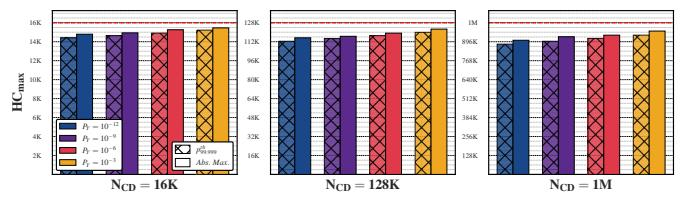

# 4. Security Analysis

Worst-case access pattern: To overwhelm ColumnKeeper, the worst-case access pattern aims to trigger as many refresh operations as possible within its hammering budget, defined by DRAM timing constraints. To achieve this, the worst-case access pattern leverages the fact that hammering a row disturbs *all* other rows in the same subarray and all rows in adjacent subarrays. As such, hammering *any* row in a single subarray causes the highest number of preventive refresh operations.

#### 4.1. Security Analysis of ColumnKeeper-D

We use "proof by induction" to prove that ColumnKeeper-D (CK-D) prevents ColumnDisturb bitflips in three steps.

First, we calculate the hammer count (HC) that the odd and even cells of a row (i.e., the cells residing in the odd and even columns, respectively) are exposed to as the sum of the row activation count  $(n_k)$  and the refresh count  $(r_k)$  targeting the row's subarray k and the neighboring subarray  $k^*$   $(n_{k^*}$  and  $r_{k^*}$ ), where  $k^*$  is k-1 or k+1. Therefore,  $HC_{odd} = \Sigma\{n_k, r_k, n_{k-1}, r_{k-1}\}$  and  $HC_{even} = \Sigma\{n_k, r_k, n_{k+1}, r_{k+1}\}$ , respectively. Second, we define the base case and the induction hypothesis. Third, we prove the induction hypothesis.

**Base Case:** DRAM is powered on.  $HC_{odd}=0$  and  $HC_{even}=0$  for all cells. Therefore, all cells are secure.

Induction Hypothesis: A randomly-chosen row i in subarray k has just been refreshed by activation n (i.e.,  $HC_{odd}(i,n){=}0$  and  $HC_{even}(i,n){=}0$ ), and is thus secure. We hypothesize that row i will remain secure, meaning that either (i) not enough activations to cause a ColumnDisturb bitflip in row i will occur, or (ii) row i will have already been preventively refreshed again before the sum of any combination of row activations and refreshes in subarray k and its neighboring subarrays k and  $k{+}1$  reaches k0.

From the induction hypothesis, **Induction Proof:**  $HC_{odd}(i, n)=0$ ,  $HC_{even}(i, n)=0$ . Let  $n'=n+N_{CD}$ . At activation n', row i's hammer counts for odd and even columns  $(HC_{odd}(i, n'))$  and  $HC_{even}(i, n')$  become the sum of all row activations and refreshes that happened in subarray k and its two adjacent subarrays ( $\Sigma\{n_k,r_k,n_{k-1},r_{k-1}\}$  and  $\Sigma\{n_k, r_k, n_{k+1}, r_{k+1}\}\$ ), respectively. As described in §3.2, CK-D resets both the CT-O and CT-E entries for subarray k whenever either of them reaches  $N_{PR}$ , and a preventive refresh in subarray k fires at every such reset. Between any two consecutive resets, neither entry can climb past  $N_{PR}$ . Otherwise, the preventive refresh would have been issued earlier. Let  $r_k$  be the number of preventive refreshes (and thus also resets) that have been issued to subarray kbetween activation n and n'. Hence  $HC_{odd}(i, n') \leq r_k \cdot N_{PR}$ , and  $HC_{even}(i, n') \leq r_k \cdot N_{PR}$ , leading to Inequality 1.

$$\max(HC_{odd}(i, n'), HC_{even}(i, n')) \le r_k \cdot N_{PR}$$
 (1)

Based on the values of  $HC_{odd}(i, n')$ ,  $HC_{even}(i, n')$  and  $N_{CD}$ , we consider the following two cases.

<u>Case 1</u>: The trivial case where the hammer count is *too low* to induce bitflips (i.e.,  $\max(HC_{odd}(i,n'), HC_{even}(i,n')) < N_{CD}$ ). <u>Case 2</u>: The hammer count is *high enough* to induce bitflips (i.e.,  $\max(HC_{odd}(i,n'), HC_{even}(i,n')) \ge N_{CD}$ ). By transitivity from the definition of *Case 2* and Inequality 1, we derive the following inequality:

$$N_{CD} \le \max(HC_{odd}(i, n'), HC_{even}(i, n')) \le r_k \cdot N_{PR}$$
 (2)

As defined in §3.2,  $N_{PR} = N_{CD}/S$ . By substituting  $N_{PR}$  and simplifying  $N_{CD}$  in Inequality 2, we derive  $r_k \geq S$ . To remain secure, row i must be preventively refreshed before or by activation n'. Since row i is the most recent row to be preventively refreshed (in subarray k), it will be the last row to again be preventively refreshed (in subarray k), as the RPT selects rows in a round-robin manner. For row i to be refreshed again, the number of preventive refreshes issued to subarray k ( $r_k$ ) must be at least S, where S is the number of rows in a subarray (i.e.,  $r_k \geq S$ ). However, this was already derived above, satisfying the condition for Case 2 remaining secure, and thus proving the induction hypothesis.

## 4.2. Security Analysis of ColumnKeeper-P

ColumnKeeper-P (CK-P) provides a configurable level of security by adjusting the *preventive refresh probability* ( $P_{PR}$ ). To configure  $P_{PR}$ , we follow the methodology proposed in HiRA [88] for RowHammer and PARA [1]. Specifically, we consider the worst-case scenario consisting of the *maximum* number of ColumnDisturb attacks (i.e., attempts to induce ColumnDisturb bitflips) possible within a refresh window. Let:

- HC(r) be the number of hammers a row r has experienced since it was last preventively refreshed. As CK-P is not aware of the open-bitline architecture, HC does not distinguish between odd and even bitlines.
- Xi be a random variable that models whether CK-P issues
  a preventive refresh to a subarray following a hammer (i.e.,
  any kind of activation) i to the subarray or its neighbors.
- MN be a random variable that models the number of preventive refreshes issued to a subarray after N activations to it or its neighbors.
- A be the maximum number of attacks that can occur within a refresh window.
- $t_F$  be the shortest time in which an attack can fail.
- $P_1$  be the probability of a *single* successful attack.
- $P_{REFW}$  ( $P_Y$ ) be the probability of at least one successful attack during a refresh window (a year).

We will show that *any* row in *any* subarray starting from an initial secure state HC(r)=0 (i.e., just initialized or preventively refreshed), will suffer a successful attack after  $N_{CD}$  hammers with a probability of  $P_1$ . We then extend this probability bound to an entire refresh window ( $P_{REFW}$ ), and an entire year ( $P_Y$ ).

**4.2.1.** Cumulative Distribution Function (CDF) of  $M_N$ . CK-P randomly issues a preventive refresh following each ACT to a subarray or its neighbors with a probability  $P_{PR}$ . This occurs via a "coin-flip", independent of any other event (i.e., a Bernoulli trial).  $M_N$  counts the number of preventive refreshes issued to the middle subarray after N activations to it or its neighbors. As a result:  $M_N = \sum_{i=1}^N X_i$ . The sum of N

independent Bernoulli trials with probability  $P_{PR}$  follows a Binomial distribution  $B(N,P_{PR})$ . The CDF of the binomial distribution is the regularized incomplete beta function [167]  $(I_q)$ , where  $q=1-P_{PR}$ , therefore:

$$P(M_N \le k) = I_q(N - k, 1 + k)$$
 (3)

**4.2.2.** Probability of a single successful attack. A single attack succeeds (with probability  $P_1$ ) when ColumnKeeper-P issues *fewer* than S preventive refreshes to a subarray following  $N_{CD}-1$  activations to it or its neighbors. Eq. 4 formulates  $P_1$  by substituting N with  $N_{CD}-1$  and k with S-1 in Eq. 3.

$$P_1 = I_q(N_{CD} - S, S) \tag{4}$$

**4.2.3. Maximum number of attacks in a refresh window.** An attacker can mount multiple attacks within a refresh window  $(t_{REFW})$  of which only one *needs* to succeed. To evaluate the worst-case scenario, we calculate the *maximum* number of attacks (A) that the attacker can mount. Following the process described in HiRA [88], we calculate A by assuming A-1 attacks that take (fail in) the shortest possible duration  $(t_F)$ , followed by a single successful attack. A single attack fails when all rows within a subarray are preventively refreshed. The attacker *initiates* the attack with a single row activation. To stop an attack, CK-P has to issue at least S mitigation requests, each of which refreshes one row in three consecutive subarrays. Therefore,  $t_F = (1+3S) \cdot t_{RC}$ , and  $A = t_{REFW} / t_F + 1$ .

**4.2.4. Probability of a successful attack within a refresh window.** The probability of *at least* one successful attack within a refresh window  $(P_{REFW})$  is the complement of the probability of all A attacks failing. Since the outcomes of the A attacks are mutually independent,  $P(\text{all fail}) = P(\text{one fails})^A$ . In turn, P(one fails) is the complement of the probability of a single successful attack  $(P_1)$ . As a result:

$$P_{REFW} = 1 - (1 - P_1)^A \tag{5}$$

**4.2.5. Probability of a successful attack in a year.** A year consists of  $492.7 \times 10^6$  DDR4 refresh windows. The probability of *at least* one successful attack within a year  $(P_Y)$  is the complement of no attacks succeeding within those refresh windows. Following what was described for  $P_{REFW}$ :

$$P_Y = 1 - (1 - P_{REFW})^{492.7 \times 10^6} \tag{6}$$

## 4.3. Configuration of ColumnKeeper-P

In Table 1, we first set target  $P_Y$  values and calculate  $P_{REFW}$  (Eq. 6) and  $P_1$  (Eq. 5). We then solve Eq. 4 to calculate  $P_{PR}$  for three different ColumnDisturb thresholds  $(N_{CD})$  and for a subarray size of 1K rows (as shown in [136]). We make two observations. First, providing the same security level for lower thresholds requires significantly higher  $P_{PR}$ . For example, for  $P_Y$ = $10^{-6}$ , when  $N_{CD}$  drops from 1M to 16K,  $P_{PR}$  increases by  $72\times$ . Second, for the same  $N_{CD}$ , even slight increases to  $P_{PR}$  provide significantly higher security. For example, with  $N_{CD}$ =128K and  $P_{PR}$ = $10^{-2}$ ,  $P_Y$ = $10^{-3}$ . However, when  $P_{PR}$  slightly increases to  $1.07\times10^{-2}$ ,  $P_Y$  drops to  $10^{-12}$ . For the rest of this paper,  $P_{PR}$  is always calculated for  $P_Y$ = $10^{-12}$  unless stated otherwise.

Table 1: Configuration parameters of ColumnKeeper-P.

| $P_Y$      | $10^{-3}$                                 | $10^{-6}$              | $10^{-9}$              | $10^{-12}$             |
|------------|-------------------------------------------|------------------------|------------------------|------------------------|
| $P_{REFW}$ | $2.03 \times 10^{-12}$                    | $2.03 \times 10^{-15}$ | $2.03 \times 10^{-18}$ | $2.03 \times 10^{-21}$ |
| $P_1$      | $4.39 \times 10^{-15}$                    | $4.38 \times 10^{-18}$ | $4.38 \times 10^{-21}$ | $4.38 \times 10^{-24}$ |
| $N_{CD}$   | Preventive Refresh Probability $(P_{PR})$ |                        |                        |                        |
| 1M         | $1.23 \times 10^{-3}$                     | $1.26 \times 10^{-3}$  | $1.29 \times 10^{-3}$  | $1.32 \times 10^{-3}$  |
| 128K       | $1.00 \times 10^{-2}$                     | $1.02 \times 10^{-2}$  | $1.05 \times 10^{-2}$  | $1.07 \times 10^{-2}$  |
| 16K        | $8.92 \times 10^{-2}$                     | $9.13 \times 10^{-2}$  | $9.32 \times 10^{-2}$  | $9.50 \times 10^{-2}$  |

## 4.3.1. ColumnKeeper-P Monte Carlo Security Analysis.

We demonstrate ColumnKeeper-P's security by performing a Monte Carlo simulation of a DRAM bank under continuous ColumnDisturb attack. Specifically, we simulate continuously hammering a randomly selected row in a randomly selected subarray. We then measure the maximum number of times  $(HC_{max})$  the cells residing in the odd or even columns of any row were hammered without CK-P preventively refreshing the row during an entire refresh window, and repeat this experiment 1M times. Figure 5 shows the  $99.999_{th}$  percentile  $(p_{99.999}^{th})$  (hatched bars) and overall maximum value (solid bars) of  $HC_{max}$  for the different configurations of Table 1.

Figure 5:  $p_{99.999}^{th}$  and absolute maximum value of  $HC_{max}$  for the different configurations of Table 1.

We make two key observations. First, across all configurations,  $HC_{max}$  remains well below  $N_{CD}$  (represented by the red line). Second, as the security guarantees tighten (i.e.,  $P_Y$  decreases), the gap between the absolute maximum value of  $HC_{max}$  and  $N_{CD}$  increases. For example, when  $P_Y$  reduces from  $10^{-3}$  to  $10^{-12}$  at  $N_{CD}$  equal to 128K, this gap increases from 5.5K to 13K activations, representing a "safety margin" of 4.2% and 9.9%, relative to  $N_{CD}$ . We attribute this to the fact that achieving lower values of  $P_Y$  for the same  $N_{CD}$  requires setting higher values of  $P_{PR}$ . A higher  $P_{PR}$  in turn leads to CK-P being more likely to issue preventive refreshes, reducing  $HC_{max}$ .

# 4. Security Analysis

Worst-case access pattern: To overwhelm ColumnKeeper, the worst-case access pattern aims to trigger as many refresh operations as possible within its hammering budget, defined by DRAM timing constraints. To achieve this, the worst-case access pattern leverages the fact that hammering a row disturbs *all* other rows in the same subarray and all rows in adjacent subarrays. As such, hammering *any* row in a single subarray causes the highest number of preventive refresh operations.

#### 4.1. Security Analysis of ColumnKeeper-D

We use "proof by induction" to prove that ColumnKeeper-D (CK-D) prevents ColumnDisturb bitflips in three steps.

First, we calculate the hammer count (HC) that the odd and even cells of a row (i.e., the cells residing in the odd and even columns, respectively) are exposed to as the sum of the row activation count  $(n_k)$  and the refresh count  $(r_k)$  targeting the row's subarray k and the neighboring subarray  $k^*$   $(n_{k^*}$  and  $r_{k^*}$ ), where  $k^*$  is k-1 or k+1. Therefore,  $HC_{odd} = \Sigma\{n_k, r_k, n_{k-1}, r_{k-1}\}$  and  $HC_{even} = \Sigma\{n_k, r_k, n_{k+1}, r_{k+1}\}$ , respectively. Second, we define the base case and the induction hypothesis. Third, we prove the induction hypothesis.

**Base Case:** DRAM is powered on.  $HC_{odd}=0$  and  $HC_{even}=0$  for all cells. Therefore, all cells are secure.

Induction Hypothesis: A randomly-chosen row i in subarray k has just been refreshed by activation n (i.e.,  $HC_{odd}(i,n){=}0$  and  $HC_{even}(i,n){=}0$ ), and is thus secure. We hypothesize that row i will remain secure, meaning that either (i) not enough activations to cause a ColumnDisturb bitflip in row i will occur, or (ii) row i will have already been preventively refreshed again before the sum of any combination of row activations and refreshes in subarray k and its neighboring subarrays k and  $k{+}1$  reaches k0.

From the induction hypothesis, **Induction Proof:**  $HC_{odd}(i, n)=0$ ,  $HC_{even}(i, n)=0$ . Let  $n'=n+N_{CD}$ . At activation n', row i's hammer counts for odd and even columns  $(HC_{odd}(i, n'))$  and  $HC_{even}(i, n')$  become the sum of all row activations and refreshes that happened in subarray k and its two adjacent subarrays ( $\Sigma\{n_k,r_k,n_{k-1},r_{k-1}\}$  and  $\Sigma\{n_k, r_k, n_{k+1}, r_{k+1}\}\$ ), respectively. As described in §3.2, CK-D resets both the CT-O and CT-E entries for subarray k whenever either of them reaches  $N_{PR}$ , and a preventive refresh in subarray k fires at every such reset. Between any two consecutive resets, neither entry can climb past  $N_{PR}$ . Otherwise, the preventive refresh would have been issued earlier. Let  $r_k$  be the number of preventive refreshes (and thus also resets) that have been issued to subarray kbetween activation n and n'. Hence  $HC_{odd}(i, n') \leq r_k \cdot N_{PR}$ , and  $HC_{even}(i, n') \leq r_k \cdot N_{PR}$ , leading to Inequality 1.

$$\max(HC_{odd}(i, n'), HC_{even}(i, n')) \le r_k \cdot N_{PR}$$
 (1)

Based on the values of  $HC_{odd}(i, n')$ ,  $HC_{even}(i, n')$  and  $N_{CD}$ , we consider the following two cases.

<u>Case 1</u>: The trivial case where the hammer count is *too low* to induce bitflips (i.e.,  $\max(HC_{odd}(i,n'), HC_{even}(i,n')) < N_{CD}$ ). <u>Case 2</u>: The hammer count is *high enough* to induce bitflips (i.e.,  $\max(HC_{odd}(i,n'), HC_{even}(i,n')) \ge N_{CD}$ ). By transitivity from the definition of *Case 2* and Inequality 1, we derive the following inequality:

$$N_{CD} \le \max(HC_{odd}(i, n'), HC_{even}(i, n')) \le r_k \cdot N_{PR}$$
 (2)

As defined in §3.2,  $N_{PR} = N_{CD}/S$ . By substituting  $N_{PR}$  and simplifying  $N_{CD}$  in Inequality 2, we derive  $r_k \geq S$ . To remain secure, row i must be preventively refreshed before or by activation n'. Since row i is the most recent row to be preventively refreshed (in subarray k), it will be the last row to again be preventively refreshed (in subarray k), as the RPT selects rows in a round-robin manner. For row i to be refreshed again, the number of preventive refreshes issued to subarray k ( $r_k$ ) must be at least S, where S is the number of rows in a subarray (i.e.,  $r_k \geq S$ ). However, this was already derived above, satisfying the condition for Case 2 remaining secure, and thus proving the induction hypothesis.

## 4.2. Security Analysis of ColumnKeeper-P

ColumnKeeper-P (CK-P) provides a configurable level of security by adjusting the *preventive refresh probability* ( $P_{PR}$ ). To configure  $P_{PR}$ , we follow the methodology proposed in HiRA [88] for RowHammer and PARA [1]. Specifically, we consider the worst-case scenario consisting of the *maximum* number of ColumnDisturb attacks (i.e., attempts to induce ColumnDisturb bitflips) possible within a refresh window. Let:

- HC(r) be the number of hammers a row r has experienced since it was last preventively refreshed. As CK-P is not aware of the open-bitline architecture, HC does not distinguish between odd and even bitlines.
- Xi be a random variable that models whether CK-P issues
  a preventive refresh to a subarray following a hammer (i.e.,
  any kind of activation) i to the subarray or its neighbors.
- MN be a random variable that models the number of preventive refreshes issued to a subarray after N activations to it or its neighbors.
- A be the maximum number of attacks that can occur within a refresh window.
- $t_F$  be the shortest time in which an attack can fail.
- $P_1$  be the probability of a *single* successful attack.
- $P_{REFW}$  ( $P_Y$ ) be the probability of at least one successful attack during a refresh window (a year).

We will show that *any* row in *any* subarray starting from an initial secure state HC(r)=0 (i.e., just initialized or preventively refreshed), will suffer a successful attack after  $N_{CD}$  hammers with a probability of  $P_1$ . We then extend this probability bound to an entire refresh window ( $P_{REFW}$ ), and an entire year ( $P_Y$ ).

**4.2.1.** Cumulative Distribution Function (CDF) of  $M_N$ . CK-P randomly issues a preventive refresh following each ACT to a subarray or its neighbors with a probability  $P_{PR}$ . This occurs via a "coin-flip", independent of any other event (i.e., a Bernoulli trial).  $M_N$  counts the number of preventive refreshes issued to the middle subarray after N activations to it or its neighbors. As a result:  $M_N = \sum_{i=1}^N X_i$ . The sum of N

independent Bernoulli trials with probability  $P_{PR}$  follows a Binomial distribution  $B(N,P_{PR})$ . The CDF of the binomial distribution is the regularized incomplete beta function [167]  $(I_q)$ , where  $q=1-P_{PR}$ , therefore:

$$P(M_N \le k) = I_q(N - k, 1 + k)$$
 (3)

**4.2.2.** Probability of a single successful attack. A single attack succeeds (with probability  $P_1$ ) when ColumnKeeper-P issues *fewer* than S preventive refreshes to a subarray following  $N_{CD}-1$  activations to it or its neighbors. Eq. 4 formulates  $P_1$  by substituting N with  $N_{CD}-1$  and k with S-1 in Eq. 3.

$$P_1 = I_q(N_{CD} - S, S) \tag{4}$$

**4.2.3. Maximum number of attacks in a refresh window.** An attacker can mount multiple attacks within a refresh window  $(t_{REFW})$  of which only one *needs* to succeed. To evaluate the worst-case scenario, we calculate the *maximum* number of attacks (A) that the attacker can mount. Following the process described in HiRA [88], we calculate A by assuming A-1 attacks that take (fail in) the shortest possible duration  $(t_F)$ , followed by a single successful attack. A single attack fails when all rows within a subarray are preventively refreshed. The attacker *initiates* the attack with a single row activation. To stop an attack, CK-P has to issue at least S mitigation requests, each of which refreshes one row in three consecutive subarrays. Therefore,  $t_F = (1+3S) \cdot t_{RC}$ , and  $A = t_{REFW} / t_F + 1$ .

**4.2.4. Probability of a successful attack within a refresh window.** The probability of *at least* one successful attack within a refresh window  $(P_{REFW})$  is the complement of the probability of all A attacks failing. Since the outcomes of the A attacks are mutually independent,  $P(\text{all fail}) = P(\text{one fails})^A$ . In turn, P(one fails) is the complement of the probability of a single successful attack  $(P_1)$ . As a result:

$$P_{REFW} = 1 - (1 - P_1)^A \tag{5}$$

**4.2.5. Probability of a successful attack in a year.** A year consists of  $492.7 \times 10^6$  DDR4 refresh windows. The probability of *at least* one successful attack within a year  $(P_Y)$  is the complement of no attacks succeeding within those refresh windows. Following what was described for  $P_{REFW}$ :

$$P_Y = 1 - (1 - P_{REFW})^{492.7 \times 10^6} \tag{6}$$

## 4.3. Configuration of ColumnKeeper-P

In Table 1, we first set target  $P_Y$  values and calculate  $P_{REFW}$  (Eq. 6) and  $P_1$  (Eq. 5). We then solve Eq. 4 to calculate  $P_{PR}$  for three different ColumnDisturb thresholds  $(N_{CD})$  and for a subarray size of 1K rows (as shown in [136]). We make two observations. First, providing the same security level for lower thresholds requires significantly higher  $P_{PR}$ . For example, for  $P_Y$ = $10^{-6}$ , when  $N_{CD}$  drops from 1M to 16K,  $P_{PR}$  increases by  $72\times$ . Second, for the same  $N_{CD}$ , even slight increases to  $P_{PR}$  provide significantly higher security. For example, with  $N_{CD}$ =128K and  $P_{PR}$ = $10^{-2}$ ,  $P_Y$ = $10^{-3}$ . However, when  $P_{PR}$  slightly increases to  $1.07\times10^{-2}$ ,  $P_Y$  drops to  $10^{-12}$ . For the rest of this paper,  $P_{PR}$  is always calculated for  $P_Y$ = $10^{-12}$  unless stated otherwise.

Table 1: Configuration parameters of ColumnKeeper-P.

| $P_Y$      | $10^{-3}$                                 | $10^{-6}$              | $10^{-9}$              | $10^{-12}$             |
|------------|-------------------------------------------|------------------------|------------------------|------------------------|
| $P_{REFW}$ | $2.03 \times 10^{-12}$                    | $2.03 \times 10^{-15}$ | $2.03 \times 10^{-18}$ | $2.03 \times 10^{-21}$ |
| $P_1$      | $4.39 \times 10^{-15}$                    | $4.38 \times 10^{-18}$ | $4.38 \times 10^{-21}$ | $4.38 \times 10^{-24}$ |
| $N_{CD}$   | Preventive Refresh Probability $(P_{PR})$ |                        |                        |                        |
| 1M         | $1.23 \times 10^{-3}$                     | $1.26 \times 10^{-3}$  | $1.29 \times 10^{-3}$  | $1.32 \times 10^{-3}$  |
| 128K       | $1.00 \times 10^{-2}$                     | $1.02 \times 10^{-2}$  | $1.05 \times 10^{-2}$  | $1.07 \times 10^{-2}$  |
| 16K        | $8.92 \times 10^{-2}$                     | $9.13 \times 10^{-2}$  | $9.32 \times 10^{-2}$  | $9.50 \times 10^{-2}$  |

## 4.3.1. ColumnKeeper-P Monte Carlo Security Analysis.

We demonstrate ColumnKeeper-P's security by performing a Monte Carlo simulation of a DRAM bank under continuous ColumnDisturb attack. Specifically, we simulate continuously hammering a randomly selected row in a randomly selected subarray. We then measure the maximum number of times  $(HC_{max})$  the cells residing in the odd or even columns of any row were hammered without CK-P preventively refreshing the row during an entire refresh window, and repeat this experiment 1M times. Figure 5 shows the  $99.999_{th}$  percentile  $(p_{99.999}^{th})$  (hatched bars) and overall maximum value (solid bars) of  $HC_{max}$  for the different configurations of Table 1.

Figure 5:  $p_{99.999}^{th}$  and absolute maximum value of  $HC_{max}$  for the different configurations of Table 1.

We make two key observations. First, across all configurations,  $HC_{max}$  remains well below  $N_{CD}$  (represented by the red line). Second, as the security guarantees tighten (i.e.,  $P_Y$  decreases), the gap between the absolute maximum value of  $HC_{max}$  and  $N_{CD}$  increases. For example, when  $P_Y$  reduces from  $10^{-3}$  to  $10^{-12}$  at  $N_{CD}$  equal to 128K, this gap increases from 5.5K to 13K activations, representing a "safety margin" of 4.2% and 9.9%, relative to  $N_{CD}$ . We attribute this to the fact that achieving lower values of  $P_Y$  for the same  $N_{CD}$  requires setting higher values of  $P_{PR}$ . A higher  $P_{PR}$  in turn leads to CK-P being more likely to issue preventive refreshes, reducing  $HC_{max}$ .

