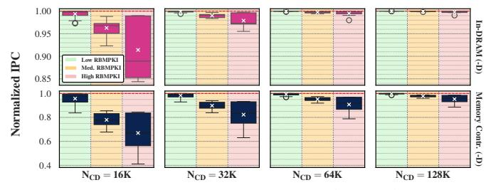

# 7. Latency, Area & Power Overheads

ColumnKeeper-D (CK-D) and ColumnKeeper-P (CK-P) are implemented in the memory controller and require no modifications to DRAM. Each CT-O and CT-E entry contains a maximum value of  $(N_{CD}-2S)/S \approx N_{CD}/S$ , where S is the subarray size. Each RPT entry points to one of S rows in a subarray. As a result, each CT-O and CT-E entry requires  $\log_2(N_{CD}/S)$ bits of storage, and each RPT entry requires  $log_2(S)$  bits of storage. Given: (i) a ColumnDisturb threshold  $(N_{CD})$  of 1M, (ii) a subarray size S=1K, and (iii) the dual-rank configuration of §5, the total storage overheads of ColumnKeeper-D (ColumnKeeper-P) are 7.5KB (2.5KB). We implement CK-D and CK-P in Verilog HDL and use open-source tools [183,184] to synthesize them and evaluate their latency, area, and power overheads. CK-D (CK-P) increases the processor's power consumption and area by 50 mW (15 mW) and  $0.1 \text{ mm}^2$  ( $0.03 \text{ mm}^2$ ), respectively. The row-to-row activation delay  $(t_{RRD})$  determines the minimum latency between successive row activations across banks, with  $t_{RRD} \ge 2.5$  ns in DDR4. CK-D (CK-P) can read and update the necessary counters while meeting this timing constraint, with a slack of 0.7 ns (0.5 ns). As these operations happen off the critical path of the memory controller, they add no additional memory request latency.

## 8. Alternative In-DRAM Implementation

ColumnKeeper's memory-controller-based design eases its adoption by avoiding changes to the density-optimized DRAM chips. However, this design choice introduces two drawbacks. First, it requires exposing (or reverse-engineering, §9.1) the subarray mapping to the memory controller. Second, as the memory controller *cannot* determine which subarrays RFM [77,78] affects, it conservatively increments multiple counters when issuing such commands, increasing ColumnKeeper's overheads.

To alleviate these issues, we explore a potential in-DRAM design of CK-D, which reuses PRAC's [76–79,134,166] standardized ALERT signal and RFM command. We place the RPT, CT-O, and CT-E entries next to each subarray and introduce

two registers in each bank to track the subarray with the highest activation count: (i) a **Subarray Pointer** (SP), which points to the subarray in the bank with the highest activation count, and (ii) a **Subarray Hammer Counter** (SHC), which contains the maximum value of CT-O and CT-E for the subarray pointed to by SP. Each time CK-D updates its counter entries, it checks whether the new values exceed SHC and updates it accordingly. When SHC exceeds  $N_{PR}$ , CK-D asserts the ALERT signal, which informs the memory controller to issue an RFM command to the entire DRAM rank. When a bank receives RFM, it first identifies the subarray with the highest activation count (via SP). Second, it refreshes the next 7 rows pointed to by RPT. Third, it increments RPT (by 7) and resets CT-O and CT-E to 7. Fourth, it recalculates SP and SHC with the updated CT-O and CT-E entries in the neighboring subarrays.

Figure 15 presents the performance impact of the in-DRAM and the memory-controller-based implementations of CK-D on single-core workloads, when integrated with PRAC ( $N_{RH}\!=\!128$ ). The top (bottom) row shows results for the in-DRAM (memory-controller-based) implementation. From left to right, each column shows results for  $N_{CD}\!=\!16K,32K,64K,$  and 128K, respectively. Each boxplot corresponds to a particular RBMPKI category (denoted by background color) and shows the distribution of IPC, normalized to a PRAC-enabled system with no ColumnDisturb mitigation.

Figure 15: Performance impact of CK-D (bottom) and its in-DRAM implementation (top) with PRAC enabled,  $N_{\rm RH}$ =128.

First, we observe that for  $N_{CD}\!=\!128K$ , the in-DRAM version of CK-D incurs negligible IPC degradation, with a minimum normalized IPC of 0.99, compared to 0.41 for the memory-controller-based implementation. Second, for  $N_{CD}\!=\!16K$ , where the memory-controller-based implementation has an average (minimum) normalized IPC of 0.84 (0.41), the in-DRAM version maintains a high average (minimum) IPC of 0.97 (0.84). This is because the in-DRAM implementation can identify which subarrays are affected by RowHammer-preventing RFM commands, whereas the memory-controller-based implementation conservatively increments all subarray counters in the entire rank, leading to unnecessary refreshes and higher performance overheads. We conclude that an in-DRAM implementation of CK-D can provide low-overhead ColumnDisturb mitigation at very low thresholds.

#### 9. Discussion

# 7. Latency, Area & Power Overheads

ColumnKeeper-D (CK-D) and ColumnKeeper-P (CK-P) are implemented in the memory controller and require no modifications to DRAM. Each CT-O and CT-E entry contains a maximum value of  $(N_{CD}-2S)/S \approx N_{CD}/S$ , where S is the subarray size. Each RPT entry points to one of S rows in a subarray. As a result, each CT-O and CT-E entry requires  $\log_2(N_{CD}/S)$ bits of storage, and each RPT entry requires  $log_2(S)$  bits of storage. Given: (i) a ColumnDisturb threshold  $(N_{CD})$  of 1M, (ii) a subarray size S=1K, and (iii) the dual-rank configuration of §5, the total storage overheads of ColumnKeeper-D (ColumnKeeper-P) are 7.5KB (2.5KB). We implement CK-D and CK-P in Verilog HDL and use open-source tools [183,184] to synthesize them and evaluate their latency, area, and power overheads. CK-D (CK-P) increases the processor's power consumption and area by 50 mW (15 mW) and  $0.1 \text{ mm}^2$  ( $0.03 \text{ mm}^2$ ), respectively. The row-to-row activation delay  $(t_{RRD})$  determines the minimum latency between successive row activations across banks, with  $t_{RRD} \ge 2.5$  ns in DDR4. CK-D (CK-P) can read and update the necessary counters while meeting this timing constraint, with a slack of 0.7 ns (0.5 ns). As these operations happen off the critical path of the memory controller, they add no additional memory request latency.

## 8. Alternative In-DRAM Implementation

ColumnKeeper's memory-controller-based design eases its adoption by avoiding changes to the density-optimized DRAM chips. However, this design choice introduces two drawbacks. First, it requires exposing (or reverse-engineering, §9.1) the subarray mapping to the memory controller. Second, as the memory controller *cannot* determine which subarrays RFM [77,78] affects, it conservatively increments multiple counters when issuing such commands, increasing ColumnKeeper's overheads.

To alleviate these issues, we explore a potential in-DRAM design of CK-D, which reuses PRAC's [76–79,134,166] standardized ALERT signal and RFM command. We place the RPT, CT-O, and CT-E entries next to each subarray and introduce

two registers in each bank to track the subarray with the highest activation count: (i) a **Subarray Pointer** (SP), which points to the subarray in the bank with the highest activation count, and (ii) a **Subarray Hammer Counter** (SHC), which contains the maximum value of CT-O and CT-E for the subarray pointed to by SP. Each time CK-D updates its counter entries, it checks whether the new values exceed SHC and updates it accordingly. When SHC exceeds  $N_{PR}$ , CK-D asserts the ALERT signal, which informs the memory controller to issue an RFM command to the entire DRAM rank. When a bank receives RFM, it first identifies the subarray with the highest activation count (via SP). Second, it refreshes the next 7 rows pointed to by RPT. Third, it increments RPT (by 7) and resets CT-O and CT-E to 7. Fourth, it recalculates SP and SHC with the updated CT-O and CT-E entries in the neighboring subarrays.

Figure 15 presents the performance impact of the in-DRAM and the memory-controller-based implementations of CK-D on single-core workloads, when integrated with PRAC ( $N_{RH}\!=\!128$ ). The top (bottom) row shows results for the in-DRAM (memory-controller-based) implementation. From left to right, each column shows results for  $N_{CD}\!=\!16K,32K,64K,$  and 128K, respectively. Each boxplot corresponds to a particular RBMPKI category (denoted by background color) and shows the distribution of IPC, normalized to a PRAC-enabled system with no ColumnDisturb mitigation.

Figure 15: Performance impact of CK-D (bottom) and its in-DRAM implementation (top) with PRAC enabled,  $N_{\rm RH}$ =128.

First, we observe that for  $N_{CD}\!=\!128K$ , the in-DRAM version of CK-D incurs negligible IPC degradation, with a minimum normalized IPC of 0.99, compared to 0.41 for the memory-controller-based implementation. Second, for  $N_{CD}\!=\!16K$ , where the memory-controller-based implementation has an average (minimum) normalized IPC of 0.84 (0.41), the in-DRAM version maintains a high average (minimum) IPC of 0.97 (0.84). This is because the in-DRAM implementation can identify which subarrays are affected by RowHammer-preventing RFM commands, whereas the memory-controller-based implementation conservatively increments all subarray counters in the entire rank, leading to unnecessary refreshes and higher performance overheads. We conclude that an in-DRAM implementation of CK-D can provide low-overhead ColumnDisturb mitigation at very low thresholds.

#### 9. Discussion

