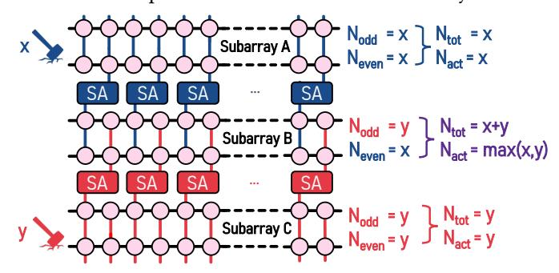

# 2.3. Motivation

DRAM technology node scaling has increased the severity of RowHammer and RowPress [\[1](#page-13-0)[,3](#page-13-4)[,4,](#page-13-5)[6,](#page-13-1)[9](#page-13-6)[–13\]](#page-13-7) and led to the appearance of a new read disturbance phenomenon, Column-Disturb [\[136\]](#page-14-1). While [§2.2.1](#page-2-1) describes a wide range of techniques that mitigate RowHammer [\[1](#page-13-0)[–6\]](#page-13-1) and RowPress [\[7,](#page-13-2)[8\]](#page-13-3), the same techniques are ineffective against ColumnDisturb due to its fundamentally different nature. Specifically, these techniques rely on tracking activations and deploying their countermeasures at row granularity [\[1](#page-13-0)[,6](#page-13-1)[,10](#page-13-11)[,14](#page-13-10)[,33,](#page-13-15)[39,](#page-13-16)[49](#page-13-17)[,66](#page-13-18)[–135\]](#page-14-0). However, as described in [§2.2,](#page-2-2) ColumnDisturb induces bitflips across three consecutive subarrays (i.e., it occurs at subarray granularity), affecting thousands of rows. In this section, we discuss how naively mitigating ColumnDisturb by (i) increasing the DRAM refresh rate, or (ii) performing simple modifications to the industry-standard RowHammer mitigation mechanism, PRAC [76–79,134,166], incurs significant performance and energy overheads.

2.3.1. Mitigating ColumnDisturb by Increasing DRAM Refresh Rate. The simplest method of mitigating Column-Disturb is to increase the refresh rate of DRAM by reducing  $t_{REFW}$  and  $t_{REFI}$ . This ensures that all affected DRAM cells are periodically refreshed before the ColumnDisturb threshold  $(N_{CD})$ , i.e., the number of row activations required to induce ColumnDisturb bitflips, is reached in any subarray. However, as both ColumnDisturb [136] and our own analysis show, doing so significantly degrades system performance and energy efficiency for future DRAM chips. Figure 2 shows the single-core performance (in instructions per cycle) and energy consumption of a system that mitigates ColumnDisturb by increasing the DRAM refresh rate (reducing  $t_{REFW}$ ), normalized to a baseline system with the default (64 ms) refresh rate. We observe that at the current  $N_{CD}$  of 1M, the reduced  $t_{REFW}$  (63.6 ms) degrades average system performance by just 0.03% and increases average DRAM energy consumption by 0.24%. However, as  $N_{CD}$  decreases, performance and energy consumption overheads caused by the lower  $t_{REFW}$  increase significantly, particularly for workloads with high Last Level Cache (LLC) miss rates. For  $N_{CD}$ =128K, the increased refresh rate degrades average system performance by over 50% and increases average DRAM energy consumption by  $6\times$ . At this threshold, the required  $t_{REFW}$  to protect against ColumnDisturb is 7.95 ms (vs. 64 ms in DDR4).

Figure 2: Normalized single-core performance and energy consumption of mitigating Column Disturb by decreasing  $t_{\rm REFW}$ .

2.3.2. Mitigating ColumnDisturb by Modifying PRAC. Another potential way of mitigating ColumnDisturb is by modifying the industry-standard RowHammer mitigation mechanism, PRAC [76–79,134,166]. PRAC equips each DRAM row with a counter that tracks the number of activations to that row. When a counter reaches a predefined threshold, PRAC raises an Alert Back-Off (ABO) signal, signaling the memory controller to issue an RFM command that preventively refreshes neighboring victim rows. To protect against ColumnDisturb, one could: (i) reduce the ABO triggering threshold, and (ii) refresh all rows across three subarrays when ABO is triggered. Since an attacker can potentially distribute a ColumnDisturb attack across rows in a subarray to induce bitflips, ABO should be triggered after at most  $N_{CD}/S$  row activations, where S is the subarray size. For  $N_{CD}=1M$  and S=1024 (the subarray

size reported in [136]), this threshold is *only* 1K. As a result, after just 1K activations to a single row, this modified implementation would have to refresh 3K rows across 3 subarrays, incurring substantial performance and energy overheads.

**2.3.3. Our Goal & Key Observation.** Our goal in Column-Keeper is to design the *first* mechanisms that prevent Column-Disturb bitflips at low performance, energy, and area overheads. We aim to achieve this by tracking activations at subarray granularity and issuing preventive refreshes to rows in *all* affected subarrays. Since each activation affects three consecutive subarrays, any mitigation mechanism must also account for activations in neighboring subarrays. However, naively doing so may overestimate the activation count of the bitlines in a subarray for certain access patterns, leading to unnecessary refreshes and performance overheads. Figure 3 shows an example of such an access pattern across three DRAM subarrays.

Figure 3: Example of "double-counting" activations.

An attacker performs x (y) hammers in subarray A (C). Due to the open-bitline architecture, subarray B shares its even (odd) bitlines with A (C). As a result, both the odd and the even bitlines in A (C) experience an *identical* activation count of x (y). However, in subarray B, the activation count experienced by the odd and even bitlines *differs*, at y and x, respectively. A naive mechanism that counts the *total* number  $(N_{tot})$  of row activations affecting B reports an activation count of x+y. However, row activations in A (C) exclusively affect the even (odd) bitlines in B. Consequently, the actual hammer count of B  $(N_{act})$  is the maximum activation count of the odd and even bitlines (i.e., max(x,y)). When x=y,  $N_{tot}=2\times N_{act}$ . We refer to this potential pitfall as "double-counting" and take it into account when designing our deterministic mitigation mechanism, to reduce performance and energy overheads.

#### 3. ColumnKeeper

ColumnKeeper introduces two mechanisms that mitigate ColumnDisturb by preventively refreshing DRAM rows: (i) ColumnKeeper-D, a deterministic mitigation mechanism that tracks the number of times that the bitlines of a subarray have been hammered to issue preventive refreshes, and (ii) ColumnKeeper-P, a probabilistic mitigation mechanism that issues preventive refreshes with a predetermined probability. To ensure no ColumnDisturb bitflips occur, both mechanisms preventively refresh all DRAM rows in a subarray and its neighboring subarrays before the ColumnDisturb threshold ( $N_{CD}$ ) is reached. Due to the large number of rows that require refreshing, naively refreshing all potential victim rows at once incurs significant latency overheads by stalling accesses to the bank

for up to  $3K \cdot t_{RC}$  (i.e.,  $153 \, \mu s$  for our configuration, see §5). To avoid such latency overheads, both mechanisms distribute preventive refresh operations across time and perform them one row at a time by issuing ACT+PRE commands. To mitigate ColumnDisturb, ColumnKeeper requires exposing the DRAM subarray mapping to the memory controller, similar to works that employ subarray-level parallelism (SALP) [88,152–154].

#### 3.1. High-Level Architecture & Shared Components

Both ColumnKeeper-D (CK-D) and ColumnKeeper-P (CK-P) consist of a *trigger* mechanism and a *countermeasure*. The trigger mechanism *decides when* to invoke the countermeasure for a subarray and/or its neighboring subarrays. The countermeasure *decides which* row to preventively refresh in an affected subarray. CK-D and CK-P employ different trigger mechanisms (§3.2 and §3.3, respectively) but share the countermeasure, which is the **Row Pointer Table** (RPT).

The role of the RPT is to select which row to preventively refresh when the trigger mechanism fires for a subarray. To do so, it stores a pointer to the next DRAM row to be preventively refreshed for each subarray. We design the RPT as a table of counters, one for each of the K subarrays of the system. When the trigger mechanism fires for a subarray k, ColumnKeeper probes the corresponding RPT entry to identify which row to refresh in the targeted subarray. The RPT first returns the counter's current value  $(R_k)$  for that subarray and then increments the counter to point to the next row. When the RPT is probed for the last row in a subarray, it is zeroed to point to the first row of the subarray. Due to this round-robin selection, the row currently pointed to by the RPT is necessarily the row that was least recently preventively refreshed, and therefore has the highest hammer count within the subarray.

# 2.3. Motivation

DRAM technology node scaling has increased the severity of RowHammer and RowPress [\[1](#page-13-0)[,3](#page-13-4)[,4,](#page-13-5)[6,](#page-13-1)[9](#page-13-6)[–13\]](#page-13-7) and led to the appearance of a new read disturbance phenomenon, Column-Disturb [\[136\]](#page-14-1). While [§2.2.1](#page-2-1) describes a wide range of techniques that mitigate RowHammer [\[1](#page-13-0)[–6\]](#page-13-1) and RowPress [\[7,](#page-13-2)[8\]](#page-13-3), the same techniques are ineffective against ColumnDisturb due to its fundamentally different nature. Specifically, these techniques rely on tracking activations and deploying their countermeasures at row granularity [\[1](#page-13-0)[,6](#page-13-1)[,10](#page-13-11)[,14](#page-13-10)[,33,](#page-13-15)[39,](#page-13-16)[49](#page-13-17)[,66](#page-13-18)[–135\]](#page-14-0). However, as described in [§2.2,](#page-2-2) ColumnDisturb induces bitflips across three consecutive subarrays (i.e., it occurs at subarray granularity), affecting thousands of rows. In this section, we discuss how naively mitigating ColumnDisturb by (i) increasing the DRAM refresh rate, or (ii) performing simple modifications to the industry-standard RowHammer mitigation mechanism, PRAC [76–79,134,166], incurs significant performance and energy overheads.

2.3.1. Mitigating ColumnDisturb by Increasing DRAM Refresh Rate. The simplest method of mitigating Column-Disturb is to increase the refresh rate of DRAM by reducing  $t_{REFW}$  and  $t_{REFI}$ . This ensures that all affected DRAM cells are periodically refreshed before the ColumnDisturb threshold  $(N_{CD})$ , i.e., the number of row activations required to induce ColumnDisturb bitflips, is reached in any subarray. However, as both ColumnDisturb [136] and our own analysis show, doing so significantly degrades system performance and energy efficiency for future DRAM chips. Figure 2 shows the single-core performance (in instructions per cycle) and energy consumption of a system that mitigates ColumnDisturb by increasing the DRAM refresh rate (reducing  $t_{REFW}$ ), normalized to a baseline system with the default (64 ms) refresh rate. We observe that at the current  $N_{CD}$  of 1M, the reduced  $t_{REFW}$  (63.6 ms) degrades average system performance by just 0.03% and increases average DRAM energy consumption by 0.24%. However, as  $N_{CD}$  decreases, performance and energy consumption overheads caused by the lower  $t_{REFW}$  increase significantly, particularly for workloads with high Last Level Cache (LLC) miss rates. For  $N_{CD}$ =128K, the increased refresh rate degrades average system performance by over 50% and increases average DRAM energy consumption by  $6\times$ . At this threshold, the required  $t_{REFW}$  to protect against ColumnDisturb is 7.95 ms (vs. 64 ms in DDR4).

Figure 2: Normalized single-core performance and energy consumption of mitigating Column Disturb by decreasing  $t_{\rm REFW}$ .

2.3.2. Mitigating ColumnDisturb by Modifying PRAC. Another potential way of mitigating ColumnDisturb is by modifying the industry-standard RowHammer mitigation mechanism, PRAC [76–79,134,166]. PRAC equips each DRAM row with a counter that tracks the number of activations to that row. When a counter reaches a predefined threshold, PRAC raises an Alert Back-Off (ABO) signal, signaling the memory controller to issue an RFM command that preventively refreshes neighboring victim rows. To protect against ColumnDisturb, one could: (i) reduce the ABO triggering threshold, and (ii) refresh all rows across three subarrays when ABO is triggered. Since an attacker can potentially distribute a ColumnDisturb attack across rows in a subarray to induce bitflips, ABO should be triggered after at most  $N_{CD}/S$  row activations, where S is the subarray size. For  $N_{CD}=1M$  and S=1024 (the subarray

size reported in [136]), this threshold is *only* 1K. As a result, after just 1K activations to a single row, this modified implementation would have to refresh 3K rows across 3 subarrays, incurring substantial performance and energy overheads.

**2.3.3. Our Goal & Key Observation.** Our goal in Column-Keeper is to design the *first* mechanisms that prevent Column-Disturb bitflips at low performance, energy, and area overheads. We aim to achieve this by tracking activations at subarray granularity and issuing preventive refreshes to rows in *all* affected subarrays. Since each activation affects three consecutive subarrays, any mitigation mechanism must also account for activations in neighboring subarrays. However, naively doing so may overestimate the activation count of the bitlines in a subarray for certain access patterns, leading to unnecessary refreshes and performance overheads. Figure 3 shows an example of such an access pattern across three DRAM subarrays.

Figure 3: Example of "double-counting" activations.

An attacker performs x (y) hammers in subarray A (C). Due to the open-bitline architecture, subarray B shares its even (odd) bitlines with A (C). As a result, both the odd and the even bitlines in A (C) experience an *identical* activation count of x (y). However, in subarray B, the activation count experienced by the odd and even bitlines *differs*, at y and x, respectively. A naive mechanism that counts the *total* number  $(N_{tot})$  of row activations affecting B reports an activation count of x+y. However, row activations in A (C) exclusively affect the even (odd) bitlines in B. Consequently, the actual hammer count of B  $(N_{act})$  is the maximum activation count of the odd and even bitlines (i.e., max(x,y)). When x=y,  $N_{tot}=2\times N_{act}$ . We refer to this potential pitfall as "double-counting" and take it into account when designing our deterministic mitigation mechanism, to reduce performance and energy overheads.

#### 3. ColumnKeeper

ColumnKeeper introduces two mechanisms that mitigate ColumnDisturb by preventively refreshing DRAM rows: (i) ColumnKeeper-D, a deterministic mitigation mechanism that tracks the number of times that the bitlines of a subarray have been hammered to issue preventive refreshes, and (ii) ColumnKeeper-P, a probabilistic mitigation mechanism that issues preventive refreshes with a predetermined probability. To ensure no ColumnDisturb bitflips occur, both mechanisms preventively refresh all DRAM rows in a subarray and its neighboring subarrays before the ColumnDisturb threshold ( $N_{CD}$ ) is reached. Due to the large number of rows that require refreshing, naively refreshing all potential victim rows at once incurs significant latency overheads by stalling accesses to the bank

for up to  $3K \cdot t_{RC}$  (i.e.,  $153 \, \mu s$  for our configuration, see §5). To avoid such latency overheads, both mechanisms distribute preventive refresh operations across time and perform them one row at a time by issuing ACT+PRE commands. To mitigate ColumnDisturb, ColumnKeeper requires exposing the DRAM subarray mapping to the memory controller, similar to works that employ subarray-level parallelism (SALP) [88,152–154].

#### 3.1. High-Level Architecture & Shared Components

Both ColumnKeeper-D (CK-D) and ColumnKeeper-P (CK-P) consist of a *trigger* mechanism and a *countermeasure*. The trigger mechanism *decides when* to invoke the countermeasure for a subarray and/or its neighboring subarrays. The countermeasure *decides which* row to preventively refresh in an affected subarray. CK-D and CK-P employ different trigger mechanisms (§3.2 and §3.3, respectively) but share the countermeasure, which is the **Row Pointer Table** (RPT).

The role of the RPT is to select which row to preventively refresh when the trigger mechanism fires for a subarray. To do so, it stores a pointer to the next DRAM row to be preventively refreshed for each subarray. We design the RPT as a table of counters, one for each of the K subarrays of the system. When the trigger mechanism fires for a subarray k, ColumnKeeper probes the corresponding RPT entry to identify which row to refresh in the targeted subarray. The RPT first returns the counter's current value  $(R_k)$  for that subarray and then increments the counter to point to the next row. When the RPT is probed for the last row in a subarray, it is zeroed to point to the first row of the subarray. Due to this round-robin selection, the row currently pointed to by the RPT is necessarily the row that was least recently preventively refreshed, and therefore has the highest hammer count within the subarray.

