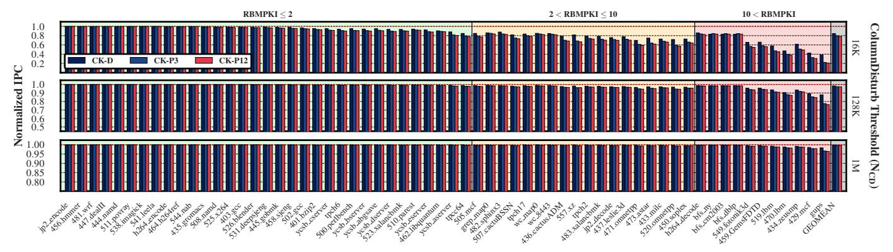
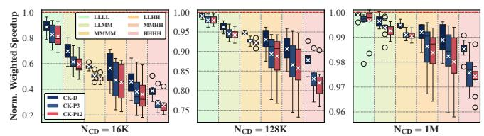
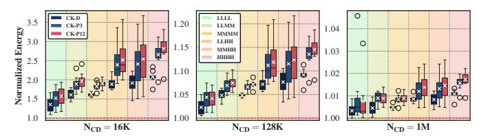
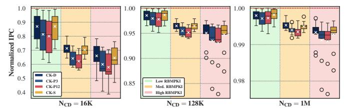

# **6.1. Single-Core Evaluation**

**6.1.1. Performance.** Figure 6 presents ColumnKeeper's performance impact on single-core workloads. The top, middle, and bottom subplots show results for  $N_{CD}{=}16K$ , 128K, and 1M, respectively. The x-axis depicts different workloads, organized from left to right by increasing RBMPKI. Different background colors denote different RBMPKI categories. The y-axis shows the instructions-per-cycle (IPC) of each workload normalized to a baseline with no ColumnDisturb mitigation.

We draw three major conclusions. First, for single-core workloads, at the current threshold (1M), CK-D, CK-P3, and CK-P12 incur small performance degradation with minimum normalized IPCs of 0.98, 0.97, and 0.96, respectively. Second, for  $N_{CD}\!=\!128K$ , all three variants retain good average performance with a geomean normalized IPC of 0.98, 0.97, and 0.97,

 $^8$ This reduction is negligible for the  $N_{CD}$  values that are evaluated in §6.

&lt;sup>9SALP-enabled systems use the MASA [152] SALP configuration.

&lt;sup>10PRAC [76–79,134,166] was introduced in the JEDEC DDR5 specification [78]. For fairness, all configurations that employ PRAC use DDR5.

Figure 6: Performance impact of ColumnKeeper on single-core workloads for three different ColumnDisturb thresholds.

respectively. However, in high-RBMPKI workloads, we observe that CK-P3 (CK-P12) shows non-negligible performance degradation. For example, the normalized IPC for gups is 0.78 (0.76). Third, for  $N_{CD}{=}16K$ , all mitigations incur significant performance degradation. Specifically, CK-D has a geomean normalized IPC of 0.84, while CK-P3 (CK-P12) has a geomean normalized IPC of 0.79 (0.78). To provide security at this very low threshold, CK-P3 (CK-P12) issues on average 1.70× (1.83×) more preventive refreshes than CK-D.

**6.1.2. Energy Consumption.** Figure 7 presents Column-Keeper's impact on energy consumption for single-core workloads, with results grouped by RBMPKI. The left, middle, and right subplots show results for  $N_{CD}$ =16K, 128K, and 1M, respectively. Each boxplot corresponds to a particular Column-Keeper variant and RBMPKI category (denoted by background color), and shows the distribution of energy consumption normalized to a baseline with no ColumnDisturb mitigation.

Figure 7: Effect of ColumnKeeper on DRAM energy consumption for single-core workloads.

We draw three major conclusions. First, at  $N_{CD}{=}1M$ , the average energy increase remains small (<2%) for all Column-Keeper variants. Second, at 128K, CK-D incurs a small increase, with an average (maximum) increase of 1.45% (9.04%), while CK-P3 and CK-P12 incur average (maximum) increases of 2.19% (17.82%) and 2.36% (19.08%), respectively. Third, at 16K, all variants significantly increase energy consumption by 16.26% for CK-D, 22.82% for CK-P3, and 24.69% for CK-P12, on average. At this threshold, we observe that due to CK-D not issuing any "unnecessary" refreshes, for the high RBMPKI category, it keeps the maximum energy increase to under  $2.00\times$ , compared to  $3.14\times$  for CK-P3 and  $3.33\times$  for CK-P12.

#### 6.2. Multi-Core Evaluation

**6.2.1. Performance.** Figure 8 presents ColumnKeeper's performance impact on multi-core workloads. The left, middle, and right subplots show results for  $N_{CD}{=}16K$ , 128K, and 1M, respectively. Each boxplot corresponds to a particular

ColumnKeeper variant and workload mix category (denoted by background color), and shows the distribution of weighted speedup normalized to a baseline with no mitigation.

Figure 8: Performance impact of ColumnKeeper on multi-core workloads for three different ColumnDisturb thresholds.

We make two key observations. First, ColumnKeeper incurs higher performance overheads for multi-core workloads (compared to single-core). For  $N_{CD}$ =128K, CK-D experiences a non-negligible average slowdown of 6.56%. CK-P3 and CK-P12 experience a higher average slowdown of 9.52% and 10.17%, respectively. Multi-core workloads generate more row-buffer conflicts, resulting in more preventive refreshes. Second, the difference in performance between CK-D and CK-P is more pronounced compared to single-core workloads. At a threshold of 128K (16K), CK-D has 3.61% (11.13%) higher normalized weighted speedup compared to CK-P12. In contrast, for singlecore workloads, this difference is 1.04% (6.19%). We attribute this to the different applications in our multi-core workload mixes, which may frequently access neighboring subarrays, resulting in more instances of "double-counting" (Figure 3), which CK-D accounts for but CK-P does not.

**6.2.2. Energy Consumption.** Figure 9 presents Column-Keeper's impact on DRAM energy consumption for multi-core workloads. The left, middle, and right subplots show results for  $N_{CD} = 16K$ , 128K, and 1M, respectively. Each boxplot corresponds to a particular ColumnKeeper variant and workload mix category (denoted by background color) and shows the distribution of energy consumption normalized to a baseline with no ColumnDisturb mitigation. At  $N_{CD} = 1M$ , all variants incur negligible energy consumption increases. When  $N_{CD} = 128K$ , CK-D increases average (maximum) energy consumption by 5.95% (11.27%). At this threshold, CK-P3 (CK-P12) increases average energy consumption by 8.83% (9.54%). For  $N_{CD} = 16K$ , all variants increase energy consumption significantly, with average values of  $1.72\times$ ,  $2.05\times$ , and  $2.15\times$  over the baseline for CK-D, CK-P3, and CK-P12, respectively.

Figure 9: Effect of ColumnKeeper on DRAM energy consumption for multi-core workloads.

#### 6.3. Evaluation under Adversarial Workloads

To evaluate ColumnKeeper's performance under adversarial workloads, we colocate single-core workloads with a synthetic workload that rapidly hammers rows across three consecutive subarrays to perform a ColumnDisturb attack. Figure 10 shows the performance impact of CK-D, CK-P, and CK-S (described in §5) under this adversarial scenario. The left, middle, and right subplots show results for  $N_{CD}{=}16K$ , 128K, and 1M, respectively. Each individual boxplot corresponds to a particular ColumnKeeper variant and RBMPKI category (denoted by background color), and shows the distribution of IPC, normalized to a baseline with no ColumnDisturb mitigation.

Figure 10: Performance impact of ColumnKeeper on single-core workloads colocated with adversarial workloads.

We make three key observations. First, all mechanisms incur low average performance overheads for  $N_{CD}=1M$  (<0.47%) or 128K (<3.68%). Second, at low thresholds (i.e., 16K), all mechanisms incur significant performance degradation  $(\geq 20.97\%)$  due to the higher number of preventive refreshes issued. Specifically, for CK-D, CK-S, and CK-P, when moving from a ColumnDisturb threshold of 128K to 16K, the number of preventive refreshes issued increases by  $10.47 \times$ ,  $10.92 \times$ , and  $11.08\times$ , respectively. Third, the single-counter design of CK-S represents a middle ground between CK-D and CK-P, as it deterministically tracks activations, but does not account for potential double-counting. As a result, for  $N_{CD}$ =16K, CK-S issues 5.06% (27.50%) more (fewer) refreshes than CK-D (CK-P12), on average. This induces an average IPC degradation of 20.97%, 21.52%, and 29.07% for CK-D, CK-S, and CK-P12, respectively. These results are in accordance with the observation made in §2.3.3, where double-counting was defined.

#### 6.4. RowHammer & ColumnDisturb

Figure 11 shows the performance impact of ColumnKeeper when combined with three state-of-the-art RowHammer mitigation mechanisms: Graphene [69], PRAC [76–79,134,166], and Hydra [105]. Within each subplot, the background color denotes the RBMPKI category. Each boxplot corresponds to a particular combination of RowHammer and ColumnDisturb mitigation mechanisms and shows the distribution of IPC across single-core workloads, normalized to a baseline with no RowHammer or ColumnDisturb mitigation. All mitigation

mechanisms operate transparently to each other, taking each other's preventive refreshes into account (§4.4).

Figure 11: Performance impact of ColumnKeeper with different RowHammer mitigations.  $N_{\rm CD}{=}128K, N_{\rm RH}{=}128.$ 

We make the following key observations. First, low-overhead RowHammer mitigations (e.g., Graphene [69]) do not significantly increase the performance overheads of ColumnKeeper. For example, CK-D + Graphene has an average (minimum) normalized IPC of 0.97 (0.78), compared to 0.98 (0.88) for CK-D without Graphene (§6.1). Second, CK-D (CK-P12) reduces normalized IPC by 1.70% (2.61%) on top of PRAC and 2.15% (3.08%) on top of Hydra, on average.

# **6.1. Single-Core Evaluation**

**6.1.1. Performance.** Figure 6 presents ColumnKeeper's performance impact on single-core workloads. The top, middle, and bottom subplots show results for  $N_{CD}{=}16K$ , 128K, and 1M, respectively. The x-axis depicts different workloads, organized from left to right by increasing RBMPKI. Different background colors denote different RBMPKI categories. The y-axis shows the instructions-per-cycle (IPC) of each workload normalized to a baseline with no ColumnDisturb mitigation.

We draw three major conclusions. First, for single-core workloads, at the current threshold (1M), CK-D, CK-P3, and CK-P12 incur small performance degradation with minimum normalized IPCs of 0.98, 0.97, and 0.96, respectively. Second, for  $N_{CD}\!=\!128K$ , all three variants retain good average performance with a geomean normalized IPC of 0.98, 0.97, and 0.97,

 $^8$ This reduction is negligible for the  $N_{CD}$  values that are evaluated in §6.

&lt;sup>9SALP-enabled systems use the MASA [152] SALP configuration.

&lt;sup>10PRAC [76–79,134,166] was introduced in the JEDEC DDR5 specification [78]. For fairness, all configurations that employ PRAC use DDR5.

Figure 6: Performance impact of ColumnKeeper on single-core workloads for three different ColumnDisturb thresholds.

respectively. However, in high-RBMPKI workloads, we observe that CK-P3 (CK-P12) shows non-negligible performance degradation. For example, the normalized IPC for gups is 0.78 (0.76). Third, for  $N_{CD}{=}16K$ , all mitigations incur significant performance degradation. Specifically, CK-D has a geomean normalized IPC of 0.84, while CK-P3 (CK-P12) has a geomean normalized IPC of 0.79 (0.78). To provide security at this very low threshold, CK-P3 (CK-P12) issues on average 1.70× (1.83×) more preventive refreshes than CK-D.

**6.1.2. Energy Consumption.** Figure 7 presents Column-Keeper's impact on energy consumption for single-core workloads, with results grouped by RBMPKI. The left, middle, and right subplots show results for  $N_{CD}$ =16K, 128K, and 1M, respectively. Each boxplot corresponds to a particular Column-Keeper variant and RBMPKI category (denoted by background color), and shows the distribution of energy consumption normalized to a baseline with no ColumnDisturb mitigation.

Figure 7: Effect of ColumnKeeper on DRAM energy consumption for single-core workloads.

We draw three major conclusions. First, at  $N_{CD}{=}1M$ , the average energy increase remains small (<2%) for all Column-Keeper variants. Second, at 128K, CK-D incurs a small increase, with an average (maximum) increase of 1.45% (9.04%), while CK-P3 and CK-P12 incur average (maximum) increases of 2.19% (17.82%) and 2.36% (19.08%), respectively. Third, at 16K, all variants significantly increase energy consumption by 16.26% for CK-D, 22.82% for CK-P3, and 24.69% for CK-P12, on average. At this threshold, we observe that due to CK-D not issuing any "unnecessary" refreshes, for the high RBMPKI category, it keeps the maximum energy increase to under  $2.00\times$ , compared to  $3.14\times$  for CK-P3 and  $3.33\times$  for CK-P12.

#### 6.2. Multi-Core Evaluation

**6.2.1. Performance.** Figure 8 presents ColumnKeeper's performance impact on multi-core workloads. The left, middle, and right subplots show results for  $N_{CD}{=}16K$ , 128K, and 1M, respectively. Each boxplot corresponds to a particular

ColumnKeeper variant and workload mix category (denoted by background color), and shows the distribution of weighted speedup normalized to a baseline with no mitigation.

Figure 8: Performance impact of ColumnKeeper on multi-core workloads for three different ColumnDisturb thresholds.

We make two key observations. First, ColumnKeeper incurs higher performance overheads for multi-core workloads (compared to single-core). For  $N_{CD}$ =128K, CK-D experiences a non-negligible average slowdown of 6.56%. CK-P3 and CK-P12 experience a higher average slowdown of 9.52% and 10.17%, respectively. Multi-core workloads generate more row-buffer conflicts, resulting in more preventive refreshes. Second, the difference in performance between CK-D and CK-P is more pronounced compared to single-core workloads. At a threshold of 128K (16K), CK-D has 3.61% (11.13%) higher normalized weighted speedup compared to CK-P12. In contrast, for singlecore workloads, this difference is 1.04% (6.19%). We attribute this to the different applications in our multi-core workload mixes, which may frequently access neighboring subarrays, resulting in more instances of "double-counting" (Figure 3), which CK-D accounts for but CK-P does not.

**6.2.2. Energy Consumption.** Figure 9 presents Column-Keeper's impact on DRAM energy consumption for multi-core workloads. The left, middle, and right subplots show results for  $N_{CD} = 16K$ , 128K, and 1M, respectively. Each boxplot corresponds to a particular ColumnKeeper variant and workload mix category (denoted by background color) and shows the distribution of energy consumption normalized to a baseline with no ColumnDisturb mitigation. At  $N_{CD} = 1M$ , all variants incur negligible energy consumption increases. When  $N_{CD} = 128K$ , CK-D increases average (maximum) energy consumption by 5.95% (11.27%). At this threshold, CK-P3 (CK-P12) increases average energy consumption by 8.83% (9.54%). For  $N_{CD} = 16K$ , all variants increase energy consumption significantly, with average values of  $1.72\times$ ,  $2.05\times$ , and  $2.15\times$  over the baseline for CK-D, CK-P3, and CK-P12, respectively.

Figure 9: Effect of ColumnKeeper on DRAM energy consumption for multi-core workloads.

#### 6.3. Evaluation under Adversarial Workloads

To evaluate ColumnKeeper's performance under adversarial workloads, we colocate single-core workloads with a synthetic workload that rapidly hammers rows across three consecutive subarrays to perform a ColumnDisturb attack. Figure 10 shows the performance impact of CK-D, CK-P, and CK-S (described in §5) under this adversarial scenario. The left, middle, and right subplots show results for  $N_{CD}{=}16K$ , 128K, and 1M, respectively. Each individual boxplot corresponds to a particular ColumnKeeper variant and RBMPKI category (denoted by background color), and shows the distribution of IPC, normalized to a baseline with no ColumnDisturb mitigation.

Figure 10: Performance impact of ColumnKeeper on single-core workloads colocated with adversarial workloads.

We make three key observations. First, all mechanisms incur low average performance overheads for  $N_{CD}=1M$  (<0.47%) or 128K (<3.68%). Second, at low thresholds (i.e., 16K), all mechanisms incur significant performance degradation  $(\geq 20.97\%)$  due to the higher number of preventive refreshes issued. Specifically, for CK-D, CK-S, and CK-P, when moving from a ColumnDisturb threshold of 128K to 16K, the number of preventive refreshes issued increases by  $10.47 \times$ ,  $10.92 \times$ , and  $11.08\times$ , respectively. Third, the single-counter design of CK-S represents a middle ground between CK-D and CK-P, as it deterministically tracks activations, but does not account for potential double-counting. As a result, for  $N_{CD}$ =16K, CK-S issues 5.06% (27.50%) more (fewer) refreshes than CK-D (CK-P12), on average. This induces an average IPC degradation of 20.97%, 21.52%, and 29.07% for CK-D, CK-S, and CK-P12, respectively. These results are in accordance with the observation made in §2.3.3, where double-counting was defined.

#### 6.4. RowHammer & ColumnDisturb

Figure 11 shows the performance impact of ColumnKeeper when combined with three state-of-the-art RowHammer mitigation mechanisms: Graphene [69], PRAC [76–79,134,166], and Hydra [105]. Within each subplot, the background color denotes the RBMPKI category. Each boxplot corresponds to a particular combination of RowHammer and ColumnDisturb mitigation mechanisms and shows the distribution of IPC across single-core workloads, normalized to a baseline with no RowHammer or ColumnDisturb mitigation. All mitigation

mechanisms operate transparently to each other, taking each other's preventive refreshes into account (§4.4).

Figure 11: Performance impact of ColumnKeeper with different RowHammer mitigations.  $N_{\rm CD}{=}128K, N_{\rm RH}{=}128.$ 

We make the following key observations. First, low-overhead RowHammer mitigations (e.g., Graphene [69]) do not significantly increase the performance overheads of ColumnKeeper. For example, CK-D + Graphene has an average (minimum) normalized IPC of 0.97 (0.78), compared to 0.98 (0.88) for CK-D without Graphene (§6.1). Second, CK-D (CK-P12) reduces normalized IPC by 1.70% (2.61%) on top of PRAC and 2.15% (3.08%) on top of Hydra, on average.

