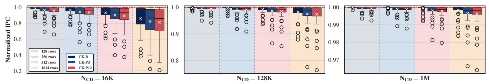
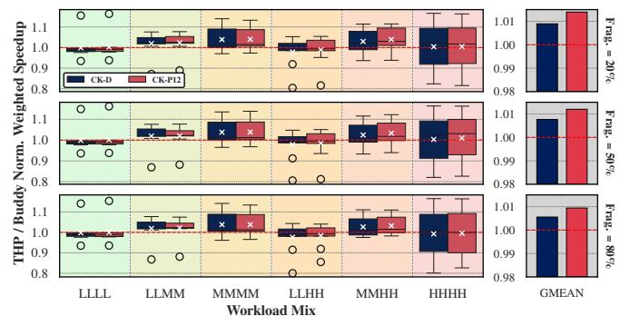

# 6.5. Sensitivity to DRAM Subarray Size

Figure 12 shows the impact of subarray size (S) on single-core performance with ColumnKeeper. The three subplots show results for  $N_{CD}{=}16K$  (left), 128K (middle), and 1M (right). We evaluate subarray sizes of 128, 256, 512, and 1K rows (denoted by different background colors). Each boxplot corresponds to a particular ColumnKeeper variant and subarray size, and shows the distribution of normalized IPC across all workloads, with respect to a baseline with no mitigation.

We observe that across all evaluated thresholds, the performance degradation of all mechanisms decreases significantly with smaller subarray sizes. This is expected from §4.1 and §4.2, as the subarray size S is inversely (positively) correlated with the preventive refresh threshold,  $N_{PR}$  of CK-D (preventive refresh probability,  $P_{PR}$  of CK-P). For  $N_{CD}$ =128K, when reducing the subarray size from 1K rows (as reported in [136]) to 256 rows, the average IPC degradation for CK-D and CK-P12 drops from 1.70% to 0.31%, and from 2.71% to 0.92%, respectively. With smaller subarrays, ColumnKeeper incurs relatively low overheads even at very low thresholds. For example, when S=128 and  $N_{CD}$ =16K, CK-D (CK-P12) incurs an average slowdown of 1.64% (4.34%) and a maximum of 12.57% (34.18%).

#### 6.6. Sensitivity to Physical Page Allocation

To understand the impact of physical page allocation on ColumnKeeper's performance, we evaluate CK-D and CK-P12 on multi-core workload mixes with: (i) the standard 4KB Buddy allocator [170], and (ii) a Transparent Huge Pages (THP)-like allocator [181,182] that attempts to allocate 2MB pages and falls back to 4KB pages. To decouple the performance impact of page allocation from address translation, we use zero-overhead address translation. Figure 13 shows ColumnKeeper's performance impact with both allocators at  $N_{CD}$ =128K. The top, middle, and bottom rows show results for memory fragmentation levels of 20%, 50%, and 80% at 2MB granularity (i.e., the ratio of free memory that *cannot* be allocated as 2MB-aligned contiguous blocks), respectively. Each boxplot (left) corresponds to a particular workload mix category (denoted by

Figure 12: Performance impact of ColumnKeeper across different subarray sizes for  $N_{\rm CD}$ =16K, 128K, and 1M.

background color), and shows the distribution of weighted speedup when using THP normalized to Buddy. Each barplot (right) shows the geomean across all workload mixes.

Figure 13: Weighted speedup of THP normalized to the Buddy allocator for different fragmentation levels at  $N_{\rm CD}{=}128K$ .

We observe that there is no significant performance difference between the two allocators at any fragmentation level. Specifically, for CK-D (CK-P12), the geomean normalized weighted speedup is 1.009 (1.014), 1.008 (1.012), and 1.006 (1.009) for fragmentation levels of 20%, 50%, and 80%, respectively.

#### 6.7. Evaluation with Subarray-Level Parallelism

Subarray-level parallelism (SALP) [152] is a DRAM microarchitecture modification that allows multiple subarrays (i.e., multiple row buffers) within the same bank to be activated simultaneously. SALP [88,152–154] improves performance by reducing the impact of bank conflicts. For ColumnKeeper, SALP allows preventive refreshes in one subarray to overlap with DRAM requests in other subarrays. Figure 14 shows ColumnKeeper's performance impact on a system that uses the MASA [152] SALP configuration. The left, middle, and right subplots show results for  $N_{CD}{=}16K$ , 128K, and 1M, respectively. Each boxplot corresponds to a particular MASA-enabled ColumnKeeper mechanism and RBMPKI category (denoted by background color), and shows the distribution of IPC across all single-core workloads, normalized to a MASA-enabled system with no ColumnDisturb mitigation.

Figure 14: Performance impact of ColumnKeeper in a system that employs MASA [152].

We make three key observations. First, at  $N_{CD}$ =1M, SALP-CK-D and SALP-CK-P incur negligible average (maximum)

performance overheads of 0.11% (1.43%) and 0.16% (1.92%), respectively. Second, for  $N_{CD}{=}128K$ , the overheads remain low, with average (maximum) values of 0.87% (10.71%) for SALP-CK-D and 1.20% (14.00%) for SALP-CK-P. Third, even at the very low threshold of 16K, SALP-CK-D (SALP-CK-P) mitigates ColumnDisturb with an average overhead of 7.87% (10.62%) and a maximum slowdown of 56.42% (65.34%). This is substantially lower than the maximum slowdowns of over 61.79% and 79.16% observed for the non-SALP CK-D and CK-P12 configurations (§6.1). We conclude that SALP alleviates ColumnKeeper's performance overheads.

# 6.5. Sensitivity to DRAM Subarray Size

Figure 12 shows the impact of subarray size (S) on single-core performance with ColumnKeeper. The three subplots show results for  $N_{CD}{=}16K$  (left), 128K (middle), and 1M (right). We evaluate subarray sizes of 128, 256, 512, and 1K rows (denoted by different background colors). Each boxplot corresponds to a particular ColumnKeeper variant and subarray size, and shows the distribution of normalized IPC across all workloads, with respect to a baseline with no mitigation.

We observe that across all evaluated thresholds, the performance degradation of all mechanisms decreases significantly with smaller subarray sizes. This is expected from §4.1 and §4.2, as the subarray size S is inversely (positively) correlated with the preventive refresh threshold,  $N_{PR}$  of CK-D (preventive refresh probability,  $P_{PR}$  of CK-P). For  $N_{CD}$ =128K, when reducing the subarray size from 1K rows (as reported in [136]) to 256 rows, the average IPC degradation for CK-D and CK-P12 drops from 1.70% to 0.31%, and from 2.71% to 0.92%, respectively. With smaller subarrays, ColumnKeeper incurs relatively low overheads even at very low thresholds. For example, when S=128 and  $N_{CD}$ =16K, CK-D (CK-P12) incurs an average slowdown of 1.64% (4.34%) and a maximum of 12.57% (34.18%).

#### 6.6. Sensitivity to Physical Page Allocation

To understand the impact of physical page allocation on ColumnKeeper's performance, we evaluate CK-D and CK-P12 on multi-core workload mixes with: (i) the standard 4KB Buddy allocator [170], and (ii) a Transparent Huge Pages (THP)-like allocator [181,182] that attempts to allocate 2MB pages and falls back to 4KB pages. To decouple the performance impact of page allocation from address translation, we use zero-overhead address translation. Figure 13 shows ColumnKeeper's performance impact with both allocators at  $N_{CD}$ =128K. The top, middle, and bottom rows show results for memory fragmentation levels of 20%, 50%, and 80% at 2MB granularity (i.e., the ratio of free memory that *cannot* be allocated as 2MB-aligned contiguous blocks), respectively. Each boxplot (left) corresponds to a particular workload mix category (denoted by

Figure 12: Performance impact of ColumnKeeper across different subarray sizes for  $N_{\rm CD}$ =16K, 128K, and 1M.

background color), and shows the distribution of weighted speedup when using THP normalized to Buddy. Each barplot (right) shows the geomean across all workload mixes.

Figure 13: Weighted speedup of THP normalized to the Buddy allocator for different fragmentation levels at  $N_{\rm CD}{=}128K$ .

We observe that there is no significant performance difference between the two allocators at any fragmentation level. Specifically, for CK-D (CK-P12), the geomean normalized weighted speedup is 1.009 (1.014), 1.008 (1.012), and 1.006 (1.009) for fragmentation levels of 20%, 50%, and 80%, respectively.

#### 6.7. Evaluation with Subarray-Level Parallelism

Subarray-level parallelism (SALP) [152] is a DRAM microarchitecture modification that allows multiple subarrays (i.e., multiple row buffers) within the same bank to be activated simultaneously. SALP [88,152–154] improves performance by reducing the impact of bank conflicts. For ColumnKeeper, SALP allows preventive refreshes in one subarray to overlap with DRAM requests in other subarrays. Figure 14 shows ColumnKeeper's performance impact on a system that uses the MASA [152] SALP configuration. The left, middle, and right subplots show results for  $N_{CD}{=}16K$ , 128K, and 1M, respectively. Each boxplot corresponds to a particular MASA-enabled ColumnKeeper mechanism and RBMPKI category (denoted by background color), and shows the distribution of IPC across all single-core workloads, normalized to a MASA-enabled system with no ColumnDisturb mitigation.

Figure 14: Performance impact of ColumnKeeper in a system that employs MASA [152].

We make three key observations. First, at  $N_{CD}$ =1M, SALP-CK-D and SALP-CK-P incur negligible average (maximum)

performance overheads of 0.11% (1.43%) and 0.16% (1.92%), respectively. Second, for  $N_{CD}{=}128K$ , the overheads remain low, with average (maximum) values of 0.87% (10.71%) for SALP-CK-D and 1.20% (14.00%) for SALP-CK-P. Third, even at the very low threshold of 16K, SALP-CK-D (SALP-CK-P) mitigates ColumnDisturb with an average overhead of 7.87% (10.62%) and a maximum slowdown of 56.42% (65.34%). This is substantially lower than the maximum slowdowns of over 61.79% and 79.16% observed for the non-SALP CK-D and CK-P12 configurations (§6.1). We conclude that SALP alleviates ColumnKeeper's performance overheads.

