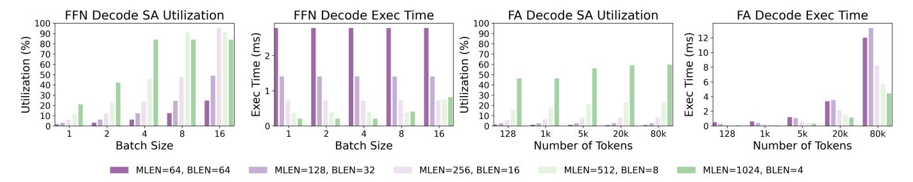
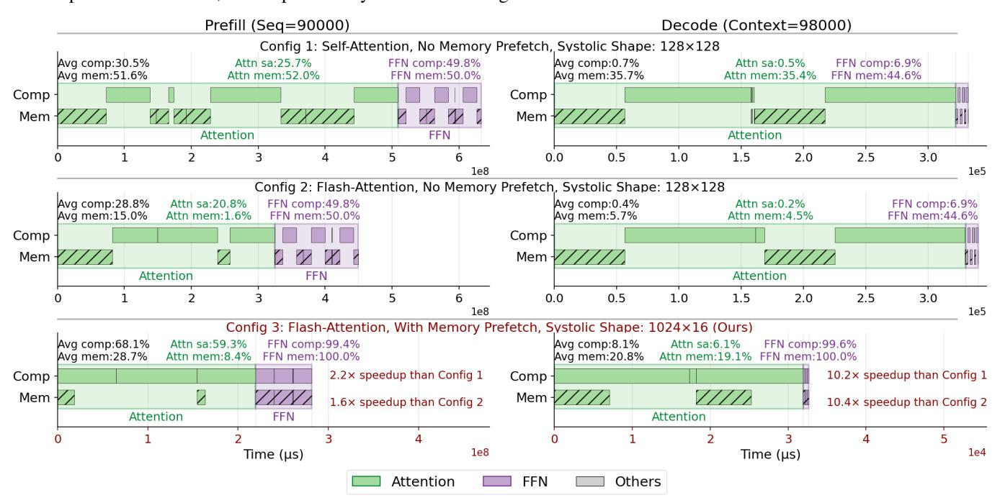
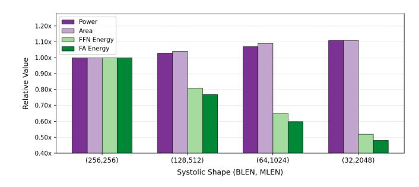

# *C. Preserving MX Perplexity via Clipping & Rotation*

*a) Main Results:* We evaluate our quantization method against related work; results are summarized in Table V. For a fair comparison, we first match prior settings by quantizing

TABLE VII: Zero-shot downstream task accuracy of LLaMA-3 models with 4-bit weight, activation, and KV quantization, evaluated on PIQA (PQ), WinoGrande (WG), HellaSwag (HS), Arc-Easy (A-e), Arc-Challenge (A-c), and LAMBADA (LA).

| Method       | PQ    | WG    | HS    | A-e   | A-c   | LA Avg.     |
|--------------|-------|-------|-------|-------|-------|----------------|
| LLaMA-3-8B   |       |       |       |       |       |                |
| FP16         | 80.74 | 72.77 | 79.06 | 77.82 | 53.33 | 75.63 73.22 |
| QuaRot [7]   | 75.14 | 65.82 | 72.94 | 68.01 | 43.34 | 65.81 65.18 |
| PLENA (ours) | 79.00 | 71.90 | 76.07 | 74.71 | 48.21 | 72.44 70.39 |
| LLaMA-3-70B  |       |       |       |       |       |                |
| FP16         | 84.66 | 80.51 | 84.89 | 85.86 | 64.25 | 79.47 79.94 |
| QuaRot       | 78.07 | 69.30 | 77.33 | 73.44 | 47.53 | 69.57 69.21 |
| PLENA (ours) | 82.48 | 77.51 | 83.47 | 78.54 | 57.17 | 78.05 76.20 |

TABLE VIII: Evaluation of long-context and agentic workloads across code generation (HumanEval [12]), mathematical reasoning (GSM8K [15]), and function-calling (BFCL-Web Search Base [51]) benchmarks. W/A/KV denotes bit widths for weights, activations, and KV cache.

| Model / Method | W/A/KV   | HumanEval pass@1 ↑ | GSM8K EM ↑ | BFCL-W Acc ↑ |
|----------------|----------|-----------------------|---------------|-----------------|
| Baseline       | 16/16/16 | 89.6                  | 97.85         | 27.0            |
| PLENA (ours)   | 4/4/4    | 84.1                  | 97.85         | 24.0            |

only the nine GEMMs in the decoder. In the W4A4KV16 setting, our results outperform all related work. For LLAMA-3-8B, compared to prior approaches, our method achieves at least a 1.24× reduction in perplexity. We also evaluated the result with the quantized vector cores. We find that quantizing the remaining operators to a MiniFloat E6M5 format is effectively lossless in perplexity while reducing memory footprint by 25% relative to FP16. The key contributions to this performance improvement come from two aspects: 1) Outputnorm guided blockwise clipping search: by integrating *output-norm guided*, blockwise clipping into iterative weight quantization, we validate that output reconstruction error correlates strongly with end-task performance; consequently, our approach substantially reduces perplexity degradation. 2) Selective rotation: Our approach searches for the best layerwise rotation combination for each model. Unlike QuaRoT [7], which merges rotation into weights, we apply online rotation only to specific layers.

*b) Abalation Study:* To further assess the impact of our key contributions, we conduct an ablation study on LLAMA-3-8B to validate the effectiveness of 1) Output-norm guided blockwise clipping search and 2) Selective rotation. The ablation is structured into three stages: (i) *weight-only* quantization, (ii) *activation & KV-cache* quantization on top of quantized weights, and (iii) *full-system* emulation where all MX-aware operators are quantized. We show them in Table VI.

First, MXFP4 always underperforms MXINT4 in all settings. Motivated by this, we adopt MXINT as the default data type for all subsequent evaluations. Second, for weight-only quantization, we show that rotation generally hurts performance – they are simply not compatible with microscaling arithmetic. Furthermore, we demonstrate that our output-norm

TABLE IX: Ablation study of quantization techniqeus on Qwen3 model across HumanEval, GSM8K, and BFCL-Web Search Base. Erry denotes output-norm clipping. Qwen3- 8B on HumanEval and GSM8K, Qwen3-32B on BFCL-Web Search Base. Results for HumanEval and GSM8K use Qwen3- 8B; results for BFCL-Web Search Base use Qwen3-32B, as its higher baseline accuracy better isolates the effect of quantization.

| Configuration        | HumanEval pass@1 ↑ | GSM8K EM ↑ | BFCL-W Acc ↑ |
|----------------------|-----------------------|---------------|-----------------|
| Baseline (FP16)      | 84.8                  | 90.9          | 27              |
| W-only INT4 (RTN)    | 82.9                  | 88.7          | 22              |
| + ACT & KV INT4      | 72.0                  | 74.4          | 15              |
| + GPTQ               | 73.2                  | 87.7          | 24              |
| + Erry Clip       | 74.4                  | 88.6          | 24              |
| + Selective Rotation | 78.7                  | 88.8          | 24              |

TABLE X: Impact of quantization configurations on memory footprint and bandwidth for LLAMA-3.3-70B under the OSWorld-L workload (90k prefill, 8k output tokens) in Table XIII with batch size B = 8. W/A/KV denote the bit precision of weights, activations, and KV cache, respectively.

| W/A/KV (bits)           | 16/16/16 | 4/16/16 | 4/4/16 | 4/4/4 |
|-------------------------|----------|---------|--------|-------|
| Peak Bandwidth (GB/s)   | 8192     | 8192    | 5120   | 2048  |
| KV Cache Footprint (GB) | 239.26   | 239.26  | 239.26 | 59.81 |
| Weight Storage (GB)     | 129.46   | 32.36   | 32.36  | 32.36 |

guided block-wise clipping (Erry) achieves better performance compared to weight-error guided block-wise clipping (Errw). Third, selective rotation effectively enhances activation and KV quantization for both MXFP4 and MXINT4. This is different from our observations with weight quantization, where rotation negatively impacts perplexity. We hypothesize this arises from the broader numerical range found in activation and KV values, which benefits from rotation's ability to temper the presence of outliers. Finally, our full-system results confirm that both *block-wise clipping search* and *selective activation rotation* improve the overall performance.

#### *D. Improving Utilization via Flattened Systolic Arrays*

The utilization analysis of PLENA's flattened systolic array for the FFN and FlashAttention (FA) layers of the LLAMA-3-8B model is summarized in Figure 12. Results for the prefilling stage are omitted because both FFN and FA operate at near-maximum utilization during this phase. For FlashAttention, the computation pattern is independent of batch size, so it is not included in this table. For FFN, the computation for FFN is less important with the growth of generated token length, hence not included as well.

The DC synthesis results are reported in Table XI. These results show that the flattened systolic array achieves higher compute-resource utilization for both the FFN and FlashAttention layers compared with prior accelerators. Furthermore, Section V-D demonstrates that the flattened systolic organi-

Fig. 12: The systolic array reaches optimal utilization in the FFN layer when its block length (BLEN) aligns with the batch size. FA = Flash Attention. SA = systolic array. For FA, flattening the array enhances utilization by allowing parallel processing of multiple attention heads, and is particularly efficient for long-context inference with smaller effective batch sizes.

Fig. 13: This figure shows the timing performance breakdown of PLENA across the prefill and decode stages for the LLAMA-3.3-70B model with a batch size of 16. The breakdown includes compute active time (Comp), memory active time (Mem), systolic array (SA) utilization, and memory bandwidth utilization across the overall inference flow. With on-chip FlashAttention support, large intermediate activations are retained on-chip rather than written to off-chip memory, substantially reducing memory traffic, while memory prefetching hides most data-access latency. In addition, the flattened systolic array configuration maintains high utilization across both prefill and decode stages. For attention workloads, the flattened array achieves high compute and memory utilization by enabling parallel multi-head execution and head preloading.

zation provides higher energy efficiency, despite some power and area overhead compared with conventional square arrays.

The overall ablation study of the systolic-array optimizations is presented in Figure 13. The results show that the flattened systolic array, combined with native FlashAttention support, significantly reduces the execution time of both attention and FFN components across the prefill and decode phases, particularly for long-context inference.

#### E. System Performance Analysis

The system-level performance comparison is shown in Table XII, evaluating both small and large GQA-based LLaMA models as well as the recently published MoE-based GPT-OSS

TABLE XI: Compute area, utilization, and attainable FLOPs for systolic arrays. Baselines use  $64 \times 64$ ; PLENA uses  $4 \times 1024$ . S.A = Standard Attainable FLOPs in GSM8K (1.4k/200); <math>A.A = Agentic Attainable FLOPs in OSWorld-L workload (90k/8k) in Table XIII

| Metric                       | MicroscopiQ [54] | Olive [27] | FIGNA [34] | PLENA |
|------------------------------|------------------|------------|------------|-------|
| Comp Area (mm 2 ) | 0.1378           | 0.319      | 0.471      | 0.237 |
| TOPs/mm 2         | 59.45            | 25.66      | 17.39      | 34.49 |
| S.A FLOPs/mm 2 *  | 3.36             | 1.60       | 7.51       | 29.31 |
| A.A FLOPs/mm 2 *  | 1.08             | 0.40       | 6.71       | 12.81 |

model and Qwen3-32B and supporting long-context inputs. The performance results for PLENA and MicroScopiQ are obtained using our transactional simulator, modeling perfor-

TABLE XII: System-level comparison across workloads in Table XIII. Performance evaluation occurs under full HBMcapacity utilization, setting the batch size (BS) to the largest fitting value per workload-hardware pair. Note: We reproduced MicroScopiQ [54] and deployed its compute unit on the PLENA platform for testing. And for GPT-OSS 20B (MoE) [6] and Qwen3-32B [64], the remaining accelerators and TPUs are not included since they do not support these configurations [68].

|                  |                                         |                      |            |      |       |                      | LLAMA-3.1-8B  |    |       |                         |       |                       |       |                         |       |    |
|------------------|-----------------------------------------|----------------------|------------|------|-------|----------------------|---------------|----|-------|-------------------------|-------|-----------------------|-------|-------------------------|-------|----|
|                  | (1.4k, 0.2k) (114k, 5k) (90k, 8k) |                      |            |      |       |                      |               |    |       |                         |       | (90k, 8k) Equal Batch |       |                         |       |    |
| System           |                                         | TTFT (s) TPS (×A100) | Tok/J      | BS   |       | TTFT (s) TPS (×A100) | Tok/J         |    |       | BS TTFT (s) TPS (×A100) | Tok/J |                       |       | BS TTFT (s) TPS (×A100) | Tok/J | BS |
| A100             | 0.68                                    | 1.00x                | 1.00x 2048 |      | 7.40  | 1.00x                | 1.00x         | 16 | 5.00  | 1.00x                   | 1.00x | 16                    | 5.00  | 1.00x                   | 1.00x | 16 |
| A100 QuaRot [7]  | 0.73                                    | 1.12x                | 1.12x 4096 |      | 8.63  | 1.10x                | 1.10x         | 32 | 5.97  | 1.14x                   | 1.14x | 32                    | 4.79  | 1.08x                   | 1.08x | 16 |
| H100             | 2.42                                    | 1.65x                | 0.94x 2048 |      | 2.66  | 2.50x                | 1.43x         | 16 | 1.83  | 2.48x                   | 1.41x | 16                    | 1.83  | 2.48x                   | 1.41x | 16 |
| H100 QuaRot [7]  | 2.51                                    | 1.77x                | 1.01x 4096 |      | 2.97  | 2.57x                | 1.47x         | 32 | 2.01  | 2.55x                   | 1.46x | 32                    | 1.77  | 2.51x                   | 1.43x | 16 |
| TPU v6e          | 5.61                                    | 0.88x                | N/A        | 2048 | 7.58  | 0.51x                | N/A           | 16 | 7.23  | 0.53x                   | N/A   | 16                    | 7.23  | 0.53x                   | N/A   | 16 |
| MicroScopiQ [54] | 3.47                                    | 0.83x                | 1.67x 8192 |      | 21.28 | 0.37x                | 0.74x         | 64 | 19.13 | 0.39x                   | 0.78x | 64                    | 4.93  | 0.27x                   | 0.54x | 16 |
| PLENA            | 3.41                                    | 1.91x                | 3.50x 8192 |      | 20.13 | 1.45x                | 2.66x         | 64 | 18.87 | 1.45x                   | 2.65x | 64                    | 4.68  | 1.17x                   | 2.10x | 16 |
|                  |                                         |                      |            |      |       |                      | LLAMA-3.3-70B |    |       |                         |       |                       |       |                         |       |    |
|                  |                                         | (1.4k, 0.2k)         |            |      |       | (114k, 5k)           |               |    |       | (90k, 8k)               |       |                       |       | (90k, 8k) Equal Batch   |       |    |
| System           |                                         | TTFT (s) TPS (×A100) | Tok/J      | BS   |       | TTFT (s) TPS (×A100) | Tok/J         |    |       | BS TTFT (s) TPS (×A100) | Tok/J |                       |       | BS TTFT (s) TPS (×A100) | Tok/J | BS |
| A100             | 0.78                                    | 1.00x                | 1.00x      | 256  | 43.18 | 1.00x                | 1.00x         | 4  | 29.67 | 1.00x                   | 1.00x | 4                     | 29.67 | 1.00x                   | 1.00x | 4  |
| A100 QuaRot [7]  | 1.17                                    | 1.08x                | 1.08x      | 512  | 42.89 | 1.13x                | 1.13x         | 8  | 32.17 | 1.13x                   | 1.13x | 8                     | 27.69 | 1.11x                   | 1.11x | 4  |
| H100             | 0.34                                    | 2.34x                | 1.34x      | 256  | 14.30 | 2.13x                | 1.21x         | 4  | 10.10 | 2.04x                   | 1.22x | 4                     | 10.10 | 2.04x                   | 1.22x | 4  |
| H100 QuaRot [7]  | 0.44                                    | 2.36x                | 1.35x      | 512  | 16.12 | 2.19x                | 1.25x         | 8  | 11.37 | 2.14x                   | 1.22x | 8                     | 9.88  | 2.08x                   | 1.18x | 4  |
| TPU v6e          | 11.7                                    | 0.85x                | N/A        | 256  | 41.96 | 0.46x                | N/A           | 4  | 37.61 | 0.47x                   | N/A   | 4                     | 37.61 | 0.47x                   | N/A   | 4  |
| MicroScopiQ [54] | 8.32                                    | 0.79                 | 1.59x 1024 |      | 73.28 | 0.20x                | 0.41x         | 16 | 49    | 0.17x                   | 0.35x | 16                    | 23.93 | 0.11x                   | 0.23x | 4  |
| PLENA            | 7.58                                    | 1.82x                | 3.32x 1024 |      | 69.10 | 2.23x                | 4.07x         | 16 | 43.43 | 2.21x                   | 4.04x | 16                    | 21.68 | 1.34x                   | 2.45x | 4  |
|                  |                                         |                      |            |      |       | GPT-OSS 20B (MoE)    |               |    |       |                         |       |                       |       |                         |       |    |
|                  |                                         | (1.4k, 0.2k)         |            |      |       | (114k, 5k)           |               |    |       | (90k, 8k)               |       |                       |       | (90k, 8k) Equal Batch   |       |    |
| System           |                                         | TTFT (s) TPS (×A100) | Tok/J      | BS   |       | TTFT (s) TPS (×A100) | Tok/J         |    |       | BS TTFT (s) TPS (×A100) | Tok/J |                       |       | BS TTFT (s) TPS (×A100) | Tok/J | BS |
| A100             | 1.46                                    | 1.00x                | 1.00x 1024 |      | 11.81 | 1.00x                | 1.00x         | 8  | 8.05  | 1.00x                   | 1.00x | 8                     | 8.05  | 1.00x                   | 1.00x | 8  |
| H100             | 4.03                                    | 0.89x                | 0.51x 1024 |      | 1.85  | 3.10x                | 1.78x         | 8  | 1.38  | 2.90x                   | 1.66x | 8                     | 1.38  | 2.90x                   | 1.66x | 8  |
| PLENA            | 13.41                                   | 1.15x                | 2.10x 4096 |      | 47.63 | 1.96x                | 3.58x         | 64 | 41.08 | 1.93x                   | 3.52x | 64                    | 9.77  | 0.99x                   | 1.79x | 8  |
|                  |                                         |                      |            |      |       |                      | Qwen3-32B     |    |       |                         |       |                       |       |                         |       |    |
|                  |                                         | (1.4k, 0.2k)         |            |      |       | (114k, 5k)           |               |    |       | (90k, 8k)               |       |                       |       | (90k, 8k) Equal Batch   |       |    |

System TTFT (s) TPS (×A100) Tok/J BS TTFT (s) TPS (×A100) Tok/J BS TTFT (s) TPS (×A100) Tok/J BS TTFT (s) TPS (×A100) Tok/J BS A100 0.88 1.00x 1.00x 1024 28.90 1.00x 1.00x 8 19.19 1.00x 1.00x 8 19.19 1.00x 1.00x 8 H100 1.19 2.13x 1.22x 1024 9.24 2.29x 1.31x 8 6.29 2.21x 1.26x 8 6.29 2.21x 1.26x 8 PLENA 4.38 1.40x 2.56x 4096 108.1 1.22x 2.23x 64 90.71 1.23x 2.25x 64 23.14 1.14x 2.08x 8

Fig. 14: Power and area comparison of matrix units with different systolic array shapes. Although the flattened systolic array incurs slightly higher area and power, its higher utilization leads to significantly lower effective energy consumption for FFN and attention workloads in the agentic task OSWorld-L.

TABLE XIII: Token usage (prefill/output) across benchmarks: GSM8K [76], BFCL-Web Search Base [52], OSWorld Libre-Office (OSWorld-L) [72].

|                  |      |      | GSM8K BFCL-W OSWorld-L |
|------------------|------|------|------------------------|
| Prefill (Tokens) | 1.4k | 114k | 90k                    |
| Output (Tokens)  | 0.2k | 5k   | 8k                     |

mance in a 7 nm technology node. For fairness, we conduct a system-level comparison against a 4×A100 SXM GPU system (80 GB HBM and 1.99 TB/s bandwidth per GPU), a 4×H100 SXM GPU system (80 GB HBM and 3.35 TB/s bandwidth per GPU), and a 16×TPU v6e system (32 GB HBM and 1.56 TB/s bandwidth per device). Both PLENA and MicroScopiQ are modeled as 16-accelerator systems with aggregate HBM capacity and bandwidth equivalent to the TPU system. To account for GPUs' non-compute components, the number of devices is determined by approximately aligning multiplier counts rather than silicon area. The co-designselected PLENA configuration—(BLEN = 32, MLEN = 2048, VLEN = 2048, Precision W/A/KV = 4/4/4)—demonstrates improved performance across all evaluated workloads.

As shown, PLENA achieves higher TPS than both the A100 and TPU v6e under identical HBM settings and multiplier counts, reaching up to 2.23×that of the A100 and 4.70× that of the TPU v6e for agentic workload. The higher TTFT observed in PLENA is explained by its ability to store more batches within the same HBM capacity using our quantization scheme. As batch size increases, the prefill stage grows longer due to additional memory accesses and computation.

# *C. Preserving MX Perplexity via Clipping & Rotation*

*a) Main Results:* We evaluate our quantization method against related work; results are summarized in Table V. For a fair comparison, we first match prior settings by quantizing

TABLE VII: Zero-shot downstream task accuracy of LLaMA-3 models with 4-bit weight, activation, and KV quantization, evaluated on PIQA (PQ), WinoGrande (WG), HellaSwag (HS), Arc-Easy (A-e), Arc-Challenge (A-c), and LAMBADA (LA).

| Method       | PQ    | WG    | HS    | A-e   | A-c   | LA Avg.     |
|--------------|-------|-------|-------|-------|-------|----------------|
| LLaMA-3-8B   |       |       |       |       |       |                |
| FP16         | 80.74 | 72.77 | 79.06 | 77.82 | 53.33 | 75.63 73.22 |
| QuaRot [7]   | 75.14 | 65.82 | 72.94 | 68.01 | 43.34 | 65.81 65.18 |
| PLENA (ours) | 79.00 | 71.90 | 76.07 | 74.71 | 48.21 | 72.44 70.39 |
| LLaMA-3-70B  |       |       |       |       |       |                |
| FP16         | 84.66 | 80.51 | 84.89 | 85.86 | 64.25 | 79.47 79.94 |
| QuaRot       | 78.07 | 69.30 | 77.33 | 73.44 | 47.53 | 69.57 69.21 |
| PLENA (ours) | 82.48 | 77.51 | 83.47 | 78.54 | 57.17 | 78.05 76.20 |

TABLE VIII: Evaluation of long-context and agentic workloads across code generation (HumanEval [12]), mathematical reasoning (GSM8K [15]), and function-calling (BFCL-Web Search Base [51]) benchmarks. W/A/KV denotes bit widths for weights, activations, and KV cache.

| Model / Method | W/A/KV   | HumanEval pass@1 ↑ | GSM8K EM ↑ | BFCL-W Acc ↑ |
|----------------|----------|-----------------------|---------------|-----------------|
| Baseline       | 16/16/16 | 89.6                  | 97.85         | 27.0            |
| PLENA (ours)   | 4/4/4    | 84.1                  | 97.85         | 24.0            |

only the nine GEMMs in the decoder. In the W4A4KV16 setting, our results outperform all related work. For LLAMA-3-8B, compared to prior approaches, our method achieves at least a 1.24× reduction in perplexity. We also evaluated the result with the quantized vector cores. We find that quantizing the remaining operators to a MiniFloat E6M5 format is effectively lossless in perplexity while reducing memory footprint by 25% relative to FP16. The key contributions to this performance improvement come from two aspects: 1) Outputnorm guided blockwise clipping search: by integrating *output-norm guided*, blockwise clipping into iterative weight quantization, we validate that output reconstruction error correlates strongly with end-task performance; consequently, our approach substantially reduces perplexity degradation. 2) Selective rotation: Our approach searches for the best layerwise rotation combination for each model. Unlike QuaRoT [7], which merges rotation into weights, we apply online rotation only to specific layers.

*b) Abalation Study:* To further assess the impact of our key contributions, we conduct an ablation study on LLAMA-3-8B to validate the effectiveness of 1) Output-norm guided blockwise clipping search and 2) Selective rotation. The ablation is structured into three stages: (i) *weight-only* quantization, (ii) *activation & KV-cache* quantization on top of quantized weights, and (iii) *full-system* emulation where all MX-aware operators are quantized. We show them in Table VI.

First, MXFP4 always underperforms MXINT4 in all settings. Motivated by this, we adopt MXINT as the default data type for all subsequent evaluations. Second, for weight-only quantization, we show that rotation generally hurts performance – they are simply not compatible with microscaling arithmetic. Furthermore, we demonstrate that our output-norm

TABLE IX: Ablation study of quantization techniqeus on Qwen3 model across HumanEval, GSM8K, and BFCL-Web Search Base. Erry denotes output-norm clipping. Qwen3- 8B on HumanEval and GSM8K, Qwen3-32B on BFCL-Web Search Base. Results for HumanEval and GSM8K use Qwen3- 8B; results for BFCL-Web Search Base use Qwen3-32B, as its higher baseline accuracy better isolates the effect of quantization.

| Configuration        | HumanEval pass@1 ↑ | GSM8K EM ↑ | BFCL-W Acc ↑ |
|----------------------|-----------------------|---------------|-----------------|
| Baseline (FP16)      | 84.8                  | 90.9          | 27              |
| W-only INT4 (RTN)    | 82.9                  | 88.7          | 22              |
| + ACT & KV INT4      | 72.0                  | 74.4          | 15              |
| + GPTQ               | 73.2                  | 87.7          | 24              |
| + Erry Clip       | 74.4                  | 88.6          | 24              |
| + Selective Rotation | 78.7                  | 88.8          | 24              |

TABLE X: Impact of quantization configurations on memory footprint and bandwidth for LLAMA-3.3-70B under the OSWorld-L workload (90k prefill, 8k output tokens) in Table XIII with batch size B = 8. W/A/KV denote the bit precision of weights, activations, and KV cache, respectively.

| W/A/KV (bits)           | 16/16/16 | 4/16/16 | 4/4/16 | 4/4/4 |
|-------------------------|----------|---------|--------|-------|
| Peak Bandwidth (GB/s)   | 8192     | 8192    | 5120   | 2048  |
| KV Cache Footprint (GB) | 239.26   | 239.26  | 239.26 | 59.81 |
| Weight Storage (GB)     | 129.46   | 32.36   | 32.36  | 32.36 |

guided block-wise clipping (Erry) achieves better performance compared to weight-error guided block-wise clipping (Errw). Third, selective rotation effectively enhances activation and KV quantization for both MXFP4 and MXINT4. This is different from our observations with weight quantization, where rotation negatively impacts perplexity. We hypothesize this arises from the broader numerical range found in activation and KV values, which benefits from rotation's ability to temper the presence of outliers. Finally, our full-system results confirm that both *block-wise clipping search* and *selective activation rotation* improve the overall performance.

#### *D. Improving Utilization via Flattened Systolic Arrays*

The utilization analysis of PLENA's flattened systolic array for the FFN and FlashAttention (FA) layers of the LLAMA-3-8B model is summarized in Figure 12. Results for the prefilling stage are omitted because both FFN and FA operate at near-maximum utilization during this phase. For FlashAttention, the computation pattern is independent of batch size, so it is not included in this table. For FFN, the computation for FFN is less important with the growth of generated token length, hence not included as well.

The DC synthesis results are reported in Table XI. These results show that the flattened systolic array achieves higher compute-resource utilization for both the FFN and FlashAttention layers compared with prior accelerators. Furthermore, Section V-D demonstrates that the flattened systolic organi-

Fig. 12: The systolic array reaches optimal utilization in the FFN layer when its block length (BLEN) aligns with the batch size. FA = Flash Attention. SA = systolic array. For FA, flattening the array enhances utilization by allowing parallel processing of multiple attention heads, and is particularly efficient for long-context inference with smaller effective batch sizes.

Fig. 13: This figure shows the timing performance breakdown of PLENA across the prefill and decode stages for the LLAMA-3.3-70B model with a batch size of 16. The breakdown includes compute active time (Comp), memory active time (Mem), systolic array (SA) utilization, and memory bandwidth utilization across the overall inference flow. With on-chip FlashAttention support, large intermediate activations are retained on-chip rather than written to off-chip memory, substantially reducing memory traffic, while memory prefetching hides most data-access latency. In addition, the flattened systolic array configuration maintains high utilization across both prefill and decode stages. For attention workloads, the flattened array achieves high compute and memory utilization by enabling parallel multi-head execution and head preloading.

zation provides higher energy efficiency, despite some power and area overhead compared with conventional square arrays.

The overall ablation study of the systolic-array optimizations is presented in Figure 13. The results show that the flattened systolic array, combined with native FlashAttention support, significantly reduces the execution time of both attention and FFN components across the prefill and decode phases, particularly for long-context inference.

#### E. System Performance Analysis

The system-level performance comparison is shown in Table XII, evaluating both small and large GQA-based LLaMA models as well as the recently published MoE-based GPT-OSS

TABLE XI: Compute area, utilization, and attainable FLOPs for systolic arrays. Baselines use  $64 \times 64$ ; PLENA uses  $4 \times 1024$ . S.A = Standard Attainable FLOPs in GSM8K (1.4k/200); <math>A.A = Agentic Attainable FLOPs in OSWorld-L workload (90k/8k) in Table XIII

| Metric                       | MicroscopiQ [54] | Olive [27] | FIGNA [34] | PLENA |
|------------------------------|------------------|------------|------------|-------|
| Comp Area (mm 2 ) | 0.1378           | 0.319      | 0.471      | 0.237 |
| TOPs/mm 2         | 59.45            | 25.66      | 17.39      | 34.49 |
| S.A FLOPs/mm 2 *  | 3.36             | 1.60       | 7.51       | 29.31 |
| A.A FLOPs/mm 2 *  | 1.08             | 0.40       | 6.71       | 12.81 |

model and Qwen3-32B and supporting long-context inputs. The performance results for PLENA and MicroScopiQ are obtained using our transactional simulator, modeling perfor-

TABLE XII: System-level comparison across workloads in Table XIII. Performance evaluation occurs under full HBMcapacity utilization, setting the batch size (BS) to the largest fitting value per workload-hardware pair. Note: We reproduced MicroScopiQ [54] and deployed its compute unit on the PLENA platform for testing. And for GPT-OSS 20B (MoE) [6] and Qwen3-32B [64], the remaining accelerators and TPUs are not included since they do not support these configurations [68].

|                  |                                         |                      |            |      |       |                      | LLAMA-3.1-8B  |    |       |                         |       |                       |       |                         |       |    |
|------------------|-----------------------------------------|----------------------|------------|------|-------|----------------------|---------------|----|-------|-------------------------|-------|-----------------------|-------|-------------------------|-------|----|
|                  | (1.4k, 0.2k) (114k, 5k) (90k, 8k) |                      |            |      |       |                      |               |    |       |                         |       | (90k, 8k) Equal Batch |       |                         |       |    |
| System           |                                         | TTFT (s) TPS (×A100) | Tok/J      | BS   |       | TTFT (s) TPS (×A100) | Tok/J         |    |       | BS TTFT (s) TPS (×A100) | Tok/J |                       |       | BS TTFT (s) TPS (×A100) | Tok/J | BS |
| A100             | 0.68                                    | 1.00x                | 1.00x 2048 |      | 7.40  | 1.00x                | 1.00x         | 16 | 5.00  | 1.00x                   | 1.00x | 16                    | 5.00  | 1.00x                   | 1.00x | 16 |
| A100 QuaRot [7]  | 0.73                                    | 1.12x                | 1.12x 4096 |      | 8.63  | 1.10x                | 1.10x         | 32 | 5.97  | 1.14x                   | 1.14x | 32                    | 4.79  | 1.08x                   | 1.08x | 16 |
| H100             | 2.42                                    | 1.65x                | 0.94x 2048 |      | 2.66  | 2.50x                | 1.43x         | 16 | 1.83  | 2.48x                   | 1.41x | 16                    | 1.83  | 2.48x                   | 1.41x | 16 |
| H100 QuaRot [7]  | 2.51                                    | 1.77x                | 1.01x 4096 |      | 2.97  | 2.57x                | 1.47x         | 32 | 2.01  | 2.55x                   | 1.46x | 32                    | 1.77  | 2.51x                   | 1.43x | 16 |
| TPU v6e          | 5.61                                    | 0.88x                | N/A        | 2048 | 7.58  | 0.51x                | N/A           | 16 | 7.23  | 0.53x                   | N/A   | 16                    | 7.23  | 0.53x                   | N/A   | 16 |
| MicroScopiQ [54] | 3.47                                    | 0.83x                | 1.67x 8192 |      | 21.28 | 0.37x                | 0.74x         | 64 | 19.13 | 0.39x                   | 0.78x | 64                    | 4.93  | 0.27x                   | 0.54x | 16 |
| PLENA            | 3.41                                    | 1.91x                | 3.50x 8192 |      | 20.13 | 1.45x                | 2.66x         | 64 | 18.87 | 1.45x                   | 2.65x | 64                    | 4.68  | 1.17x                   | 2.10x | 16 |
|                  |                                         |                      |            |      |       |                      | LLAMA-3.3-70B |    |       |                         |       |                       |       |                         |       |    |
|                  |                                         | (1.4k, 0.2k)         |            |      |       | (114k, 5k)           |               |    |       | (90k, 8k)               |       |                       |       | (90k, 8k) Equal Batch   |       |    |
| System           |                                         | TTFT (s) TPS (×A100) | Tok/J      | BS   |       | TTFT (s) TPS (×A100) | Tok/J         |    |       | BS TTFT (s) TPS (×A100) | Tok/J |                       |       | BS TTFT (s) TPS (×A100) | Tok/J | BS |
| A100             | 0.78                                    | 1.00x                | 1.00x      | 256  | 43.18 | 1.00x                | 1.00x         | 4  | 29.67 | 1.00x                   | 1.00x | 4                     | 29.67 | 1.00x                   | 1.00x | 4  |
| A100 QuaRot [7]  | 1.17                                    | 1.08x                | 1.08x      | 512  | 42.89 | 1.13x                | 1.13x         | 8  | 32.17 | 1.13x                   | 1.13x | 8                     | 27.69 | 1.11x                   | 1.11x | 4  |
| H100             | 0.34                                    | 2.34x                | 1.34x      | 256  | 14.30 | 2.13x                | 1.21x         | 4  | 10.10 | 2.04x                   | 1.22x | 4                     | 10.10 | 2.04x                   | 1.22x | 4  |
| H100 QuaRot [7]  | 0.44                                    | 2.36x                | 1.35x      | 512  | 16.12 | 2.19x                | 1.25x         | 8  | 11.37 | 2.14x                   | 1.22x | 8                     | 9.88  | 2.08x                   | 1.18x | 4  |
| TPU v6e          | 11.7                                    | 0.85x                | N/A        | 256  | 41.96 | 0.46x                | N/A           | 4  | 37.61 | 0.47x                   | N/A   | 4                     | 37.61 | 0.47x                   | N/A   | 4  |
| MicroScopiQ [54] | 8.32                                    | 0.79                 | 1.59x 1024 |      | 73.28 | 0.20x                | 0.41x         | 16 | 49    | 0.17x                   | 0.35x | 16                    | 23.93 | 0.11x                   | 0.23x | 4  |
| PLENA            | 7.58                                    | 1.82x                | 3.32x 1024 |      | 69.10 | 2.23x                | 4.07x         | 16 | 43.43 | 2.21x                   | 4.04x | 16                    | 21.68 | 1.34x                   | 2.45x | 4  |
|                  |                                         |                      |            |      |       | GPT-OSS 20B (MoE)    |               |    |       |                         |       |                       |       |                         |       |    |
|                  |                                         | (1.4k, 0.2k)         |            |      |       | (114k, 5k)           |               |    |       | (90k, 8k)               |       |                       |       | (90k, 8k) Equal Batch   |       |    |
| System           |                                         | TTFT (s) TPS (×A100) | Tok/J      | BS   |       | TTFT (s) TPS (×A100) | Tok/J         |    |       | BS TTFT (s) TPS (×A100) | Tok/J |                       |       | BS TTFT (s) TPS (×A100) | Tok/J | BS |
| A100             | 1.46                                    | 1.00x                | 1.00x 1024 |      | 11.81 | 1.00x                | 1.00x         | 8  | 8.05  | 1.00x                   | 1.00x | 8                     | 8.05  | 1.00x                   | 1.00x | 8  |
| H100             | 4.03                                    | 0.89x                | 0.51x 1024 |      | 1.85  | 3.10x                | 1.78x         | 8  | 1.38  | 2.90x                   | 1.66x | 8                     | 1.38  | 2.90x                   | 1.66x | 8  |
| PLENA            | 13.41                                   | 1.15x                | 2.10x 4096 |      | 47.63 | 1.96x                | 3.58x         | 64 | 41.08 | 1.93x                   | 3.52x | 64                    | 9.77  | 0.99x                   | 1.79x | 8  |
|                  |                                         |                      |            |      |       |                      | Qwen3-32B     |    |       |                         |       |                       |       |                         |       |    |
|                  |                                         | (1.4k, 0.2k)         |            |      |       | (114k, 5k)           |               |    |       | (90k, 8k)               |       |                       |       | (90k, 8k) Equal Batch   |       |    |

System TTFT (s) TPS (×A100) Tok/J BS TTFT (s) TPS (×A100) Tok/J BS TTFT (s) TPS (×A100) Tok/J BS TTFT (s) TPS (×A100) Tok/J BS A100 0.88 1.00x 1.00x 1024 28.90 1.00x 1.00x 8 19.19 1.00x 1.00x 8 19.19 1.00x 1.00x 8 H100 1.19 2.13x 1.22x 1024 9.24 2.29x 1.31x 8 6.29 2.21x 1.26x 8 6.29 2.21x 1.26x 8 PLENA 4.38 1.40x 2.56x 4096 108.1 1.22x 2.23x 64 90.71 1.23x 2.25x 64 23.14 1.14x 2.08x 8

Fig. 14: Power and area comparison of matrix units with different systolic array shapes. Although the flattened systolic array incurs slightly higher area and power, its higher utilization leads to significantly lower effective energy consumption for FFN and attention workloads in the agentic task OSWorld-L.

TABLE XIII: Token usage (prefill/output) across benchmarks: GSM8K [76], BFCL-Web Search Base [52], OSWorld Libre-Office (OSWorld-L) [72].

|                  |      |      | GSM8K BFCL-W OSWorld-L |
|------------------|------|------|------------------------|
| Prefill (Tokens) | 1.4k | 114k | 90k                    |
| Output (Tokens)  | 0.2k | 5k   | 8k                     |

mance in a 7 nm technology node. For fairness, we conduct a system-level comparison against a 4×A100 SXM GPU system (80 GB HBM and 1.99 TB/s bandwidth per GPU), a 4×H100 SXM GPU system (80 GB HBM and 3.35 TB/s bandwidth per GPU), and a 16×TPU v6e system (32 GB HBM and 1.56 TB/s bandwidth per device). Both PLENA and MicroScopiQ are modeled as 16-accelerator systems with aggregate HBM capacity and bandwidth equivalent to the TPU system. To account for GPUs' non-compute components, the number of devices is determined by approximately aligning multiplier counts rather than silicon area. The co-designselected PLENA configuration—(BLEN = 32, MLEN = 2048, VLEN = 2048, Precision W/A/KV = 4/4/4)—demonstrates improved performance across all evaluated workloads.

As shown, PLENA achieves higher TPS than both the A100 and TPU v6e under identical HBM settings and multiplier counts, reaching up to 2.23×that of the A100 and 4.70× that of the TPU v6e for agentic workload. The higher TTFT observed in PLENA is explained by its ability to store more batches within the same HBM capacity using our quantization scheme. As batch size increases, the prefill stage grows longer due to additional memory accesses and computation.

