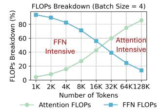
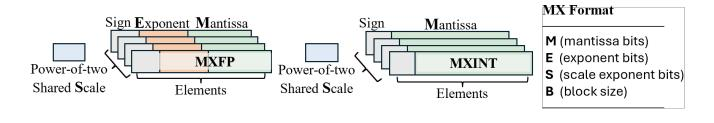
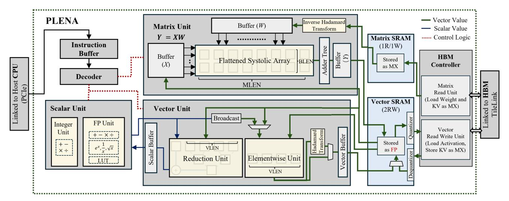

# Combating the Memory Walls: Optimization Pathways for Long-Context Agentic LLM Inference

Haoran Wu1 , Can Xiao2 , Jiayi Nie1 , Xuan Guo2 , Binglei Lou2 , Jeffrey T.H. Wong2 , Zhiwen Mo2 , Cheng Zhang2 , Przemyslaw Forys2 , Chengyang Ai3 , Timi Adeniran1 , Wayne Luk2 , Hongxiang Fan2 , Jianyi Cheng3 , Timothy M. Jones1 , Rika Antonova1 , Robert Mullins1 , Aaron Zhao2 1University of Cambridge 2 Imperial College London 3University of Edinburgh

*Abstract*—LLMs now form the backbone of AI agents for a diverse array of applications, including tool use, commandline interfaces, and web or computer interaction. These agentic LLM inference tasks are fundamentally different from chatbotfocused inference — they often have much larger context lengths to capture complex, prolonged inputs, such as an entire webpage DOM or complicated tool call trajectories. This, in turn, generates significant off-chip memory traffic for hardware at the inference stage and causes the workload to be constrained by the two memory walls, namely the *bandwidth* and *capacity* walls, preventing the compute units from achieving high utilization.

In this paper, we introduce PLENA, a hardware–software codesigned system that applies three core optimization pathways. PLENA features a novel flattened systolic-array architecture (*Pathway 1*) and efficient compute and memory units that support an asymmetric quantization scheme (*Pathway 2*). It also provides native support for FlashAttention (*Pathway 3*). In addition, PLENA is developed with a complete software–hardware stack, including a custom ISA, a compiler, a transaction-level simulator, and an automated design-space exploration flow. Experimental results show that PLENA delivers up to 2.23× and 4.70× higher throughput than the A100 GPU and TPU v6e, respectively, under identical multiplier counts and memory configurations during LLaMA agentic inference. PLENA also achieves up to 4.04× higher energy efficiency than A100 GPU. The full PLENA system—including its simulator, compiler, ISA, and RTL implementation—will be open-sourced to the research community.

## I. INTRODUCTION

Transformers have revolutionized AI across various fields, including language, vision, and science [37], [67], [70]. Transformer-based autoregressive large language models (LLMs), like GPT [50] and LLaMA [65], are now widely deployed in many applications, such as chatbots [49], code generation [35], tool-use and computer-use workflows [48].

The rapid rise of agentic capabilities of LLMs, e.g. computer-use [42], tool-use [30], [47], and command-line agents [2], heavily relies on their ability to process and reason over very large context windows. For instance, command-line agents need to both comprehend and generate large-scale codebases [33], [55], [74], while tool- and computer-use agentic workflows must keep track of multiple pieces of information across prolonged inputs—such as a complete web page DOM—which typically require very long contexts [13], [19], [38]. Figure 1(a) shows that, when compared to chatbot workloads, agentic workloads consume 100× more tokens per inference on average and up to 1,000× in extreme. In response, modern LLMs have delibrately expanded their

(a) Token usage comparison across standard chatbot [76], [79], coding [11], [20], and agentic workloads, including Computer Use Agent (CUA) [3], [72] and Web Use Agent (WUA) [10], [72].

(b) Compute intensity shifts from FFN to Attention blocks with an increasing context length.

(c) KV cache scales with context length, eventually dominates memory usage.

Fig. 1: An illustration of agentic inference workloads shows how they typically generate many more tokens per single inference run (a), contain both FFN-compute-intensive and attention-compute-intensive phases (b), and include weight memory-capacity-dominant and KV-dominant phases (c) within a single inference run.

context windows: the original GPT-3 [9] supports roughly 2K tokens, whereas GPT-4 [50] reaches up to 32K tokens, and LLAMA-4-Maverick [4] to 1M tokens.

To clarify the computational impact of agentic workloads, Figure 1(b) analyzes a LLAMA-3-70B model with long-context capability and demonstrates that, when the number of generated tokens is small, the Feed-Forward Networks (FFNs) contribute most of the inference FLOPs. As the number of generated tokens increases, however, the attention layers gradually dominate FLOP counts. Because inference is autoregressive, these two computational phases naturally coexist within a single long-context decoding run. For example, in the LongWriter [8] workload, the prefilling phase completes at around 5K tokens, after which the decoding phase expands the context to a large value – 85K tokens. As the sequence grows, the computational intensity (in FLOPs) start to transition from FFN-dominated to attention-dominated, with the crossover occurring at roughly 19K generated tokens, as shown in Figure 1(b). This shift makes both FFN and attention layers practical and necessary targets for optimization.

Agentic LLM inference also consumes significant HBM resources. Figure 1(c) identifies two major limiting factors on the memory side. First, the large number of KV values and weights that must be read, together with the portion of KV values written back, impose substantial memory bandwidth demands. Second, as context length increases, the KV-cache requirement grows linearly, quickly increasing memory usage and often surpassing the size of the model weights, making HBM capacity a primary limiting factor. For example, in LLAMA-3-70B, at a 128k context [46], the FP16 KV cache for a single batch is approximately 39 GB, which limits how many batches can be kept on the chip [25]. Building on this observation, we suggest that there are two main challenges on the off-chip memory side, namely, (i) the limited memory bandwidth and (ii) the restricted memory capacity. We collectively term these memory walls. Together, they prevent devices from reaching peak performance at inference time, consistent with observations in prior work [18], [25], [77].

The memory wall phenomenon leads to the underutilization of computing resources on modern hardware, such as TPUs and GPUs. This effect is particularly evident in compute units dedicated to General Matrix-Matrix Multiplication (GEMM) operations  $(\mathbb{R}^{M \times K} \times \mathbb{R}^{K \times N} \to \mathbb{R}^{M \times N})$ , denoted as  $(M, K) \times$ (K, N), which constitute the core computational workload during LLM inference [28]. At the microarchitectural level, most hardware is built with square-shaped systolic arrays or matrix multiplication units, typically designed so that the Mand N dimensions are close in size to K. For example, TPU v3 [26] features a 128×128 systolic array, supporting M=K=N=128 GEMM operations. However, in longcontext agentic models, as shown in Figure 1(c), memory often becomes the primary constrain for the inference batch size. This results in a fat GEMM operation, where the batch-related dimension (typically M in  $(M, K) \times (K, N)$ ) is much smaller than the other operating dimension. This essentially produces an uneven matrix shape1. This imbalance hinders systolic arrays and Tensor Cores from achieving a high computational resources utilization rate [31].

To this end, we propose the Programmable Long-context Efficient Neural Accelerator (PLENA), an efficient transformer model accelerator system designed to maintain high utilization of GEMM units across all inference stages (prefilling and decoding), particularly for agentic LLM inference tasks with large contexts. PLENA achieves high efficiency

(a) PLENA achieves higher utilization than the standard square systolic array with the same resources. (b) PLENA's optimization pathways—(1) a flattened systolic array and (2) asymmetric quantization—together achieve improved effective memory bandwidth utilization and help reduce memory capacity limitations.

Fig. 2: A comparison of attainable FLOPs between a square-shaped systolic array (e.g. TPUs) and PLENA's when using the same number of multipliers2.

for long-context inference by exploring three optimization pathways across both hardware and software design spaces.

First, our novel flattened systolic array (Pathway 1) resolves the architectural mismatch caused by the typical squareshaped GEMM used for inference, achieving a higher compute utilization of multiplication resources as illustrated in Figures 2(a) and 2(b). Second, we apply an asymmetric quantization strategy with Post-Training Quantization (PTQ) optimizations (Pathway 2), where Weights(W)/Activations(A)/KV Cache(KV) can be set to different precisions to alleviate both memory bandwidth and capacity walls. With more aggressive W and KV cache quantization, we free up more space in HBM for data scaling (e.g., supporting larger batch sizes). Figure 2 shows how these pathways together can increase the utilization compared to the conventional square-shaped GEMM hardware without any optimization. Finally, as Figure 1(b) shows that attention dominates the compute at longer context lengths, we design PLENA's custom ISA and novel architecture to effectively support FlashAttention (Pathway 3)—an IO-aware, fused attention algorithm that substantially reduces off-chip memory traffic [16]. This reduces the likelihood of attention operations saturating memory bandwidth, thereby diminishing the wall's effect.

Together, these optimization pathways yield significantly higher utilization than conventional square-shaped systolicarray accelerators. The main contributions are as follows:

- We analytically characterize the bandwidth and capacity memory walls in agentic LLM inference and show that existing systolic-array accelerators are normally heavily under-utilized when running agentic workloads.
- We introduce three optimization pathways that jointly address the under-utilization caused by memory walls: (i) a flattened systolic array architecture; (ii) an asymmetric quantization scheme, coupled with an in-depth exploration of micro-scaling arithmetic's compatibility with optimization techniques such as rotation and norm-guided iterative

 $^{1}$ All KVs must be stored, so the batch size (the M dimension) is kept lower than the hidden size (K). While various offloading techniques are available [5], they complicate system-level trade-offs and tend to make the system more memory I/O-bound.

&lt;sup>264×64 square-shaped systolic array and 8×512 flattened systolic array. Data derived from 144 GB HBM capacity and 512 GB/s memory bandwidth.

optimization; and (iii) a native support for FlashAttention. Together, these enable a holistic approach that addresses both bandwidth and capacity limitations by integrating hardware-level and algorithmic optimizations.

• We present PLENA, a complete hardware–software system that realizes the above optimizations. PLENA integrates: (i) a custom instruction set (PLENA ISA) for large Transformer inference; (ii) a PyTorch-to-PLENA ISA compiler; (iii) an HBM-enabled transactional simulator; (iv) an automated, accuracy-aware design-space exploration (DSE) flow; and (v) a full RTL implementation. We demonstrate that PLENA supports different SOTA transformer model variants (e.g., GQA, MHA and MLA [44], Dense and MoE [6]). We also show that PLENA achieves superior efficiency for agentic LLM inference. Under identical multiplier counts and memory configurations during LLaMA agentic inference, PLENA delivers up to 2.23× and 4.70× higher throughput than the A100 GPU and TPU v6e, respectively, and up to 4.04× higher energy efficiency (Token/J) than the A100. The entire PLENA system will be fully opensourced upon acceptance.

## II. BACKGROUND AND RELATED WORK

#### *A. Microscaling Data Formats*

The concept of block data representation was introduced to collectively represent groups of values using shared scaling factors [17]. Building on this idea, Rouhani *et al.* [58] proposed the Microscaling (MX) data format as a specific variant of block data formats, where each block of elements shares a common scale encoded in an E8M0 power-of-two format. MX formats have since been standardized by the Open Compute Project [56]. Recent extensions explore multi-level scaling, where scaling factors are applied hierarchically across granularities. MicroScopiQ [54] adopts a two-level scaling scheme with coarse block-level and finer micro-block-level scales, while NVFP4 [1] employs a similar hierarchy, using a tensor-level E8M23 scale and block-level E4M3 scale. To balance hardware complexity and software performance, we adopt a single-level scaling scheme in our configurable MX data format, with tunable parameters (M, E, S, B) for MXFP and (M, S, B) for MXINT, illustrated in Figure 3.

Fig. 3: Illustration of the configurable MX data format design, parameterized with tunable configs. Each block of elements shares a power-of-two scaling factor and supports both integer and minifloat data types.

#### *B. Co-designing PTQ with Microscaling Data Formats*

Existing off-the-shelf Post-Training Quantization (PTQ) methods are well-studied for integer data formats [7], [22]. However, we find that these methods are less explored—and in some cases, not directly applicable—to the MX data format.

GPTQ [22] was originally developed for integer quantization. We explore its adaptation to our parameterized MX data formats and propose a variant method that better adapts it to the MX format. Details are deferred to Section IV-B. Rotationbased PTQ methods are among the most effective techniques for mitigating activation outliers. QuaRot [7] demonstrated that the application of the Hadamard transformation can effectively suppress such outliers. However, we empirically experimented and found that without careful treatment, the direct application of these methods can lead to significant model performance degradation for MX data formats. Details are deferred to Section IV-C. Overall, our co-designed PTQ and data format achieves performance competitive with fullprecision baselines, even under aggressive low-bit settings, as demonstrated in Section V-C.

## *C. FlashAttention*

FlashAttention optimizes memory I/O in the standard attention layer [16]. In a standard attention layer, computing QK⊤ produces a prohibitively large square matrix, often thousands by thousands in size. Because on-chip memory cannot hold this intermediate result, it must be written to offchip memory and later reloaded for the subsequent softmax and P V steps, which significantly degrades performance. FlashAttention avoids this round trip by tiling and fusing the attention computation (GEMM–Softmax–GEMM) so that all intermediate results fit on-chip.

Most existing systolic-array–based accelerators do not natively support FlashAttention. SystolicAttention [41] is among the first to integrate FlashAttention into a systolic architecture by deploying the FlashAttention into the hardware. In contrast, PLENA adopts a more flexible approach, enabling aggressive memory prefetching overlap and leveraging a mixed-precision supported flattened systolic array with head-level decomposition to achieve higher compute utilization and efficiency. As discussed in Section III-F, we identify three key architectural capabilities required to efficiently support FlashAttention.

#### *D. Accelerators and Their Quantization Supports*

Recent LLM accelerators [24], [27], [29], [32], [34], [39], [53], [54], [75] explore diverse architectural trade-offs across compute organization, kernel specialization, and system integration. However, many of these designs focus on accelerating specific kernels (e.g., GEMM or attention) rather than supporting the full Transformer inference pipeline, often requiring offloading of unsupported operations to external processors. Such partial coverage can introduce additional data movement and limit sustained utilization under long-context inference workloads. PLENA instead targets full Transformer inference directly on the accelerator fabric.

Prior works have also explored hardware and quantization co-design [27], [29], [32], [54], [73]. MicroScopiQ [54] adopts GPTQ for two-level MX quantization. ANT and MANT [29], [32] propose hybrid data formats that adapt quantization mode to input distributions at runtime. OliVe [27] handles outliers by pairing them with adjacent low-magnitude weights.

Fig. 4: PLENA accelerator architecture overview. Execution is controlled by the decoder's system-pipeline controller, which derives control signals from decoded instructions and monitors memory dependencies. For example, if the current instruction needs to read from a Vector SRAM row that is still being updated by the vector or matrix unit, the controller inserts a stall to ensure correctness. Vector SRAM acts as the on-chip scratchpad to the matrix and vector units.

However, these works mostly focus on weight and activation quantization, without jointly addressing KV cache quantization under long-context inference scenarios. PLENA, by contrast, is the first to natively support tunable MX formats with both hardware friendly QuaRot [7] and GPTQ [22] while targeting long-context workloads natively.

Prior work such as Scale-Sim [60] supports the simulation of flattened systolic arrays for DNN inference, while SARA [59] explores reconfigurable array shapes to optimize general DNN workloads. However, these approaches do not explicitly consider the characteristics of autoregressive Transformer inference. PLENA instead adopts a workloaddriven design that reshapes the systolic organization to address the imbalance between FlashAttention and FFN computation under memory-constrained batching. The flattened array is further optimized for FlashAttention via head-level decomposition, enabling efficient acceleration of both FFN and attention during prefill and decode while maintaining high utilization for both standard and long-context (agentic) inference.

# Combating the Memory Walls: Optimization Pathways for Long-Context Agentic LLM Inference

Haoran Wu1 , Can Xiao2 , Jiayi Nie1 , Xuan Guo2 , Binglei Lou2 , Jeffrey T.H. Wong2 , Zhiwen Mo2 , Cheng Zhang2 , Przemyslaw Forys2 , Chengyang Ai3 , Timi Adeniran1 , Wayne Luk2 , Hongxiang Fan2 , Jianyi Cheng3 , Timothy M. Jones1 , Rika Antonova1 , Robert Mullins1 , Aaron Zhao2 1University of Cambridge 2 Imperial College London 3University of Edinburgh

*Abstract*—LLMs now form the backbone of AI agents for a diverse array of applications, including tool use, commandline interfaces, and web or computer interaction. These agentic LLM inference tasks are fundamentally different from chatbotfocused inference — they often have much larger context lengths to capture complex, prolonged inputs, such as an entire webpage DOM or complicated tool call trajectories. This, in turn, generates significant off-chip memory traffic for hardware at the inference stage and causes the workload to be constrained by the two memory walls, namely the *bandwidth* and *capacity* walls, preventing the compute units from achieving high utilization.

In this paper, we introduce PLENA, a hardware–software codesigned system that applies three core optimization pathways. PLENA features a novel flattened systolic-array architecture (*Pathway 1*) and efficient compute and memory units that support an asymmetric quantization scheme (*Pathway 2*). It also provides native support for FlashAttention (*Pathway 3*). In addition, PLENA is developed with a complete software–hardware stack, including a custom ISA, a compiler, a transaction-level simulator, and an automated design-space exploration flow. Experimental results show that PLENA delivers up to 2.23× and 4.70× higher throughput than the A100 GPU and TPU v6e, respectively, under identical multiplier counts and memory configurations during LLaMA agentic inference. PLENA also achieves up to 4.04× higher energy efficiency than A100 GPU. The full PLENA system—including its simulator, compiler, ISA, and RTL implementation—will be open-sourced to the research community.

## I. INTRODUCTION

Transformers have revolutionized AI across various fields, including language, vision, and science [37], [67], [70]. Transformer-based autoregressive large language models (LLMs), like GPT [50] and LLaMA [65], are now widely deployed in many applications, such as chatbots [49], code generation [35], tool-use and computer-use workflows [48].

The rapid rise of agentic capabilities of LLMs, e.g. computer-use [42], tool-use [30], [47], and command-line agents [2], heavily relies on their ability to process and reason over very large context windows. For instance, command-line agents need to both comprehend and generate large-scale codebases [33], [55], [74], while tool- and computer-use agentic workflows must keep track of multiple pieces of information across prolonged inputs—such as a complete web page DOM—which typically require very long contexts [13], [19], [38]. Figure 1(a) shows that, when compared to chatbot workloads, agentic workloads consume 100× more tokens per inference on average and up to 1,000× in extreme. In response, modern LLMs have delibrately expanded their

(a) Token usage comparison across standard chatbot [76], [79], coding [11], [20], and agentic workloads, including Computer Use Agent (CUA) [3], [72] and Web Use Agent (WUA) [10], [72].

(b) Compute intensity shifts from FFN to Attention blocks with an increasing context length.

(c) KV cache scales with context length, eventually dominates memory usage.

Fig. 1: An illustration of agentic inference workloads shows how they typically generate many more tokens per single inference run (a), contain both FFN-compute-intensive and attention-compute-intensive phases (b), and include weight memory-capacity-dominant and KV-dominant phases (c) within a single inference run.

context windows: the original GPT-3 [9] supports roughly 2K tokens, whereas GPT-4 [50] reaches up to 32K tokens, and LLAMA-4-Maverick [4] to 1M tokens.

To clarify the computational impact of agentic workloads, Figure 1(b) analyzes a LLAMA-3-70B model with long-context capability and demonstrates that, when the number of generated tokens is small, the Feed-Forward Networks (FFNs) contribute most of the inference FLOPs. As the number of generated tokens increases, however, the attention layers gradually dominate FLOP counts. Because inference is autoregressive, these two computational phases naturally coexist within a single long-context decoding run. For example, in the LongWriter [8] workload, the prefilling phase completes at around 5K tokens, after which the decoding phase expands the context to a large value – 85K tokens. As the sequence grows, the computational intensity (in FLOPs) start to transition from FFN-dominated to attention-dominated, with the crossover occurring at roughly 19K generated tokens, as shown in Figure 1(b). This shift makes both FFN and attention layers practical and necessary targets for optimization.

Agentic LLM inference also consumes significant HBM resources. Figure 1(c) identifies two major limiting factors on the memory side. First, the large number of KV values and weights that must be read, together with the portion of KV values written back, impose substantial memory bandwidth demands. Second, as context length increases, the KV-cache requirement grows linearly, quickly increasing memory usage and often surpassing the size of the model weights, making HBM capacity a primary limiting factor. For example, in LLAMA-3-70B, at a 128k context [46], the FP16 KV cache for a single batch is approximately 39 GB, which limits how many batches can be kept on the chip [25]. Building on this observation, we suggest that there are two main challenges on the off-chip memory side, namely, (i) the limited memory bandwidth and (ii) the restricted memory capacity. We collectively term these memory walls. Together, they prevent devices from reaching peak performance at inference time, consistent with observations in prior work [18], [25], [77].

The memory wall phenomenon leads to the underutilization of computing resources on modern hardware, such as TPUs and GPUs. This effect is particularly evident in compute units dedicated to General Matrix-Matrix Multiplication (GEMM) operations  $(\mathbb{R}^{M \times K} \times \mathbb{R}^{K \times N} \to \mathbb{R}^{M \times N})$ , denoted as  $(M, K) \times$ (K, N), which constitute the core computational workload during LLM inference [28]. At the microarchitectural level, most hardware is built with square-shaped systolic arrays or matrix multiplication units, typically designed so that the Mand N dimensions are close in size to K. For example, TPU v3 [26] features a 128×128 systolic array, supporting M=K=N=128 GEMM operations. However, in longcontext agentic models, as shown in Figure 1(c), memory often becomes the primary constrain for the inference batch size. This results in a fat GEMM operation, where the batch-related dimension (typically M in  $(M, K) \times (K, N)$ ) is much smaller than the other operating dimension. This essentially produces an uneven matrix shape1. This imbalance hinders systolic arrays and Tensor Cores from achieving a high computational resources utilization rate [31].

To this end, we propose the Programmable Long-context Efficient Neural Accelerator (PLENA), an efficient transformer model accelerator system designed to maintain high utilization of GEMM units across all inference stages (prefilling and decoding), particularly for agentic LLM inference tasks with large contexts. PLENA achieves high efficiency

(a) PLENA achieves higher utilization than the standard square systolic array with the same resources. (b) PLENA's optimization pathways—(1) a flattened systolic array and (2) asymmetric quantization—together achieve improved effective memory bandwidth utilization and help reduce memory capacity limitations.

Fig. 2: A comparison of attainable FLOPs between a square-shaped systolic array (e.g. TPUs) and PLENA's when using the same number of multipliers2.

for long-context inference by exploring three optimization pathways across both hardware and software design spaces.

First, our novel flattened systolic array (Pathway 1) resolves the architectural mismatch caused by the typical squareshaped GEMM used for inference, achieving a higher compute utilization of multiplication resources as illustrated in Figures 2(a) and 2(b). Second, we apply an asymmetric quantization strategy with Post-Training Quantization (PTQ) optimizations (Pathway 2), where Weights(W)/Activations(A)/KV Cache(KV) can be set to different precisions to alleviate both memory bandwidth and capacity walls. With more aggressive W and KV cache quantization, we free up more space in HBM for data scaling (e.g., supporting larger batch sizes). Figure 2 shows how these pathways together can increase the utilization compared to the conventional square-shaped GEMM hardware without any optimization. Finally, as Figure 1(b) shows that attention dominates the compute at longer context lengths, we design PLENA's custom ISA and novel architecture to effectively support FlashAttention (Pathway 3)—an IO-aware, fused attention algorithm that substantially reduces off-chip memory traffic [16]. This reduces the likelihood of attention operations saturating memory bandwidth, thereby diminishing the wall's effect.

Together, these optimization pathways yield significantly higher utilization than conventional square-shaped systolicarray accelerators. The main contributions are as follows:

- We analytically characterize the bandwidth and capacity memory walls in agentic LLM inference and show that existing systolic-array accelerators are normally heavily under-utilized when running agentic workloads.
- We introduce three optimization pathways that jointly address the under-utilization caused by memory walls: (i) a flattened systolic array architecture; (ii) an asymmetric quantization scheme, coupled with an in-depth exploration of micro-scaling arithmetic's compatibility with optimization techniques such as rotation and norm-guided iterative

 $^{1}$ All KVs must be stored, so the batch size (the M dimension) is kept lower than the hidden size (K). While various offloading techniques are available [5], they complicate system-level trade-offs and tend to make the system more memory I/O-bound.

&lt;sup>264×64 square-shaped systolic array and 8×512 flattened systolic array. Data derived from 144 GB HBM capacity and 512 GB/s memory bandwidth.

optimization; and (iii) a native support for FlashAttention. Together, these enable a holistic approach that addresses both bandwidth and capacity limitations by integrating hardware-level and algorithmic optimizations.

• We present PLENA, a complete hardware–software system that realizes the above optimizations. PLENA integrates: (i) a custom instruction set (PLENA ISA) for large Transformer inference; (ii) a PyTorch-to-PLENA ISA compiler; (iii) an HBM-enabled transactional simulator; (iv) an automated, accuracy-aware design-space exploration (DSE) flow; and (v) a full RTL implementation. We demonstrate that PLENA supports different SOTA transformer model variants (e.g., GQA, MHA and MLA [44], Dense and MoE [6]). We also show that PLENA achieves superior efficiency for agentic LLM inference. Under identical multiplier counts and memory configurations during LLaMA agentic inference, PLENA delivers up to 2.23× and 4.70× higher throughput than the A100 GPU and TPU v6e, respectively, and up to 4.04× higher energy efficiency (Token/J) than the A100. The entire PLENA system will be fully opensourced upon acceptance.

## II. BACKGROUND AND RELATED WORK

#### *A. Microscaling Data Formats*

The concept of block data representation was introduced to collectively represent groups of values using shared scaling factors [17]. Building on this idea, Rouhani *et al.* [58] proposed the Microscaling (MX) data format as a specific variant of block data formats, where each block of elements shares a common scale encoded in an E8M0 power-of-two format. MX formats have since been standardized by the Open Compute Project [56]. Recent extensions explore multi-level scaling, where scaling factors are applied hierarchically across granularities. MicroScopiQ [54] adopts a two-level scaling scheme with coarse block-level and finer micro-block-level scales, while NVFP4 [1] employs a similar hierarchy, using a tensor-level E8M23 scale and block-level E4M3 scale. To balance hardware complexity and software performance, we adopt a single-level scaling scheme in our configurable MX data format, with tunable parameters (M, E, S, B) for MXFP and (M, S, B) for MXINT, illustrated in Figure 3.

Fig. 3: Illustration of the configurable MX data format design, parameterized with tunable configs. Each block of elements shares a power-of-two scaling factor and supports both integer and minifloat data types.

#### *B. Co-designing PTQ with Microscaling Data Formats*

Existing off-the-shelf Post-Training Quantization (PTQ) methods are well-studied for integer data formats [7], [22]. However, we find that these methods are less explored—and in some cases, not directly applicable—to the MX data format.

GPTQ [22] was originally developed for integer quantization. We explore its adaptation to our parameterized MX data formats and propose a variant method that better adapts it to the MX format. Details are deferred to Section IV-B. Rotationbased PTQ methods are among the most effective techniques for mitigating activation outliers. QuaRot [7] demonstrated that the application of the Hadamard transformation can effectively suppress such outliers. However, we empirically experimented and found that without careful treatment, the direct application of these methods can lead to significant model performance degradation for MX data formats. Details are deferred to Section IV-C. Overall, our co-designed PTQ and data format achieves performance competitive with fullprecision baselines, even under aggressive low-bit settings, as demonstrated in Section V-C.

## *C. FlashAttention*

FlashAttention optimizes memory I/O in the standard attention layer [16]. In a standard attention layer, computing QK⊤ produces a prohibitively large square matrix, often thousands by thousands in size. Because on-chip memory cannot hold this intermediate result, it must be written to offchip memory and later reloaded for the subsequent softmax and P V steps, which significantly degrades performance. FlashAttention avoids this round trip by tiling and fusing the attention computation (GEMM–Softmax–GEMM) so that all intermediate results fit on-chip.

Most existing systolic-array–based accelerators do not natively support FlashAttention. SystolicAttention [41] is among the first to integrate FlashAttention into a systolic architecture by deploying the FlashAttention into the hardware. In contrast, PLENA adopts a more flexible approach, enabling aggressive memory prefetching overlap and leveraging a mixed-precision supported flattened systolic array with head-level decomposition to achieve higher compute utilization and efficiency. As discussed in Section III-F, we identify three key architectural capabilities required to efficiently support FlashAttention.

#### *D. Accelerators and Their Quantization Supports*

Recent LLM accelerators [24], [27], [29], [32], [34], [39], [53], [54], [75] explore diverse architectural trade-offs across compute organization, kernel specialization, and system integration. However, many of these designs focus on accelerating specific kernels (e.g., GEMM or attention) rather than supporting the full Transformer inference pipeline, often requiring offloading of unsupported operations to external processors. Such partial coverage can introduce additional data movement and limit sustained utilization under long-context inference workloads. PLENA instead targets full Transformer inference directly on the accelerator fabric.

Prior works have also explored hardware and quantization co-design [27], [29], [32], [54], [73]. MicroScopiQ [54] adopts GPTQ for two-level MX quantization. ANT and MANT [29], [32] propose hybrid data formats that adapt quantization mode to input distributions at runtime. OliVe [27] handles outliers by pairing them with adjacent low-magnitude weights.

Fig. 4: PLENA accelerator architecture overview. Execution is controlled by the decoder's system-pipeline controller, which derives control signals from decoded instructions and monitors memory dependencies. For example, if the current instruction needs to read from a Vector SRAM row that is still being updated by the vector or matrix unit, the controller inserts a stall to ensure correctness. Vector SRAM acts as the on-chip scratchpad to the matrix and vector units.

However, these works mostly focus on weight and activation quantization, without jointly addressing KV cache quantization under long-context inference scenarios. PLENA, by contrast, is the first to natively support tunable MX formats with both hardware friendly QuaRot [7] and GPTQ [22] while targeting long-context workloads natively.

Prior work such as Scale-Sim [60] supports the simulation of flattened systolic arrays for DNN inference, while SARA [59] explores reconfigurable array shapes to optimize general DNN workloads. However, these approaches do not explicitly consider the characteristics of autoregressive Transformer inference. PLENA instead adopts a workloaddriven design that reshapes the systolic organization to address the imbalance between FlashAttention and FFN computation under memory-constrained batching. The flattened array is further optimized for FlashAttention via head-level decomposition, enabling efficient acceleration of both FFN and attention during prefill and decode while maintaining high utilization for both standard and long-context (agentic) inference.

