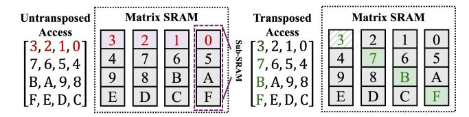
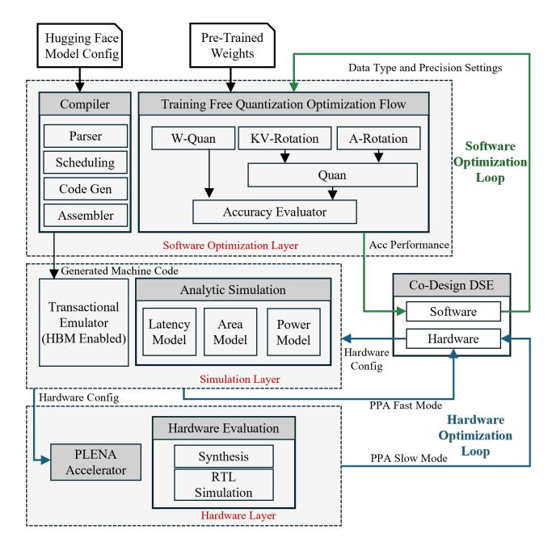
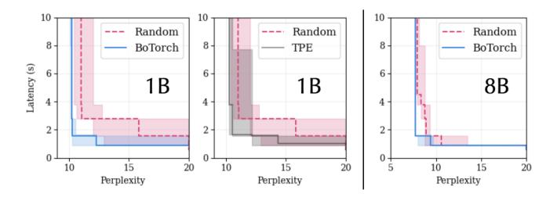

# *D. PLENA ISA*

Our customized ISA is designed to cover all operations required for transformer inference. The instructions are structured to balance efficiency with flexibility and are built to support multiple transformer-based models and computation optimizations. In addition to FlashAttention, the ISA also supports different transformer variants, such as MHA, MLA [44], and MoE [6]. A brief summary is provided in Table I.

To achieve the efficiency and flexibility balance, the ISA is designed to minimize overhead while maximizing utilization of compute and memory resources. This is achieved through features such as tile-level scheduling, which enables finegrained control of computation and memory instructions at the tile granularity. Furthermore, the ISA defines dedicated

Fig. 8: Example of how the single batch single head attention algorithm maps onto PLENA's custom ISA. Instruction prefixes denote the unit type (e.g., M for Matrix instructions).

Fig. 9: The transposable matrix SRAM design ensures that, for both untransposed and transposed accesses, each sub-SRAM is accessed by at most one element per cycle. As a result, no additional access cycles are introduced.

instruction classes (Matrix, Vector, Scalar, Memory, and Control) that decouple responsibilities, simplify scheduling, and allow flexible mixing across different computation types.

Instructions (32 bits each) are dynamically dispatched from the CPU to the instruction buffer via PCIe. In addition to computation, matrix and vector instructions also control read and write operations to their respective SRAMs. Address manipulation is handled by scalar instructions.

#### *E. Matrix SRAM*

The matrix SRAM is designed to support both transposed and non-transposed accesses without additional latency or data movement overhead. This design specifically targets optimizing the transposed matrix multiplication (QK⊤) in FlashAttention (see Figure 8) with low hardware overhead.

In autoregressive inference, explicitly transposing large tiles during the (QK⊤) computation introduces significant area, energy, and latency overhead. Storing (K⊤) directly in HBM is also impractical, as newly generated K vectors must be appended to the KV cache during decoding. Consequently, transposition must be performed on the fly, motivating an SRAM organization that supports both row and column access efficiently without explicit data rearrangement.

As shown in Figure 9, the matrix SRAM distributes each logical row across multiple sub-SRAM banks, storing elements of the same row in different banks at distinct addresses. This layout ensures that row and column accesses map to separate banks, allowing transposed and non-transposed accesses to proceed in parallel without bank conflicts, thereby preserving bandwidth and avoiding explicit data movement.

#### *F. Supporting FlashAttention*

Most existing systolic-array–based accelerators do not natively support FlashAttention due to these three key elements:

Fig. 10: The co-design framework consists of hierarchical layers (actual hardware, transactional emulator, and analytic simulator) with different fidelities. The transaction-level simulator offers good fidelity (cycle-accurate) while achieving an over 200× speedup compared to RTL simulation, and is used for our Co-Design DSE.

- 1) They do not support tile-level overlapping of off-chip memory prefetching with computation, resulting in additional latency overhead as execution must wait for data to be loaded from off-chip memory.
- 2) They lack memory-layout support such as transpose-onread and efficient strided/blocked streaming.
- 3) They expose only GEMM primitives and lack in-line, row-wise reductions and nonlinear operations (max/sum, exp, div) required for the online softmax.
- 4) Their ISAs enforce fixed scheduling and coarse-grained kernel boundaries, which restrict fine-grained tile-by-tile execution and prevent the fused computation pattern.

In PLENA, we address (1) and (2) through the proposed *Matrix SRAM* (see Section III-E), which enables instruction-level control of memory prefetching and supports transpose-onread with low overhead. Challenge (3) is addressed by vector and scalar units that implement reductions and element-wise operations. The vector width (VLEN) is configurable to match the tile dimensions used by FlashAttention. The computation precision is also configurable, but is typically set to higher precision (e.g., FP12) to preserve numerical accuracy during the softmax computation. For (4), our custom ISA provides composable, fine-grained control, enabling persistent, tile-bytile scheduling of the fused attention pipeline. This allows each stage of FlashAttention to be orchestrated individually at tile granularity. Together, these mechanisms enable PLENA to support FlashAttention natively and efficiently.

TABLE II: Average error rates across five trials for different simulation levels, compared with RTL and synthesis results for a single Transformer block of the LLAMA-3-70B model.

| Evaluator / Model    | Latency | Area  | Power             | Exe Time |
|----------------------|---------|-------|-------------------|----------|
| Analytic Simulator   | 11.32%  | 4.79% | 23.81%            | 8ms      |
| Transaction Emulator | 4.17%   |       | not supp not supp | 4.3mins  |
| RTL Sim. / Synth.    | ref     | ref   | ref               | 14hrs    |

#### *G. The PLENA Compilation and Simulation Stack*

PLENA provides a comprehensive design and evaluation framework that can rapidly adapt to new models or new hardware accelerators and optimize for them (Figure 10).

Since Transformer computations are highly repetitive and structurally uniform, the PLENA compiler is intentionally kept lightweight: it parses configuration metadata from the model configuration file and maps it onto a predefined PLENA custom ISA assembly template.

To evaluate architectural trade-offs, we developed a transaction-level (cycle-approximate) emulator in Rust that executes the generated machine code in an event-driven manner. The emulator models compute execution, instruction scheduling, and memory transactions at cycle granularity. It is integrated with Ramulator [43] and DRAMSys [63] to provide detailed off-chip memory timing and bandwidth modeling, including bank-level behavior. This enables quantitative analysis of memory–compute interaction, which is critical because memory bandwidth constitutes a primary bottleneck in longcontext LLM inference.

The emulator supports the full PLENA architectural design space, including asymmetric mixed-precision arithmetic (Section III-A). By bridging analytic modeling and RTL simulation, it enables accurate evaluation of architectural mechanisms—such as flattened systolic mapping and on-chip FlashAttention, while remaining significantly faster than RTL simulation. We plan to open-source this emulator to facilitate research on LLM accelerator architectures.

We validated the simulator against our full RTL implementation: it closely matches the RTL synthesis results in both execution latency and numerical accuracy while delivering roughly a 200× speedup, as shown in Table II.

#### IV. QUANTIZATION

Our work is closely related to prior studies that use the microscaling data format [54], [57]. Nonetheless, we highlight in our work that while existing SoTA PTQ optimizations – such as rotation [7] and norm-guided optimization [22] are beneficial for integer quantization, they do not align well with the microscaling format. We identify these caveats for applying PTQ optimization techniques to microscaling arithmetics:

1) For weight quantization, MXFP is generally incompatible with these PTQ optimizations. MXINT demonstrates compatibility, but naively applying it leads to degradation. We introduce a novel block-wise clipping optimization that naturally complements block-based arithmetic like MXINT (Section IV-B).

2) For activation quantization, rotation schemes such as QuaRot, when naively applied, lead to performance degradation for both MXINT and MXFP. A performance boost is realized only when they are selectively applied to activations (Section IV-C).

In summary, we point out that MXINT with PTQ optimization is the de-facto approach for weight quantization. Meanwhile, activation quantization can utilize MXINT or MXFP, but rotation should be applied only selectively. The rest of the section elaborates on these optimization strategies and the root causes of incompatibilities, with Section IV-D detailing the integration of these quantizations into the PLENA system to facilitate a software-hardware co-design.

#### A. Preliminaries

We start by formalizing MX quantization under a single-level scaling scheme using three elements: the MX data format  $(\tau)$ , the scale factor (s), and the zero point (z). The MX data format is defined by a tuple  $\tau=(d,b,B)$ , where d denotes the datatype, b is its bit-width, and B is the microscaling block size. For example,  $\tau=(\text{INT},4,16)$  corresponds to an MXINT4 format with block size B=16, while  $\tau=(\text{minifloat},4,16)$  corresponds to an MXFP4 format with the same block size. In both cases, all values within a block share a single block-wise scale factor s and zero point s.

For any data format  $\tau$ , the set of representable values is bounded to a finite interval, which we denote as:

$$\Omega(\tau) = \{ x \in \mathbb{R} \mid \min_{(d,b)} \le x \le \max_{(d,b)} \}. \tag{1}$$

the representable range  $[\min_{\tau}, \max_{\tau}]$  of integer MX formats (i.e., d = INT) is given by:

$$\min_{\tau} = -(2^{b-1} - 1), \qquad \max_{\tau} = 2^{b-1} - 1. \tag{2}$$

We partition a high-precision tensor  $\mathbf{W}$  into blocks  $w \in \mathbb{R}^B$  of size B. For each block w, the scaling factor is

$$s = \frac{\max|w|}{\max_{\tau}}. (3)$$

The zero-point z shifts the range for alignment; we adopt symmetric quantization (z=0) throughout and omit it from subsequent expressions. Quantization then maps w into the target format  $w_{\tau}$  as:

$$w_{\tau} = \operatorname{clip}\left(\operatorname{RTN}\left(\frac{w}{s}\right), \min_{\tau}, \max_{\tau}\right),$$
 (4)

where  $RTN(\cdot)$  denotes round-to-nearest projection. The corresponding dequantization operator reconstructs an approximation of the original block:

$$Q(w; s, \tau) = s \cdot w_{\tau}. \tag{5}$$

B. Optimizing Microscaling Clipping for Weight Quantization

Existing microscaling arithmetic implementations utilize a static clipping strategy, typically using a fixed value (eg. the maximum value) as clipping threshold for each block (see Equation (3)). However, a distinct advantage of employing smaller blocks is the opportunity for more granular control over numerical values. Consequently, we introduce *microscaling block-wise clipping*, a technique that provides a conscious balancing between the clipping overflow error and the underflow errors for inliers.

For the same sliced block w expressed in format  $\tau$ , with representable range  $[\min_{\tau}, \max_{\tau}]$  and empirical range  $[\min_{w}, \max_{w}]$ , we introduce a *clipping parameter*  $p \in \mathcal{P} \subset [0.5, 0.99]$ . This parameter shrinks the effective range to  $[p \min_{w}, p \max_{w}]$ .

By sweeping over a discrete set  $\mathcal{P}$ , we can obtain optimal clipping  $p^*$  for a given block:

$$p^* = \arg\min_{p \in \mathcal{P}} \|w - Q(w; p, \tau)\|_2^2.$$
 (6)

Here  $\|\cdot\|_2^2$  denotes the squared Euclidean norm.

Clipping the empirical range introduces a trade-off between the clipping error and the underflow error. This issue is particularly critical for microscaling-based arithmetic, as the block size is relatively small compared to tensor dimensions. Making an optimal selection of clipping ranges can significantly influence performance; in our experiments, optimized clipping improved perplexity by 5.5% on LLAMA-3-8B in 4-bits weights only quantization setting.

We then detail our method, where we integrate our clipping optimization directly into GPTQ's iterative error propagation flow, and introduce a new output-norm guided blockwise clipping search that minimizes the quantization error of the output block rather than the weight block. Formally, let  $\mathbf{X} \in \mathbb{R}^{M \times K}$ be the inputs, and  $\mathbf{W} \in \mathbb{R}^{N \times K}$  be the weights. Given a linear layer  $Y = XW^{T}$ , we slice the weights across the K dimension with block size B (e.g., MLEN in an MX data format  $\tau$ ), yielding block slices  $\mathbf{W}_b \in \mathbb{R}^{N \times B}$  to be quantized, and similarly we can have activations across the K dimension  $\mathbf{X}_b \in \mathbb{R}^{M \times B}$ . Let  $\mathcal{P}$  denote the set of admissible clipping percentiles, and let  $Q(\cdot; P, \tau)$  denote per-row quantization in data format  $\tau$ , where  $P = (p_1, \dots, p_N) \in \mathcal{P}^N$  is a collection of row-wise clipping percentiles, our new optimization is then uses an outer loop optimization with the hessian information  $\mathbf{H}_F$  to iteratively calibrate the weight value  $(W_b + = \boldsymbol{\delta}_F)$ , adapted from GPTQ).

$$\delta_F = -\left(\mathbf{W}_b - \mathbf{Q}(\mathbf{W}_b; P_b^{\star}, \tau)\right) \left([\mathbf{H}_F^{-1}]_{bb}\right)^{-1} (\mathbf{H}_F^{-1})_{:,b},$$
where  $\mathbf{H}_F = 2\mathbf{X}_F \mathbf{X}_F^{\top}$ . (7)

This is combined with a novel inner loop optimization, which is output-norm guided:

$$P_b^{\star} = \arg\min_{P_b \in \mathcal{P}^N} \left\| \mathbf{X}_b \Big( \mathbf{W}_b - \mathbf{Q}(\mathbf{W}_b; P_b, \tau) \Big)^{\top} \right\|_2^2, \quad (8)$$

*C. Selectively Rotated Microscaling Data Formats for Activation and KV Quantization*

Rotation-based optimization, such as QuaRot [7] tries to smooth the numerical outlier by introducing a rotation matrix, where X,W, H represent the activation, weight, and Hadamard matrix respectively.

$$l_{rot}(\mathbf{X}) = \mathbf{Q}(\mathbf{X}\mathbf{H}) \cdot \mathbf{Q}(\mathbf{H}^{-1}\mathbf{W}) \tag{9}$$

Surprisingly, we notice that applying the rotation to finergrained weight quantization (e.g., MXINT with small block sizes) actually increases perplexity. Intuitively, weights have smaller dynamic ranges compared to activations. The rotation may be unnecessary since most weight outliers are already captured by the shared exponents.

We then propose a *selective rotation* strategy for activation quantization:

$$S = \arg\min_{s \in \mathcal{M}} \sum_{s \in \mathcal{M}} \Delta_{ppl}(l_{rot}^*),$$

$$l_{rot}^*(\mathbf{X}) = \mathbf{Q}(\mathbf{X}\mathbf{H}) \cdot \mathbf{H}^{-1} \cdot \mathbf{Q}(\mathbf{W}),$$
(10)

Now S is a set composed of layers from M, and ∆ppl(l ∗ rot) reflects the performance improvement due to rotation for each layer l. The objective is to minimize the sum of the performance loss across all layers in M to select the subset to be included in S. Another critical difference is that when such rotation is applied to activations, we have to apply a multiplication with H−1 at run-time, and PLENA provides a native hardware support for this operation.

#### *D. Asymmetric Quantization and Hardware Co-Design*

As discussed earlier, MXINT is the de-facto quantization for weights, whereas we now exposed a search space for using either MXINT or MXFP for Section IV-C. Also, we have to consider various precision setups and hardware design parameters (e.g., tile sizes, load/write sizes). We then established a co-design framework to conduct such explorations supported by PLENA's multi-fidelity simulators, as shown in Figure 10. It is worth noting that our co-design can run at different fidilities as illustrated in Figure 10, but we choose to run at the transactional-level, unless specified otherwise, for both reasonable speed and good fidelity. Table III shows the search space and its related constraints. Our search space considers a range of arithmetic types for A/KV, including MXINT and MXFP, as well as different precision configurations. The result can provide an asymmetrically quantized PLENA accelerator design upon completion of the search.

To automate finding the optimal hardware design and quantization parameters, we propose to employ active learning for design space exploration (DSE). We also provide the capability for investigating the trade-offs between optimizing different objectives. For this, we employ multi-objective Bayesian optimization (BO) in BOTorch, which allows exploring the Pareto frontier in an active manner. In our case, the objective function has three components: accuracy, latency, and chip area: f = faccuracy(·), flatency(·), farea(·) . The exploration method also accounts for constraints by applying rejection sampling to discard invalid or infeasible candidates. This avoids unnecessary, costly objective evaluations and accelerates convergence of the search. We first conduct experiments on LLAMA3.2-1B to enable rapid iteration, and then extend our evaluation to LLAMA-3-8B. The results are described in Section IV-D.

TABLE III: Selected hardware and quantization parameter codesign search space. Example constraints include: (1) memory bandwidth constraint MLEN · KV\_WIDTH ≤ *MemBandwidth*; (2) MLEN mod BLEN = 0; (3) MLEN ≥ HLEN ≥ BLEN.

| Parameter             | Description                                                                        | Search Range                                  |
|-----------------------|------------------------------------------------------------------------------------|-----------------------------------------------|
| BLEN                  | Tile size of block unit                                                            | [2, 4,, 64]                                   |
| MLEN                  | Tile size of Matrix Unit                                                           | [2, 4,, 1024]                                 |
| VLEN                  | Tile size of Vector Unit                                                           | [2, 4,, 1024]                                 |
| M_LOAD                | Matrix SRAM load amount from HBM (num of matrices loaded per instruct)          | [2, 4,, 256]                                  |
| V_LOAD                | Vector SRAM load amount from HBM (num of vectors loaded per iteration)          | [2, 4,, 256]                                  |
| V_WRITE               | Vector SRAM write amount to HBM (num of vectors written per iteration)          | [2, 4,, 256]                                  |
| ACT_WIDTH KV_WIDTH | Activation precision Key/Value precision FP_SETTING Floating-point precision | MXINT† , MXFP† MXINT† , MXFP† FP† |

#### V. EVALUATION

#### *A. Experiment Setup*

*a) Models and Datasets:* We evaluate our quantization framework on popular open-source LLMs, namely LLaMA-2 [66] and LLaMA-3 [46], as well as MoE [6] (e.g. GPT-OSS) and Qwen3 models. Quantization performance is measured in terms of perplexity on the WikiText-2 dataset [45].

The entire quantization process requires approximately 2–20 GPU hours on NVIDIA H100 GPUs.

- *b) Quantization Baselines:* We compare against several SoTA quantization methods, including software-based approaches targeting GPUs such as GPTQ [22], OmniQuant [62], and QuaRoT [7], as well as approaches used on hardware accelerators such as Atom [78] and MicroscopiQ [54].
- *c) Accelerator Implementation:* PLENA is implemented in SystemVerilog RTL. We perform synthesis using the Synopsys Design Compiler with the 7 nm OpenROAD predictive PDK [14]. This helps us to generate area and power estimates at a 1 GHz clock frequency.
- *d) Accelerator Baselines:* Since our baselines—MicroscopiQ [54], FIGNA [34], and Olive [27]—are not fully open-sourced or cannot be evaluated under a consistent technology node and toolchain, we re-implemented their core components and integrated them into the PLENA system for a fair inference performance comparison. Additionally, DeepScale [61] is used for overall system performance estimation, scaling all designs to the 7 nm process. Detailed area and power of the core units are evaluated using our own implementations.
- *e) Inference Process:* Instead of comparing only with prior accelerator designs, we also evaluate PLENA against high-performance commercial compute platforms, including

TABLE IV: Multi-objective search results for configurations from a BoTorch run on LLAMA-3-8B. We showcase four representative design points on the Pareto frontier with different perplexity (↓), latency (seconds ↓), area (µm2 ↓) tradeoffs. The complete empirical attainment surfaces of the multi-objective search are in Figure 11. Best results are highlighted.

|      | Parameters |      |        |        |         |           |           |            |              | Metrics   |                  |
|------|------------|------|--------|--------|---------|-----------|-----------|------------|--------------|-----------|------------------|
| BLEN | MLEN       | VLEN | M_LOAD | V_LOAD | V_WRITE | ACT_WIDTH | KV_WIDTH  | FP_SETTING | Perplexity ↓ | Lat (s) ↓ | Area (mm2 ) ↓ |
| 32   | 512        | 128  | 128    | 64     | 256     | MXFP E4M3 | MXFP E3M4 | FP E4M7    | 6.70         | 0.137     | 137.6            |
| 32   | 1024       | 1024 | 256    | 256    | 128     | MXINT 8   | MXINT 4   | FP E3M2    | 6.76         | 0.116     | 203.4            |
| 8    | 128        | 32   | 128    | 8      | 256     | MXFP E3M4 | MXFP E3M4 | FP E5M6    | 6.54         | 0.166     | 26.45            |
| 16   | 128        | 16   | 4      | 16     | 64      | MXINT 8   | MXFP E4M3 | FP E3M2    | 6.60         | 0.174     | 23.64            |

Fig. 11: Empirical Attainment Surfaces for latency (↓) and perplexity (↓) objectives across multiple seeds, evaluated with LLAMA3.2-1B and LLAMA-3-8B over the co-design space shown in Table III. For the 1B model, we run 9 seeds with 50 trials, comparing BoTorch and TPE methods against Random sampling. For the 8B model, we run 5 seeds with 50 trials, comparing BoTorch against Random. Shaded regions show the 25% and 75% attainment bands across seeds.

GPUs (A100 80GB and H100 80GB) and TPUs (v6e-8), to provide a fair and practical comparison. The GPU experiments are conducted in an environment with Ubuntu 22.04, CUDA 12.8, Python 3.11, PyTorch 2.8.0, and vLLM 0.10 V1. The TPU experiments are conducted in an environment with v2-alpha-tpuv6e software.

#### *B. Balancing Area, Latency and Perplexity via Co-design*

This subsection shows the results of our design space exploration experiments. Figure 11 shows the Empirical Attainment Surfaces (EAS) for the Pareto fronts found when optimizing with LLAMA3.2-1B and LLAMA-3-8B. EAS is a visualization approach well-suited for conveying the uncertainty of the Pareto fronts from multiple runs with different random seeds [21], [36]. Existing tools support visual analysis for two objectives [69], hence we plot EAS for accuracy and latency first. Figure 11 shows that active learning with BoTorch sampler achieves a significantly better tradeoff between latency and perplexity than naive randomized sampling. Tree-Structured Parzen Estimator (TPE) shows more modest gains when optimizing with LLAMA3.2-1B compared to using BoTorch sampler, thus we focus on the latter for experiments with LLAMA-3-8B.

In Table IV, we show our co-design results generated from multi-objective optimization runs. These runs can yield designs featuring various trade-offs along the Pareto frontier, with some naturally incorporating multi-precision and multiarithmetic elements. The PLENA system facilitates such ex-

TABLE V: WikiText-2 perplexity (↓) under GEMM-only emulation (nonlinear ops in full precision) for LLAMA. W/A/KV denote bit widths for weights, activations, and KV cache. Results marked with ∗ are reproduced from released code.

|                  |          |       | LLaMA-2 [66] |       | LLaMA-3 [46] |       |
|------------------|----------|-------|--------------|-------|--------------|-------|
| Method           | W/A/KV   | 7B    | 13B          | 70B   | 8B           | 70B   |
| Baseline         | 16/16/16 | 5.47  | 4.83         | 3.31  | 6.13         | 2.85  |
| GPTQ [22]        | 4/16/16  | 6.23  | 5.58         | 4.28  | 8.12         | 3.75  |
| AWQ [40]         | 4/16/16  | 5.82  | 5.19         | 4.08  | 7.96         | 3.58  |
| OmniQuant [62]   | 4/16/16  | 5.74  | 5.02         | 3.47  | 7.09         | 3.46  |
| MicroScopiQ [54] | 4/16/16  | 5.65  | 5.02         | 3.42  | 6.89         | 3.25  |
| QuaRot [7]       | 4/16/16  | 5.60  | 5.00         | 3.41  | 6.52∗        | 3.53∗ |
| PLENA (MXFP)     | 4/16/16  | 7.09  | 5.91         | -     | 11.95        | -     |
| PLENA (ours)     | 4/16/16  | 5.61  | 4.97         | 3.41  | 6.45         | 3.59  |
| OmniQuant [62]   | 4/4/16   | 11.47 | 8.32         | 5.41  | 10.21        | 5.30  |
| SmoothQuant [71] | 4/4/16   | 20.47 | 15.63        | 17.62 | 29.54        | 19.32 |
| Atom [78]        | 4/4/16   | 6.16  | 6.12         | 5.20  | 8.12         | 4.69  |
| MicroScopiQ [54] | 4/4/16   | 6.11  | 5.57         | 4.48  | 8.12         | 4.65  |
| QuaRot [7]       | 4/4/16   | 6.02∗ | 5.36∗        | 3.78  | 8.00∗        | 6.33∗ |
| M-ANT [32]       | 4/4/16   | 5.92  | 5.24         | -     | -            | -     |
| PLENA (MXFP)     | 4/4/16   | 15.89 | 10.30        | -     | 91.71        | -     |
| PLENA (ours)     | 4/4/16   | 5.69  | 5.03         | 3.59  | 6.76         | 4.51  |
| QuaRot [7]       | 4/4/4    | 6.10  | 5.40         | 3.79  | 8.16         | 6.66  |
| QuaRot-128G [7]  | 4/4/4    | 5.93  | 5.26         | 3.61  | 7.36         | 5.51  |
| PLENA (MXFP)     | 4/4/4    | 67.35 | 27.44        | -     | 256.22       | -     |
| PLENA (ours)     | 4/4/4    | 5.89  | 5.18         | 3.62  | 7.22         | 4.77  |

TABLE VI: Ablation study of quantization techniques and their impact on microscaling data formats, evaluated across all 9 GEMMs in LLAMA-3-8B. Results are reported on WikiText-2 perplexity. GPTQ is used for clipping: Erry denotes outputnorm clipping; Errw denotes weight-norm clipping.

| Method             | PPL↓  | Method                        | PPL↓  |
|--------------------|-------|-------------------------------|-------|
| Baseline FP16      | 6.13  | ACT and KV Only               |       |
| Weight Only        |       | MXFP4                         | 29.75 |
| MXINT + RTN        | 6.83  | MXINT4                        | 7.24  |
| MXFP + RTN         | 11.94 | MXFP4 + Selective Rotate      | 14.50 |
| MXINT4 + Rotation  | 6.98  | MXINT4 + Selective Rotate     | 7.05  |
| MXFP4 + Rotation   | 13.71 | MXINT Full System             |       |
| MXINT4 + Errw Clip | 6.53  | RTN                           | 8.28  |
| MXINT4 + Erry Clip | 6.45  | Erry Clip                     | 7.60  |
|                    |       | Erry Clip +Selective Rotation | 7.22  |

ploration, thanks to its comprehensive simulation and RTL support for these arithmetic types and precision levels.

# *D. PLENA ISA*

Our customized ISA is designed to cover all operations required for transformer inference. The instructions are structured to balance efficiency with flexibility and are built to support multiple transformer-based models and computation optimizations. In addition to FlashAttention, the ISA also supports different transformer variants, such as MHA, MLA [44], and MoE [6]. A brief summary is provided in Table I.

To achieve the efficiency and flexibility balance, the ISA is designed to minimize overhead while maximizing utilization of compute and memory resources. This is achieved through features such as tile-level scheduling, which enables finegrained control of computation and memory instructions at the tile granularity. Furthermore, the ISA defines dedicated

Fig. 8: Example of how the single batch single head attention algorithm maps onto PLENA's custom ISA. Instruction prefixes denote the unit type (e.g., M for Matrix instructions).

Fig. 9: The transposable matrix SRAM design ensures that, for both untransposed and transposed accesses, each sub-SRAM is accessed by at most one element per cycle. As a result, no additional access cycles are introduced.

instruction classes (Matrix, Vector, Scalar, Memory, and Control) that decouple responsibilities, simplify scheduling, and allow flexible mixing across different computation types.

Instructions (32 bits each) are dynamically dispatched from the CPU to the instruction buffer via PCIe. In addition to computation, matrix and vector instructions also control read and write operations to their respective SRAMs. Address manipulation is handled by scalar instructions.

#### *E. Matrix SRAM*

The matrix SRAM is designed to support both transposed and non-transposed accesses without additional latency or data movement overhead. This design specifically targets optimizing the transposed matrix multiplication (QK⊤) in FlashAttention (see Figure 8) with low hardware overhead.

In autoregressive inference, explicitly transposing large tiles during the (QK⊤) computation introduces significant area, energy, and latency overhead. Storing (K⊤) directly in HBM is also impractical, as newly generated K vectors must be appended to the KV cache during decoding. Consequently, transposition must be performed on the fly, motivating an SRAM organization that supports both row and column access efficiently without explicit data rearrangement.

As shown in Figure 9, the matrix SRAM distributes each logical row across multiple sub-SRAM banks, storing elements of the same row in different banks at distinct addresses. This layout ensures that row and column accesses map to separate banks, allowing transposed and non-transposed accesses to proceed in parallel without bank conflicts, thereby preserving bandwidth and avoiding explicit data movement.

#### *F. Supporting FlashAttention*

Most existing systolic-array–based accelerators do not natively support FlashAttention due to these three key elements:

Fig. 10: The co-design framework consists of hierarchical layers (actual hardware, transactional emulator, and analytic simulator) with different fidelities. The transaction-level simulator offers good fidelity (cycle-accurate) while achieving an over 200× speedup compared to RTL simulation, and is used for our Co-Design DSE.

- 1) They do not support tile-level overlapping of off-chip memory prefetching with computation, resulting in additional latency overhead as execution must wait for data to be loaded from off-chip memory.
- 2) They lack memory-layout support such as transpose-onread and efficient strided/blocked streaming.
- 3) They expose only GEMM primitives and lack in-line, row-wise reductions and nonlinear operations (max/sum, exp, div) required for the online softmax.
- 4) Their ISAs enforce fixed scheduling and coarse-grained kernel boundaries, which restrict fine-grained tile-by-tile execution and prevent the fused computation pattern.

In PLENA, we address (1) and (2) through the proposed *Matrix SRAM* (see Section III-E), which enables instruction-level control of memory prefetching and supports transpose-onread with low overhead. Challenge (3) is addressed by vector and scalar units that implement reductions and element-wise operations. The vector width (VLEN) is configurable to match the tile dimensions used by FlashAttention. The computation precision is also configurable, but is typically set to higher precision (e.g., FP12) to preserve numerical accuracy during the softmax computation. For (4), our custom ISA provides composable, fine-grained control, enabling persistent, tile-bytile scheduling of the fused attention pipeline. This allows each stage of FlashAttention to be orchestrated individually at tile granularity. Together, these mechanisms enable PLENA to support FlashAttention natively and efficiently.

TABLE II: Average error rates across five trials for different simulation levels, compared with RTL and synthesis results for a single Transformer block of the LLAMA-3-70B model.

| Evaluator / Model    | Latency | Area  | Power             | Exe Time |
|----------------------|---------|-------|-------------------|----------|
| Analytic Simulator   | 11.32%  | 4.79% | 23.81%            | 8ms      |
| Transaction Emulator | 4.17%   |       | not supp not supp | 4.3mins  |
| RTL Sim. / Synth.    | ref     | ref   | ref               | 14hrs    |

#### *G. The PLENA Compilation and Simulation Stack*

PLENA provides a comprehensive design and evaluation framework that can rapidly adapt to new models or new hardware accelerators and optimize for them (Figure 10).

Since Transformer computations are highly repetitive and structurally uniform, the PLENA compiler is intentionally kept lightweight: it parses configuration metadata from the model configuration file and maps it onto a predefined PLENA custom ISA assembly template.

To evaluate architectural trade-offs, we developed a transaction-level (cycle-approximate) emulator in Rust that executes the generated machine code in an event-driven manner. The emulator models compute execution, instruction scheduling, and memory transactions at cycle granularity. It is integrated with Ramulator [43] and DRAMSys [63] to provide detailed off-chip memory timing and bandwidth modeling, including bank-level behavior. This enables quantitative analysis of memory–compute interaction, which is critical because memory bandwidth constitutes a primary bottleneck in longcontext LLM inference.

The emulator supports the full PLENA architectural design space, including asymmetric mixed-precision arithmetic (Section III-A). By bridging analytic modeling and RTL simulation, it enables accurate evaluation of architectural mechanisms—such as flattened systolic mapping and on-chip FlashAttention, while remaining significantly faster than RTL simulation. We plan to open-source this emulator to facilitate research on LLM accelerator architectures.

We validated the simulator against our full RTL implementation: it closely matches the RTL synthesis results in both execution latency and numerical accuracy while delivering roughly a 200× speedup, as shown in Table II.

#### IV. QUANTIZATION

Our work is closely related to prior studies that use the microscaling data format [54], [57]. Nonetheless, we highlight in our work that while existing SoTA PTQ optimizations – such as rotation [7] and norm-guided optimization [22] are beneficial for integer quantization, they do not align well with the microscaling format. We identify these caveats for applying PTQ optimization techniques to microscaling arithmetics:

1) For weight quantization, MXFP is generally incompatible with these PTQ optimizations. MXINT demonstrates compatibility, but naively applying it leads to degradation. We introduce a novel block-wise clipping optimization that naturally complements block-based arithmetic like MXINT (Section IV-B).

2) For activation quantization, rotation schemes such as QuaRot, when naively applied, lead to performance degradation for both MXINT and MXFP. A performance boost is realized only when they are selectively applied to activations (Section IV-C).

In summary, we point out that MXINT with PTQ optimization is the de-facto approach for weight quantization. Meanwhile, activation quantization can utilize MXINT or MXFP, but rotation should be applied only selectively. The rest of the section elaborates on these optimization strategies and the root causes of incompatibilities, with Section IV-D detailing the integration of these quantizations into the PLENA system to facilitate a software-hardware co-design.

#### A. Preliminaries

We start by formalizing MX quantization under a single-level scaling scheme using three elements: the MX data format  $(\tau)$ , the scale factor (s), and the zero point (z). The MX data format is defined by a tuple  $\tau=(d,b,B)$ , where d denotes the datatype, b is its bit-width, and B is the microscaling block size. For example,  $\tau=(\text{INT},4,16)$  corresponds to an MXINT4 format with block size B=16, while  $\tau=(\text{minifloat},4,16)$  corresponds to an MXFP4 format with the same block size. In both cases, all values within a block share a single block-wise scale factor s and zero point s.

For any data format  $\tau$ , the set of representable values is bounded to a finite interval, which we denote as:

$$\Omega(\tau) = \{ x \in \mathbb{R} \mid \min_{(d,b)} \le x \le \max_{(d,b)} \}. \tag{1}$$

the representable range  $[\min_{\tau}, \max_{\tau}]$  of integer MX formats (i.e., d = INT) is given by:

$$\min_{\tau} = -(2^{b-1} - 1), \qquad \max_{\tau} = 2^{b-1} - 1. \tag{2}$$

We partition a high-precision tensor  $\mathbf{W}$  into blocks  $w \in \mathbb{R}^B$  of size B. For each block w, the scaling factor is

$$s = \frac{\max|w|}{\max_{\tau}}. (3)$$

The zero-point z shifts the range for alignment; we adopt symmetric quantization (z=0) throughout and omit it from subsequent expressions. Quantization then maps w into the target format  $w_{\tau}$  as:

$$w_{\tau} = \operatorname{clip}\left(\operatorname{RTN}\left(\frac{w}{s}\right), \min_{\tau}, \max_{\tau}\right),$$
 (4)

where  $RTN(\cdot)$  denotes round-to-nearest projection. The corresponding dequantization operator reconstructs an approximation of the original block:

$$Q(w; s, \tau) = s \cdot w_{\tau}. \tag{5}$$

B. Optimizing Microscaling Clipping for Weight Quantization

Existing microscaling arithmetic implementations utilize a static clipping strategy, typically using a fixed value (eg. the maximum value) as clipping threshold for each block (see Equation (3)). However, a distinct advantage of employing smaller blocks is the opportunity for more granular control over numerical values. Consequently, we introduce *microscaling block-wise clipping*, a technique that provides a conscious balancing between the clipping overflow error and the underflow errors for inliers.

For the same sliced block w expressed in format  $\tau$ , with representable range  $[\min_{\tau}, \max_{\tau}]$  and empirical range  $[\min_{w}, \max_{w}]$ , we introduce a *clipping parameter*  $p \in \mathcal{P} \subset [0.5, 0.99]$ . This parameter shrinks the effective range to  $[p \min_{w}, p \max_{w}]$ .

By sweeping over a discrete set  $\mathcal{P}$ , we can obtain optimal clipping  $p^*$  for a given block:

$$p^* = \arg\min_{p \in \mathcal{P}} \|w - Q(w; p, \tau)\|_2^2.$$
 (6)

Here  $\|\cdot\|_2^2$  denotes the squared Euclidean norm.

Clipping the empirical range introduces a trade-off between the clipping error and the underflow error. This issue is particularly critical for microscaling-based arithmetic, as the block size is relatively small compared to tensor dimensions. Making an optimal selection of clipping ranges can significantly influence performance; in our experiments, optimized clipping improved perplexity by 5.5% on LLAMA-3-8B in 4-bits weights only quantization setting.

We then detail our method, where we integrate our clipping optimization directly into GPTQ's iterative error propagation flow, and introduce a new output-norm guided blockwise clipping search that minimizes the quantization error of the output block rather than the weight block. Formally, let  $\mathbf{X} \in \mathbb{R}^{M \times K}$ be the inputs, and  $\mathbf{W} \in \mathbb{R}^{N \times K}$  be the weights. Given a linear layer  $Y = XW^{T}$ , we slice the weights across the K dimension with block size B (e.g., MLEN in an MX data format  $\tau$ ), yielding block slices  $\mathbf{W}_b \in \mathbb{R}^{N \times B}$  to be quantized, and similarly we can have activations across the K dimension  $\mathbf{X}_b \in \mathbb{R}^{M \times B}$ . Let  $\mathcal{P}$  denote the set of admissible clipping percentiles, and let  $Q(\cdot; P, \tau)$  denote per-row quantization in data format  $\tau$ , where  $P = (p_1, \dots, p_N) \in \mathcal{P}^N$  is a collection of row-wise clipping percentiles, our new optimization is then uses an outer loop optimization with the hessian information  $\mathbf{H}_F$  to iteratively calibrate the weight value  $(W_b + = \boldsymbol{\delta}_F)$ , adapted from GPTQ).

$$\delta_F = -\left(\mathbf{W}_b - \mathbf{Q}(\mathbf{W}_b; P_b^{\star}, \tau)\right) \left([\mathbf{H}_F^{-1}]_{bb}\right)^{-1} (\mathbf{H}_F^{-1})_{:,b},$$
where  $\mathbf{H}_F = 2\mathbf{X}_F \mathbf{X}_F^{\top}$ . (7)

This is combined with a novel inner loop optimization, which is output-norm guided:

$$P_b^{\star} = \arg\min_{P_b \in \mathcal{P}^N} \left\| \mathbf{X}_b \Big( \mathbf{W}_b - \mathbf{Q}(\mathbf{W}_b; P_b, \tau) \Big)^{\top} \right\|_2^2, \quad (8)$$

*C. Selectively Rotated Microscaling Data Formats for Activation and KV Quantization*

Rotation-based optimization, such as QuaRot [7] tries to smooth the numerical outlier by introducing a rotation matrix, where X,W, H represent the activation, weight, and Hadamard matrix respectively.

$$l_{rot}(\mathbf{X}) = \mathbf{Q}(\mathbf{X}\mathbf{H}) \cdot \mathbf{Q}(\mathbf{H}^{-1}\mathbf{W}) \tag{9}$$

Surprisingly, we notice that applying the rotation to finergrained weight quantization (e.g., MXINT with small block sizes) actually increases perplexity. Intuitively, weights have smaller dynamic ranges compared to activations. The rotation may be unnecessary since most weight outliers are already captured by the shared exponents.

We then propose a *selective rotation* strategy for activation quantization:

$$S = \arg\min_{s \in \mathcal{M}} \sum_{s \in \mathcal{M}} \Delta_{ppl}(l_{rot}^*),$$

$$l_{rot}^*(\mathbf{X}) = \mathbf{Q}(\mathbf{X}\mathbf{H}) \cdot \mathbf{H}^{-1} \cdot \mathbf{Q}(\mathbf{W}),$$
(10)

Now S is a set composed of layers from M, and ∆ppl(l ∗ rot) reflects the performance improvement due to rotation for each layer l. The objective is to minimize the sum of the performance loss across all layers in M to select the subset to be included in S. Another critical difference is that when such rotation is applied to activations, we have to apply a multiplication with H−1 at run-time, and PLENA provides a native hardware support for this operation.

#### *D. Asymmetric Quantization and Hardware Co-Design*

As discussed earlier, MXINT is the de-facto quantization for weights, whereas we now exposed a search space for using either MXINT or MXFP for Section IV-C. Also, we have to consider various precision setups and hardware design parameters (e.g., tile sizes, load/write sizes). We then established a co-design framework to conduct such explorations supported by PLENA's multi-fidelity simulators, as shown in Figure 10. It is worth noting that our co-design can run at different fidilities as illustrated in Figure 10, but we choose to run at the transactional-level, unless specified otherwise, for both reasonable speed and good fidelity. Table III shows the search space and its related constraints. Our search space considers a range of arithmetic types for A/KV, including MXINT and MXFP, as well as different precision configurations. The result can provide an asymmetrically quantized PLENA accelerator design upon completion of the search.

To automate finding the optimal hardware design and quantization parameters, we propose to employ active learning for design space exploration (DSE). We also provide the capability for investigating the trade-offs between optimizing different objectives. For this, we employ multi-objective Bayesian optimization (BO) in BOTorch, which allows exploring the Pareto frontier in an active manner. In our case, the objective function has three components: accuracy, latency, and chip area: f = faccuracy(·), flatency(·), farea(·) . The exploration method also accounts for constraints by applying rejection sampling to discard invalid or infeasible candidates. This avoids unnecessary, costly objective evaluations and accelerates convergence of the search. We first conduct experiments on LLAMA3.2-1B to enable rapid iteration, and then extend our evaluation to LLAMA-3-8B. The results are described in Section IV-D.

TABLE III: Selected hardware and quantization parameter codesign search space. Example constraints include: (1) memory bandwidth constraint MLEN · KV\_WIDTH ≤ *MemBandwidth*; (2) MLEN mod BLEN = 0; (3) MLEN ≥ HLEN ≥ BLEN.

| Parameter             | Description                                                                        | Search Range                                  |
|-----------------------|------------------------------------------------------------------------------------|-----------------------------------------------|
| BLEN                  | Tile size of block unit                                                            | [2, 4,, 64]                                   |
| MLEN                  | Tile size of Matrix Unit                                                           | [2, 4,, 1024]                                 |
| VLEN                  | Tile size of Vector Unit                                                           | [2, 4,, 1024]                                 |
| M_LOAD                | Matrix SRAM load amount from HBM (num of matrices loaded per instruct)          | [2, 4,, 256]                                  |
| V_LOAD                | Vector SRAM load amount from HBM (num of vectors loaded per iteration)          | [2, 4,, 256]                                  |
| V_WRITE               | Vector SRAM write amount to HBM (num of vectors written per iteration)          | [2, 4,, 256]                                  |
| ACT_WIDTH KV_WIDTH | Activation precision Key/Value precision FP_SETTING Floating-point precision | MXINT† , MXFP† MXINT† , MXFP† FP† |

#### V. EVALUATION

#### *A. Experiment Setup*

*a) Models and Datasets:* We evaluate our quantization framework on popular open-source LLMs, namely LLaMA-2 [66] and LLaMA-3 [46], as well as MoE [6] (e.g. GPT-OSS) and Qwen3 models. Quantization performance is measured in terms of perplexity on the WikiText-2 dataset [45].

The entire quantization process requires approximately 2–20 GPU hours on NVIDIA H100 GPUs.

- *b) Quantization Baselines:* We compare against several SoTA quantization methods, including software-based approaches targeting GPUs such as GPTQ [22], OmniQuant [62], and QuaRoT [7], as well as approaches used on hardware accelerators such as Atom [78] and MicroscopiQ [54].
- *c) Accelerator Implementation:* PLENA is implemented in SystemVerilog RTL. We perform synthesis using the Synopsys Design Compiler with the 7 nm OpenROAD predictive PDK [14]. This helps us to generate area and power estimates at a 1 GHz clock frequency.
- *d) Accelerator Baselines:* Since our baselines—MicroscopiQ [54], FIGNA [34], and Olive [27]—are not fully open-sourced or cannot be evaluated under a consistent technology node and toolchain, we re-implemented their core components and integrated them into the PLENA system for a fair inference performance comparison. Additionally, DeepScale [61] is used for overall system performance estimation, scaling all designs to the 7 nm process. Detailed area and power of the core units are evaluated using our own implementations.
- *e) Inference Process:* Instead of comparing only with prior accelerator designs, we also evaluate PLENA against high-performance commercial compute platforms, including

TABLE IV: Multi-objective search results for configurations from a BoTorch run on LLAMA-3-8B. We showcase four representative design points on the Pareto frontier with different perplexity (↓), latency (seconds ↓), area (µm2 ↓) tradeoffs. The complete empirical attainment surfaces of the multi-objective search are in Figure 11. Best results are highlighted.

|      | Parameters |      |        |        |         |           |           |            |              | Metrics   |                  |
|------|------------|------|--------|--------|---------|-----------|-----------|------------|--------------|-----------|------------------|
| BLEN | MLEN       | VLEN | M_LOAD | V_LOAD | V_WRITE | ACT_WIDTH | KV_WIDTH  | FP_SETTING | Perplexity ↓ | Lat (s) ↓ | Area (mm2 ) ↓ |
| 32   | 512        | 128  | 128    | 64     | 256     | MXFP E4M3 | MXFP E3M4 | FP E4M7    | 6.70         | 0.137     | 137.6            |
| 32   | 1024       | 1024 | 256    | 256    | 128     | MXINT 8   | MXINT 4   | FP E3M2    | 6.76         | 0.116     | 203.4            |
| 8    | 128        | 32   | 128    | 8      | 256     | MXFP E3M4 | MXFP E3M4 | FP E5M6    | 6.54         | 0.166     | 26.45            |
| 16   | 128        | 16   | 4      | 16     | 64      | MXINT 8   | MXFP E4M3 | FP E3M2    | 6.60         | 0.174     | 23.64            |

Fig. 11: Empirical Attainment Surfaces for latency (↓) and perplexity (↓) objectives across multiple seeds, evaluated with LLAMA3.2-1B and LLAMA-3-8B over the co-design space shown in Table III. For the 1B model, we run 9 seeds with 50 trials, comparing BoTorch and TPE methods against Random sampling. For the 8B model, we run 5 seeds with 50 trials, comparing BoTorch against Random. Shaded regions show the 25% and 75% attainment bands across seeds.

GPUs (A100 80GB and H100 80GB) and TPUs (v6e-8), to provide a fair and practical comparison. The GPU experiments are conducted in an environment with Ubuntu 22.04, CUDA 12.8, Python 3.11, PyTorch 2.8.0, and vLLM 0.10 V1. The TPU experiments are conducted in an environment with v2-alpha-tpuv6e software.

#### *B. Balancing Area, Latency and Perplexity via Co-design*

This subsection shows the results of our design space exploration experiments. Figure 11 shows the Empirical Attainment Surfaces (EAS) for the Pareto fronts found when optimizing with LLAMA3.2-1B and LLAMA-3-8B. EAS is a visualization approach well-suited for conveying the uncertainty of the Pareto fronts from multiple runs with different random seeds [21], [36]. Existing tools support visual analysis for two objectives [69], hence we plot EAS for accuracy and latency first. Figure 11 shows that active learning with BoTorch sampler achieves a significantly better tradeoff between latency and perplexity than naive randomized sampling. Tree-Structured Parzen Estimator (TPE) shows more modest gains when optimizing with LLAMA3.2-1B compared to using BoTorch sampler, thus we focus on the latter for experiments with LLAMA-3-8B.

In Table IV, we show our co-design results generated from multi-objective optimization runs. These runs can yield designs featuring various trade-offs along the Pareto frontier, with some naturally incorporating multi-precision and multiarithmetic elements. The PLENA system facilitates such ex-

TABLE V: WikiText-2 perplexity (↓) under GEMM-only emulation (nonlinear ops in full precision) for LLAMA. W/A/KV denote bit widths for weights, activations, and KV cache. Results marked with ∗ are reproduced from released code.

|                  |          |       | LLaMA-2 [66] |       | LLaMA-3 [46] |       |
|------------------|----------|-------|--------------|-------|--------------|-------|
| Method           | W/A/KV   | 7B    | 13B          | 70B   | 8B           | 70B   |
| Baseline         | 16/16/16 | 5.47  | 4.83         | 3.31  | 6.13         | 2.85  |
| GPTQ [22]        | 4/16/16  | 6.23  | 5.58         | 4.28  | 8.12         | 3.75  |
| AWQ [40]         | 4/16/16  | 5.82  | 5.19         | 4.08  | 7.96         | 3.58  |
| OmniQuant [62]   | 4/16/16  | 5.74  | 5.02         | 3.47  | 7.09         | 3.46  |
| MicroScopiQ [54] | 4/16/16  | 5.65  | 5.02         | 3.42  | 6.89         | 3.25  |
| QuaRot [7]       | 4/16/16  | 5.60  | 5.00         | 3.41  | 6.52∗        | 3.53∗ |
| PLENA (MXFP)     | 4/16/16  | 7.09  | 5.91         | -     | 11.95        | -     |
| PLENA (ours)     | 4/16/16  | 5.61  | 4.97         | 3.41  | 6.45         | 3.59  |
| OmniQuant [62]   | 4/4/16   | 11.47 | 8.32         | 5.41  | 10.21        | 5.30  |
| SmoothQuant [71] | 4/4/16   | 20.47 | 15.63        | 17.62 | 29.54        | 19.32 |
| Atom [78]        | 4/4/16   | 6.16  | 6.12         | 5.20  | 8.12         | 4.69  |
| MicroScopiQ [54] | 4/4/16   | 6.11  | 5.57         | 4.48  | 8.12         | 4.65  |
| QuaRot [7]       | 4/4/16   | 6.02∗ | 5.36∗        | 3.78  | 8.00∗        | 6.33∗ |
| M-ANT [32]       | 4/4/16   | 5.92  | 5.24         | -     | -            | -     |
| PLENA (MXFP)     | 4/4/16   | 15.89 | 10.30        | -     | 91.71        | -     |
| PLENA (ours)     | 4/4/16   | 5.69  | 5.03         | 3.59  | 6.76         | 4.51  |
| QuaRot [7]       | 4/4/4    | 6.10  | 5.40         | 3.79  | 8.16         | 6.66  |
| QuaRot-128G [7]  | 4/4/4    | 5.93  | 5.26         | 3.61  | 7.36         | 5.51  |
| PLENA (MXFP)     | 4/4/4    | 67.35 | 27.44        | -     | 256.22       | -     |
| PLENA (ours)     | 4/4/4    | 5.89  | 5.18         | 3.62  | 7.22         | 4.77  |

TABLE VI: Ablation study of quantization techniques and their impact on microscaling data formats, evaluated across all 9 GEMMs in LLAMA-3-8B. Results are reported on WikiText-2 perplexity. GPTQ is used for clipping: Erry denotes outputnorm clipping; Errw denotes weight-norm clipping.

| Method             | PPL↓  | Method                        | PPL↓  |
|--------------------|-------|-------------------------------|-------|
| Baseline FP16      | 6.13  | ACT and KV Only               |       |
| Weight Only        |       | MXFP4                         | 29.75 |
| MXINT + RTN        | 6.83  | MXINT4                        | 7.24  |
| MXFP + RTN         | 11.94 | MXFP4 + Selective Rotate      | 14.50 |
| MXINT4 + Rotation  | 6.98  | MXINT4 + Selective Rotate     | 7.05  |
| MXFP4 + Rotation   | 13.71 | MXINT Full System             |       |
| MXINT4 + Errw Clip | 6.53  | RTN                           | 8.28  |
| MXINT4 + Erry Clip | 6.45  | Erry Clip                     | 7.60  |
|                    |       | Erry Clip +Selective Rotation | 7.22  |

ploration, thanks to its comprehensive simulation and RTL support for these arithmetic types and precision levels.

