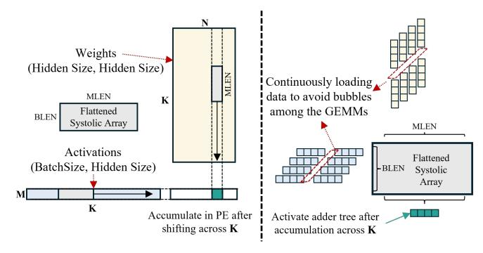

# III. PLENA HARDWARE SYSTEM

The overall configuration of PLENA is shown in Figure 4. It employs instruction-level pipelining and mainly consists of three compute units: the Matrix Unit, the Vector Unit, and the Scalar Unit. All units are highly configurable, supporting multiple data types and precisions (Table III), enabling the application of different quantization methods to the accelerator.

PLENA also includes two main on-chip SRAM blocks. The Vector SRAM acts as a scratchpad for computation, storing frequently used data such as activations, which do not need to be written back to HBM, thereby reducing memory access overhead. The custom Matrix SRAM is dedicated to loading weights and KV tensors and supports reading data in either transposed or untransposed access patterns with minimal extra resource cost and access overhead.

#### *A. Asymmetric Arithmetic Data Path*

To support asymmetric quantization strategies, PLENA natively supports multiple numeric formats—covering different data types and precisions—across its compute and memory units. This innovative *asymmetric* data-handling configuration has the following characteristics.

(i) Activations are stored in a high-precision floating-point (FP) format on-chip in the Vector SRAM, as they are more sensitive to quantization errors than KV or weights. (ii) KV and weights, being less accuracy-sensitive, can be more aggressively quantized and staged in the Matrix SRAM using lower-precision MX formats (MXFP or MXINT). (iii) An optional on-chip rotation step can suppress outliers before quantization to preserve accuracy.

Furthermore, when appending new K and V vectors to the KV cache in HBM during attention, we selectively apply a Hadamard-based rotation (algorithm detailed in Section IV-C) to suppress outliers before quantizing them to the MX data type and storing them in HBM. Since K and V are consumed exclusively by the attention GEMMs, they are loaded directly into the Matrix SRAM, where the inverse Hadamard transform is applied before use. These rotation/de-rotation stages can be selectively applied per tensor; for example, weights loaded into the matrix unit bypass the inverse transform.

#### *B. Flattened Systolic Array*

As shown in Figure 2(b), long-context workloads frequently involve *fat GEMMs* during the feed-forward (FFN) computation, where the batch-related dimension (typically M in (M, K) × (K, N)) is much smaller than the others, resulting in uneven matrix shapes (Figure 5), while the reduction

Fig. 5: Processing flow for the weight–activation output stationary GEMM. Because memory capacity constrains batch size, the M dimension remains small. Setting BLEN = M on the flattened systolic array yields high utilization.

dimensions K tend to be very long, for example, the weight– activation GEMM reduces over the model's hidden size (e.g., 4,096 for LLAMA-3-8B and 8,192 for LLAMA-3-70B).

Additionally, in the FlashAttention stage, per-head *fat GEMMs* operations are required. The head dimension is typically small (e.g., 128 for LLAMA-3-70B), and the Grouped Query Attention (GQA) paradigm requires each key head to be multiplied by multiple query heads simultaneously. This results in low utilization of large-scale systolic arrays when performing per-head GEMMs in FlashAttention, as the computation dimension becomes relatively small.

To improve hardware efficiency in the two most computationally intensive layers, we propose the *flattened systolic arrays* architecture, which achieves a significantly higher utilization for both layers. For the FFN layer, each processing unit performs a (BLEN, MLEN) × (MLEN, BLEN) GEMM, producing an output of shape (BLEN, BLEN). Typically, BLEN is configured to be much smaller than MLEN to match the workload characteristics of long-context LLM inference. For the FlashAttention module, the systolic array is partitioned into multiple smaller flattened array cores to support per-head GEMM computations, where each core performs a (BLEN, HLEN) × (HLEN, BLEN) GEMM across (MLEN//HLEN) heads in parallel.

This flattened systolic array is designed for the outputstationary dataflow in order to maintain a high utilization. As shown in Figure 5, operands stream along the large reduction dimension K while partial sums remain stationary in the PEs. The array is then fully pipelined, eliminating idling bubbles between consecutive GEMM tiles. The microarchitecture of the flattened systolic array is shown in Figure 6. It is built from a series of small square-shaped systolic arrays (*sub-arrs*), each consisting of a grid of processing elements (PEs). Each PE repeatedly performs multiply–accumulate operations and passes data to its neighboring PEs below and to the right across the array. As described in Section III-A, the systolic array is designed to natively accept data in the MX format.

However, a matrix unit composed solely of *sub-arrs* is insufficient to complete a (BLEN, MLEN) × (MLEN, BLEN) GEMM. Each array accumulates only partial sums for a

Fig. 6: At each cycle, the flattened systolic array fetches two MLEN-wide inputs: one from the Matrix SRAM (top) and one from the Vector SRAM (left). The inputs are buffered and reordered, then partitioned into MLEN/BLEN subvectors (assuming MLEN is divisible by BLEN), each of width BLEN. Each subvector is forwarded to a corresponding sub-array from the top and left directions. The scales and elements are streamed separately to each subarray. For improved resource efficiency, each PE consumes MX-format inputs and performs accumulation in INT precision. The accumulated results are converted to the target activation precision before being written back to the Vector SRAM.

fragment of the result; producing a complete (BLEN, BLEN) output requires a cross-array reduction that sums the partial sums held in the PEs across the tiled row. To address this, we integrate a result adder tree (see Figure 6) that performs the cross-array summation efficiently. This unit is invoked via a dedicated instruction M SUM, as only one cross-array summation is required when computing GEMM along the large reduction dimension. This prevents bubbles and improves computational efficiency.

#### *C. Asymmetric Memory Balancing*

Our memory system is characterized by two key properties: 1) Support for asymmetric precisions, variable-length memory transfers, and strided loads/stores to HBM; and 2) Latency hiding for HBM accesses via an memory load unit that operates in parallel with the main execution, enabling high bandwidth utilization.

To make more effective use of HBM capacity, as discussed in Section III-A, all data stored in HBM is kept in the MX format. Since concatenating each data block with its perblock scale would rarely yield a combined size that aligns with a power-of-two memory boundary, we instead store the blocks and their corresponding scales for each tensor separately to ensure that both are properly aligned with the memory boundary. This layout improves memory efficiency while maintaining data locality, as illustrated in Figure 7.

The memory load unit is critical for fully utilizing HBM bandwidth. Hardware prefetch engines are integrated into both the Matrix and Vector SRAMs, enabling background fetching from HBM and streaming data into each SRAM while the

Fig. 7: Data layouts and data paths for the memory system. Data with different MX precisions and datatypes are stored following a unified HBM storage pattern. A conversion to FP16 is performed as the data enter the Vector SRAM, which serves as the scratchpad for the vector unit; the vector unit operates in high-precision FP16. For the Matrix SRAM, MXformatted data loaded from HBM can be stored directly without additional conversion.

TABLE I: An overview of the PLENA ISA.

| Types      | Descriptions                                                                                                                       | # Instr. |
|------------|------------------------------------------------------------------------------------------------------------------------------------|----------|
| Matrix(M)  | Controls GEMM and GEMV operations, with or without matrix transposition                                                         | 6        |
| Vector(V)  | Performs elementwise and reduction opera tions, and rotation for quantization                                                   | 13       |
| Scalar(S)  | Performs scalar INT and FP arithmetic                                                                                              | 17       |
| HBM(H)     | Handles data transfers between HBM and the Matrix/Vector SRAMs                                                                  | 3        |
| Control(C) | Defines operation settings such as the HBM address, nested-loop configuration, and other execution parameters | 8        |

rest of PLENA continues executing other instructions. This sustains full utilization of the matrix unit and avoids stalls due to HBM latency. The two load units are controlled directly by dedicated instructions, H LOAD M for the Matrix SRAM and H LOAD V for the Vector SRAM. The load size for each instruction is configurable and specified through the M\_Load and V\_Load parameters.

# III. PLENA HARDWARE SYSTEM

The overall configuration of PLENA is shown in Figure 4. It employs instruction-level pipelining and mainly consists of three compute units: the Matrix Unit, the Vector Unit, and the Scalar Unit. All units are highly configurable, supporting multiple data types and precisions (Table III), enabling the application of different quantization methods to the accelerator.

PLENA also includes two main on-chip SRAM blocks. The Vector SRAM acts as a scratchpad for computation, storing frequently used data such as activations, which do not need to be written back to HBM, thereby reducing memory access overhead. The custom Matrix SRAM is dedicated to loading weights and KV tensors and supports reading data in either transposed or untransposed access patterns with minimal extra resource cost and access overhead.

#### *A. Asymmetric Arithmetic Data Path*

To support asymmetric quantization strategies, PLENA natively supports multiple numeric formats—covering different data types and precisions—across its compute and memory units. This innovative *asymmetric* data-handling configuration has the following characteristics.

(i) Activations are stored in a high-precision floating-point (FP) format on-chip in the Vector SRAM, as they are more sensitive to quantization errors than KV or weights. (ii) KV and weights, being less accuracy-sensitive, can be more aggressively quantized and staged in the Matrix SRAM using lower-precision MX formats (MXFP or MXINT). (iii) An optional on-chip rotation step can suppress outliers before quantization to preserve accuracy.

Furthermore, when appending new K and V vectors to the KV cache in HBM during attention, we selectively apply a Hadamard-based rotation (algorithm detailed in Section IV-C) to suppress outliers before quantizing them to the MX data type and storing them in HBM. Since K and V are consumed exclusively by the attention GEMMs, they are loaded directly into the Matrix SRAM, where the inverse Hadamard transform is applied before use. These rotation/de-rotation stages can be selectively applied per tensor; for example, weights loaded into the matrix unit bypass the inverse transform.

#### *B. Flattened Systolic Array*

As shown in Figure 2(b), long-context workloads frequently involve *fat GEMMs* during the feed-forward (FFN) computation, where the batch-related dimension (typically M in (M, K) × (K, N)) is much smaller than the others, resulting in uneven matrix shapes (Figure 5), while the reduction

Fig. 5: Processing flow for the weight–activation output stationary GEMM. Because memory capacity constrains batch size, the M dimension remains small. Setting BLEN = M on the flattened systolic array yields high utilization.

dimensions K tend to be very long, for example, the weight– activation GEMM reduces over the model's hidden size (e.g., 4,096 for LLAMA-3-8B and 8,192 for LLAMA-3-70B).

Additionally, in the FlashAttention stage, per-head *fat GEMMs* operations are required. The head dimension is typically small (e.g., 128 for LLAMA-3-70B), and the Grouped Query Attention (GQA) paradigm requires each key head to be multiplied by multiple query heads simultaneously. This results in low utilization of large-scale systolic arrays when performing per-head GEMMs in FlashAttention, as the computation dimension becomes relatively small.

To improve hardware efficiency in the two most computationally intensive layers, we propose the *flattened systolic arrays* architecture, which achieves a significantly higher utilization for both layers. For the FFN layer, each processing unit performs a (BLEN, MLEN) × (MLEN, BLEN) GEMM, producing an output of shape (BLEN, BLEN). Typically, BLEN is configured to be much smaller than MLEN to match the workload characteristics of long-context LLM inference. For the FlashAttention module, the systolic array is partitioned into multiple smaller flattened array cores to support per-head GEMM computations, where each core performs a (BLEN, HLEN) × (HLEN, BLEN) GEMM across (MLEN//HLEN) heads in parallel.

This flattened systolic array is designed for the outputstationary dataflow in order to maintain a high utilization. As shown in Figure 5, operands stream along the large reduction dimension K while partial sums remain stationary in the PEs. The array is then fully pipelined, eliminating idling bubbles between consecutive GEMM tiles. The microarchitecture of the flattened systolic array is shown in Figure 6. It is built from a series of small square-shaped systolic arrays (*sub-arrs*), each consisting of a grid of processing elements (PEs). Each PE repeatedly performs multiply–accumulate operations and passes data to its neighboring PEs below and to the right across the array. As described in Section III-A, the systolic array is designed to natively accept data in the MX format.

However, a matrix unit composed solely of *sub-arrs* is insufficient to complete a (BLEN, MLEN) × (MLEN, BLEN) GEMM. Each array accumulates only partial sums for a

Fig. 6: At each cycle, the flattened systolic array fetches two MLEN-wide inputs: one from the Matrix SRAM (top) and one from the Vector SRAM (left). The inputs are buffered and reordered, then partitioned into MLEN/BLEN subvectors (assuming MLEN is divisible by BLEN), each of width BLEN. Each subvector is forwarded to a corresponding sub-array from the top and left directions. The scales and elements are streamed separately to each subarray. For improved resource efficiency, each PE consumes MX-format inputs and performs accumulation in INT precision. The accumulated results are converted to the target activation precision before being written back to the Vector SRAM.

fragment of the result; producing a complete (BLEN, BLEN) output requires a cross-array reduction that sums the partial sums held in the PEs across the tiled row. To address this, we integrate a result adder tree (see Figure 6) that performs the cross-array summation efficiently. This unit is invoked via a dedicated instruction M SUM, as only one cross-array summation is required when computing GEMM along the large reduction dimension. This prevents bubbles and improves computational efficiency.

#### *C. Asymmetric Memory Balancing*

Our memory system is characterized by two key properties: 1) Support for asymmetric precisions, variable-length memory transfers, and strided loads/stores to HBM; and 2) Latency hiding for HBM accesses via an memory load unit that operates in parallel with the main execution, enabling high bandwidth utilization.

To make more effective use of HBM capacity, as discussed in Section III-A, all data stored in HBM is kept in the MX format. Since concatenating each data block with its perblock scale would rarely yield a combined size that aligns with a power-of-two memory boundary, we instead store the blocks and their corresponding scales for each tensor separately to ensure that both are properly aligned with the memory boundary. This layout improves memory efficiency while maintaining data locality, as illustrated in Figure 7.

The memory load unit is critical for fully utilizing HBM bandwidth. Hardware prefetch engines are integrated into both the Matrix and Vector SRAMs, enabling background fetching from HBM and streaming data into each SRAM while the

Fig. 7: Data layouts and data paths for the memory system. Data with different MX precisions and datatypes are stored following a unified HBM storage pattern. A conversion to FP16 is performed as the data enter the Vector SRAM, which serves as the scratchpad for the vector unit; the vector unit operates in high-precision FP16. For the Matrix SRAM, MXformatted data loaded from HBM can be stored directly without additional conversion.

TABLE I: An overview of the PLENA ISA.

| Types      | Descriptions                                                                                                                       | # Instr. |
|------------|------------------------------------------------------------------------------------------------------------------------------------|----------|
| Matrix(M)  | Controls GEMM and GEMV operations, with or without matrix transposition                                                         | 6        |
| Vector(V)  | Performs elementwise and reduction opera tions, and rotation for quantization                                                   | 13       |
| Scalar(S)  | Performs scalar INT and FP arithmetic                                                                                              | 17       |
| HBM(H)     | Handles data transfers between HBM and the Matrix/Vector SRAMs                                                                  | 3        |
| Control(C) | Defines operation settings such as the HBM address, nested-loop configuration, and other execution parameters | 8        |

rest of PLENA continues executing other instructions. This sustains full utilization of the matrix unit and avoids stalls due to HBM latency. The two load units are controlled directly by dedicated instructions, H LOAD M for the Matrix SRAM and H LOAD V for the Vector SRAM. The load size for each instruction is configurable and specified through the M\_Load and V\_Load parameters.

