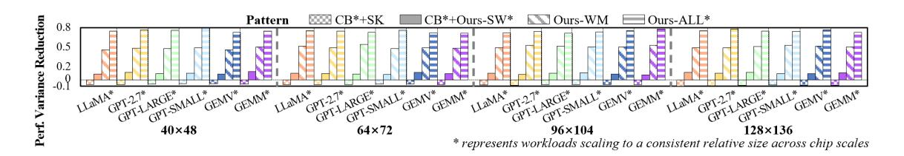
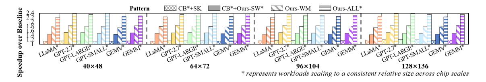
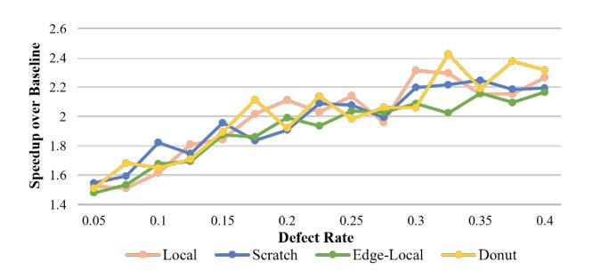

# C. Workload Mapping

To reduce inter-chip performance divergence and promote chips toward higher-value bins, ConBIN employs workload mapping on the repaired topology to minimize communication contention bottlenecks while aligning with bin-specific performance targets derived in Sec.VI-B.

The repaired topology is defined as TG = (V, E), where V denotes the set of functional cores and E represents the available links after post-fabrication repair. Given a directed workload graph WG = (W, D), where each node  $w \in W$  represents a computational workload and each edge  $d_{i \to j} \in D$  denotes the data dependency requiring results of  $w_i$  to be transferred to  $w_j$  (i.e., communication tasks), our goal is to find an injective mapping from workloads in W to cores in V that minimizes the expected contention severity:

$$\Gamma: W \to V$$

$$\Gamma(w_i) \neq \Gamma(w_j), \quad \forall \ w_i \neq w_j \ \text{and} \ \ w_i, w_j \in W \qquad \text{(5)}$$

$$\min_{\Gamma} MLCC_{exp} = \max_{e \in E} LCC_{exp}(e)$$

where  $\Gamma(w_i) \neq \Gamma(w_j)$  ensures exclusive core assignment for workloads, and  $MLCC_{exp}$  denotes the expected maximum

contention on links. Note that the optimization is guided by an adaptive, bin-specific target  $MLCC_{exp}^{target}$  (Sec.VI-B), which reflects each bin's expected performance.

For each candidate mapping, the expected contention on a link e is determined by the cumulative communication frequencies of all data transfers routed through it:

$$LCC_{exp}(e) = \sum_{\substack{d_{i \to j} \in D \\ e \in R(v_i, v_j)}} p_{i \to j}$$
 (6)

where  $p_{i \to j}$  denotes the fraction of workload  $w_i$ 's total output data sent to  $w_j$ , and  $R(v_i, v_j)$  is the routing path between cores  $v_i$  and  $v_j$ .

By minimizing  $MLCC_{exp}$  guided by  $MLCC_{exp}^{target}$ , we prioritize mappings that distribute high-frequency communications across links, preventing persistent bottlenecks while improving performance convergence.

Adaptive Bin-Aware Optimizer. We employ the Strengthen Elitist Genetic Algorithm (SEGA) from Geatpy [32] enhanced with adaptive bin awareness. It preserves elites and dynamically escalates the optimization target to the next higher bin once the current bin target is met (up to twice to control overhead), allowing chips near bin boundaries to pursue higher-bin mappings and improving premium-bin yield. If the elevated target is not met within 30 generations or the global limit, the best solution that satisfied the last valid target is adopted. We use a population of 100 and a maximum of 100 generations, with early termination after 10 stagnant generations.

Complexity Analysis and Overhead. The computation of  $MLCC_{exp}$  iterates over each edge  $d \in D$  in the workload graph WG to accumulate contention weights along routing paths R. This yields a time complexity of  $O(|D| \cdot h)$ , where |D| is the edge count of WG and h represents the average path length in topology graph TG. For the  $128 \times 136$  scale, the workload mapping takes  $\sim 18.36$  minutes under the same configuration as Sec.VII, demonstrating scalability. Space complexity is O(|E|), linear in links for storing contention counters.

#### D. Communication Sequence Scheduling

After workload mapping, the execution order of inter-core data transfers still significantly affects workload performance, especially under residual irregularity in the repaired topology. Uneven link utilization and destination congestion can cause time-varying contention, which amplifies latency differences across chips and cannot be solved by coarse-grained scheduling. Since the workload graph and communication dependencies are fixed during execution, the communication sequence can be statically determined before runtime. To further improve performance convergence and exploit more performance potential, ConBIN performs fine-grained communication sequence scheduling guided by bin-specific optimization targets, enhancing the yield of premium bins.

Contention Analysis Phases (CAPs). The communication timeline is partitioned into CAPs — intervals during which contention distribution remains quasi-stable. Each CAP analyzes concurrent tasks (including in-flight tasks from prior

CAPs) and optimizes their sequencing to mitigate contention. For further scalability, CAPs employ tri-granular batching: Fine-grained CAPs analyze early communication batches, optimized with small batch sizes ( $\leq b1$ ); Medium/Coarse-grained CAPs analyze later batches with larger sizes ( $\leq b2$ ,  $\leq b3$ ), trading precision for efficiency. Here, a communication batch refers to all transmissions targeting the *i*-th destination in communication sequences, and several batches indicates partial communication sequences. For example, Core 0 needs to sequentially transfer to Core 1 and 2 while Core 1 needs to transfer to Core 3 and 0 in sequence, where task from Core  $0\rightarrow 1$  and from Core  $1\rightarrow 3$  is seen as the first batch while task from Core  $0\rightarrow 2$  and from Core  $1\rightarrow 0$  is seen as the second batch.

Moreover, we develop a history-aware contention propagation mechanism  $(\mu \in (0,1))$  to preserve unresolved high-contention tasks across CAPs. This balances optimization quality and computational overhead for wafer-scale systems.

**Optimization Objective.** Given an initial communication sequence set  $CSS_0 = \{S_v | v \in V\}$  and a maximum sequence length  $|S|_{max}$ , we seek a communication set  $CSS^* = \{S_v^* | v \in V\}$  that minimizes the expected contention severity across all CAPs:

$$\min \Phi = \min \{ \phi^0, \phi^1, ..., \phi^{K-1} \}$$
 (7)

where  $\phi^k$  quantifies each CAP's contention by the expected maximum link or destination contention observed during that phase, and K is the total number of CAPs. The optimization is guided by an adaptive, bin-specific target  $\Phi^{target}$ , derived from the pre-binning stage (Sec.VI-B), enabling performance convergence toward higher bin levels.

**Adaptive Bin-Aware Optimizer.** We employ a multichromosome NSGA-III algorithm [17], [32] enhanced with adaptive bin awareness. The optimizer adopts the same bintarget escalation mechanism described in Sec.VI-C to pursue higher-value bins while bounding overhead. We use a population of 120, up to 100 generations, and stop after 10 stagnant generations.

Complexity Analysis. The CAP division and tri-granular analysis limit communication steps to a constant K (configurable via b1,b2,b3), while the history factor  $\mu$  reduces cross-CAP tasks to a subset of D (total edges in the workload graph WG). The time complexity is dominated by evaluating all |D| tasks, where each task's routing path requires O(h) operations (average hop count). Thus, total time is  $O(|D| \cdot h)$ . For a 128×136 chip, the communication sequence scheduling completes in  $\sim$ 28.19 minutes under the same configuration as Sec.VII. Space complexity is  $O(n_{link} + n_{dest})$ , only storing contention counts per CAP for scalability.

#### E. Performance Binning Method

After software-level optimization, each chip is tested to obtain an average performance on representative workloads. Given all chip performance results  $P=p_1,p_2,\ldots$  and a vendor-defined binning count B, ConBIN determines the

TABLE II
MODEL SPECIFICATION.

| Model Name | $n_{params}$ | $n_{layers}$ | $d_{model}$ |
|------------|--------------|--------------|-------------|
| LLaMA      | 6.7B         | 32           | 4096        |
| GPT-2.7B   | 2.7B         | 32           | 2560        |
| GPT-Large  | 760M         | 24           | 1536        |
| GPT-SMALL  | 125M         | 12           | 768         |

binning thresholds  $\tau$  that maximize total sellable effective compute capacity SECC defined in Sec.III-B.

Binning Method Based on Dynamic Programming. To achieve efficient performance binning, ConBIN discretizes the sorted chip population (in descending order of performance) by percentiles (N=100). Let DP[b][i] denotes the maximum SECC obtained by using exactly b bins to cover the top i% of chips:

$$DP[b][i] = \max_{j < i} \{DP[b-1][j] + \tau_{j+1} \cdot (i-j)\}$$
 (8)

where  $\tau_{j+1}$  is the threshold performance at the (j+1)-th percentile, and (i-j) represents the fraction of chips assigned to bin b.

**Complexity Analysis.** This binning method runs a dynamic programming procedure maintaining DP[b][i] for  $b \in [1, B]$  and  $i \in [1, N]$ . Thus, the overall complexity is  $O(BN^2)$ , and the DP table requires O(BN) space. Both are negligible due to fixed, small N.

#### VII. EVALUATION

#### A. Experiment Setup

**Hardware Configuration.** We evaluate ConBIN on wafer-scale chips composed of multiple stitched dies arranged in a 2D mesh, following the hardware specifications in Sec.V-E. Each die integrates an 8×8 core array with 8MB SRAM per core and measures 16.66mm×22.17mm. Four chip scales are studied by assembling [5×6, 8×9, 12×13, 16×17] dies, corresponding to [40×48, 64×72, 96×104, 128×136] cores (default: 128×136). For each of the four representative fault patterns — *Random, Local, Scratch*, and *Edge-Local* — 512 chips are generated with different defect distributions.

Workload Configuration. We evaluate six representative workloads: LLaMA [54], GPT-2.7B, GPT-LARGE, GPT-SMALL [8], and two linear-algebra kernels (GEMV and GEMM with 32k×32k matrices). Details of the model scales and their respective architectures are provided in Tab.II. For chip scales smaller than 128×136, we proportionally adjust the hyper-parameters of models — hidden-dimension size (256, 512, 1024, or 1536) and number of layers (2-24) — or the matrix sizes of linear-algebra kernels, ensuring a consistent relative workload size across chip scales.

**Baseline Methods.** For hardware-level design baseline, we adopt the redundant architecture described in Cerebras patent [39]. To avoid scale variation dominating performance differences (discussed in Sec.II-B), we apply our repair method on the baseline redundant architecture, which activates as many usable cores as possible. This configuration, Cerebras

TABLE III
SIMULATOR PARAMETER CONFIGURATION.

| Simulator | Parameter                        | Value             |
|-----------|----------------------------------|-------------------|
| ScaleSim  | Array Height                     | 32                |
|           | Array Width                      | 32                |
|           | SRAM Size                        | 8MB               |
|           | Dataflow                         | Output Stationary |
| BookSim   | Number of Virtual Channels       | 8                 |
|           | Buffer Size                      | 8                 |
|           | Flit Size                        | 32 bits           |
|           | Packet Size                      | 16 flits          |
|           | Router Pipeline                  | 4 cycles          |
|           | Link latency (per mesh-hop span) | 1 cycle           |

Fig. 10. Normalized mesh-likeness metric  $(F_{opt}/F_{ideal})$  across fault patterns under Cerebras and ConBIN redundancy designs (128×136 scale).

redundancy with our repair method, is denoted as CB\*. For workload scheduling, we adopt the latest workload allocator, CUPOKer [33] as the non-fault-tolerant baseline (denoted as NFT), which efficiently manages compute resources on Cerebras' CS-1 WSE for large-scale workloads like GPT-3 and won the ISPD 2020 competition [30]. Additionally, we consider SOTA fault-tolerant workload scheduling framework Si-Kintsugi [27] (denoted as SK) as the fault-aware baseline.

Simulation Configuration. To simulate workload execution latency, we develop a system-level simulation that integrates the Scalesim [46] for core-level simulation and Booksim [34] for interconnect simulation. Consistent with publicly described wafer-scale embodiments [39], cores across die boundaries are allowed to directly interconnect with adjacent cores and incur the same latency as intra-die communication. Additionally, redundant interconnects directly connect routers that are several mesh hops apart, and their latency scales proportionally with the number of mesh hops they span. Tab.III presents the parameter configurations for each simulator, respectively.

#### B. Hardware Redundancy Evaluation

To evaluate the effectiveness of ConBIN's fault-correlation-aware hardware-level design in recovering near-mesh topology under wafer-scale defects, we compare our redundant interconnect architecture with Cerebras' design. Fig.10 presents the mesh-likeness metric  $F_{norm}$  (normalized to the defect-free  $F_{ideal}$ ) across four representative fault patterns at the 128×136 chip scale, which jointly captures the lower-tail router degree and the accessible-PE ratio. A higher F indicates both stronger preservation of near-mesh connectivity and broader recoverability of functional PEs.

Across all fault patterns, ConBIN consistently achieves high  $F_{norm}$  (above 88%), showing that its tactful use of short- and long-range redundant interconnects effectively bypass spatially correlated defects and prevents isolation of PEs surrounded

Fig. 11. Performance variance reduction relative to CB\*+NFT across workloads and chip scales under different methods.

Fig. 12. End-to-end performance speedup over CB\*+NFT across chip scale under different methods.

Fig. 13. End-to-end performance speedup of Ours-ALL\* over CB\*+SK across defect rate at scale 128×136.

by faulty routers. By contrast, Cerebras' design employs only short-range R-R redundancy, which fails to bridge continuous defect regions or restore core accessibility. As a result, its Fnorm remains below 46% across all patterns, and ConBIN delivers 2.4×, 2.0×, 2.8×, and 2.2× improvements in Fnorm under four fault patterns, respectively.

These results confirm that ConBIN's redundancy design substantially improves the expected topology likeness, which is essential for narrowing performance divergence. Although residual irregularities still lead to performance dispersion, *Sec.VII-C and VII-D show that higher mesh-likeness directly reduces fault-induced performance degradation and facilitates tighter performance convergence and significantly improves effective binning yield.*

# C. Workload Mapping

To reduce inter-chip performance divergence and promote chips toward higher-value bins, ConBIN employs workload mapping on the repaired topology to minimize communication contention bottlenecks while aligning with bin-specific performance targets derived in Sec.VI-B.

The repaired topology is defined as TG = (V, E), where V denotes the set of functional cores and E represents the available links after post-fabrication repair. Given a directed workload graph WG = (W, D), where each node  $w \in W$  represents a computational workload and each edge  $d_{i \to j} \in D$  denotes the data dependency requiring results of  $w_i$  to be transferred to  $w_j$  (i.e., communication tasks), our goal is to find an injective mapping from workloads in W to cores in V that minimizes the expected contention severity:

$$\Gamma: W \to V$$

$$\Gamma(w_i) \neq \Gamma(w_j), \quad \forall \ w_i \neq w_j \ \text{and} \ \ w_i, w_j \in W \qquad \text{(5)}$$

$$\min_{\Gamma} MLCC_{exp} = \max_{e \in E} LCC_{exp}(e)$$

where  $\Gamma(w_i) \neq \Gamma(w_j)$  ensures exclusive core assignment for workloads, and  $MLCC_{exp}$  denotes the expected maximum

contention on links. Note that the optimization is guided by an adaptive, bin-specific target  $MLCC_{exp}^{target}$  (Sec.VI-B), which reflects each bin's expected performance.

For each candidate mapping, the expected contention on a link e is determined by the cumulative communication frequencies of all data transfers routed through it:

$$LCC_{exp}(e) = \sum_{\substack{d_{i \to j} \in D \\ e \in R(v_i, v_j)}} p_{i \to j}$$
 (6)

where  $p_{i \to j}$  denotes the fraction of workload  $w_i$ 's total output data sent to  $w_j$ , and  $R(v_i, v_j)$  is the routing path between cores  $v_i$  and  $v_j$ .

By minimizing  $MLCC_{exp}$  guided by  $MLCC_{exp}^{target}$ , we prioritize mappings that distribute high-frequency communications across links, preventing persistent bottlenecks while improving performance convergence.

Adaptive Bin-Aware Optimizer. We employ the Strengthen Elitist Genetic Algorithm (SEGA) from Geatpy [32] enhanced with adaptive bin awareness. It preserves elites and dynamically escalates the optimization target to the next higher bin once the current bin target is met (up to twice to control overhead), allowing chips near bin boundaries to pursue higher-bin mappings and improving premium-bin yield. If the elevated target is not met within 30 generations or the global limit, the best solution that satisfied the last valid target is adopted. We use a population of 100 and a maximum of 100 generations, with early termination after 10 stagnant generations.

Complexity Analysis and Overhead. The computation of  $MLCC_{exp}$  iterates over each edge  $d \in D$  in the workload graph WG to accumulate contention weights along routing paths R. This yields a time complexity of  $O(|D| \cdot h)$ , where |D| is the edge count of WG and h represents the average path length in topology graph TG. For the  $128 \times 136$  scale, the workload mapping takes  $\sim 18.36$  minutes under the same configuration as Sec.VII, demonstrating scalability. Space complexity is O(|E|), linear in links for storing contention counters.

#### D. Communication Sequence Scheduling

After workload mapping, the execution order of inter-core data transfers still significantly affects workload performance, especially under residual irregularity in the repaired topology. Uneven link utilization and destination congestion can cause time-varying contention, which amplifies latency differences across chips and cannot be solved by coarse-grained scheduling. Since the workload graph and communication dependencies are fixed during execution, the communication sequence can be statically determined before runtime. To further improve performance convergence and exploit more performance potential, ConBIN performs fine-grained communication sequence scheduling guided by bin-specific optimization targets, enhancing the yield of premium bins.

Contention Analysis Phases (CAPs). The communication timeline is partitioned into CAPs — intervals during which contention distribution remains quasi-stable. Each CAP analyzes concurrent tasks (including in-flight tasks from prior

CAPs) and optimizes their sequencing to mitigate contention. For further scalability, CAPs employ tri-granular batching: Fine-grained CAPs analyze early communication batches, optimized with small batch sizes ( $\leq b1$ ); Medium/Coarse-grained CAPs analyze later batches with larger sizes ( $\leq b2$ ,  $\leq b3$ ), trading precision for efficiency. Here, a communication batch refers to all transmissions targeting the *i*-th destination in communication sequences, and several batches indicates partial communication sequences. For example, Core 0 needs to sequentially transfer to Core 1 and 2 while Core 1 needs to transfer to Core 3 and 0 in sequence, where task from Core  $0\rightarrow 1$  and from Core  $1\rightarrow 3$  is seen as the first batch while task from Core  $0\rightarrow 2$  and from Core  $1\rightarrow 0$  is seen as the second batch.

Moreover, we develop a history-aware contention propagation mechanism  $(\mu \in (0,1))$  to preserve unresolved high-contention tasks across CAPs. This balances optimization quality and computational overhead for wafer-scale systems.

**Optimization Objective.** Given an initial communication sequence set  $CSS_0 = \{S_v | v \in V\}$  and a maximum sequence length  $|S|_{max}$ , we seek a communication set  $CSS^* = \{S_v^* | v \in V\}$  that minimizes the expected contention severity across all CAPs:

$$\min \Phi = \min \{ \phi^0, \phi^1, ..., \phi^{K-1} \}$$
 (7)

where  $\phi^k$  quantifies each CAP's contention by the expected maximum link or destination contention observed during that phase, and K is the total number of CAPs. The optimization is guided by an adaptive, bin-specific target  $\Phi^{target}$ , derived from the pre-binning stage (Sec.VI-B), enabling performance convergence toward higher bin levels.

**Adaptive Bin-Aware Optimizer.** We employ a multichromosome NSGA-III algorithm [17], [32] enhanced with adaptive bin awareness. The optimizer adopts the same bintarget escalation mechanism described in Sec.VI-C to pursue higher-value bins while bounding overhead. We use a population of 120, up to 100 generations, and stop after 10 stagnant generations.

Complexity Analysis. The CAP division and tri-granular analysis limit communication steps to a constant K (configurable via b1,b2,b3), while the history factor  $\mu$  reduces cross-CAP tasks to a subset of D (total edges in the workload graph WG). The time complexity is dominated by evaluating all |D| tasks, where each task's routing path requires O(h) operations (average hop count). Thus, total time is  $O(|D| \cdot h)$ . For a 128×136 chip, the communication sequence scheduling completes in  $\sim$ 28.19 minutes under the same configuration as Sec.VII. Space complexity is  $O(n_{link} + n_{dest})$ , only storing contention counts per CAP for scalability.

#### E. Performance Binning Method

After software-level optimization, each chip is tested to obtain an average performance on representative workloads. Given all chip performance results  $P=p_1,p_2,\ldots$  and a vendor-defined binning count B, ConBIN determines the

TABLE II
MODEL SPECIFICATION.

| Model Name | $n_{params}$ | $n_{layers}$ | $d_{model}$ |
|------------|--------------|--------------|-------------|
| LLaMA      | 6.7B         | 32           | 4096        |
| GPT-2.7B   | 2.7B         | 32           | 2560        |
| GPT-Large  | 760M         | 24           | 1536        |
| GPT-SMALL  | 125M         | 12           | 768         |

binning thresholds  $\tau$  that maximize total sellable effective compute capacity SECC defined in Sec.III-B.

Binning Method Based on Dynamic Programming. To achieve efficient performance binning, ConBIN discretizes the sorted chip population (in descending order of performance) by percentiles (N=100). Let DP[b][i] denotes the maximum SECC obtained by using exactly b bins to cover the top i% of chips:

$$DP[b][i] = \max_{j < i} \{DP[b-1][j] + \tau_{j+1} \cdot (i-j)\}$$
 (8)

where  $\tau_{j+1}$  is the threshold performance at the (j+1)-th percentile, and (i-j) represents the fraction of chips assigned to bin b.

**Complexity Analysis.** This binning method runs a dynamic programming procedure maintaining DP[b][i] for  $b \in [1, B]$  and  $i \in [1, N]$ . Thus, the overall complexity is  $O(BN^2)$ , and the DP table requires O(BN) space. Both are negligible due to fixed, small N.

#### VII. EVALUATION

#### A. Experiment Setup

**Hardware Configuration.** We evaluate ConBIN on wafer-scale chips composed of multiple stitched dies arranged in a 2D mesh, following the hardware specifications in Sec.V-E. Each die integrates an 8×8 core array with 8MB SRAM per core and measures 16.66mm×22.17mm. Four chip scales are studied by assembling [5×6, 8×9, 12×13, 16×17] dies, corresponding to [40×48, 64×72, 96×104, 128×136] cores (default: 128×136). For each of the four representative fault patterns — *Random, Local, Scratch*, and *Edge-Local* — 512 chips are generated with different defect distributions.

Workload Configuration. We evaluate six representative workloads: LLaMA [54], GPT-2.7B, GPT-LARGE, GPT-SMALL [8], and two linear-algebra kernels (GEMV and GEMM with 32k×32k matrices). Details of the model scales and their respective architectures are provided in Tab.II. For chip scales smaller than 128×136, we proportionally adjust the hyper-parameters of models — hidden-dimension size (256, 512, 1024, or 1536) and number of layers (2-24) — or the matrix sizes of linear-algebra kernels, ensuring a consistent relative workload size across chip scales.

**Baseline Methods.** For hardware-level design baseline, we adopt the redundant architecture described in Cerebras patent [39]. To avoid scale variation dominating performance differences (discussed in Sec.II-B), we apply our repair method on the baseline redundant architecture, which activates as many usable cores as possible. This configuration, Cerebras

TABLE III
SIMULATOR PARAMETER CONFIGURATION.

| Simulator | Parameter                        | Value             |
|-----------|----------------------------------|-------------------|
| ScaleSim  | Array Height                     | 32                |
|           | Array Width                      | 32                |
|           | SRAM Size                        | 8MB               |
|           | Dataflow                         | Output Stationary |
| BookSim   | Number of Virtual Channels       | 8                 |
|           | Buffer Size                      | 8                 |
|           | Flit Size                        | 32 bits           |
|           | Packet Size                      | 16 flits          |
|           | Router Pipeline                  | 4 cycles          |
|           | Link latency (per mesh-hop span) | 1 cycle           |

Fig. 10. Normalized mesh-likeness metric  $(F_{opt}/F_{ideal})$  across fault patterns under Cerebras and ConBIN redundancy designs (128×136 scale).

redundancy with our repair method, is denoted as CB\*. For workload scheduling, we adopt the latest workload allocator, CUPOKer [33] as the non-fault-tolerant baseline (denoted as NFT), which efficiently manages compute resources on Cerebras' CS-1 WSE for large-scale workloads like GPT-3 and won the ISPD 2020 competition [30]. Additionally, we consider SOTA fault-tolerant workload scheduling framework Si-Kintsugi [27] (denoted as SK) as the fault-aware baseline.

Simulation Configuration. To simulate workload execution latency, we develop a system-level simulation that integrates the Scalesim [46] for core-level simulation and Booksim [34] for interconnect simulation. Consistent with publicly described wafer-scale embodiments [39], cores across die boundaries are allowed to directly interconnect with adjacent cores and incur the same latency as intra-die communication. Additionally, redundant interconnects directly connect routers that are several mesh hops apart, and their latency scales proportionally with the number of mesh hops they span. Tab.III presents the parameter configurations for each simulator, respectively.

#### B. Hardware Redundancy Evaluation

To evaluate the effectiveness of ConBIN's fault-correlation-aware hardware-level design in recovering near-mesh topology under wafer-scale defects, we compare our redundant interconnect architecture with Cerebras' design. Fig.10 presents the mesh-likeness metric  $F_{norm}$  (normalized to the defect-free  $F_{ideal}$ ) across four representative fault patterns at the 128×136 chip scale, which jointly captures the lower-tail router degree and the accessible-PE ratio. A higher F indicates both stronger preservation of near-mesh connectivity and broader recoverability of functional PEs.

Across all fault patterns, ConBIN consistently achieves high  $F_{norm}$  (above 88%), showing that its tactful use of short- and long-range redundant interconnects effectively bypass spatially correlated defects and prevents isolation of PEs surrounded

Fig. 11. Performance variance reduction relative to CB\*+NFT across workloads and chip scales under different methods.

Fig. 12. End-to-end performance speedup over CB\*+NFT across chip scale under different methods.

Fig. 13. End-to-end performance speedup of Ours-ALL\* over CB\*+SK across defect rate at scale 128×136.

by faulty routers. By contrast, Cerebras' design employs only short-range R-R redundancy, which fails to bridge continuous defect regions or restore core accessibility. As a result, its Fnorm remains below 46% across all patterns, and ConBIN delivers 2.4×, 2.0×, 2.8×, and 2.2× improvements in Fnorm under four fault patterns, respectively.

These results confirm that ConBIN's redundancy design substantially improves the expected topology likeness, which is essential for narrowing performance divergence. Although residual irregularities still lead to performance dispersion, *Sec.VII-C and VII-D show that higher mesh-likeness directly reduces fault-induced performance degradation and facilitates tighter performance convergence and significantly improves effective binning yield.*

