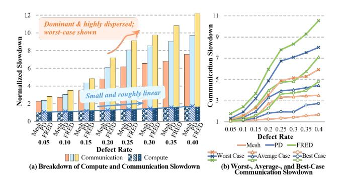
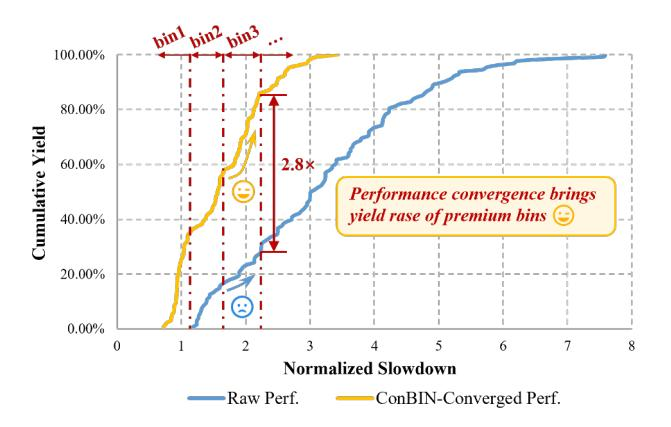

# I. INTRODUCTION

Recent advances in AI and large-scale models [8], [18], [20], [53] have driven demand for unprecedented compute, bandwidth and memory capacity. As AI infrastructure scales toward multi-gigawatt deployments, demand for wafer-scale systems is rising and new methodologies are improving their efficiency and economic viability, making WSC deployments at multi-gigawatt scale increasingly plausible with shipments potentially reaching hundreds of thousands of chips [22], [25], [29], [40], [51]. Wafer-scale computing systems, such as Cerebras WSEs [37], [38], overcome reticle limits (∼858 mm²/die) through advanced packaging, integrating over 10,000 mm² of active silicon — delivering far higher on-chip compute density and bandwidth than leading single-chip GPUs while avoiding inter-chip bottlenecks. However, this extreme scale makes yield and cost management a critical challenge. For example, the Cerebras WSE-3 occupies nearly an entire

Fig. 1. Compute and communication slowdown across defect rates at 128×136 chip scale under different interconnect topologies (Mesh, PD [59], FRED [44]) for GPT-2.7B. Slowdown is relative to a fault-free chip using non-fault-tolerant baseline (NFT); fault configurations follow Sec.VII-A.

300mm wafer (∼46,225 mm²) with ∼970,000 cores in a mesh topology [38]. Fabricated in a 5nm process with a reported defect density of ∼0.001 defects/mm² [31], the probability of fabricating a defect-free chip at this scale — according to the widely adopted negative binomial yield model [15] — is effectively zero, a fact already highlighted in [28].

Yield problems are not new for chip vendors, who have long commercialized imperfect chips by *binning* — grading them into product tiers according to compute metrics such as maximum frequency or the number of functional cores (e.g., Intel and AMD product stacks) — so that more chips can be sold rather than scrapped. However, WSCs targeting massively parallel workloads invalidate this traditional practice. Their execution time is jointly determined by compute and communication, and communication is highly sensitive to defect-induced irregularities. While compute capacity degrades roughly linearly with core loss, communication performance collapses nonlinearly under spatially distributed faults, as shown in Fig.1 across several wafer-scale interconnect topologies. This is because irregular activated core distribution and reduced interconnect resources force longer routing paths and exacerbate contention under complex traffic patterns such as all-to-all. Clustered faults on WSCs make this even worse, as neighboring failures squeeze traffic to their surroundings, which may become a communication bottleneck. These effects depend strongly on the spatial distribution of defects, making communication slowdowns, and thus overall performance, highly variable and difficult to anticipate. The remainder of this paper focuses on the mesh topology, which is widely used in practical wafer-scale designs.

This wide performance variance directly translates into reduced aggregate deliverable performance across bins (i.e., the total sellable effective compute capacity, SECC), thereby limiting scalable commercialization of WSCs. As illustrated in Fig.2, "Raw Perf." refers to fault-degraded performance, which exhibits a large spread with a small fraction of chips falling into high-performance bins, while "ConBIN-Converged Perf." refers to the enhanced and converged performance achieved

Fig. 2. Cumulative yield of 128×136-scale chips with example binning under raw (NFT baseline) and ConBIN-converged performance slowdown distributions. Configurations follow Sec.VII-A.

by our methods despite the fault impact, showing a much higher premium-bin yield, which reveals potential opportunities for optimization. So when performance dispersion is large, vendors must either adopt conservative binning thresholds that lower the guaranteed performance level of each bin, or set aggressive ones that sharply reduce the fraction of chips qualifying for premium bins. In both cases, the same functional yield results in lower effective binning yield and constrained total SECC.

In summary, mass-market productization of WSCs faces a dual challenge: (1) traditional compute-centric binning fails for WSCs, whose performance is dominated not only by compute capacity but also by defect-induced communication degradation, necessitating a new binning strategy; and (2) performance-convergence mechanisms are needed to tighten performance divergence and raise binning yield and SECC.

These challenges are reflected in the publicly described wafer-scale repair strategy of Cerebras [39]. To address extreme yield loss, this strategy preserves mesh regularity through redundant interconnects and treats any chip with a contiguous defect-free sub-mesh as functional, regardless of its size. This works only in a vertically integrated setting, where the same company designs and operates the compute service, because the compute service provider can absorb per-chip variability by scheduling workloads onto any mesh. However, it breaks down in a commercial product context. While it improves yield, it causes substantial chip-to-chip performance variability, as the activated core count differs widely and many otherwise functional regions remain unused. The resulting unpredictability complicates consistent testing, performance qualification, maintenance, and supply-chain planning, thus keeping mass-market productization out of reach.

To address both challenges, we first introduce Performance Binning, a new grading paradigm that classifies WSCs by their measured performance on representative target workloads rather than by core count or frequency, thereby aligning product tiers with guaranteed performance levels.

For effective performance binning, we propose a Performance-Convergence Recovery Framework for Wafer-Scale Chip Binning (ConBIN) to raise the share of chips qualifying for premium bins and to achieve converged performance by tightening the performance spread within each bin. As shown in Fig.6, ConBIN systematically spans the entire process from hardware-level design and softwarelevel optimization to chip performance binning based on target large-scale model workloads, where each stage explicitly drives performance convergence to support more aggressive bin thresholds without yield loss, increasing premium-bin share and total SECC.

It incorporates automated, fault-correlation-aware redundant interconnect design and post-silicon fault repair to salvage original compute and communication capabilities from defects and to approximate the expected topology across chips, thereby suppressing inter-chip divergence of core counts and topology structures under varying wafer-scale defect patterns and driving performance convergence across chips. On top of the repaired hardware, ConBIN performs bin-aware task scheduling guided by lightweight pre-binning targets. The pre-binning stage partitions repaired chips into preliminary bins and establishes bin-specific optimization objectives. Then, ConBIN develops workload mapping and fine-grained communication sequence scheduling, which adaptively pursue these optimization targets to further suppress performance variance and elevate chips near bin boundaries into higher-value bins. Finally, ConBIN grades chips by their post-recovery workload performance and executes dynamic-programmingbased performance binning to determine optimal thresholds that maximize total SECC.

Using system-level simulation, we demonstrate that ConBIN achieves a 2.80× yield gain in premium bins and up to 2.64× overall SECC gain compared with SOTA hardware–software fault-tolerant methods at 128×136 chip scale.

# I. INTRODUCTION

Recent advances in AI and large-scale models [8], [18], [20], [53] have driven demand for unprecedented compute, bandwidth and memory capacity. As AI infrastructure scales toward multi-gigawatt deployments, demand for wafer-scale systems is rising and new methodologies are improving their efficiency and economic viability, making WSC deployments at multi-gigawatt scale increasingly plausible with shipments potentially reaching hundreds of thousands of chips [22], [25], [29], [40], [51]. Wafer-scale computing systems, such as Cerebras WSEs [37], [38], overcome reticle limits (∼858 mm²/die) through advanced packaging, integrating over 10,000 mm² of active silicon — delivering far higher on-chip compute density and bandwidth than leading single-chip GPUs while avoiding inter-chip bottlenecks. However, this extreme scale makes yield and cost management a critical challenge. For example, the Cerebras WSE-3 occupies nearly an entire

Fig. 1. Compute and communication slowdown across defect rates at 128×136 chip scale under different interconnect topologies (Mesh, PD [59], FRED [44]) for GPT-2.7B. Slowdown is relative to a fault-free chip using non-fault-tolerant baseline (NFT); fault configurations follow Sec.VII-A.

300mm wafer (∼46,225 mm²) with ∼970,000 cores in a mesh topology [38]. Fabricated in a 5nm process with a reported defect density of ∼0.001 defects/mm² [31], the probability of fabricating a defect-free chip at this scale — according to the widely adopted negative binomial yield model [15] — is effectively zero, a fact already highlighted in [28].

Yield problems are not new for chip vendors, who have long commercialized imperfect chips by *binning* — grading them into product tiers according to compute metrics such as maximum frequency or the number of functional cores (e.g., Intel and AMD product stacks) — so that more chips can be sold rather than scrapped. However, WSCs targeting massively parallel workloads invalidate this traditional practice. Their execution time is jointly determined by compute and communication, and communication is highly sensitive to defect-induced irregularities. While compute capacity degrades roughly linearly with core loss, communication performance collapses nonlinearly under spatially distributed faults, as shown in Fig.1 across several wafer-scale interconnect topologies. This is because irregular activated core distribution and reduced interconnect resources force longer routing paths and exacerbate contention under complex traffic patterns such as all-to-all. Clustered faults on WSCs make this even worse, as neighboring failures squeeze traffic to their surroundings, which may become a communication bottleneck. These effects depend strongly on the spatial distribution of defects, making communication slowdowns, and thus overall performance, highly variable and difficult to anticipate. The remainder of this paper focuses on the mesh topology, which is widely used in practical wafer-scale designs.

This wide performance variance directly translates into reduced aggregate deliverable performance across bins (i.e., the total sellable effective compute capacity, SECC), thereby limiting scalable commercialization of WSCs. As illustrated in Fig.2, "Raw Perf." refers to fault-degraded performance, which exhibits a large spread with a small fraction of chips falling into high-performance bins, while "ConBIN-Converged Perf." refers to the enhanced and converged performance achieved

Fig. 2. Cumulative yield of 128×136-scale chips with example binning under raw (NFT baseline) and ConBIN-converged performance slowdown distributions. Configurations follow Sec.VII-A.

by our methods despite the fault impact, showing a much higher premium-bin yield, which reveals potential opportunities for optimization. So when performance dispersion is large, vendors must either adopt conservative binning thresholds that lower the guaranteed performance level of each bin, or set aggressive ones that sharply reduce the fraction of chips qualifying for premium bins. In both cases, the same functional yield results in lower effective binning yield and constrained total SECC.

In summary, mass-market productization of WSCs faces a dual challenge: (1) traditional compute-centric binning fails for WSCs, whose performance is dominated not only by compute capacity but also by defect-induced communication degradation, necessitating a new binning strategy; and (2) performance-convergence mechanisms are needed to tighten performance divergence and raise binning yield and SECC.

These challenges are reflected in the publicly described wafer-scale repair strategy of Cerebras [39]. To address extreme yield loss, this strategy preserves mesh regularity through redundant interconnects and treats any chip with a contiguous defect-free sub-mesh as functional, regardless of its size. This works only in a vertically integrated setting, where the same company designs and operates the compute service, because the compute service provider can absorb per-chip variability by scheduling workloads onto any mesh. However, it breaks down in a commercial product context. While it improves yield, it causes substantial chip-to-chip performance variability, as the activated core count differs widely and many otherwise functional regions remain unused. The resulting unpredictability complicates consistent testing, performance qualification, maintenance, and supply-chain planning, thus keeping mass-market productization out of reach.

To address both challenges, we first introduce Performance Binning, a new grading paradigm that classifies WSCs by their measured performance on representative target workloads rather than by core count or frequency, thereby aligning product tiers with guaranteed performance levels.

For effective performance binning, we propose a Performance-Convergence Recovery Framework for Wafer-Scale Chip Binning (ConBIN) to raise the share of chips qualifying for premium bins and to achieve converged performance by tightening the performance spread within each bin. As shown in Fig.6, ConBIN systematically spans the entire process from hardware-level design and softwarelevel optimization to chip performance binning based on target large-scale model workloads, where each stage explicitly drives performance convergence to support more aggressive bin thresholds without yield loss, increasing premium-bin share and total SECC.

It incorporates automated, fault-correlation-aware redundant interconnect design and post-silicon fault repair to salvage original compute and communication capabilities from defects and to approximate the expected topology across chips, thereby suppressing inter-chip divergence of core counts and topology structures under varying wafer-scale defect patterns and driving performance convergence across chips. On top of the repaired hardware, ConBIN performs bin-aware task scheduling guided by lightweight pre-binning targets. The pre-binning stage partitions repaired chips into preliminary bins and establishes bin-specific optimization objectives. Then, ConBIN develops workload mapping and fine-grained communication sequence scheduling, which adaptively pursue these optimization targets to further suppress performance variance and elevate chips near bin boundaries into higher-value bins. Finally, ConBIN grades chips by their post-recovery workload performance and executes dynamic-programmingbased performance binning to determine optimal thresholds that maximize total SECC.

Using system-level simulation, we demonstrate that ConBIN achieves a 2.80× yield gain in premium bins and up to 2.64× overall SECC gain compared with SOTA hardware–software fault-tolerant methods at 128×136 chip scale.

