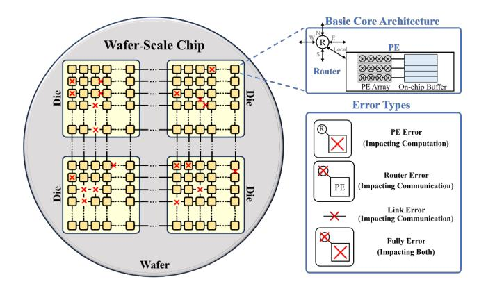

# IV. OVERVIEW

ConBIN targets the objective established in Sec.III maximizing the premium-bin yield and total SECC through inter-chip performance convergence — by aligning hardware and software layers toward performance variance reduction rather than mere mean speedup. As illustrated in Fig.6, the process begins with hardware-level redundant interconnect design and post-silicon repair. These steps approximate the expected mesh topology under diverse fault distributions while imposing implementation-feasible hardware constraints to ensure manufacturability. This suppresses extreme structural irregularities that would otherwise amplify chip-to-chip performance divergence. On top of the repaired topology, ConBIN performs software-level optimization through three tightly coupled stages. Pre-binning first groups repaired chips based on their hardware-level characteristics and derives perbin optimization targets with lightweight sampling. These targets provide a unified direction for subsequent mapping and scheduling, ensuring that chips within the same preliminary bin pursue the same performance objectives. Guided by these targets, workload mapping and communication-sequence scheduling apply adaptive, bin-aware optimization: each chip initially optimizes toward its own bin target and, upon reaching it, it is allowed to escalate toward higher-bin targets. This adaptive process tightens the overall performance spread and

Fig. 7. Basic architecture with component-level faults.

enables a larger fraction of chips to qualify for premium bins. After software optimization, chips are evaluated on representative workloads, and ConBIN determines the SECCmaximizing bin thresholds through dynamic-programmingbased performance binning. Since both hardware and software optimization explicitly drive performance convergence, binning thresholds can be set more aggressively without sacrificing yield, leading to higher premium-bin share and larger total SECC.

# IV. OVERVIEW

ConBIN targets the objective established in Sec.III maximizing the premium-bin yield and total SECC through inter-chip performance convergence — by aligning hardware and software layers toward performance variance reduction rather than mere mean speedup. As illustrated in Fig.6, the process begins with hardware-level redundant interconnect design and post-silicon repair. These steps approximate the expected mesh topology under diverse fault distributions while imposing implementation-feasible hardware constraints to ensure manufacturability. This suppresses extreme structural irregularities that would otherwise amplify chip-to-chip performance divergence. On top of the repaired topology, ConBIN performs software-level optimization through three tightly coupled stages. Pre-binning first groups repaired chips based on their hardware-level characteristics and derives perbin optimization targets with lightweight sampling. These targets provide a unified direction for subsequent mapping and scheduling, ensuring that chips within the same preliminary bin pursue the same performance objectives. Guided by these targets, workload mapping and communication-sequence scheduling apply adaptive, bin-aware optimization: each chip initially optimizes toward its own bin target and, upon reaching it, it is allowed to escalate toward higher-bin targets. This adaptive process tightens the overall performance spread and

Fig. 7. Basic architecture with component-level faults.

enables a larger fraction of chips to qualify for premium bins. After software optimization, chips are evaluated on representative workloads, and ConBIN determines the SECCmaximizing bin thresholds through dynamic-programmingbased performance binning. Since both hardware and software optimization explicitly drive performance convergence, binning thresholds can be set more aggressively without sacrificing yield, leading to higher premium-bin share and larger total SECC.

