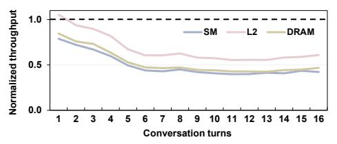
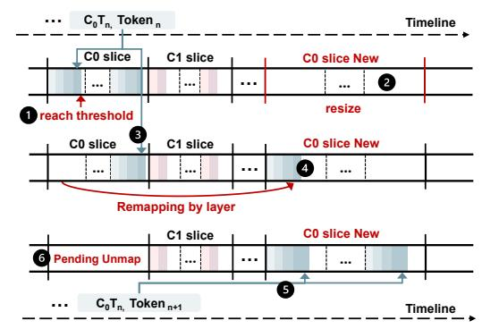
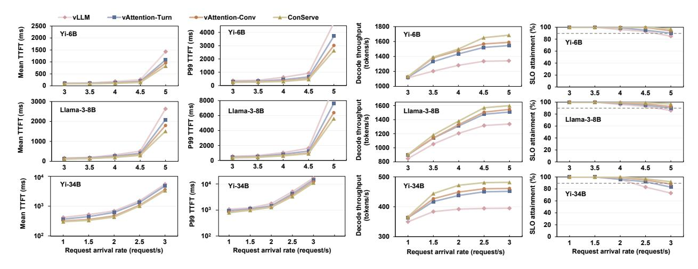
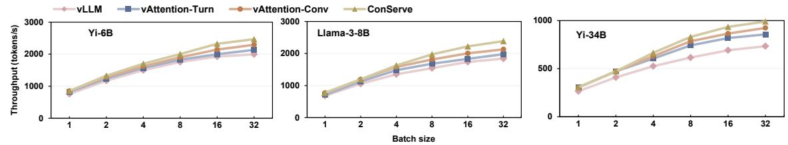
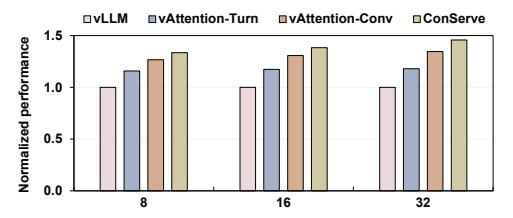

# *B. Performance Overhead of Multi-Turn Prefill*

We evaluate multi-turn conversation behavior on Llama-3- 8B with a fixed 512-token input and 64-token decode per turn. Turn 1 prefills the initial 512 tokens and then decodes 64 new tokens. At turn i + 1, we append another 512-token input, prefill only those 512 tokens while reusing the KV cache from turns 1...i, and then decode another 64 tokens.

Fig. 4. The normalized prefill kernel runtime of FlashInfer-paged per turn relative to FlashInfer at the same turn.

Fig. 5. The normalized throughput of SM, L2\$ and DRAM of FlashInferpaged per turn.

As turns accumulate, the prefill reads progressively more KV data from earlier turns. Figure 4 shows FlashInfer-paged prefill runtime normalized per turn to the native at the same turn. Note that both configurations operate at the same context length and per-token arithmetic. The only difference is the KV placement and the resulting memory access pattern. One can observe that FlashInfer-paged slows progressively as turns accumulate, with normalized prefill runtime rising from  $1.2\times$ to 1.75×. The early turns show an increasing slowdown because the paged KV layout makes each prefill traverse many non-contiguous virtual pages, which increases TLB misses and page table walks. After several turns, the translation and coalescing penalties are nearly saturated, leaf-level page table walks and block table lookups impose a roughly constant overhead, so the ratio stabilizes. Nevertheless, the paged layout remains slower because the scattered placement continues to exceed the effective TLB capacity, increases frequent leaf-level page table walks, and adds block-table lookups that increase instruction counts and register pressure.

Figure 5 shows per-turn SM, L2, and DRAM throughputs of FlashInfer-paged normalized to native at the same turn. Under paged KV, all three throughputs decrease steadily as turns accumulate. The reason is straightforward: address translation stalls occupy issue slots, so fewer memory and compute instructions are issued per cycle, reducing SM throughput. With many warps stalled on translation instead of issuing memory requests, the request rate into the memory hierarchy drops, lowering L2 and DRAM throughputs. The scheduler metrics in Figure 6 are consistent: long-scoreboard stalls rise while eligible warps per cycle fall under paged KV, indicating that the scheduler cannot hide the added translation latency.

**Takeaway.** Single-turn slowdowns of 12-24% indicate that a non-contiguous (block-scattered) virtual layout degrades LLM inference performance: at the same context length and with identical model compute, it increases translation stalls and reduces scheduler readiness and memory system throughput.

Fig. 6. The long-scoreboard stall and eligible warps per cycle per turn of FlashInfer and FlashInfer-paged.

Multi-turn serving amplifies the effect: comparing at the same turn, the paged layout is up to  $1.75\times$  slower than a contiguous layout. This widening gap motivates a design that preserves a contiguous virtual slice, which maintains translation locality and sustains throughput as the history grows.

#### IV. CONSERVE DESIGN

Our goal is to reduce multi-turn LLM serving latency by improving the GPU address translation locality on KV cache accesses. Our analysis shows assigning conversation a contiguous virtual address slice and keeping KV accesses contiguous concentrates translation into fewer TLB entries and page walk cache lines, thereby shortening page table walks and the memory stalls they induce. To this end, we propose a contiguity-aware allocator that assigns each conversation a contiguous virtual address slice and manages it with copy-free elastic resizing. However, implementing such a mechanism is non-trivial. First, conversation length grows unpredictably, so the slice must be sized large enough to avoid frequent resizes yet not so large that it compromises translation locality or wastes space. Second, resizing and remapping can shift the slice's base and range; address mappings must remain consistent for kernels in flight without mid-step stalls. Third, remapping triggers driver and hardware work such as page faults, page table updates, and TLB shootdowns. These operations must be moved off the execution critical path and batched to minimize and amortize overheads. Finally, the design must be implementable with current CUDA virtual memory APIs and integrated with attention kernels.

#### A. Virtual Address Reservation

**Reservation Size.** We assign a *single contiguous* virtual address (VA) slice for each conversation, and all subsequent turns will be appended to the corresponding reserved conversation slice, as shown in Figure 7. For a micro-batch of conversations, we allocate independent VA slices for each conversation. Each VA slice is aligned to a fixed VA group size *G* (2 MB unless stated) as CUDA memory allocated size. The physical pages are allocated on demand as KV blocks are generated, which is identical in spirit to the on-demand paging in vAttention [52]. The key question is how large a VA slice should be reserved.

An intuitive approach is to reserve the model's maximum sequence length for every conversation. However, in multiturn conversations, the number and length of future turns are unknown, and some turns of requests are short. Overreserving enlarges each conversation's VA slice, leaving wide unused spans that increase fragmentation and create larger

Fig. 7. Conversation virtual address reservation and mapping in ConServe.

gaps between active regions. These gaps reduce the opportunity that concurrent conversations share upper-level page table indices (i.e., VA prefixes), reducing page walk cache reuse and degrading translation locality. Our goal, therefore, is to reserve "just enough" to keep the working set compact, growing the slice elastically only when needed. Therefore, we propose to size the VA slice to a *conversation-level target*: the tokens that are currently live (initially the prompt) plus the predicted additional tokens that will remain in context, capped by the model's context window. If the conversation later exceeds this estimate, we resize the VA slice and copy-free remap into a larger contiguous range (Section IV-B).

We first quantify the KV cache footprint, mapping it to the VA size. On a GPU shard with  $L_{\rm shard}$  transformer layers,  $H_{\rm shard}$  attention heads, head dimension  $d_{\rm head}$ , and element size b bytes (e.g., b=2 for BF16), the KV bytes per generated token are

$$B_{\text{tok}} = 2 \cdot L_{\text{shard}} \cdot H_{\text{shard}} \cdot d_{\text{head}} \cdot b,$$

accounting for both K and V tensors.

Next, to decide how many tokens to reserve for upcoming turns, we estimate future generation length by offline profiling datasets such as ShareGPT [55]. For each conversation c, we measure the total number of tokens across the whole conversation  $L_c$ , and the number of user-chatbot interaction turns  $M_c$ . We can get the average tokens per turn for that conversation using  $s_c = L_c/M_c$ . Then we take the empirical rth percentile  $q_r$  of the set  $\{s_c\}$  and set the per-turn token reservation to  $Q = q_r$ . For example, if r is the 80th percentile with  $q_r = 512$  tokens, we set per-turn token budget Q as 512.

Finally, we introduce a headroom parameter k, which ensures that enough capacity is reserved for the first k turns. This reduces the need for early resizes while avoiding overallocating. Let  $T_{\rm prompt}$  be the tokens in the initial prompt of the conversation (so the live tokens at the beginning equal  $T_{\rm prompt}$ ), and let  $ctx\_len$  be the model's context window. We set the conversation-level target to

$$T_{\text{target}}^{(0)} = \min \{ \text{ctx\_len}, T_{\text{prompt}} + Q \cdot k \}$$

This guarantees room for what is already in context and roughly k turns under the conservative per-turn budget Q, and never exceeds the model's limit. We then convert this token target into a contiguous virtual reservation by rounding up to whole groups:

$$R_0 = \left\lceil \frac{T_{\text{target}}^{(0)} \cdot B_{\text{tok}}}{G} \right\rceil$$

This step reserves virtual address space only, physical pages are mapped on demand as KV cache is generated. In all

Fig. 8. Virtual address layout for conversations of ConServe.

experiments, we use k=8 and r=80% by default and also study the sensitivity of k and r in Section V-D.

**Virtual Address Allocation Layout.** Each conversation owns a single contiguous VA slice, partitioned into  $L_{\rm shard}$  layer-major segments laid back-to-back, as shown in Figure 8. All KV cache for the attention heads resident on this shard in layer l is stored contiguously inside layer l's segment. This layout matches the decode kernel's access pattern, where layers are accessed sequentially, and within a layer, the kernel scans the KV of prior tokens. Therefore, a layer's hot working set remains within a few adjacent VA groups.

Initially, the prompt occupies the leftmost blocks of every layer segment, and newly generated tokens are appended to the right. We therefore do not lay out data by "turn". Instead, each layer's history across all turns remains contiguous in its own segment. When context management operations (e.g., sliding-window truncation or summarization) drop older tokens, we unmap those leftmost blocks and, if one or more whole groups are freed, compact the remainder leftward via copy-free remapping while preserving contiguity. Addressing is purely arithmetic; kernels compute each location from a per-conversation base and per-layer offset, with no per-token indirection or block tables. Given a conversation base VA and a per-layer segment offset, the VA for token t in layer l is:

$$VA(t, \ell) = base + seg_{off}[\ell] + t \times B_{layer}$$
 (1)

where  $B_{layer}=2 \times H_{shard} \times d_{head} \times b$  is the per-token KV stride for that layer on the shard, and kernel threads add an intra-token offset  $\delta \in [0,B_{layer})$  to index individual elements within that token's KV cache. For a micro-batch of requests/conversations, for each layer, the runtime forms a compact descriptor for the current micro-batch that contains (i) the per-sequence KV base pointers and (ii) the live sequence lengths. We then invoke the attention kernel in variable-length mode, which reads that sequence's KV by first loading the corresponding base pointer from the descriptor, and streams KV contiguously using the base-plus-offset indexing.

#### B. Elastic Resizing

When to resize: A resize is considered when the reserved VA slice for this conversation is nearly saturated. Let R be the reserved VA slice size and U the currently used portion. When the utilization ratio  $\eta = U/R$  exceeds a utilization threshold  $\theta_u$  (we use  $\theta_u$ =0.90 as default and study its sensitivity in Section V-D), we grow the slice (as shown in Figure 9 ①). Specifically, we check  $\eta$  at the start of each token (entering layer 0), and allocate a new slice when the threshold is met.

**How much to resize:** When a resize is scheduled, we recompute the conversation-level target with the same turn-based rule used at initial reservation, but now with the current progress. We maintain the conversation's average tokens per

Fig. 9. Resizing process of ConServe.

turn and use this heuristic as new per-turn token budget Q. Specifically, we set

$$T_{\text{target}}^{(new)} = \min \left\{ \text{ctx\_len}, \ T_{\text{live}} \ + Q \cdot k \right\}$$

where  $T_{\rm live}$  is the current number of live tokens (including all previous history tokens). We then choose the new reservation as the larger of a geometric bump and the target-aligned size:

$$R_{\text{next}} = \max \left( \left\lceil \gamma \cdot R \right\rceil, \left\lceil \frac{T_{\text{target}}^{(new)} \cdot B_{\text{tok}}}{G} \right\rceil \right)$$
 (2)

where R is the last reservation size and  $B_{tok}$  is tokens KV bytes. This resizing policy adapts to both short and long per-turn sequences while avoiding unnecessary memory overprovisioning. When the average tokens per turn Q is small, utilization increases slowly and the threshold  $\eta$  is reached only after many turns. The resize typically follows the geometric branch and expands the reservation from R to  $\gamma R$  (we use  $\gamma = 1.5$  by default). Because we trigger at utilization  $\theta_u$ , the next resize cannot occur until roughly  $(\gamma-1)\theta_u R$  additional bytes are allocated, i.e.,  $(0.5 \theta_u R)/B_{\text{tok}}$  more tokens. This space resizes by hundreds to thousands of tokens in practice and avoids an oversized jump. When Q is larger, one single turn may push utilization past the threshold. In that case, the target branch expands directly to roughly  $T_{live} + kQ$  tokens (still capped by  $ctx\_len$ ), preventing back-to-back resizes by jumping once to the desired capacity.

Note that a corner case can still arise when the historical Q is very small (e.g., many very small turns) followed by an abrupt large turn, in which case the geometric branch may dominate for a few resizes before Q catches up, which can lead to frequent resizes in consecutive turns. To further improve robustness under such abrupt shifts, we add a lightweight rule: if a conversation triggers resizes in consecutive turns, we temporarily set Q to the most recent turn's observed token, and directly size the next reservation to  $T_{\rm live} + Q \cdot k$ . Once a turn completes without another resize, we revert to the standard running-average update for Q.

**How to resize:** Figure 9 illustrates the resizing process. When a resize is scheduled, we allocate a larger, contiguous virtual memory slice, whose size is determined by the current target in Eq. (2) (2). We migrate each layer's segment to that new slice, mapping it to the same physical pages as before,

TABLE I
THE FORMAT OF FREE-LIST. VALUES ARE IN GROUP UNITS.

| g start | Glen | status        | Merge |
|--------------------|------|---------------|-------|
| 100                | 50   | FREE          | 0     |
| 300                | 20   | FREE          | 0     |
| 320                | 12   | PENDING_UNMAP | 1     |
| 332                | 10   | PENDING_UNMAP | 1     |
| 900                | 64   | PENDING_UNMAP | 0     |

preserving the one-segment-per-layer layout. Note that the KV cache data are not moved. To find the available new slice, we maintain a free virtual memory interval list (free-list), as shown in Table I. We store four fields for each interval: start group  $g_{start}$ , length  $g_{len}$ , status, and a merge flag (details in Section IV-C). The real virtual addresses are computed as  $start_VA = area\_base + g_{start} * G$ , where  $area\_base$  is the base of the process-wide VA arena reserved once with cuMemAddressReserve. To place new slices with minimal fragmentation, we choose the interval by best-fit: the freelist maintains a length-ordered index to locate the smallest  $length \geq n$  groups in O(log M) time over M intervals. If found, we allocate the leftmost n groups as the new slice, remove the original entry, and, when  $g_{len} > n$ , the leftover tail  $(g_{start} + n, g_{len} - n)$  is inserted back. If no interval is large enough, we trigger coalescing (details in Section IV-C).

After selecting the destination, we employ a copy-free remapping approach, which is overlapped with computation to avoid stalling the execution critical path. During a prefill or decode iteration, layers execute in order and each layer exclusively touches a fixed VA segment within the slice. As soon as layer  $\ell$  finishes for the current token, we can prepopulate its translation mapping in the new slice, binding to the same physical pages as in the old slice (4). Because subsequent layers access different segments, these updates do not conflict with running kernels, and the old mappings remain intact for the rest of the iteration, so in-flight work observes a stable VA image. Subsequent layers still use the old slice (3). At the next iteration barrier, i.e., after the last layer's writes are complete and before the next token begins, we update the conversation descriptor's slice base and per-layer segment offsets from the old slice to the new one (6). Kernels compute addresses via base-plus-offset arithmetic exactly as in Eq. 1.

Finally, reclamations (unmapping old page table entries and TLB shootdown) are performed lazily and in batches. We keep all old mappings, so there is no translation invalidation on the execution critical path. Instead, the former slice is quarantined with status PENDING\_UNMAP and is not accessed (6). Later, when the device is idle or when the free list is not sufficient, the runtime unmaps all "PENDING\_UNMAP" ranges and issues TLB invalidations in a batch. This keeps correctness because we never reuse an address range until its mappings are revoked and its stale translations are invalidated.

#### C. Fragmentation Management and Coalescing

The virtual address external fragmentation arises when resizes and lazy reclamations leave holes between conversa-

tion virtual memory slices. Although modern 64-bit systems typically use 48 address bits (≈ 256 TB) for VA, scattering of slices can still throttle concurrency. Therefore, free virtual address space must be organized and harvested.

To manage the virtual address space efficiently, the allocator maintains a dual-indexed free list. In addition to a lengthordered view that ranks usable intervals for best-fit placement as described in Section IV-B, an address-ordered view is used to detect adjacent intervals and eagerly coalesce neighbors when intervals' statuses change from PENDING\_UNMAP to FREE. Each interval also stores a *merge* flag (1 or 0), as shown in Table I. The merge flag is used only for PENDING\_UNMAP intervals: it is initialized to 0 on creation and set to 1 by background maintenance whenever the interval is exactly contiguous with its neighbor no matter whether PENDING\_UNMAP or FREE in the address-ordered view; flags on FREE intervals remain 0. The flag acts as a compact marker for reclamation: it identifies PENDING\_UNMAP intervals that can be coalesced, so the runtime can assemble a worklist without scanning the entire table.

Actual reclamations are performed only after an interval's page table mappings have been unmapped, any stale TLB translations invalidated, and contiguity is revalidated. We drain quarantined PENDING\_UNMAP space proactively. Specifically, we build the worklist in two regimes: (i) demand-driven, which selects the minimal set of adjacent PENDING\_UNMAP intervals needed to reach Rnext; and (ii) background bulk, during idle windows, the runtime reclaims a larger batch of PENDING\_UNMAP intervals to consolidate scattered space. The runtime first issues range unmap of page table and TLB invalidation for exactly the worklisted ranges, changes their *status* to FREE, and coalesces in place by rechecking its predecessors and successors in the address-ordered view: if endpoints match, neighbors are merged; if both sides are contiguous and FREE, both merges occur. After coalescing, the corresponding intervals' merge flags are reset.

#### *D. Demand Physical Memory Allocation*

We employ the same demand-paging mechanism for physical memory as vAttention [52]. Specifically, during prefill or decode, physical page mapping is overlapped with kernel execution: while iteration i − 1 runs, a background thread monitors each request's context length and currently mapped pages, determines whether iteration i will need more memory, and maps the next set of physical page groups. We also keep deferred reclamation with reuse when conversations complete. When one conversation finishes and another begins, we leave the recently freed page groups mapped and reassign them to the new conversation, avoiding page allocation overheads.

We implement demand physical memory allocation using NVIDIA Driver-API virtual memory interface with CUDA's default 2 MB allocation granularity [42]. The allocator decouples the allocation of virtual memory from physical memory. It first reserves virtual address space and then allocates physical pages as the conversation grows. At process startup, the runtime reserves one large, contiguous VA arena with cuMemAddressReserve, and each conversation is assigned a contiguous slice within this arena, establishing baseplus-offset address arithmetic used by all kernels. Physical allocation and mapping occur only at token (iteration) boundaries. If the next token will exceed the currently provisioned allocated physical capacity, the runtime allocates additional 2 MB with cuMemCreate, maps them into the pre-reserved virtual addresses via cuMemMap, and grants read–write visibility on the executing GPU with cuMemSetAccess. When resizing, the runtime first selects a disjoint virtual interval and pre-allocates mappings there that bind to the same physical pages as the old slice, so no KV data is moved. At the iteration barrier, the conversation descriptor's slice base and per-layer segment offsets are updated to the new interval, making the change transparent to kernels that compute addresses by baseplus-offset. Reclamation is deferred and batched: ranges from the former slice are quarantined off the critical path and later unmapped with cuMemUnmap together with a batched TLB invalidation. Only after revocations are globally visible are those VA ranges returned to the arena's free list. When a conversation terminates, any remaining allocation handles are released with cuMemRelease, the arena itself is freed with cuMemAddressFree when the serving process shuts down.

#### V. EVALUATION

#### *A. Experimental Setup*

Baselines. We compare ConServe with the following stateof-the-art LLM serving systems:

- vLLM [30]: A widely deployed serving system that manages the KV cache with PagedAttention under a fixed, blocked layout. It pre-allocates a large memory pool at initialization and partitions it into fixed-size KV blocks ("pages") that are scattered within this pool and accessed via a software block table; unless otherwise stated, we use a block size of 16 tokens per block, which is the configuration that minimizes kernel overhead in our environment and in prior reports [52].
- vAttention [52]: vAttention decouples virtual and physical memory by reserving a contiguous virtual address slice sized for the model's maximum supported context length for each request, and demand-mapping 2 MB physical page as the sequence grows. Since vAttention targets a single request whose KV cache is released on completion, it is not directly intended for multi-turn conversations that are repeatedly extended. To apply it in multi-turn serving, we evaluate two natural interpretations of a "request": (i) *turn-as-request*, where each turn is treated as an independent request (preserving per-turn contiguity but placing a conversation's history across disjoint virtual regions), and (ii) *conversation-asrequest*, where the entire conversation is treated as one longlived request. We refer to these two variants as vAttention-Turn and vAttention-Conv, respectively.

Models and setup. We evaluate three representative models using their long-context variants and default architectural hyperparameters: Yi-6B-200K (grouped-query attention with Hq=32, Hkv=4, L=32), Llama-3-8B-262K (Hq=32, Hkv=8,

Fig. 10. Online serving evaluation under varying request-arrival rates for Yi-6B, Llama-3-8B, and Yi-34B.

L=32), and Yi-34B-200K (Hq=56, Hkv=8, L=60). Unless otherwise noted, Yi-6B and Llama-3-8B run on a single NVIDIA A100-80GB, and Yi-34B runs on two NVLinkconnected A100-80GB GPUs with tensor parallelism TP=2. We use BF16 weights. Long-context inference is enabled, and sliding-window attention or context-truncation variants are disabled so that the full KV cache is always kept in memory. All systems use the same batching policy. We use CUDA VMM with the default 2 MB mapping granularity.

Dataset. We evaluate online serving and offline inference using a widely-used ShareGPT [55] dataset. For online serving, requests arrive following a Poisson distribution at varying rates; for offline inference, all requests arrive at the start.

Metrics. For online serving, we use TTFT, p99 TTFT, decode throughput, and SLO attainment to fully illustrate the effectiveness of ConServe. The SLO constraint is set as 25 × TTFT and TPOT of requests finished without request contention (i.e., request rate 0.01 [66], [70]). For the offline inference, we focus on the metric of total end-to-end throughput.

#### *B. Overall Performance - Online Serving*

Prefill evaluation. Figure 10 shows the mean TTFT of different request arrival rates under ShareGPT multi-turn workloads for Yi-6B and Llama-3-8B on one A100, and Yi-34B with TP-2 on two A100s. Our approach ConServe achieves lower TTFT across all request rates and models, up to 64.1%–74.4% lower than vLLM, 31.4%–43.4% lower than vAttention-Turn, and 8.3%-19.1% lower than vAttention-Conv. One can observe that TTFT remains nearly flat at low rates and rises rapidly as the arrival rate approaches saturation, when queueing delay grows sharply as new prefills wait behind ongoing work. This transition occurs around 4.5–5 req/s for Yi-6B and Llama-3- 8B and earlier (≈ 2–2.5 req/s) for Yi-34B due to its larger KV footprint and cross-GPU coordination. However, our approach achieves lower TTFT than vLLM for two reasons. First, it removes page-granular indirection from the critical path. In paged KV caches, each access is routed through a block table: the kernel identifies the current block, computes the within-block offset, and, if the access spans a block boundary, fetches the next block's pointer and repeats. These lookups and boundary checks add instructions and extra memory references and fragment access patterns, thereby causing the memory system to issue more, smaller transactions and lowering effective bandwidth. In contrast, our approach appends each token into a single linear region: the kernel uses one baseplus-offset address, so warps issue aligned, contiguous global accesses that coalesce into large transactions, reducing memory transactions, L2 write allocations, and address translation overheads. Second, PagedAttention couples sequence growth to block management: whenever a sequence crosses a block boundary, the runtime must allocate a new block and update the block table map before subsequent kernels can run. Even if such growth events are not frequent, they sit on the critical path during prefill and decode, adding extra work and launch delays when the system is busy. However, our approach eliminates this per-block growth overhead via elastic resizing, which adjusts a conversation's reservation in large chunks via copy-free remapping that overlaps with attention computation, keeping resizing off the critical path.

Our approach outperforms vAttention-Turn because vAttention-Turn preserves contiguity only within a single turn. Across turns, the same conversation's KV is placed in multiple disjoint virtual ranges. During multi-turn serving (prefix reuse in prefill), attention reads KV cache spanning all previous turns, making memory accesses jump between non-contiguous regions. This cross-turn scattering enlarges the working set of page table entries, weakens temporal locality in page walk caches, and increases page table walk traffic and translation misses, all of which raise TTFT. By contrast, we keep a single contiguous VA per conversation, so prefill traverses a compact, sequential address space with fewer distinct PTEs touched, yielding lower and more stable prefill time and denser memory access.

vAttention-Conv alleviates cross-turn non-contiguity by treating an entire conversation as a single long-lived request; accordingly, it improves over vAttention-Turn. Nevertheless, ConServe still outperforms vAttention-Conv because it preserves address translation locality across concurrently batched requests. The key issue is that vAttention-Conv reserves a maximum-context virtual slice per conversation, which pushes the actively used KV regions of different conversations farther apart in the VA space. Under batching, the GPU interleaves warps/CTAs from many conversations, so spreading active KV ranges across far-apart virtual regions expands the translation working set and reduces page walk cache reuse. More importantly, the wider spacing lowers the effective TLB reach on modern NVIDIA GPUs, whose TLB entries are organized into 16 sub-entries [33], [64], [65], [76]: when active pages are distributed across many distant regions, TLB entries are frequently evicted before their sub-entries are fully populated. For example, for Llama-3-8B in BF16, the KV footprint is about 4 KB per token per layer, so a 4K-token conversation occupies roughly 16 MB per layer (eight 2 MB pages). Under vAttention-Conv, reserving a max-length slice can space conversations far apart in the VA, so each conversation occupies a separate TLB entry whose coverage corresponds to a 32 MB region, yet touches only 8 of the 16 sub-entries associated with that TLB entry (i.e., 50% utilization). As the GPU interleaves execution across sequences in a batch, the TLB becomes populated by many such low-utilization entries; under finite capacity, these entries are displaced by other segments before the remaining sub-entries can be used, amplifying translation misses and increasing memory access stalls.

P99 prefill evaluation. Compared to mean TTFT, p99 TTFT grows more sharply near saturation because queueing amplifies at high load and prefill work is highly heterogeneous: a small fraction of requests with much longer effective prefixes (prompt length plus reused history) take substantially longer to prefill and delay subsequent requests, inflating the tail. Across the evaluated models, ConServe achieves the lowest p99 TTFT, indicating that elastic resizing does not introduce frequent "stop-the-world" effects on the critical path: if remapping routinely stalled the system globally, many requests would be delayed simultaneously and p99 would spike near saturation. Instead, resizing is initiated asynchronously and applied at iteration boundaries, allowing remapping to overlap with attention computation, so its overhead is largely hidden or amortized and does not dominate the tail under contention.

Decode evaluation. Our approach ConServe achieves higher decode throughput across all arrival rates and models as shown in Figure 10, improving by 19.4%-25.6% over vLLM, 6.1%- 9.5% over vAttention-Turn, and 4.2%-6.1% over vAttention-Conv. Decode attention is largely memory-bound, so when all systems use a strong kernel, per-step compute time is similar. The throughput gap comes from data layout and how steadily decode is fed. During decode, each new token must read all prior KV. Some lines hit in L2 cache and return quickly, but as arrival rate and context grow, the live KV cache working set across layers and concurrent requests far exceeds L2 cache capacity, so every system experiences more cache evictions. This makes the cost of address translation a key differentiator: even on an L2 cache hit, the GPU still needs to translate the virtual address; a TLB miss triggers a page walk that adds latency and reduces tokens-per-second. First, ConServe keeps one contiguous virtual address range per conversation across turns, so the decoder touches fewer distinct pages and reuses translations and page walk cache longer. At the same time, base-plus-offset indexing over a contiguous range produces a more regular read stream with better load coalescing and higher effective bandwidth than vLLM's page-indexed layout and vAttention's multi-turn placement (cross-turn scattering in vAttention-Turn or far-apart max-length reservation in vAttention-Conv), both of which enlarge the set of translations and fragment memory accesses as context grows. Second, lower TTFT with our approach ConServe admits requests into decode more evenly, allowing the continuous batching scheduler to form larger and steadier decode batches at the same arrival rate, keeping the SMs busier and increasing tokens per second. These benefits are more significant for models with larger KV footprint (e.g., Yi-34B), which suffer more severe translation pressure.

SLO attainment. Using the SLO target defined in Metrics, ConServe achieves higher SLO attainment across all request rates and models as shown in Figure 10, maintaining a larger fraction of requests within the target at the same arrival rate. Because the target is derived from the no-contention baseline, violations occur when prefill waiting grows or when pertoken latency during decode increases. ConServe improves both: lower and less variable prefill time reduces queueing as arrival rate rises, while higher decode throughput keeps pertoken latency within the limit even under high L2 pressure. Taken together, these yield 11%–19%, 7%–9%, and 3.2%- 4.9% higher SLO attainment than vLLM, vAttention-Turn, and vAttention-Conv at high arrival rates, respectively. Note that the gains of our approach increase with model scale (e.g., 19% on Yi-34B vs. 12% on Yi-6B over vLLM). This is because larger models have a bigger KV footprint and touch more pages, suffering more pressure on address translation, so the benefit of our contiguous cross-turn layout is amplified, demonstrating that ConServe scales to large models.

#### *C. Overall Performance - Offline Inference*

We measure end-to-end throughput in an offline setting as the number of model tokens processed per second, including both prefill and decode. Figure 11 shows results of Yi-6B, Llama-3-8B, and Yi-34B with varying batch sizes up to 32. We construct the workload by replaying full multi-turn conversations from ShareGPT. We maintain a fixed limit of B concurrent sequences (batch size). When a conversation finishes a turn, its next turn is immediately executed using the existing KV cache; if the conversation ends, its slot is filled with the first turn of a new conversation. Thus, the scheduler continuously forms micro-batches from active turns until all conversations are processed. First, ConServe achieves the highest end-to-end throughput across all batch sizes and models, 17.7%-35.1%, 8.6%-15.6%, and 7.2%-12.1% over vLLM, vAttention-Turn, and vAttention-Conv, respectively.

Fig. 11. Offline inference evaluation under varying batch sizes for Yi-6B, Llama-3-8B, and Yi-34B.

Fig. 12. Normalized end-to-end throughput under different parameters using Llama-3-8B in an offline setting with batch size = 32.

The reason matches our online serving study: a single contiguous VA per conversation lets reads and writes use simple baseplus-offset indexing instead of paging through block tables or jumping across non-contiguous regions, while keeping active KV ranges compact in VA preserves translation locality across concurrently batched conversations. Second, our improvement increases as batch size grows (and larger models). In particular, compared to vAttention-Turn, we achieve similar performance at small batch sizes (e.g., 1, 2, and 4), but the gap widens at larger batches. This is because in vAttention-Turn, a conversation's KV cache across turns is placed in multiple disjoint regions. Although offline execution processes turn sequentially, a later turn must read all earlier tokens, so the read stream necessarily jumps across those regions. At small B, this fragmentation cost is small, but at large batches it amplifies: if each conversation spans k regions (one per past turn), each attention computation exposes  $B \times k$  distinct regions to the TLBs and L2. In contrast, our approach keeps one range per conversation, so each attention computation touches only  $B \times 1$ regions. As B grows, the fragmented layout's working set grows with  $B \times k$  while ours grows only with B, so the relative penalty of k > 1 becomes increasingly significant at large batch sizes. Third, compared to vAttention-Conv, our advantage stems from higher translation efficiency under batched execution. In offline evaluation, all conversations are known upfront and processed in fixed batches. Thus, the runtime can place each conversation's reserved slice back-toback in the virtual address space. However, vAttention-Conv still reserves a maximum-context slice per conversation, so a batch of B conversations spans B large VA segments, while each conversation typically touches only a small prefix of its segment (a few 2MB page groups). With modern NVIDIA sub-entry TLB organizations [33], [76], this creates many partially populated TLB entries: each segment consumes an entry, yet only a small subset of its sub-entries are used before the TLB must also accommodate entries for other segments in the batch. As B increases, the TLB fills with low-utilization entries that are evicted before additional sub-entries become useful, reducing effective TLB reach and increasing page walk traffic. In contrast, ConServe grows each conversation's reservation toward its active footprint, keeping the batch's actively accessed KV pages more compact in VA and improving subentry utilization and translation reuse, which translates into higher effective bandwidth and higher end-to-end throughput.

#### D. Sensitivity Study

Sensitivity to initial reservation turns. Recall that we use k = 8 turns by default for both the initial slice reservation and resize headroom. In this study, we vary the number of turns and show the end-to-end throughput normalized to the default in Figure 12 (a). As pre-reserved turns increase, throughput drops. This is because, although larger reservations reduce the number of resizes, in our default configuration, resizes are already infrequent and largely hidden behind computation. The extra headroom instead widens each conversation's VA span, which it does not fully utilize, creating larger gaps between active regions. This lowers the opportunity for concurrent conversations to share upper-level VA indices and yields bad locality in the page walk cache, with a more visible drop at very large reservations (e.g., 128 turns). Throughput also degrades when the number of turns is too small because the system resizes more frequently. The added mapping and PTE installs contend for memory and driver resources and cannot be fully overlapped every time, so small delays accumulate. Overall, turn = 8 strikes a good balance.

Sensitivity to the per-turn budget. We derive the per-turn token budget using the r=80% percentile of the tokensper-turn distribution. We study different r and report end-to-end throughput normalized to the default 80%. As shown in Figure 12 (b), the results remain steady with different r. This is because r only determines the initial virtual slice reservation. Any misestimate is corrected promptly by our copy-free remapping overlapped with computation. Therefore, our approach is insensitive to initial tokens per turn.

Sensitivity to the resize threshold. We resize the conversation virtual address slice when the utilization ratio  $\theta_u$ =0.90.

Fig. 13. Online serving evaluation using a real production trace Qwen-Bailian Dataset with Llama-3-8B.

We now study different  $\theta_u$  impact on end-to-end throughput, and Figure 12 (c) shows the results normalized to the default  $\theta_u$ =0.90. As one can observe, lower  $\theta_u$  degrades the performance as it triggers resize earlier and more often, increasing the number of resize events. Increasing  $\theta_u$  reduces how often we resize, but overall throughput stays essentially unchanged. This is because as long as the remapping finishes while computation is still running, the next kernel launches without waiting and overall throughput is unaffected.

Sensitivity to the resize size. We grow the reserved virtual space by a factor  $\gamma$  at each resize (from R to  $\gamma R$ ), by default  $\gamma=1.5$ . We sweep  $\gamma$  and show overall throughput normalized to  $\gamma=1.5$  in Figure 12 (d). When  $\gamma$  is small (e.g., 1.2), overall throughput worsens by 5% because the system resizes more often and the many small resizes add overheads. When  $\gamma$  is large (e.g., 2.0), the performance drops 7% as it reserves more address space than short-turn conversations' need and reduces potential address translation locality.

#### E. Generality Across Workload Traces

So far, we are using ShareGPT as our primary trace, and the default initial reservation parameter r is derived from ShareGPT. To evaluate generalizability, we keep the same default settings (initial token reservation r = 80% and number of turns k = 8) and replayed a production trace Qwen-Bailian Dataset with To-C trace [62], which captures a chat-style interactive service with real timestamps and user identifiers. We run Llama-3-8B under the same online serving settings. Figure 13 shows our approach improves mean TTFT by 36.6%, 23.8%, and 10.9%, p99 TTFT by 30.3%, 19.5%, and 8.3%, and decode throughput by 19%, 13.6%, and 3.4% over vLLM, vAttention-Turn, and vAttention-Conv, respectively, demonstrating that ConServe's benefits are not specific to one dataset and persist under an independent, real-timestamp production workload even with ShareGPT-derived defaults. The improvements are smaller than on ShareGPT because this trace contains fewer turns per conversation on average (2 turns/conversation vs. 8 in ShareGPT), which reduces how often a conversation's growing history is revisited and extended, and therefore reduces the opportunity for ConServe's "avoid memory scattering" benefit. Note that the trace contains 43,058 turns spanning 7,199.464 s ( $\approx 2.0$  hours), and ConServe reduces the overall p99 TTFT over the full replay, indicating that elastic resizing does not negate tail-latency improvements and the allocator can sustain slice growth and reclamation without obvious fragmentationrelated overhead (e.g., long time searching for a large free gap,

Fig. 14. End-to-end throughput using LongBench v2 long-dialogue histories trace with Yi-6B.

# *B. Performance Overhead of Multi-Turn Prefill*

We evaluate multi-turn conversation behavior on Llama-3- 8B with a fixed 512-token input and 64-token decode per turn. Turn 1 prefills the initial 512 tokens and then decodes 64 new tokens. At turn i + 1, we append another 512-token input, prefill only those 512 tokens while reusing the KV cache from turns 1...i, and then decode another 64 tokens.

Fig. 4. The normalized prefill kernel runtime of FlashInfer-paged per turn relative to FlashInfer at the same turn.

Fig. 5. The normalized throughput of SM, L2\$ and DRAM of FlashInferpaged per turn.

As turns accumulate, the prefill reads progressively more KV data from earlier turns. Figure 4 shows FlashInfer-paged prefill runtime normalized per turn to the native at the same turn. Note that both configurations operate at the same context length and per-token arithmetic. The only difference is the KV placement and the resulting memory access pattern. One can observe that FlashInfer-paged slows progressively as turns accumulate, with normalized prefill runtime rising from  $1.2\times$ to 1.75×. The early turns show an increasing slowdown because the paged KV layout makes each prefill traverse many non-contiguous virtual pages, which increases TLB misses and page table walks. After several turns, the translation and coalescing penalties are nearly saturated, leaf-level page table walks and block table lookups impose a roughly constant overhead, so the ratio stabilizes. Nevertheless, the paged layout remains slower because the scattered placement continues to exceed the effective TLB capacity, increases frequent leaf-level page table walks, and adds block-table lookups that increase instruction counts and register pressure.

Figure 5 shows per-turn SM, L2, and DRAM throughputs of FlashInfer-paged normalized to native at the same turn. Under paged KV, all three throughputs decrease steadily as turns accumulate. The reason is straightforward: address translation stalls occupy issue slots, so fewer memory and compute instructions are issued per cycle, reducing SM throughput. With many warps stalled on translation instead of issuing memory requests, the request rate into the memory hierarchy drops, lowering L2 and DRAM throughputs. The scheduler metrics in Figure 6 are consistent: long-scoreboard stalls rise while eligible warps per cycle fall under paged KV, indicating that the scheduler cannot hide the added translation latency.

**Takeaway.** Single-turn slowdowns of 12-24% indicate that a non-contiguous (block-scattered) virtual layout degrades LLM inference performance: at the same context length and with identical model compute, it increases translation stalls and reduces scheduler readiness and memory system throughput.

Fig. 6. The long-scoreboard stall and eligible warps per cycle per turn of FlashInfer and FlashInfer-paged.

Multi-turn serving amplifies the effect: comparing at the same turn, the paged layout is up to  $1.75\times$  slower than a contiguous layout. This widening gap motivates a design that preserves a contiguous virtual slice, which maintains translation locality and sustains throughput as the history grows.

#### IV. CONSERVE DESIGN

Our goal is to reduce multi-turn LLM serving latency by improving the GPU address translation locality on KV cache accesses. Our analysis shows assigning conversation a contiguous virtual address slice and keeping KV accesses contiguous concentrates translation into fewer TLB entries and page walk cache lines, thereby shortening page table walks and the memory stalls they induce. To this end, we propose a contiguity-aware allocator that assigns each conversation a contiguous virtual address slice and manages it with copy-free elastic resizing. However, implementing such a mechanism is non-trivial. First, conversation length grows unpredictably, so the slice must be sized large enough to avoid frequent resizes yet not so large that it compromises translation locality or wastes space. Second, resizing and remapping can shift the slice's base and range; address mappings must remain consistent for kernels in flight without mid-step stalls. Third, remapping triggers driver and hardware work such as page faults, page table updates, and TLB shootdowns. These operations must be moved off the execution critical path and batched to minimize and amortize overheads. Finally, the design must be implementable with current CUDA virtual memory APIs and integrated with attention kernels.

#### A. Virtual Address Reservation

**Reservation Size.** We assign a *single contiguous* virtual address (VA) slice for each conversation, and all subsequent turns will be appended to the corresponding reserved conversation slice, as shown in Figure 7. For a micro-batch of conversations, we allocate independent VA slices for each conversation. Each VA slice is aligned to a fixed VA group size *G* (2 MB unless stated) as CUDA memory allocated size. The physical pages are allocated on demand as KV blocks are generated, which is identical in spirit to the on-demand paging in vAttention [52]. The key question is how large a VA slice should be reserved.

An intuitive approach is to reserve the model's maximum sequence length for every conversation. However, in multiturn conversations, the number and length of future turns are unknown, and some turns of requests are short. Overreserving enlarges each conversation's VA slice, leaving wide unused spans that increase fragmentation and create larger

Fig. 7. Conversation virtual address reservation and mapping in ConServe.

gaps between active regions. These gaps reduce the opportunity that concurrent conversations share upper-level page table indices (i.e., VA prefixes), reducing page walk cache reuse and degrading translation locality. Our goal, therefore, is to reserve "just enough" to keep the working set compact, growing the slice elastically only when needed. Therefore, we propose to size the VA slice to a *conversation-level target*: the tokens that are currently live (initially the prompt) plus the predicted additional tokens that will remain in context, capped by the model's context window. If the conversation later exceeds this estimate, we resize the VA slice and copy-free remap into a larger contiguous range (Section IV-B).

We first quantify the KV cache footprint, mapping it to the VA size. On a GPU shard with  $L_{\rm shard}$  transformer layers,  $H_{\rm shard}$  attention heads, head dimension  $d_{\rm head}$ , and element size b bytes (e.g., b=2 for BF16), the KV bytes per generated token are

$$B_{\text{tok}} = 2 \cdot L_{\text{shard}} \cdot H_{\text{shard}} \cdot d_{\text{head}} \cdot b,$$

accounting for both K and V tensors.

Next, to decide how many tokens to reserve for upcoming turns, we estimate future generation length by offline profiling datasets such as ShareGPT [55]. For each conversation c, we measure the total number of tokens across the whole conversation  $L_c$ , and the number of user-chatbot interaction turns  $M_c$ . We can get the average tokens per turn for that conversation using  $s_c = L_c/M_c$ . Then we take the empirical rth percentile  $q_r$  of the set  $\{s_c\}$  and set the per-turn token reservation to  $Q = q_r$ . For example, if r is the 80th percentile with  $q_r = 512$  tokens, we set per-turn token budget Q as 512.

Finally, we introduce a headroom parameter k, which ensures that enough capacity is reserved for the first k turns. This reduces the need for early resizes while avoiding overallocating. Let  $T_{\rm prompt}$  be the tokens in the initial prompt of the conversation (so the live tokens at the beginning equal  $T_{\rm prompt}$ ), and let  $ctx\_len$  be the model's context window. We set the conversation-level target to

$$T_{\text{target}}^{(0)} = \min \{ \text{ctx\_len}, T_{\text{prompt}} + Q \cdot k \}$$

This guarantees room for what is already in context and roughly k turns under the conservative per-turn budget Q, and never exceeds the model's limit. We then convert this token target into a contiguous virtual reservation by rounding up to whole groups:

$$R_0 = \left\lceil \frac{T_{\text{target}}^{(0)} \cdot B_{\text{tok}}}{G} \right\rceil$$

This step reserves virtual address space only, physical pages are mapped on demand as KV cache is generated. In all

Fig. 8. Virtual address layout for conversations of ConServe.

experiments, we use k=8 and r=80% by default and also study the sensitivity of k and r in Section V-D.

**Virtual Address Allocation Layout.** Each conversation owns a single contiguous VA slice, partitioned into  $L_{\rm shard}$  layer-major segments laid back-to-back, as shown in Figure 8. All KV cache for the attention heads resident on this shard in layer l is stored contiguously inside layer l's segment. This layout matches the decode kernel's access pattern, where layers are accessed sequentially, and within a layer, the kernel scans the KV of prior tokens. Therefore, a layer's hot working set remains within a few adjacent VA groups.

Initially, the prompt occupies the leftmost blocks of every layer segment, and newly generated tokens are appended to the right. We therefore do not lay out data by "turn". Instead, each layer's history across all turns remains contiguous in its own segment. When context management operations (e.g., sliding-window truncation or summarization) drop older tokens, we unmap those leftmost blocks and, if one or more whole groups are freed, compact the remainder leftward via copy-free remapping while preserving contiguity. Addressing is purely arithmetic; kernels compute each location from a per-conversation base and per-layer offset, with no per-token indirection or block tables. Given a conversation base VA and a per-layer segment offset, the VA for token t in layer l is:

$$VA(t, \ell) = base + seg_{off}[\ell] + t \times B_{layer}$$
 (1)

where  $B_{layer}=2 \times H_{shard} \times d_{head} \times b$  is the per-token KV stride for that layer on the shard, and kernel threads add an intra-token offset  $\delta \in [0,B_{layer})$  to index individual elements within that token's KV cache. For a micro-batch of requests/conversations, for each layer, the runtime forms a compact descriptor for the current micro-batch that contains (i) the per-sequence KV base pointers and (ii) the live sequence lengths. We then invoke the attention kernel in variable-length mode, which reads that sequence's KV by first loading the corresponding base pointer from the descriptor, and streams KV contiguously using the base-plus-offset indexing.

#### B. Elastic Resizing

When to resize: A resize is considered when the reserved VA slice for this conversation is nearly saturated. Let R be the reserved VA slice size and U the currently used portion. When the utilization ratio  $\eta = U/R$  exceeds a utilization threshold  $\theta_u$  (we use  $\theta_u$ =0.90 as default and study its sensitivity in Section V-D), we grow the slice (as shown in Figure 9 ①). Specifically, we check  $\eta$  at the start of each token (entering layer 0), and allocate a new slice when the threshold is met.

**How much to resize:** When a resize is scheduled, we recompute the conversation-level target with the same turn-based rule used at initial reservation, but now with the current progress. We maintain the conversation's average tokens per

Fig. 9. Resizing process of ConServe.

turn and use this heuristic as new per-turn token budget Q. Specifically, we set

$$T_{\text{target}}^{(new)} = \min \left\{ \text{ctx\_len}, \ T_{\text{live}} \ + Q \cdot k \right\}$$

where  $T_{\rm live}$  is the current number of live tokens (including all previous history tokens). We then choose the new reservation as the larger of a geometric bump and the target-aligned size:

$$R_{\text{next}} = \max \left( \left\lceil \gamma \cdot R \right\rceil, \left\lceil \frac{T_{\text{target}}^{(new)} \cdot B_{\text{tok}}}{G} \right\rceil \right)$$
 (2)

where R is the last reservation size and  $B_{tok}$  is tokens KV bytes. This resizing policy adapts to both short and long per-turn sequences while avoiding unnecessary memory overprovisioning. When the average tokens per turn Q is small, utilization increases slowly and the threshold  $\eta$  is reached only after many turns. The resize typically follows the geometric branch and expands the reservation from R to  $\gamma R$  (we use  $\gamma = 1.5$  by default). Because we trigger at utilization  $\theta_u$ , the next resize cannot occur until roughly  $(\gamma-1)\theta_u R$  additional bytes are allocated, i.e.,  $(0.5 \theta_u R)/B_{\text{tok}}$  more tokens. This space resizes by hundreds to thousands of tokens in practice and avoids an oversized jump. When Q is larger, one single turn may push utilization past the threshold. In that case, the target branch expands directly to roughly  $T_{live} + kQ$  tokens (still capped by  $ctx\_len$ ), preventing back-to-back resizes by jumping once to the desired capacity.

Note that a corner case can still arise when the historical Q is very small (e.g., many very small turns) followed by an abrupt large turn, in which case the geometric branch may dominate for a few resizes before Q catches up, which can lead to frequent resizes in consecutive turns. To further improve robustness under such abrupt shifts, we add a lightweight rule: if a conversation triggers resizes in consecutive turns, we temporarily set Q to the most recent turn's observed token, and directly size the next reservation to  $T_{\rm live} + Q \cdot k$ . Once a turn completes without another resize, we revert to the standard running-average update for Q.

**How to resize:** Figure 9 illustrates the resizing process. When a resize is scheduled, we allocate a larger, contiguous virtual memory slice, whose size is determined by the current target in Eq. (2) (2). We migrate each layer's segment to that new slice, mapping it to the same physical pages as before,

TABLE I
THE FORMAT OF FREE-LIST. VALUES ARE IN GROUP UNITS.

| g start | Glen | status        | Merge |
|--------------------|------|---------------|-------|
| 100                | 50   | FREE          | 0     |
| 300                | 20   | FREE          | 0     |
| 320                | 12   | PENDING_UNMAP | 1     |
| 332                | 10   | PENDING_UNMAP | 1     |
| 900                | 64   | PENDING_UNMAP | 0     |

preserving the one-segment-per-layer layout. Note that the KV cache data are not moved. To find the available new slice, we maintain a free virtual memory interval list (free-list), as shown in Table I. We store four fields for each interval: start group  $g_{start}$ , length  $g_{len}$ , status, and a merge flag (details in Section IV-C). The real virtual addresses are computed as  $start_VA = area\_base + g_{start} * G$ , where  $area\_base$  is the base of the process-wide VA arena reserved once with cuMemAddressReserve. To place new slices with minimal fragmentation, we choose the interval by best-fit: the freelist maintains a length-ordered index to locate the smallest  $length \geq n$  groups in O(log M) time over M intervals. If found, we allocate the leftmost n groups as the new slice, remove the original entry, and, when  $g_{len} > n$ , the leftover tail  $(g_{start} + n, g_{len} - n)$  is inserted back. If no interval is large enough, we trigger coalescing (details in Section IV-C).

After selecting the destination, we employ a copy-free remapping approach, which is overlapped with computation to avoid stalling the execution critical path. During a prefill or decode iteration, layers execute in order and each layer exclusively touches a fixed VA segment within the slice. As soon as layer  $\ell$  finishes for the current token, we can prepopulate its translation mapping in the new slice, binding to the same physical pages as in the old slice (4). Because subsequent layers access different segments, these updates do not conflict with running kernels, and the old mappings remain intact for the rest of the iteration, so in-flight work observes a stable VA image. Subsequent layers still use the old slice (3). At the next iteration barrier, i.e., after the last layer's writes are complete and before the next token begins, we update the conversation descriptor's slice base and per-layer segment offsets from the old slice to the new one (6). Kernels compute addresses via base-plus-offset arithmetic exactly as in Eq. 1.

Finally, reclamations (unmapping old page table entries and TLB shootdown) are performed lazily and in batches. We keep all old mappings, so there is no translation invalidation on the execution critical path. Instead, the former slice is quarantined with status PENDING\_UNMAP and is not accessed (6). Later, when the device is idle or when the free list is not sufficient, the runtime unmaps all "PENDING\_UNMAP" ranges and issues TLB invalidations in a batch. This keeps correctness because we never reuse an address range until its mappings are revoked and its stale translations are invalidated.

#### C. Fragmentation Management and Coalescing

The virtual address external fragmentation arises when resizes and lazy reclamations leave holes between conversa-

tion virtual memory slices. Although modern 64-bit systems typically use 48 address bits (≈ 256 TB) for VA, scattering of slices can still throttle concurrency. Therefore, free virtual address space must be organized and harvested.

To manage the virtual address space efficiently, the allocator maintains a dual-indexed free list. In addition to a lengthordered view that ranks usable intervals for best-fit placement as described in Section IV-B, an address-ordered view is used to detect adjacent intervals and eagerly coalesce neighbors when intervals' statuses change from PENDING\_UNMAP to FREE. Each interval also stores a *merge* flag (1 or 0), as shown in Table I. The merge flag is used only for PENDING\_UNMAP intervals: it is initialized to 0 on creation and set to 1 by background maintenance whenever the interval is exactly contiguous with its neighbor no matter whether PENDING\_UNMAP or FREE in the address-ordered view; flags on FREE intervals remain 0. The flag acts as a compact marker for reclamation: it identifies PENDING\_UNMAP intervals that can be coalesced, so the runtime can assemble a worklist without scanning the entire table.

Actual reclamations are performed only after an interval's page table mappings have been unmapped, any stale TLB translations invalidated, and contiguity is revalidated. We drain quarantined PENDING\_UNMAP space proactively. Specifically, we build the worklist in two regimes: (i) demand-driven, which selects the minimal set of adjacent PENDING\_UNMAP intervals needed to reach Rnext; and (ii) background bulk, during idle windows, the runtime reclaims a larger batch of PENDING\_UNMAP intervals to consolidate scattered space. The runtime first issues range unmap of page table and TLB invalidation for exactly the worklisted ranges, changes their *status* to FREE, and coalesces in place by rechecking its predecessors and successors in the address-ordered view: if endpoints match, neighbors are merged; if both sides are contiguous and FREE, both merges occur. After coalescing, the corresponding intervals' merge flags are reset.

#### *D. Demand Physical Memory Allocation*

We employ the same demand-paging mechanism for physical memory as vAttention [52]. Specifically, during prefill or decode, physical page mapping is overlapped with kernel execution: while iteration i − 1 runs, a background thread monitors each request's context length and currently mapped pages, determines whether iteration i will need more memory, and maps the next set of physical page groups. We also keep deferred reclamation with reuse when conversations complete. When one conversation finishes and another begins, we leave the recently freed page groups mapped and reassign them to the new conversation, avoiding page allocation overheads.

We implement demand physical memory allocation using NVIDIA Driver-API virtual memory interface with CUDA's default 2 MB allocation granularity [42]. The allocator decouples the allocation of virtual memory from physical memory. It first reserves virtual address space and then allocates physical pages as the conversation grows. At process startup, the runtime reserves one large, contiguous VA arena with cuMemAddressReserve, and each conversation is assigned a contiguous slice within this arena, establishing baseplus-offset address arithmetic used by all kernels. Physical allocation and mapping occur only at token (iteration) boundaries. If the next token will exceed the currently provisioned allocated physical capacity, the runtime allocates additional 2 MB with cuMemCreate, maps them into the pre-reserved virtual addresses via cuMemMap, and grants read–write visibility on the executing GPU with cuMemSetAccess. When resizing, the runtime first selects a disjoint virtual interval and pre-allocates mappings there that bind to the same physical pages as the old slice, so no KV data is moved. At the iteration barrier, the conversation descriptor's slice base and per-layer segment offsets are updated to the new interval, making the change transparent to kernels that compute addresses by baseplus-offset. Reclamation is deferred and batched: ranges from the former slice are quarantined off the critical path and later unmapped with cuMemUnmap together with a batched TLB invalidation. Only after revocations are globally visible are those VA ranges returned to the arena's free list. When a conversation terminates, any remaining allocation handles are released with cuMemRelease, the arena itself is freed with cuMemAddressFree when the serving process shuts down.

#### V. EVALUATION

#### *A. Experimental Setup*

Baselines. We compare ConServe with the following stateof-the-art LLM serving systems:

- vLLM [30]: A widely deployed serving system that manages the KV cache with PagedAttention under a fixed, blocked layout. It pre-allocates a large memory pool at initialization and partitions it into fixed-size KV blocks ("pages") that are scattered within this pool and accessed via a software block table; unless otherwise stated, we use a block size of 16 tokens per block, which is the configuration that minimizes kernel overhead in our environment and in prior reports [52].
- vAttention [52]: vAttention decouples virtual and physical memory by reserving a contiguous virtual address slice sized for the model's maximum supported context length for each request, and demand-mapping 2 MB physical page as the sequence grows. Since vAttention targets a single request whose KV cache is released on completion, it is not directly intended for multi-turn conversations that are repeatedly extended. To apply it in multi-turn serving, we evaluate two natural interpretations of a "request": (i) *turn-as-request*, where each turn is treated as an independent request (preserving per-turn contiguity but placing a conversation's history across disjoint virtual regions), and (ii) *conversation-asrequest*, where the entire conversation is treated as one longlived request. We refer to these two variants as vAttention-Turn and vAttention-Conv, respectively.

Models and setup. We evaluate three representative models using their long-context variants and default architectural hyperparameters: Yi-6B-200K (grouped-query attention with Hq=32, Hkv=4, L=32), Llama-3-8B-262K (Hq=32, Hkv=8,

Fig. 10. Online serving evaluation under varying request-arrival rates for Yi-6B, Llama-3-8B, and Yi-34B.

L=32), and Yi-34B-200K (Hq=56, Hkv=8, L=60). Unless otherwise noted, Yi-6B and Llama-3-8B run on a single NVIDIA A100-80GB, and Yi-34B runs on two NVLinkconnected A100-80GB GPUs with tensor parallelism TP=2. We use BF16 weights. Long-context inference is enabled, and sliding-window attention or context-truncation variants are disabled so that the full KV cache is always kept in memory. All systems use the same batching policy. We use CUDA VMM with the default 2 MB mapping granularity.

Dataset. We evaluate online serving and offline inference using a widely-used ShareGPT [55] dataset. For online serving, requests arrive following a Poisson distribution at varying rates; for offline inference, all requests arrive at the start.

Metrics. For online serving, we use TTFT, p99 TTFT, decode throughput, and SLO attainment to fully illustrate the effectiveness of ConServe. The SLO constraint is set as 25 × TTFT and TPOT of requests finished without request contention (i.e., request rate 0.01 [66], [70]). For the offline inference, we focus on the metric of total end-to-end throughput.

#### *B. Overall Performance - Online Serving*

Prefill evaluation. Figure 10 shows the mean TTFT of different request arrival rates under ShareGPT multi-turn workloads for Yi-6B and Llama-3-8B on one A100, and Yi-34B with TP-2 on two A100s. Our approach ConServe achieves lower TTFT across all request rates and models, up to 64.1%–74.4% lower than vLLM, 31.4%–43.4% lower than vAttention-Turn, and 8.3%-19.1% lower than vAttention-Conv. One can observe that TTFT remains nearly flat at low rates and rises rapidly as the arrival rate approaches saturation, when queueing delay grows sharply as new prefills wait behind ongoing work. This transition occurs around 4.5–5 req/s for Yi-6B and Llama-3- 8B and earlier (≈ 2–2.5 req/s) for Yi-34B due to its larger KV footprint and cross-GPU coordination. However, our approach achieves lower TTFT than vLLM for two reasons. First, it removes page-granular indirection from the critical path. In paged KV caches, each access is routed through a block table: the kernel identifies the current block, computes the within-block offset, and, if the access spans a block boundary, fetches the next block's pointer and repeats. These lookups and boundary checks add instructions and extra memory references and fragment access patterns, thereby causing the memory system to issue more, smaller transactions and lowering effective bandwidth. In contrast, our approach appends each token into a single linear region: the kernel uses one baseplus-offset address, so warps issue aligned, contiguous global accesses that coalesce into large transactions, reducing memory transactions, L2 write allocations, and address translation overheads. Second, PagedAttention couples sequence growth to block management: whenever a sequence crosses a block boundary, the runtime must allocate a new block and update the block table map before subsequent kernels can run. Even if such growth events are not frequent, they sit on the critical path during prefill and decode, adding extra work and launch delays when the system is busy. However, our approach eliminates this per-block growth overhead via elastic resizing, which adjusts a conversation's reservation in large chunks via copy-free remapping that overlaps with attention computation, keeping resizing off the critical path.

Our approach outperforms vAttention-Turn because vAttention-Turn preserves contiguity only within a single turn. Across turns, the same conversation's KV is placed in multiple disjoint virtual ranges. During multi-turn serving (prefix reuse in prefill), attention reads KV cache spanning all previous turns, making memory accesses jump between non-contiguous regions. This cross-turn scattering enlarges the working set of page table entries, weakens temporal locality in page walk caches, and increases page table walk traffic and translation misses, all of which raise TTFT. By contrast, we keep a single contiguous VA per conversation, so prefill traverses a compact, sequential address space with fewer distinct PTEs touched, yielding lower and more stable prefill time and denser memory access.

vAttention-Conv alleviates cross-turn non-contiguity by treating an entire conversation as a single long-lived request; accordingly, it improves over vAttention-Turn. Nevertheless, ConServe still outperforms vAttention-Conv because it preserves address translation locality across concurrently batched requests. The key issue is that vAttention-Conv reserves a maximum-context virtual slice per conversation, which pushes the actively used KV regions of different conversations farther apart in the VA space. Under batching, the GPU interleaves warps/CTAs from many conversations, so spreading active KV ranges across far-apart virtual regions expands the translation working set and reduces page walk cache reuse. More importantly, the wider spacing lowers the effective TLB reach on modern NVIDIA GPUs, whose TLB entries are organized into 16 sub-entries [33], [64], [65], [76]: when active pages are distributed across many distant regions, TLB entries are frequently evicted before their sub-entries are fully populated. For example, for Llama-3-8B in BF16, the KV footprint is about 4 KB per token per layer, so a 4K-token conversation occupies roughly 16 MB per layer (eight 2 MB pages). Under vAttention-Conv, reserving a max-length slice can space conversations far apart in the VA, so each conversation occupies a separate TLB entry whose coverage corresponds to a 32 MB region, yet touches only 8 of the 16 sub-entries associated with that TLB entry (i.e., 50% utilization). As the GPU interleaves execution across sequences in a batch, the TLB becomes populated by many such low-utilization entries; under finite capacity, these entries are displaced by other segments before the remaining sub-entries can be used, amplifying translation misses and increasing memory access stalls.

P99 prefill evaluation. Compared to mean TTFT, p99 TTFT grows more sharply near saturation because queueing amplifies at high load and prefill work is highly heterogeneous: a small fraction of requests with much longer effective prefixes (prompt length plus reused history) take substantially longer to prefill and delay subsequent requests, inflating the tail. Across the evaluated models, ConServe achieves the lowest p99 TTFT, indicating that elastic resizing does not introduce frequent "stop-the-world" effects on the critical path: if remapping routinely stalled the system globally, many requests would be delayed simultaneously and p99 would spike near saturation. Instead, resizing is initiated asynchronously and applied at iteration boundaries, allowing remapping to overlap with attention computation, so its overhead is largely hidden or amortized and does not dominate the tail under contention.

Decode evaluation. Our approach ConServe achieves higher decode throughput across all arrival rates and models as shown in Figure 10, improving by 19.4%-25.6% over vLLM, 6.1%- 9.5% over vAttention-Turn, and 4.2%-6.1% over vAttention-Conv. Decode attention is largely memory-bound, so when all systems use a strong kernel, per-step compute time is similar. The throughput gap comes from data layout and how steadily decode is fed. During decode, each new token must read all prior KV. Some lines hit in L2 cache and return quickly, but as arrival rate and context grow, the live KV cache working set across layers and concurrent requests far exceeds L2 cache capacity, so every system experiences more cache evictions. This makes the cost of address translation a key differentiator: even on an L2 cache hit, the GPU still needs to translate the virtual address; a TLB miss triggers a page walk that adds latency and reduces tokens-per-second. First, ConServe keeps one contiguous virtual address range per conversation across turns, so the decoder touches fewer distinct pages and reuses translations and page walk cache longer. At the same time, base-plus-offset indexing over a contiguous range produces a more regular read stream with better load coalescing and higher effective bandwidth than vLLM's page-indexed layout and vAttention's multi-turn placement (cross-turn scattering in vAttention-Turn or far-apart max-length reservation in vAttention-Conv), both of which enlarge the set of translations and fragment memory accesses as context grows. Second, lower TTFT with our approach ConServe admits requests into decode more evenly, allowing the continuous batching scheduler to form larger and steadier decode batches at the same arrival rate, keeping the SMs busier and increasing tokens per second. These benefits are more significant for models with larger KV footprint (e.g., Yi-34B), which suffer more severe translation pressure.

SLO attainment. Using the SLO target defined in Metrics, ConServe achieves higher SLO attainment across all request rates and models as shown in Figure 10, maintaining a larger fraction of requests within the target at the same arrival rate. Because the target is derived from the no-contention baseline, violations occur when prefill waiting grows or when pertoken latency during decode increases. ConServe improves both: lower and less variable prefill time reduces queueing as arrival rate rises, while higher decode throughput keeps pertoken latency within the limit even under high L2 pressure. Taken together, these yield 11%–19%, 7%–9%, and 3.2%- 4.9% higher SLO attainment than vLLM, vAttention-Turn, and vAttention-Conv at high arrival rates, respectively. Note that the gains of our approach increase with model scale (e.g., 19% on Yi-34B vs. 12% on Yi-6B over vLLM). This is because larger models have a bigger KV footprint and touch more pages, suffering more pressure on address translation, so the benefit of our contiguous cross-turn layout is amplified, demonstrating that ConServe scales to large models.

#### *C. Overall Performance - Offline Inference*

We measure end-to-end throughput in an offline setting as the number of model tokens processed per second, including both prefill and decode. Figure 11 shows results of Yi-6B, Llama-3-8B, and Yi-34B with varying batch sizes up to 32. We construct the workload by replaying full multi-turn conversations from ShareGPT. We maintain a fixed limit of B concurrent sequences (batch size). When a conversation finishes a turn, its next turn is immediately executed using the existing KV cache; if the conversation ends, its slot is filled with the first turn of a new conversation. Thus, the scheduler continuously forms micro-batches from active turns until all conversations are processed. First, ConServe achieves the highest end-to-end throughput across all batch sizes and models, 17.7%-35.1%, 8.6%-15.6%, and 7.2%-12.1% over vLLM, vAttention-Turn, and vAttention-Conv, respectively.

Fig. 11. Offline inference evaluation under varying batch sizes for Yi-6B, Llama-3-8B, and Yi-34B.

Fig. 12. Normalized end-to-end throughput under different parameters using Llama-3-8B in an offline setting with batch size = 32.

The reason matches our online serving study: a single contiguous VA per conversation lets reads and writes use simple baseplus-offset indexing instead of paging through block tables or jumping across non-contiguous regions, while keeping active KV ranges compact in VA preserves translation locality across concurrently batched conversations. Second, our improvement increases as batch size grows (and larger models). In particular, compared to vAttention-Turn, we achieve similar performance at small batch sizes (e.g., 1, 2, and 4), but the gap widens at larger batches. This is because in vAttention-Turn, a conversation's KV cache across turns is placed in multiple disjoint regions. Although offline execution processes turn sequentially, a later turn must read all earlier tokens, so the read stream necessarily jumps across those regions. At small B, this fragmentation cost is small, but at large batches it amplifies: if each conversation spans k regions (one per past turn), each attention computation exposes  $B \times k$  distinct regions to the TLBs and L2. In contrast, our approach keeps one range per conversation, so each attention computation touches only  $B \times 1$ regions. As B grows, the fragmented layout's working set grows with  $B \times k$  while ours grows only with B, so the relative penalty of k > 1 becomes increasingly significant at large batch sizes. Third, compared to vAttention-Conv, our advantage stems from higher translation efficiency under batched execution. In offline evaluation, all conversations are known upfront and processed in fixed batches. Thus, the runtime can place each conversation's reserved slice back-toback in the virtual address space. However, vAttention-Conv still reserves a maximum-context slice per conversation, so a batch of B conversations spans B large VA segments, while each conversation typically touches only a small prefix of its segment (a few 2MB page groups). With modern NVIDIA sub-entry TLB organizations [33], [76], this creates many partially populated TLB entries: each segment consumes an entry, yet only a small subset of its sub-entries are used before the TLB must also accommodate entries for other segments in the batch. As B increases, the TLB fills with low-utilization entries that are evicted before additional sub-entries become useful, reducing effective TLB reach and increasing page walk traffic. In contrast, ConServe grows each conversation's reservation toward its active footprint, keeping the batch's actively accessed KV pages more compact in VA and improving subentry utilization and translation reuse, which translates into higher effective bandwidth and higher end-to-end throughput.

#### D. Sensitivity Study

Sensitivity to initial reservation turns. Recall that we use k = 8 turns by default for both the initial slice reservation and resize headroom. In this study, we vary the number of turns and show the end-to-end throughput normalized to the default in Figure 12 (a). As pre-reserved turns increase, throughput drops. This is because, although larger reservations reduce the number of resizes, in our default configuration, resizes are already infrequent and largely hidden behind computation. The extra headroom instead widens each conversation's VA span, which it does not fully utilize, creating larger gaps between active regions. This lowers the opportunity for concurrent conversations to share upper-level VA indices and yields bad locality in the page walk cache, with a more visible drop at very large reservations (e.g., 128 turns). Throughput also degrades when the number of turns is too small because the system resizes more frequently. The added mapping and PTE installs contend for memory and driver resources and cannot be fully overlapped every time, so small delays accumulate. Overall, turn = 8 strikes a good balance.

Sensitivity to the per-turn budget. We derive the per-turn token budget using the r=80% percentile of the tokensper-turn distribution. We study different r and report end-to-end throughput normalized to the default 80%. As shown in Figure 12 (b), the results remain steady with different r. This is because r only determines the initial virtual slice reservation. Any misestimate is corrected promptly by our copy-free remapping overlapped with computation. Therefore, our approach is insensitive to initial tokens per turn.

Sensitivity to the resize threshold. We resize the conversation virtual address slice when the utilization ratio  $\theta_u$ =0.90.

Fig. 13. Online serving evaluation using a real production trace Qwen-Bailian Dataset with Llama-3-8B.

We now study different  $\theta_u$  impact on end-to-end throughput, and Figure 12 (c) shows the results normalized to the default  $\theta_u$ =0.90. As one can observe, lower  $\theta_u$  degrades the performance as it triggers resize earlier and more often, increasing the number of resize events. Increasing  $\theta_u$  reduces how often we resize, but overall throughput stays essentially unchanged. This is because as long as the remapping finishes while computation is still running, the next kernel launches without waiting and overall throughput is unaffected.

Sensitivity to the resize size. We grow the reserved virtual space by a factor  $\gamma$  at each resize (from R to  $\gamma R$ ), by default  $\gamma=1.5$ . We sweep  $\gamma$  and show overall throughput normalized to  $\gamma=1.5$  in Figure 12 (d). When  $\gamma$  is small (e.g., 1.2), overall throughput worsens by 5% because the system resizes more often and the many small resizes add overheads. When  $\gamma$  is large (e.g., 2.0), the performance drops 7% as it reserves more address space than short-turn conversations' need and reduces potential address translation locality.

#### E. Generality Across Workload Traces

So far, we are using ShareGPT as our primary trace, and the default initial reservation parameter r is derived from ShareGPT. To evaluate generalizability, we keep the same default settings (initial token reservation r = 80% and number of turns k = 8) and replayed a production trace Qwen-Bailian Dataset with To-C trace [62], which captures a chat-style interactive service with real timestamps and user identifiers. We run Llama-3-8B under the same online serving settings. Figure 13 shows our approach improves mean TTFT by 36.6%, 23.8%, and 10.9%, p99 TTFT by 30.3%, 19.5%, and 8.3%, and decode throughput by 19%, 13.6%, and 3.4% over vLLM, vAttention-Turn, and vAttention-Conv, respectively, demonstrating that ConServe's benefits are not specific to one dataset and persist under an independent, real-timestamp production workload even with ShareGPT-derived defaults. The improvements are smaller than on ShareGPT because this trace contains fewer turns per conversation on average (2 turns/conversation vs. 8 in ShareGPT), which reduces how often a conversation's growing history is revisited and extended, and therefore reduces the opportunity for ConServe's "avoid memory scattering" benefit. Note that the trace contains 43,058 turns spanning 7,199.464 s ( $\approx 2.0$  hours), and ConServe reduces the overall p99 TTFT over the full replay, indicating that elastic resizing does not negate tail-latency improvements and the allocator can sustain slice growth and reclamation without obvious fragmentationrelated overhead (e.g., long time searching for a large free gap,

Fig. 14. End-to-end throughput using LongBench v2 long-dialogue histories trace with Yi-6B.

