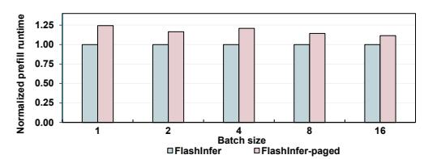
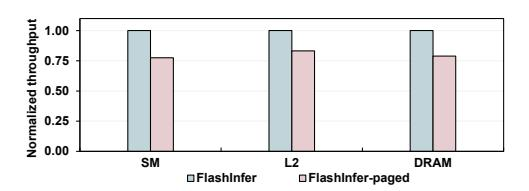

# II. BACKGROUND

#### *A. LLM Inference*

Generative large language models (LLMs) generate text autoregressively [13], [59], [60], [75], generating one token at a time. Within each transformer layer, linear projections map the current hidden states into query (Q), key (K), and value (V) tensors using their respective weights (WQ, WK, and WV ). Self-attention mechanism then computes the similarities between Q and K, uses these scores to weight the corresponding V values, and computes the attention output. The feedforward network then transforms this output before passing it to the next layer. The inference process of LLMs has two phases. In the prefill phase, the model reads the input sequence (or prompt) and generates the first output token, producing a corresponding Key-Value (KV) cache that is reused in later steps to avoid recomputation [11], [16]. During the decoding phase, the model generates one token at a time. At each step, it looks up the stored KV cache for all tokens seen so far, computes attention for the current position, updates the KV cache with the new key and value, and outputs the next token. This loop continues until an end-of-sequence token appears or length limit is reached.

#### *B. Multi-turn Conversation in LLM*

Supporting multi-turn conversations is a core capability of modern LLMs. A conversation is a sequence of turns in which each user query (Q) is followed by a model response (A). To stay coherent, the model conditions each new answer on the entire history of prior questions and answers. Starting from Q0 and A0, when the user issues Q1, the model's response A1 integrates (Q0, A0) along with the new query Q1, and this pattern continues across later turns. Analysis of the ShareGPT dataset shows that up to 99% of tokens in a new turn come from prior context [55]. Recomputing them every turn is wasteful, so modern systems reuse the KV cache across turns of the same conversation [20], [27], [49], [71], [74], [77]. That is, at each new turn, the model prefills only the fresh tokens to extend the cache, then decodes while reading the cached entries from earlier tokens, significantly reducing compute and memory traffic in multi-turn LLM serving.

#### *C. Memory Management in LLM Serving Systems*

GPU memory has become a critical bottleneck for highperformance LLM inference, affecting both the deployability of models and system throughput and response latency [22], [30]. Early LLM serving systems relied on the deep learning framework's caching pool allocator [43], [50], [73], which preallocates a contiguous chunk of memory with the request's maximum length. This approach works well for parameters and activations because their tensor sizes are known and stable over time [14], [45], [46], [54]. The KV cache, however, grows during decoding, has an unpredictable lifetime and length, and varies widely across requests and turns. When managed with fixed chunks, these properties cause heavy fragmentation and poor memory use. Therefore, PagedAttention has become the de facto standard in modern LLM serving systems [1], [2], [7], [30]. The key idea in vLLM is to introduce a software block table, analogous to an OS page table, that virtualizes the KV cache so that GPU memory can be allocated in small fixed-size blocks on demand rather than as a single contiguous region. At service initialization, GPU memory for model weights and activations is reserved. The remaining memory is organized into pre-configured KV blocks to accommodate dynamic KV cache demands. By keeping KV allocation proportional to actual demand, PagedAttention reduces fragmentation and raises effective memory efficiency, which translates directly into higher throughput and lower latency.

Fig. 2. The normalized prefill kernel runtime under different batch sizes.

#### *D. GPU Virtual Memory Management*

To meet the need for low-latency, fine-grained control over device memory, CUDA introduced low-level virtual memory management (VMM) APIs [41], [42]. VMM exposes primitives to reserve virtual address ranges and map physical memory into them, offering much finer control than traditional allocation routines such as cudaMalloc. Specifically, an application first reserves an address range with cuMemAddressReserve, this is a cheap operation that does not consume HBM capacity. It then provisions backing storage with cuMemCreate, which returns a handle to a pool of physical pages. Finally, it binds that storage into the reserved range using cuMemMap and sets permissions with cuMemSetAccess. Unmapping and remapping are similarly lightweight, allowing the program to grow, shrink, or relocate data structures without copying bytes. By separating reservation from mapping and enabling on-demand, fixed-granularity mappings, VMM can reduce internal fragmentation, avoid expensive allocate/free cycles, and improve memory reuse.

### III. MOTIVATION

In modern LLM serving systems such as vLLM, the KV cache is partitioned into fixed-size blocks and managed by a paged allocator to reduce physical memory fragmentation. This design introduces an additional translation layer: a runtime software block table maps logical KV positions to virtual addresses of blocks, while the OS kernel still translates virtual pages to physical frames via standard page tables. Because KV blocks are allocated from a shared pool and allocation, reuse, and eviction occur at different times across conversations and across turns, the blocks for any one conversation end up interleaved with others rather than remaining contiguous. As context length grows, each prefill or decode step touches a larger set of distinct virtual pages rather than a compact contiguous range, which stresses TLB, increases page walk traffic, and degrades memory coalescing. We next quantify the performance impact of this design.

#### *A. Performance Overhead of Paged KV Layout*

The vLLM paper reports that its PagedAttention implementation is 20–26% slower than the non-paged FasterTransformer kernel, mainly due to block table lookups (Figure 18a in [30]). To fully analyze the overheads, we compare Flash-Infer's native implementation with its PagedAttention-backed approach (FlashInfer-paged) under the same configuration that changes only KV cache placement. In the paged configuration, FlashInfer accesses vLLM's block table and gathers from

Fig. 3. The normalized throughput of SM, L2\$ and DRAM.

scattered KV pages. In the native setup, it issues base-plusoffset accesses within a single virtual region per request. We evaluate Llama-3-8B on an NVIDIA A100 with an 8K-token prompt and a 1K-token decode, sweeping batch sizes from 1 to 16. Figure 2 shows that the prefill kernel of FlashInferpaged is slower by 12-24% compared to the native approach, consistent with the slowdown reported by vLLM.

To further study the reason behind it, we profile SM issue behavior (i.e., long-scoreboard stall percentage and eligiblewarps-per-active-cycle) and memory system utilization (i.e., SM, L2, and DRAM throughputs) using NVIDIA Compute [44] on the same setup (Llama-3-8B, 8K prompt, 1K decode) with batch size 8. We observe that the FlashInfer-paged shows a higher fraction of long-scoreboard stalls (84.64% vs. 79.37%), indicating more warps wait on long-latency memory operations such as TLB misses and page table walks that available arithmetic is insufficient to hide. At the same time, the number of eligible warps per active cycle is lower for the FlashInfer-paged (0.718 vs. 0.825), showing that the scheduler has fewer ready warps to cover these latencies. The throughput results are consistent. Normalized to FlashInfer native, the SM, L2, and DRAM throughputs of FlashInfer-paged drop by 22.4%, 16.7%, and 21.1%, respectively, as shown in Figure 3. These results indicate that address translation latency is an important source of the prefill slowdown under the paged KV layout. With scattered blocks, a prefill step touches many distinct virtual pages, expanding the TLB working set and lengthening reuse distances beyond the TLB capacity, which raises the TLB miss rate and triggers more page table walks. Because successive accesses jump across many non-adjacent virtual pages, page walks rarely reuse the same lower-level page table entry (PTE) cache lines, which lowers page walk cache hit rates and adds extra memory references on the translation critical path. In contrast, a contiguous KV layout localizes accesses to a contiguous address range, which improves TLB hit rate and increases reuses in the page walk caches (e.g., repeated hits on lower-level PTEs for adjacent pages). The resulting reduction in translation stalls raises warp eligibility and sustains higher SM, L2, and DRAM throughputs.

# II. BACKGROUND

#### *A. LLM Inference*

Generative large language models (LLMs) generate text autoregressively [13], [59], [60], [75], generating one token at a time. Within each transformer layer, linear projections map the current hidden states into query (Q), key (K), and value (V) tensors using their respective weights (WQ, WK, and WV ). Self-attention mechanism then computes the similarities between Q and K, uses these scores to weight the corresponding V values, and computes the attention output. The feedforward network then transforms this output before passing it to the next layer. The inference process of LLMs has two phases. In the prefill phase, the model reads the input sequence (or prompt) and generates the first output token, producing a corresponding Key-Value (KV) cache that is reused in later steps to avoid recomputation [11], [16]. During the decoding phase, the model generates one token at a time. At each step, it looks up the stored KV cache for all tokens seen so far, computes attention for the current position, updates the KV cache with the new key and value, and outputs the next token. This loop continues until an end-of-sequence token appears or length limit is reached.

#### *B. Multi-turn Conversation in LLM*

Supporting multi-turn conversations is a core capability of modern LLMs. A conversation is a sequence of turns in which each user query (Q) is followed by a model response (A). To stay coherent, the model conditions each new answer on the entire history of prior questions and answers. Starting from Q0 and A0, when the user issues Q1, the model's response A1 integrates (Q0, A0) along with the new query Q1, and this pattern continues across later turns. Analysis of the ShareGPT dataset shows that up to 99% of tokens in a new turn come from prior context [55]. Recomputing them every turn is wasteful, so modern systems reuse the KV cache across turns of the same conversation [20], [27], [49], [71], [74], [77]. That is, at each new turn, the model prefills only the fresh tokens to extend the cache, then decodes while reading the cached entries from earlier tokens, significantly reducing compute and memory traffic in multi-turn LLM serving.

#### *C. Memory Management in LLM Serving Systems*

GPU memory has become a critical bottleneck for highperformance LLM inference, affecting both the deployability of models and system throughput and response latency [22], [30]. Early LLM serving systems relied on the deep learning framework's caching pool allocator [43], [50], [73], which preallocates a contiguous chunk of memory with the request's maximum length. This approach works well for parameters and activations because their tensor sizes are known and stable over time [14], [45], [46], [54]. The KV cache, however, grows during decoding, has an unpredictable lifetime and length, and varies widely across requests and turns. When managed with fixed chunks, these properties cause heavy fragmentation and poor memory use. Therefore, PagedAttention has become the de facto standard in modern LLM serving systems [1], [2], [7], [30]. The key idea in vLLM is to introduce a software block table, analogous to an OS page table, that virtualizes the KV cache so that GPU memory can be allocated in small fixed-size blocks on demand rather than as a single contiguous region. At service initialization, GPU memory for model weights and activations is reserved. The remaining memory is organized into pre-configured KV blocks to accommodate dynamic KV cache demands. By keeping KV allocation proportional to actual demand, PagedAttention reduces fragmentation and raises effective memory efficiency, which translates directly into higher throughput and lower latency.

Fig. 2. The normalized prefill kernel runtime under different batch sizes.

#### *D. GPU Virtual Memory Management*

To meet the need for low-latency, fine-grained control over device memory, CUDA introduced low-level virtual memory management (VMM) APIs [41], [42]. VMM exposes primitives to reserve virtual address ranges and map physical memory into them, offering much finer control than traditional allocation routines such as cudaMalloc. Specifically, an application first reserves an address range with cuMemAddressReserve, this is a cheap operation that does not consume HBM capacity. It then provisions backing storage with cuMemCreate, which returns a handle to a pool of physical pages. Finally, it binds that storage into the reserved range using cuMemMap and sets permissions with cuMemSetAccess. Unmapping and remapping are similarly lightweight, allowing the program to grow, shrink, or relocate data structures without copying bytes. By separating reservation from mapping and enabling on-demand, fixed-granularity mappings, VMM can reduce internal fragmentation, avoid expensive allocate/free cycles, and improve memory reuse.

### III. MOTIVATION

In modern LLM serving systems such as vLLM, the KV cache is partitioned into fixed-size blocks and managed by a paged allocator to reduce physical memory fragmentation. This design introduces an additional translation layer: a runtime software block table maps logical KV positions to virtual addresses of blocks, while the OS kernel still translates virtual pages to physical frames via standard page tables. Because KV blocks are allocated from a shared pool and allocation, reuse, and eviction occur at different times across conversations and across turns, the blocks for any one conversation end up interleaved with others rather than remaining contiguous. As context length grows, each prefill or decode step touches a larger set of distinct virtual pages rather than a compact contiguous range, which stresses TLB, increases page walk traffic, and degrades memory coalescing. We next quantify the performance impact of this design.

#### *A. Performance Overhead of Paged KV Layout*

The vLLM paper reports that its PagedAttention implementation is 20–26% slower than the non-paged FasterTransformer kernel, mainly due to block table lookups (Figure 18a in [30]). To fully analyze the overheads, we compare Flash-Infer's native implementation with its PagedAttention-backed approach (FlashInfer-paged) under the same configuration that changes only KV cache placement. In the paged configuration, FlashInfer accesses vLLM's block table and gathers from

Fig. 3. The normalized throughput of SM, L2\$ and DRAM.

scattered KV pages. In the native setup, it issues base-plusoffset accesses within a single virtual region per request. We evaluate Llama-3-8B on an NVIDIA A100 with an 8K-token prompt and a 1K-token decode, sweeping batch sizes from 1 to 16. Figure 2 shows that the prefill kernel of FlashInferpaged is slower by 12-24% compared to the native approach, consistent with the slowdown reported by vLLM.

To further study the reason behind it, we profile SM issue behavior (i.e., long-scoreboard stall percentage and eligiblewarps-per-active-cycle) and memory system utilization (i.e., SM, L2, and DRAM throughputs) using NVIDIA Compute [44] on the same setup (Llama-3-8B, 8K prompt, 1K decode) with batch size 8. We observe that the FlashInfer-paged shows a higher fraction of long-scoreboard stalls (84.64% vs. 79.37%), indicating more warps wait on long-latency memory operations such as TLB misses and page table walks that available arithmetic is insufficient to hide. At the same time, the number of eligible warps per active cycle is lower for the FlashInfer-paged (0.718 vs. 0.825), showing that the scheduler has fewer ready warps to cover these latencies. The throughput results are consistent. Normalized to FlashInfer native, the SM, L2, and DRAM throughputs of FlashInfer-paged drop by 22.4%, 16.7%, and 21.1%, respectively, as shown in Figure 3. These results indicate that address translation latency is an important source of the prefill slowdown under the paged KV layout. With scattered blocks, a prefill step touches many distinct virtual pages, expanding the TLB working set and lengthening reuse distances beyond the TLB capacity, which raises the TLB miss rate and triggers more page table walks. Because successive accesses jump across many non-adjacent virtual pages, page walks rarely reuse the same lower-level page table entry (PTE) cache lines, which lowers page walk cache hit rates and adds extra memory references on the translation critical path. In contrast, a contiguous KV layout localizes accesses to a contiguous address range, which improves TLB hit rate and increases reuses in the page walk caches (e.g., repeated hits on lower-level PTEs for adjacent pages). The resulting reduction in translation stalls raises warp eligibility and sustains higher SM, L2, and DRAM throughputs.

