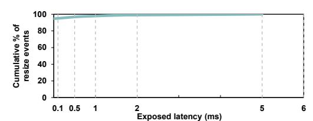

# TABLE II CUDA VMM APIS LATENCY.

| CUDA VM APIs        | Latency $(\mu s)$ |  |
|---------------------|-------------------|--|
| cuMemAddressReserve | 2                 |  |
| cuMemCreate         | 29.2              |  |
| cuMemMap            | 1.9               |  |
| cuMemSetAccess      | 36.8              |  |
| cuMemUnmap          | 34.3              |  |
| cuMemRelease        | 24                |  |
| cuMemAddressFree    | 1.6               |  |

repeated failed placement attempts, or extra remapping steps that pause serving) becoming a dominant contributor to tail latency, even in a long-running serving scenario.

We next evaluate ConServe on a long-context trace constructed from LongBenchV2 long-dialogue histories [12]. To enable substantial concurrency on a single GPU, we truncate each dialogue history to 8K-32K tokens and vary the number of concurrent conversations. Figure 14 shows that ConServe consistently achieves the best performance across all batches, for reasons similar to offline ShareGPT (Section V-C). Importantly, these gains do not rely on tracespecific tuning: although the initial reservation budget r is calibrated on ShareGPT, it only affects the starting headroom, while subsequent capacity growth is driven by our dynamic resizing rule (Eq. 2), which predicts future demand from each conversation's observed turn lengths and grows the slice accordingly to reduce resizing frequency. As a result, even when the ShareGPT-derived defaults initially under-reserve for substantially longer dialogues, ConServe quickly adapts based on runtime behavior, demonstrating the approach generalizes to long-context workloads without retuning.

#### F. Resizing Overheads

We first microbenchmark the CUDA VMM primitive latencies using 2 MB pages, as shown in Table II. The overhead scales with the number of VMM operations issued. In ConServe, a growth event remaps each layer's KV segment, requiring cuMemMap and cuMemSetAccess per layer. However, we initiate remapping immediately after the first layer detects a resize need and apply the new mapping at the next iteration boundary. This allows the current step to complete using the existing mapping while the remapping thread overlaps the VMM calls with the computation of the remaining layer in the same step, providing an overlap window of approximately  $(L-1)/L \cdot T_{iteration}$ , where L represents the number of layers. In practice, per-iteration latency is typically tens of milliseconds, sufficient to hide the remapping cost even under

Fig. 15. Latency of decode iterations with and without overlapping memory allocation with compute using Llama-3-8B at batch size 32.

Fig. 16. CDF of exposed resize latency under ConServe.

heavy load. The reclamation is deferred, and old mappings are unmapped later via cuMemUnmap, which stays off the critical path and has little performance impact. Even if the GPU driver serializes VMM calls via internal locks, those calls execute while the GPU is computing the remaining layers of the current iteration, so driver time overlaps with GPU work and rarely delays CPU submission of next-iteration kernels for other runnable requests. Nevertheless, the exposed resize overhead is negligible compared to per-token iteration time.

Figure 15 further reports per-iteration decode latency of *Llama-3-8B* at batch size 32, comparing our approach with and without overlapping resizing with compute. For readability, we plot a fixed-length window containing resizing events. In both configurations, each conversation owns a single contiguous VA that grows on demand when the utilization exceeds θu=0.90, with γ = 1.5. In the overlap configuration (our default design), once the threshold is reached, the resize is triggered and mapping calls are issued immediately after the first layer of iteration completes, while the current decode step continues. If the mapping finishes before the step ends, the next kernel launches without waiting. As one can observe from the figure, the resulting curve is essentially flat, showing nearly no measurable latency increase at resize points. In the no-overlap configuration, growth is serialized at iteration boundaries: iteration i completes, resizing is performed, and iteration i+ 1 launches only after mapping finishes. This produces periodic spikes of about 4–18 ms at resize events, which raises the decode iteration latency. To quantify any remaining delay, Figure 16 plots the CDF of exposed time per resize event across the whole run. We can observe that 94.7% of resizes are fully hidden, and 99% expose at most 1.5 ms. Therefore, our approach can overlap resize mapping with compute and keep resizing overhead off the execution critical path.

# TABLE II CUDA VMM APIS LATENCY.

| CUDA VM APIs        | Latency $(\mu s)$ |  |
|---------------------|-------------------|--|
| cuMemAddressReserve | 2                 |  |
| cuMemCreate         | 29.2              |  |
| cuMemMap            | 1.9               |  |
| cuMemSetAccess      | 36.8              |  |
| cuMemUnmap          | 34.3              |  |
| cuMemRelease        | 24                |  |
| cuMemAddressFree    | 1.6               |  |

repeated failed placement attempts, or extra remapping steps that pause serving) becoming a dominant contributor to tail latency, even in a long-running serving scenario.

We next evaluate ConServe on a long-context trace constructed from LongBenchV2 long-dialogue histories [12]. To enable substantial concurrency on a single GPU, we truncate each dialogue history to 8K-32K tokens and vary the number of concurrent conversations. Figure 14 shows that ConServe consistently achieves the best performance across all batches, for reasons similar to offline ShareGPT (Section V-C). Importantly, these gains do not rely on tracespecific tuning: although the initial reservation budget r is calibrated on ShareGPT, it only affects the starting headroom, while subsequent capacity growth is driven by our dynamic resizing rule (Eq. 2), which predicts future demand from each conversation's observed turn lengths and grows the slice accordingly to reduce resizing frequency. As a result, even when the ShareGPT-derived defaults initially under-reserve for substantially longer dialogues, ConServe quickly adapts based on runtime behavior, demonstrating the approach generalizes to long-context workloads without retuning.

#### F. Resizing Overheads

We first microbenchmark the CUDA VMM primitive latencies using 2 MB pages, as shown in Table II. The overhead scales with the number of VMM operations issued. In ConServe, a growth event remaps each layer's KV segment, requiring cuMemMap and cuMemSetAccess per layer. However, we initiate remapping immediately after the first layer detects a resize need and apply the new mapping at the next iteration boundary. This allows the current step to complete using the existing mapping while the remapping thread overlaps the VMM calls with the computation of the remaining layer in the same step, providing an overlap window of approximately  $(L-1)/L \cdot T_{iteration}$ , where L represents the number of layers. In practice, per-iteration latency is typically tens of milliseconds, sufficient to hide the remapping cost even under

Fig. 15. Latency of decode iterations with and without overlapping memory allocation with compute using Llama-3-8B at batch size 32.

Fig. 16. CDF of exposed resize latency under ConServe.

heavy load. The reclamation is deferred, and old mappings are unmapped later via cuMemUnmap, which stays off the critical path and has little performance impact. Even if the GPU driver serializes VMM calls via internal locks, those calls execute while the GPU is computing the remaining layers of the current iteration, so driver time overlaps with GPU work and rarely delays CPU submission of next-iteration kernels for other runnable requests. Nevertheless, the exposed resize overhead is negligible compared to per-token iteration time.

Figure 15 further reports per-iteration decode latency of *Llama-3-8B* at batch size 32, comparing our approach with and without overlapping resizing with compute. For readability, we plot a fixed-length window containing resizing events. In both configurations, each conversation owns a single contiguous VA that grows on demand when the utilization exceeds θu=0.90, with γ = 1.5. In the overlap configuration (our default design), once the threshold is reached, the resize is triggered and mapping calls are issued immediately after the first layer of iteration completes, while the current decode step continues. If the mapping finishes before the step ends, the next kernel launches without waiting. As one can observe from the figure, the resulting curve is essentially flat, showing nearly no measurable latency increase at resize points. In the no-overlap configuration, growth is serialized at iteration boundaries: iteration i completes, resizing is performed, and iteration i+ 1 launches only after mapping finishes. This produces periodic spikes of about 4–18 ms at resize events, which raises the decode iteration latency. To quantify any remaining delay, Figure 16 plots the CDF of exposed time per resize event across the whole run. We can observe that 94.7% of resizes are fully hidden, and 99% expose at most 1.5 ms. Therefore, our approach can overlap resize mapping with compute and keep resizing overhead off the execution critical path.

