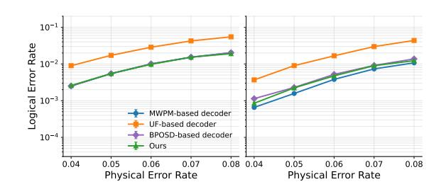

# VIII. SENSITIVITY AND ROBUSTNESS ANALYSIS

#### A. Tunability Analysis

We fit an empirical power-law model:  $\mathrm{LER}(K) = \mathrm{LER}_{\infty} + A \cdot K^{-\alpha}$ , with  $\mathrm{LER}_{\infty}$  the error floor, A the improvement headroom, and  $\alpha$  the diminishing-returns exponent. Fig. 15(a) shows the fit holds for each (d,p), with  $\alpha$  decreasing from 1.98 (d=3) to 0.27 (d=9). Defining  $K^*$  as the smallest K capturing 70% of the LER improvement yields  $K^* = 2^{\lfloor (d+1)/2 \rfloor}$ . This remains accurate at p=0.0015 for  $d \geq 7$ , but underestimates  $K^*$  for  $d \in \{3,5\}$ , since larger p requires more candidates per fractional gain. Fig. 15(b) plots the accuracy-resource Pareto  $\mathrm{LUT}_{\mathrm{total}} = \mathrm{LUT}_{\mathrm{fixed}} + K \cdot \mathrm{LUT}_{\mathrm{branch}}$ ; red stars mark  $K^*$  near each knee.

Fig. 14. Hardware latency breakdown before and after optimization.

Fig. 15. Tunability analysis of our proposal. (a) Power-law model validation at two noise rates (p=0.001, 0.0015). (b) LER vs. hardware area.

Fig. 16. Logical error rate comparison on the repetition code under a phenomenological noise model.

Fig. 17. Logical error rate (left) and the corresponding system infidelity (right) under three biased phenomenological noise settings (d=7, X-channel).

# VIII. SENSITIVITY AND ROBUSTNESS ANALYSIS

#### A. Tunability Analysis

We fit an empirical power-law model:  $\mathrm{LER}(K) = \mathrm{LER}_{\infty} + A \cdot K^{-\alpha}$ , with  $\mathrm{LER}_{\infty}$  the error floor, A the improvement headroom, and  $\alpha$  the diminishing-returns exponent. Fig. 15(a) shows the fit holds for each (d,p), with  $\alpha$  decreasing from 1.98 (d=3) to 0.27 (d=9). Defining  $K^*$  as the smallest K capturing 70% of the LER improvement yields  $K^* = 2^{\lfloor (d+1)/2 \rfloor}$ . This remains accurate at p=0.0015 for  $d \geq 7$ , but underestimates  $K^*$  for  $d \in \{3,5\}$ , since larger p requires more candidates per fractional gain. Fig. 15(b) plots the accuracy-resource Pareto  $\mathrm{LUT}_{\mathrm{total}} = \mathrm{LUT}_{\mathrm{fixed}} + K \cdot \mathrm{LUT}_{\mathrm{branch}}$ ; red stars mark  $K^*$  near each knee.

Fig. 14. Hardware latency breakdown before and after optimization.

Fig. 15. Tunability analysis of our proposal. (a) Power-law model validation at two noise rates (p=0.001, 0.0015). (b) LER vs. hardware area.

Fig. 16. Logical error rate comparison on the repetition code under a phenomenological noise model.

Fig. 17. Logical error rate (left) and the corresponding system infidelity (right) under three biased phenomenological noise settings (d=7, X-channel).

