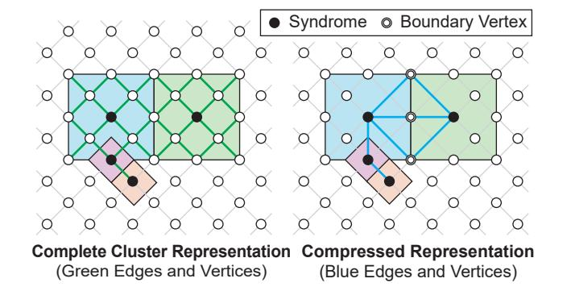

# B. Reverse-Order Elimination (ROE)

Given the parent array and discovery order  $\sigma$  from Sec. III-A, ROE scans vertices in the exact reverse of  $\sigma$  and pops vertices in order as shown in Algorithm 3. This eliminates global leaf detection and degree recomputation, delivering a single-pass, linear-time peeling that helps reduce the decoding latency.

The key observation is that Algorithm 2 has already traversed the graph from roots to leaves during forest construction. By recording this order and popping vertices in reverse, ROE reuses that traversal and avoids an additional pass for leaf discovery.

Fig. 4. Graph compression.

#### *C. Lossless Graph Compression*

To reduce the additional exploration efforts introduced by Sec. [III-A,](#page-2-1) we apply structure-preserving reductions with smaller complexity. The example in Fig. [4](#page-5-1) illustrates how we obtain the compressed graph structure after clustering. The four colored regions represent the clusters grown from four initial root vertices. On the left, all vertices and green edges inside the colored regions constitute the input graph G(V, E) of Algorithm [1.](#page-3-1) Since the complexity of Algorithm [1](#page-3-1) is linear in the size of the input graph, graph pruning that preserves its structural information helps reduce the decoding latency.

In this work, we use the compressed graph structure shown on the right. Unlike the complete graph on the left, we retain only the edges between roots and the edges between roots and boundaries during merging. This edge representation, which goes beyond axis-aligned Manhattan connections and allows edges to link vertices in arbitrary directions across the grid, together with the pruning of redundant edges, preserves the core structure of the graph while remaining fully compatible with the main dataflow of Algorithm 1. In Fig. [4,](#page-5-1) the straightforward representation uses an input graph of size 21, whereas our compressed representation reduces this number to 8.

# B. Reverse-Order Elimination (ROE)

Given the parent array and discovery order  $\sigma$  from Sec. III-A, ROE scans vertices in the exact reverse of  $\sigma$  and pops vertices in order as shown in Algorithm 3. This eliminates global leaf detection and degree recomputation, delivering a single-pass, linear-time peeling that helps reduce the decoding latency.

The key observation is that Algorithm 2 has already traversed the graph from roots to leaves during forest construction. By recording this order and popping vertices in reverse, ROE reuses that traversal and avoids an additional pass for leaf discovery.

Fig. 4. Graph compression.

#### *C. Lossless Graph Compression*

To reduce the additional exploration efforts introduced by Sec. [III-A,](#page-2-1) we apply structure-preserving reductions with smaller complexity. The example in Fig. [4](#page-5-1) illustrates how we obtain the compressed graph structure after clustering. The four colored regions represent the clusters grown from four initial root vertices. On the left, all vertices and green edges inside the colored regions constitute the input graph G(V, E) of Algorithm [1.](#page-3-1) Since the complexity of Algorithm [1](#page-3-1) is linear in the size of the input graph, graph pruning that preserves its structural information helps reduce the decoding latency.

In this work, we use the compressed graph structure shown on the right. Unlike the complete graph on the left, we retain only the edges between roots and the edges between roots and boundaries during merging. This edge representation, which goes beyond axis-aligned Manhattan connections and allows edges to link vertices in arbitrary directions across the grid, together with the pruning of redundant edges, preserves the core structure of the graph while remaining fully compatible with the main dataflow of Algorithm 1. In Fig. [4,](#page-5-1) the straightforward representation uses an input graph of size 21, whereas our compressed representation reduces this number to 8.

