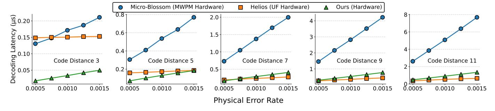
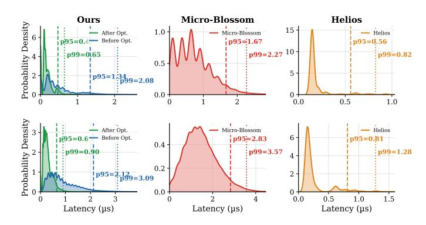

# A. Experimental Setup

We evaluate the performance of our decoder from a comprehensive perspective, including accuracy, latency, and hardware efficiency. The proposed hardware design is implemented in SystemVerilog HDL on a Xilinx Virtex UltraScale+ VU19P FPGA. The hardware resources and frequency are reported

Fig. 7. Comparison of memory-cell update counts between the straightforward method and our method (left: before merging, right: after merging).

from Vivado 2024.2. The algorithm performance evaluation is conducted through a Python-based hardware simulator, which is cross-validated against our hardware design. It reports logical error rates and cycle counts, and tracks memory-access conflicts under our multi-bank memory layout and hashing scheme

Our experiments adopt several widely-used noise models to illustrate the generality of our decoder. (1) Circuit-level depolarizing noise model implemented using the Stim library [22]. For a given code with distance d and a specified number of syndrome extraction rounds, we generate noisy circuits in which depolarizing noise with rate p is applied to data qubits after Clifford operations and between successive rounds of the circuit. Measurement errors are modeled as classical bit flips on the measurement outcomes with the same probability (p), while qubit reset operations are assumed to be ideal. Unless otherwise specified, we use q = p and set the number of repeated syndrome rounds to T = d. (2) Biased and unbiased Phenomenological noise model. For biased phenomenological noise, X- and Z-type data faults are injected with probabilities  $p_X$  and  $p_Z$ , respectively, with bias ratio  $\eta = p_Z/p_X$ ; measurement faults follow the same phenomenological model as above.

All algorithmic accuracy results in this paper are obtained on a surface code with periodic boundary conditions, the same setting used by QUEKUF [23]. For Micro-Blossom [8] and Helios [9], hardware-resource numbers are taken from their original publications on the rotated variant, while decoding latencies are reproduced by running their source code under matched noise conditions. Surface-code variants share the same threshold and differ only in boundary conditions [24]. Reproducing these baselines on a periodic-boundary surface code would increase their decoding latency, since the corresponding syndrome graph is larger; the reported values

therefore provide a best-case estimate of these baselines.

#### B. Decoder Performance Metric

- 1) Real-time Compliance: Modern quantum-classical systems impose tight decoding-latency constraints to prevent backlog, which would otherwise compromise logical fidelity and stall program execution. Prior architecture works for superconducting platforms commonly target sub-microsecond decoding [8], [19], [25]. Following these works, the real-time compliance of hardware decoders is set to the time of one syndrome extraction round.
- 2) System Infidelity: Decoding in fault-tolerant quantum computing (FTQC) can be broadly categorized into two types:
  - Pauli-frame decoding: the decoding outcome is used solely to correct the measurement result of the corresponding logical qubit through Pauli frame updates. This is typical in memory experiments.
  - 2) Feedback decoding: the decoding result not only corrects the measurement of a logical qubit but also serves as feedback to conditionally apply logical operations on other qubits, common in implementing non-Clifford operations.

To evaluate Pauli-frame decoding, metrics such as the logical error rate (LER) and reaction time (latency) [12] are generally sufficient. However, in Feedback decoding, the combination of decoding latency and accuracy becomes critical. For instance, suppose a logical operation on logical qubit A is conditioned on the outcome of a Z-basis measurement on logical qubit B. If the decoding of B takes R rounds of syndrome measurements (measured in cycles), then the physical qubits of A must remain idle during this time. As a result, R additional rounds of memory decoding must be applied to A before the conditional operation can proceed. However, this waiting increases the total logical error rate since more errors would be accumulated on physical qubits as discussed in [26]. Therefore, a fairer and more appropriate metric is required to evaluate the impact of decoding latency on decoding accuracy in feedback-based logical operations. We defined this metric to quantify how the decoding latency of logical patch B affects the decoding fidelity of logical patch A, specifically when A's operation is conditioned on B's midcircuit measurement result.

In Ref. [26], the decoder error rate E(n) after n rounds of syndrome measurements assuming a per-round logical error rate  $\epsilon$  is given by an empirical formula  $E(n) = \frac{1}{2}(1-(1-2\epsilon)^n)$ . However,  $\epsilon$  is not directly measurable in FTQC, where the fundamental unit is a full QEC cycle of d syndrome rounds. We therefore reparametrize E(n) in terms of the decoder's LER over d rounds, E(d). Using  $(1-2\epsilon)^d=1-2E(d)$  and  $(1-2\epsilon)^n=((1-2\epsilon)^d)^m$  with m=n/d the number of decoding cycles, we obtain the *effective decoder error rate* 

$$\hat{E}(m) = \frac{1}{2} \left( 1 - (1 - 2E(d))^m \right) \tag{16}$$

and the corresponding effective decoder fidelity

$$\hat{F}(m) = 1 - 2\hat{E}(m) = (1 - 2E(d))^m. \tag{17}$$

Fig. 8. Logical error rate comparison among MWPM-based decoders, UF-based decoders, and our decoder.

In a feedback-decoding scenario, if the decoding latency for qubit B is R (in units of syndrome cycles) and qubit A has been idle for m decoding cycles, the effective fidelity of A under B's latency becomes

$$\hat{F}(m + \frac{R}{d}) = (1 - 2E(d))^{R/d} \cdot \hat{F}(m),$$
 (18)

where R is computed from B's decoding latency and E(d) is A's decoding LER. The impact of B's latency is thus captured by the factor  $(1-2E(d))^{R/d}$ . If the decoding latency is shorter than one syndrome cycle, no backlog occurs and the LER is unaffected, so R is floored at 1. Inverting for convention (lower is better), the resulting *Infidelity factor* is

$$\hat{C}(R) = 1 - (1 - 2E(d))^{\frac{\max(1,R)}{d}} \in [0,1), \tag{19}$$

with R=L/l where L is the decoding latency and l the duration of one syndrome extraction round; the mask  $\max(1,R)$  implies that if B's latency is less than one extraction round, its impact on A's fidelity is negligible and  $\hat{C}(R)$  is dominated by E(d). This threshold is sufficient for FTQC because as long as decoding completes before the next syndrome is extracted, latency does not degrade the LER. A lower  $\hat{C}(R)$  indicates higher fidelity under latency constraints. While sensitive to both idle time and idle error rates, the impacts of physical idle errors, along with optimizations such as Dynamic Decoupling and Pauli Twirling, are fully encapsulated by E(d).

#### VI. END-TO-END EVALUATION

We first evaluate algorithmic accuracy, latency, and systemlevel impact, and then analyze the hardware cost and scalability of the proposed design.

#### A. Decoding Accuracy Evaluation

The decoding accuracy of the proposed method is evaluated under the circuit-level noise model described in Sec. V-A. To isolate the algorithmic gain introduced by the ensemble-forest method in Sec. III-A, we first compare against two widely used surface-code decoders, MWPM and UF, at the algorithm level as shown in Fig. 8. For the accuracy estimate of MWPM-based decoders, we use the PyMatching implementation [27]. For the UF-based decoders Helios and QUEKUF, we evaluate accuracy using our own baseline UF software implementation to avoid conflating decoder quality with minor differences in boundary-condition handling across implementations.

Fig. 9. Logical error rate of MWPM, UF, and our decoder (K=24) vs. code distance at p=0.002 circuit-level noise.

In these experiments, the candidate number K in our design is fixed to 24. When the code distance is small, the accuracy of our coset ensemble decoding is close to that of MWPM. For larger code distances, the increased graph size causes this fixed K to limit further accuracy improvements.

To examine how the accuracy advantage persists at larger code distances, Fig. 9 reports the logical error rate of MWPM, UF, and our decoder at a fixed physical error rate  $p{=}0.002$  circuit-level noise for  $d \in \{3,5,\ldots,19\}$ . Our decoder tracks MWPM closely across this range, substantially outperforming UF: the LER ratio to MWPM grows from  $1.0\times$  at  $d{=}3$  to  $\sim 2.1\times$  at  $d{=}19$  at fixed  $K{=}24$ ; the residual gap can be further reduced by increasing K.

#### B. Decoding Latency Evaluation

Fig. 10 compares the average decoding latency per d-round task of our decoder against Micro-Blossom and Helios for d=3 to d=11. The MWPM-based Micro-Blossom grows steeply with d, reflecting the high complexity of minimum-weight matching, while our decoder and Helios both remain sub-microsecond across all evaluated distances.

Helios's distributed per-vertex PE array yields a latency that scales sublinearly with d through per-iteration coordination and convergecast, whereas our pipelined design scales with the active-vertex count while keeping the hardware footprint compact (the 24 ensemble candidates are processed in parallel and do not affect the critical path). At small d, where active vertices are few, our pipeline retires the task well below

Fig. 10. Decoding latency per decoding task (d syndrome rounds), compared with state-of-the-art decoders.

Fig. 11. Decoding latency distribution per d-round task at p=0.0005, for code distance 7 (top) and 9 (bottom).

Helios's per-iteration floor, producing the  $3-5\times$  advantage at d=3. As d grows, the two curves converge near d=7-9, with our design still ahead in lower-p settings at d=7; beyond this range, Helios's sublinear scaling becomes more favorable on pure latency. Our design targets a resource-efficient latency/area point, using roughly  $6\times$  fewer LUTs and  $3\times$  fewer FFs than Helios at d=15 (Table I). Throughput follows the same pattern, ranging from 1.88 M decodes/sec at d=9 to 29.8 M at d=3 (both at p=0.001), which is  $4-5\times$  Micro-Blossom and comparable to Helios.

Fig. 11 presents the latency probability density per full d-round decoding task. Our optimizations reduce not only average latency but also tail latency: at d=9, p95 drops from 2.12  $\mu$ s to 0.65  $\mu$ s (-69%) and p99 from 3.09  $\mu$ s to 0.90  $\mu$ s (-71%), with comparable improvements at d=7. The narrowed density curves illustrate that the optimizations reduce variance rather than merely shifting the mean. Compared with the Micro-Blossom, our optimized p99 is 3.5–4× lower (0.65 vs. 2.27  $\mu$ s at code distance 7; 0.90 vs. 3.57  $\mu$ s at code distance 9) and slightly below Helios (0.65 vs. 0.82  $\mu$ s; 0.90 vs. 1.28  $\mu$ s). These results show that the proposed decoder achieves competitive or superior tail-latency behavior relative to state-of-the-art MWPM designs.

# A. Experimental Setup

We evaluate the performance of our decoder from a comprehensive perspective, including accuracy, latency, and hardware efficiency. The proposed hardware design is implemented in SystemVerilog HDL on a Xilinx Virtex UltraScale+ VU19P FPGA. The hardware resources and frequency are reported

Fig. 7. Comparison of memory-cell update counts between the straightforward method and our method (left: before merging, right: after merging).

from Vivado 2024.2. The algorithm performance evaluation is conducted through a Python-based hardware simulator, which is cross-validated against our hardware design. It reports logical error rates and cycle counts, and tracks memory-access conflicts under our multi-bank memory layout and hashing scheme

Our experiments adopt several widely-used noise models to illustrate the generality of our decoder. (1) Circuit-level depolarizing noise model implemented using the Stim library [22]. For a given code with distance d and a specified number of syndrome extraction rounds, we generate noisy circuits in which depolarizing noise with rate p is applied to data qubits after Clifford operations and between successive rounds of the circuit. Measurement errors are modeled as classical bit flips on the measurement outcomes with the same probability (p), while qubit reset operations are assumed to be ideal. Unless otherwise specified, we use q = p and set the number of repeated syndrome rounds to T = d. (2) Biased and unbiased Phenomenological noise model. For biased phenomenological noise, X- and Z-type data faults are injected with probabilities  $p_X$  and  $p_Z$ , respectively, with bias ratio  $\eta = p_Z/p_X$ ; measurement faults follow the same phenomenological model as above.

All algorithmic accuracy results in this paper are obtained on a surface code with periodic boundary conditions, the same setting used by QUEKUF [23]. For Micro-Blossom [8] and Helios [9], hardware-resource numbers are taken from their original publications on the rotated variant, while decoding latencies are reproduced by running their source code under matched noise conditions. Surface-code variants share the same threshold and differ only in boundary conditions [24]. Reproducing these baselines on a periodic-boundary surface code would increase their decoding latency, since the corresponding syndrome graph is larger; the reported values

therefore provide a best-case estimate of these baselines.

#### B. Decoder Performance Metric

- 1) Real-time Compliance: Modern quantum-classical systems impose tight decoding-latency constraints to prevent backlog, which would otherwise compromise logical fidelity and stall program execution. Prior architecture works for superconducting platforms commonly target sub-microsecond decoding [8], [19], [25]. Following these works, the real-time compliance of hardware decoders is set to the time of one syndrome extraction round.
- 2) System Infidelity: Decoding in fault-tolerant quantum computing (FTQC) can be broadly categorized into two types:
  - Pauli-frame decoding: the decoding outcome is used solely to correct the measurement result of the corresponding logical qubit through Pauli frame updates. This is typical in memory experiments.
  - 2) Feedback decoding: the decoding result not only corrects the measurement of a logical qubit but also serves as feedback to conditionally apply logical operations on other qubits, common in implementing non-Clifford operations.

To evaluate Pauli-frame decoding, metrics such as the logical error rate (LER) and reaction time (latency) [12] are generally sufficient. However, in Feedback decoding, the combination of decoding latency and accuracy becomes critical. For instance, suppose a logical operation on logical qubit A is conditioned on the outcome of a Z-basis measurement on logical qubit B. If the decoding of B takes R rounds of syndrome measurements (measured in cycles), then the physical qubits of A must remain idle during this time. As a result, R additional rounds of memory decoding must be applied to A before the conditional operation can proceed. However, this waiting increases the total logical error rate since more errors would be accumulated on physical qubits as discussed in [26]. Therefore, a fairer and more appropriate metric is required to evaluate the impact of decoding latency on decoding accuracy in feedback-based logical operations. We defined this metric to quantify how the decoding latency of logical patch B affects the decoding fidelity of logical patch A, specifically when A's operation is conditioned on B's midcircuit measurement result.

In Ref. [26], the decoder error rate E(n) after n rounds of syndrome measurements assuming a per-round logical error rate  $\epsilon$  is given by an empirical formula  $E(n) = \frac{1}{2}(1-(1-2\epsilon)^n)$ . However,  $\epsilon$  is not directly measurable in FTQC, where the fundamental unit is a full QEC cycle of d syndrome rounds. We therefore reparametrize E(n) in terms of the decoder's LER over d rounds, E(d). Using  $(1-2\epsilon)^d=1-2E(d)$  and  $(1-2\epsilon)^n=((1-2\epsilon)^d)^m$  with m=n/d the number of decoding cycles, we obtain the *effective decoder error rate* 

$$\hat{E}(m) = \frac{1}{2} \left( 1 - (1 - 2E(d))^m \right) \tag{16}$$

and the corresponding effective decoder fidelity

$$\hat{F}(m) = 1 - 2\hat{E}(m) = (1 - 2E(d))^m. \tag{17}$$

Fig. 8. Logical error rate comparison among MWPM-based decoders, UF-based decoders, and our decoder.

In a feedback-decoding scenario, if the decoding latency for qubit B is R (in units of syndrome cycles) and qubit A has been idle for m decoding cycles, the effective fidelity of A under B's latency becomes

$$\hat{F}(m + \frac{R}{d}) = (1 - 2E(d))^{R/d} \cdot \hat{F}(m),$$
 (18)

where R is computed from B's decoding latency and E(d) is A's decoding LER. The impact of B's latency is thus captured by the factor  $(1-2E(d))^{R/d}$ . If the decoding latency is shorter than one syndrome cycle, no backlog occurs and the LER is unaffected, so R is floored at 1. Inverting for convention (lower is better), the resulting *Infidelity factor* is

$$\hat{C}(R) = 1 - (1 - 2E(d))^{\frac{\max(1,R)}{d}} \in [0,1), \tag{19}$$

with R=L/l where L is the decoding latency and l the duration of one syndrome extraction round; the mask  $\max(1,R)$  implies that if B's latency is less than one extraction round, its impact on A's fidelity is negligible and  $\hat{C}(R)$  is dominated by E(d). This threshold is sufficient for FTQC because as long as decoding completes before the next syndrome is extracted, latency does not degrade the LER. A lower  $\hat{C}(R)$  indicates higher fidelity under latency constraints. While sensitive to both idle time and idle error rates, the impacts of physical idle errors, along with optimizations such as Dynamic Decoupling and Pauli Twirling, are fully encapsulated by E(d).

#### VI. END-TO-END EVALUATION

We first evaluate algorithmic accuracy, latency, and systemlevel impact, and then analyze the hardware cost and scalability of the proposed design.

#### A. Decoding Accuracy Evaluation

The decoding accuracy of the proposed method is evaluated under the circuit-level noise model described in Sec. V-A. To isolate the algorithmic gain introduced by the ensemble-forest method in Sec. III-A, we first compare against two widely used surface-code decoders, MWPM and UF, at the algorithm level as shown in Fig. 8. For the accuracy estimate of MWPM-based decoders, we use the PyMatching implementation [27]. For the UF-based decoders Helios and QUEKUF, we evaluate accuracy using our own baseline UF software implementation to avoid conflating decoder quality with minor differences in boundary-condition handling across implementations.

Fig. 9. Logical error rate of MWPM, UF, and our decoder (K=24) vs. code distance at p=0.002 circuit-level noise.

In these experiments, the candidate number K in our design is fixed to 24. When the code distance is small, the accuracy of our coset ensemble decoding is close to that of MWPM. For larger code distances, the increased graph size causes this fixed K to limit further accuracy improvements.

To examine how the accuracy advantage persists at larger code distances, Fig. 9 reports the logical error rate of MWPM, UF, and our decoder at a fixed physical error rate  $p{=}0.002$  circuit-level noise for  $d \in \{3,5,\ldots,19\}$ . Our decoder tracks MWPM closely across this range, substantially outperforming UF: the LER ratio to MWPM grows from  $1.0\times$  at  $d{=}3$  to  $\sim 2.1\times$  at  $d{=}19$  at fixed  $K{=}24$ ; the residual gap can be further reduced by increasing K.

#### B. Decoding Latency Evaluation

Fig. 10 compares the average decoding latency per d-round task of our decoder against Micro-Blossom and Helios for d=3 to d=11. The MWPM-based Micro-Blossom grows steeply with d, reflecting the high complexity of minimum-weight matching, while our decoder and Helios both remain sub-microsecond across all evaluated distances.

Helios's distributed per-vertex PE array yields a latency that scales sublinearly with d through per-iteration coordination and convergecast, whereas our pipelined design scales with the active-vertex count while keeping the hardware footprint compact (the 24 ensemble candidates are processed in parallel and do not affect the critical path). At small d, where active vertices are few, our pipeline retires the task well below

Fig. 10. Decoding latency per decoding task (d syndrome rounds), compared with state-of-the-art decoders.

Fig. 11. Decoding latency distribution per d-round task at p=0.0005, for code distance 7 (top) and 9 (bottom).

Helios's per-iteration floor, producing the  $3-5\times$  advantage at d=3. As d grows, the two curves converge near d=7-9, with our design still ahead in lower-p settings at d=7; beyond this range, Helios's sublinear scaling becomes more favorable on pure latency. Our design targets a resource-efficient latency/area point, using roughly  $6\times$  fewer LUTs and  $3\times$  fewer FFs than Helios at d=15 (Table I). Throughput follows the same pattern, ranging from 1.88 M decodes/sec at d=9 to 29.8 M at d=3 (both at p=0.001), which is  $4-5\times$  Micro-Blossom and comparable to Helios.

Fig. 11 presents the latency probability density per full d-round decoding task. Our optimizations reduce not only average latency but also tail latency: at d=9, p95 drops from 2.12  $\mu$ s to 0.65  $\mu$ s (-69%) and p99 from 3.09  $\mu$ s to 0.90  $\mu$ s (-71%), with comparable improvements at d=7. The narrowed density curves illustrate that the optimizations reduce variance rather than merely shifting the mean. Compared with the Micro-Blossom, our optimized p99 is 3.5–4× lower (0.65 vs. 2.27  $\mu$ s at code distance 7; 0.90 vs. 3.57  $\mu$ s at code distance 9) and slightly below Helios (0.65 vs. 0.82  $\mu$ s; 0.90 vs. 1.28  $\mu$ s). These results show that the proposed decoder achieves competitive or superior tail-latency behavior relative to state-of-the-art MWPM designs.

