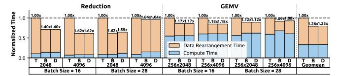
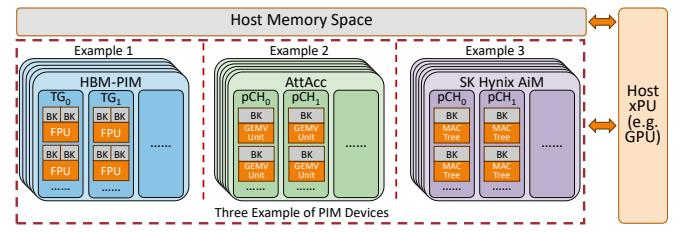
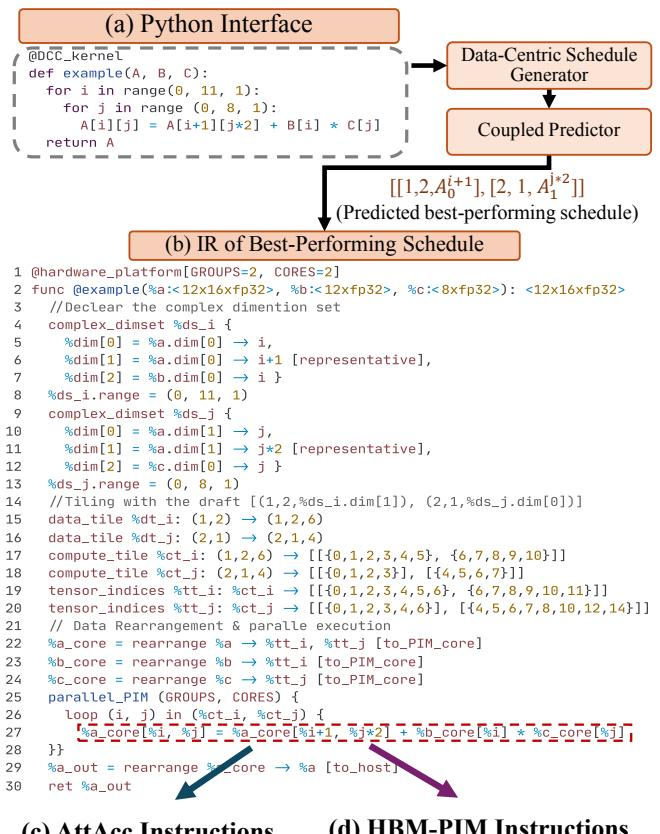
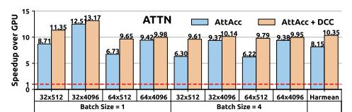
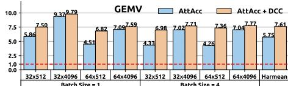
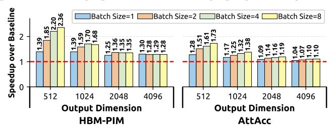
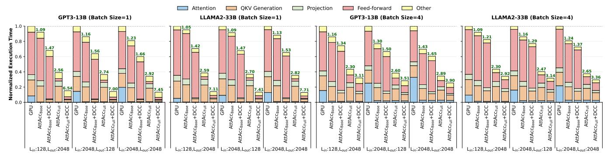
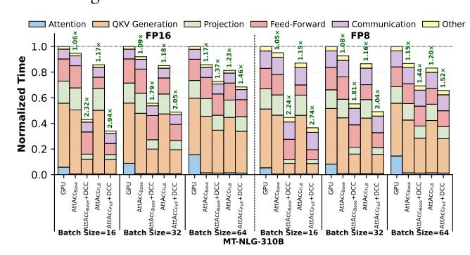
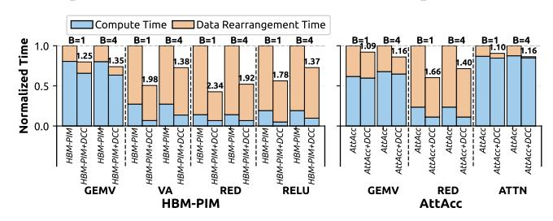
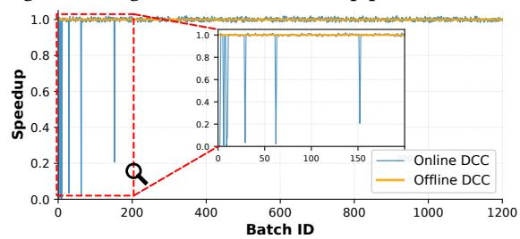

# <span id="page-2-0"></span>2.2. Need for Data-Centric ML Compiler Support for PIM Architectures

PIM software support remains in early stages, with limited automation and compilation frameworks. SimplePIM [52] optimizes only 1D tensor kernels on UPMEM PIM. PIM-DL [21] effectively supports only the GEMM kernel. CINM [54] integrates multi-level intermediate representations to lower abstractions to PIM, again targeting UPMEM. PIMFlow [55] supports only convolution kernels, automating kernel offloading to GPU or PIM, but without kernel-level tuning optimizations and largely ignoring data rearrangement costs. These works lack systematic optimization and auto-tuning for diverse ML kernels and support for multiple PIM backends. Moreover, most of them target UPMEM PIM, a CPU-integrated DDR4-based device that has no floating-point support and weak multiplication support. This makes UPMEM unsuitable for ML models, where compute-intensive kernels typically run on GPUs/T-PUs and memory-intensive kernels on PIM cores may need floating-point arithmetic and strong multiplication units.

ATiM [42] is a search-based tensor compiler designed for UPMEM PIM. ATiM tunes ML kernels on CPU-PIM systems, however, CPU-PIM co-execution on UPMEM systems typically performs worse than GPU-only execution [19,20,39,40,50]. In contrast, GPU-PIM co-execution can deliver substantial performance benefits in ML [28,33,34,37] over GPU-only execution. Although ATiM considers data rearrangement costs, it could not achieve best performance due to its *compute-centric* tuning approach. ATiM has a three-step sequential process: it (i) uses TVM [61] to find and fix a set of templates for compute schedule generation, (ii) generates data rearrangements needed for each template using UPMEM-specific optimizations, and (iii) searches within this fixed set of templates to find the bestperforming configuration. This sequential approach is suboptimal, because it treats compute schedule optimization and data rearrangement as independent problems, while they are fundamentally interdependent. A compute schedule that appears efficient in isolation may require expensive data rearrangements, while a slightly less efficient schedule might enable cheaper data rearrangement costs, yielding better end-to-end performance. By fixing compute templates before generating data rearrangements, ATiM explores only a restricted search space and cannot discover configurations where alternative compute schedules paired with different data transformations could minimize total time.

Fig. 2 shows the breakdown of compute (step (2) in Fig. 1) and data rearrangement (steps (1) and (3) in Fig. 1) times for the Reduction and GEMV kernels running on AttAcc PIM [28] (See §5)

using various matrix sizes. We evaluate a TVM-based [61] compilation scheme (T) that fairly mirrors ATiM's approach [42], against a manually-tuned best-performing implementation (B) and our proposal DCC (**D**). For the TVM-based scheme, we tune TVM via performance profiling of Reduction and GEMV on the PIM devices. TVM selects the best-performing compute schedule templates based on its cost model. For each template, we generate the optimized data rearrangements and measure endto-end performance (compute time plus data rearrangement time). We present the configuration with the best performance among TVM's selected templates. For the manually-tuned best-performing implementation, we manually select some promising data partitioning strategies across PIM cores, and deploy an optimized compute schedule for all of them. Then, we evaluate all of them and present the configuration that provides the minimum total execution time.

<span id="page-3-0"></span>

Fig. 2: Normalized breakdown of compute and data rearrangement times in Reduction and GEMV kernels, comparing the TVM-based compilation scheme (T), a manually-tuned best-performing implementation (B) and DCC (D) using various matrix sizes. The numbers on each bar show speedup over T.

We make two observations. First, the TVM-based approach has suboptimal performance. It is on average  $1.28 \times$  worse than the best manual implementation. This is because the TVMbased approach (followed by ATiM [42]) is compute-centric: it selects compute schedule templates that minimize compute time, while largely ignoring data rearrangement costs. Consequently, data rearrangements are responsible for 64.68% of the total kernel time on average. Second, while the manuallytuned implementation has  $1.16 \times$  worse compute time than the TVM-based approach, it reduces data rearrangement costs by 1.55× compared to the TVM-based scheme. Thus, it provides better trade-offs that result in better end-to-end performance. Overall, these results indicate that compute schedules and data rearrangements are interdependent: obtaining the best performance requires balancing both costs. DCC jointly co-optimizes data rearrangement costs and compute schedules, and provides 1.27× over the compute-centric TVM-based approach, performing very similarly to the best manual implementation.

#### 3. DCC: Overview

DCC (Fig. 3) is the first data-centric ML compiler for PIM systems that *co-optimizes* data rearrangement strategies together with compute schedule in a unified tuning process. DCC supports diverse ML kernels and multiple PIM backends. Fig. 3 presents a high-level overview of DCC components. Users develop ML kernels using the DCC API (§4.5), which enables execution on target PIM backends. At compile time, DCC analyzes ML kernels in the model and trains its coupled predictor. At runtime, once input tensor dimensions are known (e.g., token sizes in LLMs), DCC uses its pre-trained predictor to select optimized configurations for all PIM-running kernels. The end-to-end kernel configuration orchestrates data loading to the target

<span id="page-3-1"></span>

Fig. 3: High-level Overview of DCC.

PIM backend, computation on PIM cores, and final output data with the appropriate layout. DCC has five components.

- 1. Multi-Layer Abstraction. We design a general multi-layer abstraction for near-bank PIM systems, where PIM cores form PIM groups, which enables DCC to reason about data distribution across memory banks and data processing on PIM groups and cores. Our abstraction (i) enables coarse-grained optimizations at the PIM group level and fine-grained optimizations at the PIM core level, and (ii) decouples the compiler from backend-specific semantics, allowing DCC to support multiple current and future PIM backends.
- **2. Data-Centric Schedule Generator.** We follow a *data-first* scheduling strategy that first generates all candidate data partitions across PIM resources, and then maps them to corresponding loop partitions in the compute schedule, creating *tiling drafts.* This approach enables effective *co-optimization* of data rearrangement with loop-level compute schedule.
- **3. PIM-Specific Code Optimizer.** We introduce PIM-specific performance optimizations for data rearrangement strategy and loop-level compute schedule of each tiling draft. This optimizer can be easily extended with additional backendagnostic optimizations or backend-specific passes to create specialized compiler variants for particular PIM backends.
- **4. Coupled Performance Predictor.** We use a learning-based performance predictor that models the interdependence between data rearrangement costs and compute efficiency and selects the best-performing configuration that minimizes end-to-end execution time. It can provide fast and accurate performance predictions on various PIM backends.
- 5. Intermediate Representation. We design a data-centric Intermediate Representation (IR) that captures the optimized data partitioning strategy and loop-level compute schedule derived from the best-performing configuration. Given an ML kernel written in high-level Python as input, the IR encodes how data is distributed across PIM cores and how computation is structured within them. This intermediate layer is subsequently lowered to backend-specific PIM instructions, enabling support for multiple PIM backends.

### 4. DCC: Detailed Design

**4.1. Multi-Layer Abstraction for PIM Architectures** To efficiently support multiple PIM backends, we introduce a **general multi-layer abstraction**, which maps the traditional

memory hierarchy into a compute hierarchy, allowing DCC to configure where and how each ML tensor is distributed and processed. Our abstractions covers various near-bank PIM backends [19,24-41], that have the common characteristics described in §2.1. These PIM backends have similar logical organization: they place one PIM core (e.g., specialized acceleration or floating point unit) close to one or a few memory banks. Multiple PIM cores can form PIM groups (e.g., cores of the same memory channel or the same DRAM rank can form a group), and the memory bus controller of Host xPU can serve as a controller for all PIM groups. PIM devices may include specialized compute units for each PIM core group (Fig. 1) that can access data from multiple memory banks within the same PIM group. Although the PIM core may have different compute units across different PIM backends, the overall computational model remains consistent across PIM backends. Key differences lie primarily in hardware circuitry design and core microarchitecture rather than execution semantics. Any current or future PIM system that satisfies our proposed multilayer abstraction can be seamlessly supported by DCC for ML kernel acceleration. Our abstraction has three levels. Two of these levels are within the PIM device.

<span id="page-4-0"></span>

Fig. 4: Example PIM backends instantiated under DCC's multilayer abstraction.

(1) System Level. Our system-level PIM abstraction consists of three major components (See Fig. 1): the Host xPU, Host memory space and the PIM devices. The Host xPU (e.g., CPU, GPU, TPU) orchestrates global execution control, data rearrangements, and kernel scheduling. PIM devices perform near-memory computation. The Host memory space is an address space that follows the Host-side data layout, accessible through standard DRAM commands (e.g., LD/ST). It maps to physical addresses in PIM-enabled or normal memory banks. For example (Fig. 4), in the HBM-PIM system [25], the system level includes the GPU device as Host xPU and multiple HBM-PIM devices. In the AttAcc PIM system [28], it includes the GPU as Host xPU and multiple AttAcc PIM devices.

(2) PIM Group Level. A PIM group represents multiple PIM cores (and their local memory banks) belonging to the same memory channel or rank, depending on the device architecture. A PIM group may include specialized compute units that access data from all banks within the group and/or buffers to temporarily store group-wide data. For instance, in HBM-PIM [25], the group level could include multiple FPU units of one or multiple Thread Groups (TGs) (Fig. 4) of the same HBM-PIM device. In AttAcc PIM [28], it could include multiple GEMV and accumulator units of one or multiple pseudo-Channels (pCHs) of the same AttAcc PIM device. Each group is managed by the Host xPU memory controller, which may issue group-level instructions. A group-level instruction can be a read/write/-

compute command (i) that broadcasts to all cores within the group, typically using identical bank address offsets, or (ii) is executed by the specialized compute units of the group. In the latter case, the instruction may access data from shared group-wide buffers or merge partial results produced by PIM cores of the group. Each group has a dedicated memory bus to the Host xPU, enabling DCC to schedule *parallel* data rearrangements across multiple PIM groups. Host can coordinate global data movements across PIM groups or between Host and PIM memory. By scheduling coarse-grained group-level instructions broadcast to all cores within a PIM group, DCC can reduce instruction traffic on the memory controller, and enable parallel operations in the PIM group's cores.

(3) **PIM Core Level.** A PIM core represents the processing unit and its local memory bank(s). It can include a SIMD unit or Floating-Point Unit (FPU) or any specialized compute unit. It may have scratchpad memory or register files to temporarily store data for processing. For example, in HBM-PIM [25], the core level includes one single core consisting of an FPU and its register files placed close two (neighboring) memory banks. In AttAcc PIM [28], it includes one GEMV unit placed close to its memory bank. If the Host memory space is mapped to PIM banks, a portion of each bank serves as Host memory, and the PIM backend provides address offsets for the PIM mapping. PIM cores are controlled via bank-level instructions or broadcast group-level instructions sent by the Host memory controller, or instructions stored in dedicated instruction memory per core. By scheduling fine-grained bank-level instructions, DCC enables optimizations on individual PIM cores.

This abstraction enables PIM devices to operate under either group-level or bank-level control for near-bank computation. It also enables DCC to optimize at multiple granularities: coarse-grained at the PIM group level (e.g., effectively partitioning data across groups or scheduling computation on specialized units of a group) and fine-grained at the PIM core level (e.g., optimizing memory access within a bank or local data layout and computation). It decouples DCC from hardware-specific instruction semantics, thereby enabling DCC to easily support multiple PIM backends that conform to this abstraction.

#### <span id="page-4-1"></span>4.2. Data-Centric Schedule Generation

Traditional ML compilers [61–71] use loop transformations to divide computation into blocks, and improve data locality. DCC adopts a **data-first schedule** strategy that inverts this process: it 1) generates all candidate data partitions of data tensors (called **data tiles**) across PIM groups and cores (following its multi-layer abstraction), 2) maps data tiles to their corresponding loop partitions (ranges of loop variables) in the compute code (called **compute tiles**), 3) optimizes each configuration's performance, 4) then uses its predictor to evaluate datacompute tile mappings, 5) selects the best-performing schedule, and 6) generates PIM instructions for the best-performing end-to-end kernel configuration for the target PIM backend.

To find the best data-compute schedule for a given kernel and hardware configuration, DCC generates a comprehensive set of **tiling drafts**, each representing a potential mapping between tensor sizes, computation loops, and PIM hardware resources. The generation process includes four stages shown

in Fig. 5 for an example ML kernel and explained next.

<span id="page-5-0"></span>

Fig. 5: Example schedule generation process for an ML kernel.

- **1. Dimension Set Construction.** To jointly co-optimize compute-data, we need to correlate the data tensors with the loop-level compute schedule. For a k-dimensional tensor A, we map its dimensions  $A_0$ ,  $A_1$ , ...  $A_k$  to the loop-level compute schedule: we leverage loop variables as intermediaries to associate tensor dimensions to mapping functions. Specifically, for a tensor A with tensor reference  $A[b+1][i^*2]$ , where  $A_0$  is the first dimension and  $A_1$  is the second dimension, we use the variables and constants to build mapping functions for each dimension: e.g., the mapping functions F(b)=b+1 and  $F(i)=i^*2$  are for the dimensions  $A_0$  and  $A_1$ , respectively. A tensor may have multiple tensor references in nested loops, e.g., tensor A in Fig. 5 has two references A[b][i] and A[b+1][i\*2], creating multiple mapping functions for the same tensor dimension. The dimension  $A_0$  is associated with both F(b)=band F(b)=b+1. We build all mapping functions for each tensor dimension and collect them into a reference set. The reference set for dimension  $A_0$  is  $\{b, b+1\}$ , and for  $A_1$  is  $\{i, i^*2\}$ . The reference set for the tensor dimension  $C_0$  is  $\{b\}$ , and for  $C_1$  is  $\{k\}$ . Next, when two or more tensor dimensions share the same loop variable in their reference sets, they are grouped into a **complex dimension set**. For example, dimensions  $A_0$ and  $C_0$  both contain variable b in their reference sets, thus we group them as  $(A_0 = \{b, b+1\}, C_0 = \{b\})$  to be processed jointly, since these dimensions must share the same loop indexing values, i.e., b takes the same indexing values in loop iterations. Tensor dimensions that do not share variables with any other dimension form simpler dimension sets.
- 2. Data-Tile Construction. We explore all candidate data tile options through exhaustive depth-first search with memoization, constructing data tiles for each dimension set. For the i-th dimension set among n dimension sets, given k available PIM groups and m available cores per group, we try all possible PIM allocations, i.e., [1,k] PIM groups and [1,m] cores per group. The available PIM groups and cores for the (i+1)-th dimension set are computed recursively as  $avail\_resources_{i+1} = \frac{avail\_resources_i}{allocated\_resources_i}$ . Memoization caches all valid allocation solutions for each subproblem, enabling reuse when the same PIM resource configuration is encountered again during search. Once the allocation of PIM resources is done for all dimension sets, we create multiple tiling drafts as follows. Each draft has n parts, one for each dimension set.

Each part includes three parameters: [the number of groups, the number of cores, a representative mapping]. The **representative mapping** is an assignment of a mapping function (e.g., b+1) to a tensor dimension (e.g.,  $A_0$ ). We create drafts via exhaustive search for all possible assignments of representative mappings for a given dimension set. For instance, in Fig. 5, the first draft has three parts for its three dimension sets. The first part is  $[1, 1, A_0^{b+1}]$ , which represents 1 PIM group, 1 core per group, and the representative mapping  $A_0^{b+1}$ . The second part  $[1, 1, A_1^{i*2}]$  represents 1 group, 1 core per group, and the representative mapping  $A_1^{i*2}$ . Similarly, the third part is  $[1, 1, B_1^k]$ . When this step finishes, we have generated all possible tiling drafts for all possible data tiles.

3. Draft Pruning. DCC applies three pruning rules to eliminate unpromising tiling drafts and reduce tuning time, while maintaining high performance. Rule 1. We remove redundant tiling drafts that have the same data tiles and equivalent representative mappings for all dimension sets. In Fig. 5, the 5th draft [[2, 4,  $C_0^b$ ]...] and the 6th draft [[2, 4,  $A_0^b$ ]...] are redundant. In their first part (which relates to the first dimension set), they have the same data partition, i.e., 2 PIM groups and 4 cores per group, and equivalent representative mappings, i.e., their representative mappings  $C_0^b$  and  $A_0^b$  use the same mapping function F(b)=b, and thus they generate identical data partitions. The second and third parts of these tiling drafts are identical. Thus, one of these two drafts, i.e., the 5th draft, is removed. **Rule 2.** PIM backends [25–28,32– 35] support SIMD-style instructions that enable PIM cores to fully leverage the large memory bandwidth available in their local bank(s). For example, HBM-PIM [25] supports 16-way SIMD instructions. In a PIM backend with d-way SIMD instruction support, the draft pruner speculatively eliminates drafts where the size of the dimension set assigned to a PIM core is not a multiple of d: these drafts cannot fully utilize the core's local bandwidth and hardware datapaths designed for d-way execution. In Fig. 5, let us assume a PIM backend with 16-way MUL instructions, and consider the dimension set  $(B_1=\{k\}, C_1=\{k\})$  for the computation  $B[i][k]\times C[b][k]$ . The 2nd draft assigns 4 cores to the dimensions  $B_1$  and  $C_1$  (the first dimensions of tensors B and C), both of size 16, so each core must process 4 elements along the dimension assigned to it. Since 4 is not a multiple of the 16 (16-way MUL instruction), this draft is pruned. If all drafts fail to satisfy the d-way instruction alignment requirement, or if the PIM backend does not support SIMD instructions, DCC skips this pruning rule. Rule 3. Within a PIM group, execution performance is determined by the worst-performing core in the group. When comparing multiple drafts, if the worst per-core performance is the same across all corresponding PIM groups for each part of the draft, those drafts are execution-performance equivalent. In this case, only one draft needs to be kept, while the remaining drafts are pruned. To apply this pruning rule, we estimate per-PIM-core performance using the dimension partition size assigned to each core. This partition size is derived from the dimension included in the representative mapping of each part of the draft. The PIM core with the largest dimension partition size within a PIM group is taken as the worst-case performance representative for that group. In Fig. 5, the 4th and 6th drafts

each have three parts. For the first part, whose representative mapping is  $A_0^b$ , both drafts have 2 PIM groups. The worst per-PIM-core performance for the  $A_0$  dimension derived from  $A_0^b$  for the corresponding PIM groups in both drafts is the same: in the 4th draft, it is  $\operatorname{round}(\frac{A_0}{\operatorname{groups}\times cores})=\operatorname{round}(\frac{12}{2\times 3})=2$ , and in the 6th draft, it is  $\operatorname{round}(\frac{A_0}{\operatorname{groups}\times cores})=\operatorname{round}(\frac{12}{2\times 4})=2$ . The remaining two parts of the 4th and 6th drafts yield the same worst percore performance across all their PIM groups. Since the two drafts are execution-performance equivalent, one is arbitrarily pruned, i.e., the 6th draft is pruned.

**4. Data-Tile to Compute-Tile Mappings.** Once the drafts are pruned, DCC constructs core-level **data-tiles** and maps them to core-level **compute-tiles**. The remaining drafts include only the high-level tiling of each part, i.e., the number of PIM groups, PIM cores per group, and the representative mapping of the corresponding dimension set. However, we need to (1) lower the high-level tiling to core-level data-tiles, (2) map the core-level data-tiles to core-level compute-tiles, and (3) determine the necessary data indices of all tensors corresponding to loop variable values of the compute-tiles.

(1) For each part of a draft (which corresponds to a dimension set), we lower the high-level tiling to core-level data-tiles. Given the number of PIM groups, PIM cores per group, and the representative mapping of a dimension set, the data-tile for core  $K_i$  of the PIM group  $G_i$  is computed by dividing the size of the dimension (the dimension is derived from the representative mapping) by the product of the number of PIM groups and the number of PIM cores per group, i.e.,  $\frac{dimension\_size}{groups \times cores}.$  In Fig. 5, the first part of the 7th draft  $[1, 4, C_0^b]$  has 1 PIM group and 4 PIM cores per group, and the representative mapping  $C_0^b$ (which corresponds to the dimension set  $(A_0 = \{b,b+1\}, C_0 = \{b\})$ ). The data-tile size for each core along the dimension  $C_0$  is  $\frac{C_0}{groups \times cores} = \frac{12}{1 \times 4} = 3$ . Thus, the data-tile for the PIM core  $K_0$  of the PIM group  $G_0$  for the first dimension set is  $C_0 \in [0,3)$ (Fig. 5). We similarly compute the data-tiles for all parts of the draft (corresponding to all dimension sets) and for all cores. (2) For each part of the draft (which corresponds to a dimension set), we map the core-level data-tile to a core-level computetile by determining the loop range of the associated variable for the kernel loops. Given the data-tile of core  $K_i$  of PIM group  $G_i$  and the mapping function (e.g., F(b)=b) derived from the representative mapping, the compute-tile is the set of all values of the associated variable (e.g., b) for which the mapping function result falls within the data-tile (e.g., F(b) $\in [0,3)$ ). In Fig. 5, for the first part of the 7th draft, core  $K_0$ of the PIM group  $G_0$  has data-tile [0,3) (from step (1)) for the first dimension set, and the mapping function is F(b)=b. The compute-tile is thus the set of values of b satisfying F(b) $\in [0,3)$ , which gives  $b \in [0,3)$ . Similarly, we calculate all loop ranges for all loop variables across all cores.

(3) Once the compute-tile for each core is determined, DCC derives the **tensor data indices** (e.g., A[0:3][0:3]) that each core must access for **all** the tensor dimensions, corresponding to the loop variable values of the compute-tile. In Fig. 5, for the 7th draft, DCC derives tensor data indices for all tensor dimensions  $A_0$ ,  $A_1$ ,  $B_0$ ,  $B_1$ ,  $C_0$  and  $C_1$ . When the required indices of a tensor are non-contiguous along a dimension, DCC explores two alternative strategies. Strategy (i) expands the indices of

this dimension to cover a contiguous range, adding the missing or straddling values among the required indices (e.g., in Fig. 5 in 7.Mapping1 the indices of  $A_1$  are expanded from  $\{0, 2\}$  to [0:3]). Strategy (ii) keeps only the required indices as-is (e.g., in 7.Mapping2 the index set of  $A_1$  is [0] and [2] (kept as it is)). Since each strategy has different performance implications, DCC generates both and selects the better-performing one.

#### 4.3. PIM-Specific Code Optimizer

Once tiling drafts are generated, data is mapped across PIM banks and compute loop partitions is mapped to PIM cores. DCC then applies a **PIM-specific code optimizer** for *each* tiling draft that further optimizes performance. We exploit common PIM architectural characteristics to enable one optimization that reduces data rearrangement costs and one that improves the execution efficiency of loop-level compute schedule.

I) Data Rearrangement Optimization. Host and PIM cores require different data layouts to achieve high performance. In Host memory, contiguous data needs to be distributed across multiple memory channels to exploit channel-level parallelism. For example, on a two-channel CPU, a 1KB block is divided into 16 cache blocks (indexed 0-15), with odd-indexed lines mapped to one channel and even-indexed lines to the other channel. This enables parallel sequential reads across multiple memory channels. In contrast, PIM cores require contiguous data to be stored in a single memory bank, i.e., using one single memory channel for writes, since each PIM core can only process data stored in its local bank(s). This creates the following data rearrangement challenge: (i) reading contiguous data sequentially from Host memory exploits Host channel parallelism, but results in writes that use only one PIM memory channel, underutilizing PIM bandwidth, while instead (ii) using multiple PIM channels for parallel writes requires simultaneous reads from *non-contiguous* Host addresses, potentially causing Host channel conflicts and degrading read performance. To enable channel parallelism for both Host reads and PIM writes, DCC exploits the controllable on-chip memory (e.g., GPU shared memory) to reorganize data within the Host. For a PIM device with N channels, the compiler calculates the data block size as  $B = \frac{\text{on-chip memory size}}{N}$ . DCC then serially reads N blocks of size B from Host memory to on-chip memory, followed by parallel write operations that distribute these blocks across all N PIM channels simultaneously. This approach transforms data movement into N sequential read operations from Host channels and N parallel writes to PIM channels, leveraging channel parallelism in both reads and writes. If there is no controllable on-chip memory in the system (e.g., on CPUs), DCC performs data rearrangement using the PIM backend's default data copy or DMA interfaces. For PIM backends with specialized layout constrains (e.g., alignment or interleaving requirements), DCC applies additional compliation passes for perfmoring required data layout transformations.

II) Compute Code Optimization. PIM backends [25–28] can use specialized DRAM commands to control computation on PIM cores. However, when all PIM cores perform computations in parallel, the Host memory controller must issue significantly more commands than in conventional DRAM, creating a control bottleneck due to the limited memory bus

bandwidth. To address this, PIM backends [\[25–](#page-14-26)[28\]](#page-14-18) introduce group-level commands that provide SIMD-style control: instead of issuing individual compute commands to each PIM core, a single compute command is broadcast to all cores within a group, with each core operating on its own local data, significantly reducing command bus overhead. DCC employs a hierarchical command generation strategy leveraging both group-level and bank-level control to balance efficiency and flexibility. DCC detects and prioritizes group-level commands wherever possible. Since DRAM command formats constrain group-level commands to use identical address offsets for all cores in the group, DCC pads each core's tensor data to the same size to ensure consistent local addressing. This way DCC allows the memory controller to issue one command per PIM group, significantly reducing command traffic. If the backend lacks group-level command support or when cores need to access different address offsets, DCC generates parallel bank-level commands, achieving fine-grained, bank-level parallelism. This hierarchical command generation strategy adapts to different PIM backends, and minimizes command traffic.

Our optimizer applies PIM-specific optimizations that accelerate performance while remaining backend-agnostic. It has a modular design that facilitates the integration of additional optimizations shared across multiple PIM backends. Developers can also extend DCC with custom optimization passes tailored to specific PIM backends, creating specialized compiler variants (e.g., DCC +HBM for HBM-PIM-specific optimizations).

## 4.4. Coupled Performance Predictor

Although pruning substantially reduces the number candidate drafts, the schedule generator can still produce thousands of valid tiling drafts. Profiling all drafts on the target PIM system can be prohibitively expensive. To efficiently identify the best draft, DCC employs a coupled learning-based performance predictor that estimates end-to-end execution time. The coupled predictor serves two purposes: (i) co-estimating data rearrangement and compute costs to find the best tiling draft, and (ii) providing fast and accurate predictions across multiple PIM backends. We choose a learning-based model (already effectively adopted by widely-used ML compilers [\[61](#page-15-3)[,72,](#page-15-5)[73\]](#page-15-6)) that can be easily trained (retrained or fine-tuned) for a new PIM backend, and provide both low latency and high prediction accuracy. We use an XGBoost model [\[74\]](#page-15-7) to predict end-to-end kernel time, because XGBoost has been proven highly effective for compiler cost modeling in prior works [\[61](#page-15-3)[,72,](#page-15-5)[73,](#page-15-6)[75](#page-15-8)[–78\]](#page-15-9).

While analytical models can achieve sufficient accuracy with PIM device-specific formulas and parameters, they are difficult to generalize across multiple PIM backends with competitive accuracy and maintain as PIM architectures evolve. Moreover, unlike neural predictors (e.g., these used in [\[72\]](#page-15-5)), XGBoost is lightweight in memory and compute requirements.

The coupled predictor supports both static and dynamic tensor sizes. For static sizes, where model and input dimensions are fixed during inference, DCC trains the predictor offline and configures the best-performing schedule during model initialization (similarly to prior ML compilers [\[61,](#page-15-3)[72,](#page-15-5)[73\]](#page-15-6)). For dynamic inputs, which occur in LLMs, DCC finds and selects the best-performing schedules at inference time.

Offline Training: Given model-defined or user-provided tensor sizes, DCC samples a diverse subset of drafts across different tensor sizes from the schedule generation step. Each draft is profiled on the target PIM backend to measure execution time as labels, with draft's configurations and backend information as inputs to the XGBoost model. After training, DCC predicts performance for all drafts at given tensor sizes of ML kernels and records the best-performing draft in a lookup table. When multiple drafts have identical predicted performance, one is selected randomly. This training occurs once per PIM backend using given ML models and tensor sizes. Offline training for all ML kernels across all tensor sizes, ML models, and PIM backends used in our evaluation takes only ∼67 seconds. This cost is negligible and is amortized across multiple users' inference requests for that ML model. At runtime, DCC directly uses the best-performing draft for recorded tensor sizes.

Dynamic Prediction: When a new tensor size appears during inference, DCC generates the corresponding tiling drafts and uses the predictor to estimate performance, recording the bestperforming schedule in the lookup table for future use. In ML models with dynamic tensor sizes, e.g., evaluation of LLMs in Fig. [11,](#page-11-0) the cost to generate drafts on-the-fly and estimate performance is accounted for in total time. Optionally, DCC can support training the predictor at inference time: it can profile a small batch of new drafts, and use the (updated) predictor to estimate performance for remaining drafts.

## <span id="page-7-0"></span>4.5. Programming Interface & Intermediate Representation (IR)

DCC provides a Python [\[79\]](#page-15-10) interface with PyTorch [\[80\]](#page-15-11), described in Table [1,](#page-8-0) to deploy, integrate and compile ML kernels for PIM execution. DCC compiles Python kernels marked with the @DCC \_kernel annotator. The programmer writes a Python kernel that describes tensor computations, specifying tensor shapes and data types needed at compile time. All parameters and return values must be PyTorch tensors or scalar constants. The kernel body describes computations over tensors using affine loop nests, elementary arithmetic operators, and backend-supported instructions, including operations on tensors of varying numeric precision (e.g., integer and floatingpoint) and conditional operations. If there are multiple loop nests that share the same mapping function and loop range, DCC merges them using the same complex dimension set.

Users can integrate a kernel executed on PIM into an ML model using DCC.Layer to create ML layers that replace existing model layers. PIM-running kernels must be initialized with input tensor sizes. DCC provides DCC.Tensor and DCC.Tensor.zero() to create and initialize temporary tensors. After adding PIMaccelerated layers to the model, DCC initializes necessary model metadata, infers all tensor sizes, and performs offline training. At inference, when a request is received, DCC asynchronously infers tensor sizes for all kernels executed on PIM, and selects their best-performing schedules. Users can override the function DCC.Layer.update() to pre-load data to PIM devices using DCC.Kernel.preLoad() before running the kernel. When forward() is called, the kernel is executed on PIM cores with the input data and returns the results as a torch.Tensor. DCC synergistically works with xPU compilers (e.g., ML compil-

<span id="page-8-0"></span>

| Interface            | Description                                  |  |
|----------------------|----------------------------------------------|--|
| @DCC _kernel         | Annotator to define a PIM-running kernels.   |  |
| DCC.Tensor           | Tensor class used in kernel.It can be conve- |  |
|                      | rted to torch.Tensor.                        |  |
| DCC.Layer            | Class to define a new PIM-running layer.     |  |
| DCC.Kernel           | Class to represent a PIM-running kernel.     |  |
| DCC.initKernel()     | Function to initialize the kernel for given  |  |
| DCC.mirKernei()      | input sizes. It returns a DCC.Kernel.        |  |
| DCC.Kernel.update()  | Function called when the best tiling draft   |  |
| DCC.Kernei.upaaie()  | has been determined.                         |  |
|                      | Function to load data to PIM devices and     |  |
| DCC.Kernel.preLoad() | return a PIM address. It also supports part- |  |
| DCC.Rethei.preLouu() | ial updates of tensors in PIM memory with    |  |
|                      | address offset.                              |  |
| DCC.Kernel()         | Function to execute a PIM-running kernel     |  |
|                      | with torch.Tensor or PIM address.            |  |
| DCC.setModel()       | Function to register the model and extract   |  |
|                      | model-level metadata necessary for tuning.   |  |

**Table 1: The DCC Python Programming Interface.** 

ers [61,63] for GPUs) via PyTorch. During the optimization for xPU, the PIM layer will be configured as non-fusible to enable intra- and inter-kernel optimizations. DCC compiles and optimizes this layer for the PIM backend.

Fig. 6 shows an example of replacing the QKV generation layer in GPT-3 13B model with a PIM-accelerated layer. Lines 1-8 define the kernel (running on PIM) with for loops. Line 10 creates class *QKV\_Layer* inheriting from the torch.nn.Module and DCC.Layer. In lines 11-14, DCC initializes the kernel and model parameters. Lines 16-18 pre-load weights and bias to PIM devices after having selected the best-performing schedule. Line 21 executes the kernel with the given input and pre-loaded data. Lines 23-28 replace the original QKV layer in the loaded GPT-3 model and handle inference requests.

```
1 @DCC kernel
 2 def PIM_kernel(weight, bias, x): # define PIM kernel
    y = DCC.Tensor.zero([x.size(0), weight.size(0)])
    for b in range(v.size(0)):
5
       for i in range(y.size(1)):
         for j in range(x.size(1)):
 6
          y[b][i] += x[b][j] * weight[i][j] + bias[j]
 8
10 class QKV_Layer(torch.nn.module, DCC.Layer):
          _init__(self, layer, input_sizes): # init kernel and weight
       self.kernel = DCC.initKernel(PIM_kernel, input_sizes)
       self.weight = layer.weight
13
       self.bias = laver.bias
14
15
    def update(self, best_draft): # pre-load data
17
      self.PIM_W = self.kernel.preLoad(best_draft, self.weight)
18
       self.PIM_b = self.kernel.preLoad(best_draft, self.bias)
19
20
    def forward(self, x): # execute PIM kernel
21
       return self.kernel(self.PIM_W, self.PIM_b, x)
23 model = torch.load("GPT3-13B.model") # load model
24 in_sizes=[[model.qkv_0.weight.sizes(), model.qkv_0.bias.sizes(),
             [1, model.hidden_size]]]
26 model.qkv_0 = QKV_Layer(model.qkv_0, in_sizes) # replace QKV layer
27 model = DCC.setModel(model) # collect model infomation
28 output = model(get_request()) # run the inference
```

Fig. 6: An example of adding DCC kernels to a GPT3 model.

DCC parses Python kernels marked @DCC \_kernel, compiles them to its data-centric Intermediate Representation (IR), and

then generates low-level backend instructions based on the hardware intrinsics supported by the target PIM backend. If the target PIM backend does not support a specific operation, DCC reports a compilation error. The DCC's IR constructs are described in Table 2.

<span id="page-8-2"></span>

| IR Construct                                                                              | Description                                    |
|-------------------------------------------------------------------------------------------|------------------------------------------------|
|                                                                                           | Defines the PIM hardware configurati-          |
|                                                                                           | on for the annotated DCC kernel func-          |
| @hardware_platform[G,C]                                                                   | tion, i.e., the number of PIM groups           |
|                                                                                           | and PIM cores per PIM group.                   |
| func @name(%arg: <shape×< td=""><td>Defines a PIM kernel function with ty-</td></shape×<> | Defines a PIM kernel function with ty-         |
| dtype>): <shape×dtype></shape×dtype>                                                      | ped input/output.                              |
|                                                                                           | Constructs a complex dimension set as          |
| complex_dimset %ds                                                                        | %ds with one or more mapping functi-           |
| {%dim[0],}                                                                                | ons %dim[idx].                                 |
| 1. [1]                                                                                    | Declares a mapping function %dim[i]            |
| %dim[i] = %t.dim[axis]                                                                    | on a tensor dimension %t.dim[axis] as          |
| $\rightarrow$ expr                                                                        | expr.                                          |
|                                                                                           | Marks a mapping function in a compl-           |
| [representative]                                                                          | ex dimension set as the representative         |
| [                                                                                         | mapping.                                       |
|                                                                                           | Specifies the iteration range of the lo-       |
| %ds.range = (start, end, step)                                                            | op variable in a complex dimension se          |
| wasirange (start, ena, step)                                                              | %ds.                                           |
|                                                                                           | Constructs a data tile %dt as the numb         |
|                                                                                           | er of PIM groups( $g$ ), PIMcores ( $c$ ), and |
| data_tile %dt: $(g,c)\rightarrow (g,c,ts)$                                                | the generated tile size $(ts)$ . $g$ and $c$   |
|                                                                                           | are included in the draft description.         |
|                                                                                           | Generates a compute tile %ct based on          |
|                                                                                           | the data tile %dt. Each %ct is a 2D arr-       |
| compute_tile %ct: (g,c,ts)                                                                | ay containing the loop variable ranges         |
| $\rightarrow$ [[ $R_0,$ ],]                                                               | $R_i$ of all i partitions of a tensor dime-    |
|                                                                                           | nsion.                                         |
|                                                                                           | Generates all necessary data indices of        |
|                                                                                           | all tensors from a compute tile. Each          |
| tensor_tile %tt: %ct                                                                      | %tt is a 2D array describing the necess        |
| $\rightarrow$ [[ $T_0$ ,],]                                                               | ary indices $T_i$ of all partitions of a ten   |
|                                                                                           | sor dimension.                                 |
|                                                                                           | Rearranges tensor data between Host            |
|                                                                                           | and PIM data layout in local banks.            |
| %t_core = rearrange %t→%tt                                                                | %t core contains the core-level local          |
|                                                                                           | data reference of the tensor %t.               |
| [to_PIM_core/to_host]                                                                     | Shows the direction of data movement           |
|                                                                                           | Launches parallel execution across all         |
| parallel_PIM (groups, cores)                                                              | PIM groups and PIM cores concurren-            |
| {}                                                                                        | tly.                                           |
|                                                                                           | Iterates over the compute-tiles $\%ct_1,$      |
| loop $(x_1,,x_n)$ in $(\%ct_1,,$                                                          |                                                |
| $\%ct_n$ ) {}                                                                             | drive PIM core-local computation.              |
|                                                                                           | urive riivi core-iocai computation.            |

Table 2: IR constructs of DCC and their descriptions.

Fig. 7 illustrates how DCC compiles a kernel (Fig. 7a) from the Python code to its IR of data- and compute-tiles for a given schedule, and subsequently to final backend instructions. For a given schedule produced by the schedule generator (§4.2), the IR generator produces an IR program (Fig. 7b). Lines 1–2 declare the available PIM hardware resources and the typed input and output tensors. Lines 4–13 create the *complex dimension sets* with designated *representative mappings* (§4.2.1), and declare their iteration ranges (lines 8, 13). Lines 15–16 generate the *data-tiles* by binding the dimension sets to PIM hardware resources (groups, cores) (§4.2.2) and calculating the

per-core data-tile sizes (§4.2.4 step (1)). Lines 17-18 derive the compute-tiles from the data-tiles, and generate the iteration range for each loop variable at the core level (§4.2.4 step (2)). Lines 19–20 derive the necessary tensor data indices at the core level for all tensors, corresponding to loop variable values (§4.2.4 step (3)), and implementing the (ii) tensor indexing strategy in this example. Lines 22-29 derive the end-to-end execution flow (See Fig. 1): performing input data rearrangements for the input tensors (lines 22-24), executing the kernel computation concurrently (parallel) across all PIM cores in tiled compute domains (lines 25-28), and performing output data rearrangements for the output tensor results (line 29). Once IR generation is complete, DCC parses the IR program and translates it to the target backend instructions: Fig. 7c and Fig. 7d show the generated backend instructions of the tensor computation of line 27 of Fig. 7b for the AttAcc and HBM-PIM backends, respectively.

<span id="page-9-1"></span>

(c) AttAcc Instructions (d) HBM-PIM Instructions

Fig. 7: Compilation flow of a kernel using DCC: from the frontend code to its IR of data- and compute-tiles, and then to backend instructions.

#### <span id="page-9-0"></span>5. Evaluation

**Simulation Methodology.** We modify and use the open-source AttAcc simulator [28] with Ramulator 2.0 [81]. We evaluate data movement costs to/from PIM devices using DRAM commands (i.e., LD/ST) simulated in Ramulator 2.0. We modified the simulator to support two PIM backends, i.e., AttAcc [28] and HBM-PIM [25], with its corresponding DRAM

compute commands [25]. We simulate a heterogeneous platform with a NVIDIA A100 GPU and 5 PIM-enabled HBM-type devices, corresponding to 80GB GPU memory. Our platform configuration is consistent with prior state-of-the-art works [28,33]. We evaluate HBM3 memory with 5.2Gbps per pin and running at 333MHz. Each HBM has 16 pseudochannels (pCH), 2 ranks per pCH, 2 banks groups per rank and 4 banks per bank group (64 banks per pCH). We follow the timing parameters that AttAcc used: tCK=0.79, tRCD=19, tRP=19, tCL=19, tCCD=4, BL=2. In AttAcc, each bank of each HBM-type device is equipped with a GEMV unit and each channel has a softmax unit. In HBM-PIM, every two banks of each HBM-type device share a 16-way FP16 FPU and two 16×256-bit GRF registers (one per bank).

ML Kernels and Models. We evaluate seven memory-intensive ML kernels. In AttAcc, we evaluate the general-matrix-vector-multiplication (GEMV), reduction (RED) and attention (ATTN) kernels. In HBM-PIM, we evaluate the GEMV, RED, vector addition (VA) and RELU kernels. Attention requires a softmax unit which only exists on AttAcc. However, AttAcc does not have near-bank compute units that could support and run RELU and VA. For GEMV and ATTN, we use input size 128, the most common per-head dimension in LLMs. We also evaluate end-to-end inference using GPT3-13B and LLAMA2-33B models. We evaluate FP16 data type.

Comparison Points. We evaluate five comparison points. (1) GPU: all kernels run on an A100 GPU configured in AttAcc and Ramulator 2.0 simulators. (2) AttAcc: AttAcc's [28] default open-source implementation that distributes different batches or attention heads across 16 pCHs, partitions the first tensor dimension across 16 bank groups per pCH, and partitions the second tensor dimension across 4 banks per bank group. (3) AttAcc+DCC: we enable DCC compiler on AttAcc. (4) HBM-PIM: we use AttAcc's data distribution. (5) HBM-PIM+DCC: we enable DCC compiler on HBM-PIM.

For offline training, we configure XBoost with learning\_rate=0.1, max\_depth=8, num\_boost\_round=5000. For all workloads, we use 15% of the pruned drafts as training samples, and 85% as test set. The compilation time (offline draft generation, training, prediction) for all evaluated workloads is  $\sim\!\!67$  seconds in total using a system with 32-core AMD EPYC 7513 CPU, 128GB DDR4 memory and NVIDIA A100 GPU.

#### 5.1. ML Kernel Performance

Fig. 8 shows the speedup of AttAcc and AttAcc+DCC over the GPU baseline in various ML kernels, when varying the batch size, number of heads and tensor sizes.

We make three key observations. First, AttAcc significantly outperforms GPU across most kernels, achieving  $10.35 \times$  for ATTN,  $7.61 \times$  for GEMV, and  $1.58 \times$  for RED on average, with the exception of RED at tensor size 1024 where GPU performs better. AttAcc leverages high aggregate PIM bandwidth and integrates specialized units (GEMV, softmax, and accumulator) that provide hardware-level support for these operations. Second, DCC provides further performance improvements over AttAcc:  $1.23 \times$ ,  $1.26 \times$ , and  $1.48 \times$  average speedup, and up to  $1.57 \times$ ,  $1.73 \times$ , and  $1.66 \times$  peak speedup for ATTN, GEMV, and RED kernels, respectively. Notably, for RED with tensor size

<span id="page-10-0"></span>




Fig. 8: Speedup of AttAcc and AttAcc+DCC over GPU for ATTN, GEMV and RED kernels, when varying the tensor sizes.

1024, AttAcc underperforms GPU by  $0.59\times$ , while with DCC achieves almost same performance with GPU. Third, with DCC performance scales well in RED as tensor size increases. In RED, data rearrangement costs dominate the total time (see Fig. 13 in §5.4) and with larger tensor sizes, DCC explores a larger search space, allowing it to more effectively optimize data rearrangement costs. In RED with batch size 1 and tensor size 4096, DCC provides a large speedup of  $3.94\times$ . Overall, DCC significantly accelerates end-to-end time on the state-of-theart AttAcc backend by up to  $13.17\times(3.92\times$  on average) over GPU across diverse ML kernels, batch and tensor sizes, thanks to its comprehensive data-compute co-optimization.

Fig. 9 shows the speedup of HBM-PIM and HBM-PIM+DCC over GPU in various ML kernels, when varying the batch size and tensor sizes. We make four key observations. First, DCC significantly improves HBM-PIM performance by 1.53×, 2.09×,  $1.64\times$ , and  $1.54\times$  for GEMV, RED, VA, and RELU on average, respectively, enabling HBM-PIM to further outperform GPU by  $5.59 \times$ ,  $1.35 \times$ ,  $2.07 \times$ , and  $2.66 \times$ , respectively. Second, in large batch sizes and tensor sizes, AttAcc's distribution is highly optimized over GPUs. Thus, in both HBM-PIM and AttAcc backends (Figs. 8, 9), DCC exploits limited optimization opportunities, and enables smaller speedups over GPUs. Third, when using the same batch and tensor size configurations for both HBM-PIM and AttAcc in GEMV and RED, DCC achieves  $1.53 \times$ and 2.09× average speedup over HBM-PIM, respectively, and 1.26× and 1.48× average speedup over AttAcc, respectively. DCC provides greater performance improvements on HBM-PIM than on AttAcc, because HBM-PIM is less optimized in hardware than AttAcc for GEMV, i.e., HBM-PIM includes general SIMD units, while AttAcc has speciliazed GEMV units. Fourth, for RED with tensor sizes 1024 and 2048, HBM-PIM underperforms GPU by 0.48× averaged across all batch sizes, because the combination of small tensor sizes and HBM-PIM's fixed tiling scheme results in poor SIMD utilization: the per-core tensor partition size does not align with the 16-way SIMD instruction width. However, DCC improves their performance by 2.26× on average, enabling HBM-PIM to outperform GPU at tensor size 2048. Overall, DCC demonstrates robustness across multiple PIM backends through its multi-layer PIM abstraction, providing consistent performance improvements across diverse ML workloads on both HBM-PIM and AttAcc.

Fig. 10 shows the speedup of DCC over HBM-PIM and AttAcc, when increasing the batch size in GEMV, evaluating in an attention layer with head count 32, input size 128 and various output sizes. In both PIM backends, DCC improves performance over the baseline as the batch size increases. On average, DCC performance gains increase with batch size, from  $1.33\times$  to  $1.58\times$  on HBM-PIM, and from  $1.14\times$  to  $1.31\times$  on AttAcc, as batch size grows from 1 to 8. In large output dimension and batch

<span id="page-10-1"></span>

Fig. 9: Speedup of HBM-PIM and HBM-PIM+DCC over GPU for GEMV, RED, VA and RELU, varying the tensor sizes.

sizes, AttAcc's GEMV data distribution strategy achieves high performance, leaving limited room for further optimization. In those workloads, DCC is still able to *automatically* match and slightly improve AttAcc's hand-optimized performance without programmer intervention, demonstrating that DCC can provide both high performance and high programming ease.

<span id="page-10-2"></span>

Fig. 10: Speedup of DCC over HBM-PIM (left) and AttAcc (right), when increasing the batch size in the GEMV kernel.

#### 5.2. End-to-End LLM Inference

Fig. 11 presents the normalized execution time breakdown of AttAcc and AttAcc+DCC over GPU for the main computational phases in inference of two state-of-the-art models, while varying the input and output token sizes and batch sizes. We evaluate two variants: AttAcc $_{Base}$  runs only attention layers on PIM, and Attacc $_{Full}$  runs attention layers and a portion of the Feed-forward on the PIM side (See [28]), while

<span id="page-11-0"></span>

Fig. 11: Normalized time breakdown for GPT3-13B and LLaMA2-33B models for various input, output token and batch sizes.

the largest portion of Feed-forward runs on GPU. For both AttAcc variants, QKV generation, projection and Other run on GPU. However, with DCC's optimizations, we enable QKV generation and projection to be also executed on the PIM side, achieving performance benefits over running them on GPU. In LLM inference, DCC initializes the kernels with few random requests, then generates tiling drafts on-the-fly for new tensor sizes; this generation time is included in our measurements. The numbers in the top of each bar show speedup over GPU.

We make three key observations. First, DCC provides high performance benefits on both Attacc $_{Base}$  and Attacc $_{Full}$  by 1.23× and 1.75× on average, respectively, improving performance over GPU by  $1.44 \times$  and  $4.52 \times$  on average, respectively. DCC significantly strengthens AttAcc, enabling it to substantially outperform GPU across different models and token sizes. Second, DCC improves performance on Attention layers by on average  $1.12 \times$  and  $1.16 \times$  over AttAcc for GPT3-13B and LAMMA2-33B model, respectively. AttAcc uses a fixed tiling strategy across all token counts and batch sizes, while DCC adapts tiling strategies to different workload configurations. Third, in QKV generation and projection layers, DCC achieves  $2.58 \times$  and  $2.91 \times$  speedup over GPU, respectively. In both AttAcc variants, these layers run on GPU, because AttAcc's fixed tiling strategy underperforms GPU by 1.25× in these layers. In contrast, DCC comprehensively explores the datacompute co-optimization space to identify optimal tiling configurations, enabling these layers to run efficiently on PIM and significantly outperform GPU. Overall, we conclude that DCC provides significant performance benefits in various stateof-the-art LLMs with different token count and batch sizes. These results demonstrate that DCC can serve as a practical and effective compiler for heterogeneous ML acceleration on high-performance processors (e.g., GPUs) and PIM backends.

#### 5.3. Large-Scale Experiments

Fig. 12 shows the normalized time breakdown of AttAcc variations and AttAcc+DCC schemes over GPU baseline using MT-NLG-310B model, 128 input tokens, 2048 output tokens, FP16 and FP8 numerical precisions, and large batch sizes (up to 64). We use 8 A100 GPUs (DGX-class) with 5 HBM-type PIM devices each GPU. DCC significantly improves performance over Attacc $_{Base}$  and Attacc $_{Full}$  by 1.59× and 1.67×, respectively. In large batch sizes, AttAcc's GEMV data distribution (QKV generation and projection) already enables high performance. DCC improves it further by 2.21×, providing both high per-

formance and high programming ease. DCC is highly efficient in larger batch sizes, larger LLMs, large multi-GPU systems and using different numerical precisions, providing robustness even in large-scale inference scenarios.

<span id="page-11-3"></span>

Fig. 12: Normalized time breakdown with MT-NLG-310B model for various batch sizes and numerical precisions using 8 A100 GPUs (DGX-class) with 5 PIM devices each GPU.

#### <span id="page-11-2"></span>5.4. ML Kernel Time Breakdown

Fig. 13 shows the normalized time breakdown split into time spent on *compute* and *data rearrangements* for various ML kernels using two batch sizes, and two different backends with and without DCC. The numbers above bars show the speedup provided by DCC. The execution time is normalized to that of the respective PIM backend with its default implementation.

<span id="page-11-1"></span>

Fig. 13: Normalized time breakdown of compute and data rearrangement time in various ML workloads and backends.

We draw two findings. First, DCC co-optimizes both compute time and data rearrangement time, providing  $1.58\times$  and  $1.65\times$  speedup, respectively. DCC comprehensively explores a broader joint optimization space, and identifies highly efficient balance between data movement and computation costs. Second, DCC provides larger benefits in ML kernels, where data rearrangement dominates execution time. The VA, RED,

and RELU kernels exhibit substantial data rearrangement overheads, and DCC accelerates them by  $1.67\times$  on average, while it accelerates the compute-heavy GEMV and ATTN kernels by  $1.18\times$ . These results indicate that DCC significantly alleviates data rearrangement bottlenecks in PIM, while also effectively integrating compute-specific optimizations.

#### 5.5. Energy Efficiency Analysis

Fig. 14 presents DCC's in energy efficiency as kernel breakdown using AttAcc $_{Full}$  system compared to an A100 GPU in end-to-end inference of various LLMs, input token, output token, and batch sizes. We follow the methodology of the AttAcc paper [28]. AttAcc's energy simulation synthesizes all arithmetic units using Synopsys Design Compiler with a 7nm predictive PDK (ASAP7 [82]), models SRAM-based buffers using FinCACTI [83], and scales all components to the appropriate DRAM process technology node. Energy consumption inside the DRAM die is calculated using datapath lengths from HBM chip microphotographs [84,85]. DCC improves energy efficiency over AttAcc $_{Full}$  on average by  $1.24\times$ . DCC's performance benefits translates to energy efficiency gains.

<span id="page-12-0"></span>

Fig. 14: Normalized energy breakdown in GPT3-13B and LLaMA2-33B comparing AttAcc $_{Full}$  PIM system over GPU.

## 5.6. Compilation Time Evaluation

We evaluate DCC's compilation time, and the effectiveness of its draft pruning scheme and its prediction model. Table 3 shows the DCC search space (#candidate drafts) and compilation time, when disabling versus enabling draft pruning for a single workload on AttAcc. We use 128 input tokens, 128 output tokens, 32 heads for ATTN or GEMV, and we vary the PIM devices per GPU and batch sizes.

We draw three findings. First, DCC compile time is low (a few seconds), occurring only once offline before inference. In real deployment scenarios with billions of inference requests on the same model and system configuration, the amortized compilation cost is negligible. Notably, compilation time of a single kernel does not significantly increase, when considering more tensor shapes: ATTN with 1 tensor shape takes 2.96s and with 272 different tensor shapes takes 4.74s (Table 4). Increasing tensor shapes during compilation primarily increases GPU utilization rather than compilation time. Second, the search space primarily grows with system scale, e.g., adding more PIM devices per GPU, as larger systems introduce more candidate data partitioning strategies. Increasing batch sizes (or tensor shapes that we also tested) with a fixed number of PIM devices/cores only slightly increases the search space (the number of candidate partitioning strategies across cores remains

similar). Third, our pruner significantly reduces the search space by on average  $9.01\times$  and compilation time by  $5.97\times$ , with no impact on kernel execution performance. DCC's pruning rules eliminate largely inefficient configurations, ensuring that DCC reliably finds near-optimal schedules.

<span id="page-12-1"></span>

| Kernel | PIM devices<br>per GPU | batch<br>size | Number of<br>GPUs | #drafts<br>w/o pruning |      | compilation time<br>w/o pruning (s) | compilation time<br>w pruning (s) |
|--------|------------------------|---------------|-------------------|------------------------|------|-------------------------------------|-----------------------------------|
| ATTN   | 5                      | 4             | 1                 | 32186                  | 4274 | 9.57                                | 2.96                              |
| ATTN   | 5                      | 64            | 8                 | 33271                  | 4868 | 16.20                               | 4.10                              |
| ATTN   | 10                     | 4             | 1                 | 79952                  | 6200 | 29.90                               | 4.22                              |
| ATTN   | 10                     | 64            | 8                 | 83708                  | 7319 | 54.51                               | 6.32                              |
| GEMV   | 5                      | 4             | 1                 | 32186                  | 4274 | 19.75                               | 3.75                              |
| GEMV   | 5                      | 64            | 8                 | 33271                  | 4868 | 36.86                               | 5.54                              |
| GEMV   | 10                     | 4             | 1                 | 79952                  | 6200 | 57.66                               | 5.46                              |
| GEMV   | 10                     | 64            | 8                 | 83708                  | 7319 | 109.92                              | 9.30                              |

Table 3: DCC search space and compilation time, when disabling versus enabling the pruning for single kernel workload.

We run ML kernels on HBM-PIM and AttAcc with hundreds of different tensor and batch sizes per kernel, representative configurations of real ML models, and all kernel configurations of all evaluated LLMs. We use DCC (pruning is disabled) to exhaustively generate all possible tiling drafts, execute all of them (the whole search space) on the target PIM backend (not using our predictor), and identify the true optimum draft. Table 4 compares the DCC predictor's selections against the true optimum drafts. The *Total* column shows the number of tensor shapes and batch sizes configurations tested per kernel. The #Best column shows how many cases our predictor correctly identified the true optimum draft. The Compilation Time w/o *Predictor* is the DCC compile time when running the workloads on an A100 GPU. The Compilation Time w Predictor is the DCC compile time using our predictor. The Suboptimal Kernel Performance and Suboptimal Total Performance columns show the average performance degradation at kernel and end-to-end inference level, respectively, for the cases where the predictor selects a suboptimal schedule.

<span id="page-12-2"></span>

| Backend+Workload       | T-4-1 | #D 4  | <b>Compilation Time</b> | <b>Compilation Time</b> | Suboptimal Kernel | Suboptimal               |
|------------------------|-------|-------|-------------------------|-------------------------|-------------------|--------------------------|
| backend+workload Iotal |       | #Dest | w/o Predictor (s)       | w Predictor (s)         | Performance       | <b>Total Performance</b> |
| AttAcc+ATTN            | 272   | 203   | 24.80                   | 4.74                    | 97.04% (69 cases) | -                        |
| AttAcc+GEMV            | 304   | 290   | 60.70                   | 11.21                   | 97.01% (14 cases) | -                        |
| AttAcc+RED             | 167   | 155   | 7.60                    | 2.22                    | 94.01% (12 cases) | -                        |
| Attacc+GPT3            | 502   | 489   | 11.94                   | 4.84                    | 97.94% (13 cases) | 99.89%                   |
| Attacc+LLAMA2          | 502   | 488   | 16.13                   | 5.49                    | 98.83% (14 cases) | 99.57%                   |
| Attacc+MT-NLG          | 251   | 245   | 56.53                   | 11.22                   | 99.07% (6 cases)  | 99.80%                   |
| HBM-PIM+GEMV           | 304   | 265   | 116.07                  | 19.50                   | 95.84% (39 cases) | -                        |
| HBM-PIM+RED            | 167   | 154   | 8.09                    | 2.29                    | 96.43% (13 cases) | -                        |
| HBM-PIM+VA             | 167   | 158   | 14.21                   | 3.24                    | 94.94% (9 cases)  | -                        |
| HBM-PIM+RELU           | 167   | 157   | 5.76                    | 1.94                    | 94.48% (10 cases) | -                        |

Table 4: Prediction accuracy, compilation time and suboptimal performance using DCC across various ML workloads.

The DCC's predictor achieves on average 89.28% and 97.37% accuracy on single kernels and LLMs, respectively, in correctly identifying the true optimum schedules. When suboptimal, the predictor's selections achieve 96.56% of true optimal performance on average across different workloads and backends. In AttAcc+ATTN, it has relatively lower accuracy (74.63%), since ATTN fuses GEMV and softmax as a single kernel. However, it still provides high performance (97.4% of true optimum). Even in large LLM inference, DCC's predictor rarely finds sub-optimal schedules, having only ~0.2% total performance slowdown over when using the true optimum schedules. Moreover, our predictor significantly accelerates compilation time by  $3.81 \times$ averaged across all workloads, LLMs, and backends. Overall, our results show that even when our predictor fails to identify the true optimum, the selected schedule has negligible performance degradation, while significantly accelerating the compilation time.

### 5.7. Dynamic Prediction Evaluation

We evaluate DCC in an online draft selection scenario with unseen configurations: for given ML kernel workloads DCC's lookup table has not recorded the best-performing schedules. We execute 2000 batches (batch size 64) of synthetic inference queries on MT-NLG-310B, with input and output token sizes randomly generated from the range [128, 2048], covering representative sequence lengths of real-world deployments. Fig. 15 compares online DCC with unseen tensor shapes against offline DCC, where all tensor shapes have been previously seen and are recorded in the lookup table. Online DCC incurs performance penalty only during the first  $\sim$ 160 queries, where unseen tensor shapes trigger additional compilation. After this short warm-up period, DCC's lookup table covers all encountered tensor shapes and online DCC converges to the same performance as offline DCC. DCC's online overhead is shortlived, requiring only a few hundred warm-up queries, and is fully amortized in real-world LLM deployments where the number of requests (typically millions of LLM queries) is orders of magnitude larger than DCC's warm-up period.

<span id="page-13-0"></span>

Fig. 15: Online vs offline DCC on MT-NLG 310B inference.

#### 6. Related Work

To our knowledge, this is the first work to (i) consider data rearrangement strategies and their associated costs during ML kernel tuning for xPU-integrated PIM devices, and (ii) propose a compiler that jointly optimizes them with compute code.

Compiler Support for PIM. Prior works [21,52,54,55] design compilation tools for PIM systems, but lack systematic optimization and auto-tuning capabilities. They target a single ML kernel or a single PIM backend. ATiM [42] is a search-based tensor compiler for UPMEM PIM. However, UPMEM's DDR4-based architecture targets CPU memory channels, thus preventing GPU-PIM co-executions for ML models. ATiM employs *compute-centric* tuning, generating data rearrangement strategies in isolation from compute code generation. Such compute-centric process yields sub-optimal performance (§2.2). Instead, DCC has a *unified data-centric* approach that co-optimizes compute-data to minimize end-to-end time.

Compiler Support for Processing-Using-Memory (PUM). OptiPIM [86], MVE [87], and TCCIM [88] propose compilers for PUM devices, which are analog-based and have higher hardware design complexity than PIM devices (digital-based). PIM Architectures and Accelerators. UPMEM PIM [19,24] DDR4-based device for CPUs lacks a complete 32×32-bit integer multiplier and floating-point units, making it unsuitable for our target ML workloads. Samsung HBM-PIM [25] and SK Hynix GDDR6-AiM [26,27] are 3D memory devices with floating-point units, can be integrated with GPUs, and have

38] enhance near-bank PIM devices to support critical ML primitives (e.g., GEMV, ReLU, Softmax), can be integrated with xPUs, and have floating-point capabilities. DCC can be directly used on them to automate and accelerate ML kernels. Nearrank PIM systems [53,89–91] place cores at the buffer chip of the DIMM with access to all banks. Despite different core placement, DCC can effectively support near-rank PIM designs for ML. Recent works propose hybrid near-rank and near-bank designs [92-94] and NPU-integrated PIM devices [95-100]. DCC can be easily extended to support them thanks to its multilayer abstraction. Finally, prior works [50,90,101–110] design application-specific PIM devices for graph analytics, sparse kernel, or data retrieval. While DCC may benefit some kernels in these devices, we primarily target ML kernels and models. **Software for PIM Systems**. Prior works [18–20,51,111–126] propose libraries, frameworks, and benchmark suites for the UPMEM PIM spanning linear algebra, graph processing, image processing, machine learning, databases, and concurrent data structure domains. UPMEM PIM is primarily designed for CPUs and has limited hardware multiplication support. DCC is designed for PIM devices that efficiently support ML kernels. Communication and System Integration for PIM. Prior works [57,127-136] design efficient data transfers, memory management, synchronization, virtualization of PIM, and simulation tools. PIMCARE [57] is a compiler-assisted scheduler to allocate the correct amount of PIM devices for an application. UniNDP [56] is a simulation and compilation framework for different PIM architecture types (near-bank, near-device, nearrank, near-channel) to guide programmers how to develop their kernels. To run a kernel on a target PIM backend, programmers still need to manually implement it using backendspecific low-level programming interface. Instead, DCC directly takes kernels written in high-level Python interface (§4.5), and automatically generates optimized low-level code for a PIM backend. Programmers using DCC require **no** expertise in the target PIM backend's programming interface or architecture. ML Compilers for Commodity Systems. Prior works [61– 73,137–139] propose ML compilers for CPU, FPGA and GPU systems by leveraging their shared memory model and deep cache hierarchies (on-chip caches). Prometheus [139] optimizes kernels on FPGAs via loop transformations for cache locality, and overlapping computation with off-chip data transfers to main memory. Instead, PIM systems have a distributed memory model and shallow cache hierarchy, and may not have hardware support to overlap PIM computation with off-chip data transfers. Thus, compiler techniques such as cache tiling, loop transformations, and compute-communication overlapping cannot enable high performance on PIM. ML compilers for CPU/GPU/FPGA cannot be directly used in PIM systems, or would cause high performance costs because they do not optimize data how data is distributed across DRAM banks.

been validated in real systems. Numerous research works [28-

#### 7. Conclusion

We observe that Host xPU processor and PIM cores require different data layouts, necessitating data rearrangements that pose significant performance challenges in ML kernels. We also find that data rearrangement and compute code optimization are interdependent. To this end, we design DCC, a data-centric ML compiler for PIM systems, that co-optimizes compute code and data rearrangement strategies in a unified tuning process. DCC enables up to 7.68× speedup over GPU on HBM-PIM and up to 13.17× speedup over GPU on AttAcc for ML kernels. DCC on AttAcc accelerates end-to-end LLM inference by up to 7.71×. We hope our work encourages further research on compilation tools for ML kernels on PIM systems.

# <span id="page-2-0"></span>2.2. Need for Data-Centric ML Compiler Support for PIM Architectures

PIM software support remains in early stages, with limited automation and compilation frameworks. SimplePIM [52] optimizes only 1D tensor kernels on UPMEM PIM. PIM-DL [21] effectively supports only the GEMM kernel. CINM [54] integrates multi-level intermediate representations to lower abstractions to PIM, again targeting UPMEM. PIMFlow [55] supports only convolution kernels, automating kernel offloading to GPU or PIM, but without kernel-level tuning optimizations and largely ignoring data rearrangement costs. These works lack systematic optimization and auto-tuning for diverse ML kernels and support for multiple PIM backends. Moreover, most of them target UPMEM PIM, a CPU-integrated DDR4-based device that has no floating-point support and weak multiplication support. This makes UPMEM unsuitable for ML models, where compute-intensive kernels typically run on GPUs/T-PUs and memory-intensive kernels on PIM cores may need floating-point arithmetic and strong multiplication units.

ATiM [42] is a search-based tensor compiler designed for UPMEM PIM. ATiM tunes ML kernels on CPU-PIM systems, however, CPU-PIM co-execution on UPMEM systems typically performs worse than GPU-only execution [19,20,39,40,50]. In contrast, GPU-PIM co-execution can deliver substantial performance benefits in ML [28,33,34,37] over GPU-only execution. Although ATiM considers data rearrangement costs, it could not achieve best performance due to its *compute-centric* tuning approach. ATiM has a three-step sequential process: it (i) uses TVM [61] to find and fix a set of templates for compute schedule generation, (ii) generates data rearrangements needed for each template using UPMEM-specific optimizations, and (iii) searches within this fixed set of templates to find the bestperforming configuration. This sequential approach is suboptimal, because it treats compute schedule optimization and data rearrangement as independent problems, while they are fundamentally interdependent. A compute schedule that appears efficient in isolation may require expensive data rearrangements, while a slightly less efficient schedule might enable cheaper data rearrangement costs, yielding better end-to-end performance. By fixing compute templates before generating data rearrangements, ATiM explores only a restricted search space and cannot discover configurations where alternative compute schedules paired with different data transformations could minimize total time.

Fig. 2 shows the breakdown of compute (step (2) in Fig. 1) and data rearrangement (steps (1) and (3) in Fig. 1) times for the Reduction and GEMV kernels running on AttAcc PIM [28] (See §5)

using various matrix sizes. We evaluate a TVM-based [61] compilation scheme (T) that fairly mirrors ATiM's approach [42], against a manually-tuned best-performing implementation (B) and our proposal DCC (**D**). For the TVM-based scheme, we tune TVM via performance profiling of Reduction and GEMV on the PIM devices. TVM selects the best-performing compute schedule templates based on its cost model. For each template, we generate the optimized data rearrangements and measure endto-end performance (compute time plus data rearrangement time). We present the configuration with the best performance among TVM's selected templates. For the manually-tuned best-performing implementation, we manually select some promising data partitioning strategies across PIM cores, and deploy an optimized compute schedule for all of them. Then, we evaluate all of them and present the configuration that provides the minimum total execution time.

<span id="page-3-0"></span>

Fig. 2: Normalized breakdown of compute and data rearrangement times in Reduction and GEMV kernels, comparing the TVM-based compilation scheme (T), a manually-tuned best-performing implementation (B) and DCC (D) using various matrix sizes. The numbers on each bar show speedup over T.

We make two observations. First, the TVM-based approach has suboptimal performance. It is on average  $1.28 \times$  worse than the best manual implementation. This is because the TVMbased approach (followed by ATiM [42]) is compute-centric: it selects compute schedule templates that minimize compute time, while largely ignoring data rearrangement costs. Consequently, data rearrangements are responsible for 64.68% of the total kernel time on average. Second, while the manuallytuned implementation has  $1.16 \times$  worse compute time than the TVM-based approach, it reduces data rearrangement costs by 1.55× compared to the TVM-based scheme. Thus, it provides better trade-offs that result in better end-to-end performance. Overall, these results indicate that compute schedules and data rearrangements are interdependent: obtaining the best performance requires balancing both costs. DCC jointly co-optimizes data rearrangement costs and compute schedules, and provides 1.27× over the compute-centric TVM-based approach, performing very similarly to the best manual implementation.

#### 3. DCC: Overview

DCC (Fig. 3) is the first data-centric ML compiler for PIM systems that *co-optimizes* data rearrangement strategies together with compute schedule in a unified tuning process. DCC supports diverse ML kernels and multiple PIM backends. Fig. 3 presents a high-level overview of DCC components. Users develop ML kernels using the DCC API (§4.5), which enables execution on target PIM backends. At compile time, DCC analyzes ML kernels in the model and trains its coupled predictor. At runtime, once input tensor dimensions are known (e.g., token sizes in LLMs), DCC uses its pre-trained predictor to select optimized configurations for all PIM-running kernels. The end-to-end kernel configuration orchestrates data loading to the target

<span id="page-3-1"></span>

Fig. 3: High-level Overview of DCC.

PIM backend, computation on PIM cores, and final output data with the appropriate layout. DCC has five components.

- 1. Multi-Layer Abstraction. We design a general multi-layer abstraction for near-bank PIM systems, where PIM cores form PIM groups, which enables DCC to reason about data distribution across memory banks and data processing on PIM groups and cores. Our abstraction (i) enables coarse-grained optimizations at the PIM group level and fine-grained optimizations at the PIM core level, and (ii) decouples the compiler from backend-specific semantics, allowing DCC to support multiple current and future PIM backends.
- **2. Data-Centric Schedule Generator.** We follow a *data-first* scheduling strategy that first generates all candidate data partitions across PIM resources, and then maps them to corresponding loop partitions in the compute schedule, creating *tiling drafts.* This approach enables effective *co-optimization* of data rearrangement with loop-level compute schedule.
- **3. PIM-Specific Code Optimizer.** We introduce PIM-specific performance optimizations for data rearrangement strategy and loop-level compute schedule of each tiling draft. This optimizer can be easily extended with additional backendagnostic optimizations or backend-specific passes to create specialized compiler variants for particular PIM backends.
- **4. Coupled Performance Predictor.** We use a learning-based performance predictor that models the interdependence between data rearrangement costs and compute efficiency and selects the best-performing configuration that minimizes end-to-end execution time. It can provide fast and accurate performance predictions on various PIM backends.
- 5. Intermediate Representation. We design a data-centric Intermediate Representation (IR) that captures the optimized data partitioning strategy and loop-level compute schedule derived from the best-performing configuration. Given an ML kernel written in high-level Python as input, the IR encodes how data is distributed across PIM cores and how computation is structured within them. This intermediate layer is subsequently lowered to backend-specific PIM instructions, enabling support for multiple PIM backends.

### 4. DCC: Detailed Design

**4.1. Multi-Layer Abstraction for PIM Architectures** To efficiently support multiple PIM backends, we introduce a **general multi-layer abstraction**, which maps the traditional

memory hierarchy into a compute hierarchy, allowing DCC to configure where and how each ML tensor is distributed and processed. Our abstractions covers various near-bank PIM backends [19,24-41], that have the common characteristics described in §2.1. These PIM backends have similar logical organization: they place one PIM core (e.g., specialized acceleration or floating point unit) close to one or a few memory banks. Multiple PIM cores can form PIM groups (e.g., cores of the same memory channel or the same DRAM rank can form a group), and the memory bus controller of Host xPU can serve as a controller for all PIM groups. PIM devices may include specialized compute units for each PIM core group (Fig. 1) that can access data from multiple memory banks within the same PIM group. Although the PIM core may have different compute units across different PIM backends, the overall computational model remains consistent across PIM backends. Key differences lie primarily in hardware circuitry design and core microarchitecture rather than execution semantics. Any current or future PIM system that satisfies our proposed multilayer abstraction can be seamlessly supported by DCC for ML kernel acceleration. Our abstraction has three levels. Two of these levels are within the PIM device.

<span id="page-4-0"></span>

Fig. 4: Example PIM backends instantiated under DCC's multilayer abstraction.

(1) System Level. Our system-level PIM abstraction consists of three major components (See Fig. 1): the Host xPU, Host memory space and the PIM devices. The Host xPU (e.g., CPU, GPU, TPU) orchestrates global execution control, data rearrangements, and kernel scheduling. PIM devices perform near-memory computation. The Host memory space is an address space that follows the Host-side data layout, accessible through standard DRAM commands (e.g., LD/ST). It maps to physical addresses in PIM-enabled or normal memory banks. For example (Fig. 4), in the HBM-PIM system [25], the system level includes the GPU device as Host xPU and multiple HBM-PIM devices. In the AttAcc PIM system [28], it includes the GPU as Host xPU and multiple AttAcc PIM devices.

(2) PIM Group Level. A PIM group represents multiple PIM cores (and their local memory banks) belonging to the same memory channel or rank, depending on the device architecture. A PIM group may include specialized compute units that access data from all banks within the group and/or buffers to temporarily store group-wide data. For instance, in HBM-PIM [25], the group level could include multiple FPU units of one or multiple Thread Groups (TGs) (Fig. 4) of the same HBM-PIM device. In AttAcc PIM [28], it could include multiple GEMV and accumulator units of one or multiple pseudo-Channels (pCHs) of the same AttAcc PIM device. Each group is managed by the Host xPU memory controller, which may issue group-level instructions. A group-level instruction can be a read/write/-

compute command (i) that broadcasts to all cores within the group, typically using identical bank address offsets, or (ii) is executed by the specialized compute units of the group. In the latter case, the instruction may access data from shared group-wide buffers or merge partial results produced by PIM cores of the group. Each group has a dedicated memory bus to the Host xPU, enabling DCC to schedule *parallel* data rearrangements across multiple PIM groups. Host can coordinate global data movements across PIM groups or between Host and PIM memory. By scheduling coarse-grained group-level instructions broadcast to all cores within a PIM group, DCC can reduce instruction traffic on the memory controller, and enable parallel operations in the PIM group's cores.

(3) **PIM Core Level.** A PIM core represents the processing unit and its local memory bank(s). It can include a SIMD unit or Floating-Point Unit (FPU) or any specialized compute unit. It may have scratchpad memory or register files to temporarily store data for processing. For example, in HBM-PIM [25], the core level includes one single core consisting of an FPU and its register files placed close two (neighboring) memory banks. In AttAcc PIM [28], it includes one GEMV unit placed close to its memory bank. If the Host memory space is mapped to PIM banks, a portion of each bank serves as Host memory, and the PIM backend provides address offsets for the PIM mapping. PIM cores are controlled via bank-level instructions or broadcast group-level instructions sent by the Host memory controller, or instructions stored in dedicated instruction memory per core. By scheduling fine-grained bank-level instructions, DCC enables optimizations on individual PIM cores.

This abstraction enables PIM devices to operate under either group-level or bank-level control for near-bank computation. It also enables DCC to optimize at multiple granularities: coarse-grained at the PIM group level (e.g., effectively partitioning data across groups or scheduling computation on specialized units of a group) and fine-grained at the PIM core level (e.g., optimizing memory access within a bank or local data layout and computation). It decouples DCC from hardware-specific instruction semantics, thereby enabling DCC to easily support multiple PIM backends that conform to this abstraction.

#### <span id="page-4-1"></span>4.2. Data-Centric Schedule Generation

Traditional ML compilers [61–71] use loop transformations to divide computation into blocks, and improve data locality. DCC adopts a **data-first schedule** strategy that inverts this process: it 1) generates all candidate data partitions of data tensors (called **data tiles**) across PIM groups and cores (following its multi-layer abstraction), 2) maps data tiles to their corresponding loop partitions (ranges of loop variables) in the compute code (called **compute tiles**), 3) optimizes each configuration's performance, 4) then uses its predictor to evaluate datacompute tile mappings, 5) selects the best-performing schedule, and 6) generates PIM instructions for the best-performing end-to-end kernel configuration for the target PIM backend.

To find the best data-compute schedule for a given kernel and hardware configuration, DCC generates a comprehensive set of **tiling drafts**, each representing a potential mapping between tensor sizes, computation loops, and PIM hardware resources. The generation process includes four stages shown

in Fig. 5 for an example ML kernel and explained next.

<span id="page-5-0"></span>

Fig. 5: Example schedule generation process for an ML kernel.

- **1. Dimension Set Construction.** To jointly co-optimize compute-data, we need to correlate the data tensors with the loop-level compute schedule. For a k-dimensional tensor A, we map its dimensions  $A_0$ ,  $A_1$ , ...  $A_k$  to the loop-level compute schedule: we leverage loop variables as intermediaries to associate tensor dimensions to mapping functions. Specifically, for a tensor A with tensor reference  $A[b+1][i^*2]$ , where  $A_0$  is the first dimension and  $A_1$  is the second dimension, we use the variables and constants to build mapping functions for each dimension: e.g., the mapping functions F(b)=b+1 and  $F(i)=i^*2$  are for the dimensions  $A_0$  and  $A_1$ , respectively. A tensor may have multiple tensor references in nested loops, e.g., tensor A in Fig. 5 has two references A[b][i] and A[b+1][i\*2], creating multiple mapping functions for the same tensor dimension. The dimension  $A_0$  is associated with both F(b)=band F(b)=b+1. We build all mapping functions for each tensor dimension and collect them into a reference set. The reference set for dimension  $A_0$  is  $\{b, b+1\}$ , and for  $A_1$  is  $\{i, i^*2\}$ . The reference set for the tensor dimension  $C_0$  is  $\{b\}$ , and for  $C_1$  is  $\{k\}$ . Next, when two or more tensor dimensions share the same loop variable in their reference sets, they are grouped into a **complex dimension set**. For example, dimensions  $A_0$ and  $C_0$  both contain variable b in their reference sets, thus we group them as  $(A_0 = \{b, b+1\}, C_0 = \{b\})$  to be processed jointly, since these dimensions must share the same loop indexing values, i.e., b takes the same indexing values in loop iterations. Tensor dimensions that do not share variables with any other dimension form simpler dimension sets.
- 2. Data-Tile Construction. We explore all candidate data tile options through exhaustive depth-first search with memoization, constructing data tiles for each dimension set. For the i-th dimension set among n dimension sets, given k available PIM groups and m available cores per group, we try all possible PIM allocations, i.e., [1,k] PIM groups and [1,m] cores per group. The available PIM groups and cores for the (i+1)-th dimension set are computed recursively as  $avail\_resources_{i+1} = \frac{avail\_resources_i}{allocated\_resources_i}$ . Memoization caches all valid allocation solutions for each subproblem, enabling reuse when the same PIM resource configuration is encountered again during search. Once the allocation of PIM resources is done for all dimension sets, we create multiple tiling drafts as follows. Each draft has n parts, one for each dimension set.

Each part includes three parameters: [the number of groups, the number of cores, a representative mapping]. The **representative mapping** is an assignment of a mapping function (e.g., b+1) to a tensor dimension (e.g.,  $A_0$ ). We create drafts via exhaustive search for all possible assignments of representative mappings for a given dimension set. For instance, in Fig. 5, the first draft has three parts for its three dimension sets. The first part is  $[1, 1, A_0^{b+1}]$ , which represents 1 PIM group, 1 core per group, and the representative mapping  $A_0^{b+1}$ . The second part  $[1, 1, A_1^{i*2}]$  represents 1 group, 1 core per group, and the representative mapping  $A_1^{i*2}$ . Similarly, the third part is  $[1, 1, B_1^k]$ . When this step finishes, we have generated all possible tiling drafts for all possible data tiles.

3. Draft Pruning. DCC applies three pruning rules to eliminate unpromising tiling drafts and reduce tuning time, while maintaining high performance. Rule 1. We remove redundant tiling drafts that have the same data tiles and equivalent representative mappings for all dimension sets. In Fig. 5, the 5th draft [[2, 4,  $C_0^b$ ]...] and the 6th draft [[2, 4,  $A_0^b$ ]...] are redundant. In their first part (which relates to the first dimension set), they have the same data partition, i.e., 2 PIM groups and 4 cores per group, and equivalent representative mappings, i.e., their representative mappings  $C_0^b$  and  $A_0^b$  use the same mapping function F(b)=b, and thus they generate identical data partitions. The second and third parts of these tiling drafts are identical. Thus, one of these two drafts, i.e., the 5th draft, is removed. **Rule 2.** PIM backends [25–28,32– 35] support SIMD-style instructions that enable PIM cores to fully leverage the large memory bandwidth available in their local bank(s). For example, HBM-PIM [25] supports 16-way SIMD instructions. In a PIM backend with d-way SIMD instruction support, the draft pruner speculatively eliminates drafts where the size of the dimension set assigned to a PIM core is not a multiple of d: these drafts cannot fully utilize the core's local bandwidth and hardware datapaths designed for d-way execution. In Fig. 5, let us assume a PIM backend with 16-way MUL instructions, and consider the dimension set  $(B_1=\{k\}, C_1=\{k\})$  for the computation  $B[i][k]\times C[b][k]$ . The 2nd draft assigns 4 cores to the dimensions  $B_1$  and  $C_1$  (the first dimensions of tensors B and C), both of size 16, so each core must process 4 elements along the dimension assigned to it. Since 4 is not a multiple of the 16 (16-way MUL instruction), this draft is pruned. If all drafts fail to satisfy the d-way instruction alignment requirement, or if the PIM backend does not support SIMD instructions, DCC skips this pruning rule. Rule 3. Within a PIM group, execution performance is determined by the worst-performing core in the group. When comparing multiple drafts, if the worst per-core performance is the same across all corresponding PIM groups for each part of the draft, those drafts are execution-performance equivalent. In this case, only one draft needs to be kept, while the remaining drafts are pruned. To apply this pruning rule, we estimate per-PIM-core performance using the dimension partition size assigned to each core. This partition size is derived from the dimension included in the representative mapping of each part of the draft. The PIM core with the largest dimension partition size within a PIM group is taken as the worst-case performance representative for that group. In Fig. 5, the 4th and 6th drafts

each have three parts. For the first part, whose representative mapping is  $A_0^b$ , both drafts have 2 PIM groups. The worst per-PIM-core performance for the  $A_0$  dimension derived from  $A_0^b$  for the corresponding PIM groups in both drafts is the same: in the 4th draft, it is  $\operatorname{round}(\frac{A_0}{\operatorname{groups}\times cores})=\operatorname{round}(\frac{12}{2\times 3})=2$ , and in the 6th draft, it is  $\operatorname{round}(\frac{A_0}{\operatorname{groups}\times cores})=\operatorname{round}(\frac{12}{2\times 4})=2$ . The remaining two parts of the 4th and 6th drafts yield the same worst percore performance across all their PIM groups. Since the two drafts are execution-performance equivalent, one is arbitrarily pruned, i.e., the 6th draft is pruned.

**4. Data-Tile to Compute-Tile Mappings.** Once the drafts are pruned, DCC constructs core-level **data-tiles** and maps them to core-level **compute-tiles**. The remaining drafts include only the high-level tiling of each part, i.e., the number of PIM groups, PIM cores per group, and the representative mapping of the corresponding dimension set. However, we need to (1) lower the high-level tiling to core-level data-tiles, (2) map the core-level data-tiles to core-level compute-tiles, and (3) determine the necessary data indices of all tensors corresponding to loop variable values of the compute-tiles.

(1) For each part of a draft (which corresponds to a dimension set), we lower the high-level tiling to core-level data-tiles. Given the number of PIM groups, PIM cores per group, and the representative mapping of a dimension set, the data-tile for core  $K_i$  of the PIM group  $G_i$  is computed by dividing the size of the dimension (the dimension is derived from the representative mapping) by the product of the number of PIM groups and the number of PIM cores per group, i.e.,  $\frac{dimension\_size}{groups \times cores}.$  In Fig. 5, the first part of the 7th draft  $[1, 4, C_0^b]$  has 1 PIM group and 4 PIM cores per group, and the representative mapping  $C_0^b$ (which corresponds to the dimension set  $(A_0 = \{b,b+1\}, C_0 = \{b\})$ ). The data-tile size for each core along the dimension  $C_0$  is  $\frac{C_0}{groups \times cores} = \frac{12}{1 \times 4} = 3$ . Thus, the data-tile for the PIM core  $K_0$  of the PIM group  $G_0$  for the first dimension set is  $C_0 \in [0,3)$ (Fig. 5). We similarly compute the data-tiles for all parts of the draft (corresponding to all dimension sets) and for all cores. (2) For each part of the draft (which corresponds to a dimension set), we map the core-level data-tile to a core-level computetile by determining the loop range of the associated variable for the kernel loops. Given the data-tile of core  $K_i$  of PIM group  $G_i$  and the mapping function (e.g., F(b)=b) derived from the representative mapping, the compute-tile is the set of all values of the associated variable (e.g., b) for which the mapping function result falls within the data-tile (e.g., F(b) $\in [0,3)$ ). In Fig. 5, for the first part of the 7th draft, core  $K_0$ of the PIM group  $G_0$  has data-tile [0,3) (from step (1)) for the first dimension set, and the mapping function is F(b)=b. The compute-tile is thus the set of values of b satisfying F(b) $\in [0,3)$ , which gives  $b \in [0,3)$ . Similarly, we calculate all loop ranges for all loop variables across all cores.

(3) Once the compute-tile for each core is determined, DCC derives the **tensor data indices** (e.g., A[0:3][0:3]) that each core must access for **all** the tensor dimensions, corresponding to the loop variable values of the compute-tile. In Fig. 5, for the 7th draft, DCC derives tensor data indices for all tensor dimensions  $A_0$ ,  $A_1$ ,  $B_0$ ,  $B_1$ ,  $C_0$  and  $C_1$ . When the required indices of a tensor are non-contiguous along a dimension, DCC explores two alternative strategies. Strategy (i) expands the indices of

this dimension to cover a contiguous range, adding the missing or straddling values among the required indices (e.g., in Fig. 5 in 7.Mapping1 the indices of  $A_1$  are expanded from  $\{0, 2\}$  to [0:3]). Strategy (ii) keeps only the required indices as-is (e.g., in 7.Mapping2 the index set of  $A_1$  is [0] and [2] (kept as it is)). Since each strategy has different performance implications, DCC generates both and selects the better-performing one.

#### 4.3. PIM-Specific Code Optimizer

Once tiling drafts are generated, data is mapped across PIM banks and compute loop partitions is mapped to PIM cores. DCC then applies a **PIM-specific code optimizer** for *each* tiling draft that further optimizes performance. We exploit common PIM architectural characteristics to enable one optimization that reduces data rearrangement costs and one that improves the execution efficiency of loop-level compute schedule.

I) Data Rearrangement Optimization. Host and PIM cores require different data layouts to achieve high performance. In Host memory, contiguous data needs to be distributed across multiple memory channels to exploit channel-level parallelism. For example, on a two-channel CPU, a 1KB block is divided into 16 cache blocks (indexed 0-15), with odd-indexed lines mapped to one channel and even-indexed lines to the other channel. This enables parallel sequential reads across multiple memory channels. In contrast, PIM cores require contiguous data to be stored in a single memory bank, i.e., using one single memory channel for writes, since each PIM core can only process data stored in its local bank(s). This creates the following data rearrangement challenge: (i) reading contiguous data sequentially from Host memory exploits Host channel parallelism, but results in writes that use only one PIM memory channel, underutilizing PIM bandwidth, while instead (ii) using multiple PIM channels for parallel writes requires simultaneous reads from *non-contiguous* Host addresses, potentially causing Host channel conflicts and degrading read performance. To enable channel parallelism for both Host reads and PIM writes, DCC exploits the controllable on-chip memory (e.g., GPU shared memory) to reorganize data within the Host. For a PIM device with N channels, the compiler calculates the data block size as  $B = \frac{\text{on-chip memory size}}{N}$ . DCC then serially reads N blocks of size B from Host memory to on-chip memory, followed by parallel write operations that distribute these blocks across all N PIM channels simultaneously. This approach transforms data movement into N sequential read operations from Host channels and N parallel writes to PIM channels, leveraging channel parallelism in both reads and writes. If there is no controllable on-chip memory in the system (e.g., on CPUs), DCC performs data rearrangement using the PIM backend's default data copy or DMA interfaces. For PIM backends with specialized layout constrains (e.g., alignment or interleaving requirements), DCC applies additional compliation passes for perfmoring required data layout transformations.

II) Compute Code Optimization. PIM backends [25–28] can use specialized DRAM commands to control computation on PIM cores. However, when all PIM cores perform computations in parallel, the Host memory controller must issue significantly more commands than in conventional DRAM, creating a control bottleneck due to the limited memory bus

bandwidth. To address this, PIM backends [\[25–](#page-14-26)[28\]](#page-14-18) introduce group-level commands that provide SIMD-style control: instead of issuing individual compute commands to each PIM core, a single compute command is broadcast to all cores within a group, with each core operating on its own local data, significantly reducing command bus overhead. DCC employs a hierarchical command generation strategy leveraging both group-level and bank-level control to balance efficiency and flexibility. DCC detects and prioritizes group-level commands wherever possible. Since DRAM command formats constrain group-level commands to use identical address offsets for all cores in the group, DCC pads each core's tensor data to the same size to ensure consistent local addressing. This way DCC allows the memory controller to issue one command per PIM group, significantly reducing command traffic. If the backend lacks group-level command support or when cores need to access different address offsets, DCC generates parallel bank-level commands, achieving fine-grained, bank-level parallelism. This hierarchical command generation strategy adapts to different PIM backends, and minimizes command traffic.

Our optimizer applies PIM-specific optimizations that accelerate performance while remaining backend-agnostic. It has a modular design that facilitates the integration of additional optimizations shared across multiple PIM backends. Developers can also extend DCC with custom optimization passes tailored to specific PIM backends, creating specialized compiler variants (e.g., DCC +HBM for HBM-PIM-specific optimizations).

## 4.4. Coupled Performance Predictor

Although pruning substantially reduces the number candidate drafts, the schedule generator can still produce thousands of valid tiling drafts. Profiling all drafts on the target PIM system can be prohibitively expensive. To efficiently identify the best draft, DCC employs a coupled learning-based performance predictor that estimates end-to-end execution time. The coupled predictor serves two purposes: (i) co-estimating data rearrangement and compute costs to find the best tiling draft, and (ii) providing fast and accurate predictions across multiple PIM backends. We choose a learning-based model (already effectively adopted by widely-used ML compilers [\[61](#page-15-3)[,72,](#page-15-5)[73\]](#page-15-6)) that can be easily trained (retrained or fine-tuned) for a new PIM backend, and provide both low latency and high prediction accuracy. We use an XGBoost model [\[74\]](#page-15-7) to predict end-to-end kernel time, because XGBoost has been proven highly effective for compiler cost modeling in prior works [\[61](#page-15-3)[,72,](#page-15-5)[73,](#page-15-6)[75](#page-15-8)[–78\]](#page-15-9).

While analytical models can achieve sufficient accuracy with PIM device-specific formulas and parameters, they are difficult to generalize across multiple PIM backends with competitive accuracy and maintain as PIM architectures evolve. Moreover, unlike neural predictors (e.g., these used in [\[72\]](#page-15-5)), XGBoost is lightweight in memory and compute requirements.

The coupled predictor supports both static and dynamic tensor sizes. For static sizes, where model and input dimensions are fixed during inference, DCC trains the predictor offline and configures the best-performing schedule during model initialization (similarly to prior ML compilers [\[61,](#page-15-3)[72,](#page-15-5)[73\]](#page-15-6)). For dynamic inputs, which occur in LLMs, DCC finds and selects the best-performing schedules at inference time.

Offline Training: Given model-defined or user-provided tensor sizes, DCC samples a diverse subset of drafts across different tensor sizes from the schedule generation step. Each draft is profiled on the target PIM backend to measure execution time as labels, with draft's configurations and backend information as inputs to the XGBoost model. After training, DCC predicts performance for all drafts at given tensor sizes of ML kernels and records the best-performing draft in a lookup table. When multiple drafts have identical predicted performance, one is selected randomly. This training occurs once per PIM backend using given ML models and tensor sizes. Offline training for all ML kernels across all tensor sizes, ML models, and PIM backends used in our evaluation takes only ∼67 seconds. This cost is negligible and is amortized across multiple users' inference requests for that ML model. At runtime, DCC directly uses the best-performing draft for recorded tensor sizes.

Dynamic Prediction: When a new tensor size appears during inference, DCC generates the corresponding tiling drafts and uses the predictor to estimate performance, recording the bestperforming schedule in the lookup table for future use. In ML models with dynamic tensor sizes, e.g., evaluation of LLMs in Fig. [11,](#page-11-0) the cost to generate drafts on-the-fly and estimate performance is accounted for in total time. Optionally, DCC can support training the predictor at inference time: it can profile a small batch of new drafts, and use the (updated) predictor to estimate performance for remaining drafts.

## <span id="page-7-0"></span>4.5. Programming Interface & Intermediate Representation (IR)

DCC provides a Python [\[79\]](#page-15-10) interface with PyTorch [\[80\]](#page-15-11), described in Table [1,](#page-8-0) to deploy, integrate and compile ML kernels for PIM execution. DCC compiles Python kernels marked with the @DCC \_kernel annotator. The programmer writes a Python kernel that describes tensor computations, specifying tensor shapes and data types needed at compile time. All parameters and return values must be PyTorch tensors or scalar constants. The kernel body describes computations over tensors using affine loop nests, elementary arithmetic operators, and backend-supported instructions, including operations on tensors of varying numeric precision (e.g., integer and floatingpoint) and conditional operations. If there are multiple loop nests that share the same mapping function and loop range, DCC merges them using the same complex dimension set.

Users can integrate a kernel executed on PIM into an ML model using DCC.Layer to create ML layers that replace existing model layers. PIM-running kernels must be initialized with input tensor sizes. DCC provides DCC.Tensor and DCC.Tensor.zero() to create and initialize temporary tensors. After adding PIMaccelerated layers to the model, DCC initializes necessary model metadata, infers all tensor sizes, and performs offline training. At inference, when a request is received, DCC asynchronously infers tensor sizes for all kernels executed on PIM, and selects their best-performing schedules. Users can override the function DCC.Layer.update() to pre-load data to PIM devices using DCC.Kernel.preLoad() before running the kernel. When forward() is called, the kernel is executed on PIM cores with the input data and returns the results as a torch.Tensor. DCC synergistically works with xPU compilers (e.g., ML compil-

<span id="page-8-0"></span>

| Interface            | Description                                  |  |
|----------------------|----------------------------------------------|--|
| @DCC _kernel         | Annotator to define a PIM-running kernels.   |  |
| DCC.Tensor           | Tensor class used in kernel.It can be conve- |  |
|                      | rted to torch.Tensor.                        |  |
| DCC.Layer            | Class to define a new PIM-running layer.     |  |
| DCC.Kernel           | Class to represent a PIM-running kernel.     |  |
| DCC.initKernel()     | Function to initialize the kernel for given  |  |
| DCC.mirKernei()      | input sizes. It returns a DCC.Kernel.        |  |
| DCC.Kernel.update()  | Function called when the best tiling draft   |  |
| DCC.Kernei.upaaie()  | has been determined.                         |  |
|                      | Function to load data to PIM devices and     |  |
| DCC.Kernel.preLoad() | return a PIM address. It also supports part- |  |
| DCC.Rethei.preLouu() | ial updates of tensors in PIM memory with    |  |
|                      | address offset.                              |  |
| DCC.Kernel()         | Function to execute a PIM-running kernel     |  |
|                      | with torch.Tensor or PIM address.            |  |
| DCC.setModel()       | Function to register the model and extract   |  |
|                      | model-level metadata necessary for tuning.   |  |

**Table 1: The DCC Python Programming Interface.** 

ers [61,63] for GPUs) via PyTorch. During the optimization for xPU, the PIM layer will be configured as non-fusible to enable intra- and inter-kernel optimizations. DCC compiles and optimizes this layer for the PIM backend.

Fig. 6 shows an example of replacing the QKV generation layer in GPT-3 13B model with a PIM-accelerated layer. Lines 1-8 define the kernel (running on PIM) with for loops. Line 10 creates class *QKV\_Layer* inheriting from the torch.nn.Module and DCC.Layer. In lines 11-14, DCC initializes the kernel and model parameters. Lines 16-18 pre-load weights and bias to PIM devices after having selected the best-performing schedule. Line 21 executes the kernel with the given input and pre-loaded data. Lines 23-28 replace the original QKV layer in the loaded GPT-3 model and handle inference requests.

```
1 @DCC kernel
 2 def PIM_kernel(weight, bias, x): # define PIM kernel
    y = DCC.Tensor.zero([x.size(0), weight.size(0)])
    for b in range(v.size(0)):
5
       for i in range(y.size(1)):
         for j in range(x.size(1)):
 6
          y[b][i] += x[b][j] * weight[i][j] + bias[j]
 8
10 class QKV_Layer(torch.nn.module, DCC.Layer):
          _init__(self, layer, input_sizes): # init kernel and weight
       self.kernel = DCC.initKernel(PIM_kernel, input_sizes)
       self.weight = layer.weight
13
       self.bias = laver.bias
14
15
    def update(self, best_draft): # pre-load data
17
      self.PIM_W = self.kernel.preLoad(best_draft, self.weight)
18
       self.PIM_b = self.kernel.preLoad(best_draft, self.bias)
19
20
    def forward(self, x): # execute PIM kernel
21
       return self.kernel(self.PIM_W, self.PIM_b, x)
23 model = torch.load("GPT3-13B.model") # load model
24 in_sizes=[[model.qkv_0.weight.sizes(), model.qkv_0.bias.sizes(),
             [1, model.hidden_size]]]
26 model.qkv_0 = QKV_Layer(model.qkv_0, in_sizes) # replace QKV layer
27 model = DCC.setModel(model) # collect model infomation
28 output = model(get_request()) # run the inference
```

Fig. 6: An example of adding DCC kernels to a GPT3 model.

DCC parses Python kernels marked @DCC \_kernel, compiles them to its data-centric Intermediate Representation (IR), and

then generates low-level backend instructions based on the hardware intrinsics supported by the target PIM backend. If the target PIM backend does not support a specific operation, DCC reports a compilation error. The DCC's IR constructs are described in Table 2.

<span id="page-8-2"></span>

| IR Construct                                                                              | Description                                    |
|-------------------------------------------------------------------------------------------|------------------------------------------------|
|                                                                                           | Defines the PIM hardware configurati-          |
|                                                                                           | on for the annotated DCC kernel func-          |
| @hardware_platform[G,C]                                                                   | tion, i.e., the number of PIM groups           |
|                                                                                           | and PIM cores per PIM group.                   |
| func @name(%arg: <shape×< td=""><td>Defines a PIM kernel function with ty-</td></shape×<> | Defines a PIM kernel function with ty-         |
| dtype>): <shape×dtype></shape×dtype>                                                      | ped input/output.                              |
|                                                                                           | Constructs a complex dimension set as          |
| complex_dimset %ds                                                                        | %ds with one or more mapping functi-           |
| {%dim[0],}                                                                                | ons %dim[idx].                                 |
| 1. [1]                                                                                    | Declares a mapping function %dim[i]            |
| %dim[i] = %t.dim[axis]                                                                    | on a tensor dimension %t.dim[axis] as          |
| $\rightarrow$ expr                                                                        | expr.                                          |
|                                                                                           | Marks a mapping function in a compl-           |
| [representative]                                                                          | ex dimension set as the representative         |
| [                                                                                         | mapping.                                       |
|                                                                                           | Specifies the iteration range of the lo-       |
| %ds.range = (start, end, step)                                                            | op variable in a complex dimension se          |
| wasirange (start, ena, step)                                                              | %ds.                                           |
|                                                                                           | Constructs a data tile %dt as the numb         |
|                                                                                           | er of PIM groups( $g$ ), PIMcores ( $c$ ), and |
| data_tile %dt: $(g,c)\rightarrow (g,c,ts)$                                                | the generated tile size $(ts)$ . $g$ and $c$   |
|                                                                                           | are included in the draft description.         |
|                                                                                           | Generates a compute tile %ct based on          |
|                                                                                           | the data tile %dt. Each %ct is a 2D arr-       |
| compute_tile %ct: (g,c,ts)                                                                | ay containing the loop variable ranges         |
| $\rightarrow$ [[ $R_0,$ ],]                                                               | $R_i$ of all i partitions of a tensor dime-    |
|                                                                                           | nsion.                                         |
|                                                                                           | Generates all necessary data indices of        |
|                                                                                           | all tensors from a compute tile. Each          |
| tensor_tile %tt: %ct                                                                      | %tt is a 2D array describing the necess        |
| $\rightarrow$ [[ $T_0$ ,],]                                                               | ary indices $T_i$ of all partitions of a ten   |
|                                                                                           | sor dimension.                                 |
|                                                                                           | Rearranges tensor data between Host            |
|                                                                                           | and PIM data layout in local banks.            |
| %t_core = rearrange %t→%tt                                                                | %t core contains the core-level local          |
|                                                                                           | data reference of the tensor %t.               |
| [to_PIM_core/to_host]                                                                     | Shows the direction of data movement           |
|                                                                                           | Launches parallel execution across all         |
| parallel_PIM (groups, cores)                                                              | PIM groups and PIM cores concurren-            |
| {}                                                                                        | tly.                                           |
|                                                                                           | Iterates over the compute-tiles $\%ct_1,$      |
| loop $(x_1,,x_n)$ in $(\%ct_1,,$                                                          |                                                |
| $\%ct_n$ ) {}                                                                             | drive PIM core-local computation.              |
|                                                                                           | urive riivi core-iocai computation.            |

Table 2: IR constructs of DCC and their descriptions.

Fig. 7 illustrates how DCC compiles a kernel (Fig. 7a) from the Python code to its IR of data- and compute-tiles for a given schedule, and subsequently to final backend instructions. For a given schedule produced by the schedule generator (§4.2), the IR generator produces an IR program (Fig. 7b). Lines 1–2 declare the available PIM hardware resources and the typed input and output tensors. Lines 4–13 create the *complex dimension sets* with designated *representative mappings* (§4.2.1), and declare their iteration ranges (lines 8, 13). Lines 15–16 generate the *data-tiles* by binding the dimension sets to PIM hardware resources (groups, cores) (§4.2.2) and calculating the

per-core data-tile sizes (§4.2.4 step (1)). Lines 17-18 derive the compute-tiles from the data-tiles, and generate the iteration range for each loop variable at the core level (§4.2.4 step (2)). Lines 19–20 derive the necessary tensor data indices at the core level for all tensors, corresponding to loop variable values (§4.2.4 step (3)), and implementing the (ii) tensor indexing strategy in this example. Lines 22-29 derive the end-to-end execution flow (See Fig. 1): performing input data rearrangements for the input tensors (lines 22-24), executing the kernel computation concurrently (parallel) across all PIM cores in tiled compute domains (lines 25-28), and performing output data rearrangements for the output tensor results (line 29). Once IR generation is complete, DCC parses the IR program and translates it to the target backend instructions: Fig. 7c and Fig. 7d show the generated backend instructions of the tensor computation of line 27 of Fig. 7b for the AttAcc and HBM-PIM backends, respectively.

<span id="page-9-1"></span>

(c) AttAcc Instructions (d) HBM-PIM Instructions

Fig. 7: Compilation flow of a kernel using DCC: from the frontend code to its IR of data- and compute-tiles, and then to backend instructions.

#### <span id="page-9-0"></span>5. Evaluation

**Simulation Methodology.** We modify and use the open-source AttAcc simulator [28] with Ramulator 2.0 [81]. We evaluate data movement costs to/from PIM devices using DRAM commands (i.e., LD/ST) simulated in Ramulator 2.0. We modified the simulator to support two PIM backends, i.e., AttAcc [28] and HBM-PIM [25], with its corresponding DRAM

compute commands [25]. We simulate a heterogeneous platform with a NVIDIA A100 GPU and 5 PIM-enabled HBM-type devices, corresponding to 80GB GPU memory. Our platform configuration is consistent with prior state-of-the-art works [28,33]. We evaluate HBM3 memory with 5.2Gbps per pin and running at 333MHz. Each HBM has 16 pseudochannels (pCH), 2 ranks per pCH, 2 banks groups per rank and 4 banks per bank group (64 banks per pCH). We follow the timing parameters that AttAcc used: tCK=0.79, tRCD=19, tRP=19, tCL=19, tCCD=4, BL=2. In AttAcc, each bank of each HBM-type device is equipped with a GEMV unit and each channel has a softmax unit. In HBM-PIM, every two banks of each HBM-type device share a 16-way FP16 FPU and two 16×256-bit GRF registers (one per bank).

ML Kernels and Models. We evaluate seven memory-intensive ML kernels. In AttAcc, we evaluate the general-matrix-vector-multiplication (GEMV), reduction (RED) and attention (ATTN) kernels. In HBM-PIM, we evaluate the GEMV, RED, vector addition (VA) and RELU kernels. Attention requires a softmax unit which only exists on AttAcc. However, AttAcc does not have near-bank compute units that could support and run RELU and VA. For GEMV and ATTN, we use input size 128, the most common per-head dimension in LLMs. We also evaluate end-to-end inference using GPT3-13B and LLAMA2-33B models. We evaluate FP16 data type.

Comparison Points. We evaluate five comparison points. (1) GPU: all kernels run on an A100 GPU configured in AttAcc and Ramulator 2.0 simulators. (2) AttAcc: AttAcc's [28] default open-source implementation that distributes different batches or attention heads across 16 pCHs, partitions the first tensor dimension across 16 bank groups per pCH, and partitions the second tensor dimension across 4 banks per bank group. (3) AttAcc+DCC: we enable DCC compiler on AttAcc. (4) HBM-PIM: we use AttAcc's data distribution. (5) HBM-PIM+DCC: we enable DCC compiler on HBM-PIM.

For offline training, we configure XBoost with learning\_rate=0.1, max\_depth=8, num\_boost\_round=5000. For all workloads, we use 15% of the pruned drafts as training samples, and 85% as test set. The compilation time (offline draft generation, training, prediction) for all evaluated workloads is  $\sim\!\!67$  seconds in total using a system with 32-core AMD EPYC 7513 CPU, 128GB DDR4 memory and NVIDIA A100 GPU.

#### 5.1. ML Kernel Performance

Fig. 8 shows the speedup of AttAcc and AttAcc+DCC over the GPU baseline in various ML kernels, when varying the batch size, number of heads and tensor sizes.

We make three key observations. First, AttAcc significantly outperforms GPU across most kernels, achieving  $10.35 \times$  for ATTN,  $7.61 \times$  for GEMV, and  $1.58 \times$  for RED on average, with the exception of RED at tensor size 1024 where GPU performs better. AttAcc leverages high aggregate PIM bandwidth and integrates specialized units (GEMV, softmax, and accumulator) that provide hardware-level support for these operations. Second, DCC provides further performance improvements over AttAcc:  $1.23 \times$ ,  $1.26 \times$ , and  $1.48 \times$  average speedup, and up to  $1.57 \times$ ,  $1.73 \times$ , and  $1.66 \times$  peak speedup for ATTN, GEMV, and RED kernels, respectively. Notably, for RED with tensor size

<span id="page-10-0"></span>


Fig. 8: Speedup of AttAcc and AttAcc+DCC over GPU for ATTN, GEMV and RED kernels, when varying the tensor sizes.

1024, AttAcc underperforms GPU by  $0.59\times$ , while with DCC achieves almost same performance with GPU. Third, with DCC performance scales well in RED as tensor size increases. In RED, data rearrangement costs dominate the total time (see Fig. 13 in §5.4) and with larger tensor sizes, DCC explores a larger search space, allowing it to more effectively optimize data rearrangement costs. In RED with batch size 1 and tensor size 4096, DCC provides a large speedup of  $3.94\times$ . Overall, DCC significantly accelerates end-to-end time on the state-of-theart AttAcc backend by up to  $13.17\times(3.92\times$  on average) over GPU across diverse ML kernels, batch and tensor sizes, thanks to its comprehensive data-compute co-optimization.

Fig. 9 shows the speedup of HBM-PIM and HBM-PIM+DCC over GPU in various ML kernels, when varying the batch size and tensor sizes. We make four key observations. First, DCC significantly improves HBM-PIM performance by 1.53×, 2.09×,  $1.64\times$ , and  $1.54\times$  for GEMV, RED, VA, and RELU on average, respectively, enabling HBM-PIM to further outperform GPU by  $5.59 \times$ ,  $1.35 \times$ ,  $2.07 \times$ , and  $2.66 \times$ , respectively. Second, in large batch sizes and tensor sizes, AttAcc's distribution is highly optimized over GPUs. Thus, in both HBM-PIM and AttAcc backends (Figs. 8, 9), DCC exploits limited optimization opportunities, and enables smaller speedups over GPUs. Third, when using the same batch and tensor size configurations for both HBM-PIM and AttAcc in GEMV and RED, DCC achieves  $1.53 \times$ and 2.09× average speedup over HBM-PIM, respectively, and 1.26× and 1.48× average speedup over AttAcc, respectively. DCC provides greater performance improvements on HBM-PIM than on AttAcc, because HBM-PIM is less optimized in hardware than AttAcc for GEMV, i.e., HBM-PIM includes general SIMD units, while AttAcc has speciliazed GEMV units. Fourth, for RED with tensor sizes 1024 and 2048, HBM-PIM underperforms GPU by 0.48× averaged across all batch sizes, because the combination of small tensor sizes and HBM-PIM's fixed tiling scheme results in poor SIMD utilization: the per-core tensor partition size does not align with the 16-way SIMD instruction width. However, DCC improves their performance by 2.26× on average, enabling HBM-PIM to outperform GPU at tensor size 2048. Overall, DCC demonstrates robustness across multiple PIM backends through its multi-layer PIM abstraction, providing consistent performance improvements across diverse ML workloads on both HBM-PIM and AttAcc.

Fig. 10 shows the speedup of DCC over HBM-PIM and AttAcc, when increasing the batch size in GEMV, evaluating in an attention layer with head count 32, input size 128 and various output sizes. In both PIM backends, DCC improves performance over the baseline as the batch size increases. On average, DCC performance gains increase with batch size, from  $1.33\times$  to  $1.58\times$  on HBM-PIM, and from  $1.14\times$  to  $1.31\times$  on AttAcc, as batch size grows from 1 to 8. In large output dimension and batch

<span id="page-10-1"></span>

Fig. 9: Speedup of HBM-PIM and HBM-PIM+DCC over GPU for GEMV, RED, VA and RELU, varying the tensor sizes.

sizes, AttAcc's GEMV data distribution strategy achieves high performance, leaving limited room for further optimization. In those workloads, DCC is still able to *automatically* match and slightly improve AttAcc's hand-optimized performance without programmer intervention, demonstrating that DCC can provide both high performance and high programming ease.

<span id="page-10-2"></span>

Fig. 10: Speedup of DCC over HBM-PIM (left) and AttAcc (right), when increasing the batch size in the GEMV kernel.

#### 5.2. End-to-End LLM Inference

Fig. 11 presents the normalized execution time breakdown of AttAcc and AttAcc+DCC over GPU for the main computational phases in inference of two state-of-the-art models, while varying the input and output token sizes and batch sizes. We evaluate two variants: AttAcc $_{Base}$  runs only attention layers on PIM, and Attacc $_{Full}$  runs attention layers and a portion of the Feed-forward on the PIM side (See [28]), while

<span id="page-11-0"></span>

Fig. 11: Normalized time breakdown for GPT3-13B and LLaMA2-33B models for various input, output token and batch sizes.

the largest portion of Feed-forward runs on GPU. For both AttAcc variants, QKV generation, projection and Other run on GPU. However, with DCC's optimizations, we enable QKV generation and projection to be also executed on the PIM side, achieving performance benefits over running them on GPU. In LLM inference, DCC initializes the kernels with few random requests, then generates tiling drafts on-the-fly for new tensor sizes; this generation time is included in our measurements. The numbers in the top of each bar show speedup over GPU.

We make three key observations. First, DCC provides high performance benefits on both Attacc $_{Base}$  and Attacc $_{Full}$  by 1.23× and 1.75× on average, respectively, improving performance over GPU by  $1.44 \times$  and  $4.52 \times$  on average, respectively. DCC significantly strengthens AttAcc, enabling it to substantially outperform GPU across different models and token sizes. Second, DCC improves performance on Attention layers by on average  $1.12 \times$  and  $1.16 \times$  over AttAcc for GPT3-13B and LAMMA2-33B model, respectively. AttAcc uses a fixed tiling strategy across all token counts and batch sizes, while DCC adapts tiling strategies to different workload configurations. Third, in QKV generation and projection layers, DCC achieves  $2.58 \times$  and  $2.91 \times$  speedup over GPU, respectively. In both AttAcc variants, these layers run on GPU, because AttAcc's fixed tiling strategy underperforms GPU by 1.25× in these layers. In contrast, DCC comprehensively explores the datacompute co-optimization space to identify optimal tiling configurations, enabling these layers to run efficiently on PIM and significantly outperform GPU. Overall, we conclude that DCC provides significant performance benefits in various stateof-the-art LLMs with different token count and batch sizes. These results demonstrate that DCC can serve as a practical and effective compiler for heterogeneous ML acceleration on high-performance processors (e.g., GPUs) and PIM backends.

#### 5.3. Large-Scale Experiments

Fig. 12 shows the normalized time breakdown of AttAcc variations and AttAcc+DCC schemes over GPU baseline using MT-NLG-310B model, 128 input tokens, 2048 output tokens, FP16 and FP8 numerical precisions, and large batch sizes (up to 64). We use 8 A100 GPUs (DGX-class) with 5 HBM-type PIM devices each GPU. DCC significantly improves performance over Attacc $_{Base}$  and Attacc $_{Full}$  by 1.59× and 1.67×, respectively. In large batch sizes, AttAcc's GEMV data distribution (QKV generation and projection) already enables high performance. DCC improves it further by 2.21×, providing both high per-

formance and high programming ease. DCC is highly efficient in larger batch sizes, larger LLMs, large multi-GPU systems and using different numerical precisions, providing robustness even in large-scale inference scenarios.

<span id="page-11-3"></span>

Fig. 12: Normalized time breakdown with MT-NLG-310B model for various batch sizes and numerical precisions using 8 A100 GPUs (DGX-class) with 5 PIM devices each GPU.

#### <span id="page-11-2"></span>5.4. ML Kernel Time Breakdown

Fig. 13 shows the normalized time breakdown split into time spent on *compute* and *data rearrangements* for various ML kernels using two batch sizes, and two different backends with and without DCC. The numbers above bars show the speedup provided by DCC. The execution time is normalized to that of the respective PIM backend with its default implementation.

<span id="page-11-1"></span>

Fig. 13: Normalized time breakdown of compute and data rearrangement time in various ML workloads and backends.

We draw two findings. First, DCC co-optimizes both compute time and data rearrangement time, providing  $1.58\times$  and  $1.65\times$  speedup, respectively. DCC comprehensively explores a broader joint optimization space, and identifies highly efficient balance between data movement and computation costs. Second, DCC provides larger benefits in ML kernels, where data rearrangement dominates execution time. The VA, RED,

and RELU kernels exhibit substantial data rearrangement overheads, and DCC accelerates them by  $1.67\times$  on average, while it accelerates the compute-heavy GEMV and ATTN kernels by  $1.18\times$ . These results indicate that DCC significantly alleviates data rearrangement bottlenecks in PIM, while also effectively integrating compute-specific optimizations.

#### 5.5. Energy Efficiency Analysis

Fig. 14 presents DCC's in energy efficiency as kernel breakdown using AttAcc $_{Full}$  system compared to an A100 GPU in end-to-end inference of various LLMs, input token, output token, and batch sizes. We follow the methodology of the AttAcc paper [28]. AttAcc's energy simulation synthesizes all arithmetic units using Synopsys Design Compiler with a 7nm predictive PDK (ASAP7 [82]), models SRAM-based buffers using FinCACTI [83], and scales all components to the appropriate DRAM process technology node. Energy consumption inside the DRAM die is calculated using datapath lengths from HBM chip microphotographs [84,85]. DCC improves energy efficiency over AttAcc $_{Full}$  on average by  $1.24\times$ . DCC's performance benefits translates to energy efficiency gains.

<span id="page-12-0"></span>

Fig. 14: Normalized energy breakdown in GPT3-13B and LLaMA2-33B comparing AttAcc $_{Full}$  PIM system over GPU.

## 5.6. Compilation Time Evaluation

We evaluate DCC's compilation time, and the effectiveness of its draft pruning scheme and its prediction model. Table 3 shows the DCC search space (#candidate drafts) and compilation time, when disabling versus enabling draft pruning for a single workload on AttAcc. We use 128 input tokens, 128 output tokens, 32 heads for ATTN or GEMV, and we vary the PIM devices per GPU and batch sizes.

We draw three findings. First, DCC compile time is low (a few seconds), occurring only once offline before inference. In real deployment scenarios with billions of inference requests on the same model and system configuration, the amortized compilation cost is negligible. Notably, compilation time of a single kernel does not significantly increase, when considering more tensor shapes: ATTN with 1 tensor shape takes 2.96s and with 272 different tensor shapes takes 4.74s (Table 4). Increasing tensor shapes during compilation primarily increases GPU utilization rather than compilation time. Second, the search space primarily grows with system scale, e.g., adding more PIM devices per GPU, as larger systems introduce more candidate data partitioning strategies. Increasing batch sizes (or tensor shapes that we also tested) with a fixed number of PIM devices/cores only slightly increases the search space (the number of candidate partitioning strategies across cores remains

similar). Third, our pruner significantly reduces the search space by on average  $9.01\times$  and compilation time by  $5.97\times$ , with no impact on kernel execution performance. DCC's pruning rules eliminate largely inefficient configurations, ensuring that DCC reliably finds near-optimal schedules.

<span id="page-12-1"></span>

| Kernel | PIM devices<br>per GPU | batch<br>size | Number of<br>GPUs | #drafts<br>w/o pruning |      | compilation time<br>w/o pruning (s) | compilation time<br>w pruning (s) |
|--------|------------------------|---------------|-------------------|------------------------|------|-------------------------------------|-----------------------------------|
| ATTN   | 5                      | 4             | 1                 | 32186                  | 4274 | 9.57                                | 2.96                              |
| ATTN   | 5                      | 64            | 8                 | 33271                  | 4868 | 16.20                               | 4.10                              |
| ATTN   | 10                     | 4             | 1                 | 79952                  | 6200 | 29.90                               | 4.22                              |
| ATTN   | 10                     | 64            | 8                 | 83708                  | 7319 | 54.51                               | 6.32                              |
| GEMV   | 5                      | 4             | 1                 | 32186                  | 4274 | 19.75                               | 3.75                              |
| GEMV   | 5                      | 64            | 8                 | 33271                  | 4868 | 36.86                               | 5.54                              |
| GEMV   | 10                     | 4             | 1                 | 79952                  | 6200 | 57.66                               | 5.46                              |
| GEMV   | 10                     | 64            | 8                 | 83708                  | 7319 | 109.92                              | 9.30                              |

Table 3: DCC search space and compilation time, when disabling versus enabling the pruning for single kernel workload.

We run ML kernels on HBM-PIM and AttAcc with hundreds of different tensor and batch sizes per kernel, representative configurations of real ML models, and all kernel configurations of all evaluated LLMs. We use DCC (pruning is disabled) to exhaustively generate all possible tiling drafts, execute all of them (the whole search space) on the target PIM backend (not using our predictor), and identify the true optimum draft. Table 4 compares the DCC predictor's selections against the true optimum drafts. The *Total* column shows the number of tensor shapes and batch sizes configurations tested per kernel. The #Best column shows how many cases our predictor correctly identified the true optimum draft. The Compilation Time w/o *Predictor* is the DCC compile time when running the workloads on an A100 GPU. The Compilation Time w Predictor is the DCC compile time using our predictor. The Suboptimal Kernel Performance and Suboptimal Total Performance columns show the average performance degradation at kernel and end-to-end inference level, respectively, for the cases where the predictor selects a suboptimal schedule.

<span id="page-12-2"></span>

| Backend+Workload       | T-4-1 | #D 4  | <b>Compilation Time</b> | <b>Compilation Time</b> | Suboptimal Kernel | Suboptimal               |
|------------------------|-------|-------|-------------------------|-------------------------|-------------------|--------------------------|
| backend+workload Iotal |       | #Dest | w/o Predictor (s)       | w Predictor (s)         | Performance       | <b>Total Performance</b> |
| AttAcc+ATTN            | 272   | 203   | 24.80                   | 4.74                    | 97.04% (69 cases) | -                        |
| AttAcc+GEMV            | 304   | 290   | 60.70                   | 11.21                   | 97.01% (14 cases) | -                        |
| AttAcc+RED             | 167   | 155   | 7.60                    | 2.22                    | 94.01% (12 cases) | -                        |
| Attacc+GPT3            | 502   | 489   | 11.94                   | 4.84                    | 97.94% (13 cases) | 99.89%                   |
| Attacc+LLAMA2          | 502   | 488   | 16.13                   | 5.49                    | 98.83% (14 cases) | 99.57%                   |
| Attacc+MT-NLG          | 251   | 245   | 56.53                   | 11.22                   | 99.07% (6 cases)  | 99.80%                   |
| HBM-PIM+GEMV           | 304   | 265   | 116.07                  | 19.50                   | 95.84% (39 cases) | -                        |
| HBM-PIM+RED            | 167   | 154   | 8.09                    | 2.29                    | 96.43% (13 cases) | -                        |
| HBM-PIM+VA             | 167   | 158   | 14.21                   | 3.24                    | 94.94% (9 cases)  | -                        |
| HBM-PIM+RELU           | 167   | 157   | 5.76                    | 1.94                    | 94.48% (10 cases) | -                        |

Table 4: Prediction accuracy, compilation time and suboptimal performance using DCC across various ML workloads.

The DCC's predictor achieves on average 89.28% and 97.37% accuracy on single kernels and LLMs, respectively, in correctly identifying the true optimum schedules. When suboptimal, the predictor's selections achieve 96.56% of true optimal performance on average across different workloads and backends. In AttAcc+ATTN, it has relatively lower accuracy (74.63%), since ATTN fuses GEMV and softmax as a single kernel. However, it still provides high performance (97.4% of true optimum). Even in large LLM inference, DCC's predictor rarely finds sub-optimal schedules, having only ~0.2% total performance slowdown over when using the true optimum schedules. Moreover, our predictor significantly accelerates compilation time by  $3.81 \times$ averaged across all workloads, LLMs, and backends. Overall, our results show that even when our predictor fails to identify the true optimum, the selected schedule has negligible performance degradation, while significantly accelerating the compilation time.

### 5.7. Dynamic Prediction Evaluation

We evaluate DCC in an online draft selection scenario with unseen configurations: for given ML kernel workloads DCC's lookup table has not recorded the best-performing schedules. We execute 2000 batches (batch size 64) of synthetic inference queries on MT-NLG-310B, with input and output token sizes randomly generated from the range [128, 2048], covering representative sequence lengths of real-world deployments. Fig. 15 compares online DCC with unseen tensor shapes against offline DCC, where all tensor shapes have been previously seen and are recorded in the lookup table. Online DCC incurs performance penalty only during the first  $\sim$ 160 queries, where unseen tensor shapes trigger additional compilation. After this short warm-up period, DCC's lookup table covers all encountered tensor shapes and online DCC converges to the same performance as offline DCC. DCC's online overhead is shortlived, requiring only a few hundred warm-up queries, and is fully amortized in real-world LLM deployments where the number of requests (typically millions of LLM queries) is orders of magnitude larger than DCC's warm-up period.

<span id="page-13-0"></span>

Fig. 15: Online vs offline DCC on MT-NLG 310B inference.

#### 6. Related Work

To our knowledge, this is the first work to (i) consider data rearrangement strategies and their associated costs during ML kernel tuning for xPU-integrated PIM devices, and (ii) propose a compiler that jointly optimizes them with compute code.

Compiler Support for PIM. Prior works [21,52,54,55] design compilation tools for PIM systems, but lack systematic optimization and auto-tuning capabilities. They target a single ML kernel or a single PIM backend. ATiM [42] is a search-based tensor compiler for UPMEM PIM. However, UPMEM's DDR4-based architecture targets CPU memory channels, thus preventing GPU-PIM co-executions for ML models. ATiM employs *compute-centric* tuning, generating data rearrangement strategies in isolation from compute code generation. Such compute-centric process yields sub-optimal performance (§2.2). Instead, DCC has a *unified data-centric* approach that co-optimizes compute-data to minimize end-to-end time.

Compiler Support for Processing-Using-Memory (PUM). OptiPIM [86], MVE [87], and TCCIM [88] propose compilers for PUM devices, which are analog-based and have higher hardware design complexity than PIM devices (digital-based). PIM Architectures and Accelerators. UPMEM PIM [19,24] DDR4-based device for CPUs lacks a complete 32×32-bit integer multiplier and floating-point units, making it unsuitable for our target ML workloads. Samsung HBM-PIM [25] and SK Hynix GDDR6-AiM [26,27] are 3D memory devices with floating-point units, can be integrated with GPUs, and have

38] enhance near-bank PIM devices to support critical ML primitives (e.g., GEMV, ReLU, Softmax), can be integrated with xPUs, and have floating-point capabilities. DCC can be directly used on them to automate and accelerate ML kernels. Nearrank PIM systems [53,89–91] place cores at the buffer chip of the DIMM with access to all banks. Despite different core placement, DCC can effectively support near-rank PIM designs for ML. Recent works propose hybrid near-rank and near-bank designs [92-94] and NPU-integrated PIM devices [95-100]. DCC can be easily extended to support them thanks to its multilayer abstraction. Finally, prior works [50,90,101–110] design application-specific PIM devices for graph analytics, sparse kernel, or data retrieval. While DCC may benefit some kernels in these devices, we primarily target ML kernels and models. **Software for PIM Systems**. Prior works [18–20,51,111–126] propose libraries, frameworks, and benchmark suites for the UPMEM PIM spanning linear algebra, graph processing, image processing, machine learning, databases, and concurrent data structure domains. UPMEM PIM is primarily designed for CPUs and has limited hardware multiplication support. DCC is designed for PIM devices that efficiently support ML kernels. Communication and System Integration for PIM. Prior works [57,127-136] design efficient data transfers, memory management, synchronization, virtualization of PIM, and simulation tools. PIMCARE [57] is a compiler-assisted scheduler to allocate the correct amount of PIM devices for an application. UniNDP [56] is a simulation and compilation framework for different PIM architecture types (near-bank, near-device, nearrank, near-channel) to guide programmers how to develop their kernels. To run a kernel on a target PIM backend, programmers still need to manually implement it using backendspecific low-level programming interface. Instead, DCC directly takes kernels written in high-level Python interface (§4.5), and automatically generates optimized low-level code for a PIM backend. Programmers using DCC require **no** expertise in the target PIM backend's programming interface or architecture. ML Compilers for Commodity Systems. Prior works [61– 73,137–139] propose ML compilers for CPU, FPGA and GPU systems by leveraging their shared memory model and deep cache hierarchies (on-chip caches). Prometheus [139] optimizes kernels on FPGAs via loop transformations for cache locality, and overlapping computation with off-chip data transfers to main memory. Instead, PIM systems have a distributed memory model and shallow cache hierarchy, and may not have hardware support to overlap PIM computation with off-chip data transfers. Thus, compiler techniques such as cache tiling, loop transformations, and compute-communication overlapping cannot enable high performance on PIM. ML compilers for CPU/GPU/FPGA cannot be directly used in PIM systems, or would cause high performance costs because they do not optimize data how data is distributed across DRAM banks.

been validated in real systems. Numerous research works [28-

#### 7. Conclusion

We observe that Host xPU processor and PIM cores require different data layouts, necessitating data rearrangements that pose significant performance challenges in ML kernels. We also find that data rearrangement and compute code optimization are interdependent. To this end, we design DCC, a data-centric ML compiler for PIM systems, that co-optimizes compute code and data rearrangement strategies in a unified tuning process. DCC enables up to 7.68× speedup over GPU on HBM-PIM and up to 13.17× speedup over GPU on AttAcc for ML kernels. DCC on AttAcc accelerates end-to-end LLM inference by up to 7.71×. We hope our work encourages further research on compilation tools for ML kernels on PIM systems.

