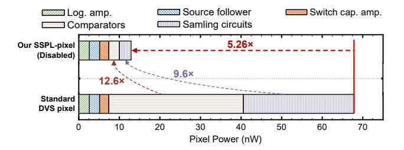
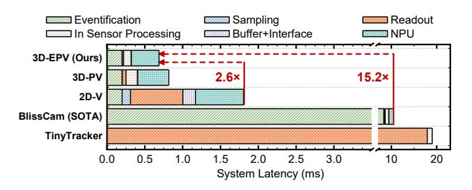
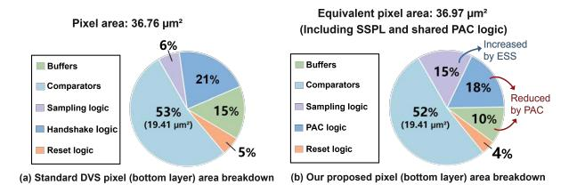

# C. Tracking Latency Reduction

As shown in Fig. 13, our eye tracking system achieves a 15.2× system latency reduction compared to the SOTA system [47]. This improvement originates from the pixel design and the event-driven feature of DESSCam. The pixel design enables each pixel to detect light intensity changes independently with microsecond temporal resolution, eliminating the fixed exposure latency.

Besides, our work achieves a 2.6× latency reduction compared to current 2D DVS architectures. This enhancement

Fig. 12. The comparators and bus-driving sampling circuits in a standard DVS pixel consume up to 89% of pixel power. Our SSPL-pixel reduces the dominant power by disabling the comparators and sampling circuits in non-sampling pixels, achieving up to 5.26× power reduction.

Fig. 13. Latency evaluation results. Our 3D-EPV eye-tracking system reduces latency by 2.6x over a standard event-based system [111] and 15.2x over the SOTA eye tracking image sensor [47]. These improvements arise from the co-design of the entire system. The ESS mechanism enables pixel-wise sparsification, while PAC performs token pruning. Combined with the lightweight ViT algorithm, our 3D-EPV achieves sub-1-ms end-to-end latency.

stems from two key designs: (1) our pixel circuit design performs sampling within the SRAM in the bottom layer, utilizing global reset via peripheral circuits, thus avoiding per-pixel handshaking with peripheral circuits as required in standard DVS architectures; (2) the ESS and PAC mechanisms enhance data sparsity, significantly reducing latency in handshaking, encoding, and output interface stages. Notably, the use of ESS has minimal impact on latency, as the event transmission latency of DESSCam is primarily determined by the critical timing paths (e.g., adder tree and handshake paths).

We evaluated the PAC activation frequency and the equivalent frame rate across all inference samples. Our experiments on EVBEYE show that the activation frequency of PAC ranges from 162.76 Hz to 64,170.78 Hz. We use 12 patches as the threshold for triggering inference, so the equivalent frame rate ranges from 13.56 Hz to 5,347.56 Hz, which means a range of 0.19 ms to 73.75 ms tracking latency when the eye is moving fast versus moving slowly. Note that tracking accuracy is maintained even during periods of slow eye movement or fixation, because natural human eyes constantly exhibit microsaccades [79]. These tiny movements consistently create events, providing sufficient data for accurate and continuous inference [107], [113]. Benefiting from a high peak tracking frequency and an adaptive temporal sampling mechanism, DESSCam supports real-time tracking during saccades and automatically adjusts its sampling rate to match eye movement speed.

Fig. 14. Bottom-layer pixel area breakdown for (a) the standard DVS pixel [117] and (b) our proposed SSPL-pixel. Both (a) and (b) adopt the comparator circuit design in [69]. Overall, our design introduces a minimal area overhead of only 0.6% (36.97  $\mu m^2$  vs. 36.76  $\mu m^2$ ). Although integrating the ESS mechanism in SSPL increases the sampling logic area by 9% compared to the standard pixel, this overhead is effectively mitigated by two optimizations: (1) adopting local SRAM sampling and shared PAC circuits instead of perpixel handshake circuitry, yielding a 3% area reduction; and (2) replacing the standard event-bus-driving buffers with smaller buffers dedicated to driving two SDP\_SRAM cells, bringing a further 5% reduction. As a result, our proposed design supports both the ESS and PAC mechanisms with minimal area overhead.

#### D. Area Estimation

The sampling and control logic are located in the bottom layer, comprising two comparators, a 1-bit 6T SRAM, a 2-bit 8T SRAM, and minimal control logic, as illustrated in Fig. 7. The top layer's analog front-end, including a photodiode and two capacitors for the switched-capacitor amplifier, dominates the pixel area because of its much larger footprint compared to that of the bottom layer. By performing in-pixel event sampling and employing enable-controlled global reset instead of per-pixel reset, our design eliminates the need for traditional DVS handshaking logic, further simplifying the bottom-layer circuitry compared to standard DVS designs.

Our layout results show that the bottom-pixel area (including SSPL and shared PAC) is 36.97  $\mu$ m2 with only 0.6% area overhead compared to that of 36.76  $\mu$ m2 in the standard pixel design [117]. As illustrated in Fig. 14, we achieve this low overhead through two key optimizations. Firstly, our PAC mechanism shares a single handshake control unit across a 16×16 pixel block, eliminating the complex per-pixel AER handshake circuitry required in Fig. 14(a), reducing the handshake logic proportion from 21% to 18%. Secondly, as our pixel does not handshake with the external bus, we replace the event-bus-driving buffers with smaller buffers that only drive the bitlines of two SDP\_SRAM cells, decreasing the buffer area from 15% to 10%. As a result, although integrating in-pixel SRAM cells to support the ESS mechanism increases the sampling logic from 6% to 15%, our design (Fig. 14(b)) still delivers a minimal area overhead of only 0.6% compared to the standard DVS pixel.

The area of the SRAM peripherals is 0.067 mm2. We neglect the area overheads of the handshake logic and the output buffer, as they account for less than 0.1% of the pixel array area. For the top layer, we adopt the same PSC as that in [48], [117], where its area is estimated as  $5\times5~\mu\text{m}^2$ . As the top-layer pixel size is  $5~\mu\text{m}$  and the bottom-layer pixel size is  $6.1~\mu\text{m}$ , we estimate the total chip area to be  $3.414~\text{mm}^2$  with a pixel array of  $346\times260$ . While this pixel size ( $6.1~\mu\text{m}$ ) is larger than

commercial DVS sensors (about 5 µm), the difference is due to our layout limitations compared to optimized industrial layouts from Sony [48] or Samsung [117] rather than our proposed pixel structure. In summary, our layout results demonstrate that the area overhead introduced by the proposed ESS and PAC mechanisms is minimal compared to a standard DVS pixel.

#### *E. Sensitivity Study*

To validate the generalizability of our approach, we extend our ESS pipeline to another task named pupil tracking. It can be regarded as a single-object tracking task that localizes the pupil center [90], which is essential for eye motion analysis in diagnostics and neuroscience [133], [137]. We evaluate our method on the ini-30 dataset [22], which is captured using two DVXplorer event cameras (640×480 pixels) mounted on a glasses frame. Ini-30 is the first event-based eye-tracking dataset with pupil location labelled on the sensor, and the participants were not instructed to follow a dot on a screen, but rather encouraged to look around to collect natural eye movements. We perform 5-fold cross-validation on the ini-30 dataset by implementing the ESS pipeline with our robust ViT algorithm. The results show that our pipeline achieves an average pixel error of only 2.76 (± 0.15) at a 50× compression rate (only 2% pixels are sampled), outperforming Retina [22], which is the SOTA research exhibiting a 3.24 (± 0.79) pixel error without sparsity. The results show that our ESS pipeline can also be applied to object tracking tasks, demonstrating promising generalizability. In conclusion, our experiments show DESSCam can achieve both low power and low latency by 50× downsampling across different tasks while preserving accuracy.

# C. Tracking Latency Reduction

As shown in Fig. 13, our eye tracking system achieves a 15.2× system latency reduction compared to the SOTA system [47]. This improvement originates from the pixel design and the event-driven feature of DESSCam. The pixel design enables each pixel to detect light intensity changes independently with microsecond temporal resolution, eliminating the fixed exposure latency.

Besides, our work achieves a 2.6× latency reduction compared to current 2D DVS architectures. This enhancement

Fig. 12. The comparators and bus-driving sampling circuits in a standard DVS pixel consume up to 89% of pixel power. Our SSPL-pixel reduces the dominant power by disabling the comparators and sampling circuits in non-sampling pixels, achieving up to 5.26× power reduction.

Fig. 13. Latency evaluation results. Our 3D-EPV eye-tracking system reduces latency by 2.6x over a standard event-based system [111] and 15.2x over the SOTA eye tracking image sensor [47]. These improvements arise from the co-design of the entire system. The ESS mechanism enables pixel-wise sparsification, while PAC performs token pruning. Combined with the lightweight ViT algorithm, our 3D-EPV achieves sub-1-ms end-to-end latency.

stems from two key designs: (1) our pixel circuit design performs sampling within the SRAM in the bottom layer, utilizing global reset via peripheral circuits, thus avoiding per-pixel handshaking with peripheral circuits as required in standard DVS architectures; (2) the ESS and PAC mechanisms enhance data sparsity, significantly reducing latency in handshaking, encoding, and output interface stages. Notably, the use of ESS has minimal impact on latency, as the event transmission latency of DESSCam is primarily determined by the critical timing paths (e.g., adder tree and handshake paths).

We evaluated the PAC activation frequency and the equivalent frame rate across all inference samples. Our experiments on EVBEYE show that the activation frequency of PAC ranges from 162.76 Hz to 64,170.78 Hz. We use 12 patches as the threshold for triggering inference, so the equivalent frame rate ranges from 13.56 Hz to 5,347.56 Hz, which means a range of 0.19 ms to 73.75 ms tracking latency when the eye is moving fast versus moving slowly. Note that tracking accuracy is maintained even during periods of slow eye movement or fixation, because natural human eyes constantly exhibit microsaccades [79]. These tiny movements consistently create events, providing sufficient data for accurate and continuous inference [107], [113]. Benefiting from a high peak tracking frequency and an adaptive temporal sampling mechanism, DESSCam supports real-time tracking during saccades and automatically adjusts its sampling rate to match eye movement speed.

Fig. 14. Bottom-layer pixel area breakdown for (a) the standard DVS pixel [117] and (b) our proposed SSPL-pixel. Both (a) and (b) adopt the comparator circuit design in [69]. Overall, our design introduces a minimal area overhead of only 0.6% (36.97  $\mu m^2$  vs. 36.76  $\mu m^2$ ). Although integrating the ESS mechanism in SSPL increases the sampling logic area by 9% compared to the standard pixel, this overhead is effectively mitigated by two optimizations: (1) adopting local SRAM sampling and shared PAC circuits instead of perpixel handshake circuitry, yielding a 3% area reduction; and (2) replacing the standard event-bus-driving buffers with smaller buffers dedicated to driving two SDP\_SRAM cells, bringing a further 5% reduction. As a result, our proposed design supports both the ESS and PAC mechanisms with minimal area overhead.

#### D. Area Estimation

The sampling and control logic are located in the bottom layer, comprising two comparators, a 1-bit 6T SRAM, a 2-bit 8T SRAM, and minimal control logic, as illustrated in Fig. 7. The top layer's analog front-end, including a photodiode and two capacitors for the switched-capacitor amplifier, dominates the pixel area because of its much larger footprint compared to that of the bottom layer. By performing in-pixel event sampling and employing enable-controlled global reset instead of per-pixel reset, our design eliminates the need for traditional DVS handshaking logic, further simplifying the bottom-layer circuitry compared to standard DVS designs.

Our layout results show that the bottom-pixel area (including SSPL and shared PAC) is 36.97  $\mu$ m2 with only 0.6% area overhead compared to that of 36.76  $\mu$ m2 in the standard pixel design [117]. As illustrated in Fig. 14, we achieve this low overhead through two key optimizations. Firstly, our PAC mechanism shares a single handshake control unit across a 16×16 pixel block, eliminating the complex per-pixel AER handshake circuitry required in Fig. 14(a), reducing the handshake logic proportion from 21% to 18%. Secondly, as our pixel does not handshake with the external bus, we replace the event-bus-driving buffers with smaller buffers that only drive the bitlines of two SDP\_SRAM cells, decreasing the buffer area from 15% to 10%. As a result, although integrating in-pixel SRAM cells to support the ESS mechanism increases the sampling logic from 6% to 15%, our design (Fig. 14(b)) still delivers a minimal area overhead of only 0.6% compared to the standard DVS pixel.

The area of the SRAM peripherals is 0.067 mm2. We neglect the area overheads of the handshake logic and the output buffer, as they account for less than 0.1% of the pixel array area. For the top layer, we adopt the same PSC as that in [48], [117], where its area is estimated as  $5\times5~\mu\text{m}^2$ . As the top-layer pixel size is  $5~\mu\text{m}$  and the bottom-layer pixel size is  $6.1~\mu\text{m}$ , we estimate the total chip area to be  $3.414~\text{mm}^2$  with a pixel array of  $346\times260$ . While this pixel size ( $6.1~\mu\text{m}$ ) is larger than

commercial DVS sensors (about 5 µm), the difference is due to our layout limitations compared to optimized industrial layouts from Sony [48] or Samsung [117] rather than our proposed pixel structure. In summary, our layout results demonstrate that the area overhead introduced by the proposed ESS and PAC mechanisms is minimal compared to a standard DVS pixel.

#### *E. Sensitivity Study*

To validate the generalizability of our approach, we extend our ESS pipeline to another task named pupil tracking. It can be regarded as a single-object tracking task that localizes the pupil center [90], which is essential for eye motion analysis in diagnostics and neuroscience [133], [137]. We evaluate our method on the ini-30 dataset [22], which is captured using two DVXplorer event cameras (640×480 pixels) mounted on a glasses frame. Ini-30 is the first event-based eye-tracking dataset with pupil location labelled on the sensor, and the participants were not instructed to follow a dot on a screen, but rather encouraged to look around to collect natural eye movements. We perform 5-fold cross-validation on the ini-30 dataset by implementing the ESS pipeline with our robust ViT algorithm. The results show that our pipeline achieves an average pixel error of only 2.76 (± 0.15) at a 50× compression rate (only 2% pixels are sampled), outperforming Retina [22], which is the SOTA research exhibiting a 3.24 (± 0.79) pixel error without sparsity. The results show that our ESS pipeline can also be applied to object tracking tasks, demonstrating promising generalizability. In conclusion, our experiments show DESSCam can achieve both low power and low latency by 50× downsampling across different tasks while preserving accuracy.

