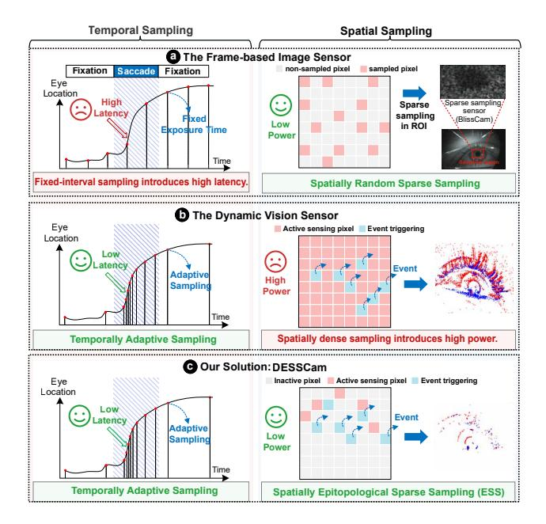

# I. INTRODUCTION

Eye tracking is rapidly emerging as a critical computational primitive in interactive applications like augmented/virtual reality (AR/VR). Fast and efficient eye tracking is crucial for enhancing the computational efficiency of head-mounted displays (HMDs) through foveated rendering [55], [61], [71], [118], [125]. The human eye moves rapidly during saccades, exhibiting speeds over 300 °/s [34]. Accurately capturing these movements necessitates a kilohertz frame rate to ensure smooth tracking and mitigate motion sickness in virtual environments [39], [116]. However, current eye trackers face high latency and power consumption bottlenecks [47], [83]. Commercial HMDs like HTC Vive Pro Eye and Tobii XR exhibit eye-tracking latency over 50 ms, which is enough to introduce visual artifacts [114]. Besides, these frame-based eye trackers consume over 2W, nearly half the power budget of a typical VR system [10], [11].

Many studies have been conducted to reduce the latency and power consumption [46], [61], [74], [83], [126]. However, most efforts focus on the hardware-friendly algorithms and dedicated accelerators, overlooking the image sensor which contributes up to 80% power [22] and 90% latency [23] in eye tracking systems. BlissCam [47] is the first in-sensor sparse sampling architecture for eye tracking. By reducing pixel volume by up to 95%, BlissCam achieves an 8.2× power reduction compared to existing eye tracking systems. However, BlissCam exhibits a high latency up to 9.4 ms, which does not meet the real-time AR/VR requirements [139]. As shown in Fig. 1(a), the high latency of BlissCam stems from the fixed-frame-rate sampling, which mismatches the temporally varying nature of eye movements [57], [142], resulting in an inherent latency-power tradeoff [83].

In order to reduce the latency caused by the image sensor, we adopt the dynamic vision sensors (DVS) paradigm and propose an event-driven in-sensor epitopological sparse sampling (ESS) architecture for the first time. DVS allows each pixel to independently and asynchronously measure the light intensity change at microsecond resolution [49], [69]. Only when the light intensity change exceeds a threshold will the pixel trigger an event. Therefore, as illustrated in Fig. 1(b), DVS naturally outputs an event rate adaptive to eye movement speed, achieving end-to-end latency as low as 0.1 ms during rapid saccades [17], [37], [58], thereby resolving the high-latency bottleneck of current frame-based eye tracking systems [83]. Although DVS enables low-latency eye tracking [49], its pixels are always-on to execute eventification, introducing significant power. Specifically, DVS pixels [48], [117] consume up to 10× higher power than frame-based image sensor pixels [24], [65] and dominate the power of DVS [2], [36]. To reduce the power consumption, we propose a pixel-wise ESS mechanism based on the spatially sparse characteristic of the eye-tracking task [47], [127], reducing the pixel power consumption by up to 5.26× over standard DVS pixels.

In this work, we propose DESSCam (Fig. 1(c)), a 3Dstacked event-driven architecture, which achieves both low latency through temporally dynamic sampling adaptive to eye movement speed and low power consumption by spatially pixel-wise ESS, trying to break the latency-power tradeoff in eye tracking. Our main contributions are:

Fig. 1. Comparing our DESSCam with the frame-based image sensor and dynamic vision sensor (DVS). The frame-based sensor adopts fixed-exposure-time sampling, which introduces high latency and results in motion blur during rapid saccades. In contrast, DVS generates a dynamic event rate that scales with the speed of eye movement, enabling low-latency eye tracking. However, DVS consumes more power than typical frame-based sensors due to its always-on pixel-wise sampling. To address these challenges, we propose DESSCam, which adopts temporally adaptive sampling and spatially sparse sampling to achieve both low latency and low power.

- An event-driven architecture with in-sensor ESS. We introduce a novel in-sensor ESS paradigm and present its hardware implementation within a 3D-stacked architecture. The ESS, co-designed with our ViT algorithm, achieves high tracking accuracy at up to 50× pixel downsampling, thus achieving a 2.7× reduction in system power consumption compared to the state-of-the-art (SOTA) eye-tracking system.
- A patch activation (PAC) mechanism. We put forward a PAC mechanism that reads only high-event-density pixel blocks. Through in-sensor token pruning, PAC reduces up to 61% host-side algorithmic computation. Co-designed with ESS, our eye tracking system realizes a 15.2× reduction in tracking latency compared to the SOTA system.
- A robust ViT algorithm. We design a lightweight and robust ViT algorithm that leverages global data correlations for gaze prediction. It achieves a 0.5° angular error with only 2% pixels being enabled. This highlights DESSCam's ability to maintain accuracy with low power and latency in eye tracking.

# I. INTRODUCTION

Eye tracking is rapidly emerging as a critical computational primitive in interactive applications like augmented/virtual reality (AR/VR). Fast and efficient eye tracking is crucial for enhancing the computational efficiency of head-mounted displays (HMDs) through foveated rendering [55], [61], [71], [118], [125]. The human eye moves rapidly during saccades, exhibiting speeds over 300 °/s [34]. Accurately capturing these movements necessitates a kilohertz frame rate to ensure smooth tracking and mitigate motion sickness in virtual environments [39], [116]. However, current eye trackers face high latency and power consumption bottlenecks [47], [83]. Commercial HMDs like HTC Vive Pro Eye and Tobii XR exhibit eye-tracking latency over 50 ms, which is enough to introduce visual artifacts [114]. Besides, these frame-based eye trackers consume over 2W, nearly half the power budget of a typical VR system [10], [11].

Many studies have been conducted to reduce the latency and power consumption [46], [61], [74], [83], [126]. However, most efforts focus on the hardware-friendly algorithms and dedicated accelerators, overlooking the image sensor which contributes up to 80% power [22] and 90% latency [23] in eye tracking systems. BlissCam [47] is the first in-sensor sparse sampling architecture for eye tracking. By reducing pixel volume by up to 95%, BlissCam achieves an 8.2× power reduction compared to existing eye tracking systems. However, BlissCam exhibits a high latency up to 9.4 ms, which does not meet the real-time AR/VR requirements [139]. As shown in Fig. 1(a), the high latency of BlissCam stems from the fixed-frame-rate sampling, which mismatches the temporally varying nature of eye movements [57], [142], resulting in an inherent latency-power tradeoff [83].

In order to reduce the latency caused by the image sensor, we adopt the dynamic vision sensors (DVS) paradigm and propose an event-driven in-sensor epitopological sparse sampling (ESS) architecture for the first time. DVS allows each pixel to independently and asynchronously measure the light intensity change at microsecond resolution [49], [69]. Only when the light intensity change exceeds a threshold will the pixel trigger an event. Therefore, as illustrated in Fig. 1(b), DVS naturally outputs an event rate adaptive to eye movement speed, achieving end-to-end latency as low as 0.1 ms during rapid saccades [17], [37], [58], thereby resolving the high-latency bottleneck of current frame-based eye tracking systems [83]. Although DVS enables low-latency eye tracking [49], its pixels are always-on to execute eventification, introducing significant power. Specifically, DVS pixels [48], [117] consume up to 10× higher power than frame-based image sensor pixels [24], [65] and dominate the power of DVS [2], [36]. To reduce the power consumption, we propose a pixel-wise ESS mechanism based on the spatially sparse characteristic of the eye-tracking task [47], [127], reducing the pixel power consumption by up to 5.26× over standard DVS pixels.

In this work, we propose DESSCam (Fig. 1(c)), a 3Dstacked event-driven architecture, which achieves both low latency through temporally dynamic sampling adaptive to eye movement speed and low power consumption by spatially pixel-wise ESS, trying to break the latency-power tradeoff in eye tracking. Our main contributions are:

Fig. 1. Comparing our DESSCam with the frame-based image sensor and dynamic vision sensor (DVS). The frame-based sensor adopts fixed-exposure-time sampling, which introduces high latency and results in motion blur during rapid saccades. In contrast, DVS generates a dynamic event rate that scales with the speed of eye movement, enabling low-latency eye tracking. However, DVS consumes more power than typical frame-based sensors due to its always-on pixel-wise sampling. To address these challenges, we propose DESSCam, which adopts temporally adaptive sampling and spatially sparse sampling to achieve both low latency and low power.

- An event-driven architecture with in-sensor ESS. We introduce a novel in-sensor ESS paradigm and present its hardware implementation within a 3D-stacked architecture. The ESS, co-designed with our ViT algorithm, achieves high tracking accuracy at up to 50× pixel downsampling, thus achieving a 2.7× reduction in system power consumption compared to the state-of-the-art (SOTA) eye-tracking system.
- A patch activation (PAC) mechanism. We put forward a PAC mechanism that reads only high-event-density pixel blocks. Through in-sensor token pruning, PAC reduces up to 61% host-side algorithmic computation. Co-designed with ESS, our eye tracking system realizes a 15.2× reduction in tracking latency compared to the SOTA system.
- A robust ViT algorithm. We design a lightweight and robust ViT algorithm that leverages global data correlations for gaze prediction. It achieves a 0.5° angular error with only 2% pixels being enabled. This highlights DESSCam's ability to maintain accuracy with low power and latency in eye tracking.

