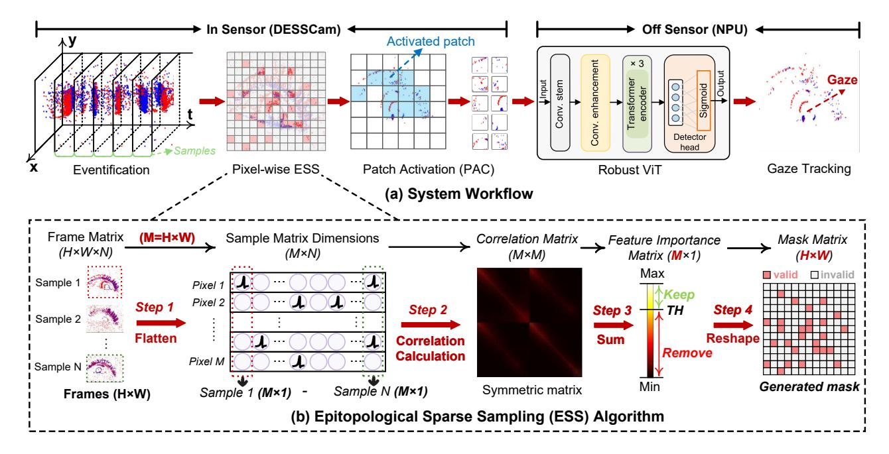

# III. EPITOPOLOGICAL SPARSE SAMPLING (ESS) EYE TRACKING

#### A. System Workflow

As illustrated in Fig. 4(a), the proposed eye tracking system workflow includes both in-sensor and off-sensor operations. Firstly, the ESS algorithm generates an offline-computed sampling mask and applies the mask to the pixels, enabling the eventification of the pixels located at the mask's valid coordinates. Then the sparse events are grouped into patches, and only when the accumulated event count exceeds a threshold will the patch be activated and read out. Finally, all the activated patches are processed by the off-sensor robust ViT for gaze tracking. With the ESS algorithm, the data movement and computational load are significantly reduced, enabling low-power and low-latency eye tracking.

#### B. ESS Algorithm

Inspired by the epitopological learning method [141], we propose ESS, which performs attention-guided  $50 \times$  pixel downsampling through a correlation matrix, as shown in Fig. 4(b). The correlation matrix is derived from the Pearson correlation coefficient  $\rho$ , as defined as follows [89]:

$$\rho_{X,Y} = \frac{\text{cov}(X,Y)}{\sigma_X \sigma_Y} = \frac{\sum_{i=1}^n (X_i - \bar{X})(Y_i - \bar{Y})}{\sqrt{\sum_{i=1}^n (X_i - \bar{X})^2} \sqrt{\sum_{i=1}^n (Y_i - \bar{Y})^2}}$$
(2)

where  $\rho_{X,Y}$  represents the correlation coefficient between two pixel values X and Y, cov(X,Y) is their covariance, and  $\sigma_X$ ,  $\sigma_Y$  are their standard deviations respectively. We obtain event frames by accumulating a fixed number of events in the training set to simulate the behavior of the pixel array. As illustrated in Fig. 4(b), all frame samples are organized into an  $H \times W \times N$  Frame Matrix. Firstly, each frame is flattened into an  $M \times 1$  vector, where  $M = H \times W$ . Then, these flattened frames are stacked column-wise to form an  $M \times N$  Sample Matrix, with each column representing an  $M \times 1$  frame sample and N denoting the total number of samples. Global correlation is computed on the Sample Matrix using the Pearson correlation formula, where each of the M features is correlated with the remaining M-1features, yielding an  $M \times M$  Correlation Matrix. Subsequently, we sum the rows of the Correlation Matrix and generate an  $M \times 1$  Feature Importance Matrix, where each element represents a pixel's correlation with others, which indicates the pixel's significance in eye-tracking tasks. After that, the Feature Importance Matrix is quantized using a predefined sparsity threshold (TH) to generate a binary Mask Matrix:

Fig. 4. (a) The proposed system workflow and the ESS algorithm. The workflow of our system includes eventification, pixel-wise ESS and PAC, which are processed in the DESSCam, and a robust ViT algorithm for gaze tracking, which is processed on the NPU. (b) The ESS algorithm generates a sampling mask that selectively enables pixels for eventification. Only pixels located at the mask's valid coordinates are sampled. By directly suppressing in-pixel event generation, the data movement and computational load of our system can be minimized, enabling low-power and low-latency eye tracking.

correlation values exceeding TH are set to 1, while those below TH are set to 0. The  $Mask\ Matrix$  is applied to the pixel array to execute ESS. Notably, the sparsity of this mask is able to be adjusted by changing TH, enabling flexible pixel downsampling rates and a hardware-friendly implementation.

The generated *Mask Matrix* is applied to each pixel to enable in-sensor ESS, which effectively mitigates background activity noise and hot pixel effects [84], [96]. Compared with existing denoising [35], [45], [54] or ROI segmentation methods [119], [138], which require tens of millions of additional multiply-accumulate operations (MACs) per inference to reduce the noise, our ESS method performs sparse sampling directly within pixels using an offline-computed sampling mask, imposing minimal control overhead and eliminating the need for preprocessing.

Following ESS, the PAC mechanism realizes token pruning by forwarding only the patches containing sufficient event counts to the ViT algorithm on the NPU, thereby mitigating redundant token outputs and computations from spatially isolated events [129] without sacrificing accuracy [60], [98]. To obtain high robustness under sparse data, we design a robust ViT that enhances local textures and extracts global correlations, which is discussed in detail in Sec. III-C.

#### C. Robust ViT Algorithm

As shown in Fig. 4(a), our ViT algorithm includes a conv stem module, a conv enhancement module, three transformer encoders, and a detector head. The conv stem module

comprises two early convolutional layers using a depthwise-separable convolution [32], producing a 128-dimensional representation with local inductive bias. The conv enhancement module replaces the positional embedding layer in standard ViT [40] with two 3×3 convolutional layers, enabling crosspatch interaction before forming the token sequence, thereby enhancing local spatial information [81]. The output feature maps are then flattened and processed by a transformer encoder consisting of three transformer blocks, each containing a multi-head self-attention module (8 heads, 128 dimensions). The output of transformer encoders is average-pooled and passed through a detector head including two fully-connected layers combined with a sigmoid activation function.

Our algorithm is designed to efficiently and accurately process the highly sparse data. As standard ViT applies non-overlapping tokenization which leads to loss of neighborhood information and isolated patch representations [29], we integrate CNN layers prior to the transformer encoders, enhancing local structural features and introducing inductive bias that helps recover contextual information across sparsely sampled regions [91]. Notably, most of our algorithm's computational workload resides in these early convolutional layers rather than the transformer blocks, because the convolutional layers operate at full image resolution and generate sparse tokens by applying the same ESS mask to their output feature maps. The transformer encoders then capture long-range dependencies and global correlations across the sequence using the local-feature-enhanced tokens with significantly reduced

Fig. 5. High-level architecture of our eye-tracking system. The proposed stacked sensor architecture consists of a pixel array at the top, a logic layer, and an output buffer at the bottom. The data is transmitted to the host NPU through an interface.

computation. By introducing the early convolutional layers to augment the local structural information [78], [134], our ViT algorithm is lightweight and robust against sparse inputs. This hybrid CNN-Transformer architecture reduces distortion caused by sparse sampling and maintains accuracy even with 50× downsampling.

#### IV. SYSTEM ARCHITECTURE

#### *A. Sensor Architecture*

Our work employs a stacked image sensor architecture, which is gaining increasing popularity [56], [109], [135]. As shown in Fig. 5, the high-level architecture of our eye-tracking system consists of a 3D stacked image sensor (DESSCam) and a host NPU. The image sensor includes a pixel array layer and a logic layer, which are connected via hybrid bonding. The pixel array detects the changes in light intensity, and the logic layer samples the signals from the pixel array and generates events. The events are transferred to an output buffer and then transmitted to the host NPU through the Mobile Industry Processor Interface Camera Serial Interface 2 (MIPI CSI-2) [5] using an address-event representation (AER) encoding protocol, which is suitable for asynchronous, event-driven sparse data readout [2], [18] and is widely adopted in DVS designs [67], [69], [93]. The AER data bus only consumes dynamic power when an event is actively transmitted via handshaking, supporting highly sparse output with low power [140]. Table I details the contents of the AER data packets transmitted over the MIPI interface to the host processor. Each packet contains the patch coordinates (addrX and addrY), the 32-bit timestamp of the activated patch, and the 512-bit event polarity data for the 16 × 16 pixels in the activated patch. Specifically, assuming the sensor resolution is 346 × 260, the array is partitioned into 22 horizontal and 17 vertical patches, thereby requiring 5 bits each for addrX and addrY. By stacking the analog front-end (pixel array) with sampling and readout logic (logic layer), DESSCam achieves low-latency local event processing while enhancing area efficiency.

Fig. 6. The event-driven sensor architecture supporting in-sensor sparse sampling. Every N×N pixels are grouped into a patch, where the PAC circuit detects the event count. The PAC circuits form an array and communicate with peripheral circuits via handshake signals (ReqX, AckX, ReqY, and AckY in Fig. 6). Only when the event count in a patch exceeds a threshold will the PAC circuit generate handshake signals and activate the patch to be read out. The events in the activated patch are then transmitted to the ping-pong row sampling buffer, the output FIFO and the interface.

TABLE I BREAKDOWN OF AER DATA PACKET CONTENTS

| addrX  | addrY  | events                      | timestamp |
|--------|--------|-----------------------------|-----------|
| 5 bits | 5 bits | 512 bits (16 × 16 × 2 bits) | 32 bits   |

As depicted in Fig. 6, our event-driven sensor architecture groups N×N pixels into a patch, each monitored by a PAC circuit. A patch is read out only when its accumulated event count exceeds a configured threshold. This event-driven characteristic is governed by asynchronous handshaking signals rather than a global clock [97]. Only when there are triggered events will the eye tracking system start working, and only when the event count in a patch exceeds a threshold will the PAC circuit generate handshake signals and activate the patch to be read out. Therefore, DESSCam can adapt to eye movements for low-latency tracking during saccades and low-power tracking during fixation. The readout process is pipelined via a ping-pong row buffer, where one buffer reads new patch data and the other transmits buffered data, thus enhancing throughput. The timing procedure begins with writing a sparse sampling mask to enable specific pixels. Upon activation, a patch generates ReqX and ReqY signals. Then, the patch data is read out via the SRAM peripheral circuit. Once the host receives sufficient patches, it executes gaze estimation and samples the next frame. By employing a patch-level handshake instead of the pixel-level handshake in a standard DVS [18], [26], [93], our architecture avoids the complex arbitration logic, thereby achieving lower readout latency. Furthermore, our in-sensor PAC circuits perform token sparsity computation within the pixel array, efficiently alleviating the computational load on the off-sensor ViT algorithm [129].

# III. EPITOPOLOGICAL SPARSE SAMPLING (ESS) EYE TRACKING

#### A. System Workflow

As illustrated in Fig. 4(a), the proposed eye tracking system workflow includes both in-sensor and off-sensor operations. Firstly, the ESS algorithm generates an offline-computed sampling mask and applies the mask to the pixels, enabling the eventification of the pixels located at the mask's valid coordinates. Then the sparse events are grouped into patches, and only when the accumulated event count exceeds a threshold will the patch be activated and read out. Finally, all the activated patches are processed by the off-sensor robust ViT for gaze tracking. With the ESS algorithm, the data movement and computational load are significantly reduced, enabling low-power and low-latency eye tracking.

#### B. ESS Algorithm

Inspired by the epitopological learning method [141], we propose ESS, which performs attention-guided  $50 \times$  pixel downsampling through a correlation matrix, as shown in Fig. 4(b). The correlation matrix is derived from the Pearson correlation coefficient  $\rho$ , as defined as follows [89]:

$$\rho_{X,Y} = \frac{\text{cov}(X,Y)}{\sigma_X \sigma_Y} = \frac{\sum_{i=1}^n (X_i - \bar{X})(Y_i - \bar{Y})}{\sqrt{\sum_{i=1}^n (X_i - \bar{X})^2} \sqrt{\sum_{i=1}^n (Y_i - \bar{Y})^2}}$$
(2)

where  $\rho_{X,Y}$  represents the correlation coefficient between two pixel values X and Y, cov(X,Y) is their covariance, and  $\sigma_X$ ,  $\sigma_Y$  are their standard deviations respectively. We obtain event frames by accumulating a fixed number of events in the training set to simulate the behavior of the pixel array. As illustrated in Fig. 4(b), all frame samples are organized into an  $H \times W \times N$  Frame Matrix. Firstly, each frame is flattened into an  $M \times 1$  vector, where  $M = H \times W$ . Then, these flattened frames are stacked column-wise to form an  $M \times N$  Sample Matrix, with each column representing an  $M \times 1$  frame sample and N denoting the total number of samples. Global correlation is computed on the Sample Matrix using the Pearson correlation formula, where each of the M features is correlated with the remaining M-1features, yielding an  $M \times M$  Correlation Matrix. Subsequently, we sum the rows of the Correlation Matrix and generate an  $M \times 1$  Feature Importance Matrix, where each element represents a pixel's correlation with others, which indicates the pixel's significance in eye-tracking tasks. After that, the Feature Importance Matrix is quantized using a predefined sparsity threshold (TH) to generate a binary Mask Matrix:

Fig. 4. (a) The proposed system workflow and the ESS algorithm. The workflow of our system includes eventification, pixel-wise ESS and PAC, which are processed in the DESSCam, and a robust ViT algorithm for gaze tracking, which is processed on the NPU. (b) The ESS algorithm generates a sampling mask that selectively enables pixels for eventification. Only pixels located at the mask's valid coordinates are sampled. By directly suppressing in-pixel event generation, the data movement and computational load of our system can be minimized, enabling low-power and low-latency eye tracking.

correlation values exceeding TH are set to 1, while those below TH are set to 0. The  $Mask\ Matrix$  is applied to the pixel array to execute ESS. Notably, the sparsity of this mask is able to be adjusted by changing TH, enabling flexible pixel downsampling rates and a hardware-friendly implementation.

The generated *Mask Matrix* is applied to each pixel to enable in-sensor ESS, which effectively mitigates background activity noise and hot pixel effects [84], [96]. Compared with existing denoising [35], [45], [54] or ROI segmentation methods [119], [138], which require tens of millions of additional multiply-accumulate operations (MACs) per inference to reduce the noise, our ESS method performs sparse sampling directly within pixels using an offline-computed sampling mask, imposing minimal control overhead and eliminating the need for preprocessing.

Following ESS, the PAC mechanism realizes token pruning by forwarding only the patches containing sufficient event counts to the ViT algorithm on the NPU, thereby mitigating redundant token outputs and computations from spatially isolated events [129] without sacrificing accuracy [60], [98]. To obtain high robustness under sparse data, we design a robust ViT that enhances local textures and extracts global correlations, which is discussed in detail in Sec. III-C.

#### C. Robust ViT Algorithm

As shown in Fig. 4(a), our ViT algorithm includes a conv stem module, a conv enhancement module, three transformer encoders, and a detector head. The conv stem module

comprises two early convolutional layers using a depthwise-separable convolution [32], producing a 128-dimensional representation with local inductive bias. The conv enhancement module replaces the positional embedding layer in standard ViT [40] with two 3×3 convolutional layers, enabling crosspatch interaction before forming the token sequence, thereby enhancing local spatial information [81]. The output feature maps are then flattened and processed by a transformer encoder consisting of three transformer blocks, each containing a multi-head self-attention module (8 heads, 128 dimensions). The output of transformer encoders is average-pooled and passed through a detector head including two fully-connected layers combined with a sigmoid activation function.

Our algorithm is designed to efficiently and accurately process the highly sparse data. As standard ViT applies non-overlapping tokenization which leads to loss of neighborhood information and isolated patch representations [29], we integrate CNN layers prior to the transformer encoders, enhancing local structural features and introducing inductive bias that helps recover contextual information across sparsely sampled regions [91]. Notably, most of our algorithm's computational workload resides in these early convolutional layers rather than the transformer blocks, because the convolutional layers operate at full image resolution and generate sparse tokens by applying the same ESS mask to their output feature maps. The transformer encoders then capture long-range dependencies and global correlations across the sequence using the local-feature-enhanced tokens with significantly reduced

Fig. 5. High-level architecture of our eye-tracking system. The proposed stacked sensor architecture consists of a pixel array at the top, a logic layer, and an output buffer at the bottom. The data is transmitted to the host NPU through an interface.

computation. By introducing the early convolutional layers to augment the local structural information [78], [134], our ViT algorithm is lightweight and robust against sparse inputs. This hybrid CNN-Transformer architecture reduces distortion caused by sparse sampling and maintains accuracy even with 50× downsampling.

#### IV. SYSTEM ARCHITECTURE

#### *A. Sensor Architecture*

Our work employs a stacked image sensor architecture, which is gaining increasing popularity [56], [109], [135]. As shown in Fig. 5, the high-level architecture of our eye-tracking system consists of a 3D stacked image sensor (DESSCam) and a host NPU. The image sensor includes a pixel array layer and a logic layer, which are connected via hybrid bonding. The pixel array detects the changes in light intensity, and the logic layer samples the signals from the pixel array and generates events. The events are transferred to an output buffer and then transmitted to the host NPU through the Mobile Industry Processor Interface Camera Serial Interface 2 (MIPI CSI-2) [5] using an address-event representation (AER) encoding protocol, which is suitable for asynchronous, event-driven sparse data readout [2], [18] and is widely adopted in DVS designs [67], [69], [93]. The AER data bus only consumes dynamic power when an event is actively transmitted via handshaking, supporting highly sparse output with low power [140]. Table I details the contents of the AER data packets transmitted over the MIPI interface to the host processor. Each packet contains the patch coordinates (addrX and addrY), the 32-bit timestamp of the activated patch, and the 512-bit event polarity data for the 16 × 16 pixels in the activated patch. Specifically, assuming the sensor resolution is 346 × 260, the array is partitioned into 22 horizontal and 17 vertical patches, thereby requiring 5 bits each for addrX and addrY. By stacking the analog front-end (pixel array) with sampling and readout logic (logic layer), DESSCam achieves low-latency local event processing while enhancing area efficiency.

Fig. 6. The event-driven sensor architecture supporting in-sensor sparse sampling. Every N×N pixels are grouped into a patch, where the PAC circuit detects the event count. The PAC circuits form an array and communicate with peripheral circuits via handshake signals (ReqX, AckX, ReqY, and AckY in Fig. 6). Only when the event count in a patch exceeds a threshold will the PAC circuit generate handshake signals and activate the patch to be read out. The events in the activated patch are then transmitted to the ping-pong row sampling buffer, the output FIFO and the interface.

TABLE I BREAKDOWN OF AER DATA PACKET CONTENTS

| addrX  | addrY  | events                      | timestamp |
|--------|--------|-----------------------------|-----------|
| 5 bits | 5 bits | 512 bits (16 × 16 × 2 bits) | 32 bits   |

As depicted in Fig. 6, our event-driven sensor architecture groups N×N pixels into a patch, each monitored by a PAC circuit. A patch is read out only when its accumulated event count exceeds a configured threshold. This event-driven characteristic is governed by asynchronous handshaking signals rather than a global clock [97]. Only when there are triggered events will the eye tracking system start working, and only when the event count in a patch exceeds a threshold will the PAC circuit generate handshake signals and activate the patch to be read out. Therefore, DESSCam can adapt to eye movements for low-latency tracking during saccades and low-power tracking during fixation. The readout process is pipelined via a ping-pong row buffer, where one buffer reads new patch data and the other transmits buffered data, thus enhancing throughput. The timing procedure begins with writing a sparse sampling mask to enable specific pixels. Upon activation, a patch generates ReqX and ReqY signals. Then, the patch data is read out via the SRAM peripheral circuit. Once the host receives sufficient patches, it executes gaze estimation and samples the next frame. By employing a patch-level handshake instead of the pixel-level handshake in a standard DVS [18], [26], [93], our architecture avoids the complex arbitration logic, thereby achieving lower readout latency. Furthermore, our in-sensor PAC circuits perform token sparsity computation within the pixel array, efficiently alleviating the computational load on the off-sensor ViT algorithm [129].

