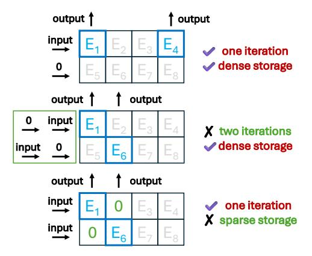

# III. MOTIVATION

## *A. Challenge of deploying MoE models on edge*

Storage requirement In MoE models, the model size is typically 3.7∼7.5× larger than the activated model size, potentially reaching 13.5∼46.4 GB, as shown in Fig. 3(a). Thus, supporting a modern MoE model on an edge device requires using SSD to store all experts, as its memory density can reach 20.27∼29.18 Gb/mm2 and capacity of 1 Tb [23]– [25], [56], which are significantly higher than other memory devices. Additionally, the non-volatile nature of NAND Flash ensures persistent storage of model parameters, making it ideal for edge AI applications. In contrast, although alternative NVM-based IMC platforms such as RRAM can also be used for Transformer acceleration, they are typically constrained to Mb capacity due to limitation in integration density and scale.

Memory footprint Another challenge of deploying MoE models on classical edge devices is the unavoidable frequent data transfers between SSD and the NPU. The reason is that during MoE inference, experts are selected dynamically based on the previous layer, and the NPU DRAM cannot store all the Experts prior to prediction. As shown in Fig. 3(b), using the mobile NPU Apple A18 Neural Engine with LPDDR5X and NVMe 2.0 protocol [20], [39] as an example, the load latency for a single expert within one layer from DRAM to NPU is 1.55∼3.84× larger than the computation latency for a single token decoding, while the transfer latency from SSD to DRAM is another 15× larger. Therefore, an MoEoriented workflow design is needed to avoid the frequent data transmission between NAND Flash and DRAM.

## *B. Challenge of near-NAND and in-NAND computing*

Limitation of NAND device. Firstly, due to the endurance limitations of NAND Flash (approximately 103 programming times [38]), the simple architecture based on near-NAND or in-NAND computing along with some auxiliary compute circuits cannot support all operations during the MoE decoding phase, such as self-attention computations, which require dynamic storage of the KV cache. Considering the required KV cache size can reach 128∼224 MB as shown in Fig.3(c), an additional DRAM-based NPU is necessary to create a more versatile hardware system.

Limitation of near-NAND computing. Recently, near-NAND computing [54], [74] has gained attention due to its easier integration with existing SSD devices. However, the primary challenge in applying near-NAND computing to LLM-based applications is its limited computational capacity. Usually, near-NAND computing offers only about a mere 1.6 GOPS [74] (or 38 GOPS [54]) computing capacity per NAND Die. In comparison, decoding a single token on a Mixtral-8x7B model requires 100∼300 GOPS of linear operations (excluding dynamic self-attention and non-linear operations), while edge applications demand a decoding throughput of 4∼12 tokens per second [5], [13], [68]. Therefore, for LLMbased applications, the near-NAND solution lacks sufficient computational capacity and still relies on the NPU to handle the majority of computations to meet decoding throughput requirements.

Challenge of in-NAND computing. In contrast, in-NAND computing offers more promising computational capacity, providing 279∼1118 GOPS per NAND die with typically 8∼16 dies per SSD device. However, as illustrated in Sec. II-B, in-NAND computing strategy often fixes the computation pattern of vector-matrix multiplication (i.e. a 2048 × 16384 tensor at a time), especially when accommodating various matrix shapes in MoE models as shown in Fig.3(d). Thus, a more adaptable in-NAND computing strategy is needed to address this mismatch. Deploying MoE models on SSDs may further degrade the utilization of in-NAND computing. As the example shown in Fig.4, if experts E1 and E4 are selected, the upper deployment strategy completes in-NAND computing in single iteration. However, the middle deployment strategy requires two iterations otherwise unselected experts (E2 and E5) are activated to cause wrong output results. Although

Fig. 3: Analysis of MoE models during inference: (a) parameter size of actual and activated MoE models; (b) latency of one block computing and one expert loading on modern smartphone NPU; (c) KV cache size under 2048 tokens; (d) weight configurations of different operations.

Fig. 4: Illustration of different MoE mapping strategies that affect in-NAND computing and storage efficiency.

the bottom deployment strategy can complete computing in single iteration, it accommodates fewer experts within the same storage space because of the redundant 0 storage. Thus, an MoE-aware expert deployment and selection method is needed to improve the effectiveness of in-NAND computing.

# III. MOTIVATION

## *A. Challenge of deploying MoE models on edge*

Storage requirement In MoE models, the model size is typically 3.7∼7.5× larger than the activated model size, potentially reaching 13.5∼46.4 GB, as shown in Fig. 3(a). Thus, supporting a modern MoE model on an edge device requires using SSD to store all experts, as its memory density can reach 20.27∼29.18 Gb/mm2 and capacity of 1 Tb [23]– [25], [56], which are significantly higher than other memory devices. Additionally, the non-volatile nature of NAND Flash ensures persistent storage of model parameters, making it ideal for edge AI applications. In contrast, although alternative NVM-based IMC platforms such as RRAM can also be used for Transformer acceleration, they are typically constrained to Mb capacity due to limitation in integration density and scale.

Memory footprint Another challenge of deploying MoE models on classical edge devices is the unavoidable frequent data transfers between SSD and the NPU. The reason is that during MoE inference, experts are selected dynamically based on the previous layer, and the NPU DRAM cannot store all the Experts prior to prediction. As shown in Fig. 3(b), using the mobile NPU Apple A18 Neural Engine with LPDDR5X and NVMe 2.0 protocol [20], [39] as an example, the load latency for a single expert within one layer from DRAM to NPU is 1.55∼3.84× larger than the computation latency for a single token decoding, while the transfer latency from SSD to DRAM is another 15× larger. Therefore, an MoEoriented workflow design is needed to avoid the frequent data transmission between NAND Flash and DRAM.

## *B. Challenge of near-NAND and in-NAND computing*

Limitation of NAND device. Firstly, due to the endurance limitations of NAND Flash (approximately 103 programming times [38]), the simple architecture based on near-NAND or in-NAND computing along with some auxiliary compute circuits cannot support all operations during the MoE decoding phase, such as self-attention computations, which require dynamic storage of the KV cache. Considering the required KV cache size can reach 128∼224 MB as shown in Fig.3(c), an additional DRAM-based NPU is necessary to create a more versatile hardware system.

Limitation of near-NAND computing. Recently, near-NAND computing [54], [74] has gained attention due to its easier integration with existing SSD devices. However, the primary challenge in applying near-NAND computing to LLM-based applications is its limited computational capacity. Usually, near-NAND computing offers only about a mere 1.6 GOPS [74] (or 38 GOPS [54]) computing capacity per NAND Die. In comparison, decoding a single token on a Mixtral-8x7B model requires 100∼300 GOPS of linear operations (excluding dynamic self-attention and non-linear operations), while edge applications demand a decoding throughput of 4∼12 tokens per second [5], [13], [68]. Therefore, for LLMbased applications, the near-NAND solution lacks sufficient computational capacity and still relies on the NPU to handle the majority of computations to meet decoding throughput requirements.

Challenge of in-NAND computing. In contrast, in-NAND computing offers more promising computational capacity, providing 279∼1118 GOPS per NAND die with typically 8∼16 dies per SSD device. However, as illustrated in Sec. II-B, in-NAND computing strategy often fixes the computation pattern of vector-matrix multiplication (i.e. a 2048 × 16384 tensor at a time), especially when accommodating various matrix shapes in MoE models as shown in Fig.3(d). Thus, a more adaptable in-NAND computing strategy is needed to address this mismatch. Deploying MoE models on SSDs may further degrade the utilization of in-NAND computing. As the example shown in Fig.4, if experts E1 and E4 are selected, the upper deployment strategy completes in-NAND computing in single iteration. However, the middle deployment strategy requires two iterations otherwise unselected experts (E2 and E5) are activated to cause wrong output results. Although

Fig. 3: Analysis of MoE models during inference: (a) parameter size of actual and activated MoE models; (b) latency of one block computing and one expert loading on modern smartphone NPU; (c) KV cache size under 2048 tokens; (d) weight configurations of different operations.

Fig. 4: Illustration of different MoE mapping strategies that affect in-NAND computing and storage efficiency.

the bottom deployment strategy can complete computing in single iteration, it accommodates fewer experts within the same storage space because of the redundant 0 storage. Thus, an MoE-aware expert deployment and selection method is needed to improve the effectiveness of in-NAND computing.

