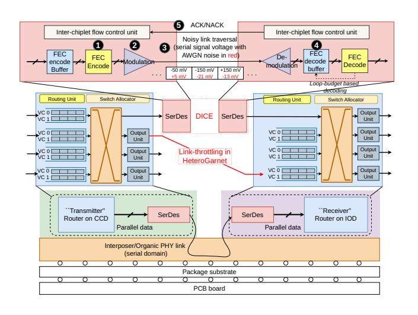

# B. Inter-chiplet packet transmission.

Conventional simulators approximate inter-chiplet communication with limited fidelity (Section II). For example, gem5 HeteroGarnet [12] emulates SerDes by throttling bandwidth between inter-chiplet routers (Figure 4—HeteroGarnet) rather than modeling the PHY. To capture actuate cross-die packet transmission, DICE models the full inter-chiplet transmission stack (Figure 4—DICE), including **①** FEC encoding,

Fig. 4: Detailed end-to-end inter-chiplet communication modeling in DICE, capturing FEC en-/de-coding, modulation/de-modulation, noise injection, and inter-chiplet flow control.

**2** modulation, **3** noisy link traversal, **4** demodulation, and FEC-decoding—with **5** integrated inter-chiplet flow control to manage backpressure and retransmissions. Next, we detail each of the components.

# B. Inter-chiplet packet transmission.

Conventional simulators approximate inter-chiplet communication with limited fidelity (Section II). For example, gem5 HeteroGarnet [12] emulates SerDes by throttling bandwidth between inter-chiplet routers (Figure 4—HeteroGarnet) rather than modeling the PHY. To capture actuate cross-die packet transmission, DICE models the full inter-chiplet transmission stack (Figure 4—DICE), including **①** FEC encoding,

Fig. 4: Detailed end-to-end inter-chiplet communication modeling in DICE, capturing FEC en-/de-coding, modulation/de-modulation, noise injection, and inter-chiplet flow control.

**2** modulation, **3** noisy link traversal, **4** demodulation, and FEC-decoding—with **5** integrated inter-chiplet flow control to manage backpressure and retransmissions. Next, we detail each of the components.

