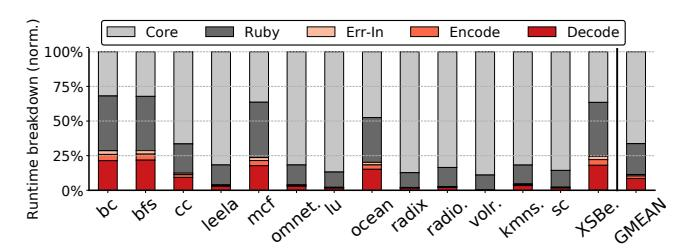

# C. DICE gem5 runtime overhead

To better understand the runtime overhead of DICE, we profile gem5 using Linux perf\_event following a methodology presented at the gem5 Workshop at ISCA'25 [65]. Profiling runs in a separate process and is non-intrusive, ensuring that it does not perturb gem5's execution time.

Figure 21 presents the normalized gem5 runtime breakdown at 35 dB SNRbase, showing the percentage of execution time spent in the Out-of-Order Core and Memory (Ruby)—which together correspond to the runtime of HG—as well as the additional DICE components, including error injection (Err-In), FEC encoding (Encode), and FEC decoding (Decode). Across all benchmarks, DICE introduces limited overhead (0.3-26.1%, averaging 9.2%), depending on the application and the amount of inter-chiplet traffic, demonstrating an effective balance between detailed inter-chiplet PHY-link modeling and simulation efficiency.

We further observe that the majority of overhead in DICE is attributed to the layered Min-Sum FEC decoding (Section III-G), which computes iteration-based signal confidence. While this is necessary to reflect hardware-level decoding dynamics, *memoization* can be employed, as a future optimization, to cache previously seen symbol patterns and bypass redundant iterative LLR computations, thus significantly reducing FEC decoding overhead.

Fig. 21: gem5 runtime breakdown, where Core+Ruby corresponds to HeteroGarnet, and the additional overhead introduced by DICE is highlighted in shades of red.

# C. DICE gem5 runtime overhead

To better understand the runtime overhead of DICE, we profile gem5 using Linux perf\_event following a methodology presented at the gem5 Workshop at ISCA'25 [65]. Profiling runs in a separate process and is non-intrusive, ensuring that it does not perturb gem5's execution time.

Figure 21 presents the normalized gem5 runtime breakdown at 35 dB SNRbase, showing the percentage of execution time spent in the Out-of-Order Core and Memory (Ruby)—which together correspond to the runtime of HG—as well as the additional DICE components, including error injection (Err-In), FEC encoding (Encode), and FEC decoding (Decode). Across all benchmarks, DICE introduces limited overhead (0.3-26.1%, averaging 9.2%), depending on the application and the amount of inter-chiplet traffic, demonstrating an effective balance between detailed inter-chiplet PHY-link modeling and simulation efficiency.

We further observe that the majority of overhead in DICE is attributed to the layered Min-Sum FEC decoding (Section III-G), which computes iteration-based signal confidence. While this is necessary to reflect hardware-level decoding dynamics, *memoization* can be employed, as a future optimization, to cache previously seen symbol patterns and bypass redundant iterative LLR computations, thus significantly reducing FEC decoding overhead.

Fig. 21: gem5 runtime breakdown, where Core+Ruby corresponds to HeteroGarnet, and the additional overhead introduced by DICE is highlighted in shades of red.

