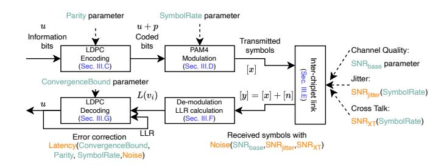

# I. Introduction

Background. As multiprocessors grow larger, keeping them monolithic has become increasingly hard. Power and thermal ceilings [\[1\]](#page-13-0), manufacturing-yield at large die sizes [\[2\]](#page-13-1), and the rising cost of testing [\[3\]](#page-13-2) all hinder further scaling. These pressures motivate chiplet designs as a costefficient alternative [\[3\]](#page-13-2), where a large monolithic die is partitioned into smaller chiplets [\(Figure 1\)](#page-0-0)—for example,

Fig. 1: An example chiplet architecture, where inter-chiplet communications are done via PHY connects.

Fig. 2: End-to-end inter-chiplet data communication in DICE. Parameters in green, computed metrics in orange.

Core Complex Dies (CCDs), which host compute cores and caches, and an I/O Die (IOD), which manages communication with off-chip DRAM and I/O devices. For communication, chiplets are interconnected via high-density physical-layer (PHY) links in an interposer [\[4\]](#page-13-3), [\[5\]](#page-13-4), or emerging packaging technology such as TSMC's Integrated Fan-Out on Substrate (InFO-oS), and transfer data using protocols such as AMD's Infinity Fabric [\[6\]](#page-13-5), Intel's Advanced Interface Bus (AIB) [\[7\]](#page-13-6), and the open standard Universal Chiplet Interconnect Express (UCIe) [\[8\]](#page-13-7), etc. As bandwidths rise and wiring densities increase, these short-reach links are pushed closer to their signal-integrity limits, making them more vulnerable to noise, crosstalk, and channel loss. Consequently, future inter-chiplet links are also considering the integration of forward error correction (FEC) to maintain reliable data transmission [\[9\]](#page-13-8)–[\[11\]](#page-13-9).

(b) Normalized per-application IPC comparison.

Fig. 3: Impact of PHY-realistic modeling in DICE on overall packet latency and system IPC.

The problems. Despite the wide adoption of chipletbased design, most architectural simulators still "wire up" chiplets using interconnect models originally developed for monolithic dies, resulting in two problems. First, these models typically assume fixed link latencies, abstracting away the details of the inter-chiplet PHY, where parallel bits are serialized and modulated into serial signals, transmitted as waveforms, and recovered over noise-prone channels. Second, PHY modeling is inherently *dynamic*: parity bits, symbol rate, and channel signal-to-noise ratio (SNR) jointly determine bit reliability, decoder convergence, error-correction latency, etc (as illustrated in Figure 2). Tuning any one parameter perturbs the others, forming a tightly coupled loop that fixeddelay abstractions cannot faithfully capture or calibrate easily. Consequently, fixed-latency links often yielding coarse and sometimes off-trend-simulation conclusions.

DICE addresses these limitations by modeling the complete inter-chiplet PHY pipeline. Guided by open-standard specifications such as the IEEE Heterogeneous Integration Roadmap [10], DICE incorporates LDPC encoding (Section III-C), PAM4 modulation (Section III-D), lossy-channel transmission (Section III-E), LLR-based demodulation (Section III-F), and LDPC decoding (Section III-G). By simulating these interactions at runtime (Section III-H), DICE captures the physical-layer effects that significantly influence architecture-level simulations.

Brief comparison of fixed-latency links and DICE. As shown in Figure 3, we evaluate three cases: 1) a monolithic architecture with 32 cores connected via a 4×8 mesh, denoted Mono; 2) a chiplet architecture corresponding to Figure 1, where inter-chiplet links are modeled using HeteroGarnet [12] with fixed-latency, throttled channels, denoted HG; and 3) our PHY-enabled chiplet architecture, DICE. More details on simulation are in Section IV-A. From these figures, we draw 3 key observations.

First, DICE fundamentally changes the packet latency breakdown compared to both Mono and HG, where average packet latency is largely dominated by network-interface (NI) queuing and network link traversal (Network). In HG, the system is *logically* chiplet-based, however, the latency profile mirrors Mono because detailed link and inter-chiplet PHY behaviors are not modeled. In contrast, in DICE, a substantial fraction of end-to-end packet latency shifts to the chiplet PHY boundary, where it is spent on forward error correction (FEC) encoding, serialization/deserialization and modulation (SerDes), and FEC decoding and error correction (EC).

*Second,* at the application level, we find that the IPC difference between HG and DICE is *inconsistent* across workloads: HG is sometimes optimistic and sometimes pessimistic, without a systematic bias that could be corrected by adjusting the throttling parameters (Section IV-D).

Third, for the collection of benchmarks that we chose as representative for this study (without prior knowledge of the results), HG gives a geomean IPC that is practically indistinguishable from that of the monolithic baseline (Mono), whereas DICE yields a clear performance gap. This mismatch underscores that fixed-latency chiplet abstractions can mask critical PHY-induced costs and lead architects to misleading conclusions about chiplet-based systems (Section IV-D).

**Key Contributions.** We present DICE, a gem5 [13] module for in-simulation, end-to-end PHY modeling. Following the IEEE Heterogeneous Integration Roadmap [10], DICE models the major components of PHY-links, including:

- Channel noise. Inter-chiplet links are error-prone. We model inter-die links as additive white Gaussian noise (AWGN [14]) channels and fold clock jitter, inter-wire crosstalk, and channel operating conditions into the effective signal-to-noise ratio (SNR).
- FEC encoding/decoding. We implement quasi-cyclic low-density parity-check (QC-LDPC [15]) forward error correction (FEC), a hardware-efficient scheme widely adopted in high-speed interconnects [16], [17]. DICE models both the QC-LDPC encoder and decoder. Further, because QC-LDPC decoding is NP-hard [18], decoders operate iteratively: they attempt to converge within a bounded iteration budget and, upon failure, trigger packet retransmission. This iterative behavior introduces inherent run-to-run latency variability. To reflect this accurately, DICE calibrates decoder iteration budgets and per-iteration timing through hardware synthesis, yielding good latency models.
- Serialization/Deserialization (SerDes) and signal modulation.
   After FEC encoding, die-edge SerDes performs parallel-toserial (P2S) conversion, transmitting parallel digits as high-speed serial waveforms. DICE models PAM-4 modulation—widely used in SerDes [10]—with waveform voltages and related parameters calibrated to public datasheets (Table III). At the receiver, PAM-4 demodulation reconstructs the digital bitstream, which then undergoes S2P conversion, and passed to the FEC decoder for error correction.
- Router microarchitecture and inter-chiplet flow control. We

extend the router microarchitecture at the PHY boundary by integrating a dedicated PHY-level flow-control mechanism that combines FEC, modulation, and inter-chiplet retransmission support. This allows us to capture PHY serialization effects and FEC-induced backpressure in the end-to-end packet timing.

We compare DICE against a actual AMD EPYC 9454P multicore processor by measuring core-to-core latency (Section IV-B1). We find that DICE is closer to the measured C2C latencies of the actual 9454P than HeteroGarnet, providing a more faithful model of the underlying chiplet architecture.

# I. Introduction

Background. As multiprocessors grow larger, keeping them monolithic has become increasingly hard. Power and thermal ceilings [\[1\]](#page-13-0), manufacturing-yield at large die sizes [\[2\]](#page-13-1), and the rising cost of testing [\[3\]](#page-13-2) all hinder further scaling. These pressures motivate chiplet designs as a costefficient alternative [\[3\]](#page-13-2), where a large monolithic die is partitioned into smaller chiplets [\(Figure 1\)](#page-0-0)—for example,

Fig. 1: An example chiplet architecture, where inter-chiplet communications are done via PHY connects.

Fig. 2: End-to-end inter-chiplet data communication in DICE. Parameters in green, computed metrics in orange.

Core Complex Dies (CCDs), which host compute cores and caches, and an I/O Die (IOD), which manages communication with off-chip DRAM and I/O devices. For communication, chiplets are interconnected via high-density physical-layer (PHY) links in an interposer [\[4\]](#page-13-3), [\[5\]](#page-13-4), or emerging packaging technology such as TSMC's Integrated Fan-Out on Substrate (InFO-oS), and transfer data using protocols such as AMD's Infinity Fabric [\[6\]](#page-13-5), Intel's Advanced Interface Bus (AIB) [\[7\]](#page-13-6), and the open standard Universal Chiplet Interconnect Express (UCIe) [\[8\]](#page-13-7), etc. As bandwidths rise and wiring densities increase, these short-reach links are pushed closer to their signal-integrity limits, making them more vulnerable to noise, crosstalk, and channel loss. Consequently, future inter-chiplet links are also considering the integration of forward error correction (FEC) to maintain reliable data transmission [\[9\]](#page-13-8)–[\[11\]](#page-13-9).

(b) Normalized per-application IPC comparison.

Fig. 3: Impact of PHY-realistic modeling in DICE on overall packet latency and system IPC.

The problems. Despite the wide adoption of chipletbased design, most architectural simulators still "wire up" chiplets using interconnect models originally developed for monolithic dies, resulting in two problems. First, these models typically assume fixed link latencies, abstracting away the details of the inter-chiplet PHY, where parallel bits are serialized and modulated into serial signals, transmitted as waveforms, and recovered over noise-prone channels. Second, PHY modeling is inherently *dynamic*: parity bits, symbol rate, and channel signal-to-noise ratio (SNR) jointly determine bit reliability, decoder convergence, error-correction latency, etc (as illustrated in Figure 2). Tuning any one parameter perturbs the others, forming a tightly coupled loop that fixeddelay abstractions cannot faithfully capture or calibrate easily. Consequently, fixed-latency links often yielding coarse and sometimes off-trend-simulation conclusions.

DICE addresses these limitations by modeling the complete inter-chiplet PHY pipeline. Guided by open-standard specifications such as the IEEE Heterogeneous Integration Roadmap [10], DICE incorporates LDPC encoding (Section III-C), PAM4 modulation (Section III-D), lossy-channel transmission (Section III-E), LLR-based demodulation (Section III-F), and LDPC decoding (Section III-G). By simulating these interactions at runtime (Section III-H), DICE captures the physical-layer effects that significantly influence architecture-level simulations.

Brief comparison of fixed-latency links and DICE. As shown in Figure 3, we evaluate three cases: 1) a monolithic architecture with 32 cores connected via a 4×8 mesh, denoted Mono; 2) a chiplet architecture corresponding to Figure 1, where inter-chiplet links are modeled using HeteroGarnet [12] with fixed-latency, throttled channels, denoted HG; and 3) our PHY-enabled chiplet architecture, DICE. More details on simulation are in Section IV-A. From these figures, we draw 3 key observations.

First, DICE fundamentally changes the packet latency breakdown compared to both Mono and HG, where average packet latency is largely dominated by network-interface (NI) queuing and network link traversal (Network). In HG, the system is *logically* chiplet-based, however, the latency profile mirrors Mono because detailed link and inter-chiplet PHY behaviors are not modeled. In contrast, in DICE, a substantial fraction of end-to-end packet latency shifts to the chiplet PHY boundary, where it is spent on forward error correction (FEC) encoding, serialization/deserialization and modulation (SerDes), and FEC decoding and error correction (EC).

*Second,* at the application level, we find that the IPC difference between HG and DICE is *inconsistent* across workloads: HG is sometimes optimistic and sometimes pessimistic, without a systematic bias that could be corrected by adjusting the throttling parameters (Section IV-D).

Third, for the collection of benchmarks that we chose as representative for this study (without prior knowledge of the results), HG gives a geomean IPC that is practically indistinguishable from that of the monolithic baseline (Mono), whereas DICE yields a clear performance gap. This mismatch underscores that fixed-latency chiplet abstractions can mask critical PHY-induced costs and lead architects to misleading conclusions about chiplet-based systems (Section IV-D).

**Key Contributions.** We present DICE, a gem5 [13] module for in-simulation, end-to-end PHY modeling. Following the IEEE Heterogeneous Integration Roadmap [10], DICE models the major components of PHY-links, including:

- Channel noise. Inter-chiplet links are error-prone. We model inter-die links as additive white Gaussian noise (AWGN [14]) channels and fold clock jitter, inter-wire crosstalk, and channel operating conditions into the effective signal-to-noise ratio (SNR).
- FEC encoding/decoding. We implement quasi-cyclic low-density parity-check (QC-LDPC [15]) forward error correction (FEC), a hardware-efficient scheme widely adopted in high-speed interconnects [16], [17]. DICE models both the QC-LDPC encoder and decoder. Further, because QC-LDPC decoding is NP-hard [18], decoders operate iteratively: they attempt to converge within a bounded iteration budget and, upon failure, trigger packet retransmission. This iterative behavior introduces inherent run-to-run latency variability. To reflect this accurately, DICE calibrates decoder iteration budgets and per-iteration timing through hardware synthesis, yielding good latency models.
- Serialization/Deserialization (SerDes) and signal modulation.
   After FEC encoding, die-edge SerDes performs parallel-toserial (P2S) conversion, transmitting parallel digits as high-speed serial waveforms. DICE models PAM-4 modulation—widely used in SerDes [10]—with waveform voltages and related parameters calibrated to public datasheets (Table III). At the receiver, PAM-4 demodulation reconstructs the digital bitstream, which then undergoes S2P conversion, and passed to the FEC decoder for error correction.
- Router microarchitecture and inter-chiplet flow control. We

extend the router microarchitecture at the PHY boundary by integrating a dedicated PHY-level flow-control mechanism that combines FEC, modulation, and inter-chiplet retransmission support. This allows us to capture PHY serialization effects and FEC-induced backpressure in the end-to-end packet timing.

We compare DICE against a actual AMD EPYC 9454P multicore processor by measuring core-to-core latency (Section IV-B1). We find that DICE is closer to the measured C2C latencies of the actual 9454P than HeteroGarnet, providing a more faithful model of the underlying chiplet architecture.

