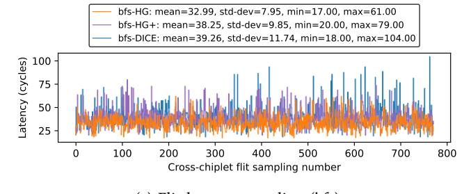
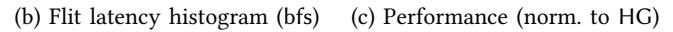

# D. Architectural relevance

Our motivation for DICE parallels the justification for detailed DRAM-system simulators where the key point is not that average memory latency and bandwidth are unknown; it is that a static "latency + bandwidth" abstraction is too coarse to predict performance. This is because the performance-relevant quantity is the dynamic interaction between 1) the workload's access/communication pattern and 2) the microarchitectural mechanisms that schedule, queue, overlap, and serialize those events [66]. This interaction produces high run-time variability in effective memory service times, and it is precisely that *variability*, rather than a single *mean*, that drives stalls, contention, and an increase in critical-paths [66].

DICE's relevance to OoO microarchitecture. Chiplet-based systems create a similar situation for core-to-core or core-to-IOD communication where data transfers experience latency and variability that can be comparable to DRAM. As a result, treating inter-chiplet communication as a fixed constant has the same failure mode as constant DRAM models—it erases the variability that determines when (or how) latency affects performance.

More specifically, modern OoO cores can tolerate a bounded amount of load/store latency through memory-level parallelism, speculation, and overlap. When a latency stays below this "absorbable" region, it may be largely hidden; when it exceeds it, it becomes increasingly visible as pipeline stalls, ROB and LSQ pressure, and exposed dependence stalls. This is best explained by the first order models of Karkhanis and Smith [67], and Eyerman et al. [68]. A constantlatency model therefore forces an inaccurate outcome: If the chosen constant is "low enough," the simulation ignores the performance impact (because OoO hides it). If the chosen constant is "high," the simulation yields a systematic, uniform slowdown. In both cases, it fails to capture latency variability and worst-case scenarios, resulting in simulation inaccuracies. This is corroborated by what we observe with DICE. Figure 22 shows 1) sampled flit latencies for cross-chiplet loads in bfs collected every 50,000 cross-chiplet flits (35 dB SNRbase), 2) the corresponding latency histogram, and 3) the impact of DICE on performance for bfs and two other high-MPKI benchmarks, bc and cc.

We can observe that the performance gap between DICE and HG cannot be justified by the meager difference in their average-latency shown in Figure 22a ( $\approx$ 6 cycles: 32.99 for

HG+

bc bfs

DICE

cc GMEAN

Fig. 22: HG, HG+, and DICE: Latency variability and resulting IPC for 3 high-MPKI workloads. *Note*: In bc, HG+ induces long backlogs that ultimately lead to simulation failure.

Fig. 23: Single- vs. multi-threaded: Load latency (left) and application execution time (right), normalized to Monolithic.

DICE vs. 39.26 for HG), but rather is a result of the large difference of the tail latencies (61 cycles for HG vs. 104 cycles for DICE). Further, statically increasing HG's cross-chiplet link-cycle (denoted bfs-HG+, reaching an average-latency of 38.25 cycles) to match DICE's average-latency affects application performance only to a limited extent (Figure 22c), as it aligns the average but still leaves a substantial gap in the long-tail (Figure 22b). Further, such adjustments also vary across applications, rendering the tuning process inherently ad hoc. In some cases (e.g., bc), HG+ induces severe request backlogs and can even cause simulation failure. Overall, these results show that, for OoO microarchitecture, HG/HG+ with constant link-latency are insufficient to reproduce DICE.

# D. Architectural relevance

Our motivation for DICE parallels the justification for detailed DRAM-system simulators where the key point is not that average memory latency and bandwidth are unknown; it is that a static "latency + bandwidth" abstraction is too coarse to predict performance. This is because the performance-relevant quantity is the dynamic interaction between 1) the workload's access/communication pattern and 2) the microarchitectural mechanisms that schedule, queue, overlap, and serialize those events [66]. This interaction produces high run-time variability in effective memory service times, and it is precisely that *variability*, rather than a single *mean*, that drives stalls, contention, and an increase in critical-paths [66].

DICE's relevance to OoO microarchitecture. Chiplet-based systems create a similar situation for core-to-core or core-to-IOD communication where data transfers experience latency and variability that can be comparable to DRAM. As a result, treating inter-chiplet communication as a fixed constant has the same failure mode as constant DRAM models—it erases the variability that determines when (or how) latency affects performance.

More specifically, modern OoO cores can tolerate a bounded amount of load/store latency through memory-level parallelism, speculation, and overlap. When a latency stays below this "absorbable" region, it may be largely hidden; when it exceeds it, it becomes increasingly visible as pipeline stalls, ROB and LSQ pressure, and exposed dependence stalls. This is best explained by the first order models of Karkhanis and Smith [67], and Eyerman et al. [68]. A constantlatency model therefore forces an inaccurate outcome: If the chosen constant is "low enough," the simulation ignores the performance impact (because OoO hides it). If the chosen constant is "high," the simulation yields a systematic, uniform slowdown. In both cases, it fails to capture latency variability and worst-case scenarios, resulting in simulation inaccuracies. This is corroborated by what we observe with DICE. Figure 22 shows 1) sampled flit latencies for cross-chiplet loads in bfs collected every 50,000 cross-chiplet flits (35 dB SNRbase), 2) the corresponding latency histogram, and 3) the impact of DICE on performance for bfs and two other high-MPKI benchmarks, bc and cc.

We can observe that the performance gap between DICE and HG cannot be justified by the meager difference in their average-latency shown in Figure 22a ( $\approx$ 6 cycles: 32.99 for

HG+

bc bfs

DICE

cc GMEAN

Fig. 22: HG, HG+, and DICE: Latency variability and resulting IPC for 3 high-MPKI workloads. *Note*: In bc, HG+ induces long backlogs that ultimately lead to simulation failure.

Fig. 23: Single- vs. multi-threaded: Load latency (left) and application execution time (right), normalized to Monolithic.

DICE vs. 39.26 for HG), but rather is a result of the large difference of the tail latencies (61 cycles for HG vs. 104 cycles for DICE). Further, statically increasing HG's cross-chiplet link-cycle (denoted bfs-HG+, reaching an average-latency of 38.25 cycles) to match DICE's average-latency affects application performance only to a limited extent (Figure 22c), as it aligns the average but still leaves a substantial gap in the long-tail (Figure 22b). Further, such adjustments also vary across applications, rendering the tuning process inherently ad hoc. In some cases (e.g., bc), HG+ induces severe request backlogs and can even cause simulation failure. Overall, these results show that, for OoO microarchitecture, HG/HG+ with constant link-latency are insufficient to reproduce DICE.

