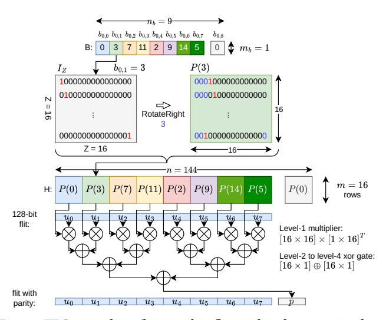

# C. Forward error correction (FEC) encoding

Unlike CRC-only schemes that trigger retransmission upon error detection [28], DICE employs forward error correction (FEC) [29], which proactively corrects bit errors at the receiver and significantly reduces replays. In DICE, the transmit-side PHY router aggregates flits, applies FEC encoding, and then serializes them for transmission.

**QC-LDPC encoding.** DICE employs Quasi-Cyclic Low-Density Parity-Check (QC-LDPC) codes [15], a hardware-efficient FEC scheme extensively used in SSDs [16], [18], [30]. A QC-LDPC code is specified by a sparse parity-check matrix  $H \in \{0, 1\}^{m \times n}$ . A binary vector  $\mathbf{c} \in \{0, 1\}^n$  is a valid codeword iff:

$$H\mathbf{c}^T \equiv \mathbf{0} \pmod{2}.$$

Here, n = k + m is the codeword length, k is the number of bits in the packet-under-transmission, and m is the number of parity bits (rows of H). The code rate R is defined as:

$$R = \frac{k}{n} = 1 - \frac{m}{n},\tag{2}$$

which shows the fraction of the codeword devoted to the original message.

**FEC en/decoding granularity.** DICE performs FEC at *flit* granularity: each 128-bit flit is encoded and decoded independently using a parity-check matrix *H* shared among PHY sender-receiver pairs, ensuring consistent encode/decode/error correction across chiplets. Control packets consist of a single HEAD-TAIL flit, while data packets consist of 6 flits—1 HEAD, 4 BODY flits carrying a 64 Byte cache line, and 1 TAIL flit. This flit-level granularity is chosen because: 1) it keeps the encoder's hardware footprint small

Fig. 5: Pre- and post-FEC FER and number of error-corrected flits under three baseline SNRs with varying parity-byte configurations. Takeaway: A 2-byte parity per flit sits at a sweet spot between overhead and Post-FEC FER.

and timing-friendly (see Figure 7 for FEC-encoder hardware), and 2) it enables more flexible inter-chiplet flow control (Section III-H).

**Sensitivity study on code rate R.** We first select the code rate R. Unlike BCH/Hamming, QC-LDPC provides no bounded-distance guarantee, making R a design trade-off: lower R (more parity) strengthens error correction (EC) but consumes more inter-chiplet bandwidth; higher R reduces overhead but weakens correction. We choose R using the sensitivity study in Figure 5, which reports both the pre-FEC flit error ratio (FER) and the post-FEC FER under a Gaussian-noise channel at a representative signal-to-noise ratio of  $SNR_{base} = 35.0 \, dB$ . Additional sensitivity experiments on  $SNR_{base}$  are discussed in Section III-D. All results are decoded using a 4-iteration loop-budget layered Min-Sum FEC decoder (Section III-G).

From the figure we observe a sweet spot at 2 parity bytes per flit ( $R \approx 0.88$ ): higher R under-provisions parity and increases post-FEC error rates, whereas lower R yields diminishing returns in correction strength. Consequently, DICE adopts  $R \approx 0.88$  by default—1 parity bit per flit-byte (16 parity bits for a 128-bit flit)—balancing post-FEC reliability and inter-chiplet bandwidth efficiency.

As a comparison to  $SNR_{base} = 35.0 \, dB$ , Figure 5 also shows results at  $SNR_{base} = 40.0 \, dB$  and  $22.5 \, dB$ . First,  $SNR_{base} = 40.0 \, dB$  achieves results similar to  $SNR_{base} = 35.0 \, dB$ , which indicates that once  $SNR_{base}$  exceeds 35.0 dB, the channel noise is dominated by crosstalk and jitter, and a cleaner baseline SNR does not provide much additional benefit. Second, in contrast, under noisier channel conditions, 2 parity bytes are no longer sufficient to

maintain a satisfactory post-FEC FER. In this regime, there are 3 possible trade-offs: 1) increase the number of parity bytes (e.g., from 2 to 4, as shown in the figure) to better tolerate channel noise, at the cost of reduced effective data bandwidth; 2) maintain a 2-byte parity but retransmit flits that cannot be corrected, preserving raw channel bandwidth but increasing packet turnaround time and tax application runtime; or 3) increase the FEC decoder iteration budget to improve error-correction capability, at the expense of additional hardware complexity and power.

**Parity function construction.** To generate parity bits, DICE constructs a parity-check matrix H for the LDPC code. The process begins with a compact base matrix  $B \in \mathbb{Z}^{m_b \times n_b}$ , where  $m = m_b Z$ ,  $n = n_b Z$ . The expansion factor Z controls hardware parallelism: a larger Z increases parallelism. Each element  $b_{i,j}$  in B represents either: -1, denoting an all-zero block, or a non-negative shift value  $s \in \{0, 1, \ldots, Z-1\}$ , denoting a right-rotated identity matrix. Each shift value s corresponds to a  $Z \times Z$  circulant permutation matrix:

$$P(s) = \text{RotateRight}_{Z}(I_{Z}, s), \quad P(-1) = 0_{Z \times Z},$$

where  $I_Z$  is the  $Z \times Z$  identity matrix and RotateRightZ( $I_Z$ , s) performs a cyclic right shift of each row by s positions. Replacing every entry  $b_{i,j}$  in B with its corresponding block  $P(b_{i,j})$  produces the full parity-check matrix:

$$H = [P(b_{i,j})]_{i \in [0,m_b-1], j \in [0,n_b-1]}, \quad m = m_b Z, \quad n = n_b Z.$$

This *block-circulant* construction yields a highly regular and hardware-friendly matrix, since each P(s) can be implemented using simple shift registers or address rotations, avoiding the complex interconnects of unstructured LDPC codes.

**Example.** For Z = 16, each P(s) is a  $16 \times 16$  rotation of the identity matrix. A 128-bit flit is divided into 8 16-bit chunks  $\{u_0, u_1, \dots, u_7\}$ . The parity block p is computed as:

$$\mathbf{p} = P(0) \mathbf{u}_0 \oplus P(3) \mathbf{u}_1 \oplus P(7) \mathbf{u}_2 \oplus P(11) \mathbf{u}_3 \oplus P(2) \mathbf{u}_4 \oplus P(9) \mathbf{u}_5 \oplus P(14) \mathbf{u}_6 \oplus P(5) \mathbf{u}_7.$$
(3)

The final codeword concatenates data and parity bits:

$$c = [u_0||u_1|| \cdots ||u_7||p].$$

**FEC-encoder latency.** We implement the QC-LDPC encoder described in Equation 3 in Verilog. We use Yosys1 for synthesis and OpenSTA2 for static timing analysis, both targeting the TSMC 40 nm standard-cell library. Our analysis shows that FEC granularity has a significant impact on hardware cost and timing. With a 128-bit input (flit-level), the encoder maps to 7 16-bit XOR gates using 175 standard cells (Figure 7a) and meets the target 2.0 GHz clock constraint. Multipliers are optimized away since all coefficients in *H* are constants. In contrast, scaling the input width to 768 bits (packet-level, corresponding to a full data packet) increases logic complexity to 2320 cells (Figure 7b) and fails to meet

Fig. 6: FEC-encoding for 128-bit flit with 2-byte parity bits.

(b) Packet-level (64-byte) FEC encoder.

Fig. 7: Logic synthesis results for flit- and packet-level FEC encoders. Layouts visualized in Xilinx Vivado for clarity. Takeaway: Flit-level FEC can be implemented with a simple three-level XOR-net, whereas packet-level FEC significantly increases hardware complexity.

the 2.0 GHz timing target. These results motivate the choice of *flit*-level FEC in DICE, ensuring the encoder remains off the router pipeline's critical path in both CCD and IOD.

#### D. Modulation

After FEC encoding, digital signals are modulated and transmitted over the inter-chiplet channel.

**PAM4 modulation.** DICE employs PAM4 [31] with Gray mapping, where 2-bit symbols [00,01,11,10] correspond to amplitudes [-3d,-d,+d,+3d]. In DICE, we use an interposer-level swing of [-150,-50,+50,+150] mV, *i.e.*, d = 50 mV, representative of short-reach chiplet links on silicon interposers. This low-swing operation significantly reduces I/O power and is consistent with modern die-to-die PAM4 PHY implementations [10].

&lt;sup>1https://github.com/YosysHQ/yosys

&lt;sup>2https://github.com/The-OpenROAD-Project/OpenSTA

**Example:** Transmitting the PAM4. byte word produces symbol pairs [01, 00, 10, 10][01, 00, 10, 10]map to amplitudes [-d, -3d, +3d, +3d]. 50mV, the resulting serial waveform is With d= x = [-50, -150, +150, +150] mV.

# C. Forward error correction (FEC) encoding

Unlike CRC-only schemes that trigger retransmission upon error detection [28], DICE employs forward error correction (FEC) [29], which proactively corrects bit errors at the receiver and significantly reduces replays. In DICE, the transmit-side PHY router aggregates flits, applies FEC encoding, and then serializes them for transmission.

**QC-LDPC encoding.** DICE employs Quasi-Cyclic Low-Density Parity-Check (QC-LDPC) codes [15], a hardware-efficient FEC scheme extensively used in SSDs [16], [18], [30]. A QC-LDPC code is specified by a sparse parity-check matrix  $H \in \{0, 1\}^{m \times n}$ . A binary vector  $\mathbf{c} \in \{0, 1\}^n$  is a valid codeword iff:

$$H\mathbf{c}^T \equiv \mathbf{0} \pmod{2}.$$

Here, n = k + m is the codeword length, k is the number of bits in the packet-under-transmission, and m is the number of parity bits (rows of H). The code rate R is defined as:

$$R = \frac{k}{n} = 1 - \frac{m}{n},\tag{2}$$

which shows the fraction of the codeword devoted to the original message.

**FEC en/decoding granularity.** DICE performs FEC at *flit* granularity: each 128-bit flit is encoded and decoded independently using a parity-check matrix *H* shared among PHY sender-receiver pairs, ensuring consistent encode/decode/error correction across chiplets. Control packets consist of a single HEAD-TAIL flit, while data packets consist of 6 flits—1 HEAD, 4 BODY flits carrying a 64 Byte cache line, and 1 TAIL flit. This flit-level granularity is chosen because: 1) it keeps the encoder's hardware footprint small

Fig. 5: Pre- and post-FEC FER and number of error-corrected flits under three baseline SNRs with varying parity-byte configurations. Takeaway: A 2-byte parity per flit sits at a sweet spot between overhead and Post-FEC FER.

and timing-friendly (see Figure 7 for FEC-encoder hardware), and 2) it enables more flexible inter-chiplet flow control (Section III-H).

**Sensitivity study on code rate R.** We first select the code rate R. Unlike BCH/Hamming, QC-LDPC provides no bounded-distance guarantee, making R a design trade-off: lower R (more parity) strengthens error correction (EC) but consumes more inter-chiplet bandwidth; higher R reduces overhead but weakens correction. We choose R using the sensitivity study in Figure 5, which reports both the pre-FEC flit error ratio (FER) and the post-FEC FER under a Gaussian-noise channel at a representative signal-to-noise ratio of  $SNR_{base} = 35.0 \, dB$ . Additional sensitivity experiments on  $SNR_{base}$  are discussed in Section III-D. All results are decoded using a 4-iteration loop-budget layered Min-Sum FEC decoder (Section III-G).

From the figure we observe a sweet spot at 2 parity bytes per flit ( $R \approx 0.88$ ): higher R under-provisions parity and increases post-FEC error rates, whereas lower R yields diminishing returns in correction strength. Consequently, DICE adopts  $R \approx 0.88$  by default—1 parity bit per flit-byte (16 parity bits for a 128-bit flit)—balancing post-FEC reliability and inter-chiplet bandwidth efficiency.

As a comparison to  $SNR_{base} = 35.0 \, dB$ , Figure 5 also shows results at  $SNR_{base} = 40.0 \, dB$  and  $22.5 \, dB$ . First,  $SNR_{base} = 40.0 \, dB$  achieves results similar to  $SNR_{base} = 35.0 \, dB$ , which indicates that once  $SNR_{base}$  exceeds 35.0 dB, the channel noise is dominated by crosstalk and jitter, and a cleaner baseline SNR does not provide much additional benefit. Second, in contrast, under noisier channel conditions, 2 parity bytes are no longer sufficient to

maintain a satisfactory post-FEC FER. In this regime, there are 3 possible trade-offs: 1) increase the number of parity bytes (e.g., from 2 to 4, as shown in the figure) to better tolerate channel noise, at the cost of reduced effective data bandwidth; 2) maintain a 2-byte parity but retransmit flits that cannot be corrected, preserving raw channel bandwidth but increasing packet turnaround time and tax application runtime; or 3) increase the FEC decoder iteration budget to improve error-correction capability, at the expense of additional hardware complexity and power.

**Parity function construction.** To generate parity bits, DICE constructs a parity-check matrix H for the LDPC code. The process begins with a compact base matrix  $B \in \mathbb{Z}^{m_b \times n_b}$ , where  $m = m_b Z$ ,  $n = n_b Z$ . The expansion factor Z controls hardware parallelism: a larger Z increases parallelism. Each element  $b_{i,j}$  in B represents either: -1, denoting an all-zero block, or a non-negative shift value  $s \in \{0, 1, \ldots, Z-1\}$ , denoting a right-rotated identity matrix. Each shift value s corresponds to a  $Z \times Z$  circulant permutation matrix:

$$P(s) = \text{RotateRight}_{Z}(I_{Z}, s), \quad P(-1) = 0_{Z \times Z},$$

where  $I_Z$  is the  $Z \times Z$  identity matrix and RotateRightZ( $I_Z$ , s) performs a cyclic right shift of each row by s positions. Replacing every entry  $b_{i,j}$  in B with its corresponding block  $P(b_{i,j})$  produces the full parity-check matrix:

$$H = [P(b_{i,j})]_{i \in [0,m_b-1], j \in [0,n_b-1]}, \quad m = m_b Z, \quad n = n_b Z.$$

This *block-circulant* construction yields a highly regular and hardware-friendly matrix, since each P(s) can be implemented using simple shift registers or address rotations, avoiding the complex interconnects of unstructured LDPC codes.

**Example.** For Z = 16, each P(s) is a  $16 \times 16$  rotation of the identity matrix. A 128-bit flit is divided into 8 16-bit chunks  $\{u_0, u_1, \dots, u_7\}$ . The parity block p is computed as:

$$\mathbf{p} = P(0) \mathbf{u}_0 \oplus P(3) \mathbf{u}_1 \oplus P(7) \mathbf{u}_2 \oplus P(11) \mathbf{u}_3 \oplus P(2) \mathbf{u}_4 \oplus P(9) \mathbf{u}_5 \oplus P(14) \mathbf{u}_6 \oplus P(5) \mathbf{u}_7.$$
(3)

The final codeword concatenates data and parity bits:

$$c = [u_0||u_1|| \cdots ||u_7||p].$$

**FEC-encoder latency.** We implement the QC-LDPC encoder described in Equation 3 in Verilog. We use Yosys1 for synthesis and OpenSTA2 for static timing analysis, both targeting the TSMC 40 nm standard-cell library. Our analysis shows that FEC granularity has a significant impact on hardware cost and timing. With a 128-bit input (flit-level), the encoder maps to 7 16-bit XOR gates using 175 standard cells (Figure 7a) and meets the target 2.0 GHz clock constraint. Multipliers are optimized away since all coefficients in *H* are constants. In contrast, scaling the input width to 768 bits (packet-level, corresponding to a full data packet) increases logic complexity to 2320 cells (Figure 7b) and fails to meet

Fig. 6: FEC-encoding for 128-bit flit with 2-byte parity bits.

(b) Packet-level (64-byte) FEC encoder.

Fig. 7: Logic synthesis results for flit- and packet-level FEC encoders. Layouts visualized in Xilinx Vivado for clarity. Takeaway: Flit-level FEC can be implemented with a simple three-level XOR-net, whereas packet-level FEC significantly increases hardware complexity.

the 2.0 GHz timing target. These results motivate the choice of *flit*-level FEC in DICE, ensuring the encoder remains off the router pipeline's critical path in both CCD and IOD.

#### D. Modulation

After FEC encoding, digital signals are modulated and transmitted over the inter-chiplet channel.

**PAM4 modulation.** DICE employs PAM4 [31] with Gray mapping, where 2-bit symbols [00,01,11,10] correspond to amplitudes [-3d,-d,+d,+3d]. In DICE, we use an interposer-level swing of [-150,-50,+50,+150] mV, *i.e.*, d = 50 mV, representative of short-reach chiplet links on silicon interposers. This low-swing operation significantly reduces I/O power and is consistent with modern die-to-die PAM4 PHY implementations [10].

&lt;sup>1https://github.com/YosysHQ/yosys

&lt;sup>2https://github.com/The-OpenROAD-Project/OpenSTA

**Example:** Transmitting the PAM4. byte word produces symbol pairs [01, 00, 10, 10][01, 00, 10, 10]map to amplitudes [-d, -3d, +3d, +3d]. 50mV, the resulting serial waveform is With d= x = [-50, -150, +150, +150] mV.

