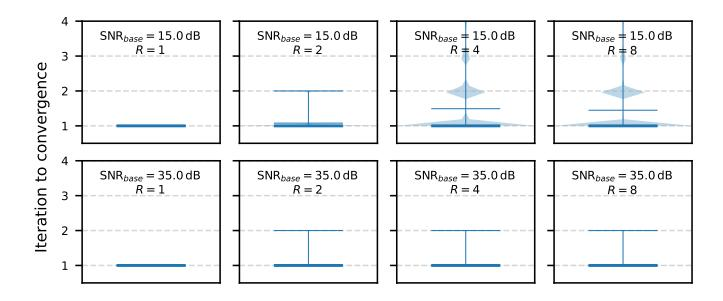

# F. De-modulation

On the other side of the inter-chiplet channel, the receiver performs FEC decoding (Section III-G) and error correction [29], reconstructs flits, and forwards them to the downstream router. The first step, however, is to demodulate the received signal by computing *channel LLRs* or *log-likelihood ratios*, which represent a "soft" confidence for the received symbol bits. The reason LLRs are important is because they are the input to the decoder described in Section III-G.

At the receiver, DICE computes bit-wise LLRs for each received PAM4 symbol (encoding 2 bits). Let  $L_{\text{ch},k}$  denote the LLR for bit  $b_k$ . Its magnitude  $|L_{\text{ch},k}|$  captures confidence (e.g.,  $|L_{\text{ch},k}| = 3.0$  is high;  $|L_{\text{ch},k}| = 0.2$  is low), while its sign encodes polarity ( $L_{\text{ch},k} > 0 \Rightarrow 0$ ,  $L_{\text{ch},k} < 0 \Rightarrow 1$ ). For PAM4 with Gray-mapping  $[00,01,11,10] \Rightarrow [-3d,-d,+d,+3d]$ , the symbol-bit subsets are:

$$X_{\text{MSB}}^{(1)} = \{+d, +3d\}, X_{\text{MSB}}^{(0)} = \{-3d, -d\}, X_{\text{LSB}}^{(1)} = \{-d, +d\}, X_{\text{LSB}}^{(0)} = \{-3d, +3d\}.$$

Given a received symbol y, the LLR  $L_{ch}$  for bit  $b_k$  is [46]:

$$L_{\mathrm{ch}}(b_k) = \log \frac{\sum\limits_{x \in \mathcal{X}_k^{(0)}} \exp\left(-\frac{(y-x)^2}{2\sigma^2}\right)}{\sum\limits_{x \in \mathcal{X}_k^{(1)}} \exp\left(-\frac{(y-x)^2}{2\sigma^2}\right)} \approx \frac{1}{2\sigma^2} \left(\min_{x \in \mathcal{X}_k^{(1)}} (y-x)^2 - \min_{x \in \mathcal{X}_k^{(0)}} (y-x)^2\right),$$

where x are the symbol-bits in the corresponding subset.

**Example: calculating bit-LLR for a received PAM4 symbol.** Assume that the receiver observes a signal of  $y = -45.0 \,\text{mV}$ , corresponding to the first symbol ([01]=[-d]=[-50mv]) in the noise modeling example in Section III-D.

The received PAM4 symbol yields channel LLRs  $L_{\rm ch}$  = [+22.8, -27.8] for {MSB, LSB}, which serve as soft-confidence inputs to the FEC decoder. As detailed later in Section III-G, the decoder first produces a bit decision of [01], which is then verified by the syndrome function using the same encoding matrix H introduced in Section III-C. This verification confirms that no error is present in this example, which is expected, as the injected noise of +5.0 mV is not sufficient to shift the signal into an adjacent symbol voltage level. Otherwise, the decoder initiates the error-correction process to repair the detected error.

#### G. Decoding

**FEC decoding pipeline.** DICE adopts a low-latency layered min-sum QC-LDPC decoder [47], chosen for hardware efficiency and fast convergence. Let the parity-check matrix H have m rows (layers), where each row corresponds to a

check node  $CN_i$  that enforces a group of parity constraints over a subset of variable nodes  $v_i$ .

**Initialization.** At the beginning of iteration t, each  $v_j$  initializes its LLR from the channel input at the receiver:  $L(v_j) \leftarrow L_{ch}(v_j)$ . The decoder then sweeps the layers sequentially (i = 0, ..., m-1), performing check-node and variable-node updates in a layered schedule.

Check-node update (exclude-self rule). For each edge  $(CN_i, v_i)$ , the outgoing message is:

$$m_{cn_{i} \to v_{j}} = \left( \prod_{v_{k} \in \mathcal{N}(cn_{i}) \setminus v_{j}} \operatorname{sgn}(m_{v \to cn_{i}} [v_{k}]) \right) \min_{v_{k} \in \mathcal{N}(cn_{i}) \setminus v_{j}} \left| m_{v \to cn_{i}} [v_{k}] \right|.$$

The sign is the product of all *other* incoming  $v \rightarrow c$  signs, and the magnitude is the minimum of their absolute values.

**Variable-node update (layered accumulation).** After computing  $m_{cn_i \rightarrow v_i}$ ,  $v_i$  updates its LLR incrementally:

$$L(v_i) \leftarrow L(v_i) + m_{cn_i \rightarrow v_i}$$

Subsequent layers immediately reuse the updated LLRs, accelerating convergence compared to flooding, where all layers use previous iteration's LLRs and new LLRs are updated at once after all  $m_{cn\rightarrow v}$  for the current layer are calculated.

**Hard decision and syndrome check.** After all layers are processed, the decoder decides each bit:

$$\hat{c}_i = \begin{cases} 0, & L(v_i) \ge 0, \\ 1, & L(v_i) < 0, \end{cases} \quad \text{and verifies } H\hat{\mathbf{c}}^T \equiv \mathbf{0} \pmod{2}$$

If the syndrome is zero, decoding terminates successfully; otherwise, the decoder performs another layered sweep until either 1) the syndrome becomes zero—indicating all errors are corrected—or 2) a predefined iteration budget is reached, in which case the flit/packet is retransmitted.

**Example: layered min-sum decoding.** As introduced in Section III-D, after transmission across the interchiplet channel, the receiver observes serial noisy PAM4 symbols  $\mathbf{y} = \mathbf{x} + \mathbf{n} = \frac{[-45.0, -171.0, +137.0, +158.0] \text{ mV}}{\text{converted}}$  to bit-wise LLRs per Section III-F, yielding  $L_{ch} = [v_0, v_1, ..., v_7] = [+22.8, -27.8, +122.5, +35.9, -88.1, +18.7, -109.4, +29, 4]$ . For illustration, we consider  $v_0 - v_5$  as data bits and  $v_6, v_7$  as parity bits3. We use the following representative  $3 \times 8$  parity-check matrix (rows = CNs, columns = VNs):

$$H = \begin{bmatrix} v_0 & v_1 & v_2 & v_3 & v_4 & v_5 & v_6 & v_7 \\ \text{CN}_0 & 1 & 1 & 0 & 1 & 0 & 0 & 1 & 0 \\ \text{CN}_1 & 0 & 1 & 1 & 0 & 1 & 0 & 0 & 1 \\ \text{CN}_2 & 1 & 0 & 1 & 0 & 0 & 1 & 0 & 0 \end{bmatrix}.$$

In each layer, every CN updates its connected VNs (where there is a "1") using the current LLRs, which are incrementally refined within the same layer. Subsequent layers immediately reuse these updated values to accelerate convergence.

&lt;sup>3This simplified example captures the essential layered decoding schedule and applies directly to the 128-bit flit granularity in DICE.

Fig. 10: Sensitivity of QC-LDPC convergence to varying base SNR and parity-byte configurations. Takeaway: At the baseline 35 dB SNR, FEC decoding converges within 2 iterations for all parity-byte settings R.

After one full layered iteration (three layers), the updated variable-node LLRs are:

$$L = [69.3, -80.0, 170.6, 58.7, -117.5, 69.3, -132.2, 80.0].$$

The decoder then performs hard decisions according to:

$$\hat{c}_i = \begin{cases} 0, & L(v_i) \ge 0, \\ 1, & L(v_i) < 0, \end{cases} \Rightarrow \hat{\mathbf{c}} = [0, 1, 0, 0, 1, 0, 1, 0].$$

Finally, the syndrome check  $H\hat{\mathbf{c}}^T=0\pmod{2}$  confirms that all parity constraints are satisfied. In this example, the codeword passes the check (we receive the same message as before, encoded as described in Section III-D), and decoding successfully converges after a single layered iteration. If the syndrome is non-zero, the decoder reuses the updated LLRs and repeats until either the syndrome becomes zero or a limit is reached and a packet is retransmitted.

**FEC-decoder latency.** We synthesize a layered min-sum QC-LDPC decoder in Verilog. Because the decoding process is runtime-determined, we set the decoder loop budget empirically: Figure 10 reports violin plots of *iterations to convergence*4 versus parity bytes R = 1, 2, 4, 8 across link qualities  $SNR_{base} = 15.0 \, dB$  and  $35.0 \, dB$ . At the baseline  $SNR_{base} = 35.0 \, dB$ , all tested code rates converge within  $\leq 2$  iterations. We thus cap the decoding loop budget at N = 4—bounding worst-case latency while retaining margin for lower  $SNR_{base}$ . For both CCD and the IOD, the syndrome stage uses  $L_{syndrome} = 1$  cycle, and each decoding iteration uses  $L_{iter} = 1$  cycle (including all layers of LLR updates and comparisons). The total latency after N iterations is:

Latency(N) = 
$$(N+1)L_{\text{syndrome}} + NL_{\text{iter}} = 2N+1 \text{ cycles}, N \le 4.$$

At a noisier channel of  $15.0\,\mathrm{dB}$ , we observe 2 phenomena. First, with fewer parity bytes (e.g., R=1 or R=2), many errors cannot be corrected by FEC because the parity-byte budget is insufficient; among those that are detected, 2 iterations are sufficient for correction. Second, increasing the number of parity bytes enables correction of more errors, but requires additional decoding iterations to convergence.

4We exclude error-free flits and runs that do not converge within a generous cap of 20 iterations.

Fig. 11: Microarchitecture for sender (Router A) and receiver (Router B) PHY routers.

# F. De-modulation

On the other side of the inter-chiplet channel, the receiver performs FEC decoding (Section III-G) and error correction [29], reconstructs flits, and forwards them to the downstream router. The first step, however, is to demodulate the received signal by computing *channel LLRs* or *log-likelihood ratios*, which represent a "soft" confidence for the received symbol bits. The reason LLRs are important is because they are the input to the decoder described in Section III-G.

At the receiver, DICE computes bit-wise LLRs for each received PAM4 symbol (encoding 2 bits). Let  $L_{\text{ch},k}$  denote the LLR for bit  $b_k$ . Its magnitude  $|L_{\text{ch},k}|$  captures confidence (e.g.,  $|L_{\text{ch},k}| = 3.0$  is high;  $|L_{\text{ch},k}| = 0.2$  is low), while its sign encodes polarity ( $L_{\text{ch},k} > 0 \Rightarrow 0$ ,  $L_{\text{ch},k} < 0 \Rightarrow 1$ ). For PAM4 with Gray-mapping  $[00,01,11,10] \Rightarrow [-3d,-d,+d,+3d]$ , the symbol-bit subsets are:

$$X_{\text{MSB}}^{(1)} = \{+d, +3d\}, X_{\text{MSB}}^{(0)} = \{-3d, -d\}, X_{\text{LSB}}^{(1)} = \{-d, +d\}, X_{\text{LSB}}^{(0)} = \{-3d, +3d\}.$$

Given a received symbol y, the LLR  $L_{ch}$  for bit  $b_k$  is [46]:

$$L_{\mathrm{ch}}(b_k) = \log \frac{\sum\limits_{x \in \mathcal{X}_k^{(0)}} \exp\left(-\frac{(y-x)^2}{2\sigma^2}\right)}{\sum\limits_{x \in \mathcal{X}_k^{(1)}} \exp\left(-\frac{(y-x)^2}{2\sigma^2}\right)} \approx \frac{1}{2\sigma^2} \left(\min_{x \in \mathcal{X}_k^{(1)}} (y-x)^2 - \min_{x \in \mathcal{X}_k^{(0)}} (y-x)^2\right),$$

where x are the symbol-bits in the corresponding subset.

**Example: calculating bit-LLR for a received PAM4 symbol.** Assume that the receiver observes a signal of  $y = -45.0 \,\text{mV}$ , corresponding to the first symbol ([01]=[-d]=[-50mv]) in the noise modeling example in Section III-D.

The received PAM4 symbol yields channel LLRs  $L_{\rm ch}$  = [+22.8, -27.8] for {MSB, LSB}, which serve as soft-confidence inputs to the FEC decoder. As detailed later in Section III-G, the decoder first produces a bit decision of [01], which is then verified by the syndrome function using the same encoding matrix H introduced in Section III-C. This verification confirms that no error is present in this example, which is expected, as the injected noise of +5.0 mV is not sufficient to shift the signal into an adjacent symbol voltage level. Otherwise, the decoder initiates the error-correction process to repair the detected error.

#### G. Decoding

**FEC decoding pipeline.** DICE adopts a low-latency layered min-sum QC-LDPC decoder [47], chosen for hardware efficiency and fast convergence. Let the parity-check matrix H have m rows (layers), where each row corresponds to a

check node  $CN_i$  that enforces a group of parity constraints over a subset of variable nodes  $v_i$ .

**Initialization.** At the beginning of iteration t, each  $v_j$  initializes its LLR from the channel input at the receiver:  $L(v_j) \leftarrow L_{ch}(v_j)$ . The decoder then sweeps the layers sequentially (i = 0, ..., m-1), performing check-node and variable-node updates in a layered schedule.

Check-node update (exclude-self rule). For each edge  $(CN_i, v_i)$ , the outgoing message is:

$$m_{cn_{i} \to v_{j}} = \left( \prod_{v_{k} \in \mathcal{N}(cn_{i}) \setminus v_{j}} \operatorname{sgn}(m_{v \to cn_{i}} [v_{k}]) \right) \min_{v_{k} \in \mathcal{N}(cn_{i}) \setminus v_{j}} \left| m_{v \to cn_{i}} [v_{k}] \right|.$$

The sign is the product of all *other* incoming  $v \rightarrow c$  signs, and the magnitude is the minimum of their absolute values.

**Variable-node update (layered accumulation).** After computing  $m_{cn_i \rightarrow v_i}$ ,  $v_i$  updates its LLR incrementally:

$$L(v_i) \leftarrow L(v_i) + m_{cn_i \rightarrow v_i}$$

Subsequent layers immediately reuse the updated LLRs, accelerating convergence compared to flooding, where all layers use previous iteration's LLRs and new LLRs are updated at once after all  $m_{cn\rightarrow v}$  for the current layer are calculated.

**Hard decision and syndrome check.** After all layers are processed, the decoder decides each bit:

$$\hat{c}_i = \begin{cases} 0, & L(v_i) \ge 0, \\ 1, & L(v_i) < 0, \end{cases} \quad \text{and verifies } H\hat{\mathbf{c}}^T \equiv \mathbf{0} \pmod{2}$$

If the syndrome is zero, decoding terminates successfully; otherwise, the decoder performs another layered sweep until either 1) the syndrome becomes zero—indicating all errors are corrected—or 2) a predefined iteration budget is reached, in which case the flit/packet is retransmitted.

**Example: layered min-sum decoding.** As introduced in Section III-D, after transmission across the interchiplet channel, the receiver observes serial noisy PAM4 symbols  $\mathbf{y} = \mathbf{x} + \mathbf{n} = \frac{[-45.0, -171.0, +137.0, +158.0] \text{ mV}}{\text{converted}}$  to bit-wise LLRs per Section III-F, yielding  $L_{ch} = [v_0, v_1, ..., v_7] = [+22.8, -27.8, +122.5, +35.9, -88.1, +18.7, -109.4, +29, 4]$ . For illustration, we consider  $v_0 - v_5$  as data bits and  $v_6, v_7$  as parity bits3. We use the following representative  $3 \times 8$  parity-check matrix (rows = CNs, columns = VNs):

$$H = \begin{bmatrix} v_0 & v_1 & v_2 & v_3 & v_4 & v_5 & v_6 & v_7 \\ \text{CN}_0 & 1 & 1 & 0 & 1 & 0 & 0 & 1 & 0 \\ \text{CN}_1 & 0 & 1 & 1 & 0 & 1 & 0 & 0 & 1 \\ \text{CN}_2 & 1 & 0 & 1 & 0 & 0 & 1 & 0 & 0 \end{bmatrix}.$$

In each layer, every CN updates its connected VNs (where there is a "1") using the current LLRs, which are incrementally refined within the same layer. Subsequent layers immediately reuse these updated values to accelerate convergence.

&lt;sup>3This simplified example captures the essential layered decoding schedule and applies directly to the 128-bit flit granularity in DICE.

Fig. 10: Sensitivity of QC-LDPC convergence to varying base SNR and parity-byte configurations. Takeaway: At the baseline 35 dB SNR, FEC decoding converges within 2 iterations for all parity-byte settings R.

After one full layered iteration (three layers), the updated variable-node LLRs are:

$$L = [69.3, -80.0, 170.6, 58.7, -117.5, 69.3, -132.2, 80.0].$$

The decoder then performs hard decisions according to:

$$\hat{c}_i = \begin{cases} 0, & L(v_i) \ge 0, \\ 1, & L(v_i) < 0, \end{cases} \Rightarrow \hat{\mathbf{c}} = [0, 1, 0, 0, 1, 0, 1, 0].$$

Finally, the syndrome check  $H\hat{\mathbf{c}}^T=0\pmod{2}$  confirms that all parity constraints are satisfied. In this example, the codeword passes the check (we receive the same message as before, encoded as described in Section III-D), and decoding successfully converges after a single layered iteration. If the syndrome is non-zero, the decoder reuses the updated LLRs and repeats until either the syndrome becomes zero or a limit is reached and a packet is retransmitted.

**FEC-decoder latency.** We synthesize a layered min-sum QC-LDPC decoder in Verilog. Because the decoding process is runtime-determined, we set the decoder loop budget empirically: Figure 10 reports violin plots of *iterations to convergence*4 versus parity bytes R = 1, 2, 4, 8 across link qualities  $SNR_{base} = 15.0 \, dB$  and  $35.0 \, dB$ . At the baseline  $SNR_{base} = 35.0 \, dB$ , all tested code rates converge within  $\leq 2$  iterations. We thus cap the decoding loop budget at N = 4—bounding worst-case latency while retaining margin for lower  $SNR_{base}$ . For both CCD and the IOD, the syndrome stage uses  $L_{syndrome} = 1$  cycle, and each decoding iteration uses  $L_{iter} = 1$  cycle (including all layers of LLR updates and comparisons). The total latency after N iterations is:

Latency(N) = 
$$(N+1)L_{\text{syndrome}} + NL_{\text{iter}} = 2N+1 \text{ cycles}, N \le 4.$$

At a noisier channel of  $15.0\,\mathrm{dB}$ , we observe 2 phenomena. First, with fewer parity bytes (e.g., R=1 or R=2), many errors cannot be corrected by FEC because the parity-byte budget is insufficient; among those that are detected, 2 iterations are sufficient for correction. Second, increasing the number of parity bytes enables correction of more errors, but requires additional decoding iterations to convergence.

4We exclude error-free flits and runs that do not converge within a generous cap of 20 iterations.

Fig. 11: Microarchitecture for sender (Router A) and receiver (Router B) PHY routers.

