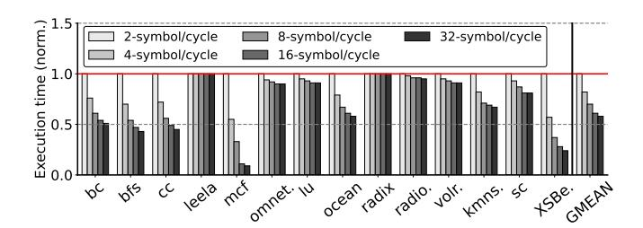
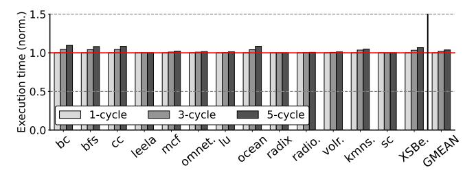
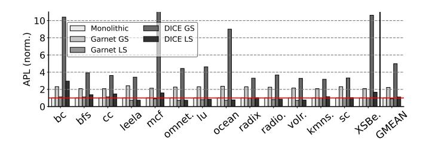

# A. Methodology

**Simulation.** We implement DICE by integrating all PHY components—FEC encoding/decoding, channel noise modeling, modulation/demodulation, LLR computation, *etc*—into gem5 Garnet [19]. We evaluate DICE in gem5 system emulation (SE) using x86\_64 out-of-order cores that implement the architecture shown in Figure 1. The core, uncore, and CCD/IOD parameters are summarized in Table II.

Fidelity of PHY-link modeling in DICE. Unlike prior simulators that assume fixed link latencies, DICE explicitly models PAM4 modulation, injects AWGN-based noise to signal symbols [49], and performs soft-decision FEC decoding based on log-likelihood ratios [15], [47]. This approach is reflected in the IEEE Heterogeneous Integration Roadmap (HIR) 2024 [10], which identifies increased channel noise, the adoption of PAM4 to sustain high bandwidth, tighter signal crosstalk and jitter margins, and growing reliance on FEC, as first-order challenges in emerging chiplet systems [11]. We take two steps to ensure model fidelity of DICE. First, all parameters in DICE (e.g., channel SNR, signaling rates, crosstalk, and jitter) are aligned with publicly available specifications and industry datasheets, as summarized in Table III. Second, we validate DICE against three chiplet-based com-

TABLE III: Parameter settings in DICE

| Parameter           | Value                             | Reference/Source                                                                                                                                                                                                      |
|---------------------|-----------------------------------|-----------------------------------------------------------------------------------------------------------------------------------------------------------------------------------------------------------------------|
| Parity              | 2 Bytes per 16-Byte flit | Empirically evaluated in Figure 5. DICE is compatible with UCIe formats such as the 68B format, where its FEC bytes can be injected into the unused bytes [48].                                                       |
| Symbol rate      | 4 GT/s - 32 GT/s               | $1\mathrm{GT/s}$ denotes $10^9$ symbol transmissions per second. The maximum symbol rate supported by UCIe 2.0 is up to $32\mathrm{GT/s}$ per SerDes lane [48].                                                       |
| SNR base | ≈ 35 dB                           | IEEE HIR 2024 (Chapter 2, HPC) reports that $\sim$ 35 dB channel quality is typical for very-short-range inter-chiplet SerDes IO [10].                                                                                |
| Jitter              | ≈ 1 ps                            | PCI-SIG indicates that high-speed reference clock and differential jitter are on the order of hundreds of femtoseconds ( <i>e.g.</i> , 0.7 ps for PCIe 5.0). DICE uses 1 ps to tolerate more electrical budgets [40]. |
| Crosstalk           | ≈ 20 dB                           | UCIe standard's guidance for signal integrity (SI) indicates that crosstalk for 32 GT/s lanes is approximately 20 dB [43].                                                                                            |

TABLE IV: Benchmark characteristics.

| Suite          | Program   | Character     | IPC  | LLC MPKI |
|----------------|-----------|---------------|------|----------|
|                | bc        | inter-chiplet | 0.55 | 22.8     |
| GAPBS [50]     | bfs       | inter-chiplet | 0.23 | 77.66    |
|                | cc        | inter-chiplet | 0.42 | 35.48    |
|                | leela     | intra         | 1.05 | 0.09     |
| SPEC 2017 [51] | mcf       | inter-chiplet | 0.58 | 70.65    |
|                | omnetpp   | mixed         | 0.88 | 2.19     |
|                | lu-cb     | mixed         | 1.03 | 2.12     |
|                | ocean-cp  | inter-chiplet | 0.57 | 15.11    |
| Splash 4 [52]  | radix     | mixed         | 1.27 | 2.68     |
|                | radiosity | intra         | 1.79 | 0.56     |
|                | volrend   | mixed         | 1.20 | 1.86     |
| Rodinia [53]   | kmeans    | mixed         | 1.50 | 5.02     |
| Kouilla [55]   | sc        | mixed         | 1.52 | 3.71     |
| XSBench [54]   | XSBench   | inter-chiplet | 0.25 | 122.8    |

mercial processors, with validation results presented in Section IV-B1.

Benchmarks. We evaluate a diverse set of 14 benchmarks spanning multiple suites, including 3 programs from GAPBS [50], 3 from SPEC CPU2017 [51], 5 from Splash 4 [52], 2 from Rodinia [53], and the XSBench [54]. Table IV summarizes the program characteristics in terms of instructions per cycle (IPC), which indicates whether a workload is memory- or compute-bound, and last-level cache (LLC) misses per kilo-instruction (MPKI), which reflects the intensity of inter-chiplet communication. Since an LLC miss triggers a CCD-to-IOD access, we classify applications based on LLC MPKI: values above 10 indicate inter-chiplet communication-dominated programs, between 1 and 10 represent moderate communication intensity, and below 1 correspond to compute-bound workloads. In our evaluation, we spawn four instances of the same program and run one process on each of the four CCDs to mimic a typical multi-programming server environment. We create checkpoints after initialization phase (i.e., upon entering the ROI).

#### B. Evaluation Results

1) Validation of DICE: To validate DICE, we compare core-to-core (C2C) communication latency across DICE, HeteroGarnet (denoted HG), and an AMD EPYC 9454P (Zen 4) processor. We run DICE and HG in gem5 full-system mode to run Linux and the C2C benchmark [55], which allows us to control CPU affinity and record C2C values using Linux kernel timestamps. For a fair comparison, we configure both DICE and HG to mirror the 9454P architecture, which consists of 8 CCDs, each integrating 6 out-of-order (OoO) cores, for a total of 48 cores. Due to space constraints, without loss of generality, we report C2C latency from all cores within CCD 0 to every other core in the system.

As shown in Figure 12, we report the *maximum* C2C latency for each source–destination core pair, as long-tail communication latency has a greater impact on application performance than average latency [56], [57] (see also Section IV-D). Compared to HG, DICE more closely matches the C2C latency profile of the actual EPYC processor. To quantitatively evaluate the difference, we report the Root Mean Square Error (RMSE), measured in cycles, from HG and DICE to the AMD EPYC 9454P processor. Excluding intradie measurements, HG gives an RMSE of 141.2 cycles (46.4% of the average maximum latency, 304.6 cycles, on the actual processor), whereas DICE achieves 89.5 cycles (29.4%). DICE therefore narrows the gap to actual hardware, improving the fidelity of the modeled tail latency by 17.0% over HG.

Additional validation with publicly available average C2C latencies. While it is the tail latency that is important for end performance (see Section IV-D), we perform additional validation using publicly available data [55] for the average C2C latency. We evaluate two additional architectures: AMD ThreadRipper 3960X (8 CCDs × 3 cores) and AMD EPYC 7R13 (6 CCDs × 8 cores). As summarized in Table V, on the ThreadRipper 3960X, DICE reduces RMSE from 36.6 cycles (19.1%) with HG to 17.1 cycles (8.9%). On the EPYC 7R13, the error drops from 39.9 cycles (18.9%) to 24.9 cycles (11.8%), and on the EPYC 9454P from 100.4 cycles (40.5%) to 73.9 cycles (29.8%). Overall, DICE, with default parameters, consistently improves modeling fidelity, reducing relative RMSE by 7.1%–10.7% compared to HG across architectures.

Moreover, with enough samples, DICE can be calibrated to fit a range of architectures/workloads, but the main limitation is the lack of reliable data from actual implementations, which currently prevents validation of the calibrated values at the level of individual parameters. As more chiplet-based systems are introduced and characterized, especially those adopting common standards such as UCIe [58], such calibration should become more accurate to real hardware.

2) Impact of SNRbase on Pre- and Post-FEC FER: As discussed in Section III-E, flit-error ratio (FER) is governed by the effective SNR (SNReff), which combines the baseline SNR

Fig. 12: Validation of DICE against AMD EPYC 9454P (8 CCDs × 6 cores): C2C max latency for all 6 cores within one representative CCD, measuring communication from each of these cores to every other of the 47 cores in the system. As shown, by modeling PHY dynamics, DICE (with default parameters) narrows the gap and more faithfully emulates the latency variability of the actual processor than HG.

TABLE V: RMSE comparison

|                                                          | ThreadRipper 3960X 8 CCDs × 3 cores |              | EPYC 7R13 6 CCDs × 8 cores |                   | EPYC 9454P 8 CCDs × 6 cores |                |
|----------------------------------------------------------|----------------------------------------|--------------|-------------------------------|-------------------|--------------------------------|----------------|
|                                                          | Avg                                    | RMSE         | Avg                           | RMSE              | Avg                            | RMSE           |
| HG                                                       | 158.8                                  | 36.6 (19.1%) | 180.5                         | 39.9 (18.9%)      | 152.6                          | 100.4 (40.5%)  |
| DICE                                                     | 186.8                                  | 17.1 (8.9%)  | 205.4                         | 24.9 (11.8%)      | 177.8                          | 73.9 (29.8%)   |
| L                                                        | 20dB                                   | □ 25dB □     | 30dB                          | 35dB              | 40dB                           | 45dB           |
| 10 -2 10 -4 10 -6 |                                        |              |                               |                   |                                |                |
| pc                                                       | bis                                    | cc leela mot | nnet. IU                      | ocean radix radio | · VOIL· W                      | ns. sc KSBe.ME |

Fig. 13: Pre-FEC FER based on varied SNRbase.

Fig. 14: Post-FEC FER based on varied SNRbase.

(SNRbase) with jitter and crosstalk via Equation 5. While jitter and crosstalk are primarily determined by channel characteristics (*e.g.*, link frequency and distance between wires), SNRbase drifts with runtime operating conditions (*e.g.*, thermal conditions). We next analyze SNRbase to quantify its impact on data transmission reliability, and report the pre-FEC and post-FEC FER in Figure 13 and Figure 14.

From Figure 13 we can make 3 observations. 1) Communication-intensive applications such as bfs, cc, and XSBench suffer more from errors, as inter-chiplet communication occurs more frequently. 2) For each application, FER varies significantly with SNRbase. At low SNRbase values (20–25 dB), all workloads experience substantial pre-FEC errors. As SNRbase increases, errors drop sharply, revealing a nonlinear relationship between channel quality and FER. 3) Beyond 35 dB, further increases in SNRbase yield only marginal

&lt;sup>5Whether we normalize by the average (mean) or the RMS of the reference curve makes very little difference to our results.

&lt;sup>6Using publicly available C2C datasets prevents us from exploring maximum latency and restricts us to average latency.

Fig. 15: Normalized avg packet latency across symbol rates.

Fig. 16: Normalized execution time across symbol rates.

improvement, suggesting 35 dB as a practical operating point. Figure 14 shows the post-FEC FER for different applications. In DICE, using FEC instead of relying solely on conventional error detection via CRC (e.g., in AMD's Infinity Fabric [59], Intel CXL [60], and a recent work of RXL [61]) allows most errors to be corrected online, leaving only post-FEC errors subject to retransmission. As shown in the figure, compared to Figure 13, DICE corrects on average 97.8% of the errors, leaving only 2.2% of the original errors for retransmission. This significantly reduces both runtime overhead and energy consumption, as flits are corrected in place rather than being resent.

3) Average packet latency and application runtime across inter-chiplet link bandwidth: We evaluate the impact of varying PHY link symbol rates (2-32 symbols/cycle) on overall application average packet latency (APL) and execution time (both are normalized to 2-symbol/cycle). As shown in Figure 15, as expected, increasing the link symbol rate substantially reduces average packet latency, with diminishing returns however beyond 16 symbols/cycle as serialization delay and queuing effects become less dominant. This latency improvement translates directly to higher application performance: in Figure 16, total execution time decreases consistently with higher symbol rates, particularly for communication-intensive workloads (e.g. bc, bfs, cc, mcf, and XSBench). Compute-bound programs (e.g., leela, radiosity) show marginal improvement, indicating limited sensitivity to inter-chiplet link bandwidth.

4) Average packet latency and application runtime across IOD router latency: A fundamental difference between CCD and IOD is that IOD is often manufactured in a less advanced technology node (e.g., 14 nm vs. 5 nm for the CCDs in the AMD EPYC 7002 series [3]). We next examine the effects of the IOD having different router latencies to mimic this technology gap, as a slower IOD router can backlog packets that travel cross chiplet boundaries and downgrade

Fig. 17: Norm. avg packet latency across IOD link latency.

Fig. 18: Normalized execution time across IOD link latency.

application performance. Figure 17 and Figure 18 report normalized average packet latency and application execution time with varying the IOD router latency. We observe that, for compute-bound applications such as *leela* and *radio*, the IOD router latency has only a minor effect on both average packet latency and application runtime. This is because the amount of traffic these applications send through the IOD is relatively small compared to communication-intense applications. As a result, increasing the IOD router latency only delays a small fraction of packets and thus has limited impact on overall performance. In contrast, for benchmarks with more intensive inter-chiplet communication, such as bfs, cc, IOD router latency variation results in more pronounced performance degradation.

5) Global vs. Local LLC: Finally, to demonstrate the value of DICE in architectural-level studies, we evaluate the trade-offs of sharing the LLC across chiplets. In essence, a chiplet-based processor behaves like a miniature NUMA system, creating opportunities to explore trade-offs among coherence scope, interconnect complexity, and scalability. For example, AMD EPYC does not maintain cross-CCD coherence [3]; each chiplet's LLC is private rather than globally shared—a choice simplifies design/test and preserves modularity. On the other hand, architectures such as Intel's Sapphire Rapids [62] and AMD's 3D V-Cache [63] employ a globally shared LLC.

To facilitate comparative analysis of these designs, DICE provides a configurable scope to switch between globally-shared LLC (GS) and locally-shared LLC (LS), allowing a systematic exploration of chiplet performance and associated design trade-offs. Figure 19 and Figure 20 show the effects on packet latency and performance respectively, of globally-or locally sharing the LLC for *multi-programmed workloads* (one copy of each benchmark is run on every chiplet). Multi-threaded workloads are beyond the scope of this paper as the coherence effects of locally or globally sharing the LLC warrant a separate study as evidenced in other similar

Fig. 19: Normalized APL in global- vs. local-shared LLC.

Fig. 20: Normalized exe. time in global- vs. local-shared LLC.

work [63], [64]. As is evident, a GS LLC introduces higher packet latency for both DICE and HG. The discrepancy between DICE and HG varies significantly between benchmarks with the resulting DICE GS performance being less than the monolithic and HG cases. In contrast, both packet latency and performance with an LS LLC are comparable to the monolithic case, and for some benchmarks better because of the smaller, hence faster, on-die chiplet network.

# A. Methodology

**Simulation.** We implement DICE by integrating all PHY components—FEC encoding/decoding, channel noise modeling, modulation/demodulation, LLR computation, *etc*—into gem5 Garnet [19]. We evaluate DICE in gem5 system emulation (SE) using x86\_64 out-of-order cores that implement the architecture shown in Figure 1. The core, uncore, and CCD/IOD parameters are summarized in Table II.

Fidelity of PHY-link modeling in DICE. Unlike prior simulators that assume fixed link latencies, DICE explicitly models PAM4 modulation, injects AWGN-based noise to signal symbols [49], and performs soft-decision FEC decoding based on log-likelihood ratios [15], [47]. This approach is reflected in the IEEE Heterogeneous Integration Roadmap (HIR) 2024 [10], which identifies increased channel noise, the adoption of PAM4 to sustain high bandwidth, tighter signal crosstalk and jitter margins, and growing reliance on FEC, as first-order challenges in emerging chiplet systems [11]. We take two steps to ensure model fidelity of DICE. First, all parameters in DICE (e.g., channel SNR, signaling rates, crosstalk, and jitter) are aligned with publicly available specifications and industry datasheets, as summarized in Table III. Second, we validate DICE against three chiplet-based com-

TABLE III: Parameter settings in DICE

| Parameter           | Value                             | Reference/Source                                                                                                                                                                                                      |
|---------------------|-----------------------------------|-----------------------------------------------------------------------------------------------------------------------------------------------------------------------------------------------------------------------|
| Parity              | 2 Bytes per 16-Byte flit | Empirically evaluated in Figure 5. DICE is compatible with UCIe formats such as the 68B format, where its FEC bytes can be injected into the unused bytes [48].                                                       |
| Symbol rate      | 4 GT/s - 32 GT/s               | $1\mathrm{GT/s}$ denotes $10^9$ symbol transmissions per second. The maximum symbol rate supported by UCIe 2.0 is up to $32\mathrm{GT/s}$ per SerDes lane [48].                                                       |
| SNR base | ≈ 35 dB                           | IEEE HIR 2024 (Chapter 2, HPC) reports that $\sim$ 35 dB channel quality is typical for very-short-range inter-chiplet SerDes IO [10].                                                                                |
| Jitter              | ≈ 1 ps                            | PCI-SIG indicates that high-speed reference clock and differential jitter are on the order of hundreds of femtoseconds ( <i>e.g.</i> , 0.7 ps for PCIe 5.0). DICE uses 1 ps to tolerate more electrical budgets [40]. |
| Crosstalk           | ≈ 20 dB                           | UCIe standard's guidance for signal integrity (SI) indicates that crosstalk for 32 GT/s lanes is approximately 20 dB [43].                                                                                            |

TABLE IV: Benchmark characteristics.

| Suite          | Program   | Character     | IPC  | LLC MPKI |
|----------------|-----------|---------------|------|----------|
|                | bc        | inter-chiplet | 0.55 | 22.8     |
| GAPBS [50]     | bfs       | inter-chiplet | 0.23 | 77.66    |
|                | cc        | inter-chiplet | 0.42 | 35.48    |
|                | leela     | intra         | 1.05 | 0.09     |
| SPEC 2017 [51] | mcf       | inter-chiplet | 0.58 | 70.65    |
|                | omnetpp   | mixed         | 0.88 | 2.19     |
|                | lu-cb     | mixed         | 1.03 | 2.12     |
|                | ocean-cp  | inter-chiplet | 0.57 | 15.11    |
| Splash 4 [52]  | radix     | mixed         | 1.27 | 2.68     |
|                | radiosity | intra         | 1.79 | 0.56     |
|                | volrend   | mixed         | 1.20 | 1.86     |
| Rodinia [53]   | kmeans    | mixed         | 1.50 | 5.02     |
| Kouilla [55]   | sc        | mixed         | 1.52 | 3.71     |
| XSBench [54]   | XSBench   | inter-chiplet | 0.25 | 122.8    |

mercial processors, with validation results presented in Section IV-B1.

Benchmarks. We evaluate a diverse set of 14 benchmarks spanning multiple suites, including 3 programs from GAPBS [50], 3 from SPEC CPU2017 [51], 5 from Splash 4 [52], 2 from Rodinia [53], and the XSBench [54]. Table IV summarizes the program characteristics in terms of instructions per cycle (IPC), which indicates whether a workload is memory- or compute-bound, and last-level cache (LLC) misses per kilo-instruction (MPKI), which reflects the intensity of inter-chiplet communication. Since an LLC miss triggers a CCD-to-IOD access, we classify applications based on LLC MPKI: values above 10 indicate inter-chiplet communication-dominated programs, between 1 and 10 represent moderate communication intensity, and below 1 correspond to compute-bound workloads. In our evaluation, we spawn four instances of the same program and run one process on each of the four CCDs to mimic a typical multi-programming server environment. We create checkpoints after initialization phase (i.e., upon entering the ROI).

#### B. Evaluation Results

1) Validation of DICE: To validate DICE, we compare core-to-core (C2C) communication latency across DICE, HeteroGarnet (denoted HG), and an AMD EPYC 9454P (Zen 4) processor. We run DICE and HG in gem5 full-system mode to run Linux and the C2C benchmark [55], which allows us to control CPU affinity and record C2C values using Linux kernel timestamps. For a fair comparison, we configure both DICE and HG to mirror the 9454P architecture, which consists of 8 CCDs, each integrating 6 out-of-order (OoO) cores, for a total of 48 cores. Due to space constraints, without loss of generality, we report C2C latency from all cores within CCD 0 to every other core in the system.

As shown in Figure 12, we report the *maximum* C2C latency for each source–destination core pair, as long-tail communication latency has a greater impact on application performance than average latency [56], [57] (see also Section IV-D). Compared to HG, DICE more closely matches the C2C latency profile of the actual EPYC processor. To quantitatively evaluate the difference, we report the Root Mean Square Error (RMSE), measured in cycles, from HG and DICE to the AMD EPYC 9454P processor. Excluding intradie measurements, HG gives an RMSE of 141.2 cycles (46.4% of the average maximum latency, 304.6 cycles, on the actual processor), whereas DICE achieves 89.5 cycles (29.4%). DICE therefore narrows the gap to actual hardware, improving the fidelity of the modeled tail latency by 17.0% over HG.

Additional validation with publicly available average C2C latencies. While it is the tail latency that is important for end performance (see Section IV-D), we perform additional validation using publicly available data [55] for the average C2C latency. We evaluate two additional architectures: AMD ThreadRipper 3960X (8 CCDs × 3 cores) and AMD EPYC 7R13 (6 CCDs × 8 cores). As summarized in Table V, on the ThreadRipper 3960X, DICE reduces RMSE from 36.6 cycles (19.1%) with HG to 17.1 cycles (8.9%). On the EPYC 7R13, the error drops from 39.9 cycles (18.9%) to 24.9 cycles (11.8%), and on the EPYC 9454P from 100.4 cycles (40.5%) to 73.9 cycles (29.8%). Overall, DICE, with default parameters, consistently improves modeling fidelity, reducing relative RMSE by 7.1%–10.7% compared to HG across architectures.

Moreover, with enough samples, DICE can be calibrated to fit a range of architectures/workloads, but the main limitation is the lack of reliable data from actual implementations, which currently prevents validation of the calibrated values at the level of individual parameters. As more chiplet-based systems are introduced and characterized, especially those adopting common standards such as UCIe [58], such calibration should become more accurate to real hardware.

2) Impact of SNRbase on Pre- and Post-FEC FER: As discussed in Section III-E, flit-error ratio (FER) is governed by the effective SNR (SNReff), which combines the baseline SNR

Fig. 12: Validation of DICE against AMD EPYC 9454P (8 CCDs × 6 cores): C2C max latency for all 6 cores within one representative CCD, measuring communication from each of these cores to every other of the 47 cores in the system. As shown, by modeling PHY dynamics, DICE (with default parameters) narrows the gap and more faithfully emulates the latency variability of the actual processor than HG.

TABLE V: RMSE comparison

|                                                          | ThreadRipper 3960X 8 CCDs × 3 cores |              | EPYC 7R13 6 CCDs × 8 cores |                   | EPYC 9454P 8 CCDs × 6 cores |                |
|----------------------------------------------------------|----------------------------------------|--------------|-------------------------------|-------------------|--------------------------------|----------------|
|                                                          | Avg                                    | RMSE         | Avg                           | RMSE              | Avg                            | RMSE           |
| HG                                                       | 158.8                                  | 36.6 (19.1%) | 180.5                         | 39.9 (18.9%)      | 152.6                          | 100.4 (40.5%)  |
| DICE                                                     | 186.8                                  | 17.1 (8.9%)  | 205.4                         | 24.9 (11.8%)      | 177.8                          | 73.9 (29.8%)   |
| L                                                        | 20dB                                   | □ 25dB □     | 30dB                          | 35dB              | 40dB                           | 45dB           |
| 10 -2 10 -4 10 -6 |                                        |              |                               |                   |                                |                |
| pc                                                       | bis                                    | cc leela mot | nnet. IU                      | ocean radix radio | · VOIL· W                      | ns. sc KSBe.ME |

Fig. 13: Pre-FEC FER based on varied SNRbase.

Fig. 14: Post-FEC FER based on varied SNRbase.

(SNRbase) with jitter and crosstalk via Equation 5. While jitter and crosstalk are primarily determined by channel characteristics (*e.g.*, link frequency and distance between wires), SNRbase drifts with runtime operating conditions (*e.g.*, thermal conditions). We next analyze SNRbase to quantify its impact on data transmission reliability, and report the pre-FEC and post-FEC FER in Figure 13 and Figure 14.

From Figure 13 we can make 3 observations. 1) Communication-intensive applications such as bfs, cc, and XSBench suffer more from errors, as inter-chiplet communication occurs more frequently. 2) For each application, FER varies significantly with SNRbase. At low SNRbase values (20–25 dB), all workloads experience substantial pre-FEC errors. As SNRbase increases, errors drop sharply, revealing a nonlinear relationship between channel quality and FER. 3) Beyond 35 dB, further increases in SNRbase yield only marginal

&lt;sup>5Whether we normalize by the average (mean) or the RMS of the reference curve makes very little difference to our results.

&lt;sup>6Using publicly available C2C datasets prevents us from exploring maximum latency and restricts us to average latency.

Fig. 15: Normalized avg packet latency across symbol rates.

Fig. 16: Normalized execution time across symbol rates.

improvement, suggesting 35 dB as a practical operating point. Figure 14 shows the post-FEC FER for different applications. In DICE, using FEC instead of relying solely on conventional error detection via CRC (e.g., in AMD's Infinity Fabric [59], Intel CXL [60], and a recent work of RXL [61]) allows most errors to be corrected online, leaving only post-FEC errors subject to retransmission. As shown in the figure, compared to Figure 13, DICE corrects on average 97.8% of the errors, leaving only 2.2% of the original errors for retransmission. This significantly reduces both runtime overhead and energy consumption, as flits are corrected in place rather than being resent.

3) Average packet latency and application runtime across inter-chiplet link bandwidth: We evaluate the impact of varying PHY link symbol rates (2-32 symbols/cycle) on overall application average packet latency (APL) and execution time (both are normalized to 2-symbol/cycle). As shown in Figure 15, as expected, increasing the link symbol rate substantially reduces average packet latency, with diminishing returns however beyond 16 symbols/cycle as serialization delay and queuing effects become less dominant. This latency improvement translates directly to higher application performance: in Figure 16, total execution time decreases consistently with higher symbol rates, particularly for communication-intensive workloads (e.g. bc, bfs, cc, mcf, and XSBench). Compute-bound programs (e.g., leela, radiosity) show marginal improvement, indicating limited sensitivity to inter-chiplet link bandwidth.

4) Average packet latency and application runtime across IOD router latency: A fundamental difference between CCD and IOD is that IOD is often manufactured in a less advanced technology node (e.g., 14 nm vs. 5 nm for the CCDs in the AMD EPYC 7002 series [3]). We next examine the effects of the IOD having different router latencies to mimic this technology gap, as a slower IOD router can backlog packets that travel cross chiplet boundaries and downgrade

Fig. 17: Norm. avg packet latency across IOD link latency.

Fig. 18: Normalized execution time across IOD link latency.

application performance. Figure 17 and Figure 18 report normalized average packet latency and application execution time with varying the IOD router latency. We observe that, for compute-bound applications such as *leela* and *radio*, the IOD router latency has only a minor effect on both average packet latency and application runtime. This is because the amount of traffic these applications send through the IOD is relatively small compared to communication-intense applications. As a result, increasing the IOD router latency only delays a small fraction of packets and thus has limited impact on overall performance. In contrast, for benchmarks with more intensive inter-chiplet communication, such as bfs, cc, IOD router latency variation results in more pronounced performance degradation.

5) Global vs. Local LLC: Finally, to demonstrate the value of DICE in architectural-level studies, we evaluate the trade-offs of sharing the LLC across chiplets. In essence, a chiplet-based processor behaves like a miniature NUMA system, creating opportunities to explore trade-offs among coherence scope, interconnect complexity, and scalability. For example, AMD EPYC does not maintain cross-CCD coherence [3]; each chiplet's LLC is private rather than globally shared—a choice simplifies design/test and preserves modularity. On the other hand, architectures such as Intel's Sapphire Rapids [62] and AMD's 3D V-Cache [63] employ a globally shared LLC.

To facilitate comparative analysis of these designs, DICE provides a configurable scope to switch between globally-shared LLC (GS) and locally-shared LLC (LS), allowing a systematic exploration of chiplet performance and associated design trade-offs. Figure 19 and Figure 20 show the effects on packet latency and performance respectively, of globally-or locally sharing the LLC for *multi-programmed workloads* (one copy of each benchmark is run on every chiplet). Multi-threaded workloads are beyond the scope of this paper as the coherence effects of locally or globally sharing the LLC warrant a separate study as evidenced in other similar

Fig. 19: Normalized APL in global- vs. local-shared LLC.

Fig. 20: Normalized exe. time in global- vs. local-shared LLC.

work [63], [64]. As is evident, a GS LLC introduces higher packet latency for both DICE and HG. The discrepancy between DICE and HG varies significantly between benchmarks with the resulting DICE GS performance being less than the monolithic and HG cases. In contrast, both packet latency and performance with an LS LLC are comparable to the monolithic case, and for some benchmarks better because of the smaller, hence faster, on-die chiplet network.

