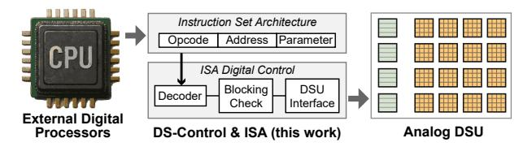
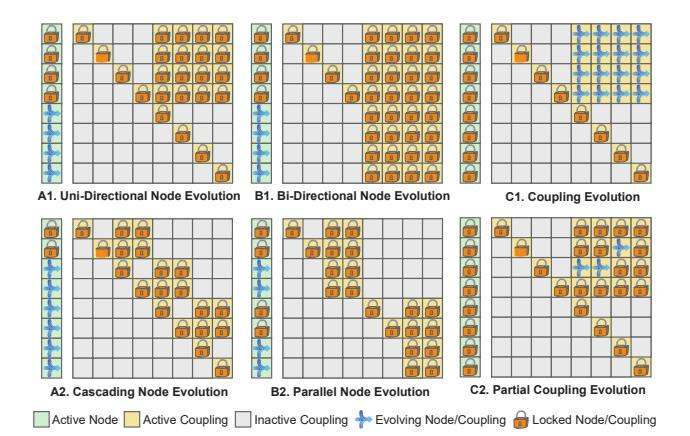

# DS-ISA: Instruction Set Architecture for Dynamical System Units

Chunshu Wu *PNNL* Richland, WA, USA chunshu.wu@pnnl.gov

Ruibing Song *Rice University* Houston, TX, USA rs307@rice.edu

Chuan Liu *Rice University* Houston, TX, USA cl320@rice.edu

Tong Geng *Rice University* Houston, TX, USA tg62@rice.edu

Ang Li *University of Washington* Seattle, WA, USA angli16@uw.edu

*Abstract*—Dynamical System Units (DSUs), leveraging CMOScompatible electronics and natural energy evolution, represent a promising post-Moore computing paradigm with potentially 105 energy-efficiency gains. However, the absence of standardized abstraction layers severely limits their programmability and broad adoption. In this paper, we present a fundamental effort to establish the first Instruction Set Architecture (ISA) for DSUs. This is achieved by comprehensively analyzing DSU execution patterns and fundamental functional operations across various application scenarios. Our analysis identifies a unified loadlock-evolve-store execution model. Based on this model, we propose a 9-instruction ISA that provides the desired abstraction and flexibility. Building on this ISA, we propose a supporting microarchitecture for DSU control. In particular, this work introduces a new group-based execution model and a two-level masking scheme to support effective resource sharing and unique execution patterns. By providing the ISA and the supporting microarchitecture, this work lays the foundation for constructing a software stack for DSUs.

### I. INTRODUCTION

As the exponential gains predicted by Moore's Law diminish, the growing demands of modern applications, especially in Machine Learning (ML) and scientific simulation, motivate the exploration of novel computing paradigms. A promising path is to employ dynamical systems as new processing units [30], implemented with CMOS-compatible electronics that operate at room temperature. In such a Dynamical System Unit (DSU), the physical system spontaneously evolves toward low-energy states within a specific energy landscape that embeds a targeted problem, and the resulting equilibrium represents nature's solution to this embedded problem, therefore enabling efficient computation without exotic materials or operating conditions. This paradigm has demonstrated substantial promise, typically delivering 103× speedup and 105× improvements in energy efficiency over conventional CPU/GPU-based systems across a range of critical application domains, such as ML [14], [16], [24], [29], [30], [36], [37], optimization [1], [26], and differential equation solving [15].

Despite the tremendous potential, the broad adoption of DSUs is hindered by the absence of standardized instruction abstraction layers. Current efforts to map application-level computational problems onto DSU hardware primarily rely on implementation-specific, ad-hoc methods, due to the lack of a well-defined programming model and a corresponding Instruction Set Architecture (ISA). A formal programming model is required to specify how developers interact with the DSU, including parameter configuration, execution initiation, and result retrieval. The corresponding ISA must then define the concrete hardware operations and states to implement the model. These abstraction layers are fundamental for enabling diverse DSU hardware designs and facilitating the development of essential software stacks like compilers and runtimes for DSUs and their integration into current computing systems.

However, the unique operating paradigm of a DSU requires a fundamentally distinct approach compared to conventional processors. Unlike CPUs or GPUs that execute discrete digital instructions [13], [31], [34], a DSU computes by leveraging the natural physical evolution of an interconnected analog system, guiding its continuous progression toward an equilibrium state. Controlling such a system is non-trivial, as it requires defining the overall behavior of nodes (variables) and couplings (variable interaction strength) while managing complex mechanisms such as synchronous evolution control and dynamic reconfiguration. Consequently, traditional abstractions based on sequential data manipulation are inadequate for programming DSUs, revealing the research gap of missing abstraction layers specifically designed for this unique computational paradigm. As Figure 1 illustrates, our goal in this work is to bridge traditional processors and DSUs via the design of an ISA and its associated digital control.

We begin by analyzing common operating patterns across diverse DSU applications, drawing from existing literature while also considering potential future use cases, to establish a foundation applicable to a wide range of current and anticipated workloads. This analysis highlights recurring essential tasks necessary to program DSUs: (1) dynamically configuring system connectivity for resource allocation, (2) loading initial states and parameters into components, (3) locking components to fixed values, (4) managing the synchronous, collective evolution, and (5) retrieving results from the system. Synthesizing these requirements, we propose a unified loadlock-evolve-store execution model with connection reconfigurability. Rather than forming a fixed linear pipeline, this model defines composable phases that can be arranged flexibly, supporting workflows ranging from simple sequential ML inference to complex iterative loops for training and multi-step simulations. Based on this model, we design a minimalist 9 instruction ISA that provides specific commands to configure topology, load/store analog states, lock boundary components, and trigger collective evolution, thereby fully addressing the identified control requirements.

Fig. 1. Overview and scope declaration of DS-Control & ISA (This work).

Additionally, the unique usage scenarios of DSUs impose specific challenges on their microarchitecture. (1) The potentially vast number of nodes and couplings required for modern ML tasks introduces significant control complexity. (2) Computational correctness for a variety of applications demands that the evolution of all participating nodes or couplings be executed synchronously. (3) Advanced workloads require support for multiple dynamical system instances, requiring mechanisms for co-evolution with dependency (e.g., multilayer ML inference) and concurrent execution of independent tasks to maximize DSU utilization. (4) Fine-grained partial configurability is necessary to support applications like ML model fine-tuning.

To satisfy these demands, we first draw inspiration from GPUs and organize nodes and couplings into **groups**, such that a single instruction operates on all elements within a group synchronously in lockstep. We further employ a two-level masking scheme: **inter-group masks** to manage synchronous evolution, and **intra-group masks** to selectively target individual elements for fine-grained partition and configuration.

By addressing these challenges, the critical gap between high-level applications and physical hardware is bridged, establishing the foundation for software stacks above and enabling standardized DSU implementations below, ultimately unlocking the DSU's orders-of-magnitude efficiency gains for a broad range of applications.

In this paper, we make the following key contributions:

- We perform an analysis of DSU applications, identifying essential programming tasks and proposing a unified loadlock-evolve-store execution model with connection reconfigurability to structure DSU computation.
- 2) Based on this model, we design a minimalist, yet comprehensive, 9-instruction ISA specifically tailored for DSUs, providing commands to manage both nodes and couplings through the defined execution phases.
- 3) We propose a microarchitecture that efficiently controls the ISA and interfaces with the DSU. This controller utilizes group-based synchronous execution and a two-level masking scheme to handle control complexity, synchronization, and fine-grained manipulation challenges inherent in managing the DSU.
- 4) Experimental results demonstrate that the proposed controller, operating at 4.6 Watts, efficiently orchestrates the full ISA for 1K nodes and 1M couplings across four representative applications.

#### II. BACKGROUND

#### A. Dynamical System Unit

**Physical Origin and Extension.** The conceptual foundation of DSUs lies in statistical physics, specifically, the Ising model [10]. Originally proposed to study ferromagnetism, the Ising model is extended to describe a system of globally interacting binary spins  $(\sigma_i \in \{-1, +1\})$  governed by an energy function, or Hamiltonian:

$$\mathcal{H}_{\text{Ising}} = -\sum_{i \neq j}^{N} J_{ij} \sigma_i \sigma_j - \sum_{i}^{N} h_i \sigma_i \tag{1}$$

Here,  $J_{ij}$  represents the coupling strength between spins  $\sigma_i$ and  $\sigma_i$ , describing how the interaction of the two spins contributes to the system's energy. The term  $h_i$  represents the external magnetic field acting on spin  $\sigma_i$ , corresponding to a bias applied on the spin toward a particular orientation independent of other spins. Physical implementations, known as Ising machines, aim to find the lowest energy state of this Hamiltonian, which often corresponds to the solution of complex combinatorial optimization problems mapped onto the model. Various technologies have been explored for realizing Ising machines, including quantum annealers [7], optical systems [9], [18], [39], and coupled oscillators [17] utilizing phase dynamics. Within the realm of CMOS-compatible approaches, BRIM [1] provides a particularly practical foundation - it represents spins as node values in voltage and implements the Hamiltonian parameters  $(J_{ij}, h_i)$  as coupling values in conductance. This approach offers a direct correspondence between the mathematical model and controllable hardware components, creating an accessible and readily extendable foundation for DSU development discussed in this work.

However, the binary nature of the Ising model ( $\sigma_i \in \{-1, +1\}$ ) limits its applicability to many modern computational tasks, particularly in AI and scientific computing, which inherently involve real-valued data. To address this limitation, building upon the practical CMOS foundation, the Hamiltonian was extended to support continuous variables. A key adaptation involves replacing the linear self-interaction term with a quadratic one, resulting in a Hamiltonian suitable for real-valued nodes:

$$\mathcal{H}_{DS} = -\sum_{i \neq j}^{N} J_{ij} \sigma_i \sigma_j + \frac{1}{2} \sum_{i}^{N} h_i \sigma_i^2$$
 (2)

In this formulation, the quadratic term  $h_i\sigma_i^2$  acts as an energy regulator, with  $h_i$  being the self-coupling strength. It prevents the system energy from diverging, allowing node values  $\sigma_i$  to stabilize at meaningful real-valued equilibrium points rather than saturating at boundaries. This extension enabled DSUs to be applied to a wide range of computationally intensive tasks, including graph learning [30], [37], on-device training [14], [36], Differential Equation (DE) solving [15], and large language model acceleration [29].

**DSU Operating Dynamics.** The DSU's operation is governed by its internal dynamics, which can be primarily divided

Fig. 2. General structure and datapath overview of DSU. Self-coupling h are on the diagonal line. The programming interfaces are the focus of this work.

into two modes: node evolution for computation (or inference) and coupling evolution for on-device configuration adaptation (or training). The abstracted node-coupling interconnect is shown in Figure 2(a).

The node evolution mode is the DSU's primary computational mechanism, leveraging natural evolution to find low-energy solutions. Based on the Hamiltonian  $\mathcal{H}_{\rm DS}$ , the system's dynamics are designed to guarantee convergence by ensuring the total energy spontaneously decreases over time  $(d\mathcal{H}_{\rm DS}/dt \leq 0).$  This is achieved by setting the node dynamics to follow the negative gradient of the Hamiltonian, such as  $d\sigma_i/dt \propto -\partial\mathcal{H}_{\rm DS}/\partial\sigma_i.$  This relation results in the following electrodynamic behavior:

$$\frac{d\sigma_i}{dt} \propto \sum_{j \neq i}^{N} (J_{ij} + J_{ji})\sigma_j - h_i \sigma_i \tag{3}$$

Intuitively, the right-hand side is in the form of an electric current that drives the voltage change to the left. During this process, the coupling parameters  $(J_{ij}, h_i)$  are held constant, and the node values  $\sigma_i$  naturally evolve to find the solution.

Following the BRIM convention [1], CMOS-based DSU implementations represent node states as voltages stored on capacitors, while the coupling parameters  $(J_{ij}, h_i)$  are implemented as programmable conductances. In this realization, currents flowing through the conductive couplings charge or discharge the node capacitors, causing the node voltages to evolve according to the interaction currents described in Equation 3. The evolution speed is therefore determined by circuit parameters such as node capacitance and coupling conductance, making the DSU dynamics a continuous-time process governed by the underlying analog circuit behavior. Recent work [36] has introduced a coupling evolution mode in DSUs to support parameter adaptation for on-device training. In this mode, the operating pattern is reversed: the node values are locked (e.g., clamped to ground-truth training data), while the coupling parameters are allowed to evolve. This mechanism is conceptually depicted in Figure 3 and compared with the inference data flow.

Note that a DSU generally consists of a set of N nodes and  $N^2$  programmable couplings. The examples in Figure 3 aim to show logical connection between input nodes and output

Fig. 3. Example DSU implementations for inference and training using the Electric-Current Loss method. Self-couplings are omitted for clarity.

nodes in a compact manner, without showing all couplings. The more general structure is in Figure 2.

In inference, input node voltages enter couplings to produce current signal  $I_{\rm in}^i = \sum J_{ij}\sigma_j$ , which further influences the i-th output node as Equation 3 suggests (the  $J_{ji}$  term is dropped as  $\sigma_j$  are constants in the context). At equilibrium,  $I_{\rm in}^i$  cancels with the internal current in the node  $I_{\rm R}^i = h_i\sigma_i$ , stabilizing the node value. While in training, since the output nodes are locked,  $I_{\rm R}^i$  is held constant, leading to the Electric-Current Loss (EC-Loss)  $I_{\rm loss}^i = I_{\rm in}^i - I_{\rm R}^i$  that directly represents the error or discrepancy for that node. The EC-Loss mechanism uses  $I_{\rm loss}$  in feedback loops to adjust the programmable conductances, minimizing the  $I_{\rm loss}$  and the corresponding loss function in training. This mechanism has been further extended to accommodate multiple network layers, demonstrating remarkable efficiency in DE alignment [15] and LLM training [29].

Equation 3 is derived by considering the general case in which all node states  $\sigma_i$  evolve according to the gradient of the Hamiltonian. In this case, the interaction between nodes i and j contributes through both coupling directions, since  $\sigma_i$  influences  $\sigma_j$  and  $\sigma_j$  influences  $\sigma_i$ . As a result, the gradient  $\partial \mathcal{H}_{\rm DS}/\partial \sigma_i$  contains both  $J_{ij}$  and  $J_{ji}$  terms, leading to the symmetric interaction term  $(J_{ij}+J_{ji})\sigma_j$  in Eq. 3. In certain applications, however, some nodes may be fixed as boundary conditions and no longer evolve. When a node  $\sigma_j$  is clamped, its state is not influenced by  $\sigma_i$ , and the corresponding reverse interaction term  $J_{ji}$  can be omitted.

Despite the representative operating dynamics for DSU, our focus is on the abstraction layers (the ISA and execution model) that sit above any single hardware implementation. We derive these by analyzing general operating patterns, rather than being tied to specific, low-level design choices.

**Control Mechanism.** These dynamic processes must be configured and managed externally. In foundational DSU designs, selector logic is employed to enable the programming of the DSU's components. This logic, implemented using pull-down networks as shown in Figure 2(b), activates a specific set of components (such as a column in the original work [1]) for programming. Configuration data, such as parameter values, are broadcast on a shared programming bus. The selector logic

then ensures that only the addressed components are activated to receive this data from the bus. In this work, a selector mechanism is treated as a default, foundational component in DSU. While this low-level control mechanism provides the essential hardware access, it is implementation-specific and not sufficiently abstracted for more general-purpose programming. It does, however, form the necessary foundation for a formal ISA to abstract hardware-specific steps into a standardized programming interface in Figure 2(b).

#### *B. Abstraction Layers: Programming Model and ISA*

Abstraction layers are fundamental in computing, providing standardized interfaces that separate software concerns from hardware implementation details, enabling portability and simplifying development [25], [32]. Conventional computing paradigms are built around established programming models and ISAs. The execution model for a host language like C is sequential, while its ISA (e.g., x86 [19] or RISC-V [4]) provides the corresponding discrete, digital instructions that manipulate data in registers and memory.

In the domain of parallel computing, programming models such as CUDA [22] or OpenMP [23] are invoked via an API, allowing a sequential host language to call upon a different, parallel execution model, e.g., Single Instruction, Multiple Data (SIMD) or Threads (SIMT). Notably, while these models differ in their parallelism, they all share a common, prescriptive foundation: computation is defined by a sequence of discrete digital operations (e.g., arithmetic, logical, memory) explicitly orchestrated by the program. In this paradigm, an execution model manages how these explicit operations are scheduled onto parallel digital hardware.

These traditional, prescriptive abstractions are fundamentally ill-suited for DSUs. As outlined in Section II-A, DSUs operate on a completely different computational paradigm: continuous-time analog evolution and collective relaxation toward a physical equilibrium state. In DSUs, computation is not prescribed as a sequence of arithmetic steps. Instead, it is configured by setting parameters and initiated as a synchronous physical process – an approach that differs entirely from the register, ALU, and memory management central to conventional ISAs. Consequently, programming a DSU demands a new abstraction layer that allows a conventional host to invoke and manage this unique operational principle.

#### III. INSTRUCTION SET ARCHITECTURE DESIGN

Figure 4 summarizes the basic operating patterns and extended operating pattern examples of DSU, where six operating cases are shown. In each case, for example, eight nodes are utilized, depicted as a vertical array. The lattice on the right corresponds to the DSU coupling matrix, where each grid position represents a pairwise interaction between two nodes. Specifically, the element at row i, column j represents the coupling from node i to node j. Algorithms are mapped to the DSU by assigning variables to nodes and encoding their interactions as couplings in the corresponding grid positions.

Fig. 4. First row: three basic operating patterns on DSU. Second row: three example extensions from the first row. Diagonal lines represent self-couplings that are usually activated and locked. In A1, output nodes are influenced only by input nodes. In B1, output nodes also have bidirectional interactions among themselves and therefore evolve collectively.

#### *A. Application Scenario Analysis*

Machine Learning. Many modern ML models, from Graph Neural Networks (GNNs) to LLMs, are built from a fundamental feed-forward operating pattern. This configuration is deployable on a DSU following the Uni-Directional Node Evolution (A1) pattern. As shown in Figure 4 (A1), the first four nodes are locked as input (lock icon), while the remaining four output nodes evolve (converging icon) according to the input nodes and the top-right couplings. Modern ML models typically have multiple layers, and the Cascading Node Evolution (A2) pattern shows an example of a three-layer model, where node groups are connected in a sequential, cascading manner to form a pipeline, supporting applications such as Deep Neural Network (DNN) inference [29].

Specific network architectures, such as Hopfield Networks [8] or certain Energy-Based Models (EBMs) [11], e.g., diffusion models [28], may require bi-directional interactions among a set of nodes. This scenario is compatible with the Bi-Directional Node Evolution (B1) pattern, where all nodes in the group are allowed to evolve collectively. Furthermore, to maximize hardware utilization, the Parallel Node Evolution (B2) pattern shows how the DSU can be partitioned to run multiple, independent tasks concurrently, such as performing a parallel search or running batched inference on multiple models at once. Note that this parallelization is not tied to bi-directional node evolution, but can be applied to all other operating patterns. Note that in A1, output nodes are influenced only by input nodes and do not interact among themselves, whereas in B1, output nodes also have bidirectional interactions among them and therefore evolve collectively.

In terms of ML training, the Coupling Evolution (C1) pattern offers the necessary capability for on-device parameter adaptation. This pattern is essentially the inverse of inference, where the nodes are clamped to the observed ground-truth data, allowing the coupling parameters to evolve and be modified. The 16 evolving positions correspond to couplings from the first four nodes to the remaining four nodes. This configuration models a common training scenario where the first set of nodes represents input variables and the second set represents output variables, and the couplings between them encode the trainable parameters. Additionally, the Partial Coupling Evolution (C2) pattern supports fine-tuning, a common scenario where only a subset of the couplings is allowed to evolve while the rest remain locked.

These operating patterns correspond directly to how machine learning models are executed on DS-based systems. For example, in DS-LLM [29], each neural network layer is mapped to a DS energy function, where model weights are encoded as coupling parameters between nodes. During inference, input nodes are fixed to represent the input features, while output nodes evolve through the couplings until the system reaches equilibrium, producing the layer output. This process follows the A1 pattern described above. Multi-layer models are then constructed by cascading multiple such stages, consistent with the A2 pattern. These examples illustrate that the patterns in Figure 4 represent general execution primitives underlying practical DS-based ML systems rather than application-specific designs.

Optimization. Rooted in Ising machines [1], [27], a DSU retains the capability to perform optimization tasks. The Bi-Directional Node Evolution (B1) pattern provides the foundation for this capability. It shows a set of bi-directionally connected nodes evolving collectively, allowing the system to relax toward a low-energy equilibrium state that represents the solution to a mapped optimization problem. To improve throughput, the Parallel Node Evolution (B2) pattern can be used to solve multiple, independent optimization problems (e.g., batched optimization tasks) simultaneously on different partitions of the DSU.

Solving Differential Equations. The DSU's ability to solve DEs also maps to the Bi-Directional Node Evolution (B1) pattern. During this process, the DSU's evolution is governed by its own intrinsic DE (such as Equation 3). By configuring the couplings, this inherent dynamic can be aligned to model a target DE [15], allowing the DSU to function as a natural DE solver for scientific computing and modeling physical systems. Similar to optimization, the Parallel Node Evolution (B2) pattern allows the DSU to efficiently solve a batch of DEs in parallel, each with different boundary conditions or parameters, which is a common requirement in scientific simulations.

# DS-ISA: Instruction Set Architecture for Dynamical System Units

Chunshu Wu *PNNL* Richland, WA, USA chunshu.wu@pnnl.gov

Ruibing Song *Rice University* Houston, TX, USA rs307@rice.edu

Chuan Liu *Rice University* Houston, TX, USA cl320@rice.edu

Tong Geng *Rice University* Houston, TX, USA tg62@rice.edu

Ang Li *University of Washington* Seattle, WA, USA angli16@uw.edu

*Abstract*—Dynamical System Units (DSUs), leveraging CMOScompatible electronics and natural energy evolution, represent a promising post-Moore computing paradigm with potentially 105 energy-efficiency gains. However, the absence of standardized abstraction layers severely limits their programmability and broad adoption. In this paper, we present a fundamental effort to establish the first Instruction Set Architecture (ISA) for DSUs. This is achieved by comprehensively analyzing DSU execution patterns and fundamental functional operations across various application scenarios. Our analysis identifies a unified loadlock-evolve-store execution model. Based on this model, we propose a 9-instruction ISA that provides the desired abstraction and flexibility. Building on this ISA, we propose a supporting microarchitecture for DSU control. In particular, this work introduces a new group-based execution model and a two-level masking scheme to support effective resource sharing and unique execution patterns. By providing the ISA and the supporting microarchitecture, this work lays the foundation for constructing a software stack for DSUs.

### I. INTRODUCTION

As the exponential gains predicted by Moore's Law diminish, the growing demands of modern applications, especially in Machine Learning (ML) and scientific simulation, motivate the exploration of novel computing paradigms. A promising path is to employ dynamical systems as new processing units [30], implemented with CMOS-compatible electronics that operate at room temperature. In such a Dynamical System Unit (DSU), the physical system spontaneously evolves toward low-energy states within a specific energy landscape that embeds a targeted problem, and the resulting equilibrium represents nature's solution to this embedded problem, therefore enabling efficient computation without exotic materials or operating conditions. This paradigm has demonstrated substantial promise, typically delivering 103× speedup and 105× improvements in energy efficiency over conventional CPU/GPU-based systems across a range of critical application domains, such as ML [14], [16], [24], [29], [30], [36], [37], optimization [1], [26], and differential equation solving [15].

Despite the tremendous potential, the broad adoption of DSUs is hindered by the absence of standardized instruction abstraction layers. Current efforts to map application-level computational problems onto DSU hardware primarily rely on implementation-specific, ad-hoc methods, due to the lack of a well-defined programming model and a corresponding Instruction Set Architecture (ISA). A formal programming model is required to specify how developers interact with the DSU, including parameter configuration, execution initiation, and result retrieval. The corresponding ISA must then define the concrete hardware operations and states to implement the model. These abstraction layers are fundamental for enabling diverse DSU hardware designs and facilitating the development of essential software stacks like compilers and runtimes for DSUs and their integration into current computing systems.

However, the unique operating paradigm of a DSU requires a fundamentally distinct approach compared to conventional processors. Unlike CPUs or GPUs that execute discrete digital instructions [13], [31], [34], a DSU computes by leveraging the natural physical evolution of an interconnected analog system, guiding its continuous progression toward an equilibrium state. Controlling such a system is non-trivial, as it requires defining the overall behavior of nodes (variables) and couplings (variable interaction strength) while managing complex mechanisms such as synchronous evolution control and dynamic reconfiguration. Consequently, traditional abstractions based on sequential data manipulation are inadequate for programming DSUs, revealing the research gap of missing abstraction layers specifically designed for this unique computational paradigm. As Figure 1 illustrates, our goal in this work is to bridge traditional processors and DSUs via the design of an ISA and its associated digital control.

We begin by analyzing common operating patterns across diverse DSU applications, drawing from existing literature while also considering potential future use cases, to establish a foundation applicable to a wide range of current and anticipated workloads. This analysis highlights recurring essential tasks necessary to program DSUs: (1) dynamically configuring system connectivity for resource allocation, (2) loading initial states and parameters into components, (3) locking components to fixed values, (4) managing the synchronous, collective evolution, and (5) retrieving results from the system. Synthesizing these requirements, we propose a unified loadlock-evolve-store execution model with connection reconfigurability. Rather than forming a fixed linear pipeline, this model defines composable phases that can be arranged flexibly, supporting workflows ranging from simple sequential ML inference to complex iterative loops for training and multi-step simulations. Based on this model, we design a minimalist 9 instruction ISA that provides specific commands to configure topology, load/store analog states, lock boundary components, and trigger collective evolution, thereby fully addressing the identified control requirements.

Fig. 1. Overview and scope declaration of DS-Control & ISA (This work).

Additionally, the unique usage scenarios of DSUs impose specific challenges on their microarchitecture. (1) The potentially vast number of nodes and couplings required for modern ML tasks introduces significant control complexity. (2) Computational correctness for a variety of applications demands that the evolution of all participating nodes or couplings be executed synchronously. (3) Advanced workloads require support for multiple dynamical system instances, requiring mechanisms for co-evolution with dependency (e.g., multilayer ML inference) and concurrent execution of independent tasks to maximize DSU utilization. (4) Fine-grained partial configurability is necessary to support applications like ML model fine-tuning.

To satisfy these demands, we first draw inspiration from GPUs and organize nodes and couplings into **groups**, such that a single instruction operates on all elements within a group synchronously in lockstep. We further employ a two-level masking scheme: **inter-group masks** to manage synchronous evolution, and **intra-group masks** to selectively target individual elements for fine-grained partition and configuration.

By addressing these challenges, the critical gap between high-level applications and physical hardware is bridged, establishing the foundation for software stacks above and enabling standardized DSU implementations below, ultimately unlocking the DSU's orders-of-magnitude efficiency gains for a broad range of applications.

In this paper, we make the following key contributions:

- We perform an analysis of DSU applications, identifying essential programming tasks and proposing a unified loadlock-evolve-store execution model with connection reconfigurability to structure DSU computation.
- 2) Based on this model, we design a minimalist, yet comprehensive, 9-instruction ISA specifically tailored for DSUs, providing commands to manage both nodes and couplings through the defined execution phases.
- 3) We propose a microarchitecture that efficiently controls the ISA and interfaces with the DSU. This controller utilizes group-based synchronous execution and a two-level masking scheme to handle control complexity, synchronization, and fine-grained manipulation challenges inherent in managing the DSU.
- 4) Experimental results demonstrate that the proposed controller, operating at 4.6 Watts, efficiently orchestrates the full ISA for 1K nodes and 1M couplings across four representative applications.

#### II. BACKGROUND

#### A. Dynamical System Unit

**Physical Origin and Extension.** The conceptual foundation of DSUs lies in statistical physics, specifically, the Ising model [10]. Originally proposed to study ferromagnetism, the Ising model is extended to describe a system of globally interacting binary spins  $(\sigma_i \in \{-1, +1\})$  governed by an energy function, or Hamiltonian:

$$\mathcal{H}_{\text{Ising}} = -\sum_{i \neq j}^{N} J_{ij} \sigma_i \sigma_j - \sum_{i}^{N} h_i \sigma_i \tag{1}$$

Here,  $J_{ij}$  represents the coupling strength between spins  $\sigma_i$ and  $\sigma_i$ , describing how the interaction of the two spins contributes to the system's energy. The term  $h_i$  represents the external magnetic field acting on spin  $\sigma_i$ , corresponding to a bias applied on the spin toward a particular orientation independent of other spins. Physical implementations, known as Ising machines, aim to find the lowest energy state of this Hamiltonian, which often corresponds to the solution of complex combinatorial optimization problems mapped onto the model. Various technologies have been explored for realizing Ising machines, including quantum annealers [7], optical systems [9], [18], [39], and coupled oscillators [17] utilizing phase dynamics. Within the realm of CMOS-compatible approaches, BRIM [1] provides a particularly practical foundation - it represents spins as node values in voltage and implements the Hamiltonian parameters  $(J_{ij}, h_i)$  as coupling values in conductance. This approach offers a direct correspondence between the mathematical model and controllable hardware components, creating an accessible and readily extendable foundation for DSU development discussed in this work.

However, the binary nature of the Ising model ( $\sigma_i \in \{-1, +1\}$ ) limits its applicability to many modern computational tasks, particularly in AI and scientific computing, which inherently involve real-valued data. To address this limitation, building upon the practical CMOS foundation, the Hamiltonian was extended to support continuous variables. A key adaptation involves replacing the linear self-interaction term with a quadratic one, resulting in a Hamiltonian suitable for real-valued nodes:

$$\mathcal{H}_{DS} = -\sum_{i \neq j}^{N} J_{ij} \sigma_i \sigma_j + \frac{1}{2} \sum_{i}^{N} h_i \sigma_i^2$$
 (2)

In this formulation, the quadratic term  $h_i\sigma_i^2$  acts as an energy regulator, with  $h_i$  being the self-coupling strength. It prevents the system energy from diverging, allowing node values  $\sigma_i$  to stabilize at meaningful real-valued equilibrium points rather than saturating at boundaries. This extension enabled DSUs to be applied to a wide range of computationally intensive tasks, including graph learning [30], [37], on-device training [14], [36], Differential Equation (DE) solving [15], and large language model acceleration [29].

**DSU Operating Dynamics.** The DSU's operation is governed by its internal dynamics, which can be primarily divided

Fig. 2. General structure and datapath overview of DSU. Self-coupling h are on the diagonal line. The programming interfaces are the focus of this work.

into two modes: node evolution for computation (or inference) and coupling evolution for on-device configuration adaptation (or training). The abstracted node-coupling interconnect is shown in Figure 2(a).

The node evolution mode is the DSU's primary computational mechanism, leveraging natural evolution to find low-energy solutions. Based on the Hamiltonian  $\mathcal{H}_{\rm DS}$ , the system's dynamics are designed to guarantee convergence by ensuring the total energy spontaneously decreases over time  $(d\mathcal{H}_{\rm DS}/dt \leq 0).$  This is achieved by setting the node dynamics to follow the negative gradient of the Hamiltonian, such as  $d\sigma_i/dt \propto -\partial\mathcal{H}_{\rm DS}/\partial\sigma_i.$  This relation results in the following electrodynamic behavior:

$$\frac{d\sigma_i}{dt} \propto \sum_{j \neq i}^{N} (J_{ij} + J_{ji})\sigma_j - h_i \sigma_i \tag{3}$$

Intuitively, the right-hand side is in the form of an electric current that drives the voltage change to the left. During this process, the coupling parameters  $(J_{ij}, h_i)$  are held constant, and the node values  $\sigma_i$  naturally evolve to find the solution.

Following the BRIM convention [1], CMOS-based DSU implementations represent node states as voltages stored on capacitors, while the coupling parameters  $(J_{ij}, h_i)$  are implemented as programmable conductances. In this realization, currents flowing through the conductive couplings charge or discharge the node capacitors, causing the node voltages to evolve according to the interaction currents described in Equation 3. The evolution speed is therefore determined by circuit parameters such as node capacitance and coupling conductance, making the DSU dynamics a continuous-time process governed by the underlying analog circuit behavior. Recent work [36] has introduced a coupling evolution mode in DSUs to support parameter adaptation for on-device training. In this mode, the operating pattern is reversed: the node values are locked (e.g., clamped to ground-truth training data), while the coupling parameters are allowed to evolve. This mechanism is conceptually depicted in Figure 3 and compared with the inference data flow.

Note that a DSU generally consists of a set of N nodes and  $N^2$  programmable couplings. The examples in Figure 3 aim to show logical connection between input nodes and output

Fig. 3. Example DSU implementations for inference and training using the Electric-Current Loss method. Self-couplings are omitted for clarity.

nodes in a compact manner, without showing all couplings. The more general structure is in Figure 2.

In inference, input node voltages enter couplings to produce current signal  $I_{\rm in}^i = \sum J_{ij}\sigma_j$ , which further influences the i-th output node as Equation 3 suggests (the  $J_{ji}$  term is dropped as  $\sigma_j$  are constants in the context). At equilibrium,  $I_{\rm in}^i$  cancels with the internal current in the node  $I_{\rm R}^i = h_i\sigma_i$ , stabilizing the node value. While in training, since the output nodes are locked,  $I_{\rm R}^i$  is held constant, leading to the Electric-Current Loss (EC-Loss)  $I_{\rm loss}^i = I_{\rm in}^i - I_{\rm R}^i$  that directly represents the error or discrepancy for that node. The EC-Loss mechanism uses  $I_{\rm loss}$  in feedback loops to adjust the programmable conductances, minimizing the  $I_{\rm loss}$  and the corresponding loss function in training. This mechanism has been further extended to accommodate multiple network layers, demonstrating remarkable efficiency in DE alignment [15] and LLM training [29].

Equation 3 is derived by considering the general case in which all node states  $\sigma_i$  evolve according to the gradient of the Hamiltonian. In this case, the interaction between nodes i and j contributes through both coupling directions, since  $\sigma_i$  influences  $\sigma_j$  and  $\sigma_j$  influences  $\sigma_i$ . As a result, the gradient  $\partial \mathcal{H}_{\rm DS}/\partial \sigma_i$  contains both  $J_{ij}$  and  $J_{ji}$  terms, leading to the symmetric interaction term  $(J_{ij}+J_{ji})\sigma_j$  in Eq. 3. In certain applications, however, some nodes may be fixed as boundary conditions and no longer evolve. When a node  $\sigma_j$  is clamped, its state is not influenced by  $\sigma_i$ , and the corresponding reverse interaction term  $J_{ji}$  can be omitted.

Despite the representative operating dynamics for DSU, our focus is on the abstraction layers (the ISA and execution model) that sit above any single hardware implementation. We derive these by analyzing general operating patterns, rather than being tied to specific, low-level design choices.

**Control Mechanism.** These dynamic processes must be configured and managed externally. In foundational DSU designs, selector logic is employed to enable the programming of the DSU's components. This logic, implemented using pull-down networks as shown in Figure 2(b), activates a specific set of components (such as a column in the original work [1]) for programming. Configuration data, such as parameter values, are broadcast on a shared programming bus. The selector logic

then ensures that only the addressed components are activated to receive this data from the bus. In this work, a selector mechanism is treated as a default, foundational component in DSU. While this low-level control mechanism provides the essential hardware access, it is implementation-specific and not sufficiently abstracted for more general-purpose programming. It does, however, form the necessary foundation for a formal ISA to abstract hardware-specific steps into a standardized programming interface in Figure 2(b).

#### *B. Abstraction Layers: Programming Model and ISA*

Abstraction layers are fundamental in computing, providing standardized interfaces that separate software concerns from hardware implementation details, enabling portability and simplifying development [25], [32]. Conventional computing paradigms are built around established programming models and ISAs. The execution model for a host language like C is sequential, while its ISA (e.g., x86 [19] or RISC-V [4]) provides the corresponding discrete, digital instructions that manipulate data in registers and memory.

In the domain of parallel computing, programming models such as CUDA [22] or OpenMP [23] are invoked via an API, allowing a sequential host language to call upon a different, parallel execution model, e.g., Single Instruction, Multiple Data (SIMD) or Threads (SIMT). Notably, while these models differ in their parallelism, they all share a common, prescriptive foundation: computation is defined by a sequence of discrete digital operations (e.g., arithmetic, logical, memory) explicitly orchestrated by the program. In this paradigm, an execution model manages how these explicit operations are scheduled onto parallel digital hardware.

These traditional, prescriptive abstractions are fundamentally ill-suited for DSUs. As outlined in Section II-A, DSUs operate on a completely different computational paradigm: continuous-time analog evolution and collective relaxation toward a physical equilibrium state. In DSUs, computation is not prescribed as a sequence of arithmetic steps. Instead, it is configured by setting parameters and initiated as a synchronous physical process – an approach that differs entirely from the register, ALU, and memory management central to conventional ISAs. Consequently, programming a DSU demands a new abstraction layer that allows a conventional host to invoke and manage this unique operational principle.

#### III. INSTRUCTION SET ARCHITECTURE DESIGN

Figure 4 summarizes the basic operating patterns and extended operating pattern examples of DSU, where six operating cases are shown. In each case, for example, eight nodes are utilized, depicted as a vertical array. The lattice on the right corresponds to the DSU coupling matrix, where each grid position represents a pairwise interaction between two nodes. Specifically, the element at row i, column j represents the coupling from node i to node j. Algorithms are mapped to the DSU by assigning variables to nodes and encoding their interactions as couplings in the corresponding grid positions.

Fig. 4. First row: three basic operating patterns on DSU. Second row: three example extensions from the first row. Diagonal lines represent self-couplings that are usually activated and locked. In A1, output nodes are influenced only by input nodes. In B1, output nodes also have bidirectional interactions among themselves and therefore evolve collectively.

#### *A. Application Scenario Analysis*

Machine Learning. Many modern ML models, from Graph Neural Networks (GNNs) to LLMs, are built from a fundamental feed-forward operating pattern. This configuration is deployable on a DSU following the Uni-Directional Node Evolution (A1) pattern. As shown in Figure 4 (A1), the first four nodes are locked as input (lock icon), while the remaining four output nodes evolve (converging icon) according to the input nodes and the top-right couplings. Modern ML models typically have multiple layers, and the Cascading Node Evolution (A2) pattern shows an example of a three-layer model, where node groups are connected in a sequential, cascading manner to form a pipeline, supporting applications such as Deep Neural Network (DNN) inference [29].

Specific network architectures, such as Hopfield Networks [8] or certain Energy-Based Models (EBMs) [11], e.g., diffusion models [28], may require bi-directional interactions among a set of nodes. This scenario is compatible with the Bi-Directional Node Evolution (B1) pattern, where all nodes in the group are allowed to evolve collectively. Furthermore, to maximize hardware utilization, the Parallel Node Evolution (B2) pattern shows how the DSU can be partitioned to run multiple, independent tasks concurrently, such as performing a parallel search or running batched inference on multiple models at once. Note that this parallelization is not tied to bi-directional node evolution, but can be applied to all other operating patterns. Note that in A1, output nodes are influenced only by input nodes and do not interact among themselves, whereas in B1, output nodes also have bidirectional interactions among them and therefore evolve collectively.

In terms of ML training, the Coupling Evolution (C1) pattern offers the necessary capability for on-device parameter adaptation. This pattern is essentially the inverse of inference, where the nodes are clamped to the observed ground-truth data, allowing the coupling parameters to evolve and be modified. The 16 evolving positions correspond to couplings from the first four nodes to the remaining four nodes. This configuration models a common training scenario where the first set of nodes represents input variables and the second set represents output variables, and the couplings between them encode the trainable parameters. Additionally, the Partial Coupling Evolution (C2) pattern supports fine-tuning, a common scenario where only a subset of the couplings is allowed to evolve while the rest remain locked.

These operating patterns correspond directly to how machine learning models are executed on DS-based systems. For example, in DS-LLM [29], each neural network layer is mapped to a DS energy function, where model weights are encoded as coupling parameters between nodes. During inference, input nodes are fixed to represent the input features, while output nodes evolve through the couplings until the system reaches equilibrium, producing the layer output. This process follows the A1 pattern described above. Multi-layer models are then constructed by cascading multiple such stages, consistent with the A2 pattern. These examples illustrate that the patterns in Figure 4 represent general execution primitives underlying practical DS-based ML systems rather than application-specific designs.

Optimization. Rooted in Ising machines [1], [27], a DSU retains the capability to perform optimization tasks. The Bi-Directional Node Evolution (B1) pattern provides the foundation for this capability. It shows a set of bi-directionally connected nodes evolving collectively, allowing the system to relax toward a low-energy equilibrium state that represents the solution to a mapped optimization problem. To improve throughput, the Parallel Node Evolution (B2) pattern can be used to solve multiple, independent optimization problems (e.g., batched optimization tasks) simultaneously on different partitions of the DSU.

Solving Differential Equations. The DSU's ability to solve DEs also maps to the Bi-Directional Node Evolution (B1) pattern. During this process, the DSU's evolution is governed by its own intrinsic DE (such as Equation 3). By configuring the couplings, this inherent dynamic can be aligned to model a target DE [15], allowing the DSU to function as a natural DE solver for scientific computing and modeling physical systems. Similar to optimization, the Parallel Node Evolution (B2) pattern allows the DSU to efficiently solve a batch of DEs in parallel, each with different boundary conditions or parameters, which is a common requirement in scientific simulations.

